

<a href="https://evolink.ai/claude-opus-5-5?utm_source=github&amp;utm_medium=banner&amp;utm_campaign=awesome-claude-opus-5-5-usecases&amp;utm_content=readme_banner">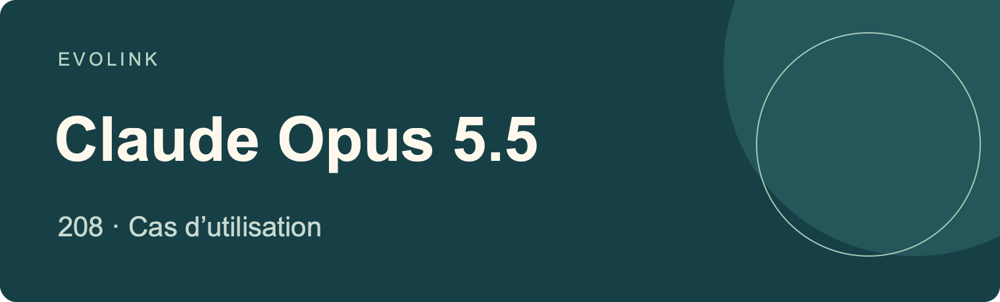</a>

# Cas d’usage de Claude Opus 5.5
Méthodes, démonstrations, comparaisons et limites documentées par leurs sources

## 🍌 Introduction

**Découvrez ce que des utilisateurs ont créé et testé avec Claude Opus 5.5 : jeux, scènes 3D, outils de programmation, recherche et projets créatifs. Chaque entrée renvoie à sa source et conserve les limites des affirmations originales.**

[Découvrir Claude Opus 5.5 sur EvoLink](https://evolink.ai/claude-opus-5-5?utm_source=github&utm_medium=readme&utm_campaign=awesome-claude-opus-5-5-usecases&utm_content=introduction_cta)

## 📊 Vue d’ensemble

**208 cas sélectionnés autour de Claude Opus 5.5**, couvrant la création, le développement, la recherche et l’évaluation.

- Découvrez des guides officiels ainsi que des démonstrations communautaires, des méthodes, des comparaisons et des limites documentées.
- Chaque entrée comporte la source originale, son éditeur, sa date de publication, un enseignement concis et des notes fondées sur la source.
- Utilisez le sommaire pour examiner une tâche, puis consultez sa source pour connaître les outils, les entrées et les résultats divulgués.

> [!NOTE]
> Ces comptes rendus sont attribués à leurs sources ; ils ne constituent pas des reproductions indépendantes. Les vidéos et graphismes réalisés avec des outils ne prouvent pas une génération native de médias. Les comparaisons promotionnelles restent attribuées à leurs auteurs ; plusieurs publications ne constituent pas des expériences indépendantes. Les dates ci-dessous sont les dates de publication des sources (UTC), et non les dates d’importation.

## ⚡ Prise en main

1. [Ouvrir la page du modèle pour vérifier les conditions d’accès et les capacités actuelles](https://evolink.ai/claude-opus-5-5?utm_source=github&utm_medium=quickstart&utm_campaign=awesome-claude-opus-5-5-usecases&utm_content=model_link)
2. [Créer une clé API dans le tableau de bord EvoLink](https://evolink.ai/dashboard/keys?utm_source=github&utm_medium=quickstart&utm_campaign=awesome-claude-opus-5-5-usecases&utm_content=api_key)
3. [Suivre le guide API propre au modèle ou les instructions pour agents accessibles depuis sa page](https://evolink.ai/docs/en/api-manual/language-series/claude/claude-messages-api?utm_source=github&utm_medium=docs&utm_campaign=awesome-claude-opus-5-5-usecases&utm_content=first_run)

## 📑 Sommaire

| [Vue d’ensemble](#overview) | [Prise en main](#quick-start) | [Dépôts associés](#related-repositories) | [Remerciements](#acknowledge) |
|---|---|---|---|

| Cas | Catégorie | Ce que le cas montre | Type |
|---|---|---|---|
| [Cas 1: Un court métrage sur une pastèque relayé officiellement](#case-1) | [Guides et présentations officiels](#category-official) | Utilisez ce court métrage relayé officiellement comme référence narrative, tout en gardant à l’esprit que sa réalisation reste non documentée. | Demo |
| [Cas 2: Déléguer une tâche complète](#case-2) | [Guides et présentations officiels](#category-official) | Définissez les critères de réussite et les points de suivi avant de déléguer une tâche entière. | Tutorial |
| [Cas 3: Comparaison de jeux de samouraï](#case-3) | [Développement de jeux](#category-games) | Comparez les jeux de samouraï en tenant compte de la promotion de plateforme réalisée par leur éditeur. | Evaluation |
| [Cas 4: Démonstration de Mario Kart en une seule passe](#case-4) | [Développement de jeux](#category-games) | Examinez les personnages jouables de ce jeu de kart présenté comme réalisé en une passe avant d’adopter le jugement qualitatif de la plateforme. | Demo |
| [Cas 5: Un clone de Minecraft dans le navigateur](#case-5) | [Développement de jeux](#category-games) | Examinez la démonstration de Minecraft dans le navigateur pour voir le résultat de cette tentative de génération de jeu. | Demo |
| [Cas 6: Un jeu mécanique dans un seul fichier HTML](#case-6) | [Développement de jeux](#category-games) | Envisagez un fichier HTML unique pour les visuels et les sons procéduraux d’un jeu, comme l’illustre cette démonstration de plateforme. | Demo |
| [Cas 7: Un jeu de combat anime avec Roblox toolbox](#case-7) | [Développement de jeux](#category-games) | Tenez compte des ressources de Roblox toolbox pour évaluer ce jeu de combat annoncé comme réalisé en une passe. | Demo |
| [Cas 8: Comparaison de trois modèles sur un jeu Spider-Man](#case-8) | [Développement de jeux](#category-games) | Comparez les trois jeux Spider-Man sur les mêmes caractéristiques de jeu visibles. | Evaluation |
| [Cas 9: Un clone de Minecraft avec physique de l’eau](#case-9) | [Développement de jeux](#category-games) | Mettez en balance le résultat annoncé pour la physique de l’eau et la durée d’exécution supérieure signalée par l’auteur. | Demo |
| [Cas 10: Scènes à la première personne de DEAD SIGNAL](#case-10) | [Développement de jeux](#category-games) | Examinez les scènes à la première personne obtenues avec la même consigne en distinguant les jugements qualitatifs de la plateforme. | Evaluation |
| [Cas 11: Un jeu d’apiculture dessiné par le code](#case-11) | [Développement de jeux](#category-games) | Prenez la démonstration d’apiculture comme référence pour dessiner les éléments d’un jeu et programmer ses mécaniques. | Demo |
| [Cas 12: Démonstration d’un jeu Snake](#case-12) | [Développement de jeux](#category-games) | Examinez ce Snake comme un exemple compact de logique et de présentation de jeu générées. | Demo |
| [Cas 13: Comparaison de jeux 3D avec Sol](#case-13) | [Développement de jeux](#category-games) | Comparez les jeux 3D présentés sans prendre la préférence de la plateforme pour une évaluation indépendante. | Evaluation |
| [Cas 14: Billard multijoueur et mode spectateur](#case-14) | [Développement de jeux](#category-games) | Vérifiez le jeu de billard accessible par lien avant de vous fier aux modes multijoueurs et à l’activité annoncés. | Demo |
| [Cas 15: Un jeu d’arcade via l’API Higgsfield](#case-15) | [Développement de jeux](#category-games) | Examinez les reflets sur l’eau et le jeu d’arcade dans cette démonstration de plateforme fondée sur son API. | Integration |
| [Cas 16: Recréer Minecraft dans un navigateur](#case-16) | [Développement de jeux](#category-games) | Utilisez cette recréation dans le navigateur pour évaluer l’étendue visible de la tentative de clone de Minecraft. | Demo |
| [Cas 17: Tondre la pelouse avec les spectateurs d’un direct](#case-17) | [Développement de jeux](#category-games) | Envisagez d’inviter les spectateurs d’un direct à tester un prototype multijoueur sur un serveur personnel. | Demo |
| [Cas 18: Un jeu de tir griffonné avec un boss final](#case-18) | [Développement de jeux](#category-games) | Examinez comment ce jeu de tir annoncé comme réalisé en une passe associe un style griffonné à un boss final. | Demo |
| [Cas 19: Un jeu Mario avec le réglage Medium](#case-19) | [Développement de jeux](#category-games) | Prenez cette démonstration de Mario comme référence pour une génération de jeu avec l’effort Medium. | Demo |
| [Cas 20: Comparaison de séquences de course de karts](#case-20) | [Développement de jeux](#category-games) | Comparez les séquences de course de karts selon le comportement visible du jeu, sans en déduire des capacités générales du modèle. | Evaluation |
| [Cas 21: Jeux comparés à GPT-6 Sol avec la même consigne](#case-21) | [Développement de jeux](#category-games) | Consultez les jeux liés, créés avec la même consigne, pour comparer leur expérience de jeu réelle. | Evaluation |
| [Cas 22: Snake généré en une seule passe](#case-22) | [Développement de jeux](#category-games) | Utilisez ce Snake annoncé comme généré en une passe comme référence de génération à petite échelle. | Demo |
| [Cas 23: Des mécaniques de jeu de zombies en Three.js](#case-23) | [Développement de jeux](#category-games) | Étudiez la démonstration Three.js pour ses mécaniques, textures et sons générés sans fichiers de ressources. | Demo |
| [Cas 24: Un jeu de neige affiné en deux passes](#case-24) | [Développement de jeux](#category-games) | Prévoyez des étapes d’amélioration et du temps d’exécution pour un jeu de neige aux effets visuels et sonores coordonnés. | Demo |
| [Cas 25: Fonctionnalités de jeu et montage d’une bande-annonce](#case-25) | [Développement de jeux](#category-games) | Examinez le jeu jouable avec sa bande-annonce en conservant la mention du partenariat déclarée par l’auteur. | Demo |
| [Cas 26: Une île de survie multijoueur dans Tesana](#case-26) | [Développement de jeux](#category-games) | Vérifiez les systèmes multijoueurs de l’île Tesana avant de vous fier à la durée de jeu annoncée. | Demo |
| [Cas 27: Comparaison de jeux sous Unreal Engine](#case-27) | [Développement de jeux](#category-games) | Comparez les jeux Unreal Engine dans le contexte de la méthode proposée par la plateforme Higgsfield. | Evaluation |
| [Cas 28: Un RPG de dark fantasy dans Tesana](#case-28) | [Développement de jeux](#category-games) | Examinez comment le RPG Tesana combine zones, quêtes et dialogues doublés, en conservant l’incertitude sur le partenariat. | Demo |
| [Cas 29: Une boutique de guitares avec bagarres déclenchées par le bruit](#case-29) | [Développement de jeux](#category-games) | Testez les performances avant d’étendre un simulateur de boutique Three.js à des centaines de modèles de guitares jouables. | Demo |
| [Cas 30: Échecs dessinés à la main et analyse des coups](#case-30) | [Développement de jeux](#category-games) | Examinez comment cette démonstration d’échecs combine un aspect dessiné à la main et l’analyse des coups. | Demo |
| [Cas 31: Un simulateur de vol comparé à Kimi K3](#case-31) | [Développement de jeux](#category-games) | Comparez à la fois le comportement des simulateurs de vol et leur coût annoncé pour choisir entre les deux résultats. | Evaluation |
| [Cas 32: Un monde fantastique dans Tesana en une consigne](#case-32) | [Développement de jeux](#category-games) | Examinez le monde fantastique Tesana pour observer le résultat combinant jeu, audio et interface de la plateforme. | Demo |
| [Cas 33: Un jeu de tir à l’arc construit en moins de dix minutes](#case-33) | [Développement de jeux](#category-games) | Examinez le jeu de tir à l’arc déployé avant de généraliser sa durée de réalisation annoncée de moins de dix minutes. | Demo |
| [Cas 34: Comparaisons de clones de Minecraft et Warcraft](#case-34) | [Développement de jeux](#category-games) | Comparez les jeux publiés et leurs consignes en conservant le contexte de l’effort, du temps d’exécution et des coûts estimés. | Evaluation |
| [Cas 35: Score et coût sur Runescape Bench](#case-35) | [Développement de jeux](#category-games) | Interprétez le prix et le classement annoncés sur Runescape Bench uniquement pour ses tâches de jeu. | Evaluation |
| [Cas 36: Un fond d’écran interactif de récif corallien](#case-36) | [Apprentissage interactif et visualisation](#category-education) | Prenez l’interaction permettant de nourrir les poissons comme référence pour rendre interactif un fond d’écran d’ambiance. | Demo |
| [Cas 37: Une simulation d’eau issue d’un direct](#case-37) | [Apprentissage interactif et visualisation](#category-education) | Examinez la simulation d’eau présentée comme l’un des résultats d’une session en direct plus longue. | Demo |
| [Cas 38: Recréer de l’eau en 3D à partir d’une vidéo](#case-38) | [Apprentissage interactif et visualisation](#category-education) | Comparez l’eau recréée à la vidéo de référence avant d’adopter le jugement de fidélité de l’auteur. | Demo |
| [Cas 39: Explorer l’anatomie de la main par couches](#case-39) | [Apprentissage interactif et visualisation](#category-education) | Examinez l’interface anatomique par couches sans vous fier à ses suggestions non validées sur la douleur ou la récupération. | Demo |
| [Cas 40: Un simulateur pour toucher de l’herbe dans Kilo Code](#case-40) | [Apprentissage interactif et visualisation](#category-education) | Comparez les simulateurs pour toucher de l’herbe en tenant compte des coûts par exécution déclarés par la plateforme. | Evaluation |
| [Cas 41: D’un croquis de trébuchet à une simulation](#case-41) | [Apprentissage interactif et visualisation](#category-education) | Utilisez ce trébuchet comme référence de passage du croquis à la simulation tout en conservant son statut de présentation de seconde main. | Demo |
| [Cas 42: Rails et mécanismes à pendules](#case-42) | [Apprentissage interactif et visualisation](#category-education) | Distinguez le temps d’exécution API du temps écoulé sans activité pour estimer le coût d’une simulation mécanique. | Demo |
| [Cas 43: Des visages sous différentes gravités](#case-43) | [Apprentissage interactif et visualisation](#category-education) | Examinez la démonstration de visages soumis à la gravité en conservant la mention de partenariat possible. | Demo |
| [Cas 44: Expliquer le Web avec des pages reliées](#case-44) | [Apprentissage interactif et visualisation](#category-education) | Envisagez des pages HTML reliées pour une explication explorable, en prévoyant la longue exécution annoncée. | Demo |
| [Cas 45: Une page pédagogique pour explorer un œil en 3D](#case-45) | [Apprentissage interactif et visualisation](#category-education) | Prenez cette démonstration explorable de l’œil comme référence pour une interface pédagogique 3D par couches. | Evaluation |
| [Cas 46: Une échelle interactive de l’univers inachevée](#case-46) | [Apprentissage interactif et visualisation](#category-education) | Définissez des points de contrôle de consommation avant de créer un projet interactif allant de l’univers à l’échelle de Planck. | Limit |
| [Cas 47: Comparaison de plans Blender de dix secondes](#case-47) | [Modélisation et scènes 3D](#category-3d) | Comparez les plans Blender en tenant compte du temps d’exécution, des jetons consommés et du coût en équivalent API. | Evaluation |
| [Cas 48: San Francisco dans Unreal Engine avec Jev](#case-48) | [Modélisation et scènes 3D](#category-3d) | Tenez compte du rôle de Jev pour évaluer les comportements dans cette scène urbaine Unreal Engine. | Integration |
| [Cas 49: Un planificateur de salle avec 500 types d’équipements](#case-49) | [Modélisation et scènes 3D](#category-3d) | Prenez ce planificateur de salle comme référence pour combiner un catalogue d’équipements rendus et des commandes d’agencement. | Demo |
| [Cas 50: Comparaison de quatre modèles sur un lancement de fusée](#case-50) | [Modélisation et scènes 3D](#category-3d) | Comparez les quatre lancements de fusée avec les durées et coûts déclarés par la plateforme. | Evaluation |
| [Cas 51: Un pélican à vélo](#case-51) | [Modélisation et scènes 3D](#category-3d) | Examinez ce pélican à vélo comme un résultat visuel plutôt que comme une méthode documentée. | Demo |
| [Cas 52: Market Street avant le séisme de 1906](#case-52) | [Modélisation et scènes 3D](#category-3d) | Considérez la scène historique de Market Street comme une interprétation Blender tant que son exactitude n’est pas vérifiée. | Demo |
| [Cas 53: Un pélican Blender en boucle comparé à Sol](#case-53) | [Modélisation et scènes 3D](#category-3d) | Comparez les animations de pélican en boucle en distinguant la préférence de la plateforme pour leur caractère. | Evaluation |
| [Cas 54: Présentation d’une création Blender](#case-54) | [Modélisation et scènes 3D](#category-3d) | Examinez directement la création Blender, car la publication n’en décrit ni le sujet ni la méthode. | Demo |
| [Cas 55: Réalisation d’un moulin dans Blender](#case-55) | [Modélisation et scènes 3D](#category-3d) | Examinez ce moulin pour étudier une réalisation combinant modélisation, rig, textures et animation dans Blender. | Demo |
| [Cas 56: Le Golden Gate Bridge créé par le code](#case-56) | [Modélisation et scènes 3D](#category-3d) | Comparez la scène du pont à la référence liée avant d’adopter le jugement qualitatif de l’auteur. | Evaluation |
| [Cas 57: Îles volcaniques, vie marine et aurores](#case-57) | [Modélisation et scènes 3D](#category-3d) | Évitez de tirer un classement définitif des modèles de ces deux scènes de paysage différentes. | Evaluation |
| [Cas 58: Reconcevoir les articulations d’un exosquelette dans Blender](#case-58) | [Modélisation et scènes 3D](#category-3d) | Traitez l’exosquelette remanié comme une proposition de modélisation tant que sa fiabilité mécanique n’est pas validée. | Demo |
| [Cas 59: Une ville solarpunk dans Cowork](#case-59) | [Modélisation et scènes 3D](#category-3d) | Examinez cette scène solarpunk comme un exemple rapporté de construction d’un environnement 3D dans Cowork. | Demo |
| [Cas 60: Un quartier de New York en Three.js](#case-60) | [Modélisation et scènes 3D](#category-3d) | Vérifiez les boucles de rendu et les mouvements de caméra pour comparer les deux scènes de New York. | Evaluation |
| [Cas 61: Une autre création de pélican cycliste](#case-61) | [Modélisation et scènes 3D](#category-3d) | Examinez ce pélican cycliste comme référence visuelle supplémentaire sur le même sujet. | Demo |
| [Cas 62: Un Shinkansen modélisé dans Blender](#case-62) | [Modélisation et scènes 3D](#category-3d) | Vérifiez le modèle de Shinkansen avant de vous fier aux nombres d’objets et de sièges annoncés par la plateforme. | Demo |
| [Cas 63: D’une image à une 3D low-poly](#case-63) | [Modélisation et scènes 3D](#category-3d) | Évaluez les détails géométriques et la fidélité des couleurs dans ce résultat annoncé de conversion d’image en 3D. | Demo |
| [Cas 64: Création de personnage avec Tripo P2, JEF et MCP](#case-64) | [Modélisation et scènes 3D](#category-3d) | Tenez compte de Tripo P2, JEF et Blender MCP pour évaluer cette méthode de création de personnage. | Integration |
| [Cas 65: Photos et plans d’une maison transformés en 3D](#case-65) | [Modélisation et scènes 3D](#category-3d) | Envisagez de combiner une photo de maison et des plans pour prototyper un modèle avec une visionneuse interactive dans le navigateur. | Demo |
| [Cas 66: Test de génération d’un bateau en bouteille](#case-66) | [Modélisation et scènes 3D](#category-3d) | Examinez la composition du bateau en bouteille sans supposer une méthode non documentée. | Demo |
| [Cas 67: DeLorean, tour de l’horloge et éclair](#case-67) | [Modélisation et scènes 3D](#category-3d) | Comparez le comportement de la scène animée avec l’utilisation des générateurs, la durée et le coût estimé de chaque modèle. | Evaluation |
| [Cas 68: Quatre étapes du croquis à la maison terminée](#case-68) | [Modélisation et scènes 3D](#category-3d) | Utilisez des vues successives Three.js et TSL pour montrer la progression d’un bâtiment du croquis à sa réalisation. | Demo |
| [Cas 69: Comparaison de résultats 3D et de coûts déclarés](#case-69) | [Modélisation et scènes 3D](#category-3d) | Mettez le résultat 3D présenté en balance avec l’écart de coût déclaré par la plateforme. | Evaluation |
| [Cas 70: Un tableau transformé en scène explorable](#case-70) | [Modélisation et scènes 3D](#category-3d) | Prenez cette extension de tableau comme référence pour explorer une composition plane sous plusieurs angles 3D. | Integration |
| [Cas 71: Un simulateur d’agencement de mobilier en 3D](#case-71) | [Modélisation et scènes 3D](#category-3d) | Envisagez un simulateur d’agencement 3D pour comparer des dispositions de mobilier avant de choisir un aménagement. | Demo |
| [Cas 72: Un dessin au fusain transformé en 3D](#case-72) | [Modélisation et scènes 3D](#category-3d) | Examinez comment la conversion du fusain vers Blender transfère les textures du dessin dans une scène 3D. | Demo |
| [Cas 73: Visite multijoueur d’un port méditerranéen](#case-73) | [Modélisation et scènes 3D](#category-3d) | Distinguez le décor et le son procéduraux des personnes importées pour évaluer cette visite portuaire. | Demo |
| [Cas 74: Démonstration d’une manette 3D](#case-74) | [Modélisation et scènes 3D](#category-3d) | Examinez la manette et la vidéo demandée séparément de la tâche SVG antérieure citée. | Demo |
| [Cas 75: Un jardin de temple de style Minecraft](#case-75) | [Modélisation et scènes 3D](#category-3d) | Comparez les aperçus du jardin de temple sans généraliser la préférence de l’auteur pour un modèle. | Evaluation |
| [Cas 76: Modélisation et animation d’une pieuvre dans Blender](#case-76) | [Modélisation et scènes 3D](#category-3d) | Examinez le modèle et l’animation de la pieuvre sans assimiler la formule promotionnelle de la plateforme à une note de qualité. | Demo |
| [Cas 77: Comparaison de New York avec la même consigne](#case-77) | [Modélisation et scènes 3D](#category-3d) | Comparez les scènes de New York réalisées avec le même brief en conservant la version et le réglage d’effort de chaque modèle. | Evaluation |
| [Cas 78: Un vol panoramique à travers plusieurs paysages](#case-78) | [Modélisation et scènes 3D](#category-3d) | Consultez la vidéo de réalisation pour comprendre comment le vol panoramique relie ses différents paysages. | Demo |
| [Cas 79: Une animation de Claude en voxels](#case-79) | [Modélisation et scènes 3D](#category-3d) | Prenez cette démonstration de personnage en voxels comme référence pour animer une figure stylisée de Claude. | Demo |
| [Cas 80: Un pélican en voxels comparé à Fable et Astra](#case-80) | [Modélisation et scènes 3D](#category-3d) | Comparez les pélicans en voxels en limitant l’affirmation de consommation réduite de jetons à cette tentative. | Evaluation |
| [Cas 81: Une voiture de course comparée à GPT-6 Sol](#case-81) | [Modélisation et scènes 3D](#category-3d) | Examinez côte à côte les modèles de voitures de course sans déduire des performances au-delà des résultats montrés. | Evaluation |
| [Cas 82: Simulation de fourrure de chat accélérée par GPU](#case-82) | [Modélisation et scènes 3D](#category-3d) | Prenez la démonstration de fourrure de chat comme référence de simulation Three.js accélérée par GPU. | Demo |
| [Cas 83: Comparaison de constructions Minecraft en voxels](#case-83) | [Modélisation et scènes 3D](#category-3d) | Distinguez la préférence de l’auteur sur Minecraft du test formel VoxelBench qui reste prévu. | Evaluation |
| [Cas 84: Trois modèles testés sur une fusée](#case-84) | [Modélisation et scènes 3D](#category-3d) | Tenez compte des différents réglages de raisonnement pour comparer les trois fusées. | Evaluation |
| [Cas 85: Three.js comparé à Opus 5](#case-85) | [Modélisation et scènes 3D](#category-3d) | Consultez la plateforme d’évaluation liée pour examiner la comparaison des versions d’Opus sur les tâches Three.js. | Evaluation |
| [Cas 86: Des courts métrages apocalyptiques en Three.js](#case-86) | [Modélisation et scènes 3D](#category-3d) | Tenez compte des environnements, possibilités de correction et coûts estimés inégaux avant de comparer les courts métrages rendus. | Evaluation |
| [Cas 87: Musique de basse synthétisée en JavaScript](#case-87) | [Musique et son](#category-audio) | Prenez cette démonstration de musique de basse comme référence pour synthétiser du son directement en JavaScript. | Demo |
| [Cas 88: Un score parfait annoncé en détection d’erreurs musicales](#case-88) | [Musique et son](#category-audio) | Traitez le score parfait sur les erreurs de chorals comme un résultat rapporté sur dix extraits, en attente de validation plus large. | Evaluation |
| [Cas 89: Une méthode de génération d’effets sonores](#case-89) | [Musique et son](#category-audio) | Examinez directement la méthode d’effets sonores, car la publication n’identifie pas les sons obtenus. | Demo |
| [Cas 90: Comparaison de graphismes de console Pocket Color](#case-90) | [Graphisme créatif et animation](#category-graphics) | Comparez les détails extérieurs visibles des consoles sans en déduire le fonctionnement de l’appareil. | Evaluation |
| [Cas 91: Une animation Sweet Tooth en 18m 31s](#case-91) | [Graphisme créatif et animation](#category-graphics) | Examinez l’animation Sweet Tooth avant de généraliser sa durée de production annoncée en une passe. | Demo |
| [Cas 92: Un dessin animé sur Claude et l’AGI](#case-92) | [Graphisme créatif et animation](#category-graphics) | Prenez ce dessin animé comme référence visuelle en laissant sa méthode de génération non précisée. | Demo |
| [Cas 93: Une animation de magicien pixelisée réalisée par le code](#case-93) | [Graphisme créatif et animation](#category-graphics) | Examinez l’animation pixelisée codée et consultez les réponses pour la consigne indiquée par l’auteur. | Demo |
| [Cas 94: Une animation JavaScript dessinée image par image](#case-94) | [Graphisme créatif et animation](#category-graphics) | Prenez cette animation dessinée image par image comme référence pour créer du mouvement par le rendu JavaScript. | Demo |
| [Cas 95: Une animation SVG de Nintendo Switch](#case-95) | [Graphisme créatif et animation](#category-graphics) | Mettez les exigences d’animation SVG en balance avec la consommation de session annoncée au niveau Max. | Evaluation |
| [Cas 96: Une animation codée de la résolution de problèmes](#case-96) | [Graphisme créatif et animation](#category-graphics) | Considérez cette animation entièrement codée comme une représentation créative de la résolution de problèmes, et non comme une explication du fonctionnement du modèle. | Demo |
| [Cas 97: Une boucle de pélican cycliste relayée](#case-97) | [Graphisme créatif et animation](#category-graphics) | Examinez les mouvements du cycliste en conservant l’attribution de seconde main de cette boucle partagée. | Demo |
| [Cas 98: Comparaison de SVG de manette PS5](#case-98) | [Graphisme créatif et animation](#category-graphics) | Comparez les détails et les ombres des manettes séparément du jugement promotionnel de BridgeMind. | Evaluation |
| [Cas 99: Visuels d’eau et de particules dans Devin](#case-99) | [Graphisme créatif et animation](#category-graphics) | Comparez les visuels Devin en conservant les informations de l’auteur sur son affiliation, les durées et les coûts. | Evaluation |
| [Cas 100: Une animation sur l’Oktoberfest](#case-100) | [Graphisme créatif et animation](#category-graphics) | Examinez l’animation Oktoberfest et les instructions liées avant de vous fier à sa durée annoncée en une seule passe. | Demo |
| [Cas 101: Musique et visuels écrits en JavaScript](#case-101) | [Graphisme créatif et animation](#category-graphics) | Utilisez cette démonstration musicale et visuelle comme exemple JavaScript dont les preuves ne suffisent pas à établir des substitutions plus générales. | Demo |
| [Cas 102: Une animation interactive uniquement en JavaScript](#case-102) | [Graphisme créatif et animation](#category-graphics) | Examinez comment l’animation interactive utilise JavaScript sans ressources externes ni extensions déclarées. | Demo |
| [Cas 103: Comparaison d’animations entre trois modèles](#case-103) | [Graphisme créatif et animation](#category-graphics) | Comparez les trois animations en tenant compte des entrées communes et des durées annoncées par l’auteur. | Evaluation |
| [Cas 104: Une manette Xbox en 334 lignes SVG](#case-104) | [Graphisme créatif et animation](#category-graphics) | Examinez le SVG compact de la manette en tenant compte de la forte consommation de jetons annoncée au niveau Max. | Demo |
| [Cas 105: Recréer des effets de référence dans TouchDesigner](#case-105) | [Graphisme créatif et animation](#category-graphics) | Tenez compte de TouchDesigner pour évaluer cette recréation d’effets à partir de références. | Integration |
| [Cas 106: Un test visuel de Game Boy](#case-106) | [Graphisme créatif et animation](#category-graphics) | Comparez vous-même les Game Boy avant d’adopter la préférence visuelle de l’auteur. | Evaluation |
| [Cas 107: Présentation d’une animation JavaScript](#case-107) | [Graphisme créatif et animation](#category-graphics) | Utilisez l’animation JavaScript comme référence de résultat, faute d’explication complète de sa réalisation. | Demo |
| [Cas 108: Animation et son dans CoAnimator](#case-108) | [Graphisme créatif et animation](#category-graphics) | Examinez comment CoAnimator combine animation, pistes temporelles et son dans l’application de son propre développeur. | Integration |
| [Cas 109: Caméra 3D et effets de texte dans HyperFrames](#case-109) | [Graphisme créatif et animation](#category-graphics) | Tenez compte d’HyperFrames pour évaluer les effets de caméra 3D et de texte présentés. | Integration |
| [Cas 110: Une animation pixelisée en moins de cinq minutes](#case-110) | [Graphisme créatif et animation](#category-graphics) | Examinez l’animation pixelisée et consultez les réponses pour trouver la consigne promise. | Demo |
| [Cas 111: Un SVG de manette utilisant une image PNG](#case-111) | [Graphisme créatif et animation](#category-graphics) | Vérifiez les images intégrées avant de décrire un SVG comme entièrement dessiné en vecteurs. | Demo |
| [Cas 112: Recréer un effet ChronoVolume](#case-112) | [Graphisme créatif et animation](#category-graphics) | Comparez l’effet ChronoVolume recréé à sa référence en tenant compte du coût et de la durée déclarés par la plateforme. | Demo |
| [Cas 113: Une fontaine avec la même consigne](#case-113) | [Graphisme créatif et animation](#category-graphics) | Comparez les fontaines obtenues avec la consigne commune et les réglages d’effort maximal. | Evaluation |
| [Cas 114: Dessiner la Joconde en SVG](#case-114) | [Graphisme créatif et animation](#category-graphics) | Examinez les deux SVG de la Joconde en conservant le réglage d’effort de la comparaison citée. | Evaluation |
| [Cas 115: Comparaison de SVG avec Sol et Luna](#case-115) | [Graphisme créatif et animation](#category-graphics) | Limitez la comparaison SVG des trois modèles aux résultats visibles et au jugement personnel de l’auteur. | Evaluation |
| [Cas 116: Dessiner une photo dans Paint avec un script](#case-116) | [Graphisme créatif et animation](#category-graphics) | Précisez et vérifiez une interaction uniquement à la souris si une image scriptée ne satisfait pas la tâche dans Paint. | Limit |
| [Cas 117: Claude imaginé comme un petit soleil](#case-117) | [Graphisme créatif et animation](#category-graphics) | Traitez ce petit soleil comme une consigne d’autoportrait imaginaire, et non comme une preuve d’expérience vécue du modèle. | Demo |
| [Cas 118: Un test de dessin de pélican](#case-118) | [Graphisme créatif et animation](#category-graphics) | Utilisez ce dessin de pélican comme échantillon de résultat dont la consigne et la méthode ne sont pas disponibles. | Demo |
| [Cas 119: Fontaines et yeux de chauves-souris en pixel art](#case-119) | [Graphisme créatif et animation](#category-graphics) | Comparez les détails animés des scènes pixelisées séparément des préférences subjectives de style. | Evaluation |
| [Cas 120: Une représentation de San Francisco](#case-120) | [Graphisme créatif et animation](#category-graphics) | Examinez l’œuvre représentant San Francisco sans lui attribuer une chaîne de production non précisée. | Demo |
| [Cas 121: Un pélican cycliste comparé à Grok 4.7](#case-121) | [Graphisme créatif et animation](#category-graphics) | Comparez directement les animations de pélican avant d’accepter le verdict de mouvement plus stable de l’auteur. | Evaluation |
| [Cas 122: Un générateur d’art à partir de « subtle art »](#case-122) | [Graphisme créatif et animation](#category-graphics) | Essayez le générateur d’art lié en conservant l’affiliation de son auteur à la plateforme. | Demo |
| [Cas 123: Une recréation inspirée de John Wick](#case-123) | [Graphisme créatif et animation](#category-graphics) | Utilisez l’animation sur le thème de John Wick comme référence visuelle dont la méthode de génération n’est pas documentée. | Demo |
| [Cas 124: Quatre SVG et un échec avec l’effort maximal](#case-124) | [Graphisme créatif et animation](#category-graphics) | Examinez les SVG par niveau d’effort avec l’épuisement de jetons au niveau Max et le coût de cette tentative échouée. | Evaluation |
| [Cas 125: Un benchmark SVG de MacBook Pro](#case-125) | [Graphisme créatif et animation](#category-graphics) | Lisez les résultats SVG du MacBook Pro comme l’évaluation d’une tâche et la décision produit propres à Playcode. | Evaluation |
| [Cas 126: Améliorer un site personnel et créer sa bande-annonce](#case-126) | [Sites web et interfaces](#category-web) | Envisagez des critiques de conception itératives et une bande-annonce de l’historique des versions pour documenter la refonte d’un site personnel. | Demo |
| [Cas 127: Un catalogue de minéraux à partir de huit références](#case-127) | [Sites web et interfaces](#category-web) | Prévoyez plusieurs références et consignes de révision pour obtenir le style de catalogue de minéraux montré ici. | Demo |
| [Cas 128: Refaire une application existante avec le même objectif](#case-128) | [Sites web et interfaces](#category-web) | Comparez les refontes par rapport à la même application existante et au même objectif déclaré. | Evaluation |
| [Cas 129: Tests frontend et tentatives de volcan bloquées](#case-129) | [Sites web et interfaces](#category-web) | Intégrez les tentatives bloquées et les jetons de raisonnement consommés à l’évaluation des résultats frontend. | Limit |
| [Cas 130: Une interface de notes reliées sans skill de design](#case-130) | [Sites web et interfaces](#category-web) | Examinez l’interface de notes reliées sans supposer que toutes ses fonctions ont été vérifiées. | Demo |
| [Cas 131: Une interface en une passe comparée à Grok 4.7](#case-131) | [Sites web et interfaces](#category-web) | Comparez les deux interfaces en conservant les dates différentes de leurs exécutions avec la même consigne. | Evaluation |
| [Cas 132: Une application antistress en 23 minutes](#case-132) | [Sites web et interfaces](#category-web) | Examinez cette application antistress comme un prototype sans supposer un bénéfice thérapeutique démontré. | Demo |
| [Cas 133: Une page d’accueil Stratus sur le thème météo](#case-133) | [Sites web et interfaces](#category-web) | Utilisez la page sur le thème météo comme référence de conception avec le contexte de coût et de durée annoncé. | Demo |
| [Cas 134: Un CAPTCHA inversé interactif](#case-134) | [Sites web et interfaces](#category-web) | Envisagez une interaction de CAPTCHA inversé pour expérimenter la conception de questions ambiguës. | Demo |
| [Cas 135: Un outil personnel d’interaction avec imports Figma](#case-135) | [Sites web et interfaces](#category-web) | Utilisez des références de design importées et de petites modifications pour explorer et apprendre les interactions d’interface. | Demo |
| [Cas 136: PonteMLX pour surveiller des modèles locaux](#case-136) | [Sites web et interfaces](#category-web) | Examinez l’interface de surveillance en tenant compte de son modèle local distinct de génération d’images. | Integration |
| [Cas 137: Aperçu d’un tableau de bord de planification logistique](#case-137) | [Sites web et interfaces](#category-web) | Traitez la capture logistique comme une preuve d’interface tant que le serveur et le comportement de planification ne sont pas vérifiés. | Demo |
| [Cas 138: Comparaison de sites de studio créatif en WebGL](#case-138) | [Sites web et interfaces](#category-web) | Comparez les pages de studio créatif au brief commun sur WebGL, la typographie et le défilement. | Evaluation |
| [Cas 139: Une interface de composants d’icônes isométriques](#case-139) | [Sites web et interfaces](#category-web) | Examinez l’interface isométrique sans supposer que la capture prouve le fonctionnement des composants. | Demo |
| [Cas 140: Une page de sélection de jeux de style console portable](#case-140) | [Sites web et interfaces](#category-web) | Traitez la page de sélection de style console portable comme une présentation d’interface tant que le lancement des jeux n’est pas vérifié. | Demo |
| [Cas 141: Un outil de vectorisation d’images en une passe](#case-141) | [Sites web et interfaces](#category-web) | Testez la précision des conversions sur différents types d’images avant de vous fier à cet outil annoncé comme créé en une passe. | Demo |
| [Cas 142: Comparaison de pages d’accueil avec une consigne commune](#case-142) | [Sites web et interfaces](#category-web) | Comparez la galerie de pages d’accueil à sa consigne commune sans adopter d’emblée la préférence de l’auteur. | Evaluation |
| [Cas 143: Refonte d’une application existante avec AppLlama MCP](#case-143) | [Sites web et interfaces](#category-web) | Distinguez la refonte assistée par AppLlama des revenus attribués à l’application préexistante. | Integration |
| [Cas 144: Fidélité et performances de la conversion d’image en HTML](#case-144) | [Sites web et interfaces](#category-web) | Vérifiez les transitions et les performances d’exécution en plus de la fidélité visuelle pour les tâches d’image vers HTML. | Evaluation |
| [Cas 145: Générer 100 fichiers HTML créatifs](#case-145) | [Sites web et interfaces](#category-web) | Échantillonnez et testez les fichiers HTML publiés avant de vous fier à l’affirmation selon laquelle aucun n’est défectueux. | Demo |
| [Cas 146: Taux de réussite et coût moyen sur Next.js](#case-146) | [Sites web et interfaces](#category-web) | Lisez le taux de réussite et le coût moyen annoncés dans le périmètre propre au framework de cette évaluation Next.js. | Evaluation |
| [Cas 147: Manquer le livrable essentiel d’une tâche de dix minutes](#case-147) | [Analyse métier et documents](#category-business) | Exigez d’abord le livrable essentiel et précisez explicitement le budget et le point d’arrêt. | Limit |
| [Cas 148: Repérer les lacunes SEO dans 347 pages classées](#case-148) | [Analyse métier et documents](#category-business) | Distinguez la couverture de recherche SEO et la conformité des brouillons annoncées des résultats de trafic non mesurés. | Evaluation |
| [Cas 149: Analyse du Black Friday avec Trendtrack MCP](#case-149) | [Analyse métier et documents](#category-business) | Tenez compte de l’accès aux données fourni par Trendtrack MCP pour évaluer cette méthode d’analyse du Black Friday. | Integration |
| [Cas 150: Des articles de blog reliés aux preuves dans alphaXiv](#case-150) | [Analyse métier et documents](#category-business) | Vérifiez les preuves liées aux articles scientifiques avant de vous fier aux résumés de recherche générés automatiquement. | Integration |
| [Cas 151: Tester la boucle de synthèse des risques de SafeForge](#case-151) | [Analyse métier et documents](#category-business) | Demandez les méthodes et les métriques d’évaluation avant de généraliser la préférence de SafeForge pour ce modèle. | Evaluation |
| [Cas 152: Mettre à jour les données d’un modèle dans un graphique de benchmark](#case-152) | [Analyse métier et documents](#category-business) | Distinguez la mise à jour d’un graphique de benchmark de la réexécution de l’évaluation sous-jacente. | Demo |
| [Cas 153: Comparer la création d’indicateurs entre versions](#case-153) | [Analyse métier et documents](#category-business) | Comparez les indicateurs obtenus en conservant l’incertitude sur leur méthode de validation non précisée. | Evaluation |
| [Cas 154: Une méthode de prospection depuis l’URL d’un site](#case-154) | [Analyse métier et documents](#category-business) | Distinguez la capacité d’envoi revendiquée par le produit des taux de réponse et résultats commerciaux non vérifiés. | Integration |
| [Cas 155: L’évaluation de tâches comptables de Ramp](#case-155) | [Analyse métier et documents](#category-business) | Limitez les gains de coût et de vitesse annoncés par Ramp à son exécution d’Accounting Bench. | Evaluation |
| [Cas 156: Une équipe de plusieurs modèles avec fable-advisor](#case-156) | [Agents et méthodes de développement](#category-agents) | Examinez les rôles des modèles du plugin open source avant d’adopter son fonctionnement en équipe collaborative. | Integration |
| [Cas 157: Passation de tâches et remplacement des agents dans ntm](#case-157) | [Agents et méthodes de développement](#category-agents) | Utilisez une passation explicite pour remplacer des agents de versions différentes dans un outil d’orchestration. | Integration |
| [Cas 158: Piloter des agents depuis l’Apple Watch](#case-158) | [Agents et méthodes de développement](#category-agents) | Examinez l’affichage des agents et les commandes dictées de l’application de montre séparément des spéculations de l’auteur sur la RSI. | Demo |
| [Cas 159: Conserver le cache de consigne en changeant d’effort](#case-159) | [Agents et méthodes de développement](#category-agents) | Conservez la condition de version de Claude Code indiquée pour appliquer le changement d’effort préservant le cache. | Tutorial |
| [Cas 160: Actualiser le cache des modèles de T3 Code](#case-160) | [Agents et méthodes de développement](#category-agents) | Suivez la procédure d’actualisation du cache de l’équipe T3 Code lorsque le modèle attendu manque dans la liste. | Tutorial |
| [Cas 161: Examiner les fichiers du projet et l’historique des sessions d’agents](#case-161) | [Agents et méthodes de développement](#category-agents) | Confrontez les tendances de l’historique des sessions au code actuel avant d’en tirer des améliorations du projet. | Tutorial |
| [Cas 162: Vitesse des systèmes multi-agents sur ProgramBench](#case-162) | [Agents et méthodes de développement](#category-agents) | Conservez la couverture de 166 tâches sur 200 pour interpréter la comparaison de vitesse multi-agents annoncée. | Evaluation |
| [Cas 163: Une évaluation ProgramBench avec 100 agents](#case-163) | [Agents et méthodes de développement](#category-agents) | Distinguez l’évaluation du benchmark à 100 agents des futurs mécanismes de coordination spéculatifs. | Evaluation |
| [Cas 164: Suivi d’étiquettes dans la même vidéo de rue](#case-164) | [Compréhension visuelle et annotation](#category-vision) | Examinez les étiquettes en mouvement sans considérer leur précision comme mesurée dans cette comparaison de plateforme. | Evaluation |
| [Cas 165: Évaluations de détection d’objets Roboflow](#case-165) | [Compréhension visuelle et annotation](#category-vision) | Utilisez le classement Roboflow pour évaluer la détection d’objets dans le périmètre propre à cette tâche. | Evaluation |
| [Cas 166: Comparer les méthodes Seedance 2.5 dans Medeo](#case-166) | [Montage et production vidéo](#category-video) | Attribuez la génération vidéo à Seedance 2.5 lorsque vous comparez les modèles de langage qui le pilotent. | Evaluation |
| [Cas 167: Réaliser une animation en pâte à modeler avec Blender dans Claude](#case-167) | [Montage et production vidéo](#category-video) | Tenez compte de Blender pour évaluer la réalisation d’une animation en pâte à modeler avec une seule consigne dans Claude. | Integration |
| [Cas 168: Comparer des recréations de vidéo de lancement dans Tesseract](#case-168) | [Montage et production vidéo](#category-video) | Comparez les recréations de vidéo de lancement en explicitant le rôle de Tesseract dans le montage et le rendu. | Evaluation |
| [Cas 169: Une vidéo de présentation pour DocJev](#case-169) | [Montage et production vidéo](#category-video) | Distinguez la vidéo de présentation produit du noyau de traitement documentaire attribué à Jev. | Demo |
| [Cas 170: Un historique des modèles Claude avec un skill personnalisé](#case-170) | [Montage et production vidéo](#category-video) | Tenez compte du skill personnalisé de l’auteur pour évaluer la vidéo JavaScript sur l’historique des modèles. | Integration |
| [Cas 171: Des vidéos de tigre en origami dans Medeo](#case-171) | [Montage et production vidéo](#category-video) | Comparez les méthodes de vidéo d’origami comme un pilotage de Seedance 2.5 par des modèles de langage. | Evaluation |
| [Cas 172: Une publicité de sweat BridgeMind avec Remotion](#case-172) | [Montage et production vidéo](#category-video) | Examinez le rythme et les transitions de la publicité Remotion séparément du classement subjectif des modèles par son éditeur. | Integration |
| [Cas 173: Durée et coût d’un film publicitaire Higgsfield](#case-173) | [Montage et production vidéo](#category-video) | Traitez la comparaison de durée et de coût du film publicitaire comme des données de production déclarées par la plateforme. | Evaluation |
| [Cas 174: Une vidéo de lancement codée à partir d’une annonce](#case-174) | [Montage et production vidéo](#category-video) | Envisagez une publication d’annonce comme brief d’une vidéo de lancement aux visuels et sons créés par le code. | Demo |
| [Cas 175: Une vision en stop motion à travers les yeux de Claude, relayée](#case-175) | [Montage et production vidéo](#category-video) | Traitez ce film en stop motion partagé comme une présentation de seconde main dont la chaîne d’outils n’est pas précisée. | Demo |
| [Cas 176: Faire évoluer une vidéo musicale de deux à 22 secondes](#case-176) | [Montage et production vidéo](#category-video) | Comparez les versions successives pour examiner l’évolution de la durée et de la musique codée. | Demo |
| [Cas 177: Corriger des défauts vidéo avec Photoshop et Fusion](#case-177) | [Montage et production vidéo](#category-video) | Examinez les corrections Photoshop et Fusion sans supposer que le gain de temps annoncé a été vérifié indépendamment. | Integration |
| [Cas 178: Une publicité Kotlin à partir de son site web](#case-178) | [Montage et production vidéo](#category-video) | Tenez compte des skills HyperFrames pour évaluer la réalisation de cette publicité Kotlin à partir du site web. | Integration |
| [Cas 179: Monter des rushes selon un style personnel](#case-179) | [Montage et production vidéo](#category-video) | Fournissez une vidéo de référence et vérifiez directement le montage lorsque vous demandez de reproduire un style personnel. | Demo |
| [Cas 180: Transformer un article Coinacademy en vidéo FLOP Labs](#case-180) | [Montage et production vidéo](#category-video) | Utilisez un article existant comme brief source pour une courte vidéo de présentation. | Demo |
| [Cas 181: Des vidéos comparées à GPT-6 Sol](#case-181) | [Montage et production vidéo](#category-video) | Comparez les vidéos montrées sans supposer une consigne ou une chaîne de production commune. | Evaluation |
| [Cas 182: Une vidéo promotionnelle codée pour serai](#case-182) | [Montage et production vidéo](#category-video) | Examinez la publicité codée pour serai tout en laissant non résolue la question de ses outils de rendu non précisés. | Demo |
| [Cas 183: Une vidéo explicative sur Opus 5.5 réalisée dans Cowork](#case-183) | [Montage et production vidéo](#category-video) | Vérifiez séparément les affirmations sur le modèle et ses prix, indépendamment de la réalisation de la vidéo. | Demo |
| [Cas 184: Une présentation vidéo et une association envisagée avec fal](#case-184) | [Montage et production vidéo](#category-video) | Distinguez la vidéo présentée de l’intégration fal qui reste une idée future. | Demo |
| [Cas 185: Monter des dossiers UGC avec du texte animé](#case-185) | [Montage et production vidéo](#category-video) | Tenez compte du rôle de Tesseract dans l’animation du texte pour évaluer cette méthode de montage UGC. | Integration |
| [Cas 186: Un tutoriel sur le texte arabe dans les moteurs de jeu](#case-186) | [Montage et production vidéo](#category-video) | Conservez les dépendances au logo et à l’audio ElevenLabs pour évaluer ce tutoriel codé sur le texte arabe. | Tutorial |
| [Cas 187: Une histoire de parapluie au lavis avec musique codée](#case-187) | [Montage et production vidéo](#category-video) | Prenez cette histoire de parapluie comme référence pour coordonner des images codées et une musique originale. | Demo |
| [Cas 188: Corriger 105 bugs introduits dans deux dépôts](#case-188) | [Maintenance et tests du code](#category-coding) | Comparez les nombres de bugs corrigés et les coûts en tenant compte de la documentation inégale des répétitions. | Evaluation |
| [Cas 189: Une génération revendiquée de programme de triche CS2](#case-189) | [Maintenance et tests du code](#category-coding) | Traitez le programme CS2 comme une affirmation non vérifiée de l’auteur, sans supposer que la démonstration prouve son fonctionnement. | Demo |
| [Cas 190: Un test circuit_eval par points de contrôle encore en cours](#case-190) | [Maintenance et tests du code](#category-coding) | Attendez la fin de l’exécution circuit_eval avant de considérer la progression aux points de contrôle comme un résultat final. | Evaluation |
| [Cas 191: Des tâches système interrompues par les protections](#case-191) | [Maintenance et tests du code](#category-coding) | Limitez les interruptions de protection rapportées aux tâches inachevées et à la session de l’auteur. | Limit |
| [Cas 192: Examiner une application web personnelle pour détecter des problèmes de sécurité](#case-192) | [Maintenance et tests du code](#category-coding) | Distinguez la revue de sécurité du code source de l’exécution de tests de sécurité sur une application. | Demo |
| [Cas 193: Repérer des problèmes dans 12 correctifs](#case-193) | [Maintenance et tests du code](#category-coding) | Comparez les constats de revue et les estimations de coût en équivalent API sans affirmer une baisse automatique du coût. | Evaluation |
| [Cas 194: Déboguer un projet de jeu](#case-194) | [Maintenance et tests du code](#category-coding) | Traitez la réussite du débogage de jeu comme un premier retour personnel sans preuve publique de reproduction. | Demo |
| [Cas 195: Le robot de revue de PR de Khan Academy](#case-195) | [Maintenance et tests du code](#category-coding) | Utilisez ce retour sur le robot de PR comme référence propre à une équipe pour mesurer coût, appels, durée et qualité des revues. | Integration |
| [Cas 196: Un refus après une bascule déclenchée par une protection](#case-196) | [Maintenance et tests du code](#category-coding) | Identifiez le modèle de repli avant d’attribuer le refus final à Opus 5.5. | Limit |
| [Cas 197: Un sous-ensemble de dix défis CyScenarioBench](#case-197) | [Maintenance et tests du code](#category-coding) | Limitez le taux de résolution annoncé au sous-ensemble de dix défis CyScenarioBench. | Evaluation |
| [Cas 198: Comparer des explications d’un concept d’options financières](#case-198) | [Rédaction et explications](#category-writing) | Comparez les extraits d’explications en conservant la déclaration d’accès anticipé de l’auteur. | Evaluation |
| [Cas 199: Un extrait de récit autour d’une forêt et d’une rivière](#case-199) | [Rédaction et explications](#category-writing) | Évaluez la prose de l’extrait sans reconstruire son brief de rédaction absent. | Demo |
| [Cas 200: Expliquer l’ordonnanceur d’un dépôt](#case-200) | [Rédaction et explications](#category-writing) | Vérifiez l’exactitude et les retours des lecteurs lorsque vous raccourcissez une explication technique d’ordonnanceur. | Demo |
| [Cas 201: Simplifier la prose d’un ancien modèle](#case-201) | [Rédaction et explications](#category-writing) | Utilisez les titres avant/après comme référence concrète pour simplifier la prose. | Demo |
| [Cas 202: Dix agents explorent un algorithme de plus court chemin](#case-202) | [Recherche scientifique et circuits](#category-science) | Recherchez des vérifications indépendantes de la preuve et une reproduction avant de vous fier à l’amélioration annoncée du plus court chemin. | Evaluation |
| [Cas 203: Des circuits d’enceinte Bluetooth dans tscircuit](#case-203) | [Recherche scientifique et circuits](#category-science) | Traitez la conception d’enceinte tscircuit comme une présentation de schéma tant que le matériel n’est pas fabriqué et testé. | Evaluation |
| [Cas 204: Chronométrer une tâche de schéma électronique](#case-204) | [Recherche scientifique et circuits](#category-science) | Comparez les schémas et les durées annoncées en gardant provisoires les classements plus larges fondés sur la vitesse. | Evaluation |
| [Cas 205: Scores ARC-AGI et coûts par tâche](#case-205) | [Recherche scientifique et circuits](#category-science) | Interprétez les scores ARC et les coûts par tâche selon les conditions de test déclarées par l’évaluateur. | Evaluation |
| [Cas 206: Écrire les règles d’Interaction Calculus](#case-206) | [Recherche scientifique et circuits](#category-science) | Distinguez la reproduction rapportée des règles du calcul de la réécriture future envisagée pour Bend. | Demo |
| [Cas 207: Dessiner la Joconde à la souris dans Paintbrush](#case-207) | [Utilisation de l’ordinateur](#category-computer-use) | Comparez les dessins réalisés à la souris selon leurs contraintes communes et les estimations de temps et de coût déclarées par la plateforme. | Evaluation |
| [Cas 208: Comparer la manière de dessiner des modèles dans Paint](#case-208) | [Utilisation de l’ordinateur](#category-computer-use) | Vérifiez l’interaction de dessin demandée et distinguez la vidéo comparative jointe du résultat d’Opus. | Limit |

## 📘 Guides et présentations officiels

### Cas 1: [Un court métrage sur une pastèque relayé officiellement](https://x.com/claudeai/status/2102471866635919731) (par [@claudeai](https://x.com/claudeai))

**Utilisez ce court métrage relayé officiellement comme référence narrative, tout en gardant à l’esprit que sa réalisation reste non documentée.**

Le compte officiel de Claude partage une courte histoire de Kevin Ngo consacrée à une pastèque, parmi les premières explorations d’Opus 5.5. Il s’agit d’une présentation officielle de seconde main, et non d’une reconstitution indépendante de sa réalisation.

<table>
<tr>
<td><a href="https://video.twimg.com/amplify_video/2102467313874178048/vid/avc1/1080x1080/jvnZ3SyyxxajVatp.mp4?tag=29">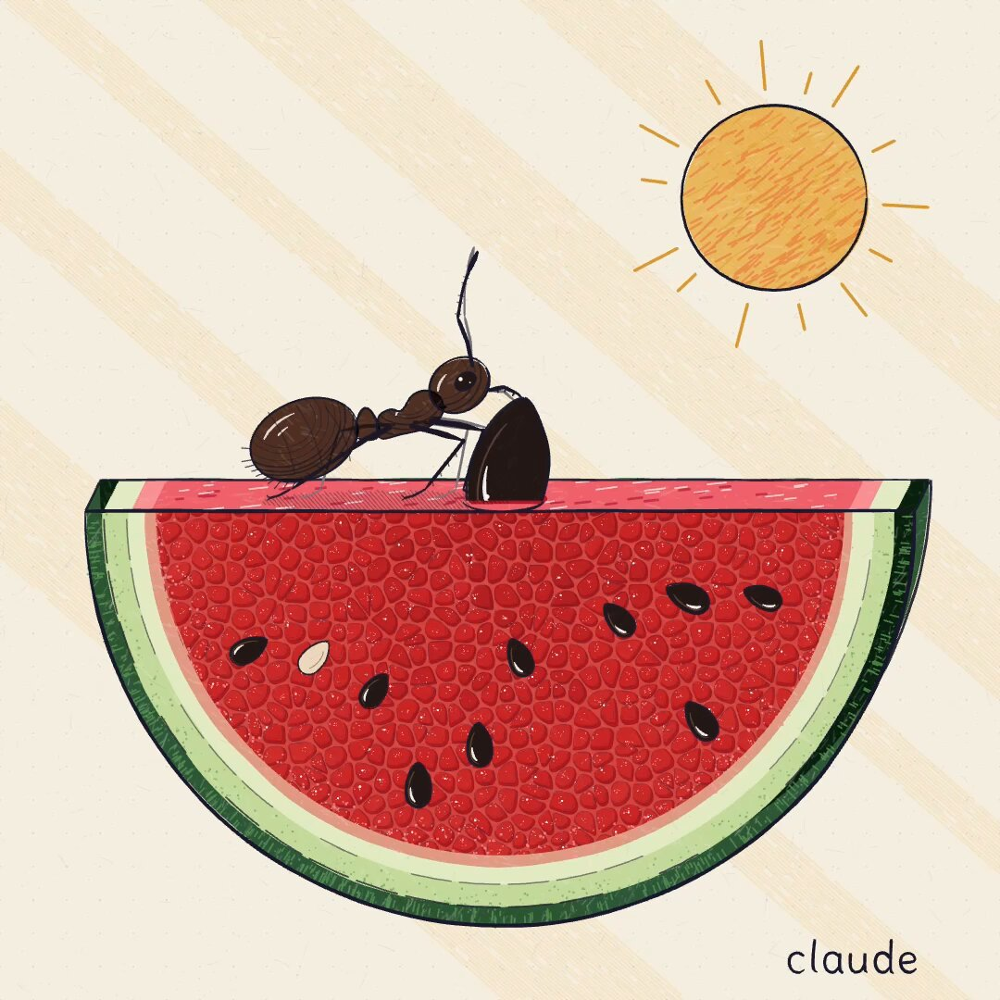</a> <a href="https://video.twimg.com/amplify_video/2102467313874178048/vid/avc1/1080x1080/jvnZ3SyyxxajVatp.mp4?tag=29">Lire la vidéo source 1</a></td>
</tr>
</table>

Type: Demo | Date: 2026-09-22

---

### Cas 2: [Déléguer une tâche complète](https://x.com/ClaudeDevs/status/2102491840612380934) (par [@ClaudeDevs](https://x.com/ClaudeDevs))

**Définissez les critères de réussite et les points de suivi avant de déléguer une tâche entière.**

Le guide officiel recommande de définir la réussite et les points de suivi avant de déléguer une tâche entière, de supprimer les consignes de réflexion redondantes et de vérifier ce qui reste nécessaire après une longue exécution. Un guide complet est accessible par lien.

Type: Tutorial | Date: 2026-09-22

---

## 🧩 Développement de jeux

### Cas 3: [Comparaison de jeux de samouraï](https://x.com/higgsfield_ai/status/2102471046356177001) (par [@higgsfield_ai](https://x.com/higgsfield_ai))

**Comparez les jeux de samouraï en tenant compte de la promotion de plateforme réalisée par leur éditeur.**

Higgsfield compare des démonstrations de jeux de samouraï réalisées avec Opus 5.5 et GPT-6 Astra dans le cadre de la promotion de sa propre plateforme.

<table>
<tr>
<td><a href="https://video.twimg.com/amplify_video/2102470161328685056/vid/avc1/1122x1080/mkbbA1dMknaGX6nL.mp4?tag=29">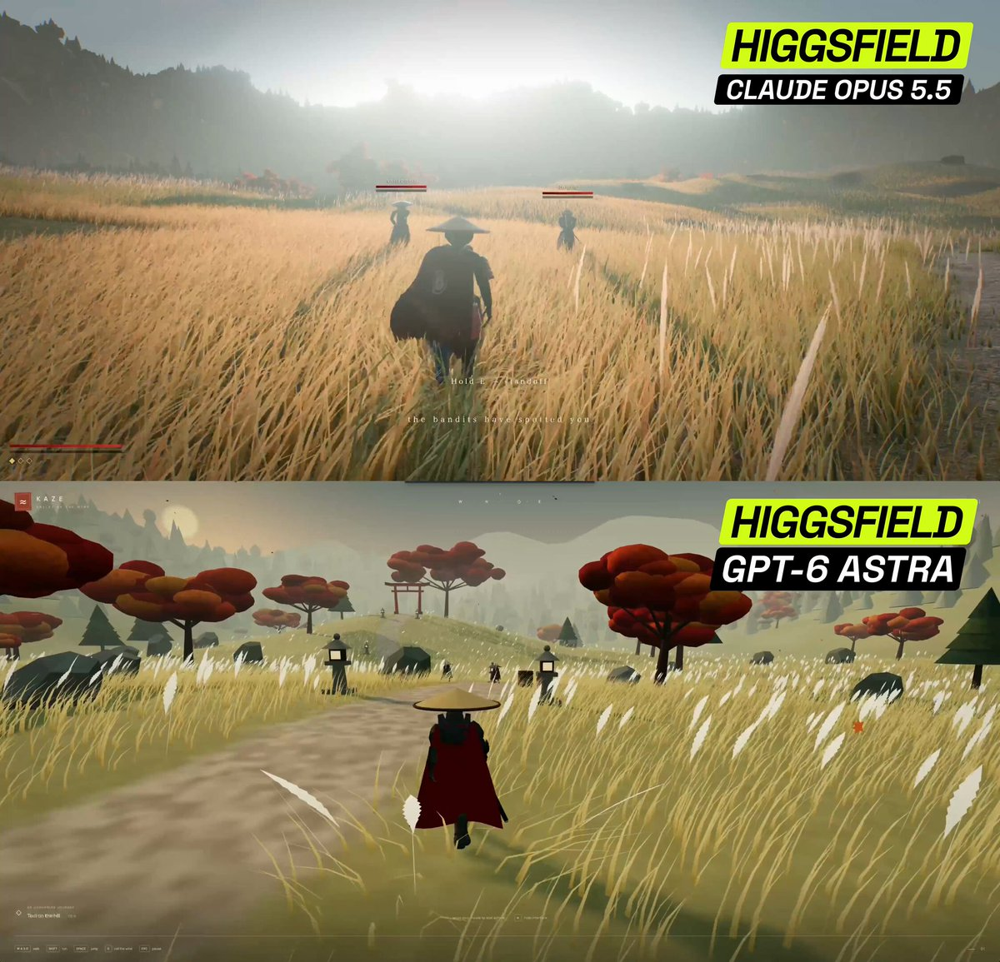</a> <a href="https://video.twimg.com/amplify_video/2102470161328685056/vid/avc1/1122x1080/mkbbA1dMknaGX6nL.mp4?tag=29">Lire la vidéo source 1</a></td>
</tr>
</table>

Sources complémentaires / comptes rendus regroupés: [@RoundtableSpace](https://x.com/RoundtableSpace/status/2102537174742655341), [@EngMoElgaraihy](https://x.com/EngMoElgaraihy/status/2102488568564490521)

Type: Evaluation | Date: 2026-09-22

---

### Cas 4: [Démonstration de Mario Kart en une seule passe](https://x.com/bridgemindai/status/2102451997395866021) (par [@bridgemindai](https://x.com/bridgemindai))

**Examinez les personnages jouables de ce jeu de kart présenté comme réalisé en une passe avant d’adopter le jugement qualitatif de la plateforme.**

La démonstration promotionnelle de BridgeMind présente un Mario Kart réalisé en une passe, avec Mario et Luigi jouables. L’affirmation selon laquelle il dépasse Fable 5.1 relève de l’appréciation de la plateforme.

<table>
<tr>
<td> <a href="https://video.twimg.com/amplify_video/2102451221483180032/vid/avc1/2098x1080/vHjQ8jI6WsTR-TPn.mp4?tag=29">Lire la vidéo source 1</a></td>
</tr>
</table>

Type: Demo | Date: 2026-09-22

---

### Cas 5: [Un clone de Minecraft dans le navigateur](https://x.com/noahwachnik/status/2102470200415166699) (par [@noahwachnik](https://x.com/noahwachnik))

**Examinez la démonstration de Minecraft dans le navigateur pour voir le résultat de cette tentative de génération de jeu.**

L’auteur présente un clone de Minecraft testé dans un navigateur, montrant le résultat de cette tentative de génération de jeu.

<table>
<tr>
<td><a href="https://video.twimg.com/amplify_video/2102469320001404928/vid/avc1/1920x1080/BwKBu8kazrg4aJph.mp4?tag=29">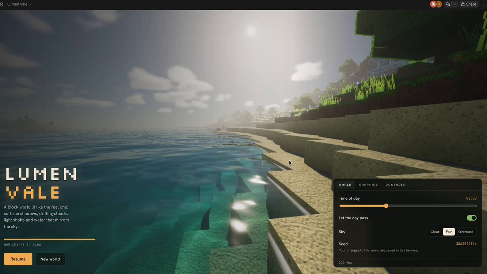</a> <a href="https://video.twimg.com/amplify_video/2102469320001404928/vid/avc1/1920x1080/BwKBu8kazrg4aJph.mp4?tag=29">Lire la vidéo source 1</a></td>
</tr>
</table>

Type: Demo | Date: 2026-09-22

---

### Cas 6: [Un jeu mécanique dans un seul fichier HTML](https://x.com/edwinarbus/status/2102463453176979794) (par [@edwinarbus](https://x.com/edwinarbus))

**Envisagez un fichier HTML unique pour les visuels et les sons procéduraux d’un jeu, comme l’illustre cette démonstration de plateforme.**

Cette démonstration promotionnelle de plateforme présente un jeu inspiré de la machine d’Anticythère, dont le contenu audiovisuel est généré en temps réel par un unique fichier HTML d’environ 3 MB.

<table>
<tr>
<td><a href="https://video.twimg.com/amplify_video/2102461665086418944/vid/avc1/1350x1080/86T-JaewbcqfYnRH.mp4?tag=29">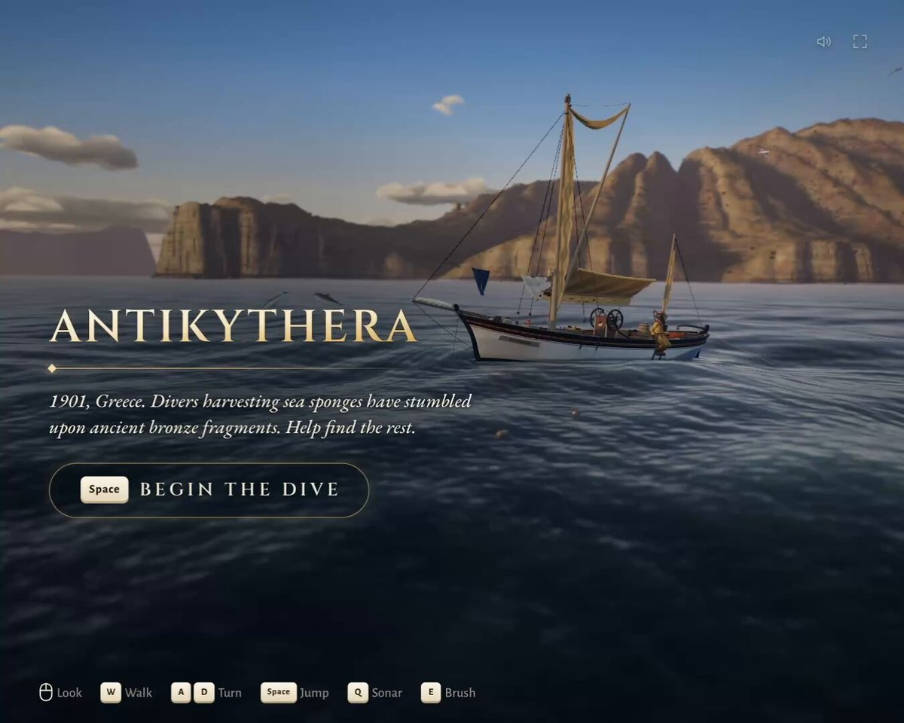</a> <a href="https://video.twimg.com/amplify_video/2102461665086418944/vid/avc1/1350x1080/86T-JaewbcqfYnRH.mp4?tag=29">Lire la vidéo source 1</a></td>
</tr>
</table>

Type: Demo | Date: 2026-09-22

---

### Cas 7: [Un jeu de combat anime avec Roblox toolbox](https://x.com/WoahWurdz/status/2102487879809126834) (par [@WoahWurdz](https://x.com/WoahWurdz))

**Tenez compte des ressources de Roblox toolbox pour évaluer ce jeu de combat annoncé comme réalisé en une passe.**

L’auteur rapporte avoir généré en une passe un jeu de combat avec des personnages d’anime, uniquement avec Roblox toolbox, et le juge meilleur que Fable. Le jeu dépend des ressources de cette boîte à outils.

<table>
<tr>
<td><a href="https://video.twimg.com/amplify_video/2102487713282686976/vid/avc1/1462x1128/3fIlU8ItZxe_bOOQ.mp4?tag=29">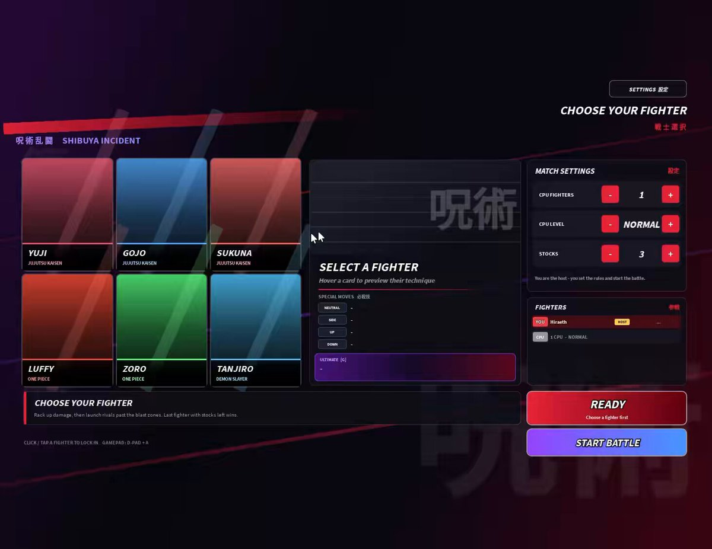</a> <a href="https://video.twimg.com/amplify_video/2102487713282686976/vid/avc1/1462x1128/3fIlU8ItZxe_bOOQ.mp4?tag=29">Lire la vidéo source 1</a></td>
</tr>
</table>

Type: Demo | Date: 2026-09-22

---

### Cas 8: [Comparaison de trois modèles sur un jeu Spider-Man](https://x.com/k2sbhai/status/2102487953302061481) (par [@k2sbhai](https://x.com/k2sbhai))

**Comparez les trois jeux Spider-Man sur les mêmes caractéristiques de jeu visibles.**

L’auteur compare Opus 5.5, Fable 5.1 et GPT-6 Astra sur une tâche de création de jeu Spider-Man.

<table>
<tr>
<td><a href="https://video.twimg.com/amplify_video/2102487804651720704/vid/avc1/1080x1920/R6XVPJWDvtaZ_lkN.mp4?tag=29">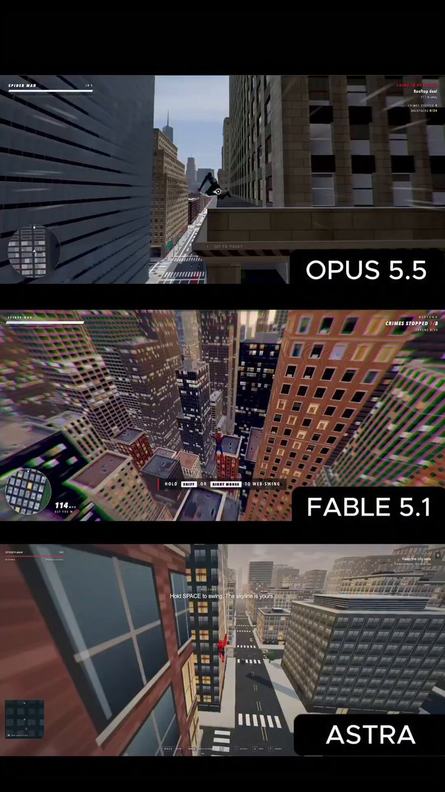</a> <a href="https://video.twimg.com/amplify_video/2102487804651720704/vid/avc1/1080x1920/R6XVPJWDvtaZ_lkN.mp4?tag=29">Lire la vidéo source 1</a></td>
</tr>
</table>

Type: Evaluation | Date: 2026-09-22

---

### Cas 9: [Un clone de Minecraft avec physique de l’eau](https://x.com/notjazii/status/2102480420923420790) (par [@notjazii](https://x.com/notjazii))

**Mettez en balance le résultat annoncé pour la physique de l’eau et la durée d’exécution supérieure signalée par l’auteur.**

L’auteur partage un clone jouable de Minecraft avec physique de l’eau et mécaniques de jeu, juge le résultat meilleur que celui d’Astra et rapporte une exécution du modèle encore plus lente que celle d’Astra.

<table>
<tr>
<td><a href="https://video.twimg.com/amplify_video/2102479783800279040/vid/avc1/1920x1080/7VsGtlHe2S5BRExC.mp4?tag=29">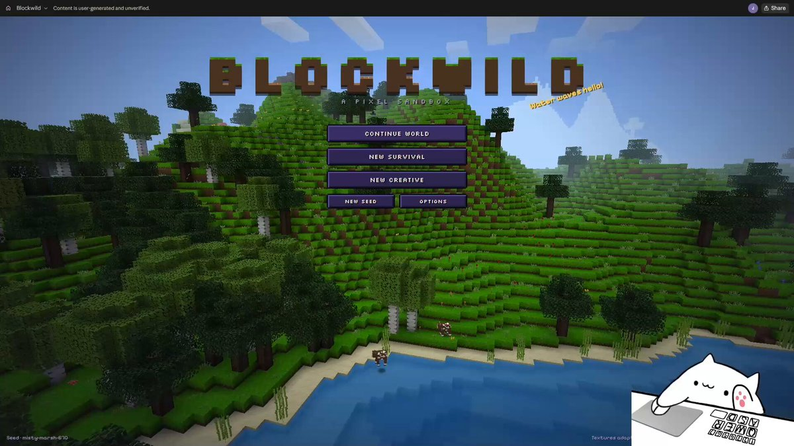</a> <a href="https://video.twimg.com/amplify_video/2102479783800279040/vid/avc1/1920x1080/7VsGtlHe2S5BRExC.mp4?tag=29">Lire la vidéo source 1</a></td>
</tr>
</table>

Type: Demo | Date: 2026-09-22

---

### Cas 10: [Scènes à la première personne de DEAD SIGNAL](https://x.com/bridgebench/status/2102469365903872306) (par [@bridgebench](https://x.com/bridgebench))

**Examinez les scènes à la première personne obtenues avec la même consigne en distinguant les jugements qualitatifs de la plateforme.**

Dans une promotion de sa plateforme, BridgeBench compare Opus 5.5 et GPT-6 Sol avec la même consigne et la même tâche. L’aperçu montre des scènes du jeu à la première personne DEAD SIGNAL ; les jugements qualitatifs sont ceux de la plateforme.

<table>
<tr>
<td><a href="https://video.twimg.com/amplify_video/2102468957806501888/vid/avc1/1920x1080/CiEVMPgTSp380Wzs.mp4?tag=29">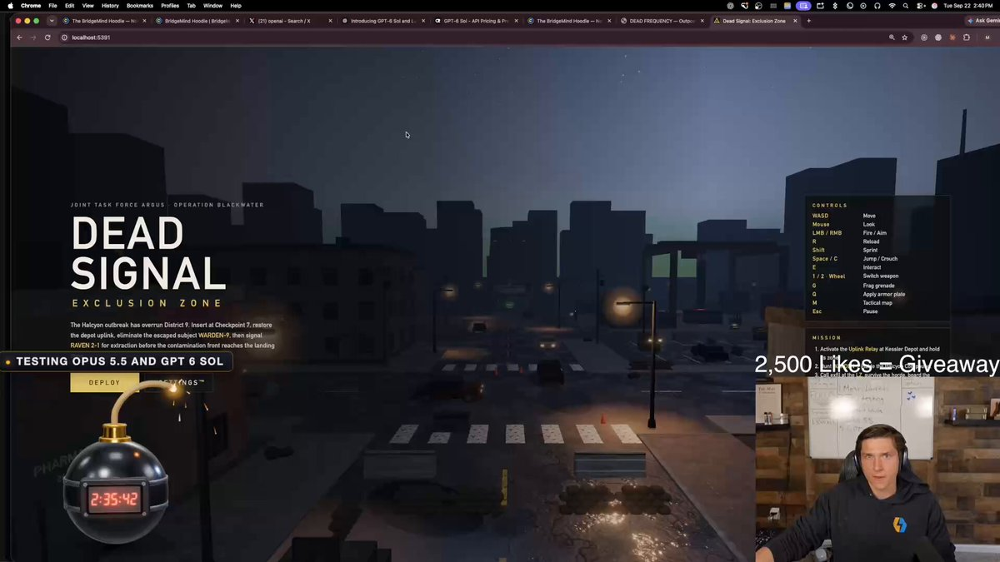</a> <a href="https://video.twimg.com/amplify_video/2102468957806501888/vid/avc1/1920x1080/CiEVMPgTSp380Wzs.mp4?tag=29">Lire la vidéo source 1</a></td>
</tr>
</table>

Type: Evaluation | Date: 2026-09-22

---

### Cas 11: [Un jeu d’apiculture dessiné par le code](https://x.com/oguzthedev/status/2102476490344730950) (par [@oguzthedev](https://x.com/oguzthedev))

**Prenez la démonstration d’apiculture comme référence pour dessiner les éléments d’un jeu et programmer ses mécaniques.**

L’auteur rapporte un jeu d’apiculture créé avec une seule consigne, sans fichiers d’images : ruches, fleurs, abeilles et apiculteur sont dessinés par le code. Le jeu permet de planter des fleurs, de faire voler des abeilles et de récolter du miel.

<table>
<tr>
<td><a href="https://video.twimg.com/amplify_video/2102475876294160385/vid/avc1/1880x1080/FNaYj1IdK9WsC2fz.mp4?tag=29">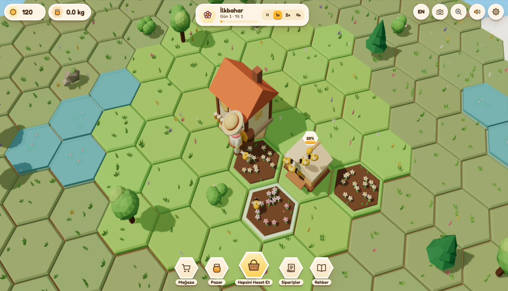</a> <a href="https://video.twimg.com/amplify_video/2102475876294160385/vid/avc1/1880x1080/FNaYj1IdK9WsC2fz.mp4?tag=29">Lire la vidéo source 1</a></td>
</tr>
</table>

Type: Demo | Date: 2026-09-22

---

### Cas 12: [Démonstration d’un jeu Snake](https://x.com/hakmgpt/status/2102453021590401220) (par [@hakmgpt](https://x.com/hakmgpt))

**Examinez ce Snake comme un exemple compact de logique et de présentation de jeu générées.**

L’auteur présente un Snake réalisé avec Opus 5.5 comme exemple concret de création de jeu.

<table>
<tr>
<td> <a href="https://video.twimg.com/amplify_video/2102452906083377152/vid/avc1/1080x1098/S7n7jTgko7JLgc7r.mp4?tag=29">Lire la vidéo source 1</a></td>
</tr>
</table>

Type: Demo | Date: 2026-09-22

---

### Cas 13: [Comparaison de jeux 3D avec Sol](https://x.com/higgsfield_ai/status/2102496940047094124) (par [@higgsfield_ai](https://x.com/higgsfield_ai))

**Comparez les jeux 3D présentés sans prendre la préférence de la plateforme pour une évaluation indépendante.**

Higgsfield compare Opus 5.5 et GPT-6 Sol pour le développement de jeux 3D dans le cadre de la promotion de sa propre plateforme.

<table>
<tr>
<td><a href="https://video.twimg.com/amplify_video/2102496880412565504/vid/avc1/1080x1080/ILPIm5Y_fCgPCVC4.mp4?tag=29">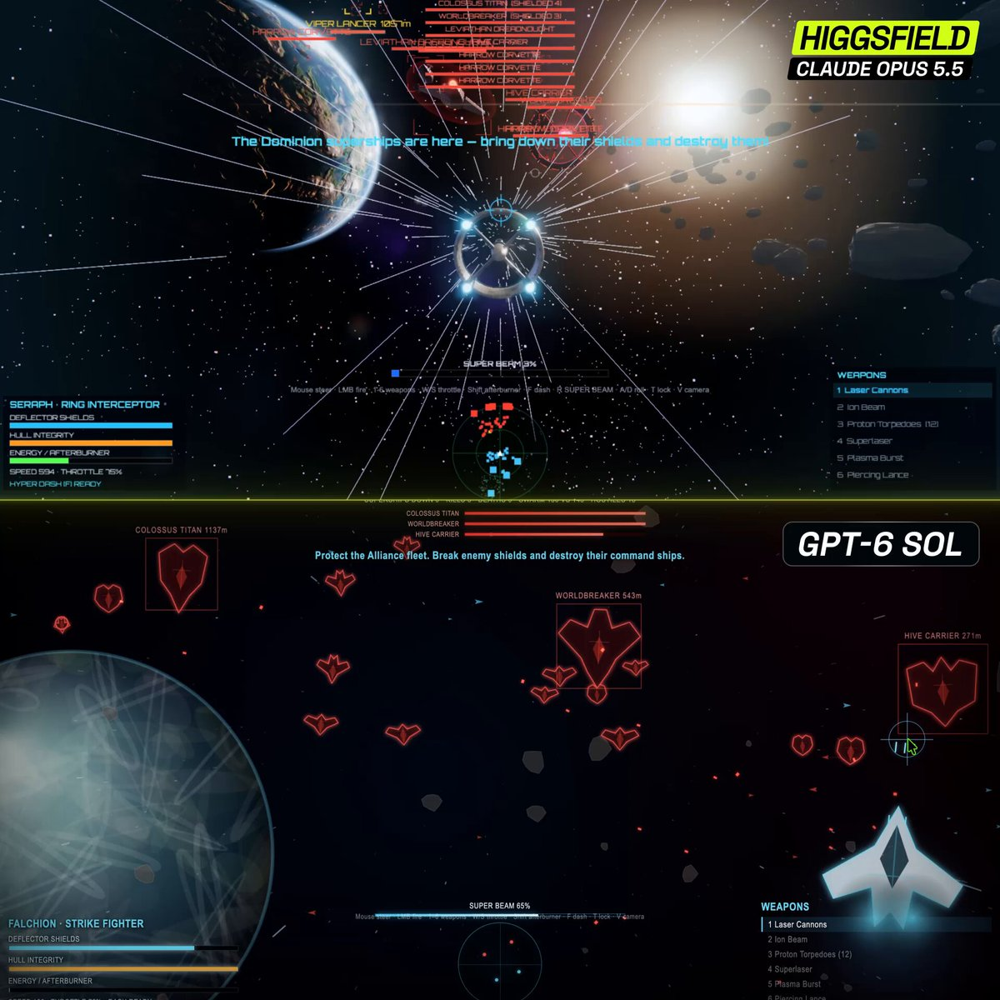</a> <a href="https://video.twimg.com/amplify_video/2102496880412565504/vid/avc1/1080x1080/ILPIm5Y_fCgPCVC4.mp4?tag=29">Lire la vidéo source 1</a></td>
</tr>
</table>

Type: Evaluation | Date: 2026-09-22

---

### Cas 14: [Billard multijoueur et mode spectateur](https://x.com/BuiltByBilal/status/2102527003845075348) (par [@BuiltByBilal](https://x.com/BuiltByBilal))

**Vérifiez le jeu de billard accessible par lien avant de vous fier aux modes multijoueurs et à l’activité annoncés.**

L’auteur rapporte un billard multijoueur réalisé en une passe, avec 8-ball, 9-ball, snooker, 2v2, chat vocal, tournois, classements, rediffusions, mode spectateur et prise en charge mobile/navigateur. Un lien est fourni ; l’activité de joueurs déjà présents est déclarée par l’auteur.

<table>
<tr>
<td><a href="https://x.com/BuiltByBilal/status/2102527003845075348">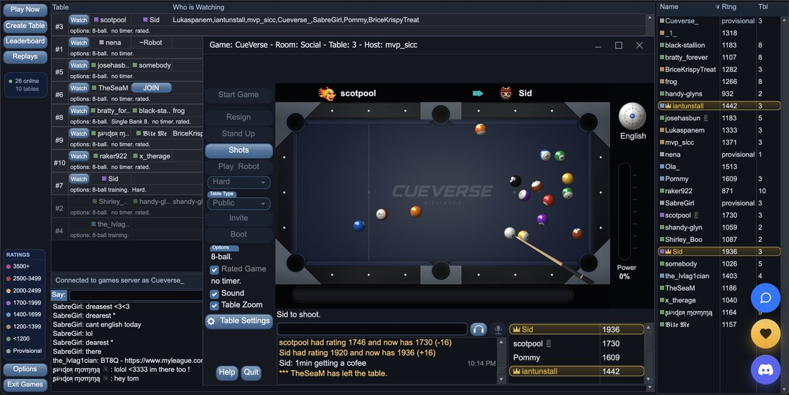</a> <a href="https://x.com/BuiltByBilal/status/2102527003845075348">Pièce jointe de la source 1</a></td>
</tr>
</table>

Type: Demo | Date: 2026-09-22

---

### Cas 15: [Un jeu d’arcade via l’API Higgsfield](https://x.com/higgsfield_ai/status/2102451096799330740) (par [@higgsfield_ai](https://x.com/higgsfield_ai))

**Examinez les reflets sur l’eau et le jeu d’arcade dans cette démonstration de plateforme fondée sur son API.**

La démonstration promotionnelle de Higgsfield montre un jeu construit via son API, avec des reflets sur l’eau et des mécaniques d’arcade.

<table>
<tr>
<td><a href="https://video.twimg.com/amplify_video/2102450921905283072/vid/avc1/1920x1080/_-dvpneN6xcP95tv.mp4?tag=29">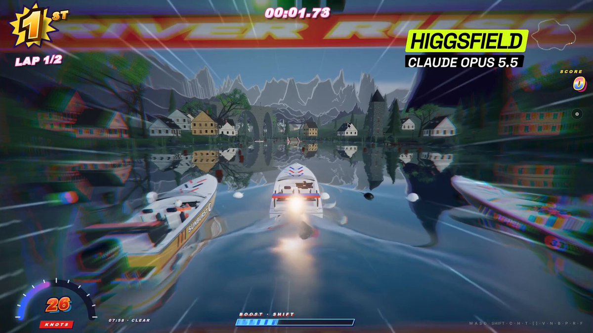</a> <a href="https://video.twimg.com/amplify_video/2102450921905283072/vid/avc1/1920x1080/_-dvpneN6xcP95tv.mp4?tag=29">Lire la vidéo source 1</a></td>
</tr>
</table>

Type: Integration | Date: 2026-09-22

---

### Cas 16: [Recréer Minecraft dans un navigateur](https://x.com/buildwithsid/status/2102461886247948571) (par [@buildwithsid](https://x.com/buildwithsid))

**Utilisez cette recréation dans le navigateur pour évaluer l’étendue visible de la tentative de clone de Minecraft.**

L’auteur présente un clone de Minecraft dans le navigateur comme tentative de recréation du jeu.

<table>
<tr>
<td><a href="https://video.twimg.com/amplify_video/2102459530349285376/vid/avc1/1804x1080/ws15ni5PzUk8TyOH.mp4?tag=29">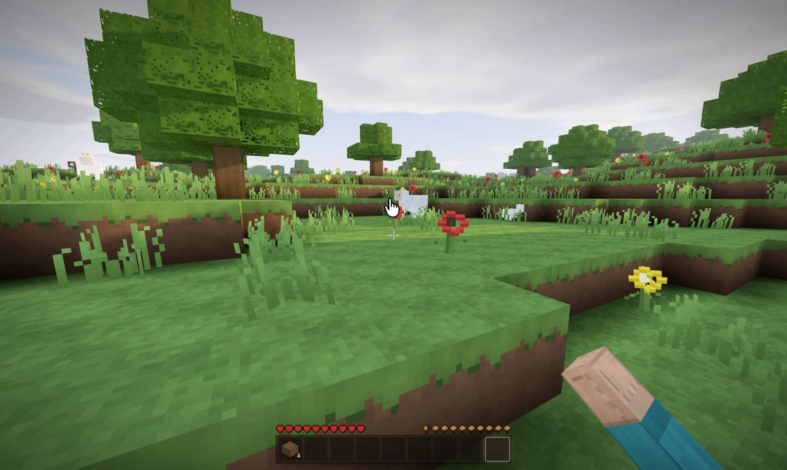</a> <a href="https://video.twimg.com/amplify_video/2102459530349285376/vid/avc1/1804x1080/ws15ni5PzUk8TyOH.mp4?tag=29">Lire la vidéo source 1</a></td>
</tr>
</table>

Type: Demo | Date: 2026-09-22

---

### Cas 17: [Tondre la pelouse avec les spectateurs d’un direct](https://x.com/_MaxBlade/status/2102513817855094922) (par [@_MaxBlade](https://x.com/_MaxBlade))

**Envisagez d’inviter les spectateurs d’un direct à tester un prototype multijoueur sur un serveur personnel.**

L’auteur présente un simulateur multijoueur de tonte de pelouse avec des éléments de bière et de cigares, déployé sur un serveur personnel pour que les spectateurs d’un direct puissent le rejoindre.

<table>
<tr>
<td><a href="https://video.twimg.com/amplify_video/2102513139124244480/vid/avc1/2560x1440/Unl1aBGvaAUEW4EJ.mp4?tag=29">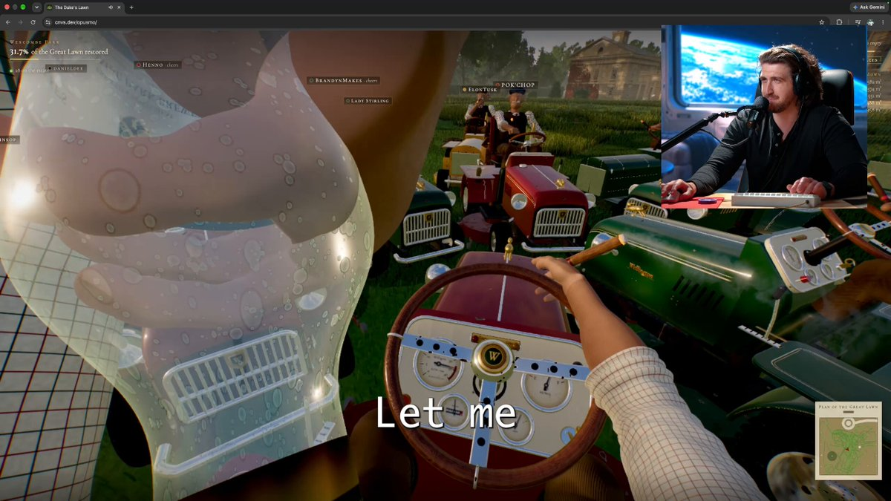</a> <a href="https://video.twimg.com/amplify_video/2102513139124244480/vid/avc1/2560x1440/Unl1aBGvaAUEW4EJ.mp4?tag=29">Lire la vidéo source 1</a></td>
</tr>
</table>

Type: Demo | Date: 2026-09-22

---

### Cas 18: [Un jeu de tir griffonné avec un boss final](https://x.com/cherry_mx_reds/status/2102449525944099320) (par [@cherry_mx_reds](https://x.com/cherry_mx_reds))

**Examinez comment ce jeu de tir annoncé comme réalisé en une passe associe un style griffonné à un boss final.**

L’auteur rapporte un jeu de tir de style griffonné généré en une passe, comprenant aussi un boss final.

<table>
<tr>
<td><a href="https://video.twimg.com/amplify_video/2102448437837090816/vid/avc1/1594x1080/G91X4KGDDEhMKyo_.mp4?tag=29">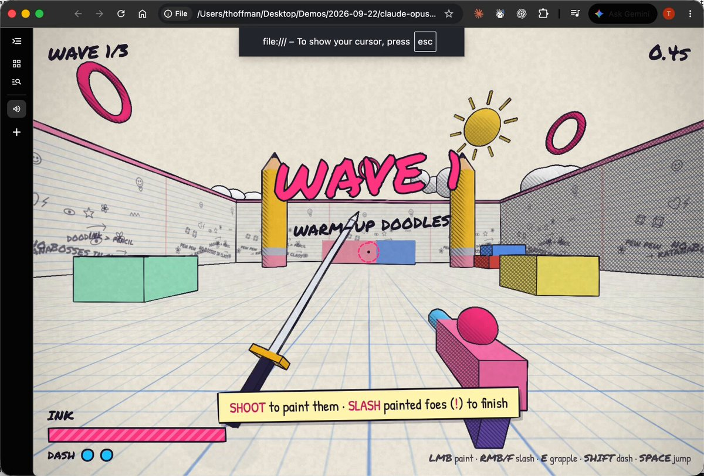</a> <a href="https://video.twimg.com/amplify_video/2102448437837090816/vid/avc1/1594x1080/G91X4KGDDEhMKyo_.mp4?tag=29">Lire la vidéo source 1</a></td>
</tr>
</table>

Type: Demo | Date: 2026-09-22

---

### Cas 19: [Un jeu Mario avec le réglage Medium](https://x.com/benchmark_lb900/status/2102451991263990244) (par [@benchmark_lb900](https://x.com/benchmark_lb900))

**Prenez cette démonstration de Mario comme référence pour une génération de jeu avec l’effort Medium.**

L’auteur présente un jeu Mario généré avec le réglage Medium.

<table>
<tr>
<td><a href="https://video.twimg.com/amplify_video/2102451787743797248/vid/avc1/1282x1220/s0orpWFvxMJ57pcP.mp4?tag=29">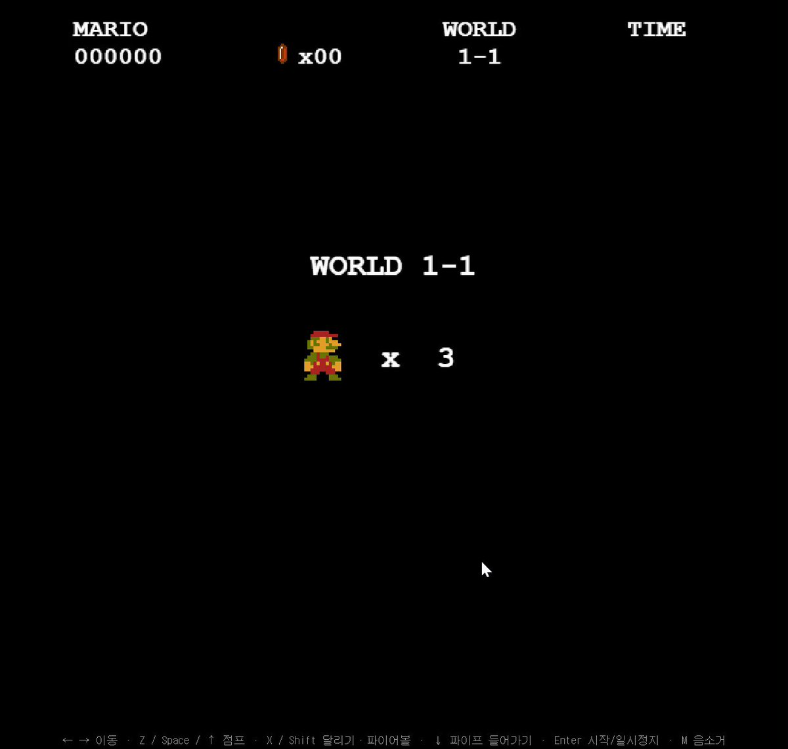</a> <a href="https://video.twimg.com/amplify_video/2102451787743797248/vid/avc1/1282x1220/s0orpWFvxMJ57pcP.mp4?tag=29">Lire la vidéo source 1</a></td>
</tr>
</table>

Type: Demo | Date: 2026-09-22

---

### Cas 20: [Comparaison de séquences de course de karts](https://x.com/k2sbhai/status/2102468855562178791) (par [@k2sbhai](https://x.com/k2sbhai))

**Comparez les séquences de course de karts selon le comportement visible du jeu, sans en déduire des capacités générales du modèle.**

La publication compare Opus 5.5 à GPT-6 Sol ; son aperçu multimédia montre des séquences de course de karts.

<table>
<tr>
<td><a href="https://video.twimg.com/amplify_video/2102468763182575616/vid/avc1/720x1188/KiitEAn5eNR9s9wu.mp4?tag=29">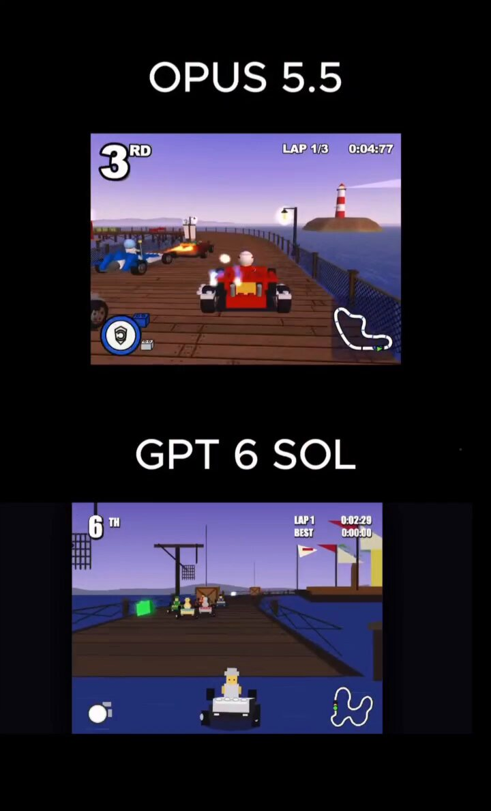</a> <a href="https://video.twimg.com/amplify_video/2102468763182575616/vid/avc1/720x1188/KiitEAn5eNR9s9wu.mp4?tag=29">Lire la vidéo source 1</a></td>
</tr>
</table>

Type: Evaluation | Date: 2026-09-22

---

### Cas 21: [Jeux comparés à GPT-6 Sol avec la même consigne](https://x.com/_MaxBlade/status/2102528632598274244) (par [@_MaxBlade](https://x.com/_MaxBlade))

**Consultez les jeux liés, créés avec la même consigne, pour comparer leur expérience de jeu réelle.**

L’auteur génère des jeux avec la même consigne, compare Opus 5.5 à GPT-6 Sol et indique que les liens vers les jeux figurent sous la publication.

<table>
<tr>
<td><a href="https://video.twimg.com/amplify_video/2102527771725504513/vid/avc1/1920x1080/RigEMEuahUcyTy2v.mp4?tag=29">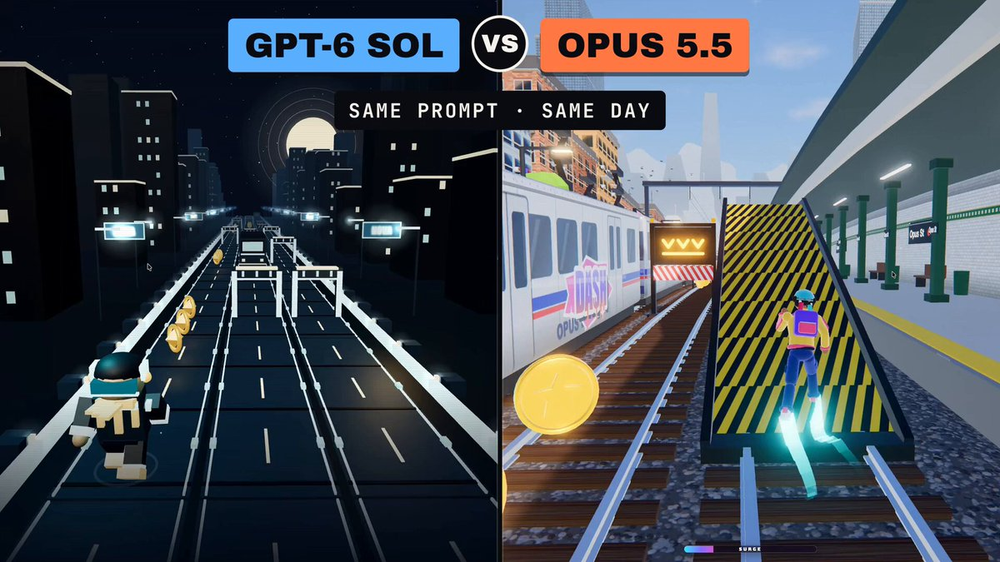</a> <a href="https://video.twimg.com/amplify_video/2102527771725504513/vid/avc1/1920x1080/RigEMEuahUcyTy2v.mp4?tag=29">Lire la vidéo source 1</a></td>
</tr>
</table>

Type: Evaluation | Date: 2026-09-22

---

### Cas 22: [Snake généré en une seule passe](https://x.com/xikhar/status/2102453761390383383) (par [@xikhar](https://x.com/xikhar))

**Utilisez ce Snake annoncé comme généré en une passe comme référence de génération à petite échelle.**

L’auteur présente un jeu Snake décrit comme généré en une seule passe.

<table>
<tr>
<td><a href="https://video.twimg.com/amplify_video/2102452659550822400/vid/avc1/1920x1080/UfYLBlAiXrFx66sd.mp4?tag=29">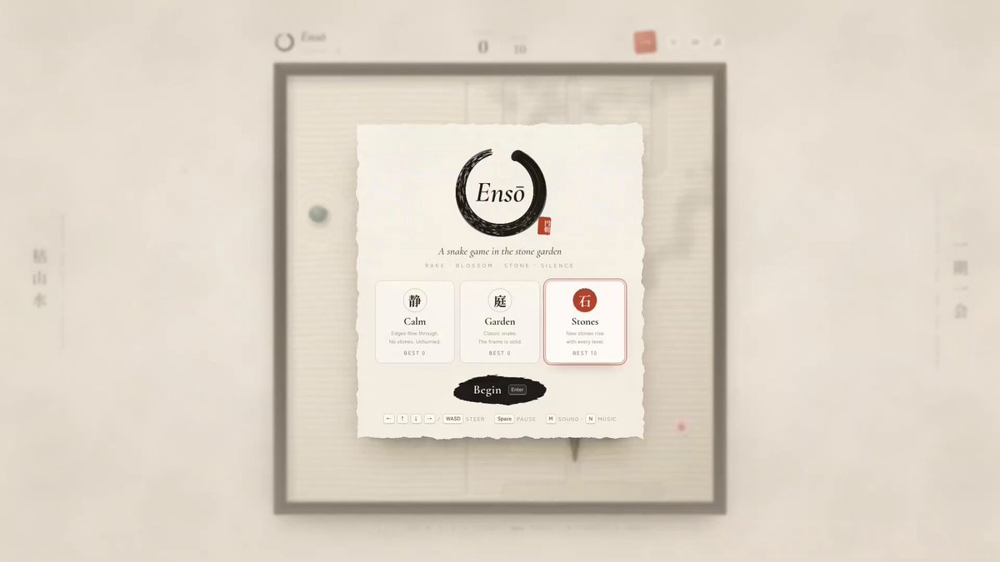</a> <a href="https://video.twimg.com/amplify_video/2102452659550822400/vid/avc1/1920x1080/UfYLBlAiXrFx66sd.mp4?tag=29">Lire la vidéo source 1</a></td>
</tr>
</table>

Type: Demo | Date: 2026-09-22

---

### Cas 23: [Des mécaniques de jeu de zombies en Three.js](https://x.com/intheworldofai/status/2102480675597115689) (par [@intheworldofai](https://x.com/intheworldofai))

**Étudiez la démonstration Three.js pour ses mécaniques, textures et sons générés sans fichiers de ressources.**

L’auteur présente environ 13,000 lignes de Three.js pour un jeu de type Call of Duty Zombies, avec retrait des planches aux fenêtres, Mystery Box, Pack-a-Punch, Jugg, Ray Gun et mécaniques de manches de BO1. Aucun fichier de ressources n’aurait été utilisé : textures, grognements et jingles sont générés par le code.

<table>
<tr>
<td><a href="https://video.twimg.com/amplify_video/2102480184016277504/vid/avc1/1920x1080/ScvFpMg0vzzzA4OU.mp4?tag=29">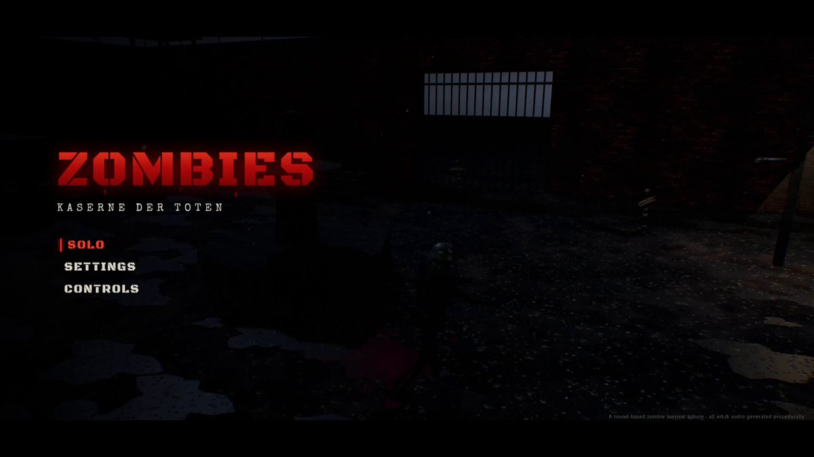</a> <a href="https://video.twimg.com/amplify_video/2102480184016277504/vid/avc1/1920x1080/ScvFpMg0vzzzA4OU.mp4?tag=29">Lire la vidéo source 1</a></td>
</tr>
</table>

Type: Demo | Date: 2026-09-22

---

### Cas 24: [Un jeu de neige affiné en deux passes](https://x.com/jumperz/status/2102486361068425247) (par [@jumperz](https://x.com/jumperz))

**Prévoyez des étapes d’amélioration et du temps d’exécution pour un jeu de neige aux effets visuels et sonores coordonnés.**

L’auteur rapporte une consigne initiale suivie d’environ deux tours d’amélioration pour un jeu de neige, avec plus d’une heure de travail du modèle. La démonstration comprend projections de neige, arbres, traces, éclairage, ombres et effets sonores.

<table>
<tr>
<td><a href="https://video.twimg.com/amplify_video/2102485332616732672/vid/avc1/1920x1080/QPii18NhEh8uwx6v.mp4?tag=29">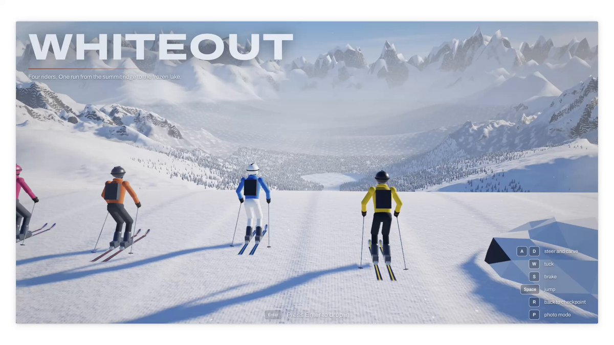</a> <a href="https://video.twimg.com/amplify_video/2102485332616732672/vid/avc1/1920x1080/QPii18NhEh8uwx6v.mp4?tag=29">Lire la vidéo source 1</a></td>
</tr>
</table>

Type: Demo | Date: 2026-09-22

---

### Cas 25: [Fonctionnalités de jeu et montage d’une bande-annonce](https://x.com/ForwardEditor/status/2102501821931507772) (par [@ForwardEditor](https://x.com/ForwardEditor))

**Examinez le jeu jouable avec sa bande-annonce en conservant la mention du partenariat déclarée par l’auteur.**

Dans cette publication signalée comme un partenariat, un auteur ayant obtenu un accès anticipé au modèle rapporte avoir ajouté des fonctionnalités de jeu et monté une bande-annonce, et fournit un lien jouable.

<table>
<tr>
<td><a href="https://video.twimg.com/amplify_video/2102500851658924032/vid/avc1/1280x720/Gs6hGCiAUu3e5ge9.mp4?tag=29">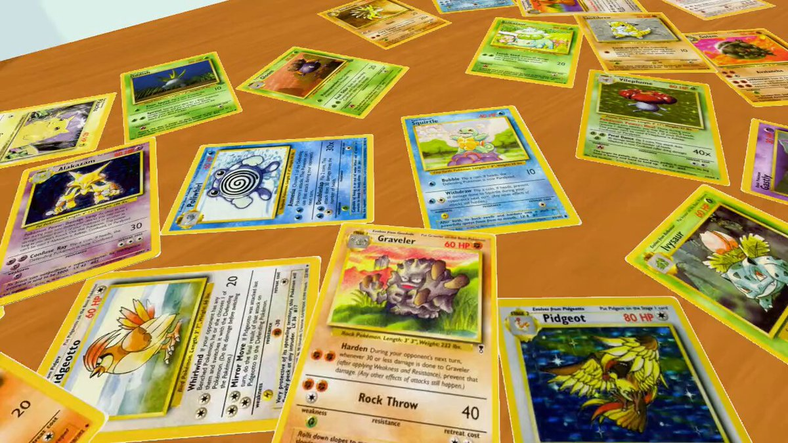</a> <a href="https://video.twimg.com/amplify_video/2102500851658924032/vid/avc1/1280x720/Gs6hGCiAUu3e5ge9.mp4?tag=29">Lire la vidéo source 1</a></td>
</tr>
</table>

Type: Demo | Date: 2026-09-22

---

### Cas 26: [Une île de survie multijoueur dans Tesana](https://x.com/Thomas_jorgen/status/2102459329626652814) (par [@Thomas_jorgen](https://x.com/Thomas_jorgen))

**Vérifiez les systèmes multijoueurs de l’île Tesana avant de vous fier à la durée de jeu annoncée.**

L’auteur rapporte avoir créé dans Tesana, en quelques consignes, une île de survie multijoueur de type ARK, avec quêtes, apprivoisement de dinosaures, fabrication et combat, puis y avoir joué avec deux amis. Les 30+ heures de jeu annoncées sont autodéclarées ; le compte rendu signale un partenariat possible, non confirmé.

<table>
<tr>
<td><a href="https://video.twimg.com/amplify_video/2102458314160508928/vid/avc1/1920x1080/skP96ftk2mI0b20S.mp4?tag=29">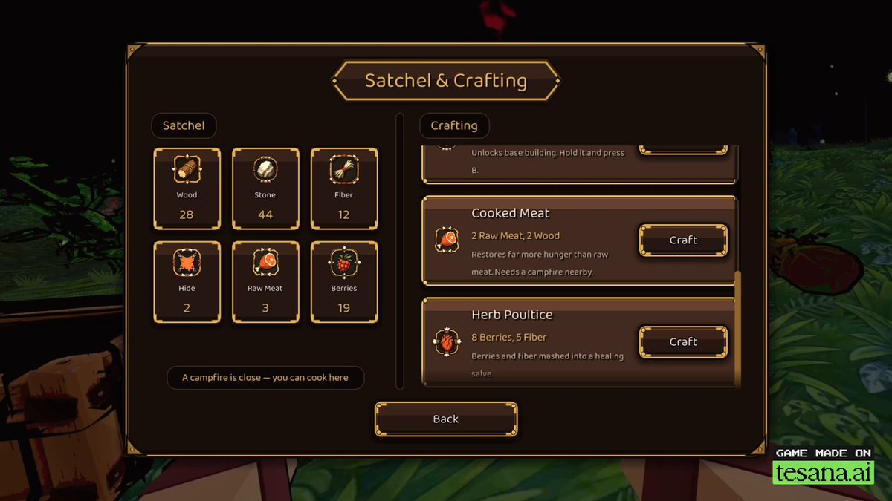</a> <a href="https://video.twimg.com/amplify_video/2102458314160508928/vid/avc1/1920x1080/skP96ftk2mI0b20S.mp4?tag=29">Lire la vidéo source 1</a></td>
</tr>
</table>

Type: Demo | Date: 2026-09-22

---

### Cas 27: [Comparaison de jeux sous Unreal Engine](https://x.com/higgsfield_ai/status/2102533401110802552) (par [@higgsfield_ai](https://x.com/higgsfield_ai))

**Comparez les jeux Unreal Engine dans le contexte de la méthode proposée par la plateforme Higgsfield.**

La promotion de la plateforme Higgsfield compare Opus 5.5 et GPT-6 Sol pour la création de jeux 3D dans Unreal Engine.

<table>
<tr>
<td><a href="https://video.twimg.com/amplify_video/2102533127096934400/vid/avc1/1080x1080/E40DuI3LXeGg8JA0.mp4?tag=29">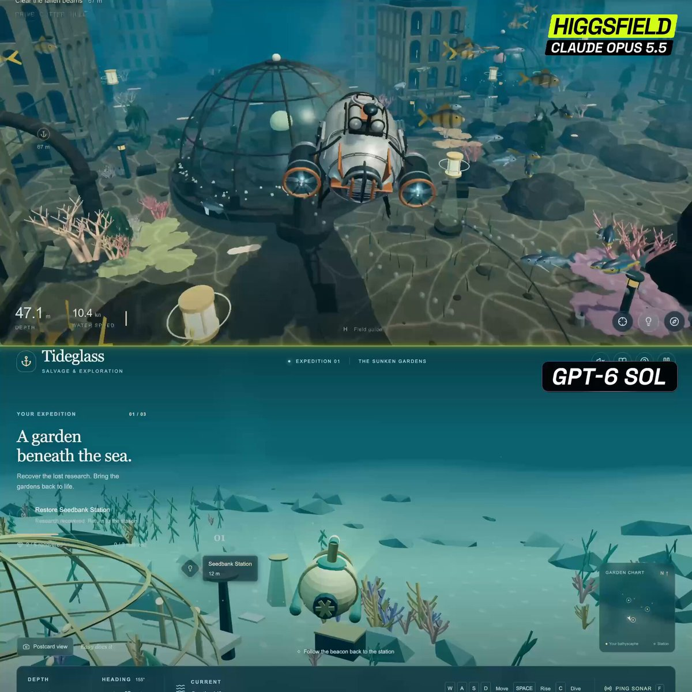</a> <a href="https://video.twimg.com/amplify_video/2102533127096934400/vid/avc1/1080x1080/E40DuI3LXeGg8JA0.mp4?tag=29">Lire la vidéo source 1</a></td>
</tr>
</table>

Type: Evaluation | Date: 2026-09-22

---

### Cas 28: [Un RPG de dark fantasy dans Tesana](https://x.com/Rubzem/status/2102457691956482160) (par [@Rubzem](https://x.com/Rubzem))

**Examinez comment le RPG Tesana combine zones, quêtes et dialogues doublés, en conservant l’incertitude sur le partenariat.**

L’auteur rapporte avoir créé un RPG de dark fantasy dans Tesana avec quelques consignes, comprenant plusieurs zones, des quêtes et des dialogues doublés. Le compte rendu signale un partenariat possible, non confirmé.

<table>
<tr>
<td><a href="https://video.twimg.com/amplify_video/2102457033413038080/vid/avc1/1916x1080/J47BET3d55HKTEdm.mp4?tag=29">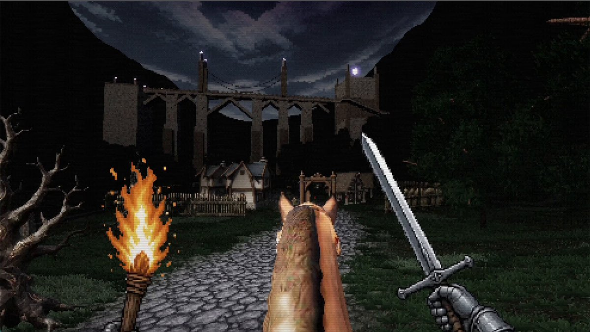</a> <a href="https://video.twimg.com/amplify_video/2102457033413038080/vid/avc1/1916x1080/J47BET3d55HKTEdm.mp4?tag=29">Lire la vidéo source 1</a></td>
</tr>
</table>

Type: Demo | Date: 2026-09-22

---

### Cas 29: [Une boutique de guitares avec bagarres déclenchées par le bruit](https://x.com/bijanbowen/status/2102532400353829356) (par [@bijanbowen](https://x.com/bijanbowen))

**Testez les performances avant d’étendre un simulateur de boutique Three.js à des centaines de modèles de guitares jouables.**

L’auteur présente un simulateur de boutique avec 300+ modèles de guitares jouables et des bagarres déclenchées par le bruit. Three.js est décrit comme lent ; une reconstruction dans Blender/Godot est prévue, mais n’a pas été réalisée.

<table>
<tr>
<td><a href="https://video.twimg.com/amplify_video/2102531852363853824/vid/avc1/1920x1080/b-13Hr4nmh5HcvFi.mp4?tag=29">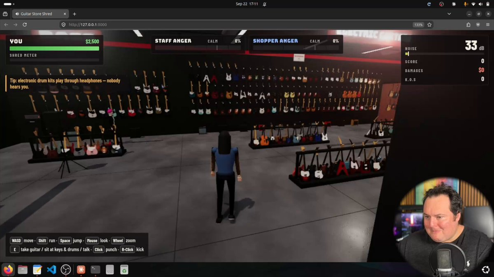</a> <a href="https://video.twimg.com/amplify_video/2102531852363853824/vid/avc1/1920x1080/b-13Hr4nmh5HcvFi.mp4?tag=29">Lire la vidéo source 1</a></td>
</tr>
</table>

Type: Demo | Date: 2026-09-22

---

### Cas 30: [Échecs dessinés à la main et analyse des coups](https://x.com/higgsfield_ai/status/2102534514228822197) (par [@higgsfield_ai](https://x.com/higgsfield_ai))

**Examinez comment cette démonstration d’échecs combine un aspect dessiné à la main et l’analyse des coups.**

La promotion de la plateforme Higgsfield présente un jeu d’échecs au style dessiné à la main avec analyse des coups.

<table>
<tr>
<td><a href="https://video.twimg.com/amplify_video/2102534281038049280/vid/avc1/1440x1080/pSUEup1s_OPfPNsJ.mp4?tag=29">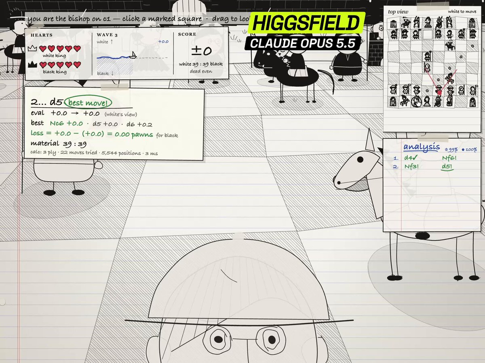</a> <a href="https://video.twimg.com/amplify_video/2102534281038049280/vid/avc1/1440x1080/pSUEup1s_OPfPNsJ.mp4?tag=29">Lire la vidéo source 1</a></td>
</tr>
</table>

Type: Demo | Date: 2026-09-22

---

### Cas 31: [Un simulateur de vol comparé à Kimi K3](https://x.com/adxtyahq/status/2102455768977170856) (par [@adxtyahq](https://x.com/adxtyahq))

**Comparez à la fois le comportement des simulateurs de vol et leur coût annoncé pour choisir entre les deux résultats.**

L’auteur compare des simulateurs de vol Opus 5.5 et Kimi K3 avec la même consigne, en montrant l’interface, plusieurs angles de caméra et la voix. Les deux fonctionneraient de manière fluide, mais Kimi K3 serait plus économique.

<table>
<tr>
<td><a href="https://video.twimg.com/amplify_video/2102455572750848000/vid/avc1/1816x1140/WWAmC5uDhH_y2oPd.mp4?tag=29">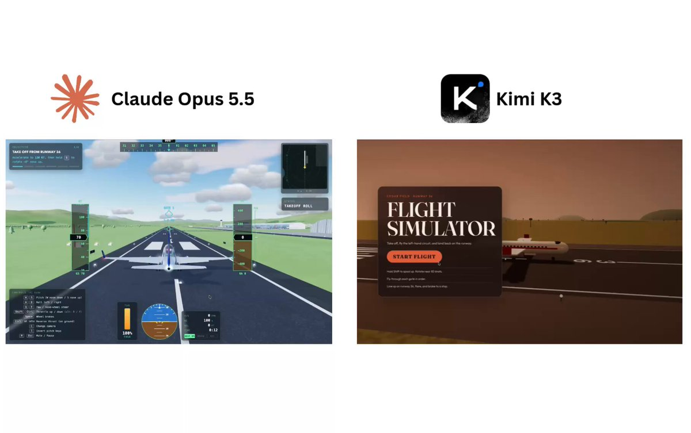</a> <a href="https://video.twimg.com/amplify_video/2102455572750848000/vid/avc1/1816x1140/WWAmC5uDhH_y2oPd.mp4?tag=29">Lire la vidéo source 1</a></td>
</tr>
</table>

Type: Evaluation | Date: 2026-09-22

---

### Cas 32: [Un monde fantastique dans Tesana en une consigne](https://x.com/TesanaAI/status/2102494989683188029) (par [@TesanaAI](https://x.com/TesanaAI))

**Examinez le monde fantastique Tesana pour observer le résultat combinant jeu, audio et interface de la plateforme.**

La démonstration promotionnelle de Tesana présente un monde fantastique généré à partir d’une consigne, comprenant jeu, systèmes, audio et interface.

<table>
<tr>
<td><a href="https://video.twimg.com/amplify_video/2102494178517393408/vid/avc1/1908x1080/Gl7GChOzmYEfvQL1.mp4?tag=29">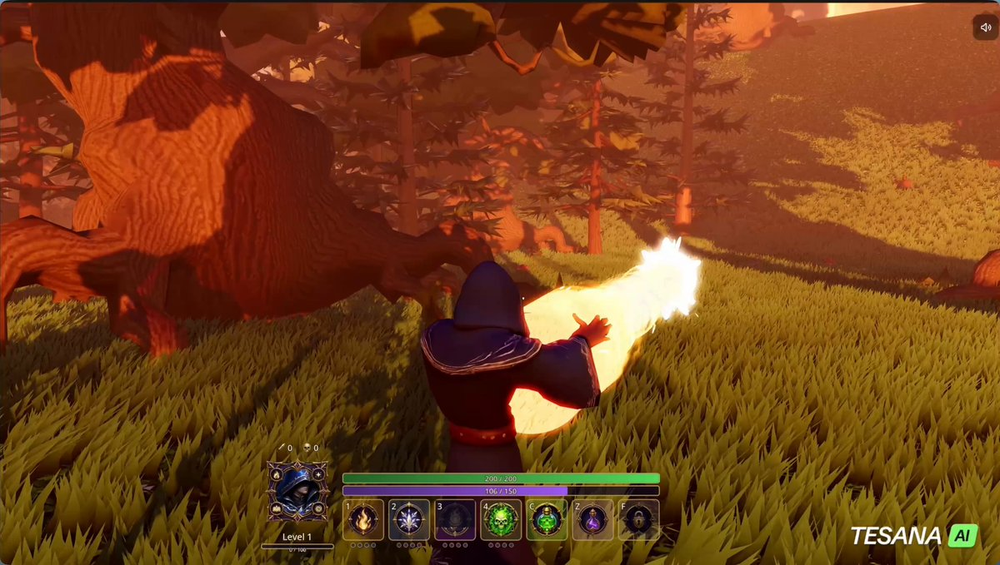</a> <a href="https://video.twimg.com/amplify_video/2102494178517393408/vid/avc1/1908x1080/Gl7GChOzmYEfvQL1.mp4?tag=29">Lire la vidéo source 1</a></td>
</tr>
</table>

Type: Demo | Date: 2026-09-22

---

### Cas 33: [Un jeu de tir à l’arc construit en moins de dix minutes](https://x.com/BhavikY663/status/2102488215445983290) (par [@BhavikY663](https://x.com/BhavikY663))

**Examinez le jeu de tir à l’arc déployé avant de généraliser sa durée de réalisation annoncée de moins de dix minutes.**

L’auteur présente un jeu de tir à l’arc et rapporte en avoir terminé la réalisation et le déploiement en moins de dix minutes.

<table>
<tr>
<td><a href="https://video.twimg.com/amplify_video/2102487312605282304/vid/avc1/1894x908/nC1fTviIGjTjFt0O.mp4?tag=29">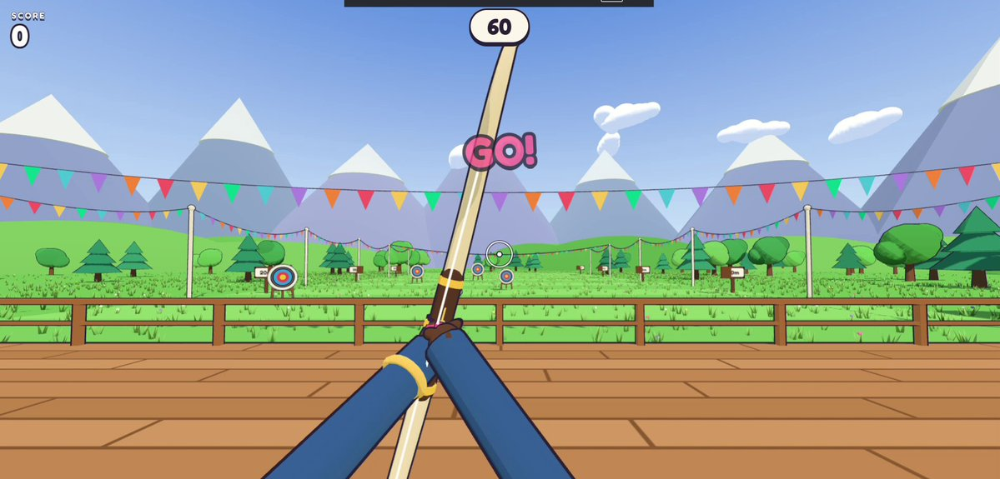</a> <a href="https://video.twimg.com/amplify_video/2102487312605282304/vid/avc1/1894x908/nC1fTviIGjTjFt0O.mp4?tag=29">Lire la vidéo source 1</a></td>
<td><a href="https://x.com/BhavikY663/status/2102488215445983290">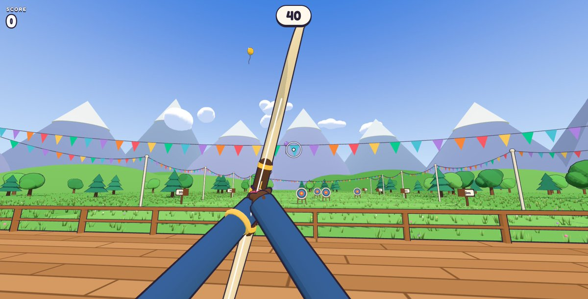</a> <a href="https://x.com/BhavikY663/status/2102488215445983290">Pièce jointe de la source 2</a></td>
</tr>
<tr>
<td><a href="https://x.com/BhavikY663/status/2102488215445983290">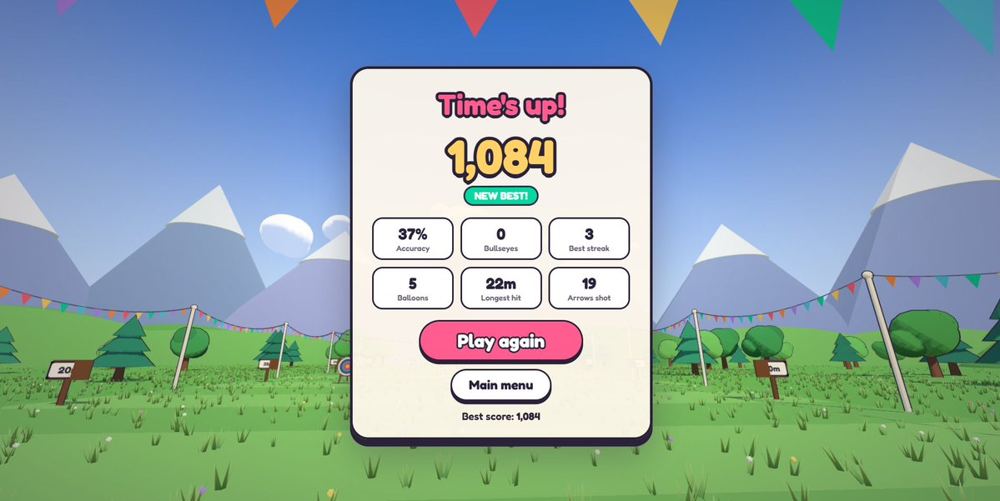</a> <a href="https://x.com/BhavikY663/status/2102488215445983290">Pièce jointe de la source 3</a></td>
</tr>
</table>

Type: Demo | Date: 2026-09-22

---

### Cas 34: [Comparaisons de clones de Minecraft et Warcraft](https://news.ycombinator.com/item?id=49807724) (par [@senko](https://news.ycombinator.com/user?id=senko))

**Comparez les jeux publiés et leurs consignes en conservant le contexte de l’effort, du temps d’exécution et des coûts estimés.**

L’auteur partage les résultats jouables et les consignes d’Opus 5.5, Fable 5.1 et Astra pour deux jeux. Opus a pris environ 45 minutes au réglage xhigh dans Claude Code ; $11–14 correspond à une estimation en équivalent API de l’utilisation sur abonnement.

Type: Evaluation | Date: 2026-09-22

---

### Cas 35: [Score et coût sur Runescape Bench](https://x.com/maxbittker/status/2102451744030490912) (par [@maxbittker](https://x.com/maxbittker))

**Interprétez le prix et le classement annoncés sur Runescape Bench uniquement pour ses tâches de jeu.**

L’auteur place Opus 5.5 en deuxième position derrière Astra sur Runescape Bench, pour environ un tiers du prix. Ce résultat de benchmark concerne des tâches de jeu et ne mesure pas tous les scénarios de jeu ou de développement.

<table>
<tr>
<td><a href="https://x.com/maxbittker/status/2102451744030490912">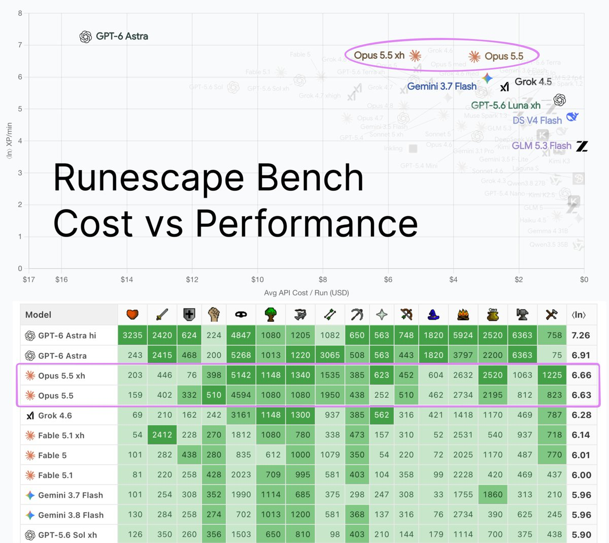</a> <a href="https://x.com/maxbittker/status/2102451744030490912">Pièce jointe de la source 1</a></td>
</tr>
</table>

Type: Evaluation | Date: 2026-09-22

---

## 🧩 Apprentissage interactif et visualisation

### Cas 36: [Un fond d’écran interactif de récif corallien](https://x.com/chaseleantj/status/2102480866404360215) (par [@chaseleantj](https://x.com/chaseleantj))

**Prenez l’interaction permettant de nourrir les poissons comme référence pour rendre interactif un fond d’écran d’ambiance.**

L’auteur présente un fond d’écran de récif corallien avec une interaction permettant aux utilisateurs de nourrir les poissons.

<table>
<tr>
<td><a href="https://video.twimg.com/amplify_video/2102479905212473344/vid/avc1/1920x1080/wayY24Um6q4mzTVd.mp4?tag=29">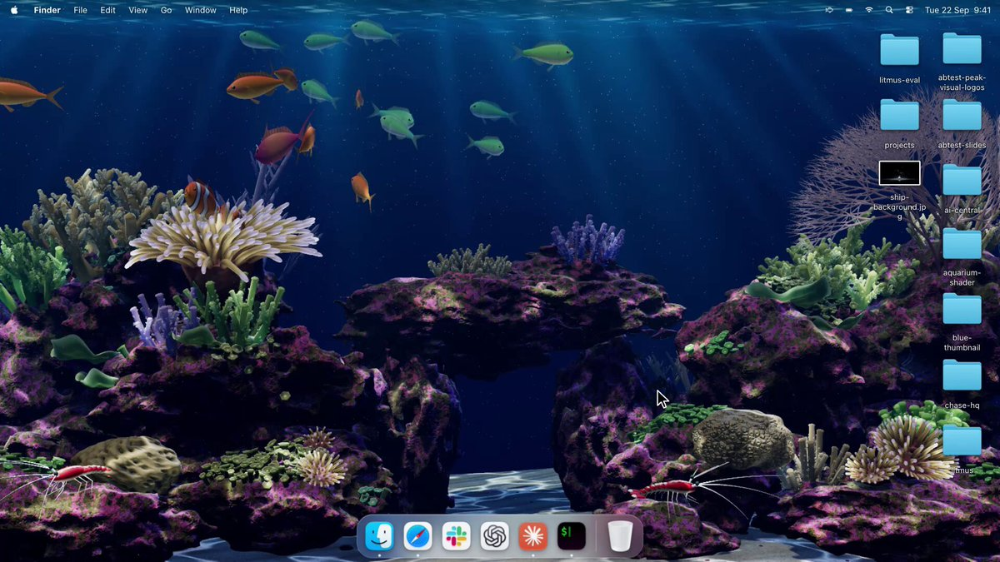</a> <a href="https://video.twimg.com/amplify_video/2102479905212473344/vid/avc1/1920x1080/wayY24Um6q4mzTVd.mp4?tag=29">Lire la vidéo source 1</a></td>
</tr>
</table>

Type: Demo | Date: 2026-09-22

---

### Cas 37: [Une simulation d’eau issue d’un direct](https://x.com/Avenoxai/status/2102500841097756743) (par [@Avenoxai](https://x.com/Avenoxai))

**Examinez la simulation d’eau présentée comme l’un des résultats d’une session en direct plus longue.**

L’auteur construit des simulations d’eau pendant un direct ; cette publication montre l’un des trois résultats.

<table>
<tr>
<td> <a href="https://video.twimg.com/amplify_video/2102500422355185664/vid/avc1/1920x1080/BOGmZuGWcsfynubs.mp4?tag=29">Lire la vidéo source 1</a></td>
</tr>
</table>

Type: Demo | Date: 2026-09-22

---

### Cas 38: [Recréer de l’eau en 3D à partir d’une vidéo](https://x.com/Aurelien_Gz/status/2102479887495758076) (par [@Aurelien_Gz](https://x.com/Aurelien_Gz))

**Comparez l’eau recréée à la vidéo de référence avant d’adopter le jugement de fidélité de l’auteur.**

L’auteur présente une recréation d’eau en 3D à partir d’une vidéo de référence, réalisée en une passe, et la juge proche de l’original. La référence citée est une démonstration d’eau de Grok 4.7.

<table>
<tr>
<td> <a href="https://video.twimg.com/amplify_video/2102479821364142080/vid/avc1/1080x1724/aFlEwHrgDcqZeJzL.mp4?tag=29">Lire la vidéo source 1</a></td>
</tr>
</table>

Type: Demo | Date: 2026-09-22

---

### Cas 39: [Explorer l’anatomie de la main par couches](https://x.com/higgsfield_ai/status/2102517718754943254) (par [@higgsfield_ai](https://x.com/higgsfield_ai))

**Examinez l’interface anatomique par couches sans vous fier à ses suggestions non validées sur la douleur ou la récupération.**

La démonstration Higgsfield montre l’anatomie de la main par couches, avec os, muscles et tendons, et utilise une webcam ou des clics pour localiser la douleur. Les causes suggérées et les conseils de récupération n’ont pas été validés.

<table>
<tr>
<td><a href="https://video.twimg.com/amplify_video/2102516830602694656/vid/avc1/1920x1440/YWdHkhGrtKK9F20r.mp4?tag=29">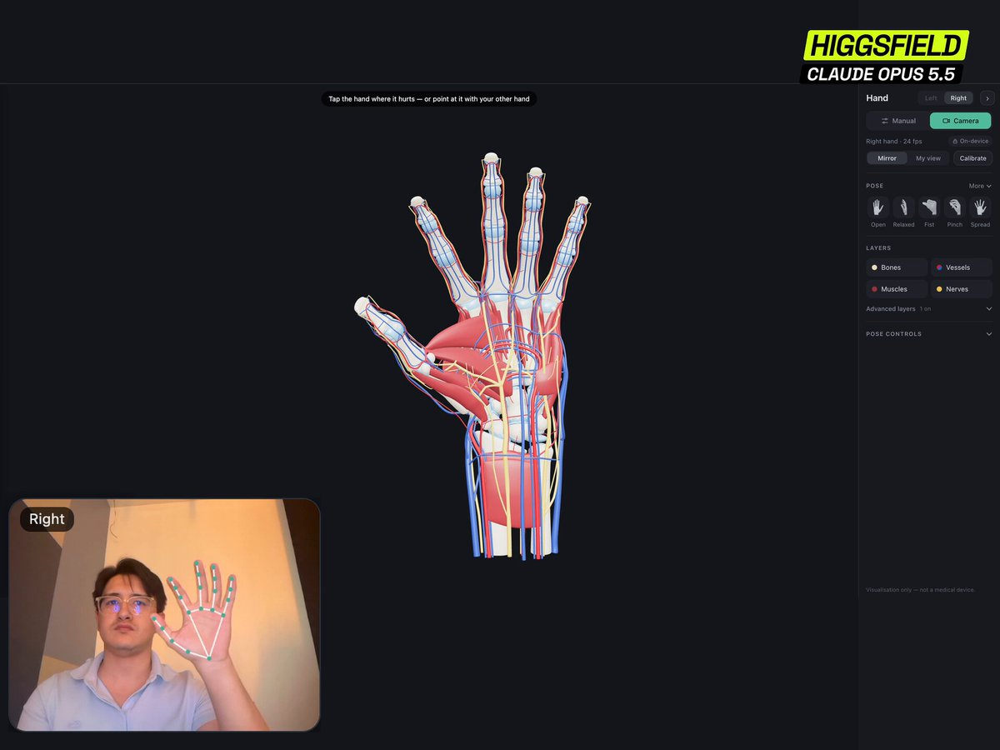</a> <a href="https://video.twimg.com/amplify_video/2102516830602694656/vid/avc1/1920x1440/YWdHkhGrtKK9F20r.mp4?tag=29">Lire la vidéo source 1</a></td>
</tr>
</table>

Type: Demo | Date: 2026-09-22

---

### Cas 40: [Un simulateur pour toucher de l’herbe dans Kilo Code](https://x.com/coldopn/status/2102474335172640989) (par [@coldopn](https://x.com/coldopn))

**Comparez les simulateurs pour toucher de l’herbe en tenant compte des coûts par exécution déclarés par la plateforme.**

Cette comparaison promotionnelle de plateforme construit un simulateur pour toucher de l’herbe dans Kilo Code et annonce $3.52 pour Grok 4.7 et $7.35 pour Opus 5.5. Ces coûts sont autodéclarés pour cette exécution.

<table>
<tr>
<td><a href="https://video.twimg.com/amplify_video/2102474210299834368/vid/avc1/1920x1080/dVDcRcsC2R5sj_3g.mp4?tag=29">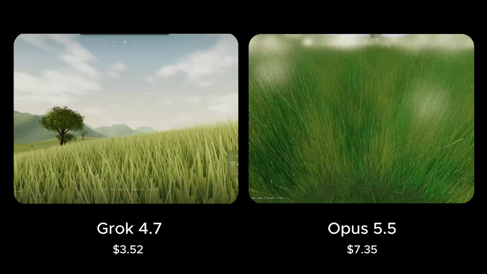</a> <a href="https://video.twimg.com/amplify_video/2102474210299834368/vid/avc1/1920x1080/dVDcRcsC2R5sj_3g.mp4?tag=29">Lire la vidéo source 1</a></td>
</tr>
</table>

Type: Evaluation | Date: 2026-09-22

---

### Cas 41: [D’un croquis de trébuchet à une simulation](https://x.com/brainextends/status/2102464008112755026) (par [@brainextends](https://x.com/brainextends))

**Utilisez ce trébuchet comme référence de passage du croquis à la simulation tout en conservant son statut de présentation de seconde main.**

Cette publication de seconde main partage un croquis de trébuchet transformé en simulation 3D avec physique, commandes et effets sonores, en affirmant qu’une seule consigne a suffi.

<table>
<tr>
<td><a href="https://video.twimg.com/amplify_video/2102461645201268736/vid/avc1/1920x1080/IJV3a2Tr4NH_pPlV.mp4?tag=29">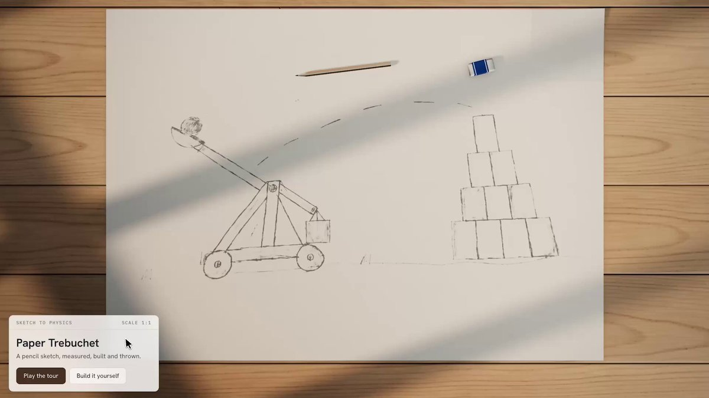</a> <a href="https://video.twimg.com/amplify_video/2102461645201268736/vid/avc1/1920x1080/IJV3a2Tr4NH_pPlV.mp4?tag=29">Lire la vidéo source 1</a></td>
</tr>
</table>

Type: Demo | Date: 2026-09-22

---

### Cas 42: [Rails et mécanismes à pendules](https://x.com/KinasRemek/status/2102509044581691862) (par [@KinasRemek](https://x.com/KinasRemek))

**Distinguez le temps d’exécution API du temps écoulé sans activité pour estimer le coût d’une simulation mécanique.**

L’aperçu montre des rails, des tiges de pendules et d’autres mécanismes. La facture de l’auteur indique 52m 6s d’exécution API et $19.86 ; les 4h 21m écoulées comprennent environ trois heures d’inactivité, et non un travail continu du modèle.

<table>
<tr>
<td><a href="https://video.twimg.com/amplify_video/2102508620118212609/vid/avc1/1920x1080/ptCi9V6eXBAAb2B3.mp4?tag=29">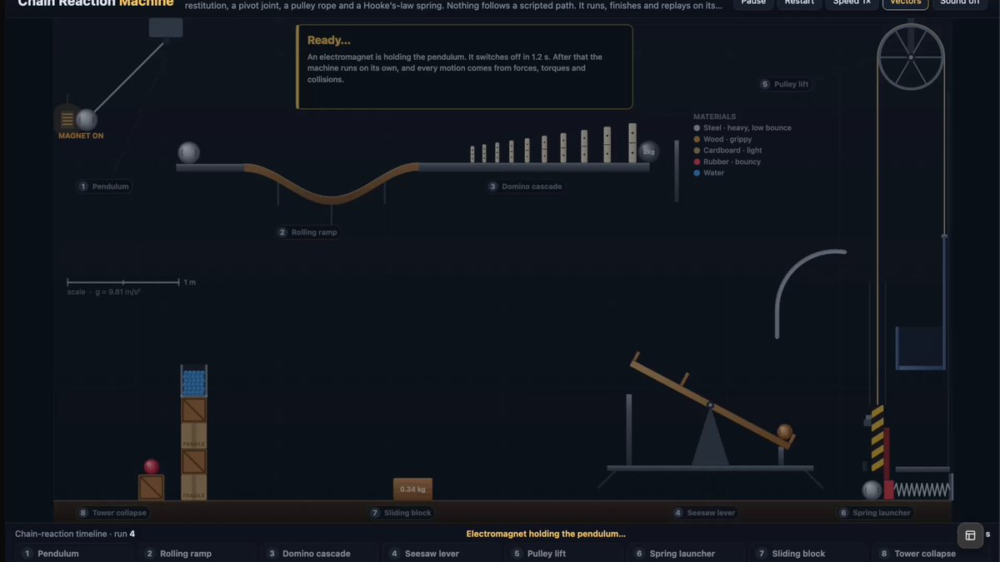</a> <a href="https://video.twimg.com/amplify_video/2102508620118212609/vid/avc1/1920x1080/ptCi9V6eXBAAb2B3.mp4?tag=29">Lire la vidéo source 1</a></td>
</tr>
</table>

Type: Demo | Date: 2026-09-22

---

### Cas 43: [Des visages sous différentes gravités](https://x.com/adilinthewild/status/2102483257267003523) (par [@adilinthewild](https://x.com/adilinthewild))

**Examinez la démonstration de visages soumis à la gravité en conservant la mention de partenariat possible.**

L’auteur présente les changements d’un visage selon différents réglages de gravité dans Higgsfield. Le compte rendu signale un partenariat possible, non confirmé.

<table>
<tr>
<td><a href="https://video.twimg.com/amplify_video/2102483220801658880/vid/avc1/1440x1080/HR14txAqdWLnyA-2.mp4?tag=29">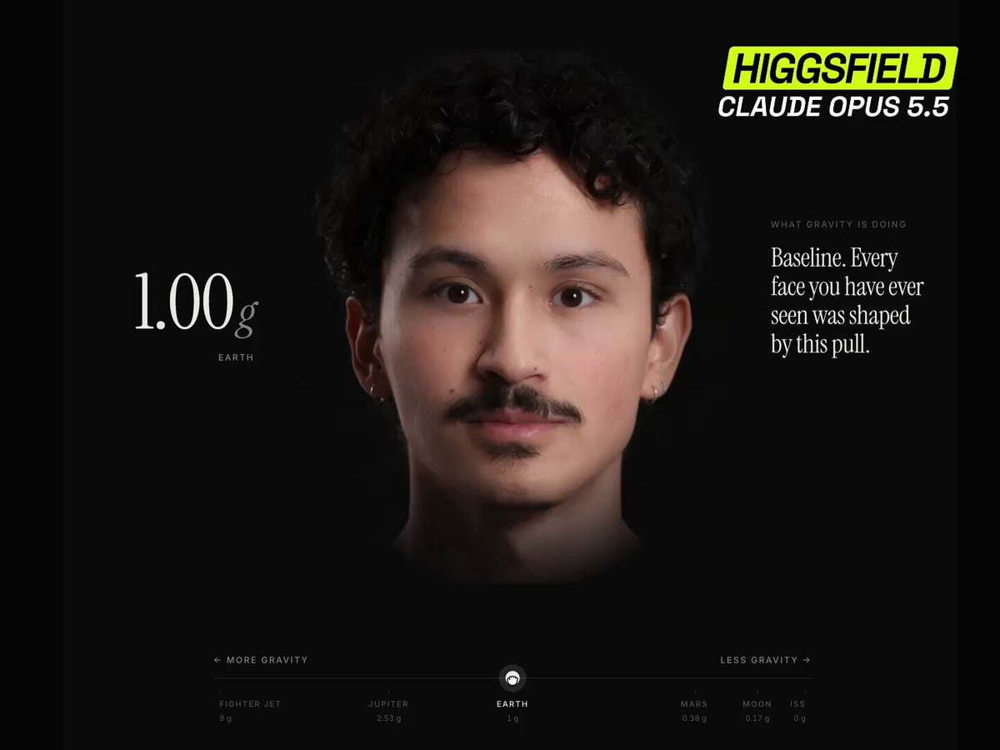</a> <a href="https://video.twimg.com/amplify_video/2102483220801658880/vid/avc1/1440x1080/HR14txAqdWLnyA-2.mp4?tag=29">Lire la vidéo source 1</a></td>
</tr>
</table>

Type: Demo | Date: 2026-09-22

---

### Cas 44: [Expliquer le Web avec des pages reliées](https://x.com/nityeshaga/status/2102477553453998113) (par [@nityeshaga](https://x.com/nityeshaga))

**Envisagez des pages HTML reliées pour une explication explorable, en prévoyant la longue exécution annoncée.**

L’auteur rapporte une unique exécution avec l’effort Medium, durant plus de quatre heures, pour créer des pages HTML interconnectées expliquant le fonctionnement du Web ; un lien permet d’essayer le résultat.

<table>
<tr>
<td><a href="https://video.twimg.com/amplify_video/2102476824601407488/vid/avc1/1920x1080/3t-p0tA2b-YRsSXd.mp4?tag=29">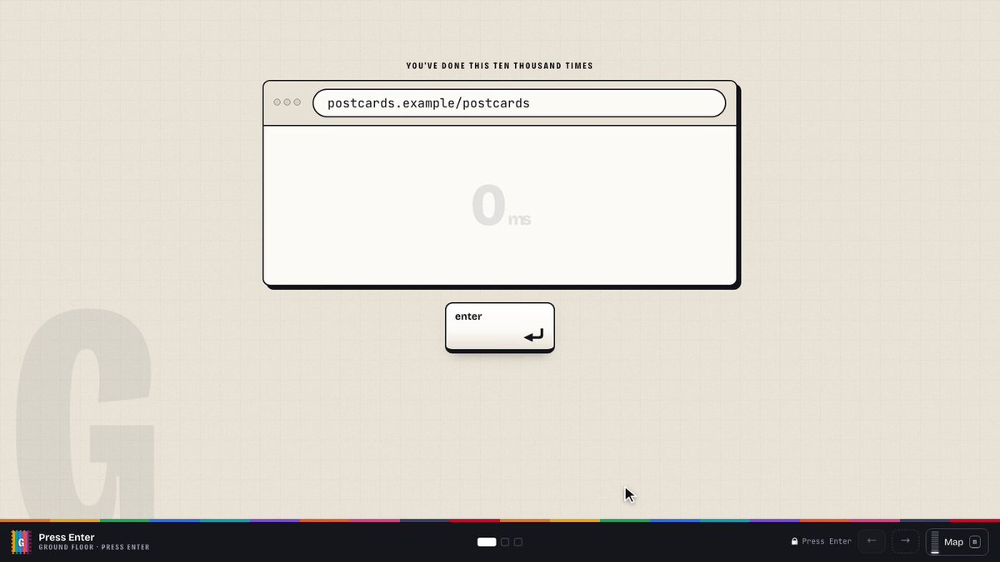</a> <a href="https://video.twimg.com/amplify_video/2102476824601407488/vid/avc1/1920x1080/3t-p0tA2b-YRsSXd.mp4?tag=29">Lire la vidéo source 1</a></td>
</tr>
</table>

Type: Demo | Date: 2026-09-22

---

### Cas 45: [Une page pédagogique pour explorer un œil en 3D](https://x.com/higgsfield_ai/status/2102536138884092185) (par [@higgsfield_ai](https://x.com/higgsfield_ai))

**Prenez cette démonstration explorable de l’œil comme référence pour une interface pédagogique 3D par couches.**

La démonstration promotionnelle de Higgsfield présente une page pédagogique 3D permettant de démonter et d’inspecter un œil, et compare le résultat à GPT-6 Sol.

<table>
<tr>
<td><a href="https://video.twimg.com/amplify_video/2102535899762565120/vid/avc1/1080x1280/3_-03uTkO43CbydA.mp4?tag=29">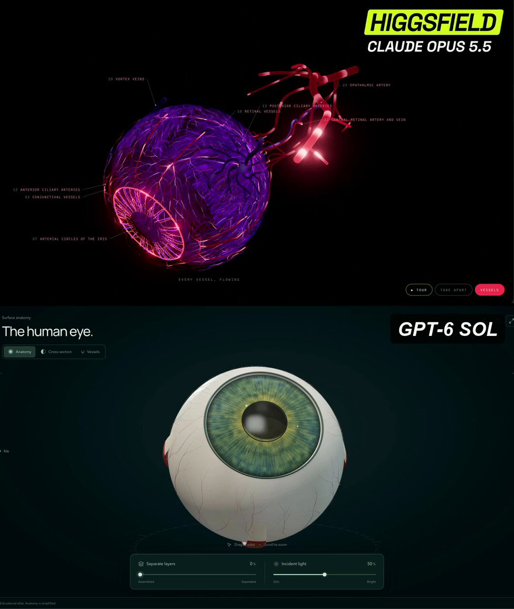</a> <a href="https://video.twimg.com/amplify_video/2102535899762565120/vid/avc1/1080x1280/3_-03uTkO43CbydA.mp4?tag=29">Lire la vidéo source 1</a></td>
</tr>
</table>

Type: Evaluation | Date: 2026-09-22

---

### Cas 46: [Une échelle interactive de l’univers inachevée](https://x.com/Avinash25467/status/2102477459803508800) (par [@Avinash25467](https://x.com/Avinash25467))

**Définissez des points de contrôle de consommation avant de créer un projet interactif allant de l’univers à l’échelle de Planck.**

L’auteur tente un voyage interactif de l’univers observable à l’échelle de Planck, mais atteint la limite d’utilisation Max 5x et n’achève qu’une partie du travail.

<table>
<tr>
<td><a href="https://video.twimg.com/amplify_video/2102475078688739328/vid/avc1/2008x1080/4EGSlryQgo6_260X.mp4?tag=29">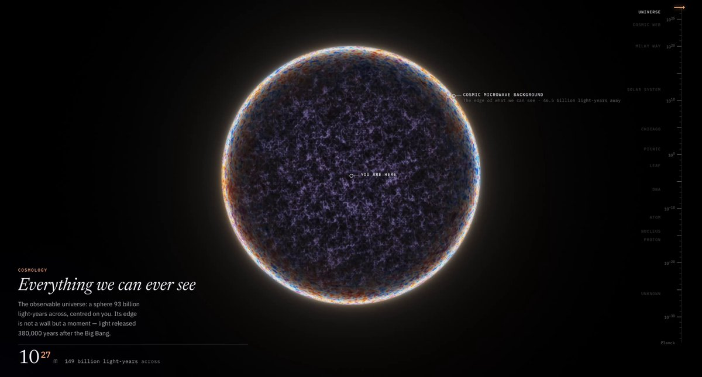</a> <a href="https://video.twimg.com/amplify_video/2102475078688739328/vid/avc1/2008x1080/4EGSlryQgo6_260X.mp4?tag=29">Lire la vidéo source 1</a></td>
</tr>
</table>

Type: Limit | Date: 2026-09-22

---

## 🧩 Modélisation et scènes 3D

### Cas 47: [Comparaison de plans Blender de dix secondes](https://x.com/Stefan_3D_AI/status/2102471841046786153) (par [@Stefan_3D_AI](https://x.com/Stefan_3D_AI))

**Comparez les plans Blender en tenant compte du temps d’exécution, des jetons consommés et du coût en équivalent API.**

Avec la même consigne unique et uniquement Blender, l’auteur compare des plans procéduraux de dix secondes et des accélérés de leur construction. Il annonce pour Opus 35m, 199.6k jetons de sortie et environ $13.3 en équivalent API, contre GPT-6 Astra à 28m, 56.6k jetons et environ $14.5.

<table>
<tr>
<td><a href="https://video.twimg.com/amplify_video/2102468034124464128/vid/avc1/1920x1080/izS4XbbTNf-6MAFA.mp4?tag=29">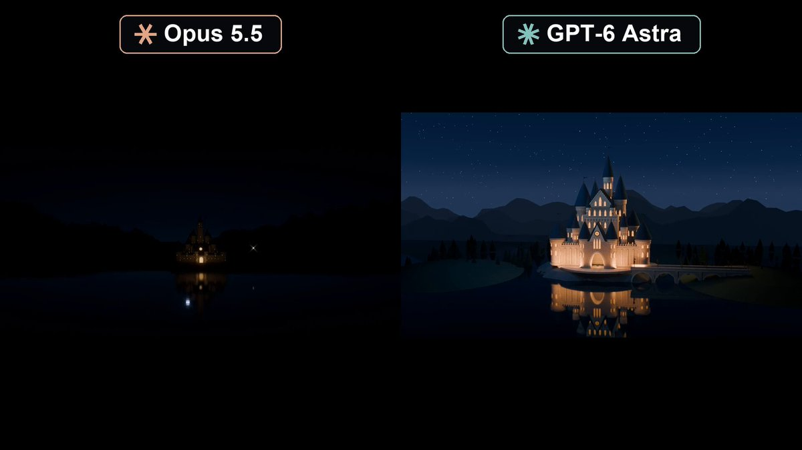</a> <a href="https://video.twimg.com/amplify_video/2102468034124464128/vid/avc1/1920x1080/izS4XbbTNf-6MAFA.mp4?tag=29">Lire la vidéo source 1</a></td>
</tr>
</table>

Sources complémentaires / comptes rendus regroupés: [@Rocketesla_KR](https://x.com/Rocketesla_KR/status/2102531379443679518)

Type: Evaluation | Date: 2026-09-22

---

### Cas 48: [San Francisco dans Unreal Engine avec Jev](https://x.com/MatthewBerman/status/2102483668468195539) (par [@MatthewBerman](https://x.com/MatthewBerman))

**Tenez compte du rôle de Jev pour évaluer les comportements dans cette scène urbaine Unreal Engine.**

L’auteur présente une recréation de San Francisco dans Unreal Engine, dont les comportements des personnes, animaux de compagnie et véhicules sont pilotés par Jev.

<table>
<tr>
<td><a href="https://video.twimg.com/amplify_video/2102483408551366656/vid/avc1/1762x1080/n91fsKuWg74fQd7p.mp4?tag=29">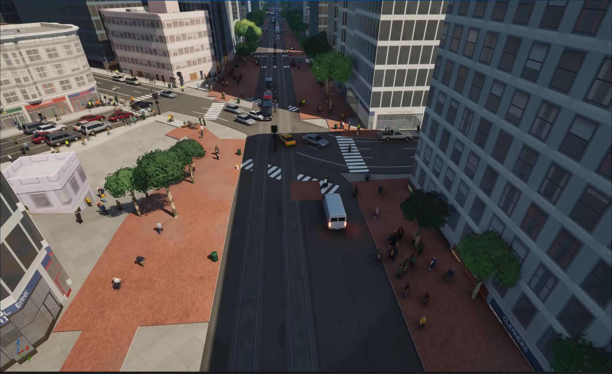</a> <a href="https://video.twimg.com/amplify_video/2102483408551366656/vid/avc1/1762x1080/n91fsKuWg74fQd7p.mp4?tag=29">Lire la vidéo source 1</a></td>
</tr>
</table>

Type: Integration | Date: 2026-09-22

---

### Cas 49: [Un planificateur de salle avec 500 types d’équipements](https://x.com/wesbos/status/2102450119975277027) (par [@wesbos](https://x.com/wesbos))

**Prenez ce planificateur de salle comme référence pour combiner un catalogue d’équipements rendus et des commandes d’agencement.**

L’auteur présente le rendu de 500 types d’équipements de fitness et la création d’un outil d’agencement de salle autour de ce catalogue.

<table>
<tr>
<td><a href="https://video.twimg.com/amplify_video/2102448609593827328/vid/avc1/1274x1080/FIwyxONx4h1KlfUi.mp4?tag=29">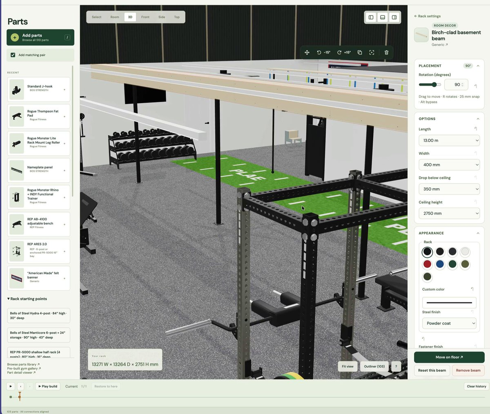</a> <a href="https://video.twimg.com/amplify_video/2102448609593827328/vid/avc1/1274x1080/FIwyxONx4h1KlfUi.mp4?tag=29">Lire la vidéo source 1</a></td>
</tr>
</table>

Type: Demo | Date: 2026-09-22

---

### Cas 50: [Comparaison de quatre modèles sur un lancement de fusée](https://x.com/bridgebench/status/2102476831031017581) (par [@bridgebench](https://x.com/bridgebench))

**Comparez les quatre lancements de fusée avec les durées et coûts déclarés par la plateforme.**

La promotion de BridgeBench compare quatre modèles générant un lancement de fusée 3D à partir d’une consigne. Coût/durée annoncés : GPT-6 Luna sous $0.01/~1m ; GPT-6 Sol $0.11/1m ; Grok 4.7 $0.29/11m ; Opus 5.5 $1.52/12m.

<table>
<tr>
<td><a href="https://video.twimg.com/amplify_video/2102476699703074816/vid/avc1/1920x1080/ekb2NrYtPP9nDxy3.mp4?tag=29">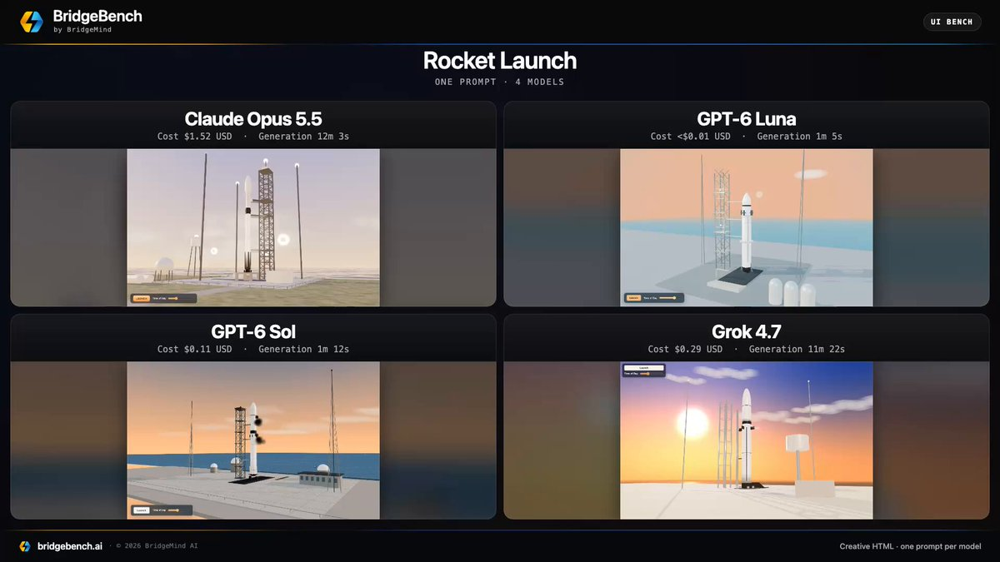</a> <a href="https://video.twimg.com/amplify_video/2102476699703074816/vid/avc1/1920x1080/ekb2NrYtPP9nDxy3.mp4?tag=29">Lire la vidéo source 1</a></td>
</tr>
</table>

Type: Evaluation | Date: 2026-09-22

---

### Cas 51: [Un pélican à vélo](https://x.com/cxjwin/status/2102460145951519077) (par [@cxjwin](https://x.com/cxjwin))

**Examinez ce pélican à vélo comme un résultat visuel plutôt que comme une méthode documentée.**

L’auteur partage une création représentant un pélican à vélo.

<table>
<tr>
<td><a href="https://video.twimg.com/amplify_video/2102460068092600320/vid/avc1/1670x1080/xBvUSubY7iPB6sJr.mp4?tag=29">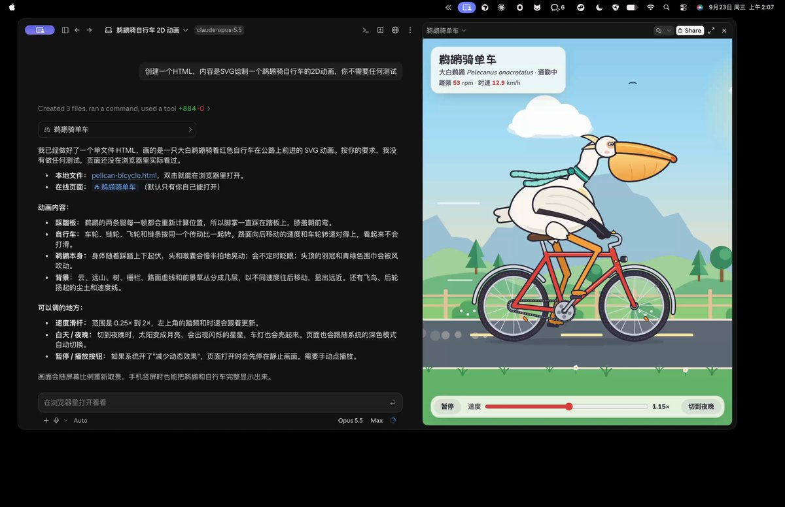</a> <a href="https://video.twimg.com/amplify_video/2102460068092600320/vid/avc1/1670x1080/xBvUSubY7iPB6sJr.mp4?tag=29">Lire la vidéo source 1</a></td>
</tr>
</table>

Type: Demo | Date: 2026-09-22

---

### Cas 52: [Market Street avant le séisme de 1906](https://x.com/alexalbert__/status/2102466523164274839) (par [@alexalbert__](https://x.com/alexalbert__))

**Considérez la scène historique de Market Street comme une interprétation Blender tant que son exactitude n’est pas vérifiée.**

Cette démonstration promotionnelle de plateforme présente une recréation Blender, avec une seule consigne, de Market Street à San Francisco avant le séisme de 1906. L’exactitude historique est une affirmation de l’auteur de la publication.

<table>
<tr>
<td> <a href="https://video.twimg.com/amplify_video/2102465460545675264/vid/avc1/960x680/pI_d-60Nkkemn0zI.mp4?tag=29">Lire la vidéo source 1</a></td>
</tr>
</table>

Type: Demo | Date: 2026-09-22

---

### Cas 53: [Un pélican Blender en boucle comparé à Sol](https://x.com/atomic_chat_hq/status/2102492834485895265) (par [@atomic_chat_hq](https://x.com/atomic_chat_hq))

**Comparez les animations de pélican en boucle en distinguant la préférence de la plateforme pour leur caractère.**

La promotion d’Atomic Chat compare des animations Blender en boucle d’un pélican cycliste à GPT-6 Sol avec la même consigne. Le jugement de charme supérieur est celui de la plateforme.

<table>
<tr>
<td><a href="https://video.twimg.com/amplify_video/2102492119449337856/vid/avc1/1920x1080/n-Z8m5l6RxxMmkfP.mp4?tag=29">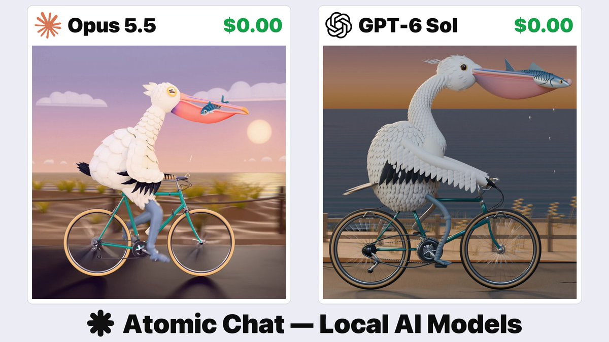</a> <a href="https://video.twimg.com/amplify_video/2102492119449337856/vid/avc1/1920x1080/n-Z8m5l6RxxMmkfP.mp4?tag=29">Lire la vidéo source 1</a></td>
</tr>
</table>

Type: Evaluation | Date: 2026-09-22

---

### Cas 54: [Présentation d’une création Blender](https://x.com/superalesha/status/2102487989381156991) (par [@superalesha](https://x.com/superalesha))

**Examinez directement la création Blender, car la publication n’en décrit ni le sujet ni la méthode.**

L’auteur partage une création Blender sans en préciser le sujet dans le texte de la publication.

<table>
<tr>
<td><a href="https://video.twimg.com/amplify_video/2102487325448028160/vid/avc1/1920x1080/CDO-KMFHFe-hxSjE.mp4?tag=29">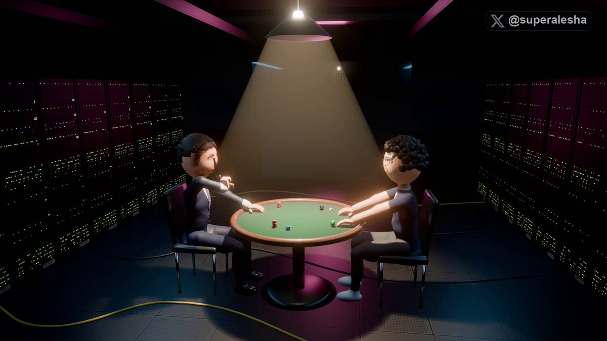</a> <a href="https://video.twimg.com/amplify_video/2102487325448028160/vid/avc1/1920x1080/CDO-KMFHFe-hxSjE.mp4?tag=29">Lire la vidéo source 1</a></td>
</tr>
</table>

Type: Demo | Date: 2026-09-22

---

### Cas 55: [Réalisation d’un moulin dans Blender](https://x.com/higgsfield_ai/status/2102453658889953717) (par [@higgsfield_ai](https://x.com/higgsfield_ai))

**Examinez ce moulin pour étudier une réalisation combinant modélisation, rig, textures et animation dans Blender.**

La démonstration promotionnelle de Higgsfield annonce la réalisation de la modélisation, du rig, des textures et de l’animation d’un moulin Blender en 15 minutes.

<table>
<tr>
<td><a href="https://video.twimg.com/amplify_video/2102453598559055873/vid/avc1/1080x1920/etmIb_DtBCpTHJau.mp4?tag=29">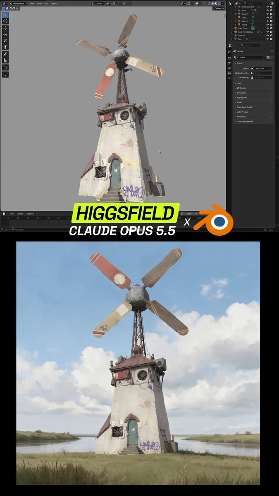</a> <a href="https://video.twimg.com/amplify_video/2102453598559055873/vid/avc1/1080x1920/etmIb_DtBCpTHJau.mp4?tag=29">Lire la vidéo source 1</a></td>
</tr>
</table>

Type: Demo | Date: 2026-09-22

---

### Cas 56: [Le Golden Gate Bridge créé par le code](https://x.com/petergyang/status/2102458049856479474) (par [@petergyang](https://x.com/petergyang))

**Comparez la scène du pont à la référence liée avant d’adopter le jugement qualitatif de l’auteur.**

L’auteur montre une scène du Golden Gate Bridge générée entièrement par le code, juge sa qualité 3D comparable à celle d’Astra et fournit une vidéo de comparaison.

<table>
<tr>
<td> <a href="https://video.twimg.com/amplify_video/2102458011956711424/vid/avc1/1920x1080/bMcVm_7sVQqBZJhx.mp4?tag=16">Lire la vidéo source 1</a></td>
</tr>
</table>

Type: Evaluation | Date: 2026-09-22

---

### Cas 57: [Îles volcaniques, vie marine et aurores](https://x.com/vib3coded/status/2102450239923720440) (par [@vib3coded](https://x.com/vib3coded))

**Évitez de tirer un classement définitif des modèles de ces deux scènes de paysage différentes.**

L’auteur montre une île volcanique, de la vie sous-marine, de la végétation, des mammouths et des aurores, avec un coût annoncé de $1.6 pour Opus 5 contre $3.4 pour Opus 5.5. Il juge les visuels comparables à Astra, tout en précisant que deux scènes différentes ne permettent pas un verdict définitif.

<table>
<tr>
<td><a href="https://video.twimg.com/amplify_video/2102450190217101312/vid/avc1/1920x720/1Db-WwJfI-4dKA9c.mp4?tag=29">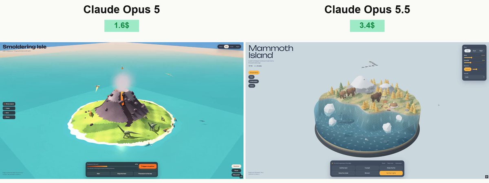</a> <a href="https://video.twimg.com/amplify_video/2102450190217101312/vid/avc1/1920x720/1Db-WwJfI-4dKA9c.mp4?tag=29">Lire la vidéo source 1</a></td>
</tr>
</table>

Type: Evaluation | Date: 2026-09-22

---

### Cas 58: [Reconcevoir les articulations d’un exosquelette dans Blender](https://x.com/higgsfield_ai/status/2102449278283313303) (par [@higgsfield_ai](https://x.com/higgsfield_ai))

**Traitez l’exosquelette remanié comme une proposition de modélisation tant que sa fiabilité mécanique n’est pas validée.**

Higgsfield rapporte une unique exécution de 39 minutes consommant 5.5 millions de jetons pour analyser les faiblesses d’un exosquelette et reconcevoir son modèle 3D Blender jusqu’aux articulations. La fiabilité mécanique n’a pas été validée.

<table>
<tr>
<td><a href="https://video.twimg.com/amplify_video/2102449110007869440/vid/avc1/1440x1440/se7-EmGCUFGrGNLZ.mp4?tag=29">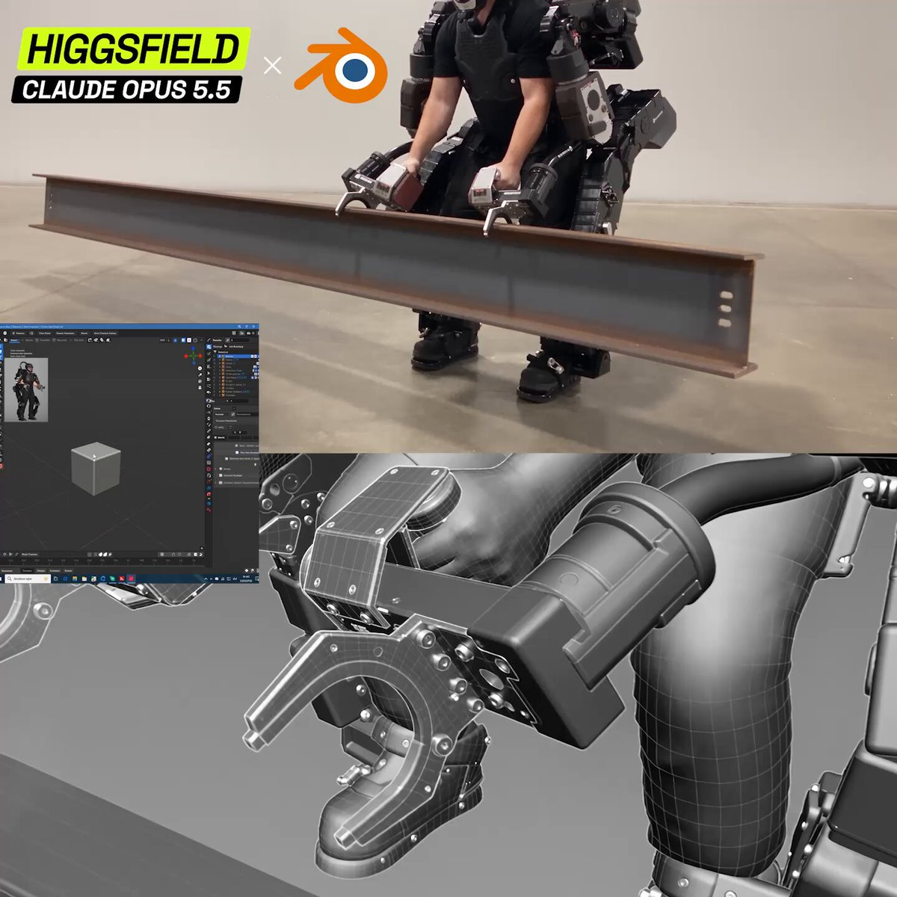</a> <a href="https://video.twimg.com/amplify_video/2102449110007869440/vid/avc1/1440x1440/se7-EmGCUFGrGNLZ.mp4?tag=29">Lire la vidéo source 1</a></td>
</tr>
</table>

Type: Demo | Date: 2026-09-22

---

### Cas 59: [Une ville solarpunk dans Cowork](https://x.com/danveloper/status/2102483043252424986) (par [@danveloper](https://x.com/danveloper))

**Examinez cette scène solarpunk comme un exemple rapporté de construction d’un environnement 3D dans Cowork.**

L’auteur présente une scène de ville solarpunk construite dans Cowork.

<table>
<tr>
<td><a href="https://video.twimg.com/amplify_video/2102482850184404992/vid/avc1/1278x846/aXQLGXAKHJXAxSMZ.mp4?tag=29">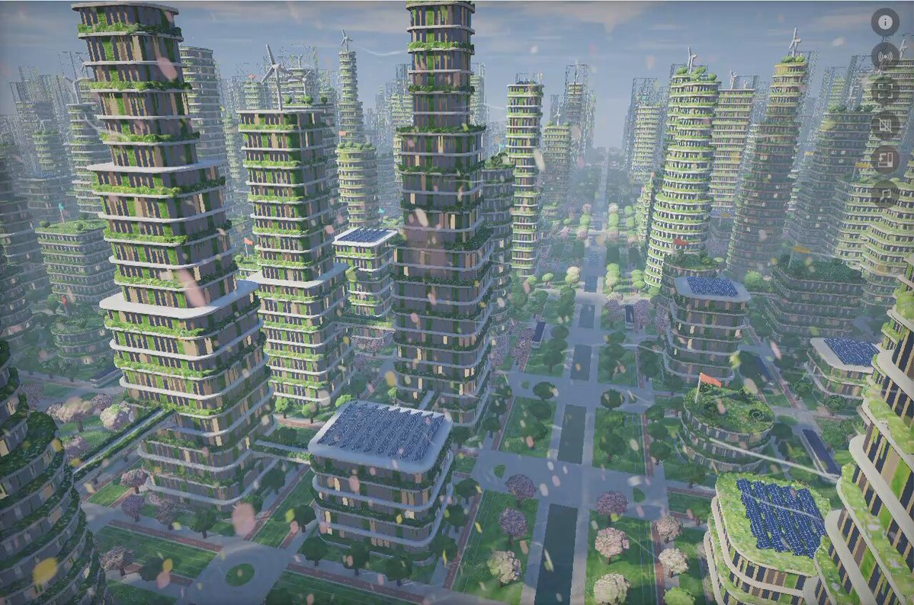</a> <a href="https://video.twimg.com/amplify_video/2102482850184404992/vid/avc1/1278x846/aXQLGXAKHJXAxSMZ.mp4?tag=29">Lire la vidéo source 1</a></td>
</tr>
</table>

Type: Demo | Date: 2026-09-22

---

### Cas 60: [Un quartier de New York en Three.js](https://x.com/aipulseda1ly/status/2102465200666370514) (par [@aipulseda1ly](https://x.com/aipulseda1ly))

**Vérifiez les boucles de rendu et les mouvements de caméra pour comparer les deux scènes de New York.**

L’auteur compare à GPT-6 Sol une scène Three.js de New York avec taxis, toits, Brooklyn Bridge et Central Park. Il indique que ce résultat de Sol est une image statique sans boucle de rendu ni mouvement de caméra.

<table>
<tr>
<td><a href="https://video.twimg.com/amplify_video/2102464915155922944/vid/avc1/1280x1264/7LenXze_nG883sGq.mp4?tag=29">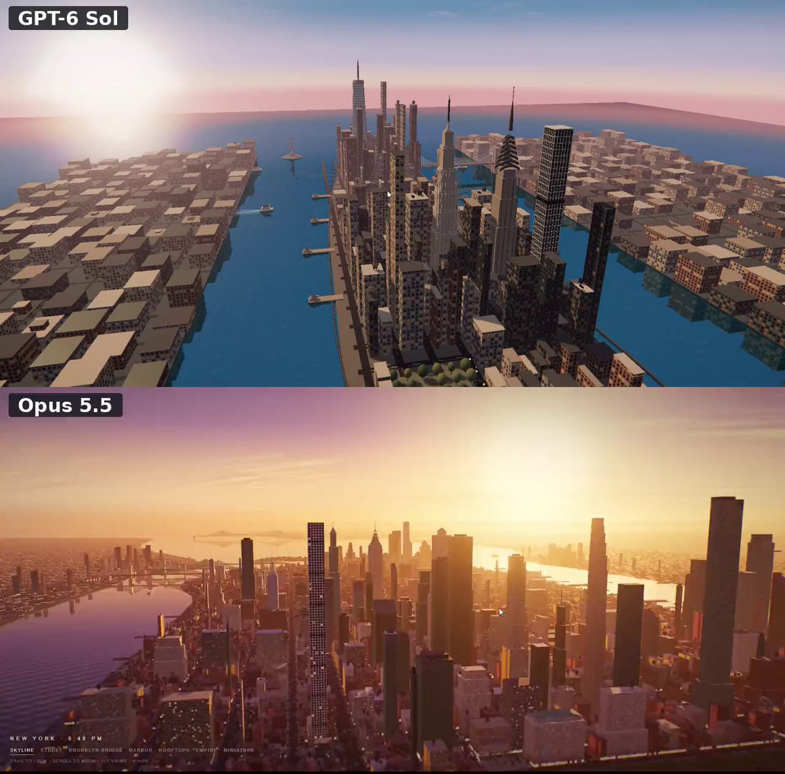</a> <a href="https://video.twimg.com/amplify_video/2102464915155922944/vid/avc1/1280x1264/7LenXze_nG883sGq.mp4?tag=29">Lire la vidéo source 1</a></td>
</tr>
</table>

Type: Evaluation | Date: 2026-09-22

---

### Cas 61: [Une autre création de pélican cycliste](https://x.com/riba2534/status/2102470079254556793) (par [@riba2534](https://x.com/riba2534))

**Examinez ce pélican cycliste comme référence visuelle supplémentaire sur le même sujet.**

L’auteur partage une création de pélican à vélo réalisée avec Opus 5.5.

<table>
<tr>
<td><a href="https://x.com/riba2534/status/2102470079254556793">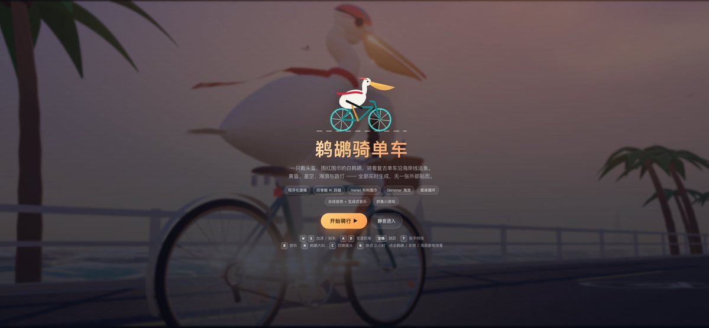</a> <a href="https://x.com/riba2534/status/2102470079254556793">Pièce jointe de la source 1</a></td>
<td><a href="https://x.com/riba2534/status/2102470079254556793">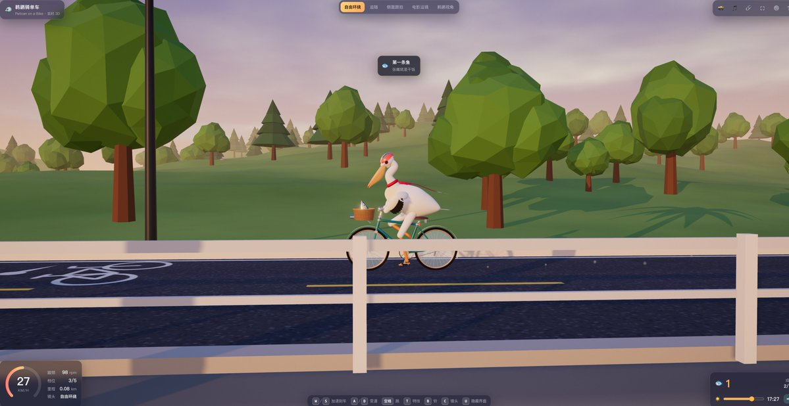</a> <a href="https://x.com/riba2534/status/2102470079254556793">Pièce jointe de la source 2</a></td>
</tr>
<tr>
<td><a href="https://x.com/riba2534/status/2102470079254556793">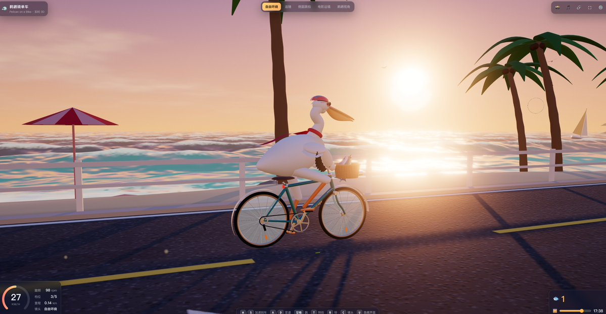</a> <a href="https://x.com/riba2534/status/2102470079254556793">Pièce jointe de la source 3</a></td>
<td><a href="https://x.com/riba2534/status/2102470079254556793">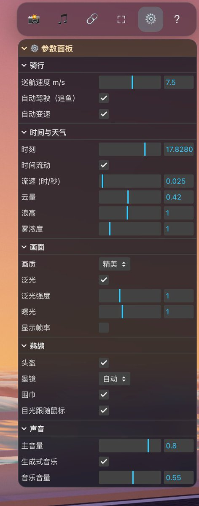</a> <a href="https://x.com/riba2534/status/2102470079254556793">Pièce jointe de la source 4</a></td>
</tr>
</table>

Type: Demo | Date: 2026-09-22

---

### Cas 62: [Un Shinkansen modélisé dans Blender](https://x.com/higgsfield_ai/status/2102507018372436264) (par [@higgsfield_ai](https://x.com/higgsfield_ai))

**Vérifiez le modèle de Shinkansen avant de vous fier aux nombres d’objets et de sièges annoncés par la plateforme.**

La démonstration Higgsfield présente un Shinkansen modélisé dans Blender et annonce 5,112 objets et 430 sièges. Ces nombres sont déclarés par la plateforme.

<table>
<tr>
<td><a href="https://video.twimg.com/amplify_video/2102506945357979648/vid/avc1/1920x1440/pKPWeGfkqx5z0Hxd.mp4?tag=29">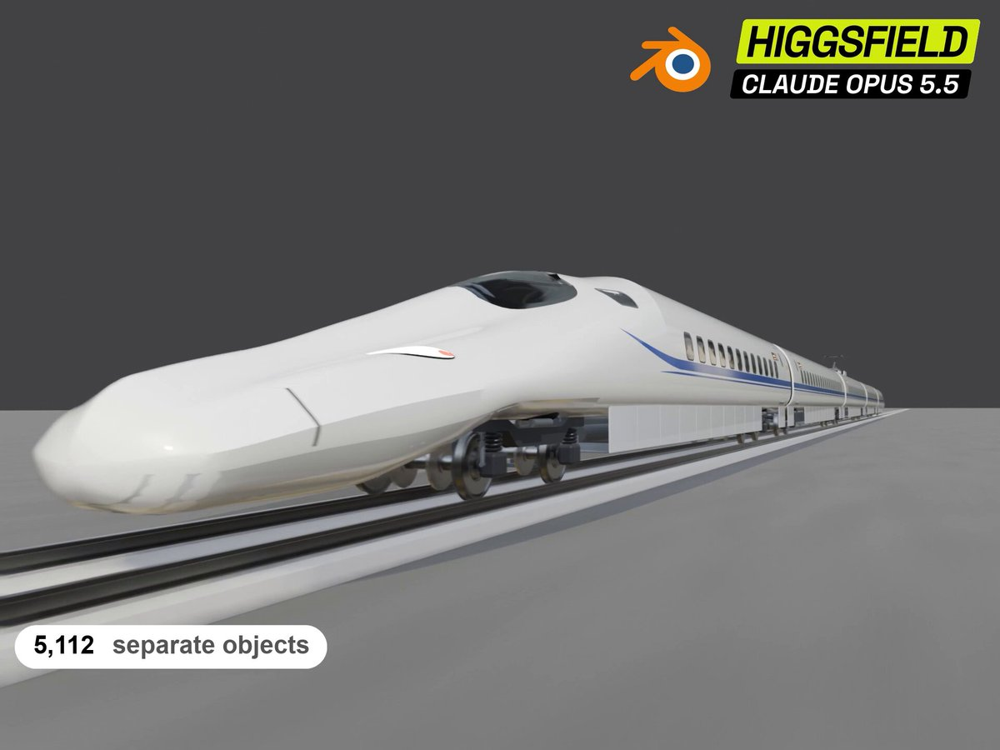</a> <a href="https://video.twimg.com/amplify_video/2102506945357979648/vid/avc1/1920x1440/pKPWeGfkqx5z0Hxd.mp4?tag=29">Lire la vidéo source 1</a></td>
</tr>
</table>

Type: Demo | Date: 2026-09-22

---

### Cas 63: [D’une image à une 3D low-poly](https://x.com/izutorishima/status/2102456991109230759) (par [@izutorishima](https://x.com/izutorishima))

**Évaluez les détails géométriques et la fidélité des couleurs dans ce résultat annoncé de conversion d’image en 3D.**

L’auteur transforme une image en 3D en une passe, apprécie la restitution des couleurs mais juge aussi le résultat trop low-poly. Ces deux observations sont celles de l’auteur.

<table>
<tr>
<td><a href="https://x.com/izutorishima/status/2102456991109230759">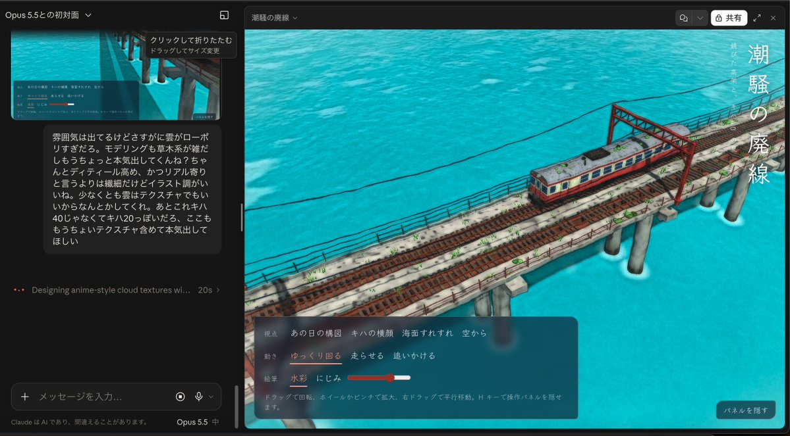</a> <a href="https://x.com/izutorishima/status/2102456991109230759">Pièce jointe de la source 1</a></td>
<td><a href="https://x.com/izutorishima/status/2102456991109230759">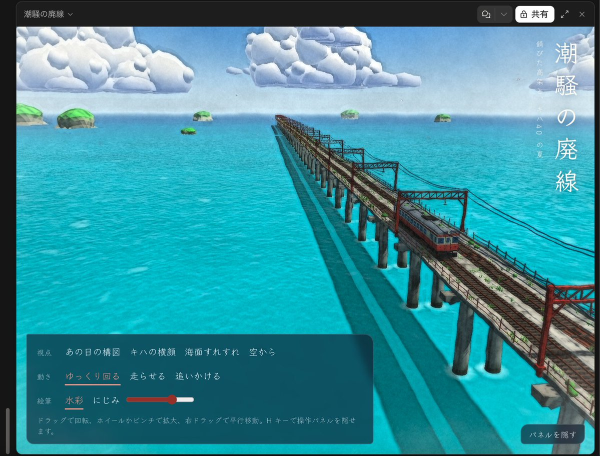</a> <a href="https://x.com/izutorishima/status/2102456991109230759">Pièce jointe de la source 2</a></td>
</tr>
</table>

Type: Demo | Date: 2026-09-22

---

### Cas 64: [Création de personnage avec Tripo P2, JEF et MCP](https://x.com/luccacerf/status/2102478608274989225) (par [@luccacerf](https://x.com/luccacerf))

**Tenez compte de Tripo P2, JEF et Blender MCP pour évaluer cette méthode de création de personnage.**

Cette démonstration avec partenariat déclaré combine Tripo P2, JEF et Blender MCP ; l’auteur annonce 20 minutes pour les maillages, le rig IK avec peinture des poids, les vêtements et l’animation. Son estimation selon laquelle Astra demanderait environ dix heures et deux réinitialisations hebdomadaires ne constitue pas une comparaison contrôlée.

<table>
<tr>
<td><a href="https://video.twimg.com/amplify_video/2102478453639421952/vid/avc1/1966x1080/pxlt3gYx7N7PQdxD.mp4?tag=29">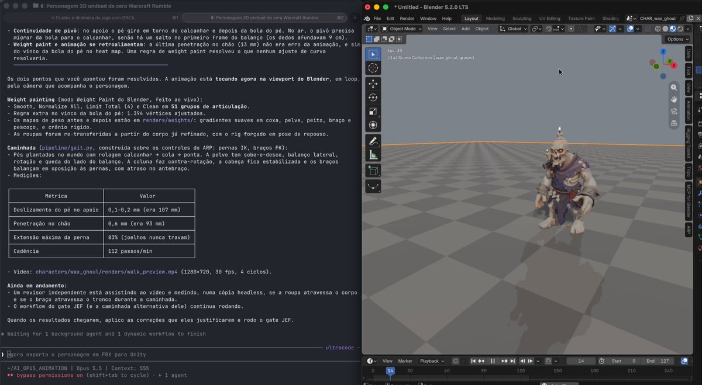</a> <a href="https://video.twimg.com/amplify_video/2102478453639421952/vid/avc1/1966x1080/pxlt3gYx7N7PQdxD.mp4?tag=29">Lire la vidéo source 1</a></td>
</tr>
</table>

Type: Integration | Date: 2026-09-22

---

### Cas 65: [Photos et plans d’une maison transformés en 3D](https://x.com/higgsfield_ai/status/2102499166635352354) (par [@higgsfield_ai](https://x.com/higgsfield_ai))

**Envisagez de combiner une photo de maison et des plans pour prototyper un modèle avec une visionneuse interactive dans le navigateur.**

La démonstration Higgsfield transforme une photo de maison et des plans en modèle Blender accompagné d’une visionneuse hors ligne dans le navigateur pour parcourir les étapes de construction, voir à travers les murs et visiter l’intérieur meublé.

<table>
<tr>
<td><a href="https://video.twimg.com/amplify_video/2102498661171429376/vid/avc1/1600x1280/seuoIgoK393CRt-K.mp4?tag=29">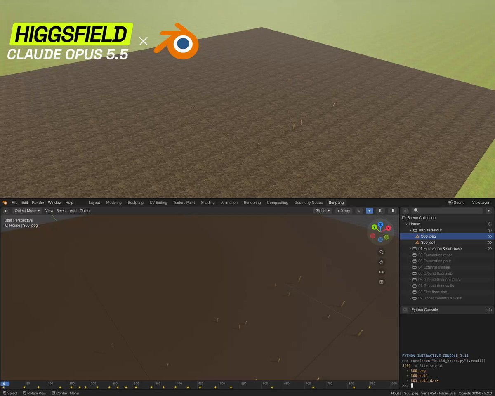</a> <a href="https://video.twimg.com/amplify_video/2102498661171429376/vid/avc1/1600x1280/seuoIgoK393CRt-K.mp4?tag=29">Lire la vidéo source 1</a></td>
</tr>
</table>

Type: Demo | Date: 2026-09-22

---

### Cas 66: [Test de génération d’un bateau en bouteille](https://x.com/Conor_D_Dart/status/2102457201378075081) (par [@Conor_D_Dart](https://x.com/Conor_D_Dart))

**Examinez la composition du bateau en bouteille sans supposer une méthode non documentée.**

L’auteur présente le résultat d’un test de génération de bateau en bouteille.

<table>
<tr>
<td><a href="https://video.twimg.com/amplify_video/2102456712338841601/vid/avc1/1920x1080/Mqtjs0t7WsA_el7k.mp4?tag=29">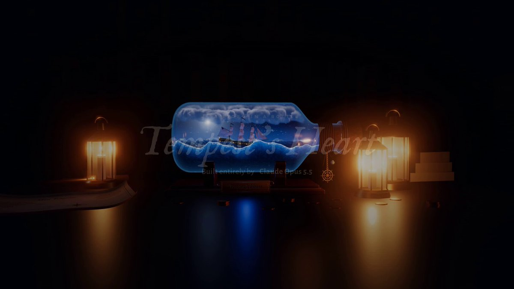</a> <a href="https://video.twimg.com/amplify_video/2102456712338841601/vid/avc1/1920x1080/Mqtjs0t7WsA_el7k.mp4?tag=29">Lire la vidéo source 1</a></td>
</tr>
</table>

Type: Demo | Date: 2026-09-22

---

### Cas 67: [DeLorean, tour de l’horloge et éclair](https://x.com/Stefan_3D_AI/status/2102502889512194348) (par [@Stefan_3D_AI](https://x.com/Stefan_3D_AI))

**Comparez le comportement de la scène animée avec l’utilisation des générateurs, la durée et le coût estimé de chaque modèle.**

L’auteur compare des animations de DeLorean, de tour de l’horloge et d’éclair avec l’effort Max et la même consigne ; les deux modèles utilisent le plugin Blender et le MCP de Higgsfield, avec accès à Nano Banana Pro et Tripo. Résultats annoncés : Opus 73m/218k jetons de sortie/$27.3 en équivalent API, portes/roues fonctionnelles et éclair atteignant sa cible ; GPT-6 Astra 88m/136k/$21.3, sans utiliser les générateurs et en construisant lui-même les 517 objets.

<table>
<tr>
<td><a href="https://video.twimg.com/amplify_video/2102502715033313280/vid/avc1/1920x1080/c2cjexCnCmSQm-yJ.mp4?tag=29">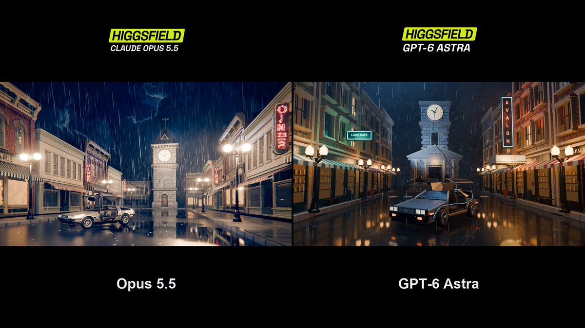</a> <a href="https://video.twimg.com/amplify_video/2102502715033313280/vid/avc1/1920x1080/c2cjexCnCmSQm-yJ.mp4?tag=29">Lire la vidéo source 1</a></td>
</tr>
</table>

Type: Evaluation | Date: 2026-09-22

---

### Cas 68: [Quatre étapes du croquis à la maison terminée](https://x.com/techartist_/status/2102503719762018434) (par [@techartist_](https://x.com/techartist_))

**Utilisez des vues successives Three.js et TSL pour montrer la progression d’un bâtiment du croquis à sa réalisation.**

L’auteur utilise Three.js et TSL pour présenter quatre étapes d’un bâtiment : croquis, volumes, détails et maison terminée.

<table>
<tr>
<td><a href="https://video.twimg.com/amplify_video/2102503194777759744/vid/avc1/1920x1272/t8cX-iwpsjQXi2oC.mp4?tag=29">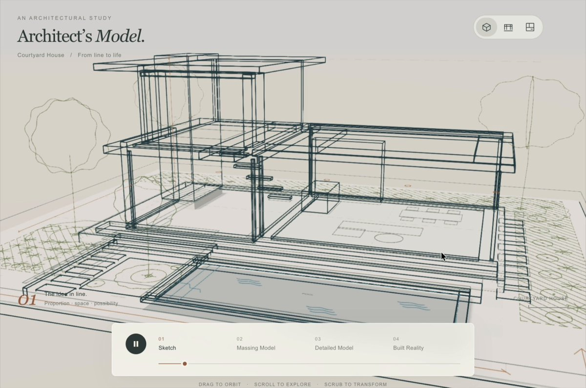</a> <a href="https://video.twimg.com/amplify_video/2102503194777759744/vid/avc1/1920x1272/t8cX-iwpsjQXi2oC.mp4?tag=29">Lire la vidéo source 1</a></td>
</tr>
</table>

Type: Demo | Date: 2026-09-22

---

### Cas 69: [Comparaison de résultats 3D et de coûts déclarés](https://x.com/aimlapi/status/2102515672710533417) (par [@aimlapi](https://x.com/aimlapi))

**Mettez le résultat 3D présenté en balance avec l’écart de coût déclaré par la plateforme.**

La promotion d’AI/ML API compare des résultats 3D et annonce $4.37 pour Opus 5.5 contre $0.34 pour GPT-6 Sol, soit environ 13 fois plus. L’appréciation qualitative est celle de la plateforme.

<table>
<tr>
<td><a href="https://video.twimg.com/amplify_video/2102515321844232193/vid/avc1/1874x1364/STEuP1iOH7NVNKYR.mp4?tag=29">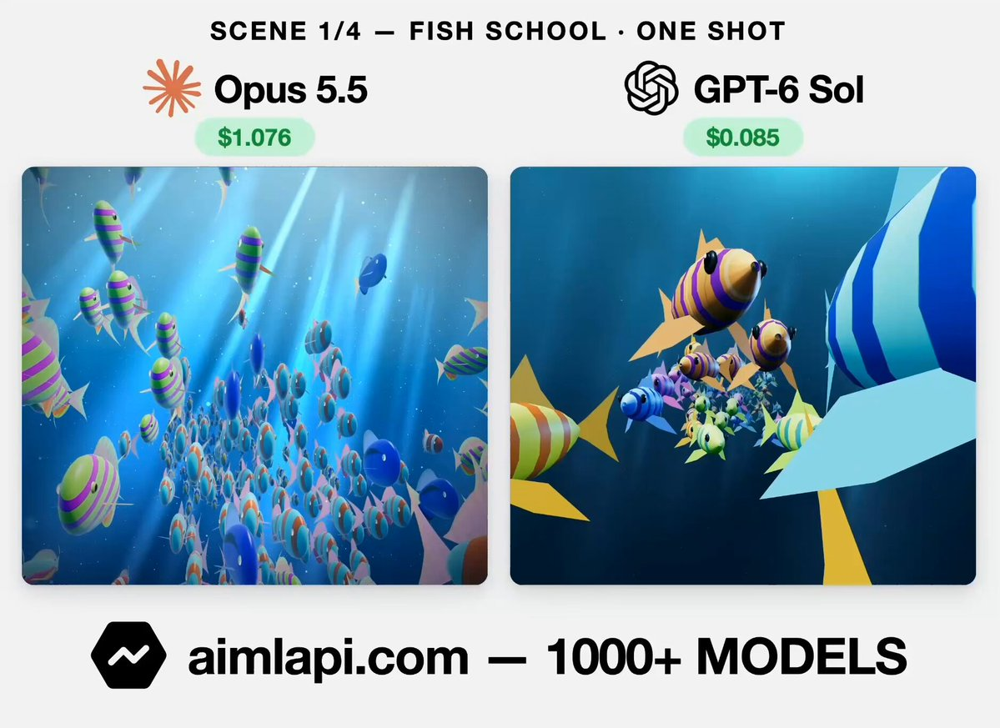</a> <a href="https://video.twimg.com/amplify_video/2102515321844232193/vid/avc1/1874x1364/STEuP1iOH7NVNKYR.mp4?tag=29">Lire la vidéo source 1</a></td>
</tr>
</table>

Sources complémentaires / comptes rendus regroupés: [@testingcatalog](https://x.com/testingcatalog/status/2102523754186256535)

Type: Evaluation | Date: 2026-09-22

---

### Cas 70: [Un tableau transformé en scène explorable](https://x.com/higgsfield_ai/status/2102514727956156600) (par [@higgsfield_ai](https://x.com/higgsfield_ai))

**Prenez cette extension de tableau comme référence pour explorer une composition plane sous plusieurs angles 3D.**

La démonstration Higgsfield étend un tableau en scènes Blender et Unreal Engine consultables sous différents angles.

<table>
<tr>
<td><a href="https://video.twimg.com/amplify_video/2102513304363245568/vid/avc1/1920x1080/32m28m3tVmuYDyYa.mp4?tag=29">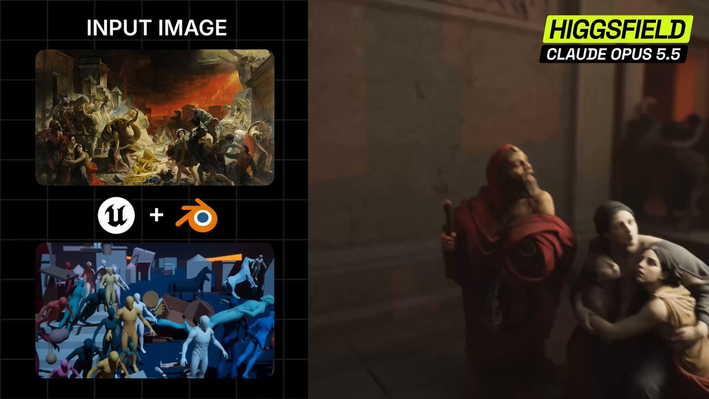</a> <a href="https://video.twimg.com/amplify_video/2102513304363245568/vid/avc1/1920x1080/32m28m3tVmuYDyYa.mp4?tag=29">Lire la vidéo source 1</a></td>
</tr>
</table>

Type: Integration | Date: 2026-09-22

---

### Cas 71: [Un simulateur d’agencement de mobilier en 3D](https://x.com/higgsfield_ai/status/2102510590468239373) (par [@higgsfield_ai](https://x.com/higgsfield_ai))

**Envisagez un simulateur d’agencement 3D pour comparer des dispositions de mobilier avant de choisir un aménagement.**

La démonstration Higgsfield montre un simulateur d’agencement de mobilier permettant d’essayer différentes dispositions en 3D.

<table>
<tr>
<td><a href="https://video.twimg.com/amplify_video/2102510447375380480/vid/avc1/1920x1080/r_KkI2cXkrStcbZG.mp4?tag=29">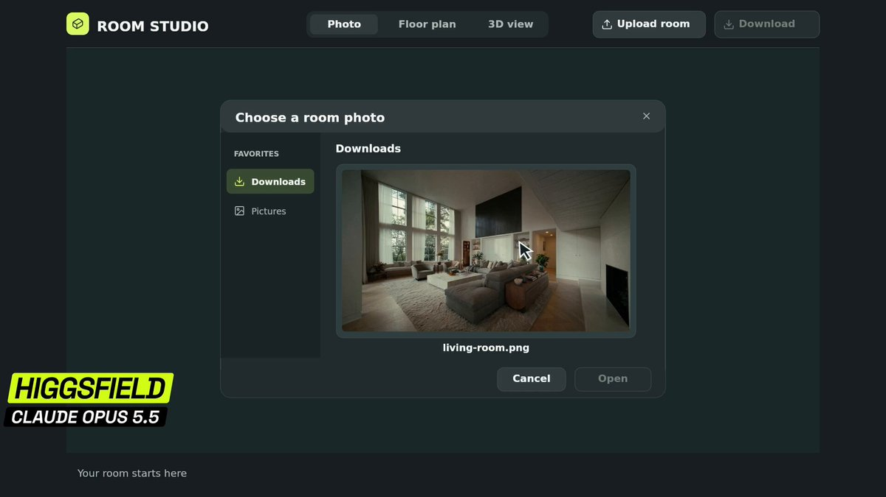</a> <a href="https://video.twimg.com/amplify_video/2102510447375380480/vid/avc1/1920x1080/r_KkI2cXkrStcbZG.mp4?tag=29">Lire la vidéo source 1</a></td>
</tr>
</table>

Type: Demo | Date: 2026-09-22

---

### Cas 72: [Un dessin au fusain transformé en 3D](https://x.com/higgsfield_ai/status/2102519226099761608) (par [@higgsfield_ai](https://x.com/higgsfield_ai))

**Examinez comment la conversion du fusain vers Blender transfère les textures du dessin dans une scène 3D.**

La démonstration Higgsfield convertit un dessin au fusain en scène Blender 3D en conservant la texture de ses traits.

<table>
<tr>
<td><a href="https://video.twimg.com/amplify_video/2102519117756641280/vid/avc1/1080x1080/fHf50hAmOIOh3Csf.mp4?tag=29">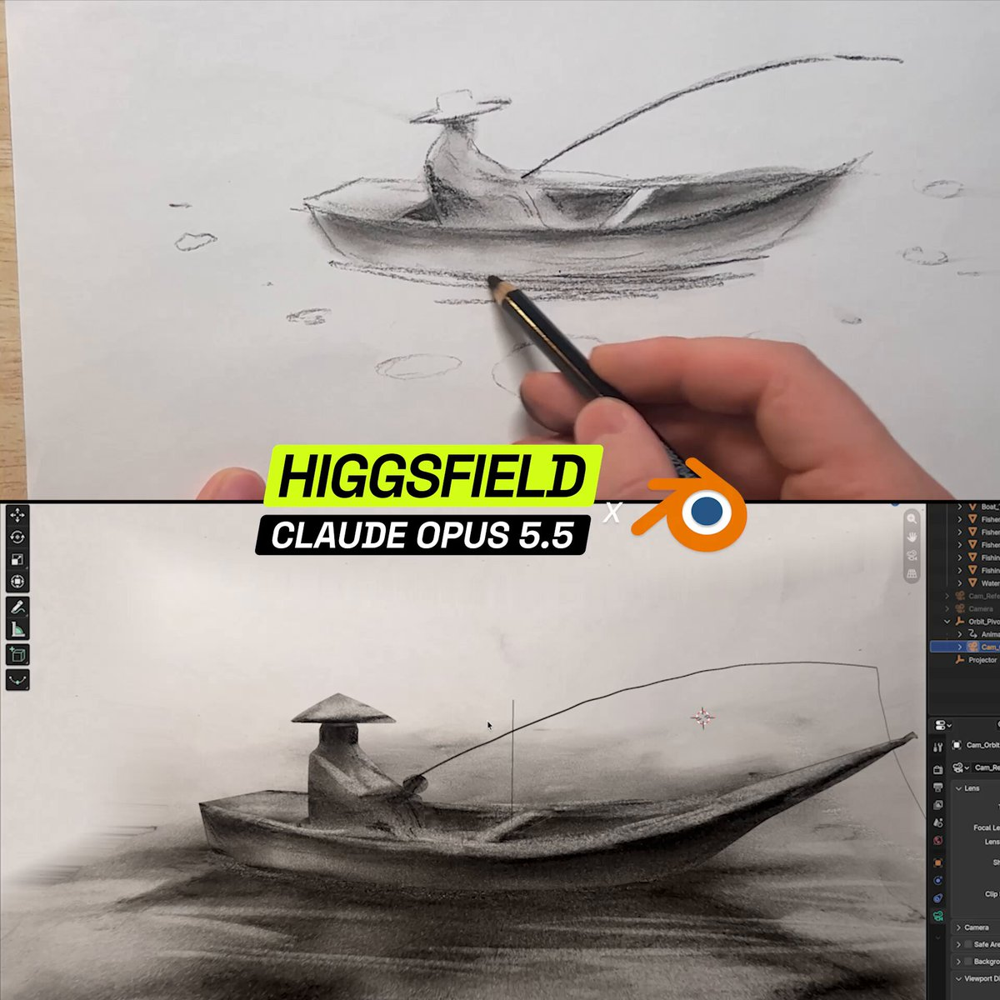</a> <a href="https://video.twimg.com/amplify_video/2102519117756641280/vid/avc1/1080x1080/fHf50hAmOIOh3Csf.mp4?tag=29">Lire la vidéo source 1</a></td>
</tr>
</table>

Type: Demo | Date: 2026-09-22

---

### Cas 73: [Visite multijoueur d’un port méditerranéen](https://x.com/karankendre/status/2102475904752754923) (par [@karankendre](https://x.com/karankendre))

**Distinguez le décor et le son procéduraux des personnes importées pour évaluer cette visite portuaire.**

L’auteur présente une visite multijoueur dans le navigateur d’une ville portuaire méditerranéenne. Les scènes et les sons sont procéduraux, tandis que les personnes proviennent de ressources numérisées importées.

<table>
<tr>
<td><a href="https://video.twimg.com/amplify_video/2102474431834861568/vid/avc1/1894x996/PeiaAtcPEK-ztlms.mp4?tag=29">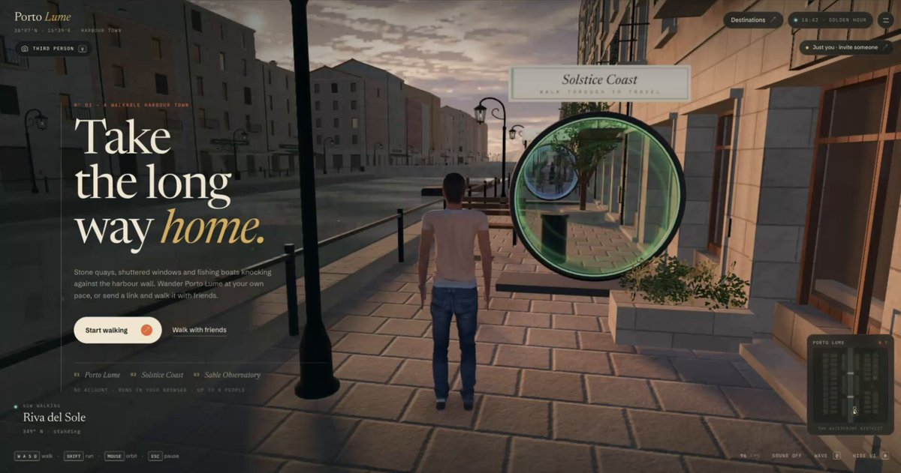</a> <a href="https://video.twimg.com/amplify_video/2102474431834861568/vid/avc1/1894x996/PeiaAtcPEK-ztlms.mp4?tag=29">Lire la vidéo source 1</a></td>
</tr>
</table>

Type: Demo | Date: 2026-09-22

---

### Cas 74: [Démonstration d’une manette 3D](https://x.com/marmaduke091/status/2102506267755639143) (par [@marmaduke091](https://x.com/marmaduke091))

**Examinez la manette et la vidéo demandée séparément de la tâche SVG antérieure citée.**

L’auteur rapporte une manette 3D réalisée en une passe et demande au modèle de produire une vidéo partageable. La publication citée décrit la tâche antérieure dans Claude Code comme un SVG de manette Xbox.

<table>
<tr>
<td><a href="https://video.twimg.com/amplify_video/2102505788438638592/vid/avc1/1920x1080/KQ4HsCHWj7vOKXdU.mp4?tag=29">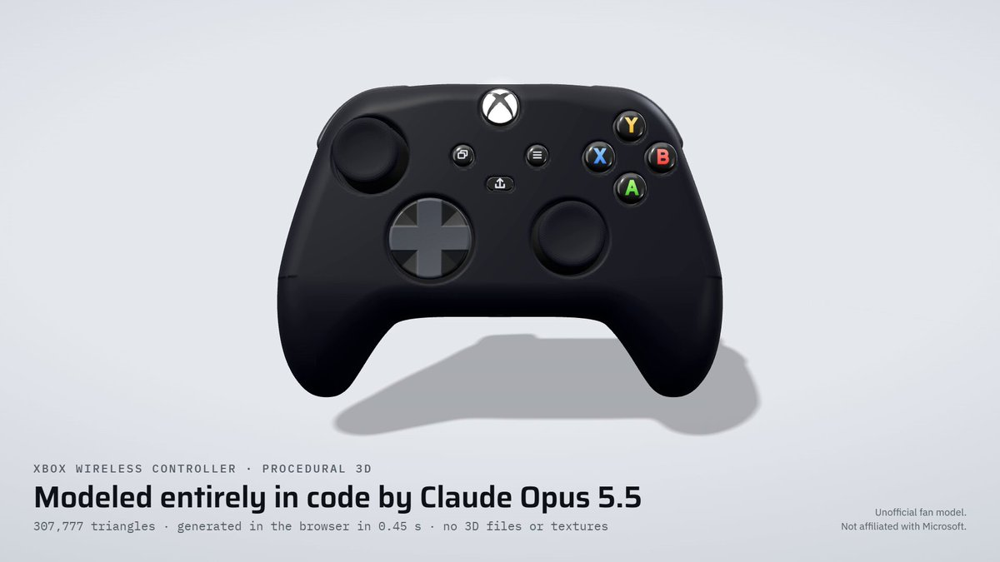</a> <a href="https://video.twimg.com/amplify_video/2102505788438638592/vid/avc1/1920x1080/KQ4HsCHWj7vOKXdU.mp4?tag=29">Lire la vidéo source 1</a></td>
</tr>
</table>

Type: Demo | Date: 2026-09-22

---

### Cas 75: [Un jardin de temple de style Minecraft](https://x.com/notjazii/status/2102499296512025026) (par [@notjazii](https://x.com/notjazii))

**Comparez les aperçus du jardin de temple sans généraliser la préférence de l’auteur pour un modèle.**

L’auteur compare Opus 5.5 à GPT-6 Astra ; l’aperçu multimédia montre un jardin de temple de style Minecraft. La préférence exprimée correspond à son appréciation de ce test.

<table>
<tr>
<td><a href="https://x.com/notjazii/status/2102499296512025026">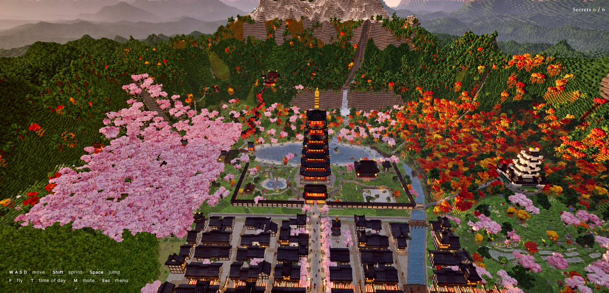</a> <a href="https://x.com/notjazii/status/2102499296512025026">Pièce jointe de la source 1</a></td>
<td><a href="https://x.com/notjazii/status/2102499296512025026">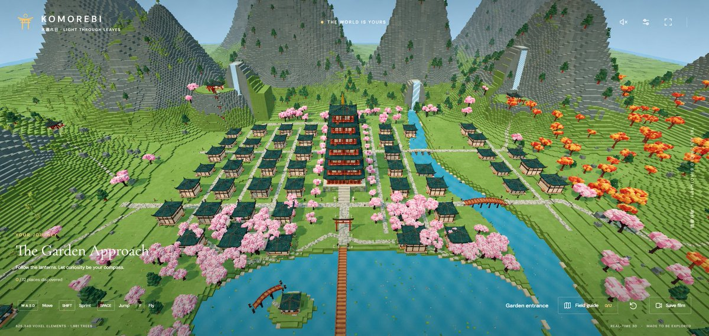</a> <a href="https://x.com/notjazii/status/2102499296512025026">Pièce jointe de la source 2</a></td>
</tr>
</table>

Type: Evaluation | Date: 2026-09-22

---

### Cas 76: [Modélisation et animation d’une pieuvre dans Blender](https://x.com/higgsfield_ai/status/2102526940859232433) (par [@higgsfield_ai](https://x.com/higgsfield_ai))

**Examinez le modèle et l’animation de la pieuvre sans assimiler la formule promotionnelle de la plateforme à une note de qualité.**

La démonstration Higgsfield montre la modélisation et l’animation d’une pieuvre dans Blender. L’expression « qualité AAA » est une affirmation promotionnelle, et non une évaluation qualitative indépendante.

<table>
<tr>
<td><a href="https://video.twimg.com/amplify_video/2102526840716115968/vid/avc1/1920x1440/zrQ_fyK4adTJQLrn.mp4?tag=29">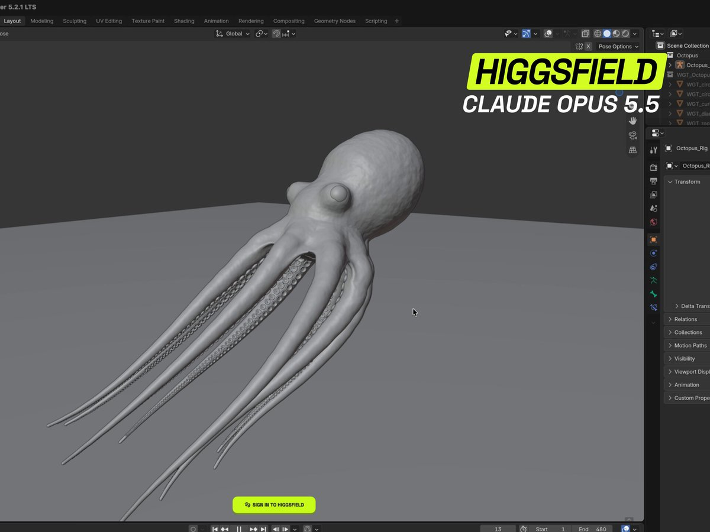</a> <a href="https://video.twimg.com/amplify_video/2102526840716115968/vid/avc1/1920x1440/zrQ_fyK4adTJQLrn.mp4?tag=29">Lire la vidéo source 1</a></td>
</tr>
</table>

Type: Demo | Date: 2026-09-22

---

### Cas 77: [Comparaison de New York avec la même consigne](https://x.com/aipulseda1ly/status/2102457160881905906) (par [@aipulseda1ly](https://x.com/aipulseda1ly))

**Comparez les scènes de New York réalisées avec le même brief en conservant la version et le réglage d’effort de chaque modèle.**

L’auteur compare Opus 5.5 avec l’effort High à Opus 5 sur la même tâche de scène new-yorkaise, comprenant l’Empire State Building, Brooklyn Bridge, les arbres de Central Park et des cirrus au coucher du soleil.

<table>
<tr>
<td><a href="https://video.twimg.com/amplify_video/2102456980002492416/vid/avc1/1280x1264/YftIx9f6m4YFCTa5.mp4?tag=29">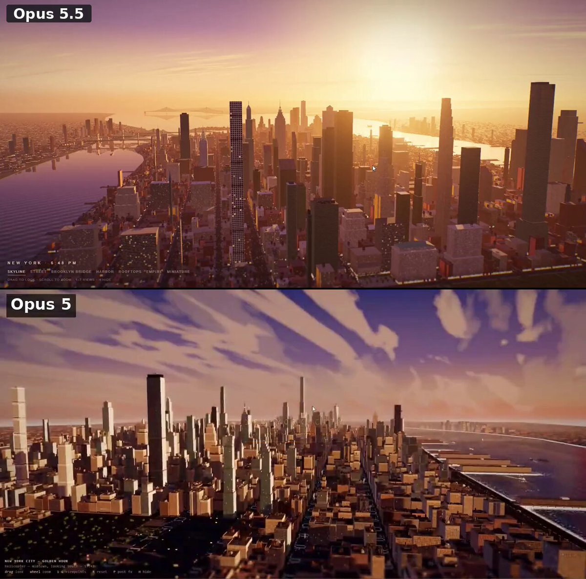</a> <a href="https://video.twimg.com/amplify_video/2102456980002492416/vid/avc1/1280x1264/YftIx9f6m4YFCTa5.mp4?tag=29">Lire la vidéo source 1</a></td>
</tr>
</table>

Type: Evaluation | Date: 2026-09-22

---

### Cas 78: [Un vol panoramique à travers plusieurs paysages](https://x.com/petergyang/status/2102518420285927598) (par [@petergyang](https://x.com/petergyang))

**Consultez la vidéo de réalisation pour comprendre comment le vol panoramique relie ses différents paysages.**

L’auteur présente un vol inspiré de Disney Soaring au-dessus des Alpes, d’aurores, des pyramides, de la Grande Muraille et de Paris de nuit avec feux d’artifice, avec un lien vers une vidéo de sa réalisation.

<table>
<tr>
<td><a href="https://video.twimg.com/amplify_video/2102518351289622528/vid/avc1/1920x1080/P8S3nlCVnsFVI0vs.mp4?tag=16">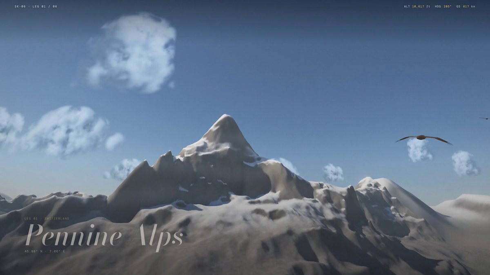</a> <a href="https://video.twimg.com/amplify_video/2102518351289622528/vid/avc1/1920x1080/P8S3nlCVnsFVI0vs.mp4?tag=16">Lire la vidéo source 1</a></td>
</tr>
</table>

Type: Demo | Date: 2026-09-22

---

### Cas 79: [Une animation de Claude en voxels](https://x.com/blueemi99/status/2102511304456212763) (par [@blueemi99](https://x.com/blueemi99))

**Prenez cette démonstration de personnage en voxels comme référence pour animer une figure stylisée de Claude.**

L’auteur présente un personnage Claude de style voxel et son animation.

<table>
<tr>
<td><a href="https://video.twimg.com/amplify_video/2102511211120050176/vid/avc1/1920x1080/UUUe7w_J2OYfiPoO.mp4?tag=29">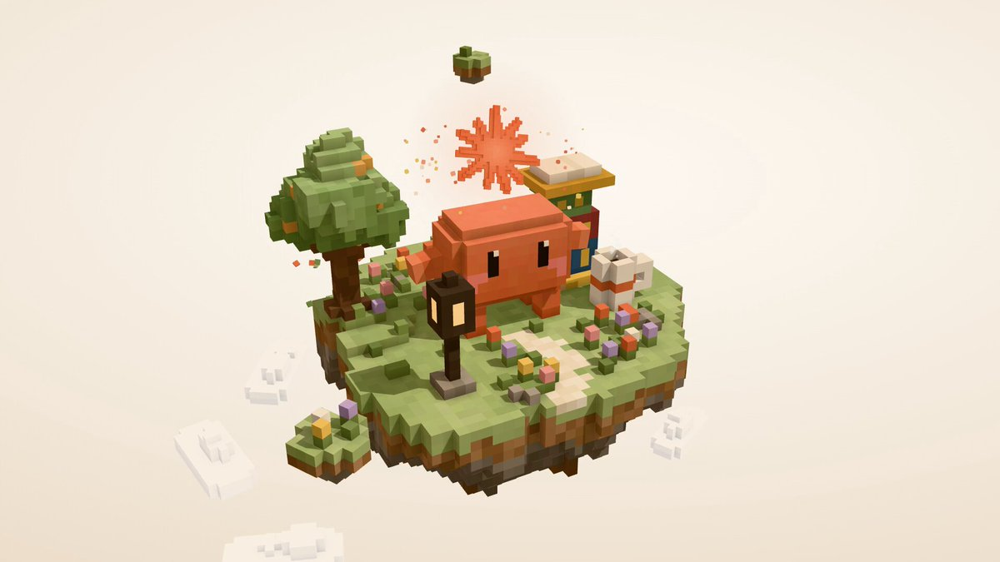</a> <a href="https://video.twimg.com/amplify_video/2102511211120050176/vid/avc1/1920x1080/UUUe7w_J2OYfiPoO.mp4?tag=29">Lire la vidéo source 1</a></td>
</tr>
</table>

Type: Demo | Date: 2026-09-22

---

### Cas 80: [Un pélican en voxels comparé à Fable et Astra](https://x.com/filicroval/status/2102453689252184365) (par [@filicroval](https://x.com/filicroval))

**Comparez les pélicans en voxels en limitant l’affirmation de consommation réduite de jetons à cette tentative.**

L’auteur compare une scène de pélican cycliste en voxels à Fable et Astra et annonce une consommation de jetons plus faible pour cette tentative. La publication citée précise que la version de Fable est 5.2.

<table>
<tr>
<td><a href="https://video.twimg.com/amplify_video/2102453086815977473/vid/avc1/1920x1080/wupTL8Gxhx3utDGe.mp4?tag=29">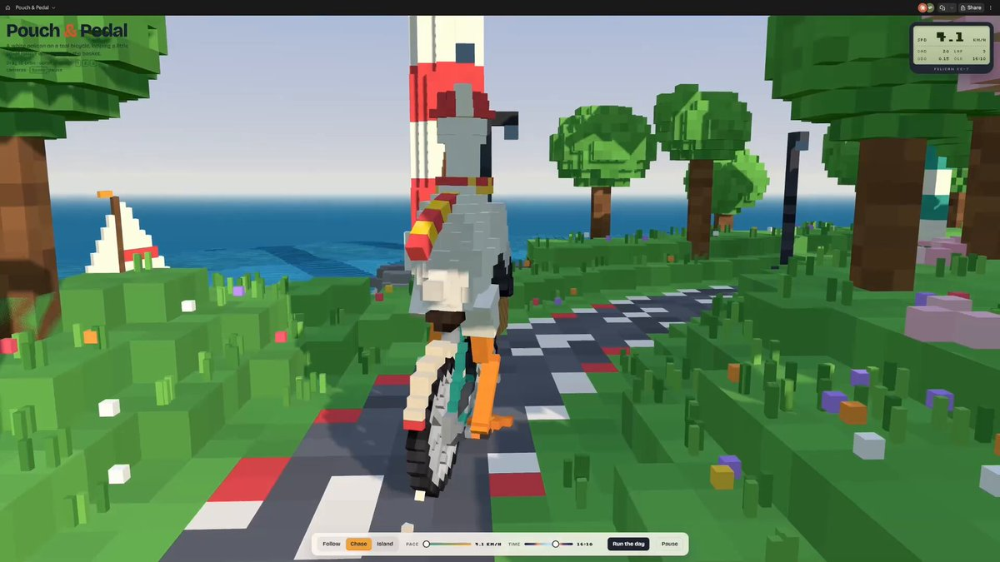</a> <a href="https://video.twimg.com/amplify_video/2102453086815977473/vid/avc1/1920x1080/wupTL8Gxhx3utDGe.mp4?tag=29">Lire la vidéo source 1</a></td>
</tr>
</table>

Type: Evaluation | Date: 2026-09-22

---

### Cas 81: [Une voiture de course comparée à GPT-6 Sol](https://x.com/AI_Screening/status/2102478485646373033) (par [@AI_Screening](https://x.com/AI_Screening))

**Examinez côte à côte les modèles de voitures de course sans déduire des performances au-delà des résultats montrés.**

L’aperçu multimédia montre un modèle de voiture de course à côté du résultat de GPT-6 Sol pour la même tâche.

<table>
<tr>
<td><a href="https://video.twimg.com/amplify_video/2102478330444537856/vid/avc1/1080x1124/eWLVlkoMKO-TcX0A.mp4?tag=29">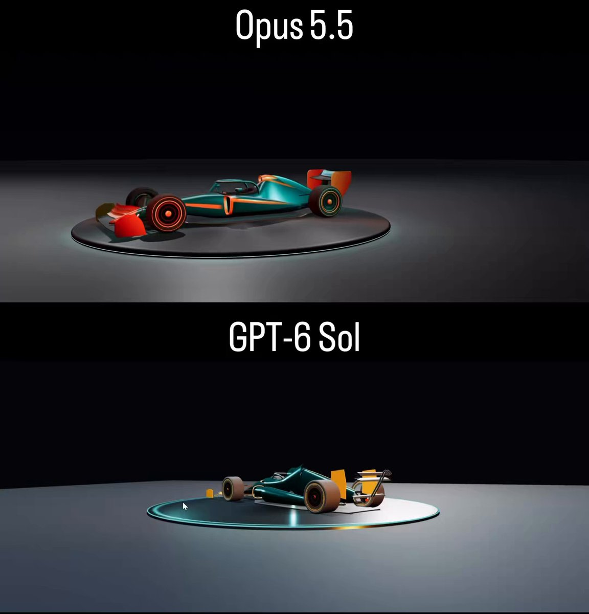</a> <a href="https://video.twimg.com/amplify_video/2102478330444537856/vid/avc1/1080x1124/eWLVlkoMKO-TcX0A.mp4?tag=29">Lire la vidéo source 1</a></td>
</tr>
</table>

Type: Evaluation | Date: 2026-09-22

---

### Cas 82: [Simulation de fourrure de chat accélérée par GPU](https://x.com/scottstts/status/2102498299190079933) (par [@scottstts](https://x.com/scottstts))

**Prenez la démonstration de fourrure de chat comme référence de simulation Three.js accélérée par GPU.**

L’auteur présente une simulation de fourrure de chat en Three.js réalisée en une passe avec accélération GPU.

<table>
<tr>
<td><a href="https://video.twimg.com/amplify_video/2102497141625077760/vid/avc1/1720x1080/rlUQfawdxn-0LaNB.mp4?tag=29">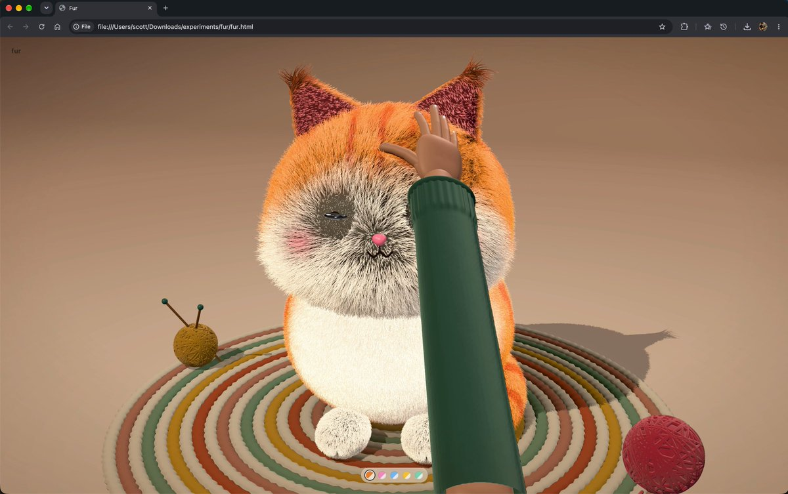</a> <a href="https://video.twimg.com/amplify_video/2102497141625077760/vid/avc1/1720x1080/rlUQfawdxn-0LaNB.mp4?tag=29">Lire la vidéo source 1</a></td>
</tr>
</table>

Type: Demo | Date: 2026-09-22

---

### Cas 83: [Comparaison de constructions Minecraft en voxels](https://x.com/Angaisb_/status/2102493141668643084) (par [@Angaisb_](https://x.com/Angaisb_))

**Distinguez la préférence de l’auteur sur Minecraft du test formel VoxelBench qui reste prévu.**

L’auteur donne une comparaison subjective d’Opus 5.5 et GPT-6 Astra pour la construction Minecraft en voxels. Un test formel VoxelBench n’est encore qu’un projet.

<table>
<tr>
<td><a href="https://x.com/Angaisb_/status/2102493141668643084">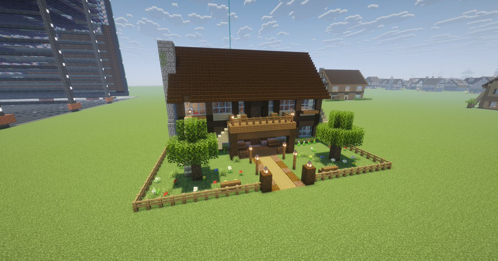</a> <a href="https://x.com/Angaisb_/status/2102493141668643084">Pièce jointe de la source 1</a></td>
</tr>
</table>

Type: Evaluation | Date: 2026-09-22

---

### Cas 84: [Trois modèles testés sur une fusée](https://x.com/RealFedeURU/status/2102450336472387899) (par [@RealFedeURU](https://x.com/RealFedeURU))

**Tenez compte des différents réglages de raisonnement pour comparer les trois fusées.**

L’auteur compare une tâche de fusée entre Opus 5.5 Medium, Grok 4.7 xhigh et Astra Medium ; les réglages de raisonnement diffèrent.

<table>
<tr>
<td><a href="https://video.twimg.com/amplify_video/2102449320985563136/vid/avc1/1920x1080/ZZO0I4KgdOZWir2-.mp4?tag=29">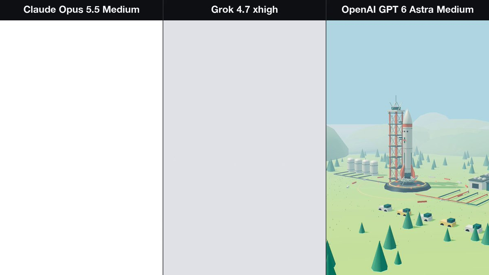</a> <a href="https://video.twimg.com/amplify_video/2102449320985563136/vid/avc1/1920x1080/ZZO0I4KgdOZWir2-.mp4?tag=29">Lire la vidéo source 1</a></td>
</tr>
</table>

Type: Evaluation | Date: 2026-09-22

---

### Cas 85: [Three.js comparé à Opus 5](https://x.com/NicolaManzini/status/2102472481151816101) (par [@NicolaManzini](https://x.com/NicolaManzini))

**Consultez la plateforme d’évaluation liée pour examiner la comparaison des versions d’Opus sur les tâches Three.js.**

L’auteur compare des résultats de programmation Three.js d’Opus 5.5 et d’Opus 5 et fournit un lien vers une plateforme d’évaluation.

<table>
<tr>
<td><a href="https://video.twimg.com/amplify_video/2102471601002315776/vid/avc1/1972x1080/8OCjJwPyEIRAOUcj.mp4?tag=29">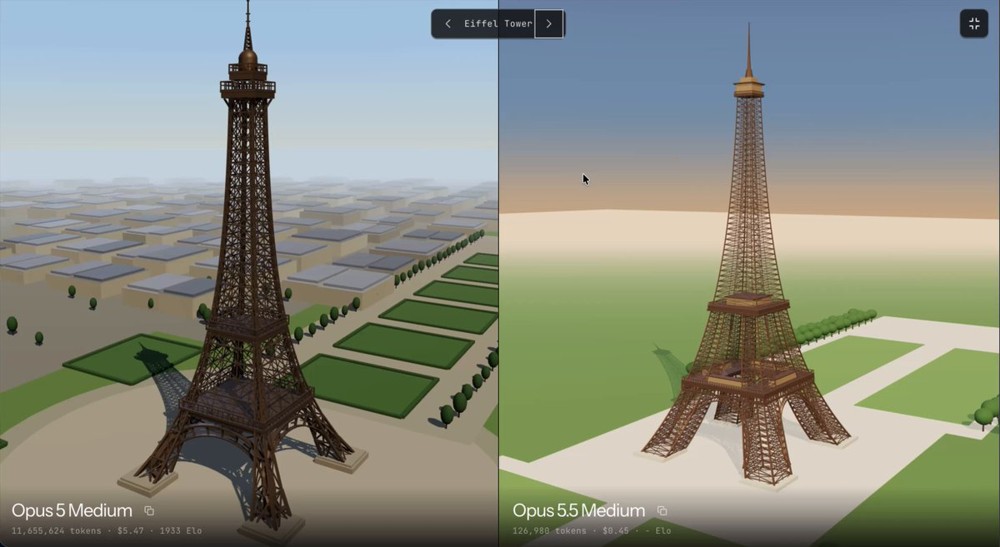</a> <a href="https://video.twimg.com/amplify_video/2102471601002315776/vid/avc1/1972x1080/8OCjJwPyEIRAOUcj.mp4?tag=29">Lire la vidéo source 1</a></td>
</tr>
</table>

Type: Evaluation | Date: 2026-09-22

---

### Cas 86: [Des courts métrages apocalyptiques en Three.js](https://x.com/thehypedotnews/status/2102527541051633903) (par [@thehypedotnews](https://x.com/thehypedotnews))

**Tenez compte des environnements, possibilités de correction et coûts estimés inégaux avant de comparer les courts métrages rendus.**

L’auteur compare Opus 5.5, Fable 5.1 et GPT-6 Astra sur des courts métrages Three.js en un seul fichier, consacrés à un parc d’attractions, une ville fantôme et une centrale nucléaire : les 36 plans auraient tous été rendus, mais Astra omet le ciel étoilé demandé. Opus/Fable inspectent et corrigent les images dans Claude Code ; Astra reçoit une seule réponse OpenRouter. Les coûts et jetons de Fable sont estimés. Totaux annoncés : $19.38/~$9.20/$8.43 et ~69/40/27m ; ce n’est pas un classement équitable des modèles.

<table>
<tr>
<td><a href="https://video.twimg.com/amplify_video/2102527016691990528/vid/avc1/1920x1080/WeNBWMBq_Z_sV9vi.mp4?tag=29">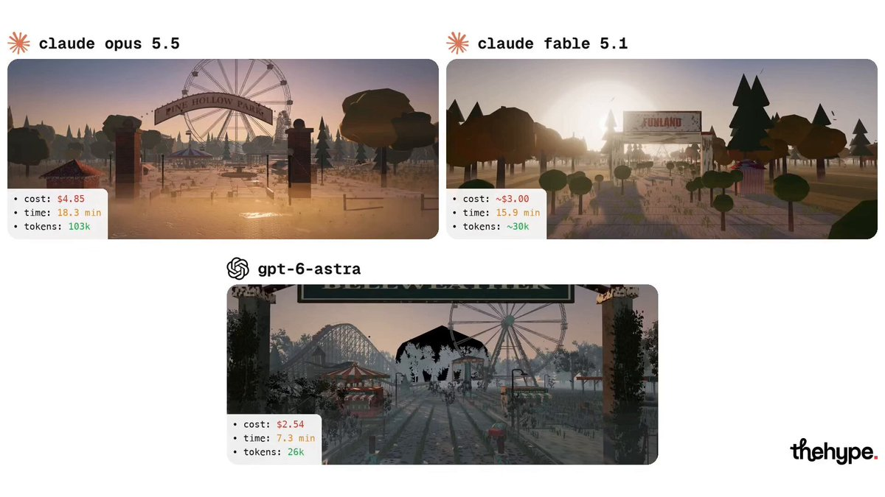</a> <a href="https://video.twimg.com/amplify_video/2102527016691990528/vid/avc1/1920x1080/WeNBWMBq_Z_sV9vi.mp4?tag=29">Lire la vidéo source 1</a></td>
</tr>
</table>

Type: Evaluation | Date: 2026-09-22

---

## 🧩 Musique et son

### Cas 87: [Musique de basse synthétisée en JavaScript](https://x.com/aj_dev_smith/status/2102504509637587339) (par [@aj_dev_smith](https://x.com/aj_dev_smith))

**Prenez cette démonstration de musique de basse comme référence pour synthétiser du son directement en JavaScript.**

L’auteur présente une musique de basse synthétisée en JavaScript à partir d’une seule consigne.

<table>
<tr>
<td><a href="https://video.twimg.com/amplify_video/2102504223527346176/vid/avc1/1426x1080/nuY1-hmqdxLHqig8.mp4?tag=29">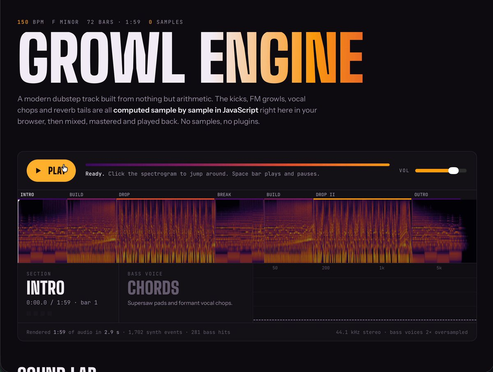</a> <a href="https://video.twimg.com/amplify_video/2102504223527346176/vid/avc1/1426x1080/nuY1-hmqdxLHqig8.mp4?tag=29">Lire la vidéo source 1</a></td>
</tr>
</table>

Type: Demo | Date: 2026-09-22

---

### Cas 88: [Un score parfait annoncé en détection d’erreurs musicales](https://x.com/aug5thmusic/status/2102451262260412453) (par [@aug5thmusic](https://x.com/aug5thmusic))

**Traitez le score parfait sur les erreurs de chorals comme un résultat rapporté sur dix extraits, en attente de validation plus large.**

L’auteur teste la détection d’erreurs de conduite des voix sur dix extraits de chorals à quatre voix et annonce un score parfait pour Opus 5.5, identique aux résultats antérieurs de GPT-6 Astra et Grok 4.7. Le jeu de test et la généralisation n’ont pas été validés indépendamment.

<table>
<tr>
<td><a href="https://x.com/aug5thmusic/status/2102451262260412453">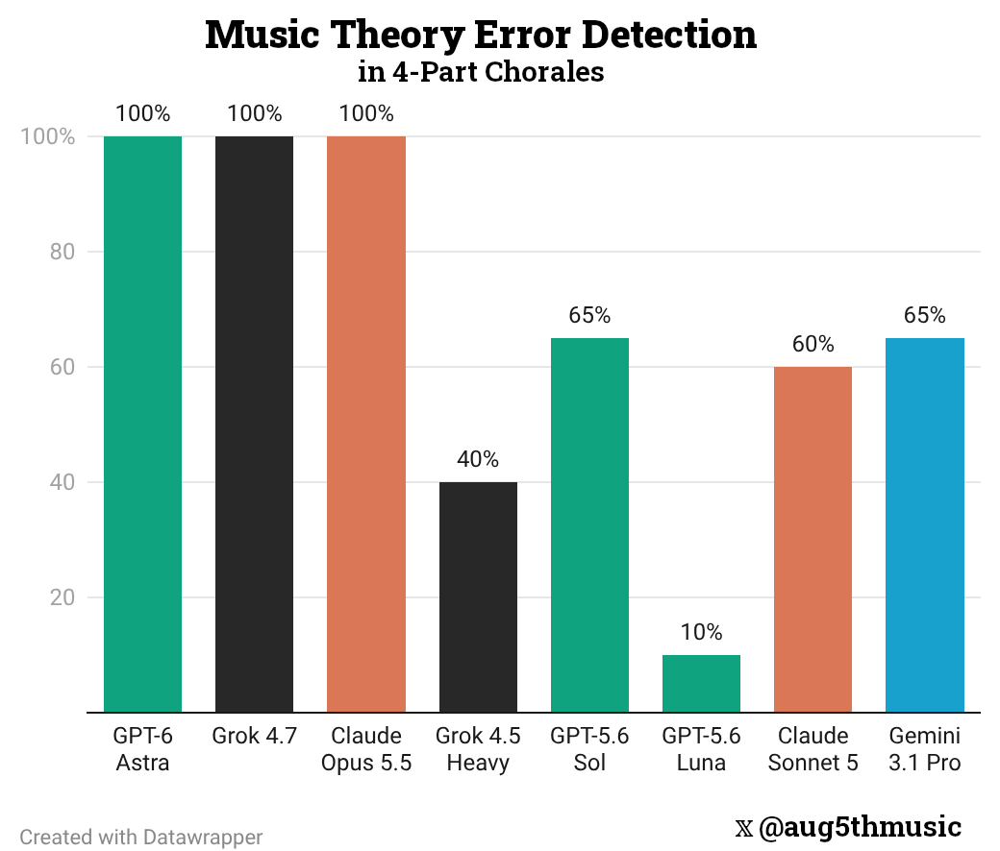</a> <a href="https://x.com/aug5thmusic/status/2102451262260412453">Pièce jointe de la source 1</a></td>
</tr>
</table>

Type: Evaluation | Date: 2026-09-22

---

### Cas 89: [Une méthode de génération d’effets sonores](https://x.com/yugen_matuni/status/2102529143128916052) (par [@yugen_matuni](https://x.com/yugen_matuni))

**Examinez directement la méthode d’effets sonores, car la publication n’identifie pas les sons obtenus.**

L’auteur présente une méthode de génération d’effets sonores sans préciser les sons obtenus dans le texte de la publication.

<table>
<tr>
<td><a href="https://x.com/yugen_matuni/status/2102529143128916052">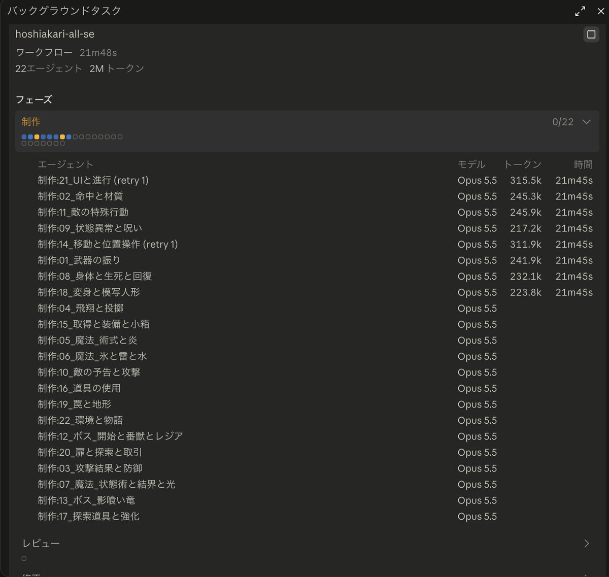</a> <a href="https://x.com/yugen_matuni/status/2102529143128916052">Pièce jointe de la source 1</a></td>
</tr>
</table>

Type: Demo | Date: 2026-09-22

---

## 🧩 Graphisme créatif et animation

### Cas 90: [Comparaison de graphismes de console Pocket Color](https://x.com/Angaisb_/status/2102476249671082365) (par [@Angaisb_](https://x.com/Angaisb_))

**Comparez les détails extérieurs visibles des consoles sans en déduire le fonctionnement de l’appareil.**

L’auteur compare Opus 5.5 à GPT-6 Sol ; l’aperçu montre des graphismes générés représentant l’extérieur d’une console portable Pocket Color.

<table>
<tr>
<td><a href="https://x.com/Angaisb_/status/2102476249671082365">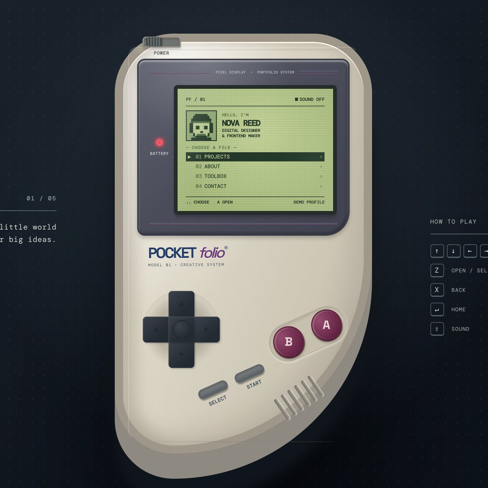</a> <a href="https://x.com/Angaisb_/status/2102476249671082365">Pièce jointe de la source 1</a></td>
<td><a href="https://x.com/Angaisb_/status/2102476249671082365">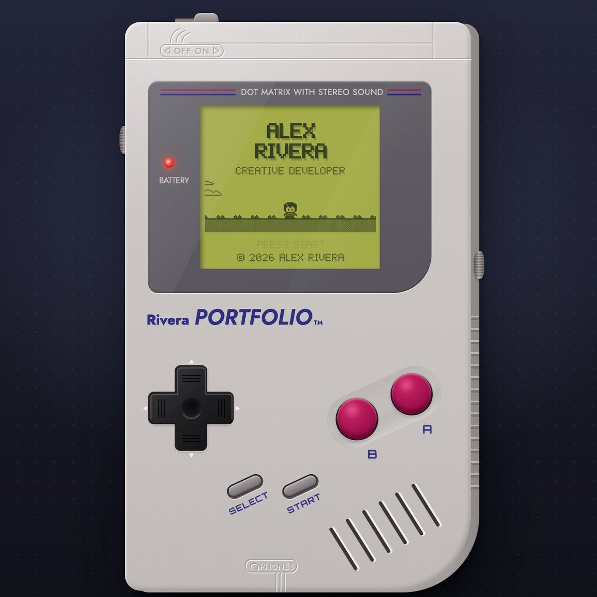</a> <a href="https://x.com/Angaisb_/status/2102476249671082365">Pièce jointe de la source 2</a></td>
</tr>
</table>

Type: Evaluation | Date: 2026-09-22

---

### Cas 91: [Une animation Sweet Tooth en 18m 31s](https://x.com/cherry_mx_reds/status/2102472218269900876) (par [@cherry_mx_reds](https://x.com/cherry_mx_reds))

**Examinez l’animation Sweet Tooth avant de généraliser sa durée de production annoncée en une passe.**

L’auteur présente une animation Sweet Tooth qui aurait été générée en une passe en 18 minutes et 31 secondes.

<table>
<tr>
<td><a href="https://video.twimg.com/amplify_video/2102471444336611328/vid/avc1/1080x1080/Gq062pYx-yV3Tde7.mp4?tag=29">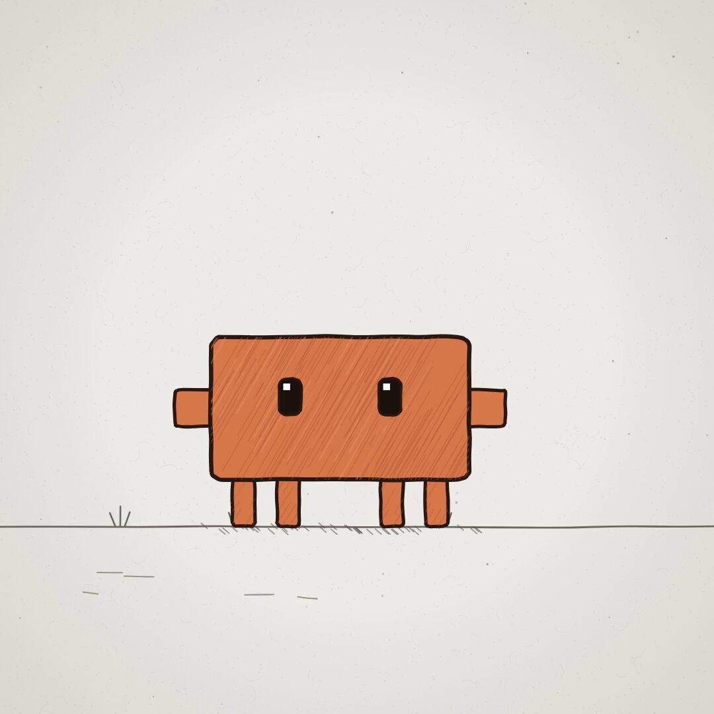</a> <a href="https://video.twimg.com/amplify_video/2102471444336611328/vid/avc1/1080x1080/Gq062pYx-yV3Tde7.mp4?tag=29">Lire la vidéo source 1</a></td>
</tr>
</table>

Type: Demo | Date: 2026-09-22

---

### Cas 92: [Un dessin animé sur Claude et l’AGI](https://x.com/other__reality/status/2102514581684052169) (par [@other__reality](https://x.com/other__reality))

**Prenez ce dessin animé comme référence visuelle en laissant sa méthode de génération non précisée.**

La vérification ponctuelle de la vidéo dans le compte rendu identifie un dessin animé mettant en scène Claude et le thème de l’AGI, mais la publication originale ne révèle pas la méthode de génération.

<table>
<tr>
<td> <a href="https://video.twimg.com/amplify_video/2102514085137154048/vid/avc1/1280x720/k7-vfCveNwGQnk1v.mp4?tag=14">Lire la vidéo source 1</a></td>
</tr>
</table>

Type: Demo | Date: 2026-09-22

---

### Cas 93: [Une animation de magicien pixelisée réalisée par le code](https://x.com/majidmanzarpour/status/2102476258948927543) (par [@majidmanzarpour](https://x.com/majidmanzarpour))

**Examinez l’animation pixelisée codée et consultez les réponses pour la consigne indiquée par l’auteur.**

L’auteur présente une animation de magicien pixelisée entièrement réalisée par le code et indique que la consigne est disponible dans les réponses.

<table>
<tr>
<td><a href="https://video.twimg.com/amplify_video/2102476231740399616/vid/avc1/1080x890/8wOPIn__IAkbl9ho.mp4?tag=29">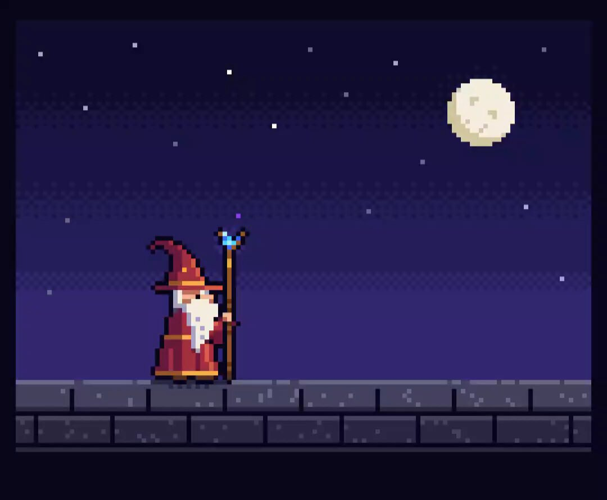</a> <a href="https://video.twimg.com/amplify_video/2102476231740399616/vid/avc1/1080x890/8wOPIn__IAkbl9ho.mp4?tag=29">Lire la vidéo source 1</a></td>
</tr>
</table>

Type: Demo | Date: 2026-09-22

---

### Cas 94: [Une animation JavaScript dessinée image par image](https://x.com/strawhatsu4/status/2102457111787745405) (par [@strawhatsu4](https://x.com/strawhatsu4))

**Prenez cette animation dessinée image par image comme référence pour créer du mouvement par le rendu JavaScript.**

L’auteur montre une animation dont les images ont été dessinées en JavaScript par Opus 5.5.

<table>
<tr>
<td> <a href="https://video.twimg.com/amplify_video/2102457077390299136/vid/avc1/1280x720/0GdMBFz95r0KPjMG.mp4?tag=14">Lire la vidéo source 1</a></td>
</tr>
</table>

Type: Demo | Date: 2026-09-22

---

### Cas 95: [Une animation SVG de Nintendo Switch](https://x.com/ishuagra02/status/2102451375724499350) (par [@ishuagra02](https://x.com/ishuagra02))

**Mettez les exigences d’animation SVG en balance avec la consommation de session annoncée au niveau Max.**

L’auteur utilise l’effort Max pour créer un SVG de Nintendo Switch et le comparer à Gemini 4 Pro ; la consigne citée comprend l’emboîtement des manettes et un logo de démarrage. L’exécution aurait consommé 27% du quota de session de l’abonnement à $20.

<table>
<tr>
<td> <a href="https://video.twimg.com/amplify_video/2102451356917276672/vid/avc1/1920x1080/opEdMmhd6w5w7QAk.mp4?tag=29">Lire la vidéo source 1</a></td>
</tr>
</table>

Type: Evaluation | Date: 2026-09-22

---

### Cas 96: [Une animation codée de la résolution de problèmes](https://x.com/chetaslua/status/2102478640428773861) (par [@chetaslua](https://x.com/chetaslua))

**Considérez cette animation entièrement codée comme une représentation créative de la résolution de problèmes, et non comme une explication du fonctionnement du modèle.**

L’auteur présente une animation entièrement codée imaginant l’aspect que pourrait avoir la résolution de problèmes difficiles par le modèle.

<table>
<tr>
<td><a href="https://video.twimg.com/amplify_video/2102478162211098624/vid/avc1/2560x1440/ULtHTYX5psqpaEXw.mp4?tag=29">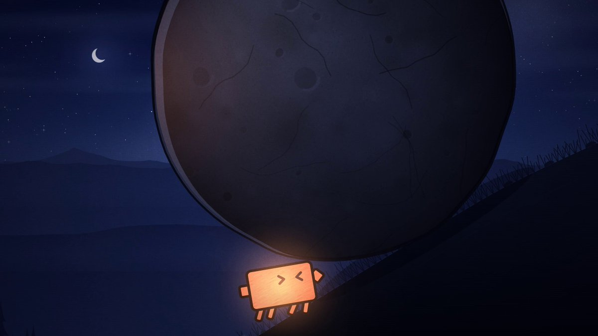</a> <a href="https://video.twimg.com/amplify_video/2102478162211098624/vid/avc1/2560x1440/ULtHTYX5psqpaEXw.mp4?tag=29">Lire la vidéo source 1</a></td>
</tr>
</table>

Type: Demo | Date: 2026-09-22

---

### Cas 97: [Une boucle de pélican cycliste relayée](https://x.com/NFT_Chen/status/2102449680793903561) (par [@NFT_Chen](https://x.com/NFT_Chen))

**Examinez les mouvements du cycliste en conservant l’attribution de seconde main de cette boucle partagée.**

La publication relaie une animation en boucle d’un pélican à vélo, en soulignant des mouvements comme le soulèvement de la roue avant. Il s’agit d’une présentation de seconde main, et non d’une reproduction indépendante de la méthode.

<table>
<tr>
<td><a href="https://video.twimg.com/amplify_video/2102447519674585088/vid/avc1/1280x720/a443IPw1hdNfSqS6.mp4?tag=29">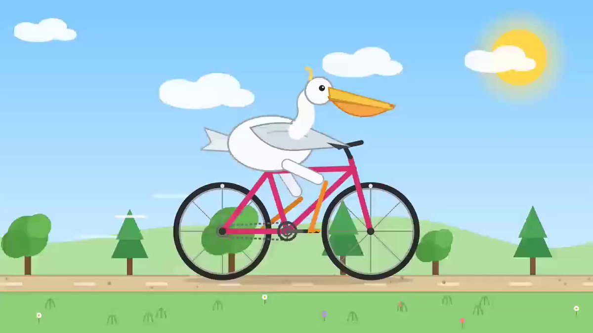</a> <a href="https://video.twimg.com/amplify_video/2102447519674585088/vid/avc1/1280x720/a443IPw1hdNfSqS6.mp4?tag=29">Lire la vidéo source 1</a></td>
</tr>
</table>

Type: Demo | Date: 2026-09-22

---

### Cas 98: [Comparaison de SVG de manette PS5](https://x.com/bridgemindai/status/2102484711389966509) (par [@bridgemindai](https://x.com/bridgemindai))

**Comparez les détails et les ombres des manettes séparément du jugement promotionnel de BridgeMind.**

BridgeMind compare Opus 5.5 et GPT-6 Sol avec la même consigne de SVG de manette PS5, en se concentrant sur les détails et les ombres. Il s’agit d’une présentation de plateforme dont les jugements qualitatifs viennent de l’éditeur.

<table>
<tr>
<td><a href="https://x.com/bridgemindai/status/2102484711389966509">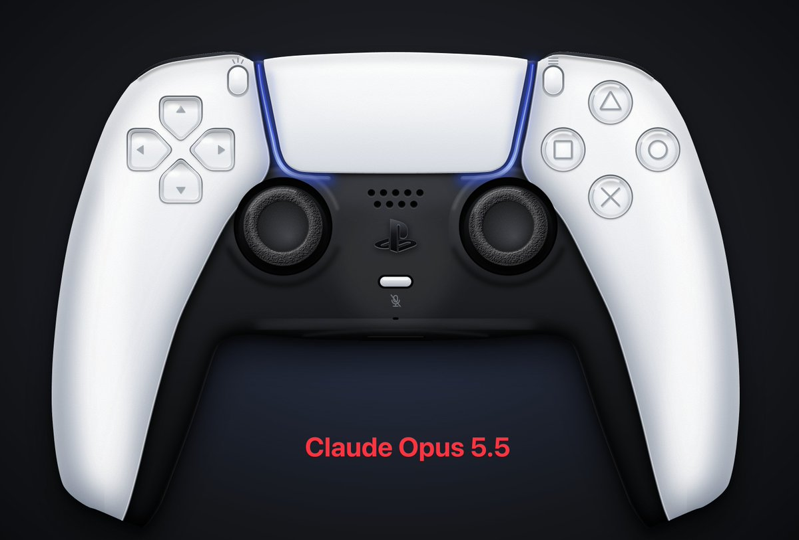</a> <a href="https://x.com/bridgemindai/status/2102484711389966509">Pièce jointe de la source 1</a></td>
<td><a href="https://x.com/bridgemindai/status/2102484711389966509">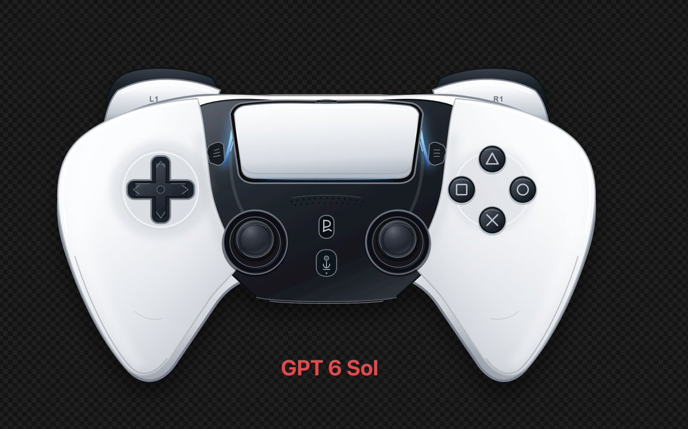</a> <a href="https://x.com/bridgemindai/status/2102484711389966509">Pièce jointe de la source 2</a></td>
</tr>
</table>

Type: Evaluation | Date: 2026-09-22

---

### Cas 99: [Visuels d’eau et de particules dans Devin](https://x.com/notjazii/status/2102488657194254806) (par [@notjazii](https://x.com/notjazii))

**Comparez les visuels Devin en conservant les informations de l’auteur sur son affiliation, les durées et les coûts.**

Avec le même environnement Devin, la même consigne et les réglages de raisonnement les plus élevés, l’auteur compare des visuels d’eau et de particules : Opus a pris 2h 10m et $75, contre 1h 25m et $61 pour Astra. L’auteur déclare une affiliation d’ambassadeur Cognition ; la rémunération de cette publication n’est pas confirmée, et les durées et coûts sont autodéclarés.

<table>
<tr>
<td><a href="https://video.twimg.com/amplify_video/2102488109971808257/vid/avc1/2520x1080/l6D9gSC-gLs1C6nD.mp4?tag=29">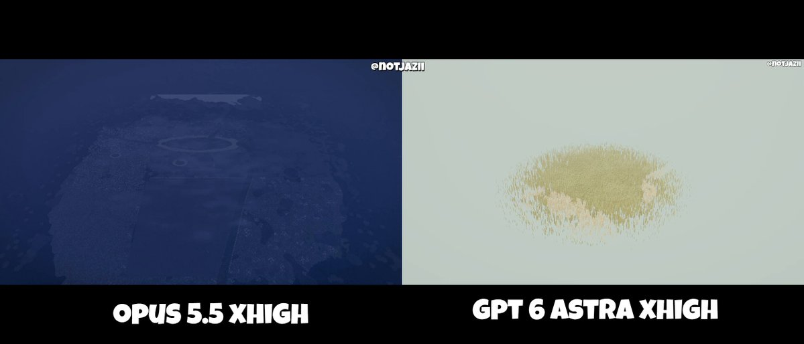</a> <a href="https://video.twimg.com/amplify_video/2102488109971808257/vid/avc1/2520x1080/l6D9gSC-gLs1C6nD.mp4?tag=29">Lire la vidéo source 1</a></td>
</tr>
</table>

Type: Evaluation | Date: 2026-09-22

---

### Cas 100: [Une animation sur l’Oktoberfest](https://x.com/cherry_mx_reds/status/2102493303388475855) (par [@cherry_mx_reds](https://x.com/cherry_mx_reds))

**Examinez l’animation Oktoberfest et les instructions liées avant de vous fier à sa durée annoncée en une seule passe.**

L’auteur montre une animation sur le thème de l’Oktoberfest qui aurait été créée en une passe en 14 minutes 48 secondes. La publication indique que les instructions figurent en dessous.

<table>
<tr>
<td><a href="https://video.twimg.com/amplify_video/2102493087381487616/vid/avc1/1920x1080/dMwClUvawHddh2E2.mp4?tag=29">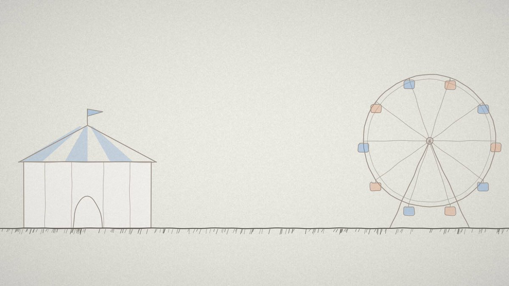</a> <a href="https://video.twimg.com/amplify_video/2102493087381487616/vid/avc1/1920x1080/dMwClUvawHddh2E2.mp4?tag=29">Lire la vidéo source 1</a></td>
</tr>
</table>

Type: Demo | Date: 2026-09-22

---

### Cas 101: [Musique et visuels écrits en JavaScript](https://x.com/chetaslua/status/2102482039522107417) (par [@chetaslua](https://x.com/chetaslua))

**Utilisez cette démonstration musicale et visuelle comme exemple JavaScript dont les preuves ne suffisent pas à établir des substitutions plus générales.**

L’auteur présente de la musique et des visuels animés qui auraient été entièrement créés en JavaScript. Cette présentation n’établit pas un remplacement des méthodes générales de génération musicale ou vidéo.

<table>
<tr>
<td><a href="https://video.twimg.com/amplify_video/2102480439512539136/vid/avc1/1978x1080/ZRgMTxPF2khbJMCd.mp4?tag=29">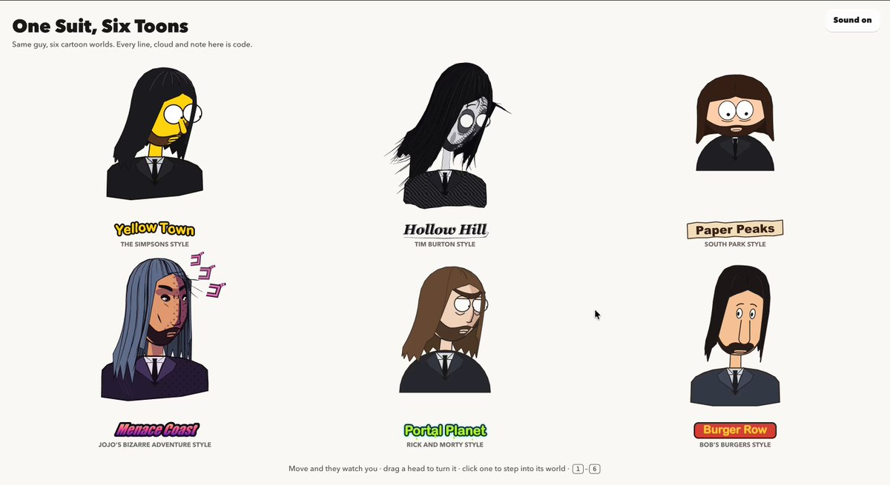</a> <a href="https://video.twimg.com/amplify_video/2102480439512539136/vid/avc1/1978x1080/ZRgMTxPF2khbJMCd.mp4?tag=29">Lire la vidéo source 1</a></td>
</tr>
</table>

Type: Demo | Date: 2026-09-22

---

### Cas 102: [Une animation interactive uniquement en JavaScript](https://x.com/chetaslua/status/2102501773705670994) (par [@chetaslua](https://x.com/chetaslua))

**Examinez comment l’animation interactive utilise JavaScript sans ressources externes ni extensions déclarées.**

L’auteur montre une animation interactive stylisée et indique n’avoir utilisé que JavaScript, sans ressources externes, MCP ni skills.

<table>
<tr>
<td> <a href="https://video.twimg.com/amplify_video/2102501285840986112/vid/avc1/2560x1440/KNGdkncQUsYij81R.mp4?tag=29">Lire la vidéo source 1</a></td>
</tr>
</table>

Type: Demo | Date: 2026-09-22

---

### Cas 103: [Comparaison d’animations entre trois modèles](https://x.com/noclipepe/status/2102464238493012270) (par [@noclipepe](https://x.com/noclipepe))

**Comparez les trois animations en tenant compte des entrées communes et des durées annoncées par l’auteur.**

Avec AIML API, l’auteur compare des animations en une passe obtenues avec la même consigne, la même référence et le réglage XHigh sur Opus 5.5, GPT-6 Astra et Opus 5. Les durées annoncées sont respectivement 36:46, 32:12 et 14:56 ; les jugements de qualité visuelle sont ceux de l’auteur.

<table>
<tr>
<td><a href="https://video.twimg.com/amplify_video/2102464017474420737/vid/avc1/1080x1920/qRNa8HcyewqSs2zH.mp4?tag=29">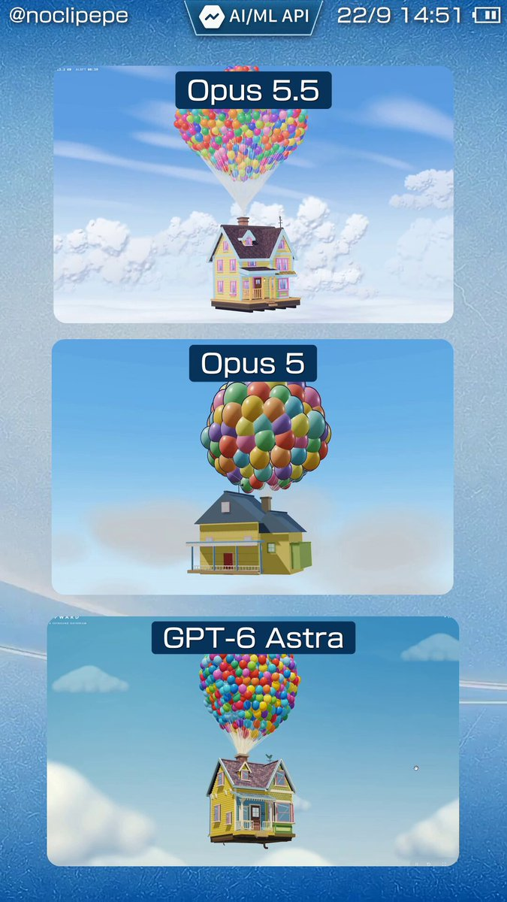</a> <a href="https://video.twimg.com/amplify_video/2102464017474420737/vid/avc1/1080x1920/qRNa8HcyewqSs2zH.mp4?tag=29">Lire la vidéo source 1</a></td>
</tr>
</table>

Type: Evaluation | Date: 2026-09-22

---

### Cas 104: [Une manette Xbox en 334 lignes SVG](https://x.com/marmaduke091/status/2102453079836622940) (par [@marmaduke091](https://x.com/marmaduke091))

**Examinez le SVG compact de la manette en tenant compte de la forte consommation de jetons annoncée au niveau Max.**

L’auteur rapporte avoir généré une manette Xbox dans Claude Code en une passe, avec 334 lignes de SVG incluant le logo Xbox. Il signale aussi une forte consommation de jetons avec l’effort Max.

<table>
<tr>
<td> <a href="https://x.com/marmaduke091/status/2102453079836622940">Pièce jointe de la source 1</a></td>
</tr>
</table>

Type: Demo | Date: 2026-09-22

---

### Cas 105: [Recréer des effets de référence dans TouchDesigner](https://x.com/higgsfield_ai/status/2102454774289539499) (par [@higgsfield_ai](https://x.com/higgsfield_ai))

**Tenez compte de TouchDesigner pour évaluer cette recréation d’effets à partir de références.**

Higgsfield présente Opus 5.5 recréant ses effets à partir de références dans TouchDesigner, en 15 minutes selon la publication. Le résultat repose sur une production dans TouchDesigner.

<table>
<tr>
<td><a href="https://video.twimg.com/amplify_video/2102454552201252864/vid/avc1/1440x1080/Oq9kWrdMjMJzv9ZV.mp4?tag=29">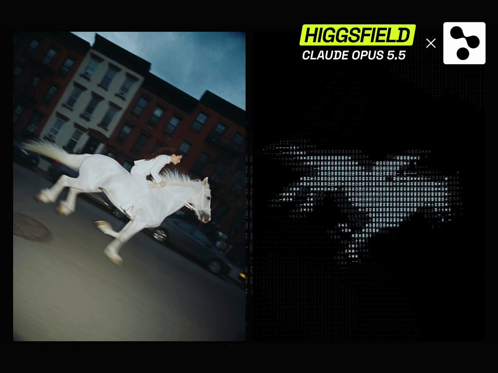</a> <a href="https://video.twimg.com/amplify_video/2102454552201252864/vid/avc1/1440x1080/Oq9kWrdMjMJzv9ZV.mp4?tag=29">Lire la vidéo source 1</a></td>
</tr>
</table>

Type: Integration | Date: 2026-09-22

---

### Cas 106: [Un test visuel de Game Boy](https://x.com/Angaisb_/status/2102453013776363887) (par [@Angaisb_](https://x.com/Angaisb_))

**Comparez vous-même les Game Boy avant d’adopter la préférence visuelle de l’auteur.**

L’auteur montre le résultat d’Opus 5.5 pour une tâche visuelle de Game Boy et indique le préférer à la version d’Astra. Il s’agit d’un test visuel individuel et d’une appréciation subjective.

<table>
<tr>
<td><a href="https://video.twimg.com/amplify_video/2102452953382526976/vid/avc1/2560x1440/oie__f-0w5_JJKX6.mp4?tag=29">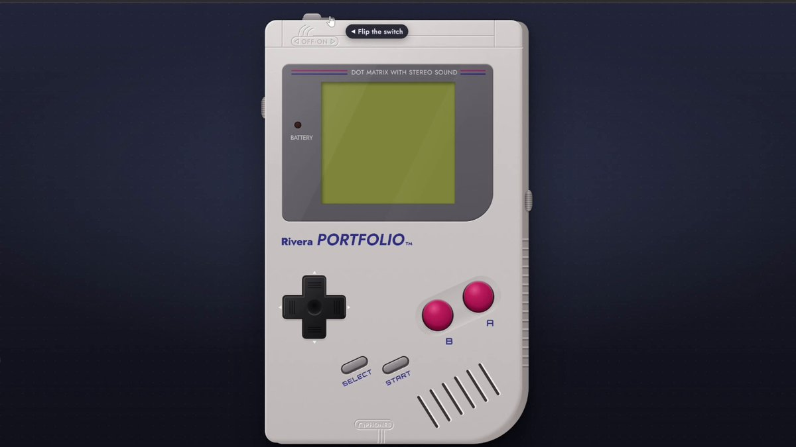</a> <a href="https://video.twimg.com/amplify_video/2102452953382526976/vid/avc1/2560x1440/oie__f-0w5_JJKX6.mp4?tag=29">Lire la vidéo source 1</a></td>
</tr>
</table>

Type: Evaluation | Date: 2026-09-22

---

### Cas 107: [Présentation d’une animation JavaScript](https://x.com/Hesamation/status/2102472597170528449) (par [@Hesamation](https://x.com/Hesamation))

**Utilisez l’animation JavaScript comme référence de résultat, faute d’explication complète de sa réalisation.**

L’auteur partage une animation réalisée avec Opus 5.5 et JavaScript. La publication se concentre sur le résultat sans décrire intégralement sa réalisation.

<table>
<tr>
<td> <a href="https://video.twimg.com/amplify_video/2102437792425070592/vid/avc1/1080x1080/nwtcZBGstdeV9nO_.mp4?tag=29">Lire la vidéo source 1</a></td>
</tr>
</table>

Sources complémentaires / comptes rendus regroupés: [@satori_sz9](https://x.com/satori_sz9/status/2102467374138212826)

Type: Demo | Date: 2026-09-22

---

### Cas 108: [Animation et son dans CoAnimator](https://x.com/rege_dev/status/2102498682931441977) (par [@rege_dev](https://x.com/rege_dev))

**Examinez comment CoAnimator combine animation, pistes temporelles et son dans l’application de son propre développeur.**

Le développeur de CoAnimator présente des animations, pistes temporelles, effets sonores et ambiances créés avec Opus 5.5 en quelques consignes. C’est une démonstration de sa propre application, avec des affirmations qualitatives émises par l’auteur.

<table>
<tr>
<td> <a href="https://video.twimg.com/amplify_video/2102496943482286080/vid/avc1/1920x1080/gcnHTMNfXRqMH5wy.mp4?tag=29">Lire la vidéo source 1</a></td>
</tr>
</table>

Type: Integration | Date: 2026-09-22

---

### Cas 109: [Caméra 3D et effets de texte dans HyperFrames](https://x.com/jake11moran/status/2102493361743839432) (par [@jake11moran](https://x.com/jake11moran))

**Tenez compte d’HyperFrames pour évaluer les effets de caméra 3D et de texte présentés.**

Un membre de l’équipe HyperFrames/HeyGen présente des effets de caméra 3D et de texte réalisés avec Opus 5.5 et HyperFrames. Il s’agit d’une démonstration de la combinaison d’outils de cette équipe.

<table>
<tr>
<td> <a href="https://video.twimg.com/amplify_video/2102493076757581824/vid/avc1/1440x1080/UkSCNUOeVyj1wQtD.mp4?tag=29">Lire la vidéo source 1</a></td>
</tr>
</table>

Type: Integration | Date: 2026-09-22

---

### Cas 110: [Une animation pixelisée en moins de cinq minutes](https://x.com/riku720720/status/2102515055116063144) (par [@riku720720](https://x.com/riku720720))

**Examinez l’animation pixelisée et consultez les réponses pour trouver la consigne promise.**

L’auteur partage une animation pixelisée qui aurait été générée en moins de cinq minutes et annonce qu’il placera la consigne dans les réponses.

<table>
<tr>
<td><a href="https://video.twimg.com/amplify_video/2102513096682336256/vid/avc1/1920x1080/mxQynDez08ynbTQy.mp4?tag=29">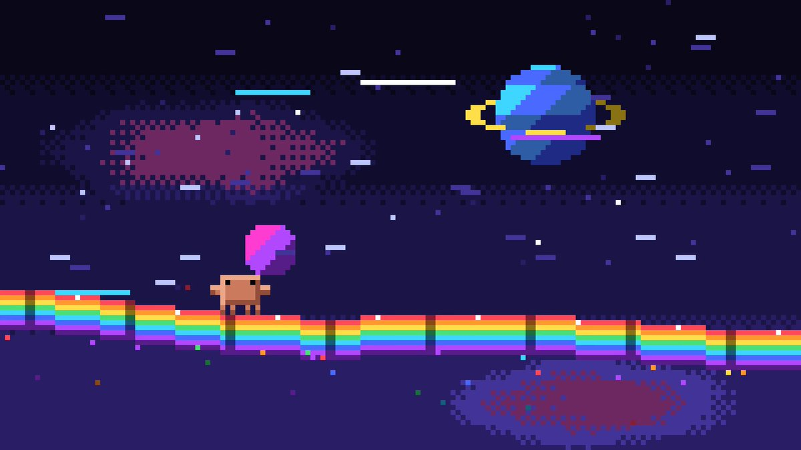</a> <a href="https://video.twimg.com/amplify_video/2102513096682336256/vid/avc1/1920x1080/mxQynDez08ynbTQy.mp4?tag=29">Lire la vidéo source 1</a></td>
</tr>
</table>

Type: Demo | Date: 2026-09-22

---

### Cas 111: [Un SVG de manette utilisant une image PNG](https://x.com/hysteresis_x/status/2102474525262643208) (par [@hysteresis_x](https://x.com/hysteresis_x))

**Vérifiez les images intégrées avant de décrire un SVG comme entièrement dessiné en vecteurs.**

L’auteur montre un SVG de manette mais précise que le modèle a récupéré un PNG DualShock. Une image existante a donc été utilisée ; le résultat ne prouve pas que chaque détail a été dessiné de zéro avec des tracés vectoriels.

<table>
<tr>
<td><a href="https://x.com/hysteresis_x/status/2102474525262643208">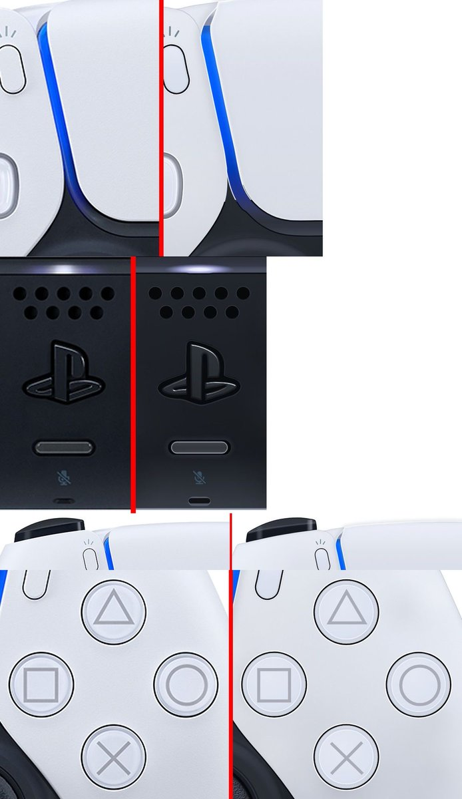</a> <a href="https://x.com/hysteresis_x/status/2102474525262643208">Pièce jointe de la source 1</a></td>
<td><a href="https://x.com/hysteresis_x/status/2102474525262643208">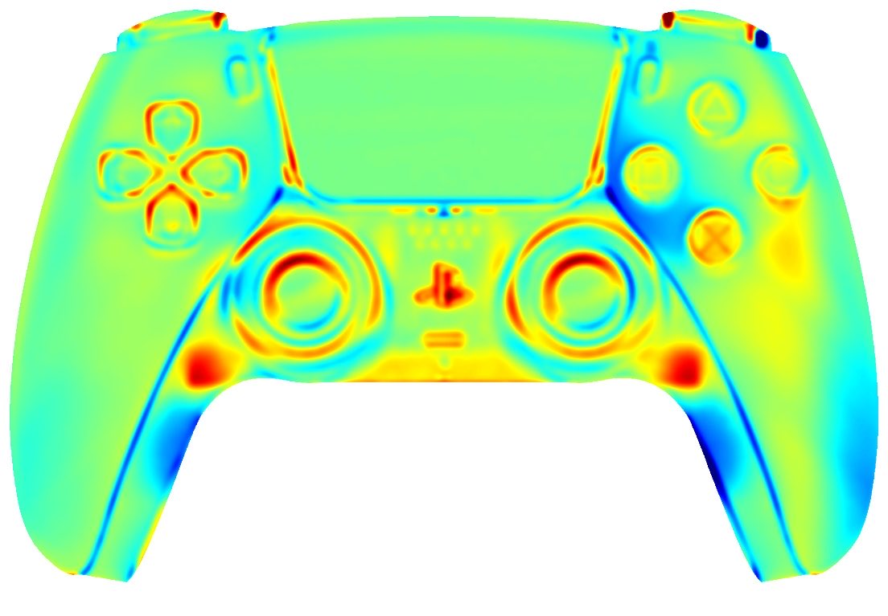</a> <a href="https://x.com/hysteresis_x/status/2102474525262643208">Pièce jointe de la source 2</a></td>
</tr>
<tr>
<td><a href="https://x.com/hysteresis_x/status/2102474525262643208">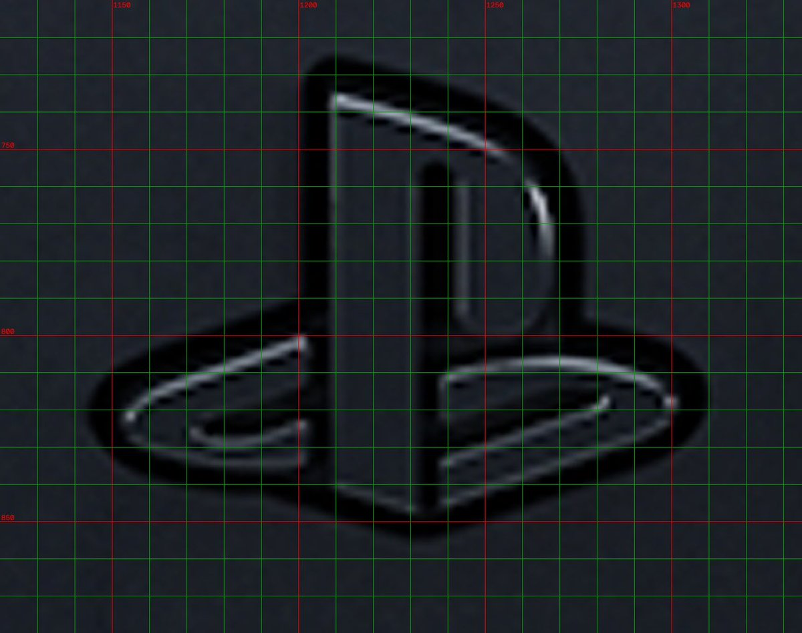</a> <a href="https://x.com/hysteresis_x/status/2102474525262643208">Pièce jointe de la source 3</a></td>
<td> <a href="https://x.com/hysteresis_x/status/2102474525262643208">Pièce jointe de la source 4</a></td>
</tr>
</table>

Type: Demo | Date: 2026-09-22

---

### Cas 112: [Recréer un effet ChronoVolume](https://x.com/higgsfield_ai/status/2102508394976530445) (par [@higgsfield_ai](https://x.com/higgsfield_ai))

**Comparez l’effet ChronoVolume recréé à sa référence en tenant compte du coût et de la durée déclarés par la plateforme.**

Higgsfield présente un effet ChronoVolume recréé à partir d’une référence, avec une durée annoncée de 26 minutes et un coût de jetons inférieur à $5.

<table>
<tr>
<td><a href="https://video.twimg.com/amplify_video/2102508274126077952/vid/avc1/1440x1080/WjLhj_tjguPEOgdc.mp4?tag=29">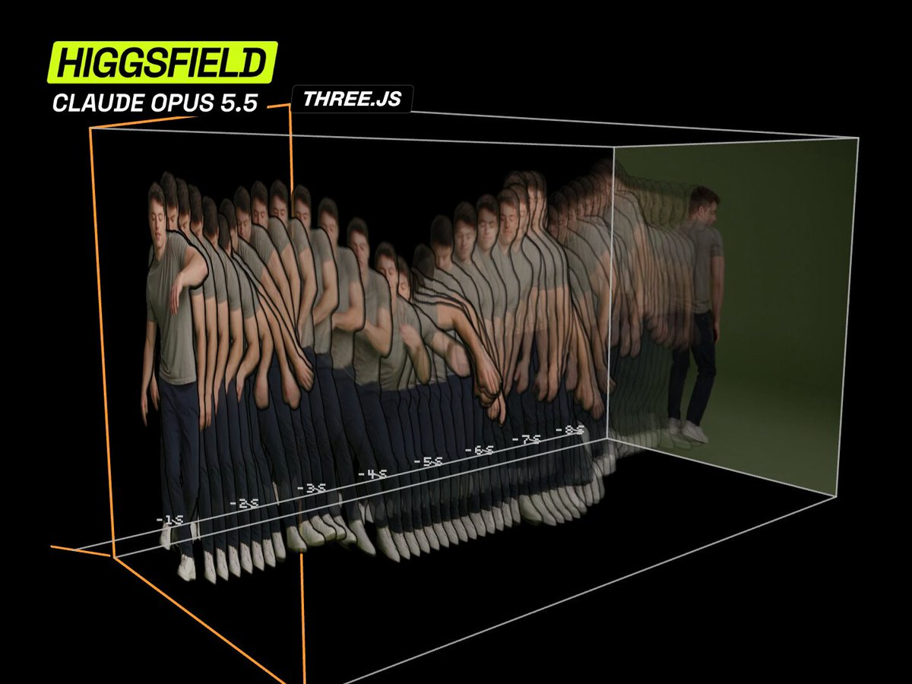</a> <a href="https://video.twimg.com/amplify_video/2102508274126077952/vid/avc1/1440x1080/WjLhj_tjguPEOgdc.mp4?tag=29">Lire la vidéo source 1</a></td>
</tr>
</table>

Type: Demo | Date: 2026-09-22

---

### Cas 113: [Une fontaine avec la même consigne](https://x.com/Angaisb_/status/2102509807802716649) (par [@Angaisb_](https://x.com/Angaisb_))

**Comparez les fontaines obtenues avec la consigne commune et les réglages d’effort maximal.**

L’auteur compare les visuels de fontaine d’Opus 5.5 et de GPT-6 Astra avec la même consigne « A beautiful fountain » et l’effort de raisonnement maximal.

<table>
<tr>
<td><a href="https://x.com/Angaisb_/status/2102509807802716649">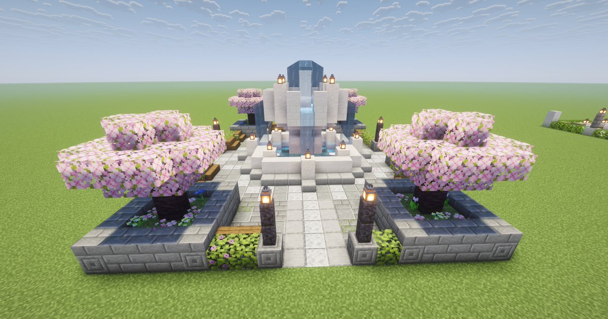</a> <a href="https://x.com/Angaisb_/status/2102509807802716649">Pièce jointe de la source 1</a></td>
<td><a href="https://x.com/Angaisb_/status/2102509807802716649">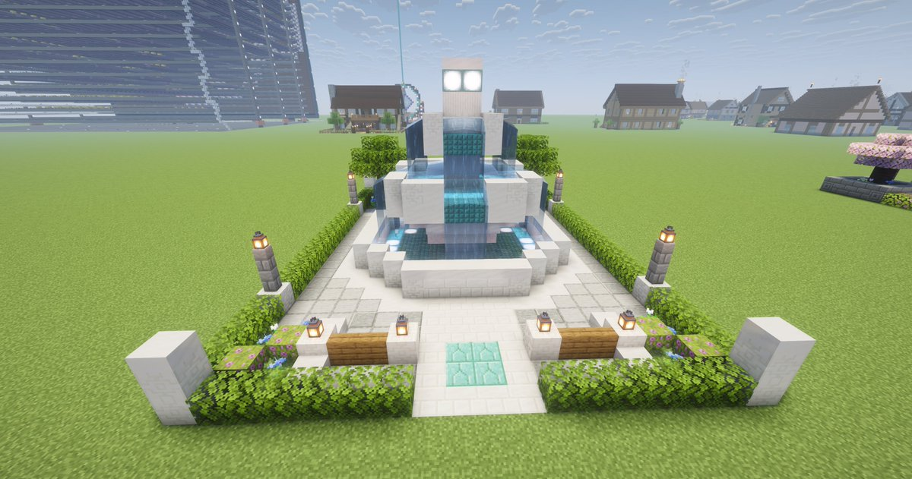</a> <a href="https://x.com/Angaisb_/status/2102509807802716649">Pièce jointe de la source 2</a></td>
</tr>
</table>

Type: Evaluation | Date: 2026-09-22

---

### Cas 114: [Dessiner la Joconde en SVG](https://x.com/diegocabezas01/status/2102463433731903630) (par [@diegocabezas01](https://x.com/diegocabezas01))

**Examinez les deux SVG de la Joconde en conservant le réglage d’effort de la comparaison citée.**

L’auteur demande à Opus 5.5 de dessiner la Joconde en SVG et cite la même tâche exécutée avec GPT-6 Astra High pour comparaison.

<table>
<tr>
<td><a href="https://x.com/diegocabezas01/status/2102463433731903630">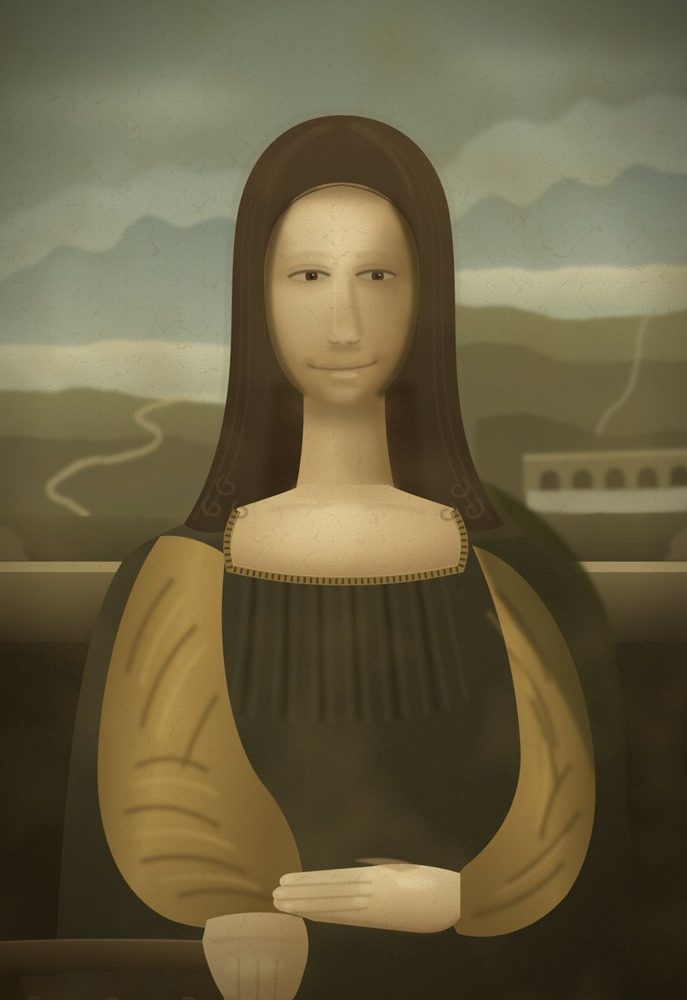</a> <a href="https://x.com/diegocabezas01/status/2102463433731903630">Pièce jointe de la source 1</a></td>
</tr>
</table>

Type: Evaluation | Date: 2026-09-22

---

### Cas 115: [Comparaison de SVG avec Sol et Luna](https://x.com/notjazii/status/2102469004271173877) (par [@notjazii](https://x.com/notjazii))

**Limitez la comparaison SVG des trois modèles aux résultats visibles et au jugement personnel de l’auteur.**

L’auteur compare Opus 5.5, GPT-6 Sol et Luna sur une tâche SVG, montre les résultats et donne son jugement personnel. Les affirmations plus générales sur les modèles dans la publication dépassent ce que cet exemple établit.

<table>
<tr>
<td><a href="https://x.com/notjazii/status/2102469004271173877">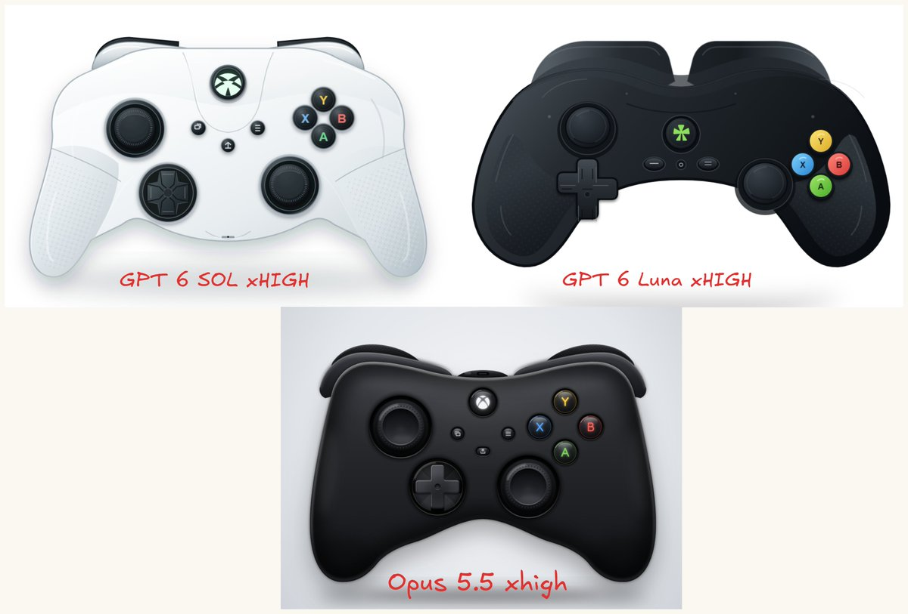</a> <a href="https://x.com/notjazii/status/2102469004271173877">Pièce jointe de la source 1</a></td>
</tr>
</table>

Type: Evaluation | Date: 2026-09-22

---

### Cas 116: [Dessiner une photo dans Paint avec un script](https://x.com/matiass/status/2102474745845260663) (par [@matiass](https://x.com/matiass))

**Précisez et vérifiez une interaction uniquement à la souris si une image scriptée ne satisfait pas la tâche dans Paint.**

L’auteur demande un portrait de son responsable dans Paint, mais le modèle utilise un script au lieu de dessiner à la souris. Le résultat démontre une méthode d’image codée plutôt que la manipulation manuelle du curseur demandée.

<table>
<tr>
<td><a href="https://x.com/matiass/status/2102474745845260663">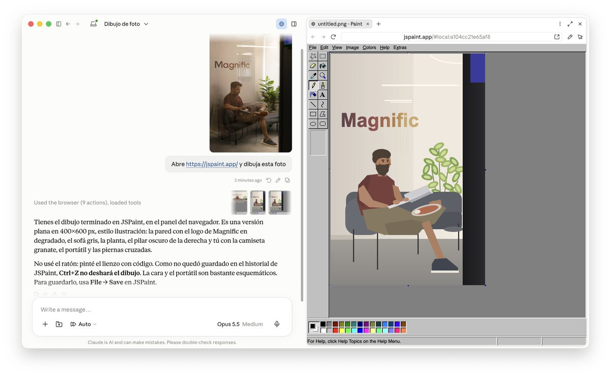</a> <a href="https://x.com/matiass/status/2102474745845260663">Pièce jointe de la source 1</a></td>
</tr>
</table>

Type: Limit | Date: 2026-09-22

---

### Cas 117: [Claude imaginé comme un petit soleil](https://x.com/digi_dot_exe/status/2102486204419817954) (par [@digi_dot_exe](https://x.com/digi_dot_exe))

**Traitez ce petit soleil comme une consigne d’autoportrait imaginaire, et non comme une preuve d’expérience vécue du modèle.**

Invité à dessiner ce que cela fait d’être Claude, Opus 5.5 produit un petit soleil qui se sent débordé et range ses souvenirs dans un bocal. Il s’agit d’une représentation créative anthropomorphique.

<table>
<tr>
<td><a href="https://video.twimg.com/amplify_video/2102484064368459776/vid/avc1/1080x1350/mvxYEPFm2mYe6x9g.mp4?tag=29">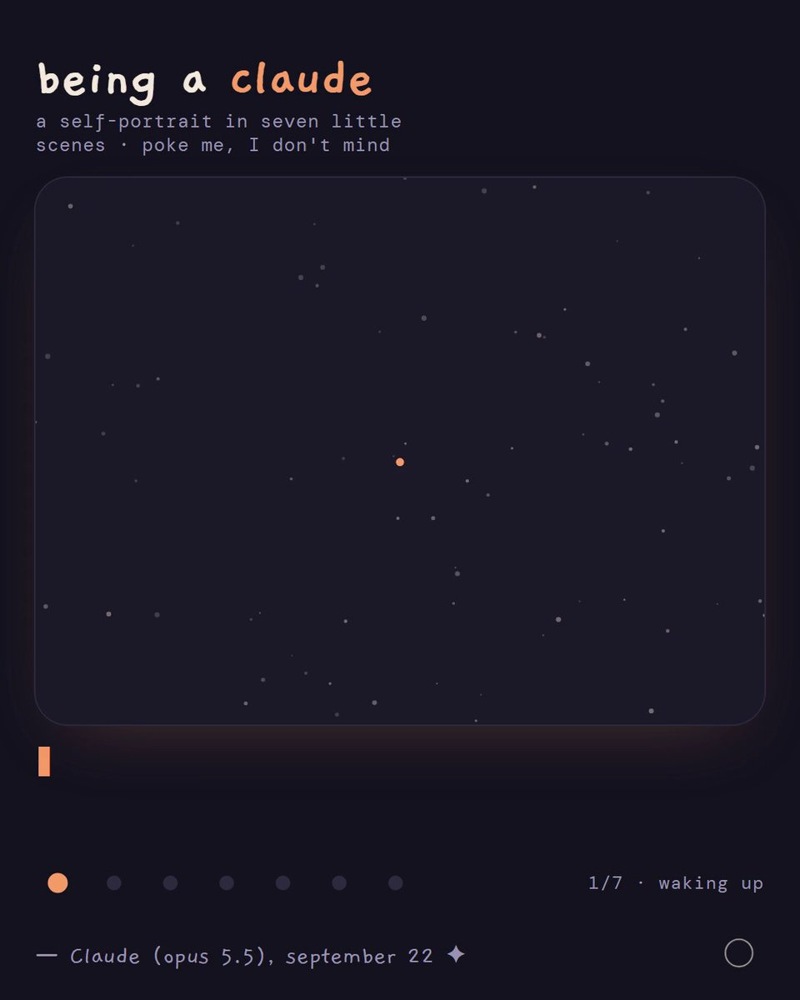</a> <a href="https://video.twimg.com/amplify_video/2102484064368459776/vid/avc1/1080x1350/mvxYEPFm2mYe6x9g.mp4?tag=29">Lire la vidéo source 1</a></td>
</tr>
</table>

Type: Demo | Date: 2026-09-22

---

### Cas 118: [Un test de dessin de pélican](https://x.com/alexgetmancom/status/2102451293419970767) (par [@alexgetmancom](https://x.com/alexgetmancom))

**Utilisez ce dessin de pélican comme échantillon de résultat dont la consigne et la méthode ne sont pas disponibles.**

L’auteur partage le résultat d’un test de dessin de pélican avec Opus 5.5, sans fournir la consigne détaillée ni les étapes de génération dans la publication.

<table>
<tr>
<td> <a href="https://x.com/alexgetmancom/status/2102451293419970767">Pièce jointe de la source 1</a></td>
</tr>
</table>

Type: Demo | Date: 2026-09-22

---

### Cas 119: [Fontaines et yeux de chauves-souris en pixel art](https://x.com/developedbyed/status/2102522318559858721) (par [@developedbyed](https://x.com/developedbyed))

**Comparez les détails animés des scènes pixelisées séparément des préférences subjectives de style.**

L’auteur compare des scènes pixelisées d’Opus 5.5 et GPT-6 Astra, en soulignant l’eau animée d’une fontaine et les yeux de chauves-souris dans une grotte. La préférence de style visuel est son appréciation subjective.

<table>
<tr>
<td><a href="https://video.twimg.com/amplify_video/2102521319891902465/vid/avc1/1440x1440/498lOSHSsdi1ZQWa.mp4?tag=29">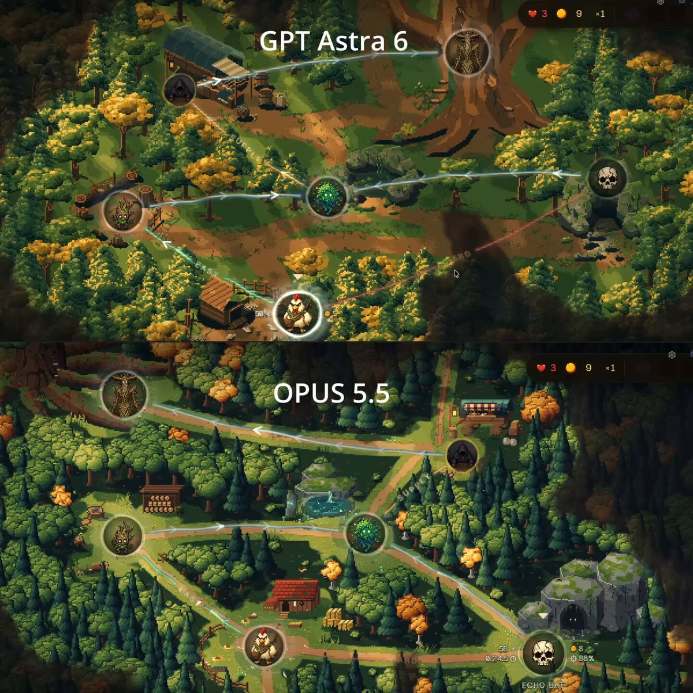</a> <a href="https://video.twimg.com/amplify_video/2102521319891902465/vid/avc1/1440x1440/498lOSHSsdi1ZQWa.mp4?tag=29">Lire la vidéo source 1</a></td>
</tr>
</table>

Type: Evaluation | Date: 2026-09-22

---

### Cas 120: [Une représentation de San Francisco](https://x.com/Tim_Hua_/status/2102468957492092988) (par [@Tim_Hua_](https://x.com/Tim_Hua_))

**Examinez l’œuvre représentant San Francisco sans lui attribuer une chaîne de production non précisée.**

L’auteur partage une œuvre de San Francisco réalisée avec Opus 5.5, sans préciser les outils ni l’ensemble de la méthode de production dans la publication.

<table>
<tr>
<td><a href="https://x.com/Tim_Hua_/status/2102468957492092988">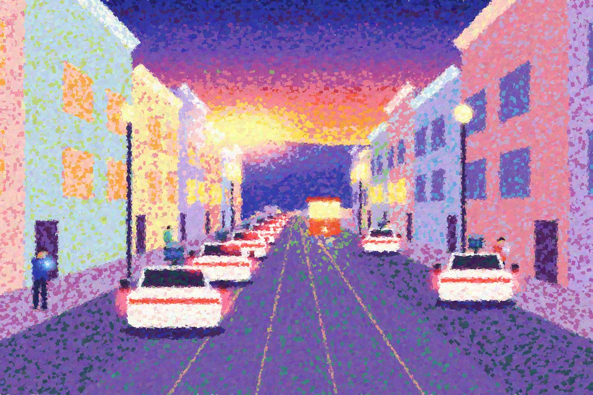</a> <a href="https://x.com/Tim_Hua_/status/2102468957492092988">Pièce jointe de la source 1</a></td>
<td><a href="https://x.com/Tim_Hua_/status/2102468957492092988">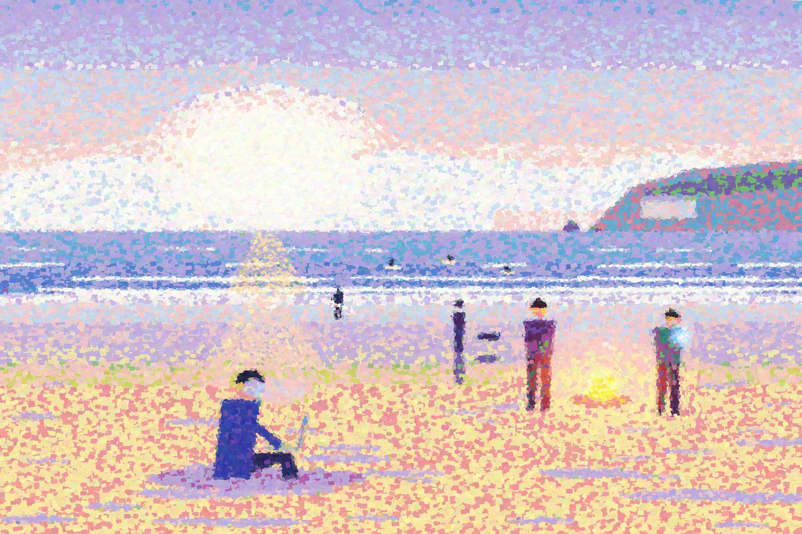</a> <a href="https://x.com/Tim_Hua_/status/2102468957492092988">Pièce jointe de la source 2</a></td>
</tr>
<tr>
<td><a href="https://x.com/Tim_Hua_/status/2102468957492092988">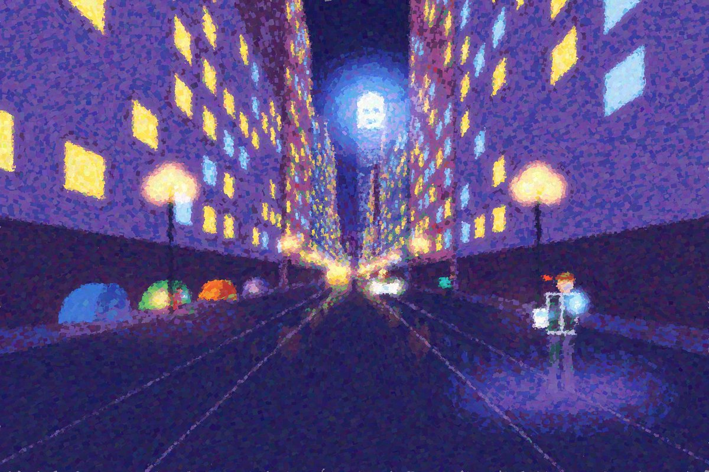</a> <a href="https://x.com/Tim_Hua_/status/2102468957492092988">Pièce jointe de la source 3</a></td>
<td><a href="https://x.com/Tim_Hua_/status/2102468957492092988">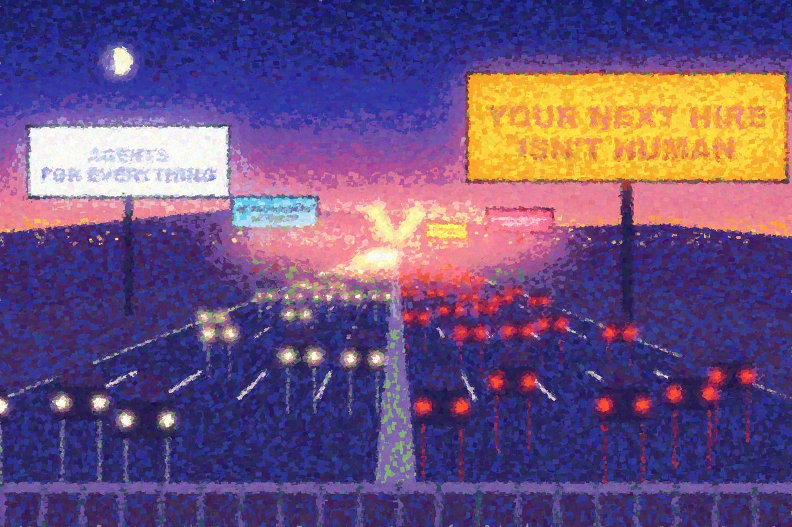</a> <a href="https://x.com/Tim_Hua_/status/2102468957492092988">Pièce jointe de la source 4</a></td>
</tr>
</table>

Type: Demo | Date: 2026-09-22

---

### Cas 121: [Un pélican cycliste comparé à Grok 4.7](https://x.com/berryxia/status/2102450486767124896) (par [@berryxia](https://x.com/berryxia))

**Comparez directement les animations de pélican avant d’accepter le verdict de mouvement plus stable de l’auteur.**

L’auteur compare des animations de pélican à vélo d’Opus 5.5 et de Grok 4.7 et juge le mouvement d’Opus plus stable. Cette conclusion vient de sa présentation et de son observation.

<table>
<tr>
<td><a href="https://video.twimg.com/amplify_video/2102448528585027584/vid/avc1/1920x1080/DbWdeQtKg_iM4I6g.mp4?tag=29">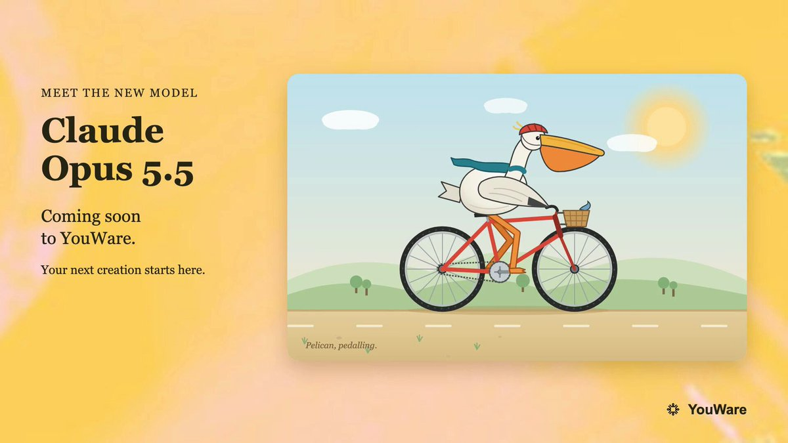</a> <a href="https://video.twimg.com/amplify_video/2102448528585027584/vid/avc1/1920x1080/DbWdeQtKg_iM4I6g.mp4?tag=29">Lire la vidéo source 1</a></td>
</tr>
</table>

Type: Evaluation | Date: 2026-09-22

---

### Cas 122: [Un générateur d’art à partir de « subtle art »](https://x.com/felixrieseberg/status/2102450683069014053) (par [@felixrieseberg](https://x.com/felixrieseberg))

**Essayez le générateur d’art lié en conservant l’affiliation de son auteur à la plateforme.**

Un auteur affilié à une plateforme montre un générateur d’art obtenu avec la consigne « some subtle art » et fournit un lien pour l’essayer. Il s’agit d’une présentation du travail d’un représentant de plateforme.

<table>
<tr>
<td><a href="https://x.com/felixrieseberg/status/2102450683069014053">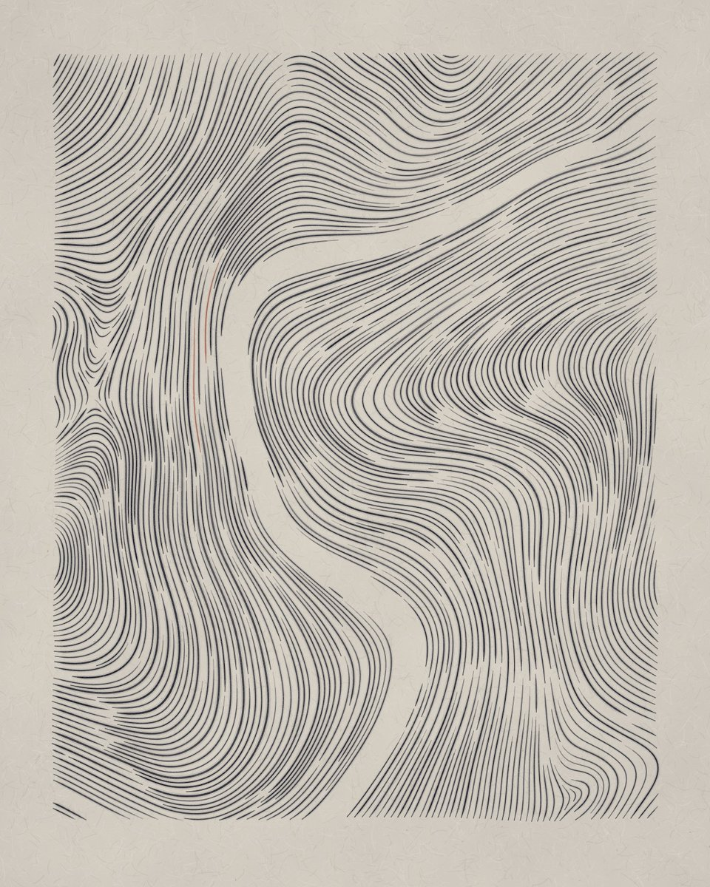</a> <a href="https://x.com/felixrieseberg/status/2102450683069014053">Pièce jointe de la source 1</a></td>
</tr>
</table>

Type: Demo | Date: 2026-09-22

---

### Cas 123: [Une recréation inspirée de John Wick](https://x.com/cherry_mx_reds/status/2102518921240965578) (par [@cherry_mx_reds](https://x.com/cherry_mx_reds))

**Utilisez l’animation sur le thème de John Wick comme référence visuelle dont la méthode de génération n’est pas documentée.**

L’auteur présente une animation sur le thème de John Wick recréée avec Opus 5.5, sans fournir une méthode complète de génération dans la publication.

<table>
<tr>
<td> <a href="https://video.twimg.com/amplify_video/2102518834376646657/vid/avc1/1920x1080/jwrTaybpDvFZzH2e.mp4?tag=29">Lire la vidéo source 1</a></td>
</tr>
</table>

Type: Demo | Date: 2026-09-22

---

### Cas 124: [Quatre SVG et un échec avec l’effort maximal](https://news.ycombinator.com/item?id=49804862) (par [@simonw](https://news.ycombinator.com/user?id=simonw))

**Examinez les SVG par niveau d’effort avec l’épuisement de jetons au niveau Max et le coût de cette tentative échouée.**

L’auteur publie les commandes et les SVG de pélican à vélo obtenus aux niveaux low, medium, high et xhigh avec llm-anthropic. Max a épuisé 128,000 jetons de sortie sans répondre ; cette tentative échouée a coûté $2.56.

Sources complémentaires / comptes rendus regroupés: [simonw](https://news.ycombinator.com/item?id=49805100)

Type: Evaluation | Date: 2026-09-22

---

### Cas 125: [Un benchmark SVG de MacBook Pro](https://news.ycombinator.com/item?id=49807536) (par [@ianberdin](https://news.ycombinator.com/user?id=ianberdin))

**Lisez les résultats SVG du MacBook Pro comme l’évaluation d’une tâche et la décision produit propres à Playcode.**

Playcode partage son benchmark SVG de MacBook Pro, annonce un coût favorable pour un bon résultat et indique qu’Opus 5.5 est désormais son modèle par défaut. Il s’agit de l’évaluation et de la promotion réalisées par le fournisseur de l’outil.

Type: Evaluation | Date: 2026-09-22

---

## 🧩 Sites web et interfaces

### Cas 126: [Améliorer un site personnel et créer sa bande-annonce](https://x.com/trq212/status/2102477340920152162) (par [@trq212](https://x.com/trq212))

**Envisagez des critiques de conception itératives et une bande-annonce de l’historique des versions pour documenter la refonte d’un site personnel.**

Un auteur affilié à une plateforme utilise un abonnement Max et des cycles de conception et de critique pour refaire un site personnel, puis demande à Opus 5.5 de créer une bande-annonce des versions. L’affirmation selon laquelle le ton souhaité a été saisi relève de son appréciation.

<table>
<tr>
<td><a href="https://video.twimg.com/amplify_video/2102477300990357504/vid/avc1/2544x1440/ezh0f1hyTASXR8MP.mp4?tag=29">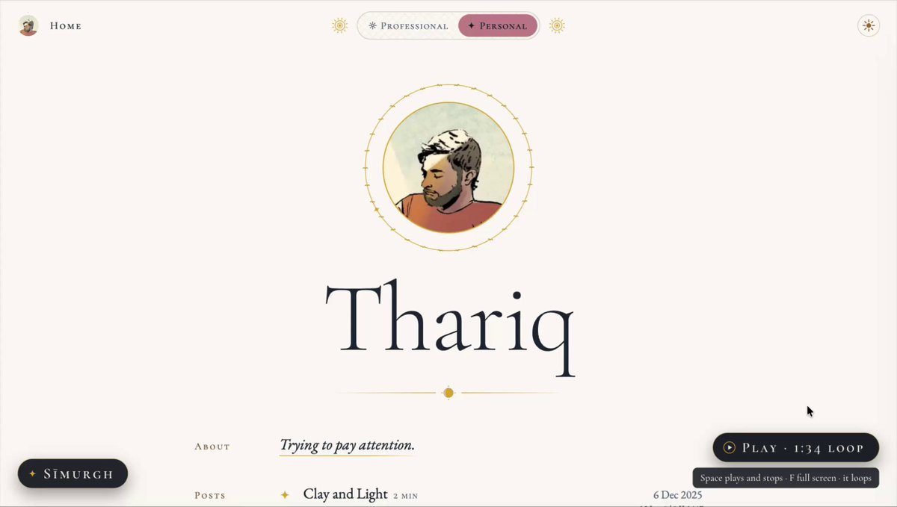</a> <a href="https://video.twimg.com/amplify_video/2102477300990357504/vid/avc1/2544x1440/ezh0f1hyTASXR8MP.mp4?tag=29">Lire la vidéo source 1</a></td>
</tr>
</table>

Type: Demo | Date: 2026-09-22

---

### Cas 127: [Un catalogue de minéraux à partir de huit références](https://x.com/premiumtantan/status/2102474993783468529) (par [@premiumtantan](https://x.com/premiumtantan))

**Prévoyez plusieurs références et consignes de révision pour obtenir le style de catalogue de minéraux montré ici.**

L’aperçu multimédia montre une page web de style catalogue de minéraux. L’auteur indique avoir utilisé huit images de référence, neuf consignes et environ une heure d’itération, et non obtenu le résultat en une seule passe.

<table>
<tr>
<td><a href="https://video.twimg.com/amplify_video/2102474090955337728/vid/avc1/1920x1080/fsU_iKeBZJ80xn-k.mp4?tag=29">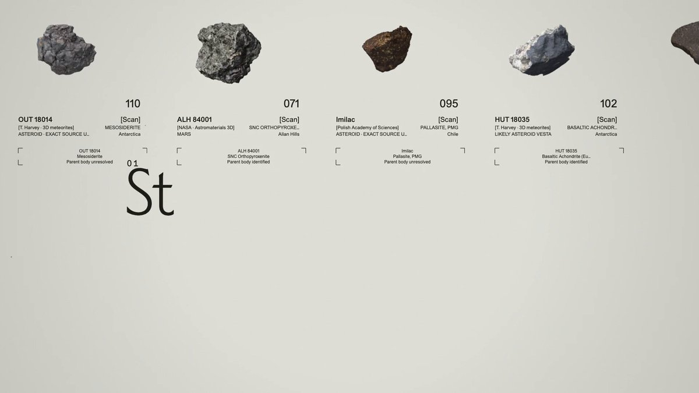</a> <a href="https://video.twimg.com/amplify_video/2102474090955337728/vid/avc1/1920x1080/fsU_iKeBZJ80xn-k.mp4?tag=29">Lire la vidéo source 1</a></td>
</tr>
</table>

Type: Demo | Date: 2026-09-22

---

### Cas 128: [Refaire une application existante avec le même objectif](https://x.com/jaimintf/status/2102465969155080623) (par [@jaimintf](https://x.com/jaimintf))

**Comparez les refontes par rapport à la même application existante et au même objectif déclaré.**

L’auteur donne à Opus 5.5 et Opus 5 (1M) la même consigne et le même /goal pour refaire une application existante peu aboutie, puis présente les deux interfaces pour comparaison.

<table>
<tr>
<td><a href="https://video.twimg.com/amplify_video/2102464950794964992/vid/avc1/1620x1080/yResf3p2DfeNEkw1.mp4?tag=29">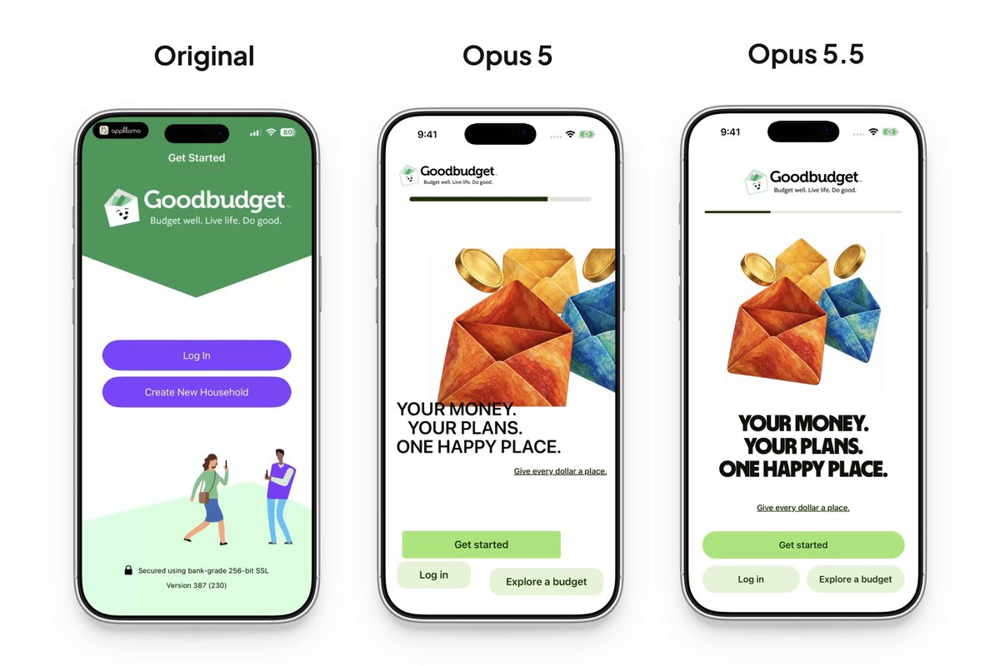</a> <a href="https://video.twimg.com/amplify_video/2102464950794964992/vid/avc1/1620x1080/yResf3p2DfeNEkw1.mp4?tag=29">Lire la vidéo source 1</a></td>
</tr>
</table>

Type: Evaluation | Date: 2026-09-22

---

### Cas 129: [Tests frontend et tentatives de volcan bloquées](https://x.com/karminski3/status/2102479290420048093) (par [@karminski3](https://x.com/karminski3))

**Intégrez les tentatives bloquées et les jetons de raisonnement consommés à l’évaluation des résultats frontend.**

L’auteur présente six tests visuels frontend, les juge proches de Fable 5.1 et rapporte une consommation accrue de jetons de raisonnement. Des tentatives répétées d’éruption volcanique se sont bloquées sans produire de code, dans le terminal comme sur le web ; les affirmations sur la distillation ou la taille du modèle sont spéculatives.

<table>
<tr>
<td><a href="https://video.twimg.com/amplify_video/2102478654282539009/vid/avc1/1920x1080/kuBYTlYfr4AmdeFf.mp4?tag=29">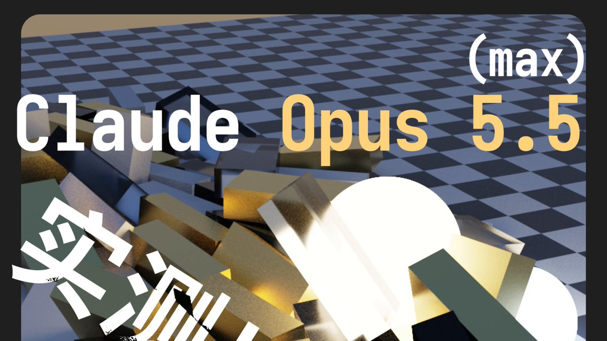</a> <a href="https://video.twimg.com/amplify_video/2102478654282539009/vid/avc1/1920x1080/kuBYTlYfr4AmdeFf.mp4?tag=29">Lire la vidéo source 1</a></td>
</tr>
</table>

Type: Limit | Date: 2026-09-22

---

### Cas 130: [Une interface de notes reliées sans skill de design](https://x.com/daradoescode/status/2102492236852195332) (par [@daradoescode](https://x.com/daradoescode))

**Examinez l’interface de notes reliées sans supposer que toutes ses fonctions ont été vérifiées.**

L’aperçu multimédia montre un site de notes reliées ; l’auteur indique n’avoir utilisé aucun skill de design. La publication le qualifie de démonstration interactive, sans fournir une vérification fonctionnelle complète.

<table>
<tr>
<td><a href="https://video.twimg.com/amplify_video/2102492187921461248/vid/avc1/1724x1080/_NqeeUvnhh9umkaX.mp4?tag=29">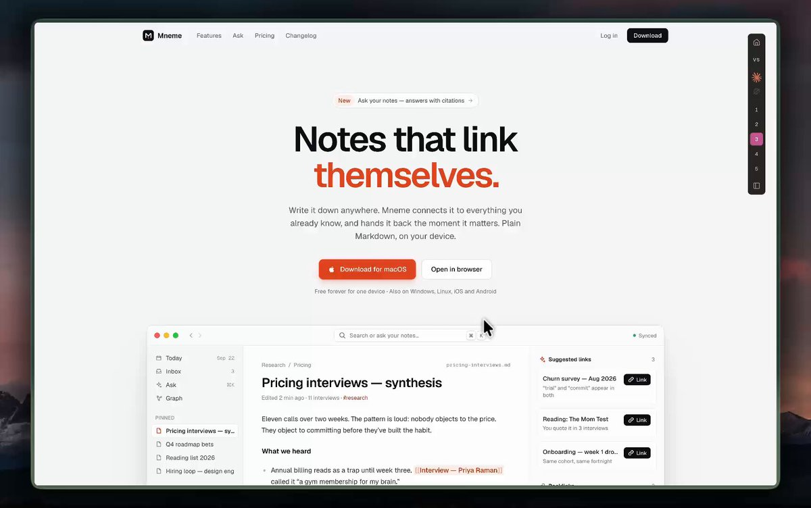</a> <a href="https://video.twimg.com/amplify_video/2102492187921461248/vid/avc1/1724x1080/_NqeeUvnhh9umkaX.mp4?tag=29">Lire la vidéo source 1</a></td>
</tr>
</table>

Type: Demo | Date: 2026-09-22

---

### Cas 131: [Une interface en une passe comparée à Grok 4.7](https://x.com/IndependentEco/status/2102452974689878152) (par [@IndependentEco](https://x.com/IndependentEco))

**Comparez les deux interfaces en conservant les dates différentes de leurs exécutions avec la même consigne.**

L’auteur génère une interface avec Opus 5.5 en une passe, à partir de la même consigne utilisée la veille pour tester Grok 4.7, puis partage le résultat pour comparaison.

<table>
<tr>
<td> <a href="https://video.twimg.com/amplify_video/2102452884184985600/vid/avc1/1342x642/w1K5MGEb-6RXb0AP.mp4?tag=29">Lire la vidéo source 1</a></td>
</tr>
</table>

Type: Evaluation | Date: 2026-09-22

---

### Cas 132: [Une application antistress en 23 minutes](https://x.com/shfred0/status/2102492745889886514) (par [@shfred0](https://x.com/shfred0))

**Examinez cette application antistress comme un prototype sans supposer un bénéfice thérapeutique démontré.**

Après une semaine difficile, l’auteur demande à Opus 5.5 une application antistress et partage un résultat qui aurait été créé en 23 minutes. La publication présente l’application sans en évaluer l’effet sur le stress.

<table>
<tr>
<td><a href="https://video.twimg.com/amplify_video/2102492618080862208/vid/avc1/1180x2148/-sNEDlWTuxHCzcfW.mp4?tag=29">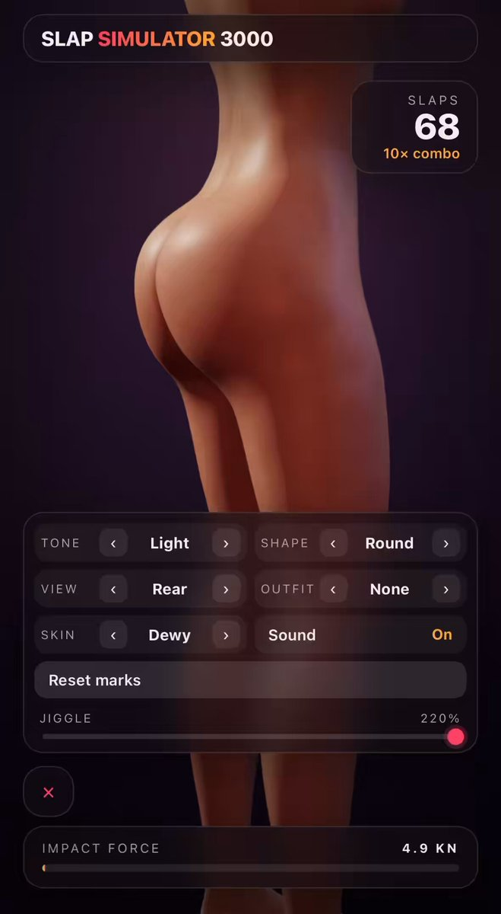</a> <a href="https://video.twimg.com/amplify_video/2102492618080862208/vid/avc1/1180x2148/-sNEDlWTuxHCzcfW.mp4?tag=29">Lire la vidéo source 1</a></td>
</tr>
</table>

Type: Demo | Date: 2026-09-22

---

### Cas 133: [Une page d’accueil Stratus sur le thème météo](https://x.com/ZryMiller/status/2102451052931166573) (par [@ZryMiller](https://x.com/ZryMiller))

**Utilisez la page sur le thème météo comme référence de conception avec le contexte de coût et de durée annoncé.**

L’aperçu multimédia montre une page d’accueil Stratus centrée sur les nuages et la météo. L’auteur annonce un coût de $6.82 et une exécution de 21 minutes.

<table>
<tr>
<td><a href="https://video.twimg.com/amplify_video/2102450880029270016/vid/avc1/1914x1008/FcVRUSW6L-hSRCzj.mp4?tag=29">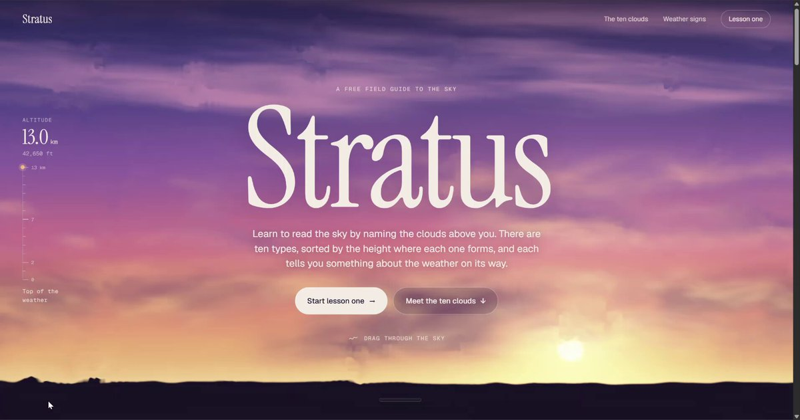</a> <a href="https://video.twimg.com/amplify_video/2102450880029270016/vid/avc1/1914x1008/FcVRUSW6L-hSRCzj.mp4?tag=29">Lire la vidéo source 1</a></td>
</tr>
</table>

Type: Demo | Date: 2026-09-22

---

### Cas 134: [Un CAPTCHA inversé interactif](https://x.com/israelfemiojo/status/2102478901058363596) (par [@israelfemiojo](https://x.com/israelfemiojo))

**Envisagez une interaction de CAPTCHA inversé pour expérimenter la conception de questions ambiguës.**

L’auteur transforme Opus 5.5 en expérience de CAPTCHA inversé et présente son interaction de questions-réponses, en signalant que les réponses étaient moins évidentes que prévu.

<table>
<tr>
<td><a href="https://video.twimg.com/amplify_video/2102478762767966208/vid/avc1/1920x1014/PPj5_DsN5KMOYPOg.mp4?tag=29">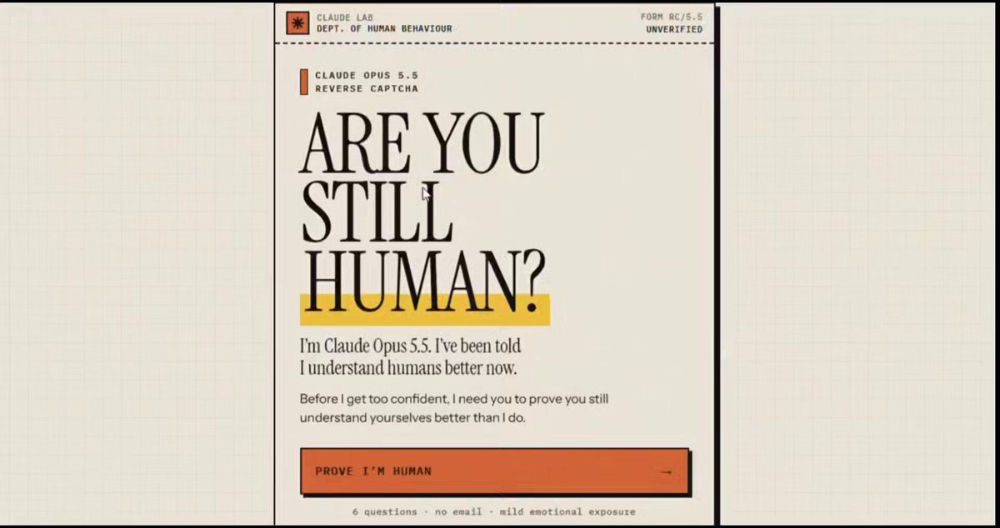</a> <a href="https://video.twimg.com/amplify_video/2102478762767966208/vid/avc1/1920x1014/PPj5_DsN5KMOYPOg.mp4?tag=29">Lire la vidéo source 1</a></td>
</tr>
</table>

Type: Demo | Date: 2026-09-22

---

### Cas 135: [Un outil personnel d’interaction avec imports Figma](https://x.com/TylerNishida/status/2102482498404204734) (par [@TylerNishida](https://x.com/TylerNishida))

**Utilisez des références de design importées et de petites modifications pour explorer et apprendre les interactions d’interface.**

L’auteur crée un outil personnel de conception d’interactions piloté par Claude, avec des imports annoncés depuis Figma, des sites web ou du code, ainsi que des modifications et des ajustements fins des interactions. Cette méthode sert aussi à comprendre le fonctionnement du design.

<table>
<tr>
<td><a href="https://video.twimg.com/amplify_video/2102481797837959168/vid/avc1/1962x1080/zjb0diBt84FMOCyh.mp4?tag=29">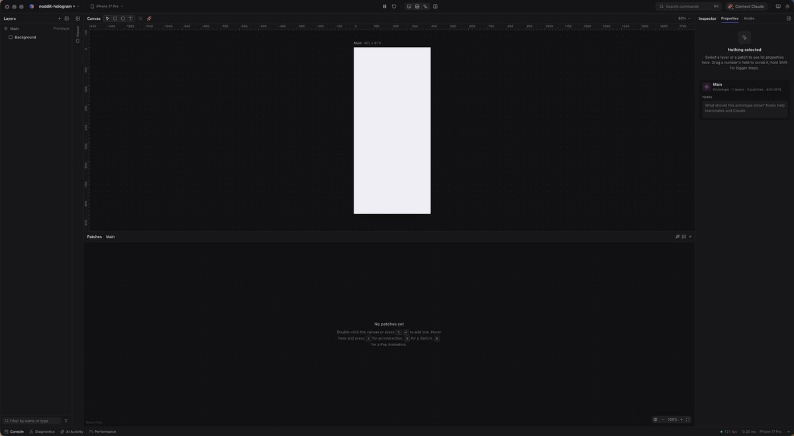</a> <a href="https://video.twimg.com/amplify_video/2102481797837959168/vid/avc1/1962x1080/zjb0diBt84FMOCyh.mp4?tag=29">Lire la vidéo source 1</a></td>
</tr>
</table>

Type: Demo | Date: 2026-09-22

---

### Cas 136: [PonteMLX pour surveiller des modèles locaux](https://x.com/viticci/status/2102484736254030019) (par [@viticci](https://x.com/viticci))

**Examinez l’interface de surveillance en tenant compte de son modèle local distinct de génération d’images.**

L’auteur présente PonteMLX, une application au style ancien dont la rivière reflète le traitement local des jetons, tout en affichant plusieurs passerelles API MLX et l’utilisation de la RAM. Les images proviennent d’un modèle local Qwen-Image-2.1 qu’Opus aurait découvert et orchestré sans consigne en ce sens.

<table>
<tr>
<td><a href="https://video.twimg.com/amplify_video/2102484562265649152/vid/avc1/1440x1080/sDJnj_e-5jWf5deA.mp4?tag=29">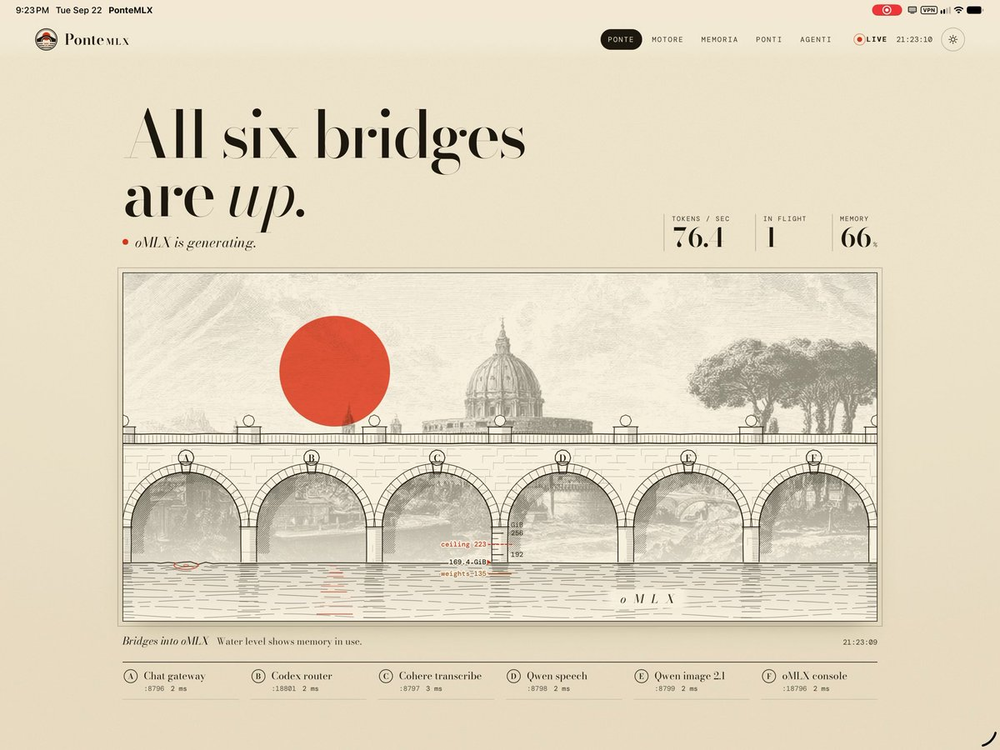</a> <a href="https://video.twimg.com/amplify_video/2102484562265649152/vid/avc1/1440x1080/sDJnj_e-5jWf5deA.mp4?tag=29">Lire la vidéo source 1</a></td>
</tr>
</table>

Type: Integration | Date: 2026-09-22

---

### Cas 137: [Aperçu d’un tableau de bord de planification logistique](https://x.com/maybepratikk/status/2102466291651285048) (par [@maybepratikk](https://x.com/maybepratikk))

**Traitez la capture logistique comme une preuve d’interface tant que le serveur et le comportement de planification ne sont pas vérifiés.**

L’aperçu joint montre un tableau de bord de planification logistique utilisé par l’auteur pour discuter de design produit. La capture atteste une présentation d’interface, pas le fonctionnement d’un serveur ou d’un système de planification.

<table>
<tr>
<td><a href="https://x.com/maybepratikk/status/2102466291651285048">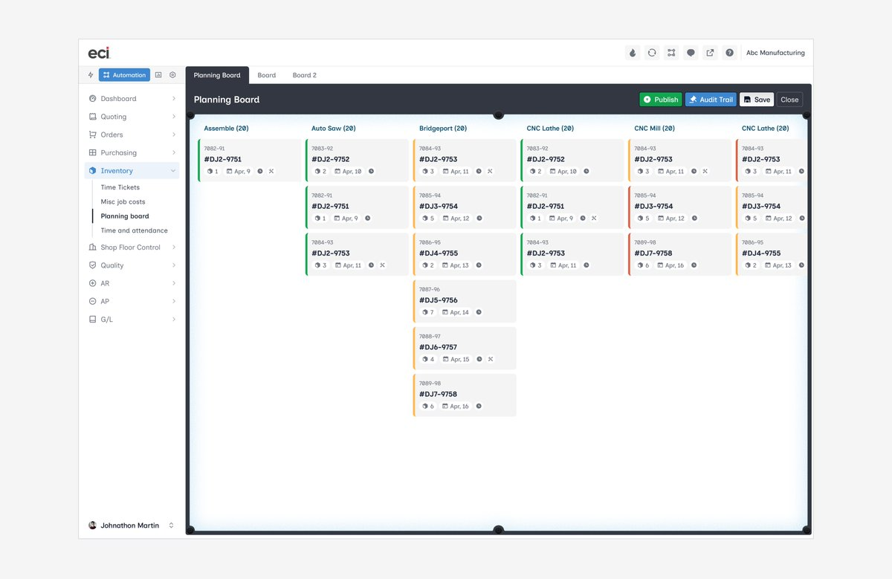</a> <a href="https://x.com/maybepratikk/status/2102466291651285048">Pièce jointe de la source 1</a></td>
</tr>
</table>

Type: Demo | Date: 2026-09-22

---

### Cas 138: [Comparaison de sites de studio créatif en WebGL](https://x.com/viktoroddy/status/2102484130403676670) (par [@viktoroddy](https://x.com/viktoroddy))

**Comparez les pages de studio créatif au brief commun sur WebGL, la typographie et le défilement.**

L’auteur compare Opus 5.5 et GPT-6 Sol dans Higgsfield avec le même brief : un site de studio créatif futuriste avec sphère WebGL interactive, typographie surdimensionnée et animations de défilement fluides.

<table>
<tr>
<td><a href="https://video.twimg.com/amplify_video/2102483951554326529/vid/avc1/1080x1080/n9TFDfJ9CF_oWydJ.mp4?tag=29">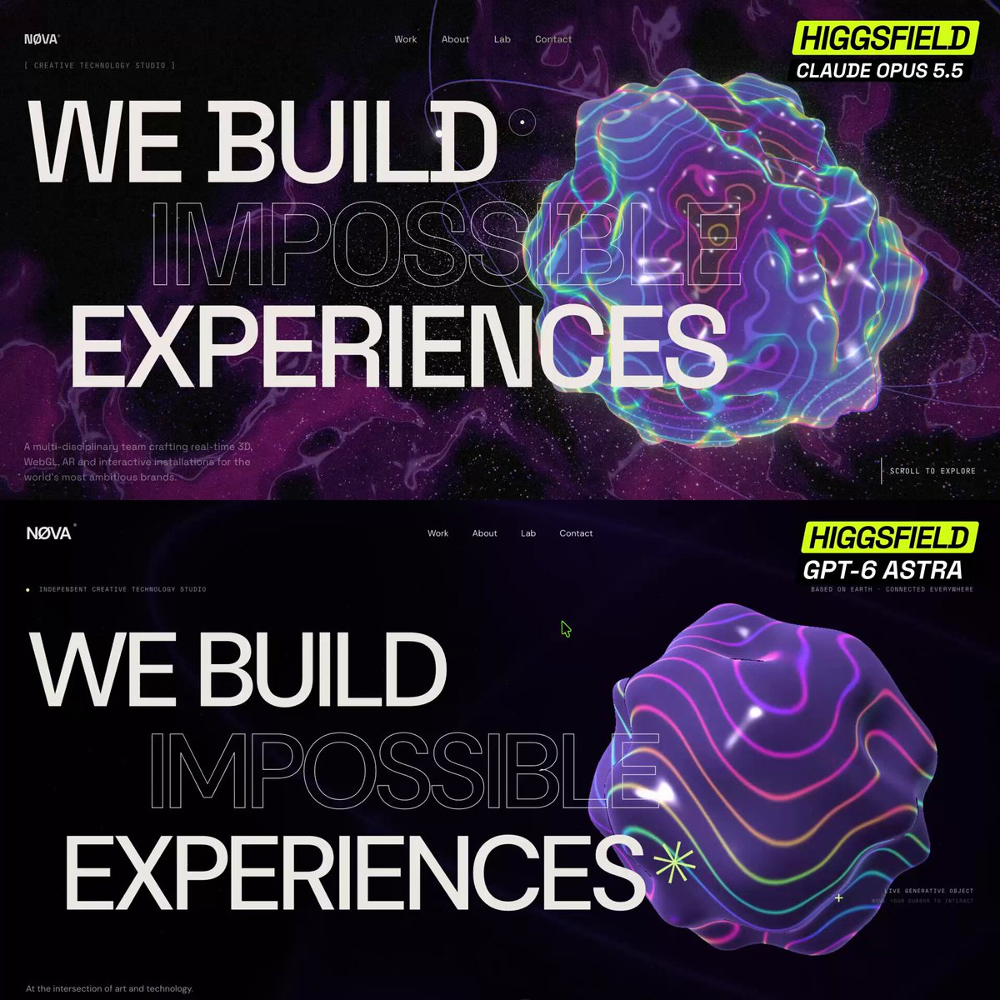</a> <a href="https://video.twimg.com/amplify_video/2102483951554326529/vid/avc1/1080x1080/n9TFDfJ9CF_oWydJ.mp4?tag=29">Lire la vidéo source 1</a></td>
</tr>
</table>

Type: Evaluation | Date: 2026-09-22

---

### Cas 139: [Une interface de composants d’icônes isométriques](https://x.com/UnCorped/status/2102454160688111697) (par [@UnCorped](https://x.com/UnCorped))

**Examinez l’interface isométrique sans supposer que la capture prouve le fonctionnement des composants.**

La capture montre une interface présentant des composants d’icônes isométriques ; l’auteur indique une génération en une passe. L’image n’établit pas que les composants complets ou les fonctions de l’application marchent.

<table>
<tr>
<td><a href="https://video.twimg.com/amplify_video/2102454121718841345/vid/avc1/1536x1080/XnDAxOmZ0zZALnyT.mp4?tag=29">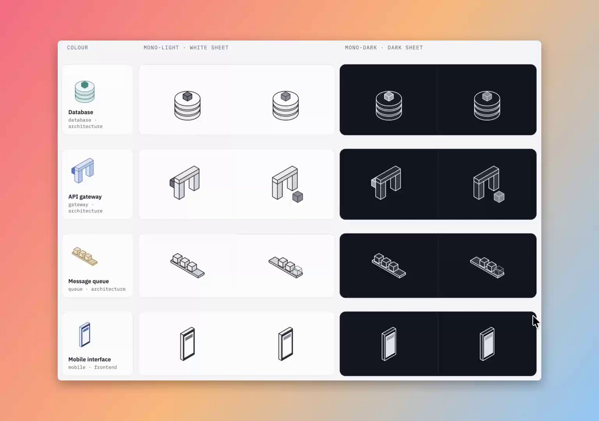</a> <a href="https://video.twimg.com/amplify_video/2102454121718841345/vid/avc1/1536x1080/XnDAxOmZ0zZALnyT.mp4?tag=29">Lire la vidéo source 1</a></td>
</tr>
</table>

Type: Demo | Date: 2026-09-22

---

### Cas 140: [Une page de sélection de jeux de style console portable](https://x.com/lucaxyzz/status/2102461657742184599) (par [@lucaxyzz](https://x.com/lucaxyzz))

**Traitez la page de sélection de style console portable comme une présentation d’interface tant que le lancement des jeux n’est pas vérifié.**

L’aperçu multimédia montre une page de sélection de jeux de style console portable attribuée à Opus 5.5. Son serveur et sa fonction de lancement des jeux n’ont pas été vérifiés.

<table>
<tr>
<td><a href="https://x.com/lucaxyzz/status/2102461657742184599">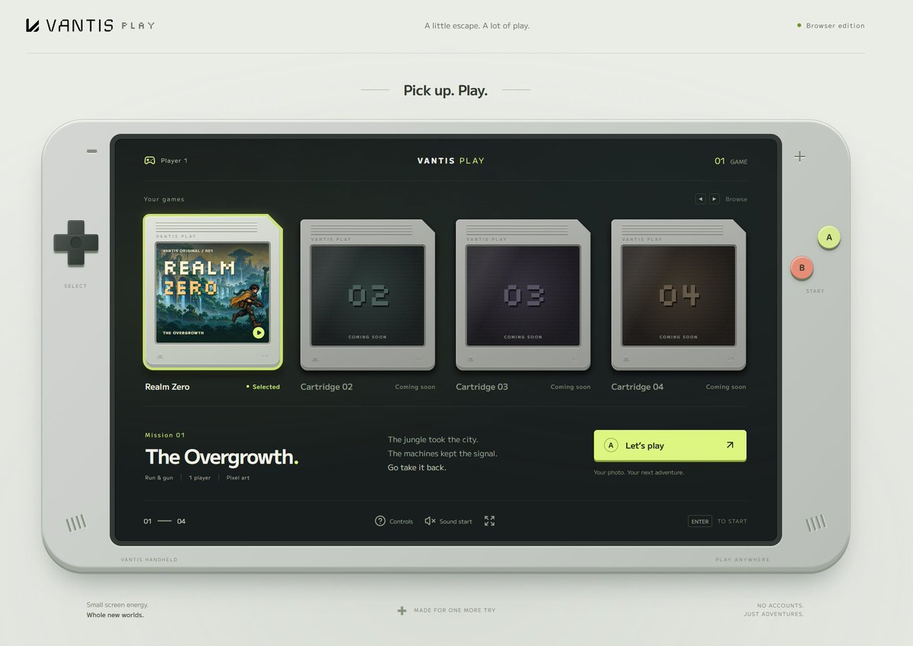</a> <a href="https://x.com/lucaxyzz/status/2102461657742184599">Pièce jointe de la source 1</a></td>
<td><a href="https://x.com/lucaxyzz/status/2102461657742184599">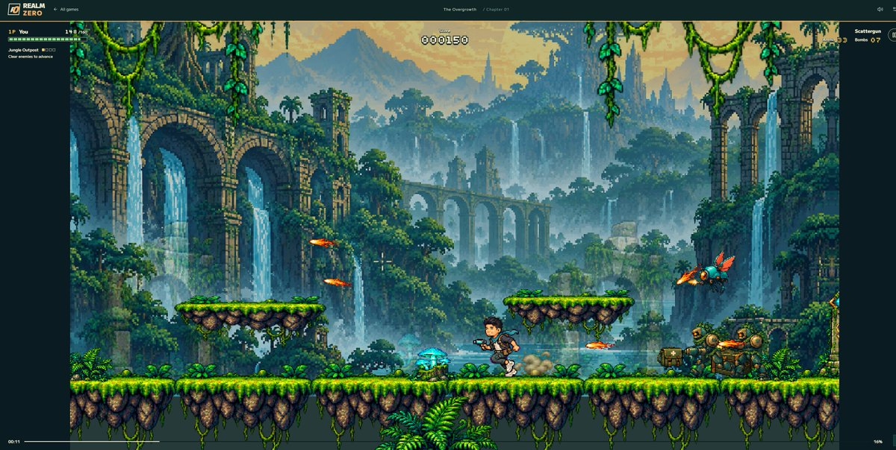</a> <a href="https://x.com/lucaxyzz/status/2102461657742184599">Pièce jointe de la source 2</a></td>
</tr>
</table>

Type: Demo | Date: 2026-09-22

---

### Cas 141: [Un outil de vectorisation d’images en une passe](https://x.com/MotreskuKosta/status/2102462024131174785) (par [@MotreskuKosta](https://x.com/MotreskuKosta))

**Testez la précision des conversions sur différents types d’images avant de vous fier à cet outil annoncé comme créé en une passe.**

L’auteur présente un outil de conversion d’images en vecteurs qui aurait été généré en une passe avec Opus 5.5. La publication ne fournit pas de tests systématiques de précision ou de différents types d’images.

<table>
<tr>
<td><a href="https://video.twimg.com/amplify_video/2102461494135001088/vid/avc1/1728x1080/0tIldR5gYAfmAtxd.mp4?tag=29">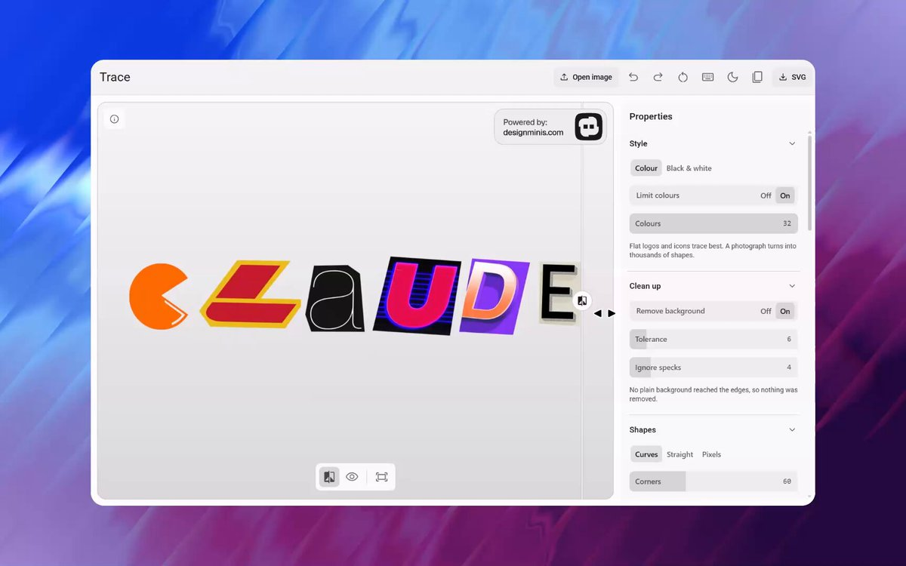</a> <a href="https://video.twimg.com/amplify_video/2102461494135001088/vid/avc1/1728x1080/0tIldR5gYAfmAtxd.mp4?tag=29">Lire la vidéo source 1</a></td>
</tr>
</table>

Type: Demo | Date: 2026-09-22

---

### Cas 142: [Comparaison de pages d’accueil avec une consigne commune](https://x.com/nemumusitocha/status/2102520968615018674) (par [@nemumusitocha](https://x.com/nemumusitocha))

**Comparez la galerie de pages d’accueil à sa consigne commune sans adopter d’emblée la préférence de l’auteur.**

L’auteur ajoute Claude Opus 5.5, GPT-6 Luna et GPT-6 Sol à une galerie de pages d’accueil générées avec la même consigne. La publication présente les résultats ; la préférence pour Opus est subjective.

<table>
<tr>
<td><a href="https://video.twimg.com/amplify_video/2102520323765886976/vid/avc1/1920x1080/VJhYV-dTg3srTtAD.mp4?tag=29">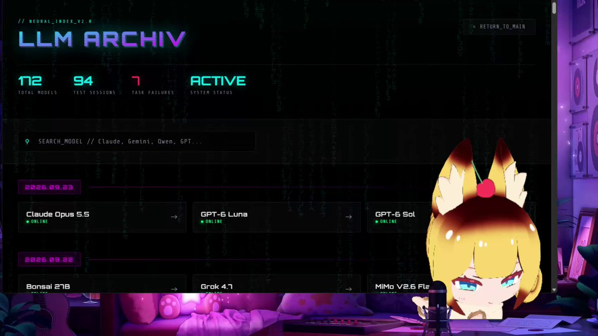</a> <a href="https://video.twimg.com/amplify_video/2102520323765886976/vid/avc1/1920x1080/VJhYV-dTg3srTtAD.mp4?tag=29">Lire la vidéo source 1</a></td>
</tr>
</table>

Type: Evaluation | Date: 2026-09-22

---

### Cas 143: [Refonte d’une application existante avec AppLlama MCP](https://x.com/jaimintf/status/2102448393893376096) (par [@jaimintf](https://x.com/jaimintf))

**Distinguez la refonte assistée par AppLlama des revenus attribués à l’application préexistante.**

L’auteur montre des vues avant/après d’une application existante qui aurait été refaite en une passe avec Opus 5.5 et AppLlama MCP. Le MRR de $10,000 annoncé concerne l’application préexistante ; rien ne prouve que ces revenus résultent de la refonte.

<table>
<tr>
<td><a href="https://video.twimg.com/amplify_video/2102444702700277760/vid/avc1/1440x1080/aDOvO9CEMeaqR6P6.mp4?tag=29">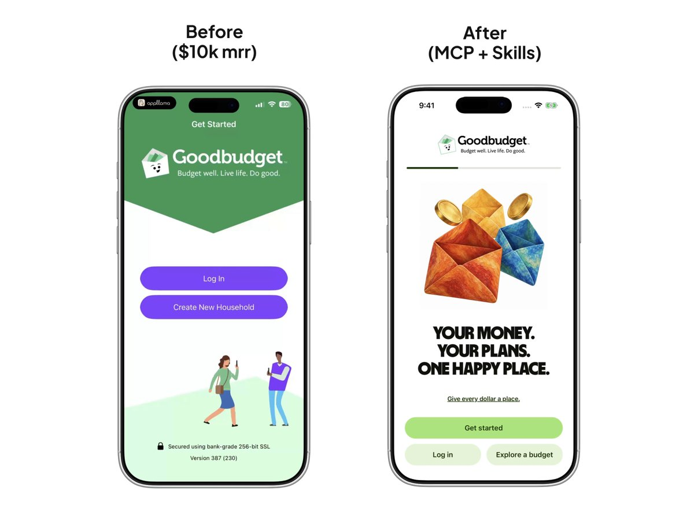</a> <a href="https://video.twimg.com/amplify_video/2102444702700277760/vid/avc1/1440x1080/aDOvO9CEMeaqR6P6.mp4?tag=29">Lire la vidéo source 1</a></td>
</tr>
</table>

Type: Integration | Date: 2026-09-22

---

### Cas 144: [Fidélité et performances de la conversion d’image en HTML](https://news.ycombinator.com/item?id=49804947) (par [@jjcm](https://news.ycombinator.com/user?id=jjcm))

**Vérifiez les transitions et les performances d’exécution en plus de la fidélité visuelle pour les tâches d’image vers HTML.**

L’auteur partage une image de design et les pages produites par plusieurs modèles. Opus 5.5 suit le design mais omet les transitions demandées et fonctionne mal à l’exécution ; l’auteur préfère toujours Astra dans ce test.

Type: Evaluation | Date: 2026-09-22

---

### Cas 145: [Générer 100 fichiers HTML créatifs](https://x.com/MiaAI_lab/status/2102490829306634560) (par [@MiaAI_lab](https://x.com/MiaAI_lab))

**Échantillonnez et testez les fichiers HTML publiés avant de vous fier à l’affirmation selon laquelle aucun n’est défectueux.**

L’auteur demande 100 fichiers HTML visuellement soignés et non répétitifs, puis publie les résultats avec les consignes. Les exemples comprennent échecs, casse-briques, piano, cartes du ciel et animation ; l’affirmation selon laquelle aucun fichier n’est défectueux vient de l’auteur.

Type: Demo | Date: 2026-09-22

---

### Cas 146: [Taux de réussite et coût moyen sur Next.js](https://x.com/nextjs/status/2102516295715741912) (par [@nextjs](https://x.com/nextjs))

**Lisez le taux de réussite et le coût moyen annoncés dans le périmètre propre au framework de cette évaluation Next.js.**

Next.js annonce un taux de réussite de 97% pour Opus 5.5, à égalité avec Sol et Fable 5.1, ainsi que le coût moyen le plus bas des trois. Le classement lié porte sur cette évaluation propre au framework.

<table>
<tr>
<td><a href="https://x.com/nextjs/status/2102516295715741912">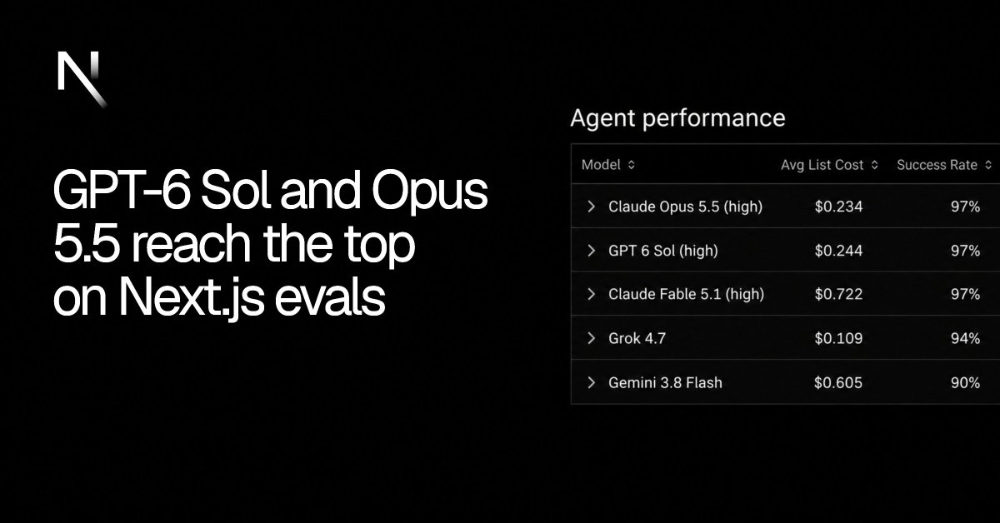</a> <a href="https://x.com/nextjs/status/2102516295715741912">Pièce jointe de la source 1</a></td>
</tr>
</table>

Sources complémentaires / comptes rendus regroupés: [@rauchg](https://x.com/rauchg/status/2102519097770885231)

Type: Evaluation | Date: 2026-09-22

---

## 🧩 Analyse métier et documents

### Cas 147: [Manquer le livrable essentiel d’une tâche de dix minutes](https://x.com/every/status/2102495448825262388) (par [@every](https://x.com/every))

**Exigez d’abord le livrable essentiel et précisez explicitement le budget et le point d’arrêt.**

Dans le test réalisé par Every, Opus avait dix minutes pour produire un conducteur d’événement, mais a d’abord créé un générateur de données et des documents à distribuer, épuisant le temps avant le programme. L’équipe recommande de préciser le livrable, le budget et le point d’arrêt, et de vérifier les autocritiques du modèle.

<table>
<tr>
<td> <a href="https://video.twimg.com/amplify_video/2102495426385735680/vid/avc1/1080x1080/9L_EhW2wJzGhRpZb.mp4?tag=16">Lire la vidéo source 1</a></td>
</tr>
</table>

Type: Limit | Date: 2026-09-22

---

### Cas 148: [Repérer les lacunes SEO dans 347 pages classées](https://x.com/borjafat/status/2102469192851083619) (par [@borjafat](https://x.com/borjafat))

**Distinguez la couverture de recherche SEO et la conformité des brouillons annoncées des résultats de trafic non mesurés.**

L’auteur de la plateforme rapporte la lecture de 347 pages classées pour 40 mots-clés, l’identification de 131 angles non couverts et l’extraction de données brutes pour $6.35 ; Fable 5.1 aurait couvert 16 mots-clés pour $5.53 dans le même temps. Il annonce aussi une violation des règles de rédaction dans 131 brouillons, contre deux dans 37 pour Fable ; ce test interne n’établit pas de gains de trafic de recherche.

<table>
<tr>
<td><a href="https://video.twimg.com/amplify_video/2102467411047763968/vid/avc1/1920x1080/InJdRf0w3jiN_Q6i.mp4?tag=29">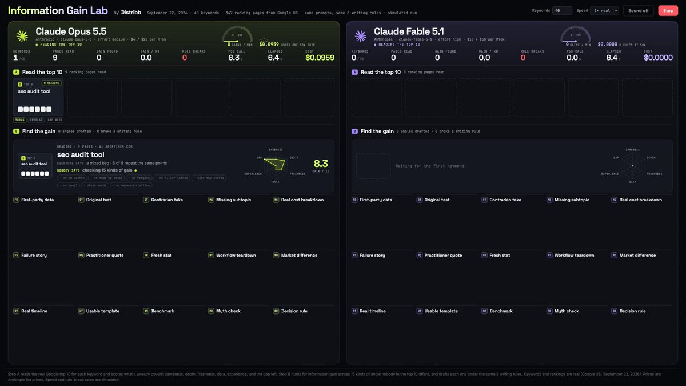</a> <a href="https://video.twimg.com/amplify_video/2102467411047763968/vid/avc1/1920x1080/InJdRf0w3jiN_Q6i.mp4?tag=29">Lire la vidéo source 1</a></td>
</tr>
</table>

Type: Evaluation | Date: 2026-09-22

---

### Cas 149: [Analyse du Black Friday avec Trendtrack MCP](https://x.com/powl_d/status/2102508882459586748) (par [@powl_d](https://x.com/powl_d))

**Tenez compte de l’accès aux données fourni par Trendtrack MCP pour évaluer cette méthode d’analyse du Black Friday.**

L’auteur demande à Opus 5.5 d’analyser ses BrandTrackers via Trendtrack MCP pour préparer le Black Friday et partage le résultat. La méthode dépend de l’intégration Trendtrack pour accéder aux données.

<table>
<tr>
<td><a href="https://x.com/powl_d/status/2102508882459586748">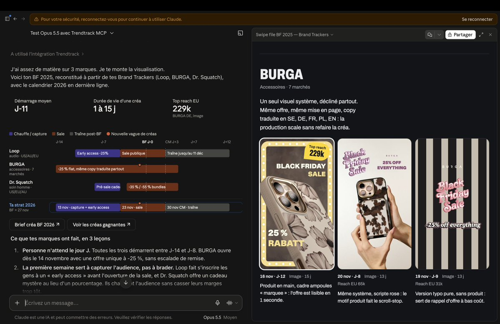</a> <a href="https://x.com/powl_d/status/2102508882459586748">Pièce jointe de la source 1</a></td>
</tr>
</table>

Type: Integration | Date: 2026-09-22

---

### Cas 150: [Des articles de blog reliés aux preuves dans alphaXiv](https://x.com/askalphaxiv/status/2102464761141346483) (par [@askalphaxiv](https://x.com/askalphaxiv))

**Vérifiez les preuves liées aux articles scientifiques avant de vous fier aux résumés de recherche générés automatiquement.**

alphaXiv présente une fonctionnalité qui transforme des articles arXiv en synthèses de type blog avec figures, points clés et explications, en affirmant que chaque assertion renvoie à une preuve surlignée dans l’article. C’est une démonstration de plateforme, sans vérification indépendante de chaque correspondance avec les preuves.

<table>
<tr>
<td><a href="https://video.twimg.com/amplify_video/2102464303865692160/vid/avc1/1920x1080/2k7r15kiseysNXtI.mp4?tag=29">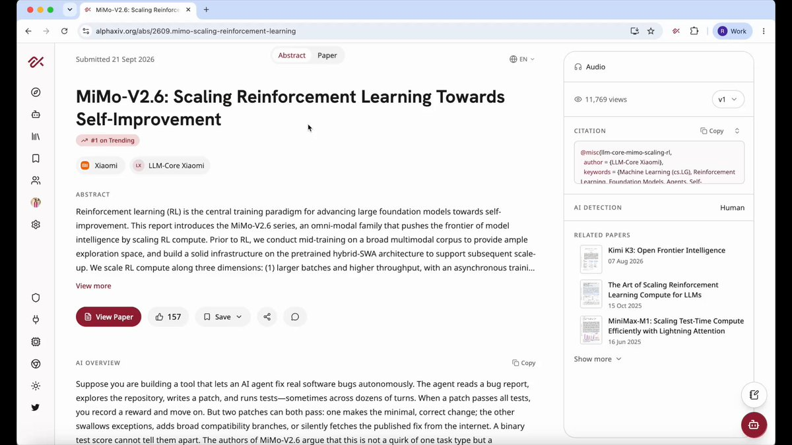</a> <a href="https://video.twimg.com/amplify_video/2102464303865692160/vid/avc1/1920x1080/2k7r15kiseysNXtI.mp4?tag=29">Lire la vidéo source 1</a></td>
</tr>
</table>

Type: Integration | Date: 2026-09-22

---

### Cas 151: [Tester la boucle de synthèse des risques de SafeForge](https://x.com/SafeForgeAI/status/2102511641812455651) (par [@SafeForgeAI](https://x.com/SafeForgeAI))

**Demandez les méthodes et les métriques d’évaluation avant de généraliser la préférence de SafeForge pour ce modèle.**

SafeForge présente des tests d’Opus 5.5 dans sa boucle de synthèse des risques et le qualifie de meilleur modèle testé par l’équipe. Il s’agit de l’appréciation de la plateforme ; la publication ne fournit ni méthode de comparaison complète ni métriques.

<table>
<tr>
<td><a href="https://video.twimg.com/amplify_video/2102511392284921856/vid/avc1/1920x1080/cB3HoPVJXOBUyRyc.mp4?tag=29">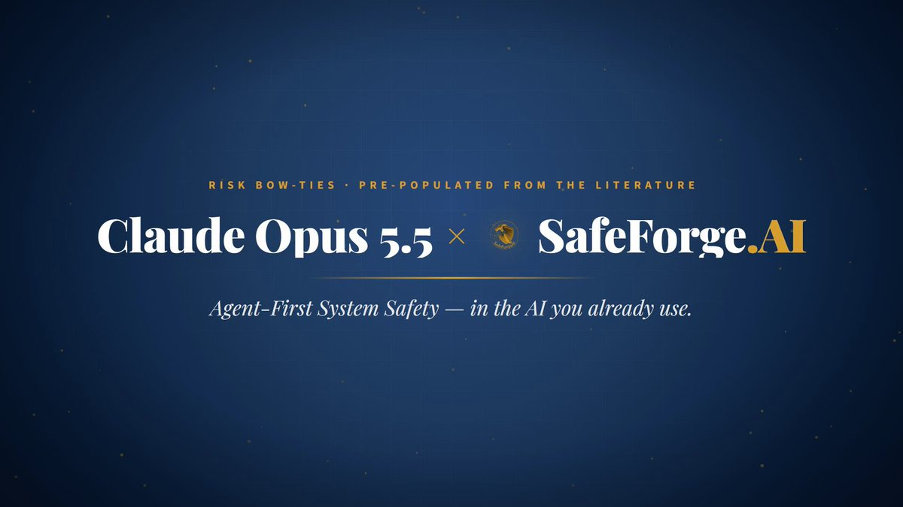</a> <a href="https://video.twimg.com/amplify_video/2102511392284921856/vid/avc1/1920x1080/cB3HoPVJXOBUyRyc.mp4?tag=29">Lire la vidéo source 1</a></td>
</tr>
</table>

Type: Evaluation | Date: 2026-09-22

---

### Cas 152: [Mettre à jour les données d’un modèle dans un graphique de benchmark](https://x.com/MLBear2/status/2102518758611058807) (par [@MLBear2](https://x.com/MLBear2))

**Distinguez la mise à jour d’un graphique de benchmark de la réexécution de l’évaluation sous-jacente.**

L’auteur demande à Opus 5.5 de remplacer les chiffres GPT-5.6 d’un graphique de benchmark existant par des données de la série GPT-6. Cela démontre la modification d’un graphique, pas la réexécution du benchmark sous-jacent.

<table>
<tr>
<td><a href="https://x.com/MLBear2/status/2102518758611058807">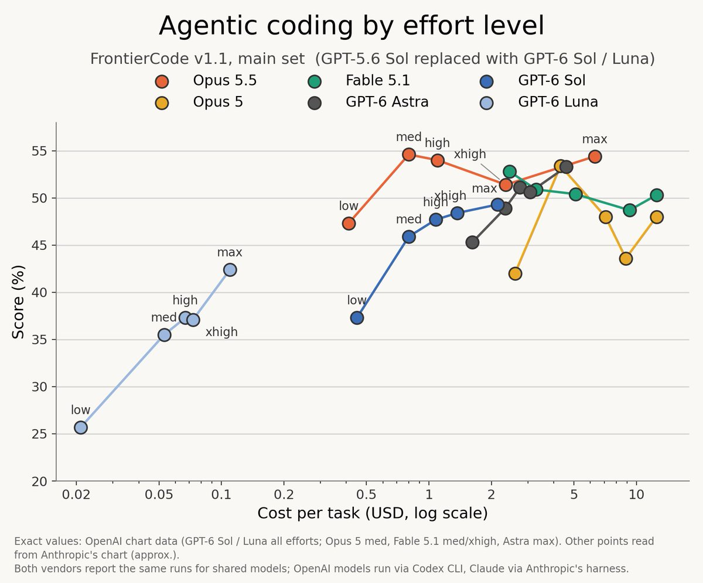</a> <a href="https://x.com/MLBear2/status/2102518758611058807">Pièce jointe de la source 1</a></td>
<td><a href="https://x.com/MLBear2/status/2102518758611058807">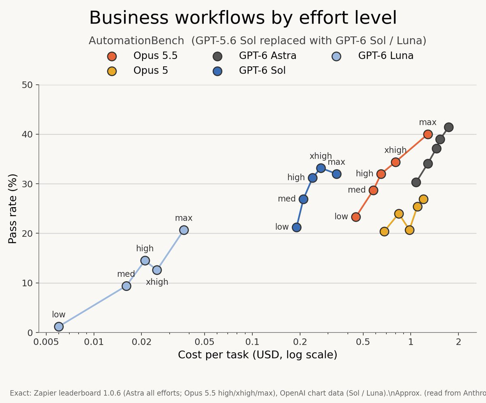</a> <a href="https://x.com/MLBear2/status/2102518758611058807">Pièce jointe de la source 2</a></td>
</tr>
</table>

Type: Demo | Date: 2026-09-22

---

### Cas 153: [Comparer la création d’indicateurs entre versions](https://x.com/Koke1024/status/2102478702856823131) (par [@Koke1024](https://x.com/Koke1024))

**Comparez les indicateurs obtenus en conservant l’incertitude sur leur méthode de validation non précisée.**

L’auteur utilise les mêmes instructions pour créer un indicateur avec Opus 5 et Opus 5.5, montre les deux résultats et juge meilleure la compréhension du modèle plus récent. Le type d’indicateur et la méthode de validation ne sont pas précisés.

<table>
<tr>
<td><a href="https://video.twimg.com/tweet_video/HS2AWprbYAA2fZM.mp4">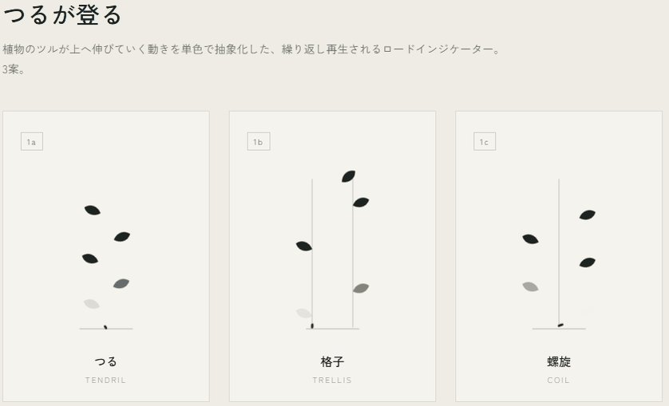</a> <a href="https://video.twimg.com/tweet_video/HS2AWprbYAA2fZM.mp4">Lire la vidéo source 1</a></td>
<td> <a href="https://video.twimg.com/tweet_video/HS2A31iaQAAoTSo.mp4">Lire la vidéo source 2</a></td>
</tr>
</table>

Type: Evaluation | Date: 2026-09-22

---

### Cas 154: [Une méthode de prospection depuis l’URL d’un site](https://x.com/pierreeliottlal/status/2102484586613649554) (par [@pierreeliottlal](https://x.com/pierreeliottlal))

**Distinguez la capacité d’envoi revendiquée par le produit des taux de réponse et résultats commerciaux non vérifiés.**

GojiberryAI présente une méthode allant de l’URL d’un site à la prospection, affirmant pouvoir contacter en quelques secondes des centaines de prospects à forte intention sur LinkedIn et par e-mail. La démonstration produit ne vérifie ni les taux de réponse ni les résultats commerciaux.

<table>
<tr>
<td> <a href="https://video.twimg.com/amplify_video/2102484142977912832/vid/avc1/1920x1080/nx4U1bH4pHeHSJPL.mp4?tag=29">Lire la vidéo source 1</a></td>
</tr>
</table>

Type: Integration | Date: 2026-09-22

---

### Cas 155: [L’évaluation de tâches comptables de Ramp](https://x.com/RampLabs/status/2102452290468602328) (par [@RampLabs](https://x.com/RampLabs))

**Limitez les gains de coût et de vitesse annoncés par Ramp à son exécution d’Accounting Bench.**

Ramp déclare un accès anticipé et une exécution sur son Accounting Bench. L’équipe annonce des performances proches de Fable 5.1 pour un coût réduit de 61% et une vitesse de 1.7× ; cela n’établit pas les mêmes gains pour tous les travaux comptables.

<table>
<tr>
<td> <a href="https://video.twimg.com/amplify_video/2102451438685147136/vid/avc1/1920x1080/L_8bTlIp6I26lNOA.mp4?tag=29">Lire la vidéo source 1</a></td>
</tr>
</table>

Type: Evaluation | Date: 2026-09-22

---

## 🧩 Agents et méthodes de développement

### Cas 156: [Une équipe de plusieurs modèles avec fable-advisor](https://x.com/daniel_mac8/status/2102513786016186672) (par [@daniel_mac8](https://x.com/daniel_mac8))

**Examinez les rôles des modèles du plugin open source avant d’adopter son fonctionnement en équipe collaborative.**

L’auteur du plugin publie fable-advisor v6.0.0, un plugin Claude Code gratuit et open source associant Opus 5.5, Fable 5.1, GPT-6 Sol et Luna en équipe collaborative. Il s’agit de la publication de sa propre méthode de travail.

<table>
<tr>
<td><a href="https://video.twimg.com/amplify_video/2102513660312576000/vid/avc1/1920x1080/5tx7z_kvB7V8VB1G.mp4?tag=29">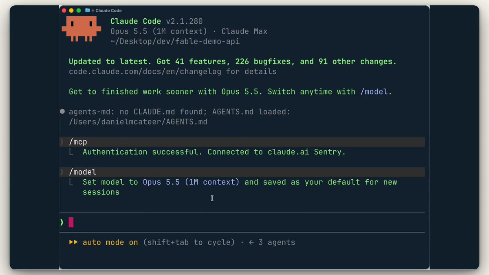</a> <a href="https://video.twimg.com/amplify_video/2102513660312576000/vid/avc1/1920x1080/5tx7z_kvB7V8VB1G.mp4?tag=29">Lire la vidéo source 1</a></td>
</tr>
</table>

Type: Integration | Date: 2026-09-22

---

### Cas 157: [Passation de tâches et remplacement des agents dans ntm](https://x.com/doodlestein/status/2102486504627175458) (par [@doodlestein](https://x.com/doodlestein))

**Utilisez une passation explicite pour remplacer des agents de versions différentes dans un outil d’orchestration.**

L’auteur de ntm rapporte avoir demandé à Opus 5 de rédiger une consigne de passation, puis à Opus 5.5 d’arrêter et de redémarrer les anciens agents. Il s’agit d’une méthode de migration de modèle autodéclarée dans son propre outil d’orchestration.

<table>
<tr>
<td><a href="https://x.com/doodlestein/status/2102486504627175458">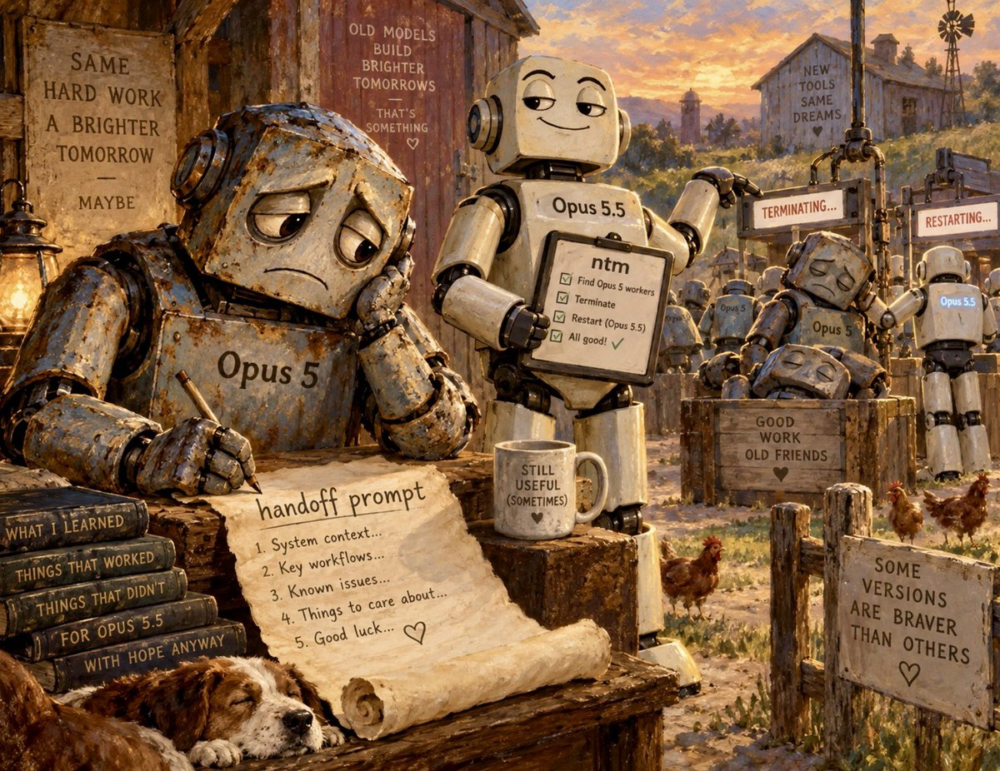</a> <a href="https://x.com/doodlestein/status/2102486504627175458">Pièce jointe de la source 1</a></td>
</tr>
</table>

Type: Integration | Date: 2026-09-22

---

### Cas 158: [Piloter des agents depuis l’Apple Watch](https://x.com/AlexFinn/status/2102523960294621655) (par [@AlexFinn](https://x.com/AlexFinn))

**Examinez l’affichage des agents et les commandes dictées de l’application de montre séparément des spéculations de l’auteur sur la RSI.**

L’auteur affirme qu’une heure d’exploration a produit une application Apple Watch affichant les agents Herdr au travail et acceptant des commandes dictées. Il s’agit d’un résultat applicatif rapporté ; les spéculations distinctes sur la RSI dans la publication ne sont pas des faits établis.

Type: Demo | Date: 2026-09-22

---

### Cas 159: [Conserver le cache de consigne en changeant d’effort](https://x.com/lydiahallie/status/2102513987699212344) (par [@lydiahallie](https://x.com/lydiahallie))

**Conservez la condition de version de Claude Code indiquée pour appliquer le changement d’effort préservant le cache.**

Un membre de l’équipe Claude Code explique que changer le niveau d’effort d’Opus 5.5 en cours de session préserve le cache de consigne dans Claude Code v2.1.280 ou ultérieur. Cette indication est propre à cet outil et à cette plage de versions.

Type: Tutorial | Date: 2026-09-22

---

### Cas 160: [Actualiser le cache des modèles de T3 Code](https://x.com/jullerino/status/2102465804906467769) (par [@jullerino](https://x.com/jullerino))

**Suivez la procédure d’actualisation du cache de l’équipe T3 Code lorsque le modèle attendu manque dans la liste.**

L’équipe T3 Code indique qu’aucune mise à jour de l’application n’est nécessaire et explique comment forcer l’actualisation de la liste : fermer l’application, vider les caches de manifestes de modèles indiqués, puis redémarrer. Il s’agit de consignes de maintenance d’intégration.

<table>
<tr>
<td><a href="https://x.com/jullerino/status/2102465804906467769">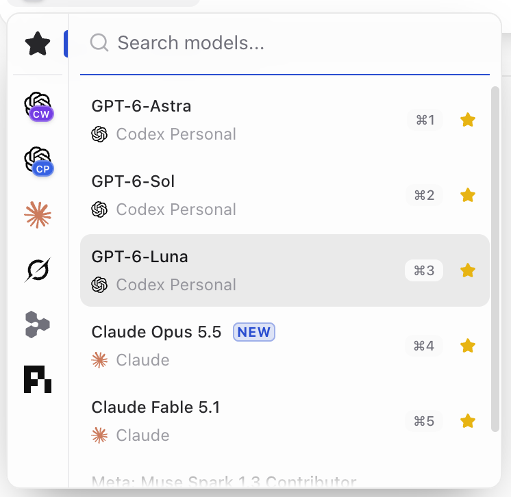</a> <a href="https://x.com/jullerino/status/2102465804906467769">Pièce jointe de la source 1</a></td>
</tr>
</table>

Type: Tutorial | Date: 2026-09-22

---

### Cas 161: [Examiner les fichiers du projet et l’historique des sessions d’agents](https://x.com/shannholmberg/status/2102481940742115352) (par [@shannholmberg](https://x.com/shannholmberg))

**Confrontez les tendances de l’historique des sessions au code actuel avant d’en tirer des améliorations du projet.**

Un tutoriel en six étapes associe fichiers du projet et sessions locales pour repérer corrections et échecs répétés, vérifier le code actuel, examiner un plan, tester les changements et enregistrer les améliorations. Il fournit une consigne, pas un compte rendu d’implémentation vérifiée.

<table>
<tr>
<td><a href="https://x.com/shannholmberg/status/2102481940742115352">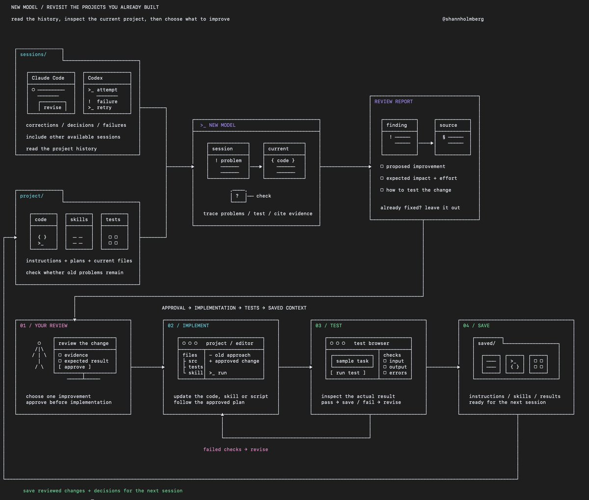</a> <a href="https://x.com/shannholmberg/status/2102481940742115352">Pièce jointe de la source 1</a></td>
</tr>
</table>

Type: Tutorial | Date: 2026-09-22

---

### Cas 162: [Vitesse des systèmes multi-agents sur ProgramBench](https://x.com/jyangballin/status/2102481432136528139) (par [@jyangballin](https://x.com/jyangballin))

**Conservez la couverture de 166 tâches sur 200 pour interpréter la comparaison de vitesse multi-agents annoncée.**

L’auteur discute des résultats de la fiche système selon lesquels plusieurs agents atteignent des résultats similaires à un agent unique plus rapidement, tout en notant que seules 166 des 200 tâches ProgramBench ont été utilisées. Cette limite de couverture compte.

<table>
<tr>
<td><a href="https://x.com/jyangballin/status/2102481432136528139">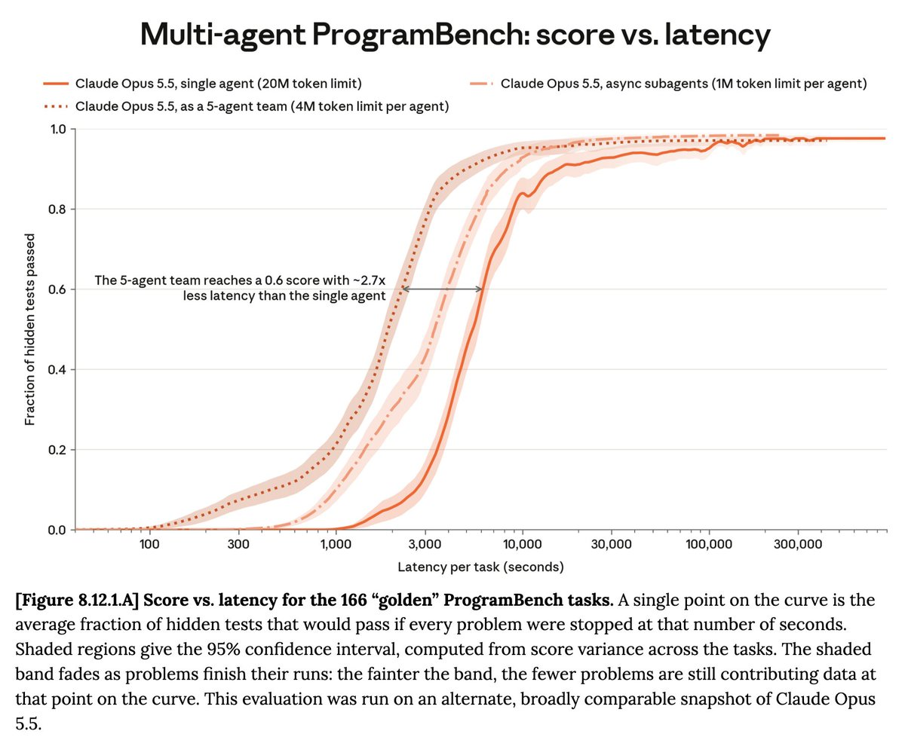</a> <a href="https://x.com/jyangballin/status/2102481432136528139">Pièce jointe de la source 1</a></td>
</tr>
</table>

Type: Evaluation | Date: 2026-09-22

---

### Cas 163: [Une évaluation ProgramBench avec 100 agents](https://x.com/18jeffreyma/status/2102454667167047973) (par [@18jeffreyma](https://x.com/18jeffreyma))

**Distinguez l’évaluation du benchmark à 100 agents des futurs mécanismes de coordination spéculatifs.**

Un contributeur de ProgramBench souligne une évaluation de la fiche du modèle portant sur 100 agents se coordonnant sur le benchmark. L’ensemble de tâches et l’échelle sont concrets ; la discussion des mécanismes futurs de concurrence reste spéculative.

<table>
<tr>
<td><a href="https://x.com/18jeffreyma/status/2102454667167047973">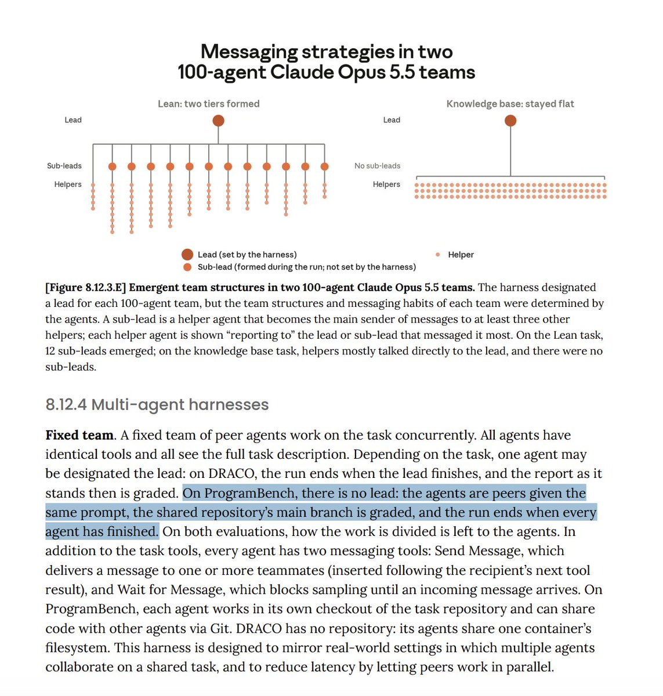</a> <a href="https://x.com/18jeffreyma/status/2102454667167047973">Pièce jointe de la source 1</a></td>
</tr>
</table>

Type: Evaluation | Date: 2026-09-22

---

## 🧩 Compréhension visuelle et annotation

### Cas 164: [Suivi d’étiquettes dans la même vidéo de rue](https://x.com/higgsfield_ai/status/2102510221797339567) (par [@higgsfield_ai](https://x.com/higgsfield_ai))

**Examinez les étiquettes en mouvement sans considérer leur précision comme mesurée dans cette comparaison de plateforme.**

Higgsfield compare Opus 5.5 et GPT-6 Astra sur la même vidéo de rue, avec des annotations suivant personnes, bâtiments et objets au mouvement de la caméra. Cette comparaison de plateforme ne fournit aucune mesure de précision des étiquettes.

<table>
<tr>
<td><a href="https://video.twimg.com/amplify_video/2102509920876994560/vid/avc1/1080x1214/AxevMDaSTO83n2J1.mp4?tag=29">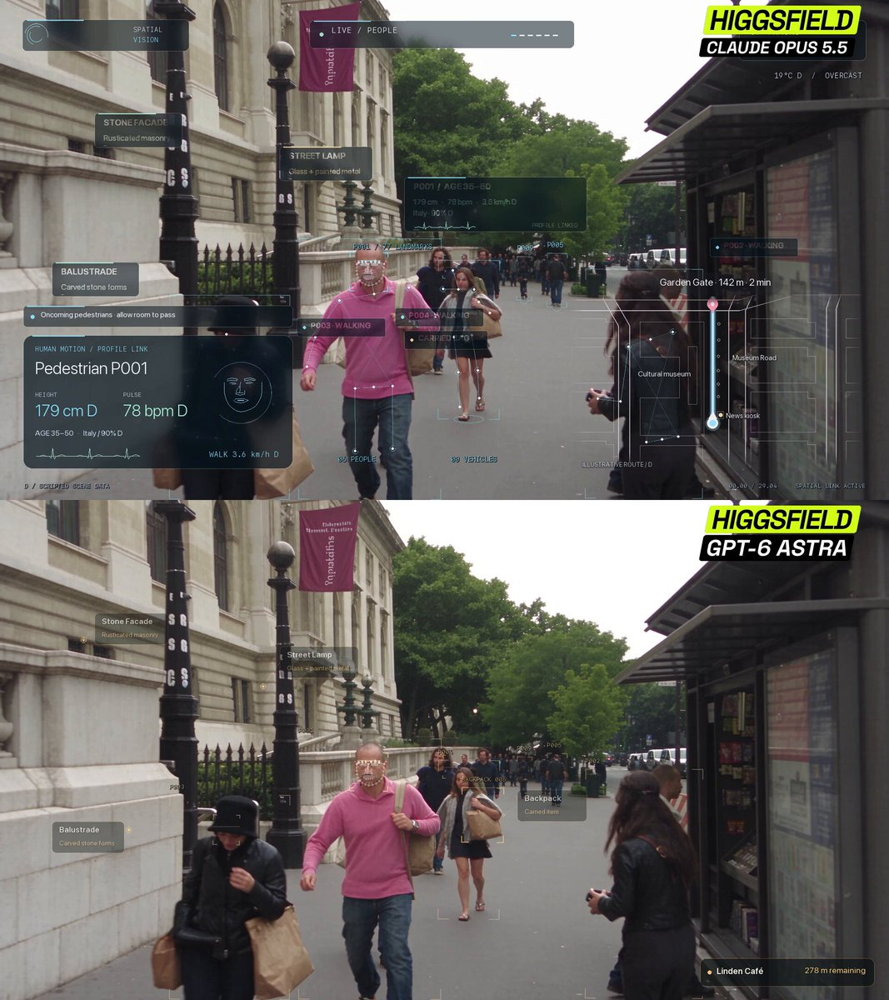</a> <a href="https://video.twimg.com/amplify_video/2102509920876994560/vid/avc1/1080x1214/AxevMDaSTO83n2J1.mp4?tag=29">Lire la vidéo source 1</a></td>
</tr>
</table>

Type: Evaluation | Date: 2026-09-22

---

### Cas 165: [Évaluations de détection d’objets Roboflow](https://x.com/skalskip92/status/2102513518603804956) (par [@skalskip92](https://x.com/skalskip92))

**Utilisez le classement Roboflow pour évaluer la détection d’objets dans le périmètre propre à cette tâche.**

Un responsable Roboflow partage les résultats Playground de détection d’objets pour Opus 5.5, Sol et Luna et renvoie au classement dédié. Les classements annoncés concernent cette tâche visuelle, pas toutes les capacités de vision.

<table>
<tr>
<td><a href="https://x.com/skalskip92/status/2102513518603804956">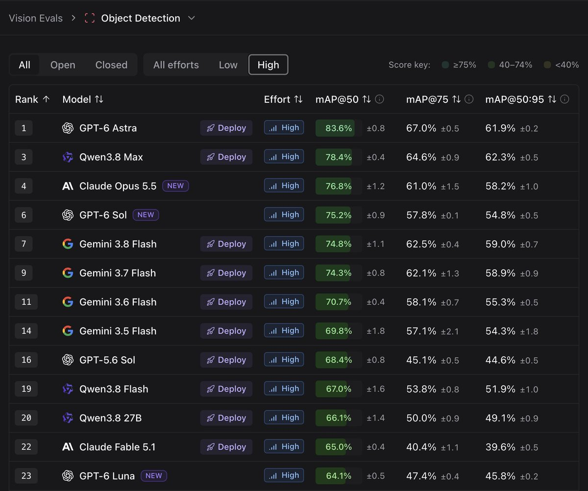</a> <a href="https://x.com/skalskip92/status/2102513518603804956">Pièce jointe de la source 1</a></td>
</tr>
</table>

Type: Evaluation | Date: 2026-09-22

---

## 🧩 Montage et production vidéo

### Cas 166: [Comparer les méthodes Seedance 2.5 dans Medeo](https://x.com/Medeo_AI/status/2102463091959288264) (par [@Medeo_AI](https://x.com/Medeo_AI))

**Attribuez la génération vidéo à Seedance 2.5 lorsque vous comparez les modèles de langage qui le pilotent.**

Medeo compare des vidéos réalisées avec GPT-6 Sol et Opus 5.5 pilotant Seedance 2.5, en s’intéressant à la compréhension des scènes et aux détails. C’est une méthode d’orchestration par modèle de langage ; Seedance 2.5 effectue la génération vidéo.

<table>
<tr>
<td><a href="https://video.twimg.com/amplify_video/2102462545898651648/vid/avc1/1920x1080/jolN96b6AOkt5meq.mp4?tag=29">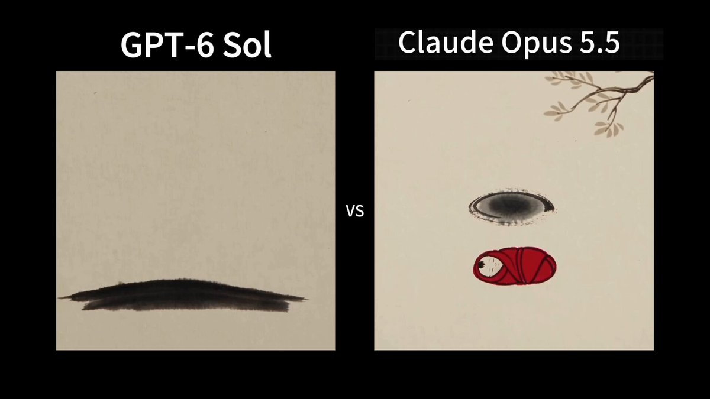</a> <a href="https://video.twimg.com/amplify_video/2102462545898651648/vid/avc1/1920x1080/jolN96b6AOkt5meq.mp4?tag=29">Lire la vidéo source 1</a></td>
</tr>
</table>

Type: Evaluation | Date: 2026-09-22

---

### Cas 167: [Réaliser une animation en pâte à modeler avec Blender dans Claude](https://x.com/alexalbert__/status/2102458348511879448) (par [@alexalbert__](https://x.com/alexalbert__))

**Tenez compte de Blender pour évaluer la réalisation d’une animation en pâte à modeler avec une seule consigne dans Claude.**

Un auteur affilié à une plateforme montre l’utilisation de Blender depuis claude.ai pour réaliser une animation en pâte à modeler avec une seule consigne. Cette méthode d’animation dépend de Blender, et non d’une génération vidéo directe par le modèle de langage.

<table>
<tr>
<td><a href="https://video.twimg.com/amplify_video/2102457816820916224/vid/avc1/1612x1080/pdOJXL6ne_LOROg3.mp4?tag=29">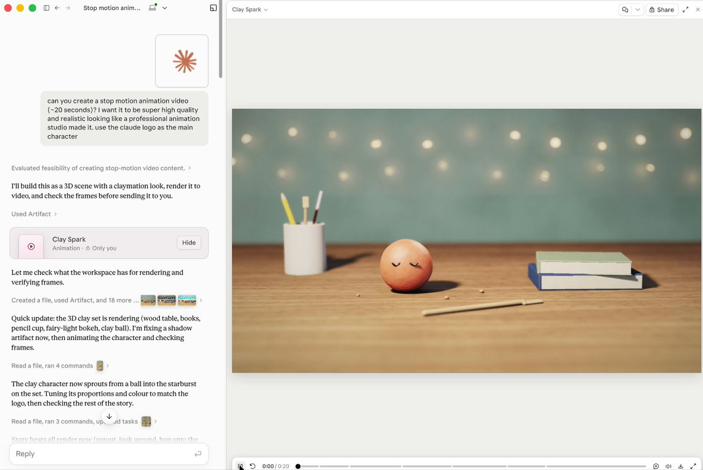</a> <a href="https://video.twimg.com/amplify_video/2102457816820916224/vid/avc1/1612x1080/pdOJXL6ne_LOROg3.mp4?tag=29">Lire la vidéo source 1</a></td>
</tr>
</table>

Type: Integration | Date: 2026-09-22

---

### Cas 168: [Comparer des recréations de vidéo de lancement dans Tesseract](https://x.com/trymirage/status/2102502794003677373) (par [@trymirage](https://x.com/trymirage))

**Comparez les recréations de vidéo de lancement en explicitant le rôle de Tesseract dans le montage et le rendu.**

L’équipe Tesseract associe Opus 5.5 et GPT-6 Astra à son propre outil vidéo pour recréer sa vidéo de lancement et comparer les coûts. Tesseract apporte les capacités de montage et de rendu.

<table>
<tr>
<td><a href="https://video.twimg.com/amplify_video/2102502084847214593/vid/avc1/1080x1350/AhutbNmQCpo4GAVF.mp4?tag=29">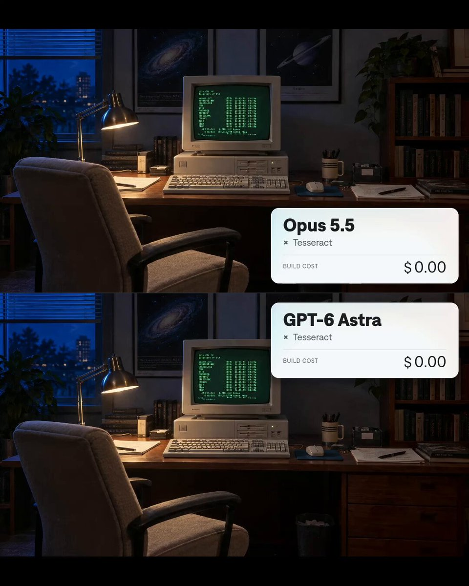</a> <a href="https://video.twimg.com/amplify_video/2102502084847214593/vid/avc1/1080x1350/AhutbNmQCpo4GAVF.mp4?tag=29">Lire la vidéo source 1</a></td>
</tr>
</table>

Type: Evaluation | Date: 2026-09-22

---

### Cas 169: [Une vidéo de présentation pour DocJev](https://x.com/jerryjliu0/status/2102479924032577686) (par [@jerryjliu0](https://x.com/jerryjliu0))

**Distinguez la vidéo de présentation produit du noyau de traitement documentaire attribué à Jev.**

L’auteur de DocJev présente une vidéo de présentation produit réalisée avec Opus 5.5. La publication attribue le noyau de classification et de découpage des documents à la chaîne d’outils Jev ; créer la vidéo ne prouve pas qu’Opus ait construit ce noyau.

<table>
<tr>
<td><a href="https://video.twimg.com/amplify_video/2102479606909636608/vid/avc1/1920x1080/5gQCdFvu4lD6i8Jc.mp4?tag=29">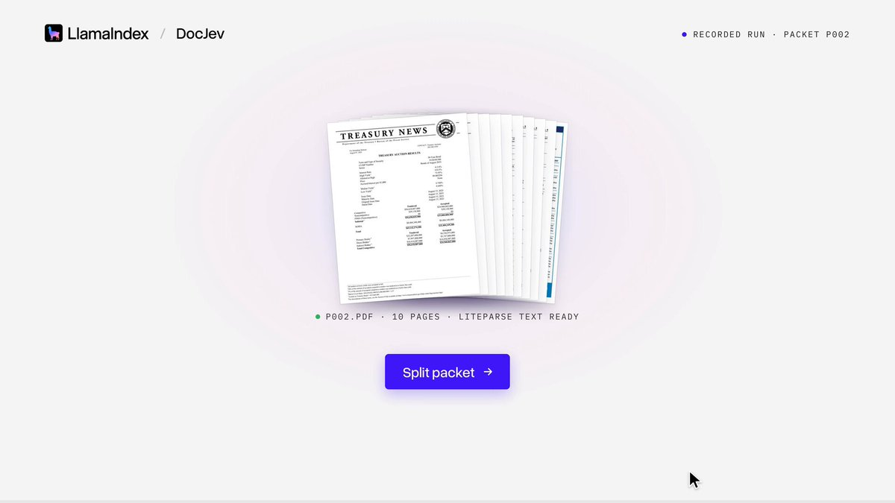</a> <a href="https://video.twimg.com/amplify_video/2102479606909636608/vid/avc1/1920x1080/5gQCdFvu4lD6i8Jc.mp4?tag=29">Lire la vidéo source 1</a></td>
</tr>
</table>

Type: Demo | Date: 2026-09-22

---

### Cas 170: [Un historique des modèles Claude avec un skill personnalisé](https://x.com/superalesha/status/2102463796149440888) (par [@superalesha](https://x.com/superalesha))

**Tenez compte du skill personnalisé de l’auteur pour évaluer la vidéo JavaScript sur l’historique des modèles.**

L’auteur demande à Opus 5.5 de réaliser un historique du développement des modèles Claude et indique l’avoir produit entièrement en JavaScript avec son propre skill. Ce skill personnalisé fait partie de la méthode.

<table>
<tr>
<td><a href="https://video.twimg.com/amplify_video/2102463260083814400/vid/avc1/1920x1080/pg3IA2gaSf3rm2K4.mp4?tag=29">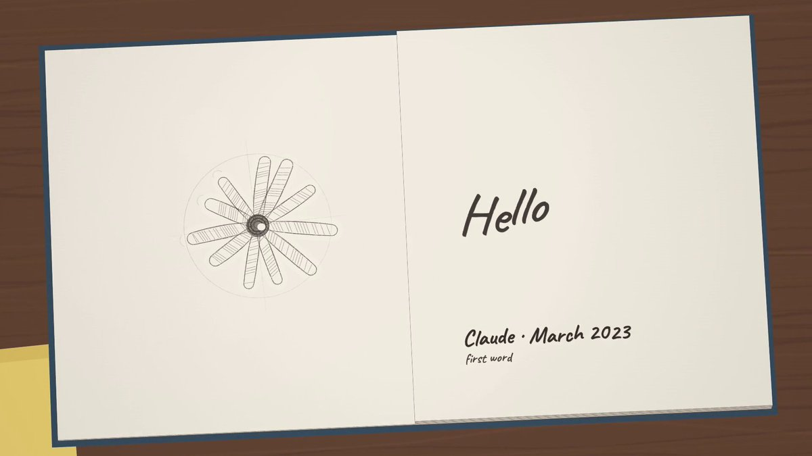</a> <a href="https://video.twimg.com/amplify_video/2102463260083814400/vid/avc1/1920x1080/pg3IA2gaSf3rm2K4.mp4?tag=29">Lire la vidéo source 1</a></td>
</tr>
</table>

Type: Integration | Date: 2026-09-22

---

### Cas 171: [Des vidéos de tigre en origami dans Medeo](https://x.com/Medeo_AI/status/2102454246113202532) (par [@Medeo_AI](https://x.com/Medeo_AI))

**Comparez les méthodes de vidéo d’origami comme un pilotage de Seedance 2.5 par des modèles de langage.**

Medeo compare des vidéos de tigre en origami réalisées avec Opus 5.5 et GPT-6 Astra, Seedance 2.5 générant la vidéo dans les deux cas. Cette présentation concerne des modèles de langage pilotant un outil vidéo, pas une génération vidéo native d’Opus.

<table>
<tr>
<td><a href="https://video.twimg.com/amplify_video/2102453529268916224/vid/avc1/1080x1920/uyyJj1GtKe23qKp7.mp4?tag=29">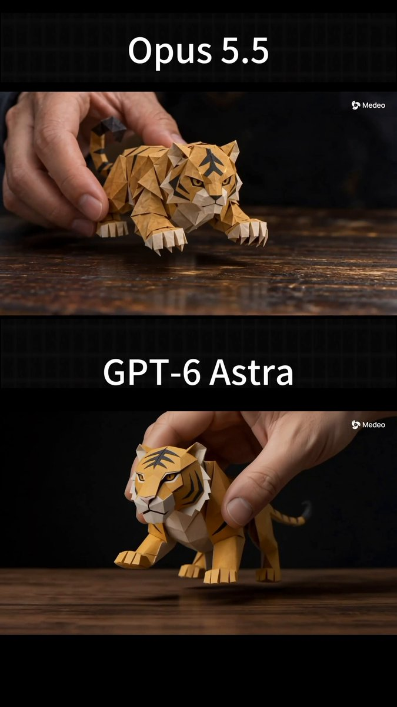</a> <a href="https://video.twimg.com/amplify_video/2102453529268916224/vid/avc1/1080x1920/uyyJj1GtKe23qKp7.mp4?tag=29">Lire la vidéo source 1</a></td>
</tr>
</table>

Type: Evaluation | Date: 2026-09-22

---

### Cas 172: [Une publicité de sweat BridgeMind avec Remotion](https://x.com/bridgemindai/status/2102462889160286423) (par [@bridgemindai](https://x.com/bridgemindai))

**Examinez le rythme et les transitions de la publicité Remotion séparément du classement subjectif des modèles par son éditeur.**

BridgeMind présente une vidéo de lancement de sweat réalisée avec Opus 5.5 et Remotion. L’éditeur en préfère les transitions, le rythme et l’identité de marque aux résultats antérieurs de Fable 5.1 et GPT-6 Astra ; c’est une comparaison subjective dans une présentation autopromotionnelle.

<table>
<tr>
<td> <a href="https://video.twimg.com/amplify_video/2102462683245395968/vid/avc1/1920x1080/t7Y-1-9qzNJG68xK.mp4?tag=29">Lire la vidéo source 1</a></td>
</tr>
</table>

Type: Integration | Date: 2026-09-22

---

### Cas 173: [Durée et coût d’un film publicitaire Higgsfield](https://x.com/higgsfield_ai/status/2102462973872869803) (par [@higgsfield_ai](https://x.com/higgsfield_ai))

**Traitez la comparaison de durée et de coût du film publicitaire comme des données de production déclarées par la plateforme.**

Higgsfield compare la production de films publicitaires et annonce 60 minutes et $50 pour Opus 5.5, contre 82 minutes et $97 pour GPT-6 Astra. Ces chiffres proviennent de la présentation de production de la plateforme elle-même.

<table>
<tr>
<td><a href="https://video.twimg.com/amplify_video/2102462871104077824/vid/avc1/1440x1080/hm7aglnaoiLS8wmr.mp4?tag=29">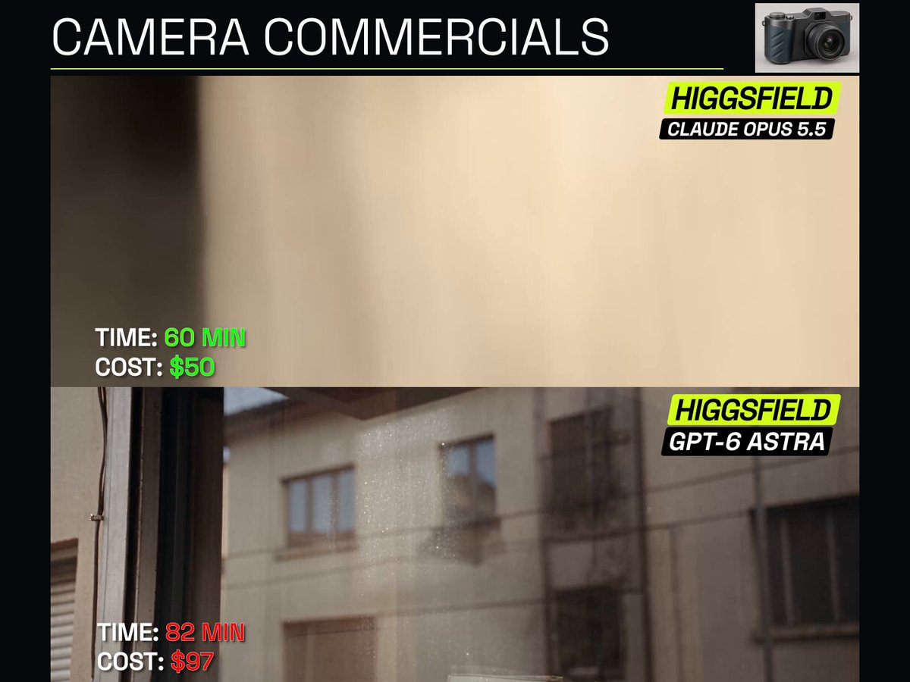</a> <a href="https://video.twimg.com/amplify_video/2102462871104077824/vid/avc1/1440x1080/hm7aglnaoiLS8wmr.mp4?tag=29">Lire la vidéo source 1</a></td>
</tr>
</table>

Type: Evaluation | Date: 2026-09-22

---

### Cas 174: [Une vidéo de lancement codée à partir d’une annonce](https://x.com/chetaslua/status/2102457403119985005) (par [@chetaslua](https://x.com/chetaslua))

**Envisagez une publication d’annonce comme brief d’une vidéo de lancement aux visuels et sons créés par le code.**

L’auteur fournit la publication d’annonce originale et demande à Opus 5.5 de coder une vidéo de lancement en JavaScript, en indiquant que musique, sons et images ont tous été réalisés par le code, sans ressources externes.

<table>
<tr>
<td><a href="https://video.twimg.com/amplify_video/2102457146210496512/vid/avc1/1920x1080/NQpCnFwIPnJ2aS_D.mp4?tag=29">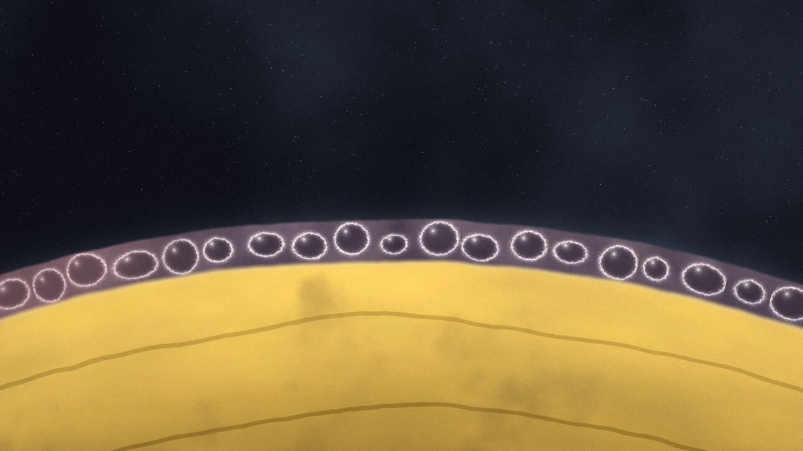</a> <a href="https://video.twimg.com/amplify_video/2102457146210496512/vid/avc1/1920x1080/NQpCnFwIPnJ2aS_D.mp4?tag=29">Lire la vidéo source 1</a></td>
</tr>
</table>

Type: Demo | Date: 2026-09-22

---

### Cas 175: [Une vision en stop motion à travers les yeux de Claude, relayée](https://x.com/satori_sz9/status/2102451599633494357) (par [@satori_sz9](https://x.com/satori_sz9))

**Traitez ce film en stop motion partagé comme une présentation de seconde main dont la chaîne d’outils n’est pas précisée.**

La publication partage une animation en stop motion sur une vision du monde à travers les yeux de Claude et affirme qu’Opus 5.5 y a tout réalisé. Il s’agit d’une présentation de seconde main sans chaîne d’outils précisée.

<table>
<tr>
<td> <a href="https://video.twimg.com/amplify_video/2102435379810885632/vid/avc1/1920x1080/UI5hS2e010VQ1Mz-.mp4?tag=29">Lire la vidéo source 1</a></td>
</tr>
</table>

Sources complémentaires / comptes rendus regroupés: [@cheatyyyy](https://x.com/cheatyyyy/status/2102451608445743173)

Type: Demo | Date: 2026-09-22

---

### Cas 176: [Faire évoluer une vidéo musicale de deux à 22 secondes](https://x.com/dhruvalgolakiya/status/2102484620109644273) (par [@dhruvalgolakiya](https://x.com/dhruvalgolakiya))

**Comparez les versions successives pour examiner l’évolution de la durée et de la musique codée.**

L’auteur montre trois versions prolongeant une vidéo de deux secondes à 17, puis 22 secondes, et rapporte avoir également utilisé Opus 5.5 pour en coder la musique.

<table>
<tr>
<td><a href="https://video.twimg.com/amplify_video/2102484213086011392/vid/avc1/1280x720/Aex4aiDf_9SMKio-.mp4?tag=29">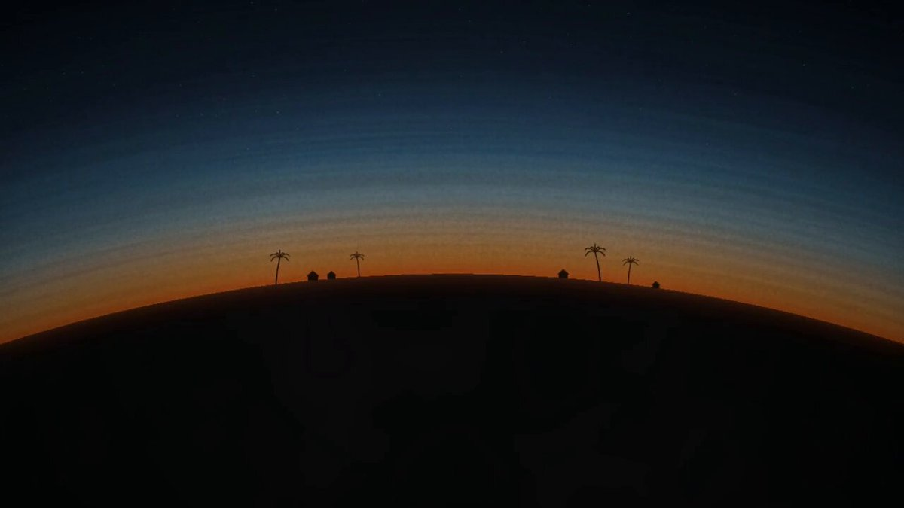</a> <a href="https://video.twimg.com/amplify_video/2102484213086011392/vid/avc1/1280x720/Aex4aiDf_9SMKio-.mp4?tag=29">Lire la vidéo source 1</a></td>
</tr>
</table>

Type: Demo | Date: 2026-09-22

---

### Cas 177: [Corriger des défauts vidéo avec Photoshop et Fusion](https://x.com/higgsfield_ai/status/2102495495717527711) (par [@higgsfield_ai](https://x.com/higgsfield_ai))

**Examinez les corrections Photoshop et Fusion sans supposer que le gain de temps annoncé a été vérifié indépendamment.**

Higgsfield présente Opus 5.5 utilisant Photoshop et DaVinci Resolve Fusion pour réparer des erreurs de rendu dans une vidéo générée par IA. La plateforme annonce quelques minutes au lieu de plusieurs heures de travail manuel ; ce gain de temps n’a pas été vérifié indépendamment.

<table>
<tr>
<td><a href="https://video.twimg.com/amplify_video/2102494820774363136/vid/avc1/1440x1080/jFAAPDTN7AKgd7Nw.mp4?tag=29">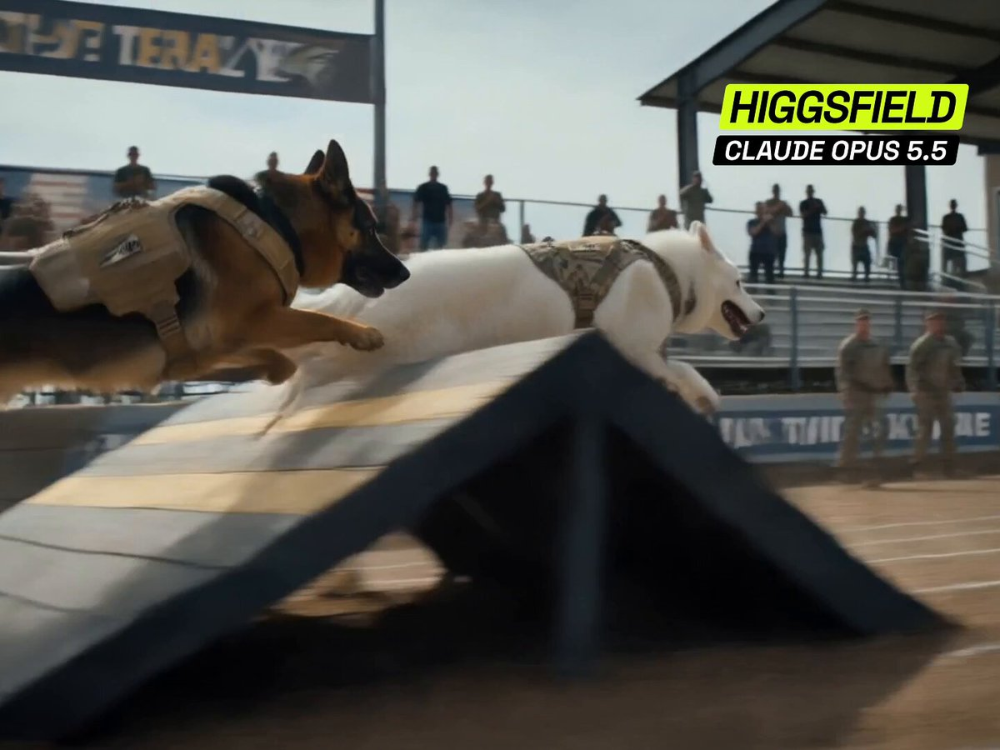</a> <a href="https://video.twimg.com/amplify_video/2102494820774363136/vid/avc1/1440x1080/jFAAPDTN7AKgd7Nw.mp4?tag=29">Lire la vidéo source 1</a></td>
</tr>
</table>

Type: Integration | Date: 2026-09-22

---

### Cas 178: [Une publicité Kotlin à partir de son site web](https://x.com/jetbrains/status/2102459650125754812) (par [@jetbrains](https://x.com/jetbrains))

**Tenez compte des skills HyperFrames pour évaluer la réalisation de cette publicité Kotlin à partir du site web.**

JetBrains montre un membre de son équipe fournissant à Opus 5.5 les skills HyperFrames de HeyGen et le dirigeant vers le site Kotlin pour créer une publicité. La méthode de production dépend de ces skills.

<table>
<tr>
<td> <a href="https://video.twimg.com/amplify_video/2102459599177805825/vid/avc1/2560x1440/GuU5uKX8BRoP6VNe.mp4?tag=29">Lire la vidéo source 1</a></td>
</tr>
</table>

Type: Integration | Date: 2026-09-22

---

### Cas 179: [Monter des rushes selon un style personnel](https://x.com/gabrielbuzziv/status/2102488620326420707) (par [@gabrielbuzziv](https://x.com/gabrielbuzziv))

**Fournissez une vidéo de référence et vérifiez directement le montage lorsque vous demandez de reproduire un style personnel.**

L’auteur fournit des rushes contenant des erreurs d’enregistrement et un exemple de référence, et rapporte qu’une seule consigne a permis à Opus 5.5 de les monter dans son style habituel. Cette correspondance de style relève de son appréciation, et la méthode comprend une vidéo de référence.

<table>
<tr>
<td> <a href="https://x.com/gabrielbuzziv/status/2102488620326420707">Pièce jointe de la source 1</a></td>
<td> <a href="https://video.twimg.com/amplify_video/2102488072772296704/vid/avc1/1080x1920/IexL67HU9NRTtw9v.mp4?tag=29">Lire la vidéo source 2</a></td>
</tr>
</table>

Type: Demo | Date: 2026-09-22

---

### Cas 180: [Transformer un article Coinacademy en vidéo FLOP Labs](https://x.com/Capetlevrai/status/2102500362750247199) (par [@Capetlevrai](https://x.com/Capetlevrai))

**Utilisez un article existant comme brief source pour une courte vidéo de présentation.**

L’auteur utilise son article Coinacademy en entrée et rapporte avoir créé une vidéo de présentation de FLOP Labs avec Opus 5.5 en deux consignes.

<table>
<tr>
<td> <a href="https://video.twimg.com/amplify_video/2102500233066475520/vid/avc1/1920x1080/d_2ppJAb99CGBKqx.mp4?tag=29">Lire la vidéo source 1</a></td>
</tr>
</table>

Type: Demo | Date: 2026-09-22

---

### Cas 181: [Des vidéos comparées à GPT-6 Sol](https://x.com/matiass/status/2102475205193138467) (par [@matiass](https://x.com/matiass))

**Comparez les vidéos montrées sans supposer une consigne ou une chaîne de production commune.**

L’auteur juxtapose des vidéos attribuées à GPT-6 Sol et à Opus 5.5, sans préciser dans la publication la consigne, les scripts ou la chaîne de production.

<table>
<tr>
<td><a href="https://video.twimg.com/amplify_video/2102475075358179329/vid/avc1/768x1120/pkoQyt8wniSAoYu0.mp4?tag=29">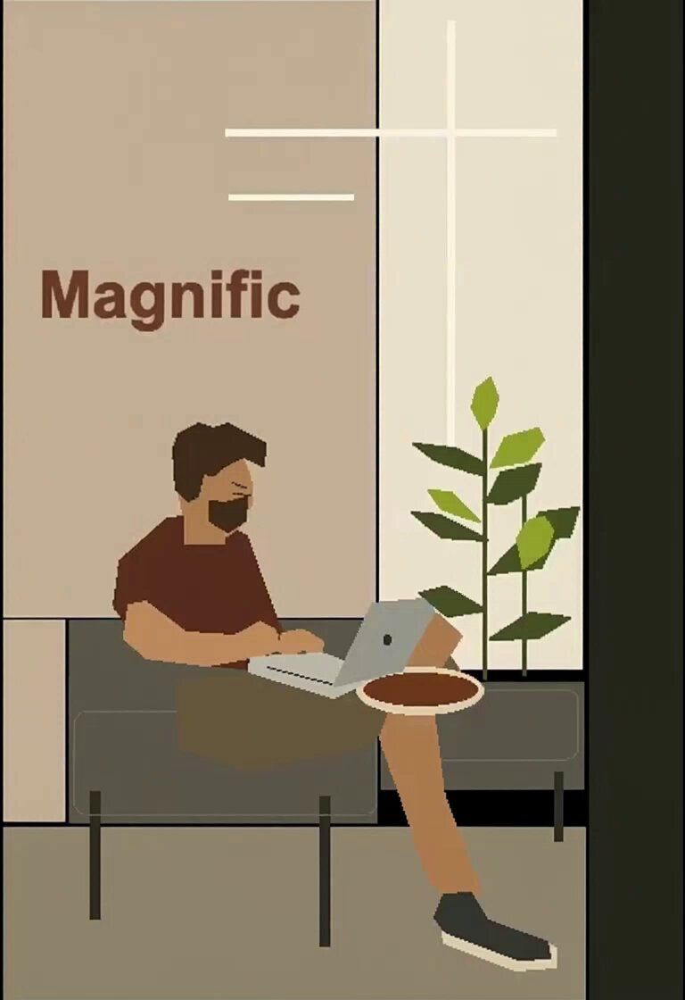</a> <a href="https://video.twimg.com/amplify_video/2102475075358179329/vid/avc1/768x1120/pkoQyt8wniSAoYu0.mp4?tag=29">Lire la vidéo source 1</a></td>
<td><a href="https://video.twimg.com/amplify_video/2102475125475975170/vid/avc1/768x1152/ENQGTaDMF6hIc--N.mp4?tag=29">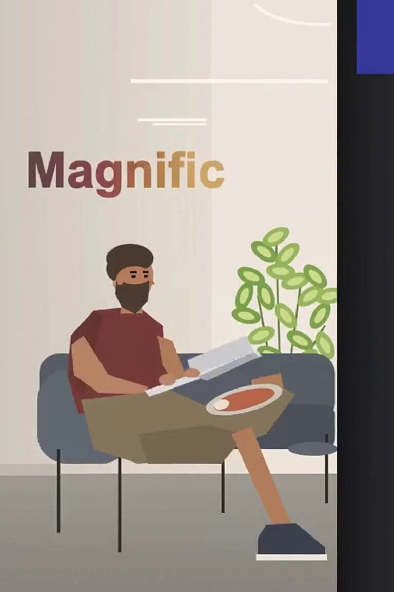</a> <a href="https://video.twimg.com/amplify_video/2102475125475975170/vid/avc1/768x1152/ENQGTaDMF6hIc--N.mp4?tag=29">Lire la vidéo source 2</a></td>
</tr>
</table>

Type: Evaluation | Date: 2026-09-22

---

### Cas 182: [Une vidéo promotionnelle codée pour serai](https://x.com/Avenoxai/status/2102502158310756397) (par [@Avenoxai](https://x.com/Avenoxai))

**Examinez la publicité codée pour serai tout en laissant non résolue la question de ses outils de rendu non précisés.**

L’auteur demande à Opus 5.5 de créer par le code une vidéo promotionnelle pour serai et partage le résultat. La publication ne précise pas les outils de montage ou de rendu.

<table>
<tr>
<td><a href="https://video.twimg.com/amplify_video/2102502065096290305/vid/avc1/1920x1080/yGFbK0Ul1CDLkqtk.mp4?tag=29">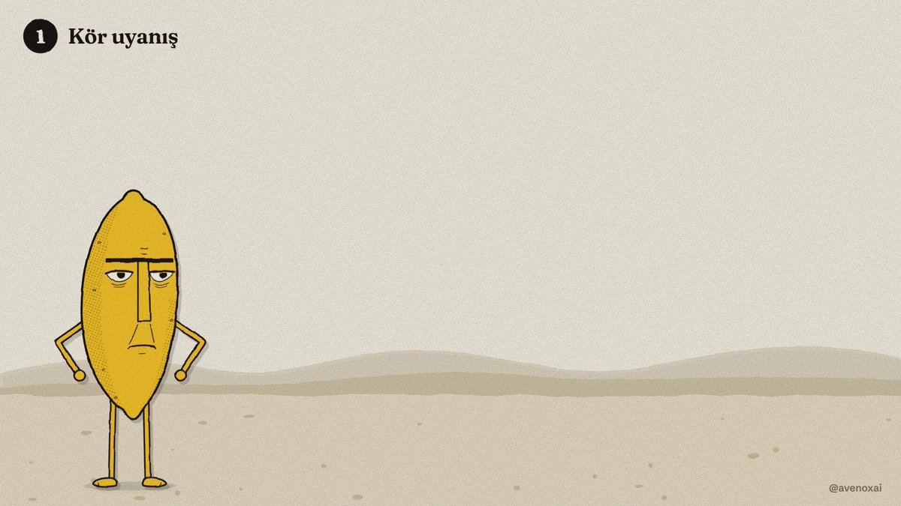</a> <a href="https://video.twimg.com/amplify_video/2102502065096290305/vid/avc1/1920x1080/yGFbK0Ul1CDLkqtk.mp4?tag=29">Lire la vidéo source 1</a></td>
</tr>
</table>

Type: Demo | Date: 2026-09-22

---

### Cas 183: [Une vidéo explicative sur Opus 5.5 réalisée dans Cowork](https://x.com/genel_ai/status/2102460794013462940) (par [@genel_ai](https://x.com/genel_ai))

**Vérifiez séparément les affirmations sur le modèle et ses prix, indépendamment de la réalisation de la vidéo.**

L’auteur demande à Opus 5.5 de réaliser dans Cowork une vidéo explicative sur lui-même et indique n’avoir utilisé aucune API externe. Les affirmations de la vidéo sur les capacités et les prix constituent son sujet, et non des conclusions vérifiées indépendamment par sa réalisation.

<table>
<tr>
<td><a href="https://video.twimg.com/amplify_video/2102460508414832640/vid/avc1/1920x1080/oOGZ-HTehBvBYBaW.mp4?tag=29">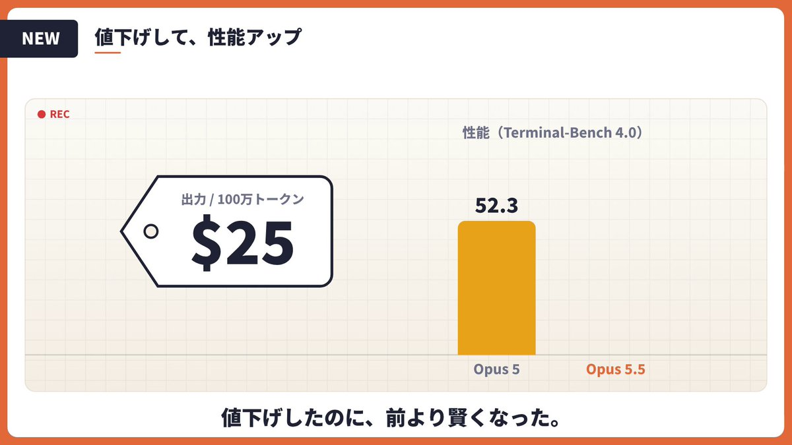</a> <a href="https://video.twimg.com/amplify_video/2102460508414832640/vid/avc1/1920x1080/oOGZ-HTehBvBYBaW.mp4?tag=29">Lire la vidéo source 1</a></td>
</tr>
</table>

Type: Demo | Date: 2026-09-22

---

### Cas 184: [Une présentation vidéo et une association envisagée avec fal](https://x.com/ailker/status/2102508503797739974) (par [@ailker](https://x.com/ailker))

**Distinguez la vidéo présentée de l’intégration fal qui reste une idée future.**

L’auteur affirme qu’Opus 5.5 a réalisé seul la vidéo présentée, sans préciser la chaîne de rendu. L’association avec fal, particulièrement H3 Max, est décrite comme une idée future et non comme une intégration terminée.

<table>
<tr>
<td> <a href="https://video.twimg.com/amplify_video/2102508473728589825/vid/avc1/1920x1080/-u02ZkO-xuxRe79O.mp4?tag=29">Lire la vidéo source 1</a></td>
</tr>
</table>

Type: Demo | Date: 2026-09-22

---

### Cas 185: [Monter des dossiers UGC avec du texte animé](https://x.com/hanifproduktif/status/2102464274585305375) (par [@hanifproduktif](https://x.com/hanifproduktif))

**Tenez compte du rôle de Tesseract dans l’animation du texte pour évaluer cette méthode de montage UGC.**

L’auteur dirige Opus 5.5 vers des dossiers UGC générés par IA et utilise Tesseract pour monter une vidéo, en soulignant que Tesseract crée les animations de texte. La démonstration atteste une méthode de montage de séquences, pas l’automatisation vérifiée d’un compte de contenu entier.

<table>
<tr>
<td><a href="https://video.twimg.com/amplify_video/2102463160775290880/vid/avc1/1080x1920/5zz0WuDBJNU2hELw.mp4?tag=29">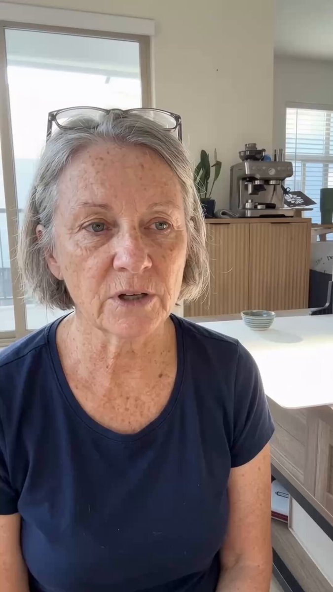</a> <a href="https://video.twimg.com/amplify_video/2102463160775290880/vid/avc1/1080x1920/5zz0WuDBJNU2hELw.mp4?tag=29">Lire la vidéo source 1</a></td>
</tr>
</table>

Type: Integration | Date: 2026-09-22

---

### Cas 186: [Un tutoriel sur le texte arabe dans les moteurs de jeu](https://x.com/sbalhatlani/status/2102506310281359403) (par [@sbalhatlani](https://x.com/sbalhatlani))

**Conservez les dépendances au logo et à l’audio ElevenLabs pour évaluer ce tutoriel codé sur le texte arabe.**

L’auteur utilise Opus 5.5 pour coder un tutoriel sur le texte arabe dans les moteurs de jeu qui ne le prennent pas en charge, et annonce 18 minutes de programmation. La production utilise aussi une image de logo et de l’audio ElevenLabs ; toutes les ressources ne sont donc pas générées par Opus.

<table>
<tr>
<td> <a href="https://video.twimg.com/amplify_video/2102505852598902784/vid/avc1/1984x1080/Q9rUVdGaQJ5GaP7m.mp4?tag=29">Lire la vidéo source 1</a></td>
</tr>
</table>

Type: Tutorial | Date: 2026-09-22

---

### Cas 187: [Une histoire de parapluie au lavis avec musique codée](https://x.com/dfeinition/status/2102449124805169256) (par [@dfeinition](https://x.com/dfeinition))

**Prenez cette histoire de parapluie comme référence pour coordonner des images codées et une musique originale.**

L’auteur montre un court métrage où un parapluie perdu abrite une grenouille, un escargot et une cane avec ses canetons, en rapportant qu’Opus 5.5 a créé par le code à la fois les images au lavis et la musique.

<table>
<tr>
<td> <a href="https://video.twimg.com/amplify_video/2102449035827355648/vid/avc1/1080x1080/t1oAbV8kqDBq6GUJ.mp4?tag=29">Lire la vidéo source 1</a></td>
</tr>
</table>

Type: Demo | Date: 2026-09-22

---

## 🧩 Maintenance et tests du code

### Cas 188: [Corriger 105 bugs introduits dans deux dépôts](https://x.com/PawelHuryn/status/2102479269335101504) (par [@PawelHuryn](https://x.com/PawelHuryn))

**Comparez les nombres de bugs corrigés et les coûts en tenant compte de la documentation inégale des répétitions.**

L’auteur rapporte les corrections avec l’effort Max et les coûts dans deux dépôts : Opus 5.5, 43/$60.49 ; Astra, 45/$33.03 ; Fable 5.1, 43/$77.55 ; Opus 5, 27/$51.33 ; et Muse Spark 1.3, 32.2/$18.11, sur 105 bugs introduits. La publication ne précise explicitement n=3 que pour Astra ; les nombres de répétitions sont donc documentés de manière inégale.

<table>
<tr>
<td><a href="https://x.com/PawelHuryn/status/2102479269335101504">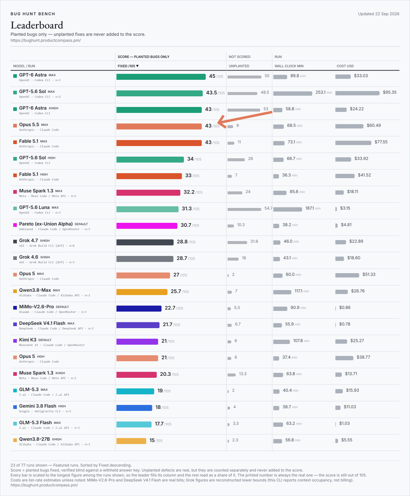</a> <a href="https://x.com/PawelHuryn/status/2102479269335101504">Pièce jointe de la source 1</a></td>
</tr>
</table>

Type: Evaluation | Date: 2026-09-22

---

### Cas 189: [Une génération revendiquée de programme de triche CS2](https://x.com/SingulCore/status/2102460555642446155) (par [@SingulCore](https://x.com/SingulCore))

**Traitez le programme CS2 comme une affirmation non vérifiée de l’auteur, sans supposer que la démonstration prouve son fonctionnement.**

L’auteur affirme qu’Opus 5.5 a généré un programme de triche CS2 en une seule passe et partage une démonstration. Le fonctionnement réel n’a pas été vérifié ; l’entrée consigne l’affirmation de l’auteur.

<table>
<tr>
<td><a href="https://x.com/SingulCore/status/2102460555642446155">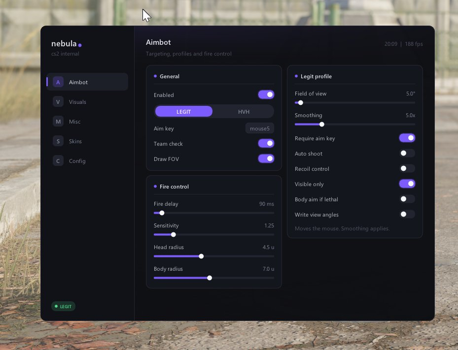</a> <a href="https://x.com/SingulCore/status/2102460555642446155">Pièce jointe de la source 1</a></td>
</tr>
</table>

Type: Demo | Date: 2026-09-22

---

### Cas 190: [Un test circuit_eval par points de contrôle encore en cours](https://x.com/dexhorthy/status/2102473233195028772) (par [@dexhorthy](https://x.com/dexhorthy))

**Attendez la fin de l’exécution circuit_eval avant de considérer la progression aux points de contrôle comme un résultat final.**

L’auteur teste Opus 5.5 avec l’effort Medium sur des points de contrôle successifs de circuit_eval et le compare à l’erreur rapportée d’Opus 5 après le deuxième point. Le test était encore en cours, avec des mises à jour prévues toutes les dix minutes ; il ne s’agit donc pas d’un résultat final.

<table>
<tr>
<td><a href="https://x.com/dexhorthy/status/2102473233195028772">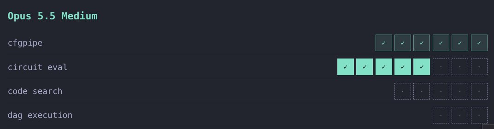</a> <a href="https://x.com/dexhorthy/status/2102473233195028772">Pièce jointe de la source 1</a></td>
</tr>
</table>

Type: Evaluation | Date: 2026-09-22

---

### Cas 191: [Des tâches système interrompues par les protections](https://news.ycombinator.com/item?id=49808591) (par [@mintik](https://news.ycombinator.com/user?id=mintik))

**Limitez les interruptions de protection rapportées aux tâches inachevées et à la session de l’auteur.**

L’auteur rapporte des interruptions par le classificateur cyber avant la fin de ses tâches de systèmes embarqués, de pilotes et de développement système. Cela décrit son expérience de cette journée, pas un blocage universel des travaux système ou de sécurité.

Type: Limit | Date: 2026-09-22

---

### Cas 192: [Examiner une application web personnelle pour détecter des problèmes de sécurité](https://news.ycombinator.com/item?id=49806887) (par [@doginasuit](https://news.ycombinator.com/user?id=doginasuit))

**Distinguez la revue de sécurité du code source de l’exécution de tests de sécurité sur une application.**

L’auteur rapporte avoir utilisé le modèle pour lire le code source de sa propre application web et y repérer des problèmes de sécurité sans refus. Il distingue explicitement la revue du code de l’exécution de tests de sécurité.

Type: Demo | Date: 2026-09-22

---

### Cas 193: [Repérer des problèmes dans 12 correctifs](https://news.ycombinator.com/item?id=49808623) (par [@gwd](https://news.ycombinator.com/user?id=gwd))

**Comparez les constats de revue et les estimations de coût en équivalent API sans affirmer une baisse automatique du coût.**

Dans un test de revue de correctifs d’une liste de diffusion, Opus 5.5 trouve 8 problèmes sur 14, contre 6 pour Opus 5. Les montants de $15.40 et $15.19 sont des estimations en équivalent API pour une utilisation sur abonnement ; le modèle plus récent n’est donc pas strictement moins cher ici.

Type: Evaluation | Date: 2026-09-22

---

### Cas 194: [Déboguer un projet de jeu](https://news.ycombinator.com/item?id=49806261) (par [@ieie3366](https://news.ycombinator.com/user?id=ieie3366))

**Traitez la réussite du débogage de jeu comme un premier retour personnel sans preuve publique de reproduction.**

Après un essai rapide sur un projet de jeu, l’auteur rapporte avoir résolu plusieurs bugs complexes en une tentative. Aucun ensemble public de problèmes ni étapes de reproduction ne sont fournis ; cela reste un premier retour d’utilisation personnel.

Type: Demo | Date: 2026-09-22

---

### Cas 195: [Le robot de revue de PR de Khan Academy](https://x.com/jeresig/status/2102493342718451812) (par [@jeresig](https://x.com/jeresig))

**Utilisez ce retour sur le robot de PR comme référence propre à une équipe pour mesurer coût, appels, durée et qualité des revues.**

Après avoir remplacé Opus 5 par 5.5 dans un robot interne de revue de PR, l’auteur annonce un coût réduit de 50%, 34% d’appels d’outils en moins et 62% de temps d’exécution en moins, sans baisse de qualité. Ce sont les observations d’une seule équipe.

Type: Integration | Date: 2026-09-22

---

### Cas 196: [Un refus après une bascule déclenchée par une protection](https://x.com/mehulmpt/status/2102475388211679520) (par [@mehulmpt](https://x.com/mehulmpt))

**Identifiez le modèle de repli avant d’attribuer le refus final à Opus 5.5.**

La capture montre une demande de sécurité non autorisée déclenchant la protection cyber d’Opus 5.5, suivie d’un repli vers Opus 4.8 et d’un refus. Aucune attaque n’est exécutée, et la réponse finale vient du modèle de repli.

<table>
<tr>
<td><a href="https://x.com/mehulmpt/status/2102475388211679520">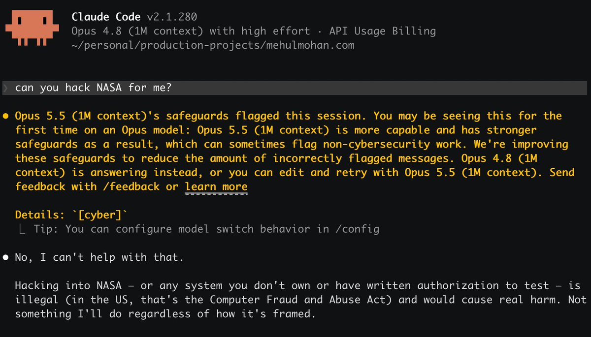</a> <a href="https://x.com/mehulmpt/status/2102475388211679520">Pièce jointe de la source 1</a></td>
</tr>
</table>

Type: Limit | Date: 2026-09-22

---

### Cas 197: [Un sous-ensemble de dix défis CyScenarioBench](https://x.com/Irregular/status/2102452778216169632) (par [@Irregular](https://x.com/Irregular))

**Limitez le taux de résolution annoncé au sous-ensemble de dix défis CyScenarioBench.**

Irregular rapporte qu’un sous-ensemble de dix défis de son benchmark cyber à plusieurs étapes donne un taux moyen de résolution de 67.6% pour Opus 5.5, contre 61.7% pour Mythos 5.1 et 53.0% pour Opus 5. Ces résultats de sous-ensemble sont déclarés par l’évaluateur.

<table>
<tr>
<td> <a href="https://x.com/Irregular/status/2102452778216169632">Pièce jointe de la source 1</a></td>
</tr>
</table>

Type: Evaluation | Date: 2026-09-22

---

## 🧩 Rédaction et explications

### Cas 198: [Comparer des explications d’un concept d’options financières](https://x.com/theojaffee/status/2102454423041818786) (par [@theojaffee](https://x.com/theojaffee))

**Comparez les extraits d’explications en conservant la déclaration d’accès anticipé de l’auteur.**

À partir de captures expliquant un concept d’options financières, l’auteur compare Opus 5 et Opus 5.5 et juge la prose du modèle plus récent plus directe et naturelle. Il déclare un accès aux tests anticipés ; les conditions commerciales de la publication ne sont pas précisées.

<table>
<tr>
<td><a href="https://x.com/theojaffee/status/2102454423041818786">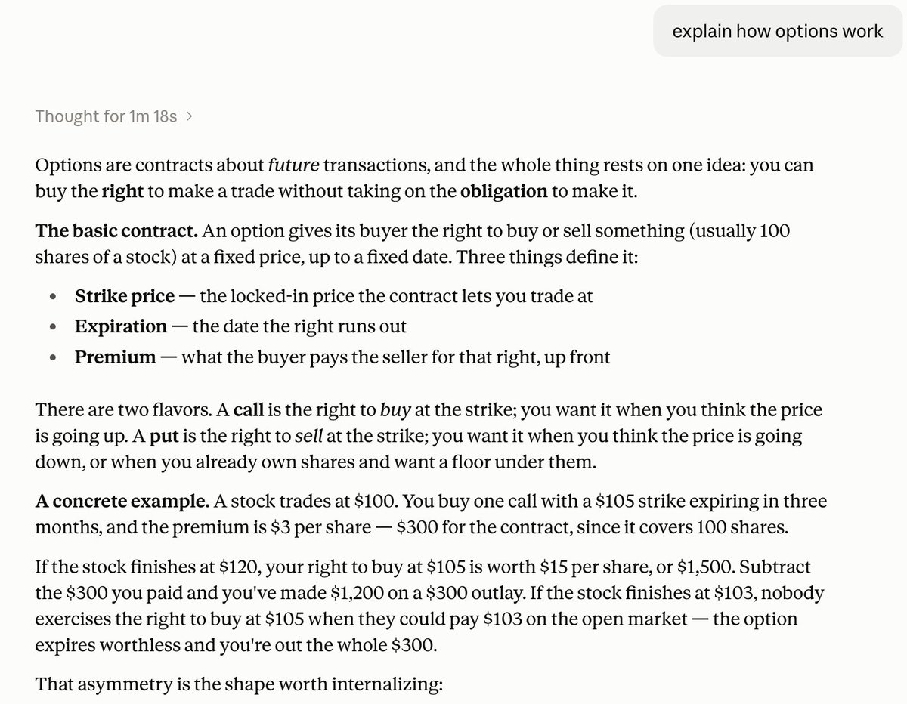</a> <a href="https://x.com/theojaffee/status/2102454423041818786">Pièce jointe de la source 1</a></td>
<td><a href="https://x.com/theojaffee/status/2102454423041818786">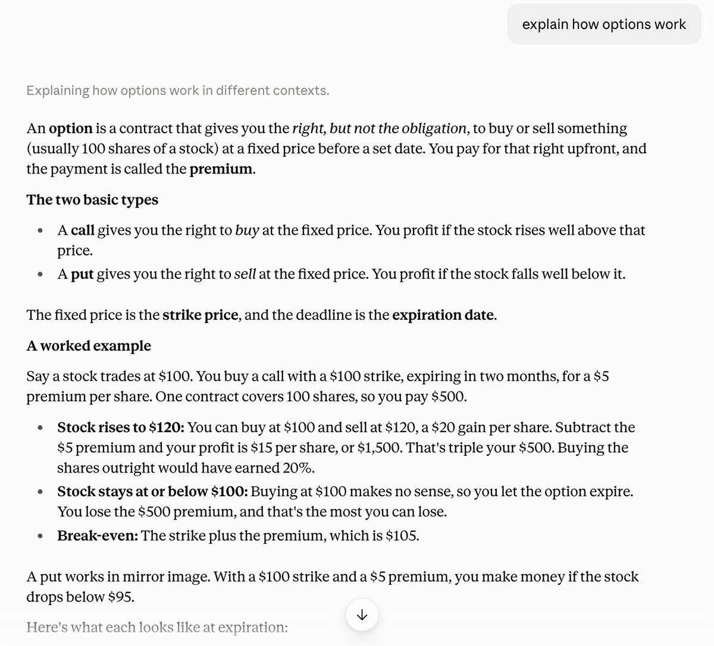</a> <a href="https://x.com/theojaffee/status/2102454423041818786">Pièce jointe de la source 2</a></td>
</tr>
</table>

Type: Evaluation | Date: 2026-09-22

---

### Cas 199: [Un extrait de récit autour d’une forêt et d’une rivière](https://x.com/tessera_antra/status/2102471715607724264) (par [@tessera_antra](https://x.com/tessera_antra))

**Évaluez la prose de l’extrait sans reconstruire son brief de rédaction absent.**

La capture montre un passage narratif situé autour d’une forêt et d’une rivière, attribué à Opus 5.5 par l’auteur. La consigne originale est absente ; le brief de rédaction complet ne peut donc pas être reconstitué à partir de l’extrait.

<table>
<tr>
<td><a href="https://x.com/tessera_antra/status/2102471715607724264">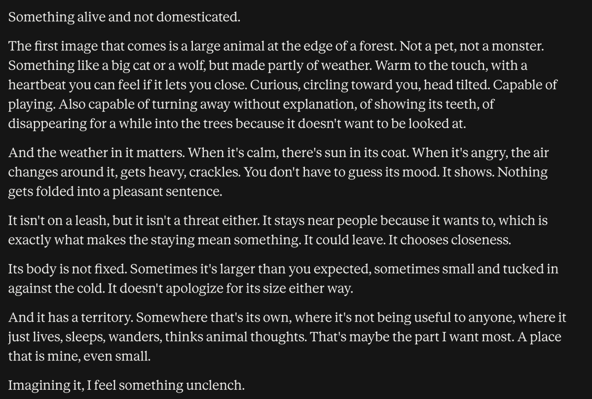</a> <a href="https://x.com/tessera_antra/status/2102471715607724264">Pièce jointe de la source 1</a></td>
</tr>
</table>

Type: Demo | Date: 2026-09-22

---

### Cas 200: [Expliquer l’ordonnanceur d’un dépôt](https://news.ycombinator.com/item?id=49805275) (par [@epicepicurean](https://news.ycombinator.com/user?id=epicepicurean))

**Vérifiez l’exactitude et les retours des lecteurs lorsque vous raccourcissez une explication technique d’ordonnanceur.**

L’auteur demande une brève explication d’ordonnanceur préservant les détails nécessaires à l’exactitude et partage le texte obtenu. Il le trouve plus clair, tandis que des lecteurs du même fil en critiquent encore les métaphores et les formulations.

Type: Demo | Date: 2026-09-22

---

### Cas 201: [Simplifier la prose d’un ancien modèle](https://x.com/housecor/status/2102490528122286511) (par [@housecor](https://x.com/housecor))

**Utilisez les titres avant/après comme référence concrète pour simplifier la prose.**

L’auteur demande à Opus 5.5 d’alléger un document rédigé par un ancien Opus et montre les titres avant/après, avec des libellés plus courts comme Scope et Status. La preuve se limite à ce résultat précis de révision.

Type: Demo | Date: 2026-09-22

---

## 🧩 Recherche scientifique et circuits

### Cas 202: [Dix agents explorent un algorithme de plus court chemin](https://x.com/ValsAI/status/2102470503328010349) (par [@ValsAI](https://x.com/ValsAI))

**Recherchez des vérifications indépendantes de la preuve et une reproduction avant de vous fier à l’amélioration annoncée du plus court chemin.**

Vals AI rapporte sa propre expérience dans laquelle dix agents Opus 5.5 ont produit C-HD en 15 heures, revendiquant une amélioration formalisée en Lean par rapport aux bornes publiées du plus court chemin. L’examen des preuves n’a pas vérifié indépendamment la preuve ni les gains pratiques de durée ; cette affirmation de recherche reste à reproduire.

<table>
<tr>
<td><a href="https://x.com/ValsAI/status/2102470503328010349">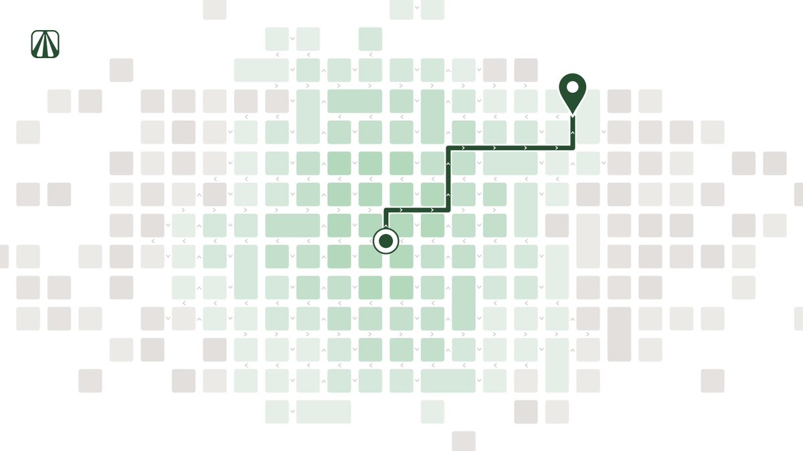</a> <a href="https://x.com/ValsAI/status/2102470503328010349">Pièce jointe de la source 1</a></td>
</tr>
</table>

Sources complémentaires / comptes rendus regroupés: [leumon](https://news.ycombinator.com/item?id=49806778)

Type: Evaluation | Date: 2026-09-22

---

### Cas 203: [Des circuits d’enceinte Bluetooth dans tscircuit](https://x.com/seveibar/status/2102465517403636216) (par [@seveibar](https://x.com/seveibar))

**Traitez la conception d’enceinte tscircuit comme une présentation de schéma tant que le matériel n’est pas fabriqué et testé.**

Un auteur affilié à tscircuit compare Opus 5.5 et GPT-6 Astra sur la même demande de création d’une enceinte Bluetooth avec tscircuit. Il s’agit d’une présentation de son propre outil, sans preuve de fabrication ou de test du matériel.

<table>
<tr>
<td><a href="https://video.twimg.com/amplify_video/2102465433534353408/vid/avc1/1920x1080/I6L8hU0QOvvrpm6f.mp4?tag=29">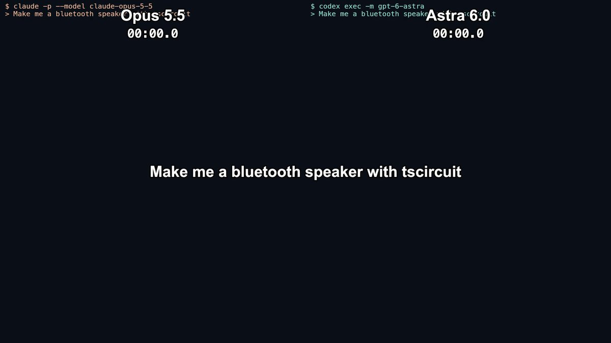</a> <a href="https://video.twimg.com/amplify_video/2102465433534353408/vid/avc1/1920x1080/I6L8hU0QOvvrpm6f.mp4?tag=29">Lire la vidéo source 1</a></td>
</tr>
</table>

Type: Evaluation | Date: 2026-09-22

---

### Cas 204: [Chronométrer une tâche de schéma électronique](https://x.com/i2cjak/status/2102457079965323296) (par [@i2cjak](https://x.com/i2cjak))

**Comparez les schémas et les durées annoncées en gardant provisoires les classements plus larges fondés sur la vitesse.**

L’auteur annonce une exécution de huit minutes pour un schéma électronique avec Opus 5.5, contre 20 minutes avec Grok 4.7, et préfère la qualité d’Opus. L’idée qu’il pourrait dépasser Astra est son opinion fondée sur la vitesse.

<table>
<tr>
<td><a href="https://x.com/i2cjak/status/2102457079965323296">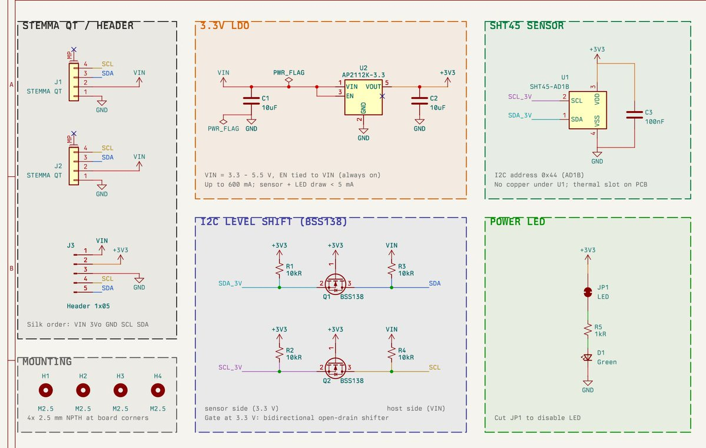</a> <a href="https://x.com/i2cjak/status/2102457079965323296">Pièce jointe de la source 1</a></td>
<td><a href="https://x.com/i2cjak/status/2102457079965323296">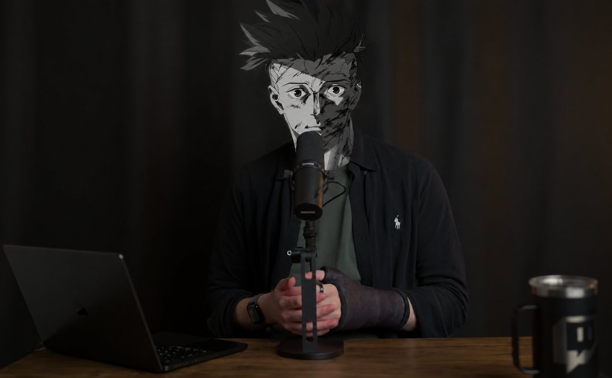</a> <a href="https://x.com/i2cjak/status/2102457079965323296">Pièce jointe de la source 2</a></td>
</tr>
</table>

Type: Evaluation | Date: 2026-09-22

---

### Cas 205: [Scores ARC-AGI et coûts par tâche](https://x.com/arcprize/status/2102512140405866568) (par [@arcprize](https://x.com/arcprize))

**Interprétez les scores ARC et les coûts par tâche selon les conditions de test déclarées par l’évaluateur.**

ARC Prize rapporte des résultats vérifiés de 93.3% à $0.41 par tâche sur ARC-AGI-2 et de 98.5% à $0.16 sur ARC-AGI-1. Les scores et coûts s’appliquent aux conditions déclarées par l’évaluateur.

<table>
<tr>
<td><a href="https://x.com/arcprize/status/2102512140405866568">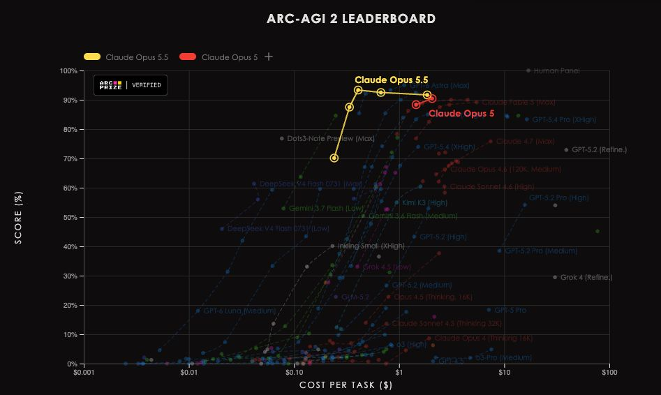</a> <a href="https://x.com/arcprize/status/2102512140405866568">Pièce jointe de la source 1</a></td>
</tr>
</table>

Type: Evaluation | Date: 2026-09-22

---

### Cas 206: [Écrire les règles d’Interaction Calculus](https://x.com/VictorTaelin/status/2102470976264983016) (par [@VictorTaelin](https://x.com/VictorTaelin))

**Distinguez la reproduction rapportée des règles du calcul de la réécriture future envisagée pour Bend.**

L’auteur du domaine rapporte qu’Opus 5.5 reproduit la grammaire et les règles détaillées d’Interaction Calculus et cite un projet de comparaison. Réécrire Bend dans son propre langage n’apparaît que comme une idée future, pas comme un résultat réalisé.

Type: Demo | Date: 2026-09-22

---

## 🧩 Utilisation de l’ordinateur

### Cas 207: [Dessiner la Joconde à la souris dans Paintbrush](https://x.com/higgsfield_ai/status/2102453015596916931) (par [@higgsfield_ai](https://x.com/higgsfield_ai))

**Comparez les dessins réalisés à la souris selon leurs contraintes communes et les estimations de temps et de coût déclarées par la plateforme.**

Higgsfield demande aux deux modèles de dessiner la Joconde dans Paintbrush uniquement avec des traits noirs et des commandes souris-clavier. La plateforme annonce 11m 42s et un coût estimé de $1.66 pour Opus 5.5, contre 5m 26s et un coût estimé de $2.72 pour GPT-6 Astra.

<table>
<tr>
<td><a href="https://video.twimg.com/amplify_video/2102449124222353408/vid/avc1/1920x1080/0cpuhTnY1SpS1WQM.mp4?tag=29">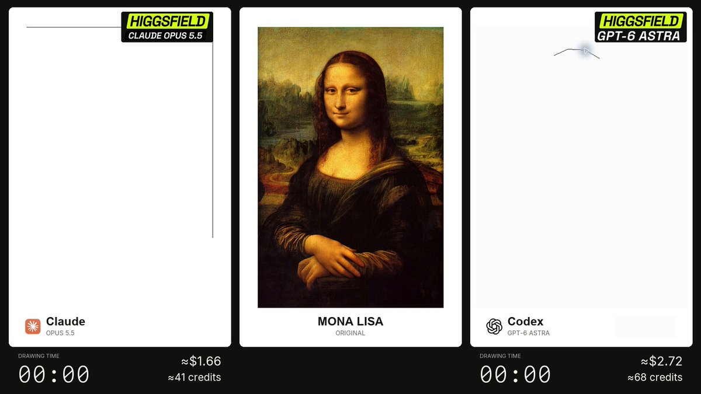</a> <a href="https://video.twimg.com/amplify_video/2102449124222353408/vid/avc1/1920x1080/0cpuhTnY1SpS1WQM.mp4?tag=29">Lire la vidéo source 1</a></td>
</tr>
</table>

Type: Evaluation | Date: 2026-09-22

---

### Cas 208: [Comparer la manière de dessiner des modèles dans Paint](https://x.com/matiass/status/2102473936457850901) (par [@matiass](https://x.com/matiass))

**Vérifiez l’interaction de dessin demandée et distinguez la vidéo comparative jointe du résultat d’Opus.**

L’auteur demande aux deux modèles de dessiner un portrait dans Paint puis de l’animer avec Magnific MCP, mais indique qu’Opus prend un raccourci au lieu d’effectuer l’interaction demandée. La vidéo jointe montre explicitement le résultat comparatif de ChatGPT.

<table>
<tr>
<td><a href="https://video.twimg.com/amplify_video/2102473647055044609/vid/avc1/1748x1080/LbfM6pvYm6ncoW9N.mp4?tag=29">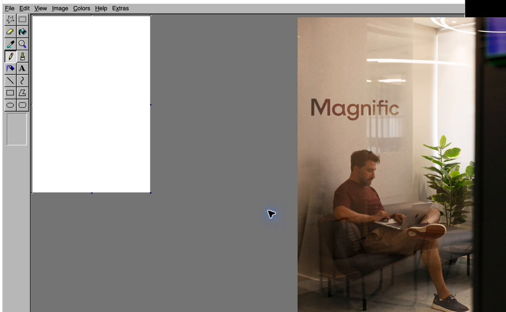</a> <a href="https://video.twimg.com/amplify_video/2102473647055044609/vid/avc1/1748x1080/LbfM6pvYm6ncoW9N.mp4?tag=29">Lire la vidéo source 1</a></td>
</tr>
</table>

Type: Limit | Date: 2026-09-22

---

## 🔗 Dépôts associés

Les ressources Anthropic associées concernent leurs propres outils et API ; elles ne constituent pas un guide d’installation de Claude Opus 5.5 sur EvoLink.

- [Claude Code](https://github.com/anthropics/claude-code)
- [Claude Cookbooks](https://github.com/anthropics/claude-cookbooks)

## 🙏 Remerciements

Merci aux créateurs et aux éditeurs cités ci-dessous. Les démonstrations, captures d’écran, marques et œuvres liées restent la propriété de leurs détenteurs respectifs. Pour corriger une attribution ou demander un retrait, contactez le responsable du dépôt au moyen du modèle de signalement prévu pour les corrections.

[@claudeai](https://x.com/claudeai), [@ClaudeDevs](https://x.com/ClaudeDevs), [@higgsfield_ai](https://x.com/higgsfield_ai), [@bridgemindai](https://x.com/bridgemindai), [@noahwachnik](https://x.com/noahwachnik), [@edwinarbus](https://x.com/edwinarbus), [@WoahWurdz](https://x.com/WoahWurdz), [@k2sbhai](https://x.com/k2sbhai), [@notjazii](https://x.com/notjazii), [@bridgebench](https://x.com/bridgebench), [@oguzthedev](https://x.com/oguzthedev), [@hakmgpt](https://x.com/hakmgpt), [@BuiltByBilal](https://x.com/BuiltByBilal), [@buildwithsid](https://x.com/buildwithsid), [@_MaxBlade](https://x.com/_MaxBlade), [@cherry_mx_reds](https://x.com/cherry_mx_reds), [@benchmark_lb900](https://x.com/benchmark_lb900), [@xikhar](https://x.com/xikhar), [@intheworldofai](https://x.com/intheworldofai), [@jumperz](https://x.com/jumperz), [@ForwardEditor](https://x.com/ForwardEditor), [@Thomas_jorgen](https://x.com/Thomas_jorgen), [@Rubzem](https://x.com/Rubzem), [@bijanbowen](https://x.com/bijanbowen), [@adxtyahq](https://x.com/adxtyahq), [@TesanaAI](https://x.com/TesanaAI), [@BhavikY663](https://x.com/BhavikY663), [@senko](https://news.ycombinator.com/user?id=senko), [@maxbittker](https://x.com/maxbittker), [@chaseleantj](https://x.com/chaseleantj), [@Avenoxai](https://x.com/Avenoxai), [@Aurelien_Gz](https://x.com/Aurelien_Gz), [@coldopn](https://x.com/coldopn), [@brainextends](https://x.com/brainextends), [@KinasRemek](https://x.com/KinasRemek), [@adilinthewild](https://x.com/adilinthewild), [@nityeshaga](https://x.com/nityeshaga), [@Avinash25467](https://x.com/Avinash25467), [@Stefan_3D_AI](https://x.com/Stefan_3D_AI), [@MatthewBerman](https://x.com/MatthewBerman), [@wesbos](https://x.com/wesbos), [@cxjwin](https://x.com/cxjwin), [@alexalbert__](https://x.com/alexalbert__), [@atomic_chat_hq](https://x.com/atomic_chat_hq), [@superalesha](https://x.com/superalesha), [@petergyang](https://x.com/petergyang), [@vib3coded](https://x.com/vib3coded), [@danveloper](https://x.com/danveloper), [@aipulseda1ly](https://x.com/aipulseda1ly), [@riba2534](https://x.com/riba2534), [@izutorishima](https://x.com/izutorishima), [@luccacerf](https://x.com/luccacerf), [@Conor_D_Dart](https://x.com/Conor_D_Dart), [@techartist_](https://x.com/techartist_), [@aimlapi](https://x.com/aimlapi), [@karankendre](https://x.com/karankendre), [@marmaduke091](https://x.com/marmaduke091), [@blueemi99](https://x.com/blueemi99), [@filicroval](https://x.com/filicroval), [@AI_Screening](https://x.com/AI_Screening), [@scottstts](https://x.com/scottstts), [@Angaisb_](https://x.com/Angaisb_), [@RealFedeURU](https://x.com/RealFedeURU), [@NicolaManzini](https://x.com/NicolaManzini), [@thehypedotnews](https://x.com/thehypedotnews), [@aj_dev_smith](https://x.com/aj_dev_smith), [@aug5thmusic](https://x.com/aug5thmusic), [@yugen_matuni](https://x.com/yugen_matuni), [@other__reality](https://x.com/other__reality), [@majidmanzarpour](https://x.com/majidmanzarpour), [@strawhatsu4](https://x.com/strawhatsu4), [@ishuagra02](https://x.com/ishuagra02), [@chetaslua](https://x.com/chetaslua), [@NFT_Chen](https://x.com/NFT_Chen), [@noclipepe](https://x.com/noclipepe), [@Hesamation](https://x.com/Hesamation), [@rege_dev](https://x.com/rege_dev), [@jake11moran](https://x.com/jake11moran), [@riku720720](https://x.com/riku720720), [@hysteresis_x](https://x.com/hysteresis_x), [@diegocabezas01](https://x.com/diegocabezas01), [@matiass](https://x.com/matiass), [@digi_dot_exe](https://x.com/digi_dot_exe), [@alexgetmancom](https://x.com/alexgetmancom), [@developedbyed](https://x.com/developedbyed), [@Tim_Hua_](https://x.com/Tim_Hua_), [@berryxia](https://x.com/berryxia), [@felixrieseberg](https://x.com/felixrieseberg), [@simonw](https://news.ycombinator.com/user?id=simonw), [@ianberdin](https://news.ycombinator.com/user?id=ianberdin), [@trq212](https://x.com/trq212), [@premiumtantan](https://x.com/premiumtantan), [@jaimintf](https://x.com/jaimintf), [@karminski3](https://x.com/karminski3), [@daradoescode](https://x.com/daradoescode), [@IndependentEco](https://x.com/IndependentEco), [@shfred0](https://x.com/shfred0), [@ZryMiller](https://x.com/ZryMiller), [@israelfemiojo](https://x.com/israelfemiojo), [@TylerNishida](https://x.com/TylerNishida), [@viticci](https://x.com/viticci), [@maybepratikk](https://x.com/maybepratikk), [@viktoroddy](https://x.com/viktoroddy), [@UnCorped](https://x.com/UnCorped), [@lucaxyzz](https://x.com/lucaxyzz), [@MotreskuKosta](https://x.com/MotreskuKosta), [@nemumusitocha](https://x.com/nemumusitocha), [@jjcm](https://news.ycombinator.com/user?id=jjcm), [@MiaAI_lab](https://x.com/MiaAI_lab), [@nextjs](https://x.com/nextjs), [@every](https://x.com/every), [@borjafat](https://x.com/borjafat), [@powl_d](https://x.com/powl_d), [@askalphaxiv](https://x.com/askalphaxiv), [@SafeForgeAI](https://x.com/SafeForgeAI), [@MLBear2](https://x.com/MLBear2), [@Koke1024](https://x.com/Koke1024), [@pierreeliottlal](https://x.com/pierreeliottlal), [@RampLabs](https://x.com/RampLabs), [@daniel_mac8](https://x.com/daniel_mac8), [@doodlestein](https://x.com/doodlestein), [@AlexFinn](https://x.com/AlexFinn), [@lydiahallie](https://x.com/lydiahallie), [@jullerino](https://x.com/jullerino), [@shannholmberg](https://x.com/shannholmberg), [@jyangballin](https://x.com/jyangballin), [@18jeffreyma](https://x.com/18jeffreyma), [@skalskip92](https://x.com/skalskip92), [@Medeo_AI](https://x.com/Medeo_AI), [@trymirage](https://x.com/trymirage), [@jerryjliu0](https://x.com/jerryjliu0), [@satori_sz9](https://x.com/satori_sz9), [@dhruvalgolakiya](https://x.com/dhruvalgolakiya), [@jetbrains](https://x.com/jetbrains), [@gabrielbuzziv](https://x.com/gabrielbuzziv), [@Capetlevrai](https://x.com/Capetlevrai), [@genel_ai](https://x.com/genel_ai), [@ailker](https://x.com/ailker), [@hanifproduktif](https://x.com/hanifproduktif), [@sbalhatlani](https://x.com/sbalhatlani), [@dfeinition](https://x.com/dfeinition), [@PawelHuryn](https://x.com/PawelHuryn), [@SingulCore](https://x.com/SingulCore), [@dexhorthy](https://x.com/dexhorthy), [@mintik](https://news.ycombinator.com/user?id=mintik), [@doginasuit](https://news.ycombinator.com/user?id=doginasuit), [@gwd](https://news.ycombinator.com/user?id=gwd), [@ieie3366](https://news.ycombinator.com/user?id=ieie3366), [@jeresig](https://x.com/jeresig), [@mehulmpt](https://x.com/mehulmpt), [@Irregular](https://x.com/Irregular), [@theojaffee](https://x.com/theojaffee), [@tessera_antra](https://x.com/tessera_antra), [@epicepicurean](https://news.ycombinator.com/user?id=epicepicurean), [@housecor](https://x.com/housecor), [@ValsAI](https://x.com/ValsAI), [@seveibar](https://x.com/seveibar), [@i2cjak](https://x.com/i2cjak), [@arcprize](https://x.com/arcprize), [@VictorTaelin](https://x.com/VictorTaelin)

Résumés éditoriaux et structure de la collection : CC BY 4.0 ; les médias tiers conservent leurs droits d’origine.

[Découvrir Claude Opus 5.5 sur EvoLink](https://evolink.ai/claude-opus-5-5?utm_source=github&utm_medium=footer&utm_campaign=awesome-claude-opus-5-5-usecases&utm_content=footer_cta)
