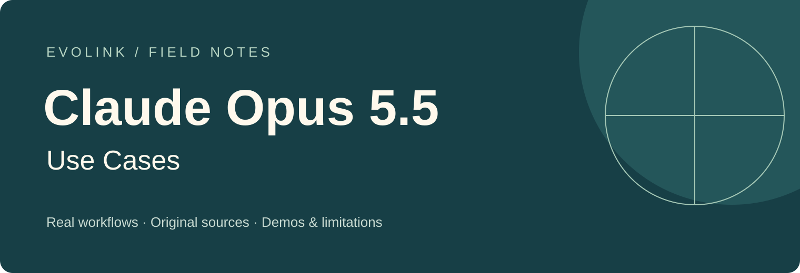

# Claude Opus 5.5 活用事例
出典付きのワークフロー、デモ、比較、制約

[English](README.md) · [日本語](README_ja.md) · [简体中文](README_zh-CN.md)

## 🍌 はじめに

ゲーム、3D シーン、開発ツール、研究、創作など、Claude Opus 5.5 の使われ方を紹介します。各事例に投稿者と出典を記載し、主張の限界も残しています。

[EvoLink で Claude Opus 5.5 を確認](https://evolink.ai/claude-opus-5-5?utm_source=github&utm_medium=top_cta&utm_campaign=awesome-claude-opus-5-5-usecases&utm_content=top)

## 📊 概要

221 件の入力から **Claude Opus 5.5 の 208 事例**を収録。同じ作品や評価の続報 9 件を統合し、根拠が不十分な 4 件を保留しました。

> [!NOTE]
> 掲載内容は出典に基づく報告であり、独立した再現実験ではありません。ツールを介した動画・画像制作は、モデル自体のメディア生成を意味しません。宣伝を含む比較は投稿者の評価として扱います。日付は取り込み日ではなく原投稿の UTC 公開日です。

ローカル版：プレビュー画像はリポジトリ内に保存。動画の再生と出典の閲覧にはネット接続が必要です。

## ⚡ クイックスタート

1. [モデルページで現在の利用方法と機能を確認](https://evolink.ai/claude-opus-5-5?utm_source=github&utm_medium=quick_start&utm_campaign=awesome-claude-opus-5-5-usecases&utm_content=model)
2. [EvoLink ダッシュボードで API キーを作成](https://evolink.ai/dashboard/keys?utm_source=github&utm_medium=api_key&utm_campaign=awesome-claude-opus-5-5-usecases&utm_content=keys)
3. [リンク先の API ガイドまたはモデルページのエージェント案内に従う](https://evolink.ai/docs/en/api-manual/language-series/claude/claude-messages-api?utm_source=github&utm_medium=docs&utm_campaign=awesome-claude-opus-5-5-usecases&utm_content=docs)

モデルページとドキュメントは 2026-09-23 に確認しました。この事例集の作成では有料 API 呼び出しやエージェントのインストールを行っていません。

## 📑 目次

| # | 分類 | 事例 | 種類 |
|---|---|---|---|
| 1 | 公式ガイドと作例 | [公式アカウントが紹介するスイカの短編](#case-1) | Demo |
| 2 | 公式ガイドと作例 | [完了条件を決めてタスクを任せる](#case-2) | Tutorial |
| 3 | ゲーム開発 | [侍ゲームの2モデル比較](#case-3) | Evaluation |
| 4 | ゲーム開発 | [1回の生成による Mario Kart](#case-4) | Demo |
| 5 | ゲーム開発 | [ブラウザー版 Minecraft クローン](#case-5) | Demo |
| 6 | ゲーム開発 | [HTML 1ファイルの機械仕掛けゲーム](#case-6) | Demo |
| 7 | ゲーム開発 | [Roblox のアニメキャラ乱闘ゲーム](#case-7) | Demo |
| 8 | ゲーム開発 | [スパイダーマンゲームの3モデル比較](#case-8) | Evaluation |
| 9 | ゲーム開発 | [水の物理表現を備えた Minecraft クローン](#case-9) | Demo |
| 10 | ゲーム開発 | [DEAD SIGNAL の一人称シーン](#case-10) | Evaluation |
| 11 | ゲーム開発 | [コードで作る養蜂ゲーム](#case-11) | Demo |
| 12 | ゲーム開発 | [スネークゲームのデモ](#case-12) | Demo |
| 13 | ゲーム開発 | [Sol と比較する3Dゲーム制作](#case-13) | Evaluation |
| 14 | ゲーム開発 | [対戦・観戦できるマルチプレイビリヤード](#case-14) | Demo |
| 15 | ゲーム開発 | [Higgsfield API によるアーケードゲーム](#case-15) | Integration |
| 16 | ゲーム開発 | [Minecraft のブラウザー再現](#case-16) | Demo |
| 17 | ゲーム開発 | [配信視聴者と遊ぶ草刈りゲーム](#case-17) | Demo |
| 18 | ゲーム開発 | [ラスボス付き落書き風シューティング](#case-18) | Demo |
| 19 | ゲーム開発 | [Medium 設定で生成した Mario](#case-19) | Demo |
| 20 | ゲーム開発 | [カートレース映像の比較](#case-20) | Evaluation |
| 21 | ゲーム開発 | [同じプロンプトで GPT-6 Sol とゲーム比較](#case-21) | Evaluation |
| 22 | ゲーム開発 | [1回で生成したスネーク](#case-22) | Demo |
| 23 | ゲーム開発 | [Three.js のゾンビ戦ゲーム](#case-23) | Demo |
| 24 | ゲーム開発 | [2回の調整を加えた雪景色ゲーム](#case-24) | Demo |
| 25 | ゲーム開発 | [ゲーム機能追加と予告編編集](#case-25) | Demo |
| 26 | ゲーム開発 | [Tesana のマルチプレイ生存島](#case-26) | Demo |
| 27 | ゲーム開発 | [Unreal Engine のゲーム制作比較](#case-27) | Evaluation |
| 28 | ゲーム開発 | [Tesana のダークファンタジー RPG](#case-28) | Demo |
| 29 | ゲーム開発 | [騒音で格闘が始まるギター店](#case-29) | Demo |
| 30 | ゲーム開発 | [手描き風チェスと手の分析](#case-30) | Demo |
| 31 | ゲーム開発 | [Kimi K3 と飛行シミュレーター比較](#case-31) | Evaluation |
| 32 | ゲーム開発 | [Tesana の1プロンプト幻想世界](#case-32) | Demo |
| 33 | ゲーム開発 | [10分以内で弓矢ゲームを構築](#case-33) | Demo |
| 34 | ゲーム開発 | [Minecraft・Warcraft クローンを比較](#case-34) | Evaluation |
| 35 | ゲーム開発 | [Runescape Bench の成績と費用](#case-35) | Evaluation |
| 36 | 対話型学習と可視化 | [魚に餌をあげられるサンゴ礁壁紙](#case-36) | Demo |
| 37 | 対話型学習と可視化 | [配信中に制作した水のシミュレーション](#case-37) | Demo |
| 38 | 対話型学習と可視化 | [動画を参考に3Dの水を再現](#case-38) | Demo |
| 39 | 対話型学習と可視化 | [層ごとに見る手の解剖デモ](#case-39) | Demo |
| 40 | 対話型学習と可視化 | [Kilo Code の草に触れるシミュレーター](#case-40) | Evaluation |
| 41 | 対話型学習と可視化 | [投石機のスケッチから3Dシミュレーション](#case-41) | Demo |
| 42 | 対話型学習と可視化 | [軌道や振り子の物理装置](#case-42) | Demo |
| 43 | 対話型学習と可視化 | [重力による顔の変化](#case-43) | Demo |
| 44 | 対話型学習と可視化 | [つながるページで Web の仕組みを説明](#case-44) | Demo |
| 45 | 対話型学習と可視化 | [分解して学ぶ3Dの眼球ページ](#case-45) | Evaluation |
| 46 | 対話型学習と可視化 | [未完成の宇宙スケール体験](#case-46) | Limit |
| 47 | 3Dモデリングとシーン | [Blender の10秒ショット比較](#case-47) | Evaluation |
| 48 | 3Dモデリングとシーン | [Unreal Engine の街と Jev の行動制御](#case-48) | Integration |
| 49 | 3Dモデリングとシーン | [500種類の器具でジムを配置](#case-49) | Demo |
| 50 | 3Dモデリングとシーン | [4モデルのロケット打ち上げ比較](#case-50) | Evaluation |
| 51 | 3Dモデリングとシーン | [自転車に乗るペリカン](#case-51) | Demo |
| 52 | 3Dモデリングとシーン | [地震前の Market Street を再現](#case-52) | Demo |
| 53 | 3Dモデリングとシーン | [Blender のペリカンループを Sol と比較](#case-53) | Evaluation |
| 54 | 3Dモデリングとシーン | [Blender 作品の紹介](#case-54) | Demo |
| 55 | 3Dモデリングとシーン | [Blender の風車制作工程](#case-55) | Demo |
| 56 | 3Dモデリングとシーン | [コードで作るゴールデンゲートブリッジ](#case-56) | Evaluation |
| 57 | 3Dモデリングとシーン | [火山島・水中生態系・オーロラ](#case-57) | Evaluation |
| 58 | 3Dモデリングとシーン | [Blender で外骨格の関節を再設計](#case-58) | Demo |
| 59 | 3Dモデリングとシーン | [Cowork のソーラーパンク都市](#case-59) | Demo |
| 60 | 3Dモデリングとシーン | [Three.js で作るニューヨーク](#case-60) | Evaluation |
| 61 | 3Dモデリングとシーン | [別の作者による自転車ペリカン](#case-61) | Demo |
| 62 | 3Dモデリングとシーン | [Blender の新幹線モデル](#case-62) | Demo |
| 63 | 3Dモデリングとシーン | [画像をローポリ3Dに変換](#case-63) | Demo |
| 64 | 3Dモデリングとシーン | [複数ツールによるキャラクター制作](#case-64) | Integration |
| 65 | 3Dモデリングとシーン | [住宅写真と間取り図から3D化](#case-65) | Demo |
| 66 | 3Dモデリングとシーン | [ボトルシップの生成テスト](#case-66) | Demo |
| 67 | 3Dモデリングとシーン | [DeLorean・時計台・稲妻のアニメーション](#case-67) | Evaluation |
| 68 | 3Dモデリングとシーン | [スケッチから完成住宅までの4段階](#case-68) | Demo |
| 69 | 3Dモデリングとシーン | [3D出力と1回あたりの費用比較](#case-69) | Evaluation |
| 70 | 3Dモデリングとシーン | [絵画から視点を変えられる場面へ](#case-70) | Integration |
| 71 | 3Dモデリングとシーン | [3D家具配置シミュレーター](#case-71) | Demo |
| 72 | 3Dモデリングとシーン | [筆致を残して木炭画を3D化](#case-72) | Demo |
| 73 | 3Dモデリングとシーン | [地中海の港町を複数人で散策](#case-73) | Demo |
| 74 | 3Dモデリングとシーン | [3Dコントローラーのデモ](#case-74) | Demo |
| 75 | 3Dモデリングとシーン | [Minecraft 風の寺院庭園](#case-75) | Evaluation |
| 76 | 3Dモデリングとシーン | [Blender のタコモデルとアニメーション](#case-76) | Demo |
| 77 | 3Dモデリングとシーン | [旧版と同じ課題でニューヨーク比較](#case-77) | Evaluation |
| 78 | 3Dモデリングとシーン | [複数の風景を巡る空中観光](#case-78) | Demo |
| 79 | 3Dモデリングとシーン | [ボクセル風 Claude のアニメーション](#case-79) | Demo |
| 80 | 3Dモデリングとシーン | [ボクセルのペリカンを Fable・Astra と比較](#case-80) | Evaluation |
| 81 | 3Dモデリングとシーン | [GPT-6 Sol とレーシングカーを比較](#case-81) | Evaluation |
| 82 | 3Dモデリングとシーン | [GPU で加速する猫の毛の表現](#case-82) | Demo |
| 83 | 3Dモデリングとシーン | [Minecraft のボクセル建築比較](#case-83) | Evaluation |
| 84 | 3Dモデリングとシーン | [3モデルのロケット宇宙船テスト](#case-84) | Evaluation |
| 85 | 3Dモデリングとシーン | [Three.js の出力を Opus 5 と比較](#case-85) | Evaluation |
| 86 | 3Dモデリングとシーン | [Three.js の終末短編比較](#case-86) | Evaluation |
| 87 | 音楽とサウンド | [JavaScript でベース音楽を合成](#case-87) | Demo |
| 88 | 音楽とサウンド | [音楽の誤り検出で満点との報告](#case-88) | Evaluation |
| 89 | 音楽とサウンド | [効果音を生成する工程](#case-89) | Demo |
| 90 | グラフィックスとアニメーション | [Pocket Color の外観グラフィック比較](#case-90) | Evaluation |
| 91 | グラフィックスとアニメーション | [18分31秒で Sweet Tooth アニメーション](#case-91) | Demo |
| 92 | グラフィックスとアニメーション | [Claude と AGI を題材にしたアニメ](#case-92) | Demo |
| 93 | グラフィックスとアニメーション | [コードで作るピクセル魔法使い](#case-93) | Demo |
| 94 | グラフィックスとアニメーション | [JavaScript でフレームごとに描くアニメーション](#case-94) | Demo |
| 95 | グラフィックスとアニメーション | [Nintendo Switch の SVG アニメーション](#case-95) | Evaluation |
| 96 | グラフィックスとアニメーション | [難問を考える様子をコードで表現](#case-96) | Demo |
| 97 | グラフィックスとアニメーション | [自転車に乗るペリカンのループ動画を紹介](#case-97) | Demo |
| 98 | グラフィックスとアニメーション | [PS5 コントローラーの SVG を同じ指示で比較](#case-98) | Evaluation |
| 99 | グラフィックスとアニメーション | [Devin で水面・粒子表現を比較](#case-99) | Evaluation |
| 100 | グラフィックスとアニメーション | [Oktoberfest を題材にしたアニメーション](#case-100) | Demo |
| 101 | グラフィックスとアニメーション | [JavaScript で音楽と映像を作る](#case-101) | Demo |
| 102 | グラフィックスとアニメーション | [JavaScript だけで作るインタラクティブなアニメーション](#case-102) | Demo |
| 103 | グラフィックスとアニメーション | [同じ参考映像で3モデルのアニメーションを比較](#case-103) | Evaluation |
| 104 | グラフィックスとアニメーション | [334行の SVG で Xbox コントローラーを描く](#case-104) | Demo |
| 105 | グラフィックスとアニメーション | [TouchDesigner で参考エフェクトを再現](#case-105) | Integration |
| 106 | グラフィックスとアニメーション | [Game Boy のビジュアル生成テスト](#case-106) | Evaluation |
| 107 | グラフィックスとアニメーション | [JavaScript アニメーションの作品紹介](#case-107) | Demo |
| 108 | グラフィックスとアニメーション | [CoAnimator でアニメーションと音を構成](#case-108) | Integration |
| 109 | グラフィックスとアニメーション | [HyperFrames の3Dカメラと文字エフェクト](#case-109) | Integration |
| 110 | グラフィックスとアニメーション | [5分未満で生成したピクセルアニメーション](#case-110) | Demo |
| 111 | グラフィックスとアニメーション | [PNG 素材を使ったコントローラー SVG](#case-111) | Demo |
| 112 | グラフィックスとアニメーション | [参考から ChronoVolume エフェクトを再現](#case-112) | Demo |
| 113 | グラフィックスとアニメーション | [同じプロンプトで噴水を生成](#case-113) | Evaluation |
| 114 | グラフィックスとアニメーション | [SVG でモナリザを描く](#case-114) | Evaluation |
| 115 | グラフィックスとアニメーション | [Sol・Luna と SVG の同じ課題を比較](#case-115) | Evaluation |
| 116 | グラフィックスとアニメーション | [Paint の人物画をマウスではなくスクリプトで作成](#case-116) | Limit |
| 117 | グラフィックスとアニメーション | [Claude を小さな太陽として描く](#case-117) | Demo |
| 118 | グラフィックスとアニメーション | [ペリカンの描画テスト](#case-118) | Demo |
| 119 | グラフィックスとアニメーション | [ピクセルアートの噴水とコウモリの目](#case-119) | Evaluation |
| 120 | グラフィックスとアニメーション | [サンフランシスコを描く](#case-120) | Demo |
| 121 | グラフィックスとアニメーション | [ペリカンの自転車アニメーションを Grok 4.7 と比較](#case-121) | Evaluation |
| 122 | グラフィックスとアニメーション | [「subtle art」の一言からアート生成器を作る](#case-122) | Demo |
| 123 | グラフィックスとアニメーション | [John Wick を題材にしたリメイク動画](#case-123) | Demo |
| 124 | グラフィックスとアニメーション | [4段階の SVG 出力と max の失敗](#case-124) | Evaluation |
| 125 | グラフィックスとアニメーション | [MacBook Pro を描く SVG ベンチマーク](#case-125) | Evaluation |
| 126 | WebサイトとUI | [個人サイトを反復改善し、各案を予告動画にする](#case-126) | Demo |
| 127 | WebサイトとUI | [8枚の参考画像で鉱物図鑑風サイトを改善](#case-127) | Demo |
| 128 | WebサイトとUI | [同じ目標で既存アプリを再設計](#case-128) | Evaluation |
| 129 | WebサイトとUI | [フロントエンド評価で火山の課題が停止](#case-129) | Limit |
| 130 | WebサイトとUI | [design skill を使わない関連ノートの画面](#case-130) | Demo |
| 131 | WebサイトとUI | [1回で生成した UI を Grok 4.7 と比較](#case-131) | Evaluation |
| 132 | WebサイトとUI | [23分で作ったストレス解消アプリ](#case-132) | Demo |
| 133 | WebサイトとUI | [雲と天気をテーマにした Stratus のページ](#case-133) | Demo |
| 134 | WebサイトとUI | [逆 CAPTCHA のインタラクティブなアプリ](#case-134) | Demo |
| 135 | WebサイトとUI | [Figma を取り込める個人用インタラクション設計ツール](#case-135) | Demo |
| 136 | WebサイトとUI | [ローカルモデルを監視する PonteMLX](#case-136) | Integration |
| 137 | WebサイトとUI | [物流スケジュール画面のプレビュー](#case-137) | Demo |
| 138 | WebサイトとUI | [WebGL を使うクリエイティブスタジオのサイト比較](#case-138) | Evaluation |
| 139 | WebサイトとUI | [アイソメトリックなアイコン部品の画面](#case-139) | Demo |
| 140 | WebサイトとUI | [携帯ゲーム機風のゲーム選択ページ](#case-140) | Demo |
| 141 | WebサイトとUI | [1回で生成した画像ベクター化ツール](#case-141) | Demo |
| 142 | WebサイトとUI | [同じプロンプトで作る LP の比較集](#case-142) | Evaluation |
| 143 | WebサイトとUI | [AppLlama MCP で既存アプリを再設計](#case-143) | Integration |
| 144 | WebサイトとUI | [画像から HTML への再現度と性能](#case-144) | Evaluation |
| 145 | WebサイトとUI | [100個の創造的な HTML を生成](#case-145) | Demo |
| 146 | WebサイトとUI | [Next.js の成功率と平均費用](#case-146) | Evaluation |
| 147 | 業務分析と文書 | [10分の進行表作成で本来の成果物を逃す](#case-147) | Limit |
| 148 | 業務分析と文書 | [検索上位347ページから SEO の未掲載論点を探す](#case-148) | Evaluation |
| 149 | 業務分析と文書 | [Trendtrack MCP でブラックフライデーを分析](#case-149) | Integration |
| 150 | 業務分析と文書 | [alphaXiv で論文を根拠付きブログに変換](#case-150) | Integration |
| 151 | 業務分析と文書 | [SafeForge のリスク要約ループで試す](#case-151) | Evaluation |
| 152 | 業務分析と文書 | [ランキング画像のモデル数値を更新](#case-152) | Demo |
| 153 | 業務分析と文書 | [同じ指示で指標を作るバージョン比較](#case-153) | Evaluation |
| 154 | 業務分析と文書 | [Web サイト URL から営業連絡フローを作る](#case-154) | Integration |
| 155 | 業務分析と文書 | [Ramp の会計タスク評価](#case-155) | Evaluation |
| 156 | エージェントと開発ワークフロー | [fable-advisor で複数モデルをチーム化](#case-156) | Integration |
| 157 | エージェントと開発ワークフロー | [ntm でタスクを引き継ぎ worker を交代](#case-157) | Integration |
| 158 | エージェントと開発ワークフロー | [Apple Watch から Agent を操作](#case-158) | Demo |
| 159 | エージェントと開発ワークフロー | [effort 切り替え時もキャッシュを維持](#case-159) | Tutorial |
| 160 | エージェントと開発ワークフロー | [T3 Code のモデルキャッシュを更新](#case-160) | Tutorial |
| 161 | エージェントと開発ワークフロー | [プロジェクトと Agent 履歴を振り返る](#case-161) | Tutorial |
| 162 | エージェントと開発ワークフロー | [ProgramBench の多 Agent 実行速度](#case-162) | Evaluation |
| 163 | エージェントと開発ワークフロー | [100個の Agent による協調評価](#case-163) | Evaluation |
| 164 | 画像理解とデータ注釈 | [同じ街頭動画で対象追跡ラベルを比較](#case-164) | Evaluation |
| 165 | 画像理解とデータ注釈 | [Roboflow の物体検出評価](#case-165) | Evaluation |
| 166 | 動画編集と制作 | [Medeo で Seedance 2.5 を動かす比較](#case-166) | Evaluation |
| 167 | 動画編集と制作 | [Claude の Web 画面から Blender でクレイアニメを作る](#case-167) | Integration |
| 168 | 動画編集と制作 | [Tesseract で発表動画を作り直して費用比較](#case-168) | Evaluation |
| 169 | 動画編集と制作 | [DocJev の紹介動画を制作](#case-169) | Demo |
| 170 | 動画編集と制作 | [自作 skill で Claude モデルの歴史を制作](#case-170) | Integration |
| 171 | 動画編集と制作 | [Medeo で折り紙のトラ動画を比較](#case-171) | Evaluation |
| 172 | 動画編集と制作 | [Remotion で BridgeMind のパーカー広告を作る](#case-172) | Integration |
| 173 | 動画編集と制作 | [Higgsfield の広告動画で時間と費用を比較](#case-173) | Evaluation |
| 174 | 動画編集と制作 | [発表投稿からコードだけで紹介動画を作る](#case-174) | Demo |
| 175 | 動画編集と制作 | [Claude の目で見る世界を定格アニメで紹介](#case-175) | Demo |
| 176 | 動画編集と制作 | [2秒から22秒へ伸ばした音楽付き動画](#case-176) | Demo |
| 177 | 動画編集と制作 | [Photoshop と Fusion で動画の描画エラーを修正](#case-177) | Integration |
| 178 | 動画編集と制作 | [Kotlin のサイトから紹介動画を作る](#case-178) | Integration |
| 179 | 動画編集と制作 | [参考例に合わせて生の撮影素材を編集](#case-179) | Demo |
| 180 | 動画編集と制作 | [Coinacademy の記事を FLOP Labs の動画にする](#case-180) | Demo |
| 181 | 動画編集と制作 | [GPT-6 Sol と動画出力を比較](#case-181) | Evaluation |
| 182 | 動画編集と制作 | [コードで serai の紹介動画を作る](#case-182) | Demo |
| 183 | 動画編集と制作 | [Cowork で Opus 5.5 自身の解説動画を作る](#case-183) | Demo |
| 184 | 動画編集と制作 | [動画の紹介と未実施の fal 連携案](#case-184) | Demo |
| 185 | 動画編集と制作 | [UGC フォルダーから編集し文字を動かす](#case-185) | Integration |
| 186 | 動画編集と制作 | [ゲームエンジンのアラビア文字解説動画](#case-186) | Tutorial |
| 187 | 動画編集と制作 | [水墨画の傘の物語とコードによる音楽](#case-187) | Demo |
| 188 | コード保守とテスト | [2つのリポジトリに埋めた105件のバグを修正](#case-188) | Evaluation |
| 189 | コード保守とテスト | [CS2 チートプログラム生成の自己申告例](#case-189) | Demo |
| 190 | コード保守とテスト | [進行中の circuit_eval チェックポイント評価](#case-190) | Evaluation |
| 191 | コード保守とテスト | [システム開発が安全分類器で中断](#case-191) | Limit |
| 192 | コード保守とテスト | [自作 Web アプリの安全性をコードで確認](#case-192) | Demo |
| 193 | コード保守とテスト | [12件のパッチから14件の問題を検出](#case-193) | Evaluation |
| 194 | コード保守とテスト | [ゲーム開発の複雑なバグを修正](#case-194) | Demo |
| 195 | コード保守とテスト | [Khan Academy の PR レビューボット](#case-195) | Integration |
| 196 | コード保守とテスト | [安全対策によるフォールバックと拒否](#case-196) | Limit |
| 197 | コード保守とテスト | [CyScenarioBench の10課題を評価](#case-197) | Evaluation |
| 198 | 文章と知識の解説 | [オプションの概念説明で文章を比較](#case-198) | Evaluation |
| 199 | 文章と知識の解説 | [森と川を背景にした物語の一節](#case-199) | Demo |
| 200 | 文章と知識の解説 | [リポジトリのスケジューラを説明](#case-200) | Demo |
| 201 | 文章と知識の解説 | [旧モデルの文書を簡潔に編集](#case-201) | Demo |
| 202 | 科学研究と回路 | [10体の Agent で最短経路アルゴリズムを探索](#case-202) | Evaluation |
| 203 | 科学研究と回路 | [tscircuit で Bluetooth スピーカーの回路を比較](#case-203) | Evaluation |
| 204 | 科学研究と回路 | [回路図作成の所要時間を比較](#case-204) | Evaluation |
| 205 | 科学研究と回路 | [ARC-AGI の成績と課題単位の費用](#case-205) | Evaluation |
| 206 | 科学研究と回路 | [Interaction Calculus の規則を記述](#case-206) | Demo |
| 207 | コンピューター操作 | [Paintbrush をマウス操作してモナリザを描く](#case-207) | Evaluation |
| 208 | コンピューター操作 | [Paint での描画操作を比較](#case-208) | Limit |

## 📘 公式ガイドと作例

### Case 1: [公式アカウントが紹介するスイカの短編](https://x.com/claudeai/status/2102471866635919731) (by [@claudeai](https://x.com/claudeai))

**Claude 公式アカウントが Kevin Ngo によるスイカの物語を Opus 5.5 の初期作例として紹介。公式による二次的な作品紹介で、制作工程を独立に再現したものではない。**

見出しからリンクした原投稿が本事例の根拠です。署名は投稿者を示し、独立した再現を意味しません。

<table>
<tr>
<td> <a href="https://video.twimg.com/amplify_video/2102467313874178048/vid/avc1/1080x1080/jvnZ3SyyxxajVatp.mp4?tag=29">出典の動画を再生 1</a></td>
</tr>
</table>

Type: Demo | Date: 2026-09-22

### Case 2: [完了条件を決めてタスクを任せる](https://x.com/ClaudeDevs/status/2102491840612380934) (by [@ClaudeDevs](https://x.com/ClaudeDevs))

**公式ガイドは、完了条件と報告のタイミングを決めてタスク全体を渡す方法を紹介。重複する思考指示を省き、長時間実行後は続行に必要な情報を確認する。詳しい playbook へのリンク付き。**

見出しからリンクした原投稿が本事例の根拠です。署名は投稿者を示し、独立した再現を意味しません。

文字のみの出典です。メディアやプロンプトは補作していません。

Type: Tutorial | Date: 2026-09-22

## 🧩 ゲーム開発

### Case 3: [侍ゲームの2モデル比較](https://x.com/higgsfield_ai/status/2102471046356177001) (by [@higgsfield_ai](https://x.com/higgsfield_ai))

**Higgsfield が Opus 5.5 と GPT-6 Astra で制作した侍ゲームを比較する、自社プラットフォームの宣伝デモ。**

見出しからリンクした原投稿が本事例の根拠です。署名は投稿者を示し、独立した再現を意味しません。

<table>
<tr>
<td> <a href="https://video.twimg.com/amplify_video/2102470161328685056/vid/avc1/1122x1080/mkbbA1dMknaGX6nL.mp4?tag=29">出典の動画を再生 1</a></td>
</tr>
</table>

補足出典・統合した報告:

- [@RoundtableSpace](https://x.com/RoundtableSpace/status/2102537174742655341): Higgsfield による Opus 5.5 と GPT-6 Astra の侍ゲーム比較を転載したプレビュー。他アカウントの転載と同じ映像で、二次的な紹介にあたる。
- [@EngMoElgaraihy](https://x.com/EngMoElgaraihy/status/2102488568564490521): Higgsfield による Opus 5.5 と GPT-6 Astra の侍ゲーム比較を転載した投稿。同じ作品の別の二次的な紹介として記録している。

Type: Evaluation | Date: 2026-09-22

### Case 4: [1回の生成による Mario Kart](https://x.com/bridgemindai/status/2102451997395866021) (by [@bridgemindai](https://x.com/bridgemindai))

**BridgeMind の宣伝デモで、マリオとルイージを操作できる Mario Kart ゲームを1回で生成したと紹介。Fable 5.1 より優れているという評価はプラットフォーム自身の所感。**

見出しからリンクした原投稿が本事例の根拠です。署名は投稿者を示し、独立した再現を意味しません。

<table>
<tr>
<td> <a href="https://video.twimg.com/amplify_video/2102451221483180032/vid/avc1/2098x1080/vHjQ8jI6WsTR-TPn.mp4?tag=29">出典の動画を再生 1</a></td>
</tr>
</table>

Type: Demo | Date: 2026-09-22

### Case 5: [ブラウザー版 Minecraft クローン](https://x.com/noahwachnik/status/2102470200415166699) (by [@noahwachnik](https://x.com/noahwachnik))

**作者がブラウザーでテストした Minecraft クローンを公開し、今回のゲーム生成結果を示している。**

見出しからリンクした原投稿が本事例の根拠です。署名は投稿者を示し、独立した再現を意味しません。

<table>
<tr>
<td> <a href="https://video.twimg.com/amplify_video/2102469320001404928/vid/avc1/1920x1080/BwKBu8kazrg4aJph.mp4?tag=29">出典の動画を再生 1</a></td>
</tr>
</table>

Type: Demo | Date: 2026-09-22

### Case 6: [HTML 1ファイルの機械仕掛けゲーム](https://x.com/edwinarbus/status/2102463453176979794) (by [@edwinarbus](https://x.com/edwinarbus))

**アンティキティラ島の機械に着想を得たゲームのプラットフォーム宣伝デモ。約3 MBの単一 HTML ファイルで映像と音声をリアルタイムに生成すると紹介している。**

見出しからリンクした原投稿が本事例の根拠です。署名は投稿者を示し、独立した再現を意味しません。

<table>
<tr>
<td> <a href="https://video.twimg.com/amplify_video/2102461665086418944/vid/avc1/1350x1080/86T-JaewbcqfYnRH.mp4?tag=29">出典の動画を再生 1</a></td>
</tr>
</table>

Type: Demo | Date: 2026-09-22

### Case 7: [Roblox のアニメキャラ乱闘ゲーム](https://x.com/WoahWurdz/status/2102487879809126834) (by [@WoahWurdz](https://x.com/WoahWurdz))

**作者が Roblox toolbox だけを利用し、1回でアニメキャラクターの乱闘ゲームを生成したと報告。Fable より良いという評価は作者の所感で、ゲームは toolbox の素材を利用している。**

見出しからリンクした原投稿が本事例の根拠です。署名は投稿者を示し、独立した再現を意味しません。

<table>
<tr>
<td> <a href="https://video.twimg.com/amplify_video/2102487713282686976/vid/avc1/1462x1128/3fIlU8ItZxe_bOOQ.mp4?tag=29">出典の動画を再生 1</a></td>
</tr>
</table>

Type: Demo | Date: 2026-09-22

### Case 8: [スパイダーマンゲームの3モデル比較](https://x.com/k2sbhai/status/2102487953302061481) (by [@k2sbhai](https://x.com/k2sbhai))

**作者がスパイダーマンのゲームを題材に、Opus 5.5、Fable 5.1、GPT-6 Astra の生成結果を比較している。**

見出しからリンクした原投稿が本事例の根拠です。署名は投稿者を示し、独立した再現を意味しません。

<table>
<tr>
<td> <a href="https://video.twimg.com/amplify_video/2102487804651720704/vid/avc1/1080x1920/R6XVPJWDvtaZ_lkN.mp4?tag=29">出典の動画を再生 1</a></td>
</tr>
</table>

Type: Evaluation | Date: 2026-09-22

### Case 9: [水の物理表現を備えた Minecraft クローン](https://x.com/notjazii/status/2102480420923420790) (by [@notjazii](https://x.com/notjazii))

**作者が水の物理表現やゲームの仕組みを含む Minecraft クローンと試遊リンクを公開。結果は Astra より良いと評価する一方、今回のモデルの実行は Astra より遅かったと述べている。**

見出しからリンクした原投稿が本事例の根拠です。署名は投稿者を示し、独立した再現を意味しません。

<table>
<tr>
<td> <a href="https://video.twimg.com/amplify_video/2102479783800279040/vid/avc1/1920x1080/7VsGtlHe2S5BRExC.mp4?tag=29">出典の動画を再生 1</a></td>
</tr>
</table>

Type: Demo | Date: 2026-09-22

### Case 10: [DEAD SIGNAL の一人称シーン](https://x.com/bridgebench/status/2102469365903872306) (by [@bridgebench](https://x.com/bridgebench))

**BridgeBench の自社宣伝で、同じプロンプトと課題による Opus 5.5 と GPT-6 Sol の結果を比較。メディアプレビューは DEAD SIGNAL の一人称シーンで、品質評価はプラットフォーム自身によるもの。**

見出しからリンクした原投稿が本事例の根拠です。署名は投稿者を示し、独立した再現を意味しません。

<table>
<tr>
<td> <a href="https://video.twimg.com/amplify_video/2102468957806501888/vid/avc1/1920x1080/CiEVMPgTSp380Wzs.mp4?tag=29">出典の動画を再生 1</a></td>
</tr>
</table>

Type: Evaluation | Date: 2026-09-22

### Case 11: [コードで作る養蜂ゲーム](https://x.com/oguzthedev/status/2102476490344730950) (by [@oguzthedev](https://x.com/oguzthedev))

**作者が1つのプロンプトで養蜂ゲームを生成したと報告。画像素材は使わず、巣箱、花、ハチ、養蜂家をコードで描き、花植え、ハチの飛行、蜂蜜の収穫を含む。**

見出しからリンクした原投稿が本事例の根拠です。署名は投稿者を示し、独立した再現を意味しません。

<table>
<tr>
<td> <a href="https://video.twimg.com/amplify_video/2102475876294160385/vid/avc1/1880x1080/FNaYj1IdK9WsC2fz.mp4?tag=29">出典の動画を再生 1</a></td>
</tr>
</table>

Type: Demo | Date: 2026-09-22

### Case 12: [スネークゲームのデモ](https://x.com/hakmgpt/status/2102453021590401220) (by [@hakmgpt](https://x.com/hakmgpt))

**作者が Opus 5.5 で制作したスネークゲームを、具体的なゲーム作品として紹介している。**

見出しからリンクした原投稿が本事例の根拠です。署名は投稿者を示し、独立した再現を意味しません。

<table>
<tr>
<td> <a href="https://video.twimg.com/amplify_video/2102452906083377152/vid/avc1/1080x1098/S7n7jTgko7JLgc7r.mp4?tag=29">出典の動画を再生 1</a></td>
</tr>
</table>

Type: Demo | Date: 2026-09-22

### Case 13: [Sol と比較する3Dゲーム制作](https://x.com/higgsfield_ai/status/2102496940047094124) (by [@higgsfield_ai](https://x.com/higgsfield_ai))

**Higgsfield が Opus 5.5 と GPT-6 Sol の3Dゲーム制作結果を比較する、自社プラットフォームの宣伝デモ。**

見出しからリンクした原投稿が本事例の根拠です。署名は投稿者を示し、独立した再現を意味しません。

<table>
<tr>
<td> <a href="https://video.twimg.com/amplify_video/2102496880412565504/vid/avc1/1080x1080/ILPIm5Y_fCgPCVC4.mp4?tag=29">出典の動画を再生 1</a></td>
</tr>
</table>

Type: Evaluation | Date: 2026-09-22

### Case 14: [対戦・観戦できるマルチプレイビリヤード](https://x.com/BuiltByBilal/status/2102527003845075348) (by [@BuiltByBilal](https://x.com/BuiltByBilal))

**作者が1回で生成したというマルチプレイビリヤードを紹介。8ボール、9ボール、スヌーカー、2対2、音声、大会、レーティング、リプレイ、観戦、モバイル・ブラウザー対応を含む。リンクを公開し、すでに遊ぶ人がいると自己申告している。**

見出しからリンクした原投稿が本事例の根拠です。署名は投稿者を示し、独立した再現を意味しません。

<table>
<tr>
<td> <a href="https://x.com/BuiltByBilal/status/2102527003845075348">出典の添付画像 1</a></td>
</tr>
</table>

Type: Demo | Date: 2026-09-22

### Case 15: [Higgsfield API によるアーケードゲーム](https://x.com/higgsfield_ai/status/2102451096799330740) (by [@higgsfield_ai](https://x.com/higgsfield_ai))

**Higgsfield が自社 API で構築したゲームを宣伝デモとして紹介。水面の反射やアーケード形式の遊びを示している。**

見出しからリンクした原投稿が本事例の根拠です。署名は投稿者を示し、独立した再現を意味しません。

<table>
<tr>
<td> <a href="https://video.twimg.com/amplify_video/2102450921905283072/vid/avc1/1920x1080/_-dvpneN6xcP95tv.mp4?tag=29">出典の動画を再生 1</a></td>
</tr>
</table>

Type: Integration | Date: 2026-09-22

### Case 16: [Minecraft のブラウザー再現](https://x.com/buildwithsid/status/2102461886247948571) (by [@buildwithsid](https://x.com/buildwithsid))

**作者がブラウザー向けの Minecraft クローンを制作し、ゲーム再現の試みとして公開している。**

見出しからリンクした原投稿が本事例の根拠です。署名は投稿者を示し、独立した再現を意味しません。

<table>
<tr>
<td> <a href="https://video.twimg.com/amplify_video/2102459530349285376/vid/avc1/1804x1080/ws15ni5PzUk8TyOH.mp4?tag=29">出典の動画を再生 1</a></td>
</tr>
</table>

Type: Demo | Date: 2026-09-22

### Case 17: [配信視聴者と遊ぶ草刈りゲーム](https://x.com/_MaxBlade/status/2102513817855094922) (by [@_MaxBlade](https://x.com/_MaxBlade))

**作者がビールや葉巻の要素を含むマルチプレイ草刈りシミュレーターを紹介。自身のサーバーで公開し、配信視聴者が参加している。**

見出しからリンクした原投稿が本事例の根拠です。署名は投稿者を示し、独立した再現を意味しません。

<table>
<tr>
<td> <a href="https://video.twimg.com/amplify_video/2102513139124244480/vid/avc1/2560x1440/Unl1aBGvaAUEW4EJ.mp4?tag=29">出典の動画を再生 1</a></td>
</tr>
</table>

Type: Demo | Date: 2026-09-22

### Case 18: [ラスボス付き落書き風シューティング](https://x.com/cherry_mx_reds/status/2102449525944099320) (by [@cherry_mx_reds](https://x.com/cherry_mx_reds))

**作者が1回で生成したという落書き風シューティングゲームを紹介。最後のボスも含まれる。**

見出しからリンクした原投稿が本事例の根拠です。署名は投稿者を示し、独立した再現を意味しません。

<table>
<tr>
<td> <a href="https://video.twimg.com/amplify_video/2102448437837090816/vid/avc1/1594x1080/G91X4KGDDEhMKyo_.mp4?tag=29">出典の動画を再生 1</a></td>
</tr>
</table>

Type: Demo | Date: 2026-09-22

### Case 19: [Medium 設定で生成した Mario](https://x.com/benchmark_lb900/status/2102451991263990244) (by [@benchmark_lb900](https://x.com/benchmark_lb900))

**作者が Medium 設定で生成した Mario ゲームを紹介している。**

見出しからリンクした原投稿が本事例の根拠です。署名は投稿者を示し、独立した再現を意味しません。

<table>
<tr>
<td> <a href="https://video.twimg.com/amplify_video/2102451787743797248/vid/avc1/1282x1220/s0orpWFvxMJ57pcP.mp4?tag=29">出典の動画を再生 1</a></td>
</tr>
</table>

Type: Demo | Date: 2026-09-22

### Case 20: [カートレース映像の比較](https://x.com/k2sbhai/status/2102468855562178791) (by [@k2sbhai](https://x.com/k2sbhai))

**投稿では Opus 5.5 と GPT-6 Sol を比較し、メディアプレビューでカートレースゲームの映像を示している。**

見出しからリンクした原投稿が本事例の根拠です。署名は投稿者を示し、独立した再現を意味しません。

<table>
<tr>
<td> <a href="https://video.twimg.com/amplify_video/2102468763182575616/vid/avc1/720x1188/KiitEAn5eNR9s9wu.mp4?tag=29">出典の動画を再生 1</a></td>
</tr>
</table>

Type: Evaluation | Date: 2026-09-22

### Case 21: [同じプロンプトで GPT-6 Sol とゲーム比較](https://x.com/_MaxBlade/status/2102528632598274244) (by [@_MaxBlade](https://x.com/_MaxBlade))

**作者が同じプロンプトでゲームを生成して Opus 5.5 と GPT-6 Sol を比較し、投稿の下にゲームのリンクを掲載したと説明している。**

見出しからリンクした原投稿が本事例の根拠です。署名は投稿者を示し、独立した再現を意味しません。

<table>
<tr>
<td> <a href="https://video.twimg.com/amplify_video/2102527771725504513/vid/avc1/1920x1080/RigEMEuahUcyTy2v.mp4?tag=29">出典の動画を再生 1</a></td>
</tr>
</table>

Type: Evaluation | Date: 2026-09-22

### Case 22: [1回で生成したスネーク](https://x.com/xikhar/status/2102453761390383383) (by [@xikhar](https://x.com/xikhar))

**作者が1回の生成で作成したというスネークゲームを紹介している。**

見出しからリンクした原投稿が本事例の根拠です。署名は投稿者を示し、独立した再現を意味しません。

<table>
<tr>
<td> <a href="https://video.twimg.com/amplify_video/2102452659550822400/vid/avc1/1920x1080/UfYLBlAiXrFx66sd.mp4?tag=29">出典の動画を再生 1</a></td>
</tr>
</table>

Type: Demo | Date: 2026-09-22

### Case 23: [Three.js のゾンビ戦ゲーム](https://x.com/intheworldofai/status/2102480675597115689) (by [@intheworldofai](https://x.com/intheworldofai))

**作者が約1.3万行の Three.js で『Call of Duty』ゾンビモード風の遊びを制作。窓板の破壊、ミステリーボックス、Pack-a-Punch、Jugg、Ray Gun、BO1 のラウンド機構を含む。素材ファイルは使わず、テクスチャーやうなり声、効果音もコードで生成したという。**

見出しからリンクした原投稿が本事例の根拠です。署名は投稿者を示し、独立した再現を意味しません。

<table>
<tr>
<td> <a href="https://video.twimg.com/amplify_video/2102480184016277504/vid/avc1/1920x1080/ScvFpMg0vzzzA4OU.mp4?tag=29">出典の動画を再生 1</a></td>
</tr>
</table>

Type: Demo | Date: 2026-09-22

### Case 24: [2回の調整を加えた雪景色ゲーム](https://x.com/jumperz/status/2102486361068425247) (by [@jumperz](https://x.com/jumperz))

**作者は最初のプロンプトと約2回の調整で雪景色のゲームを制作し、モデルは1時間以上動作したと説明。雪しぶき、木々、軌跡、光と影、効果音を紹介している。**

見出しからリンクした原投稿が本事例の根拠です。署名は投稿者を示し、独立した再現を意味しません。

<table>
<tr>
<td> <a href="https://video.twimg.com/amplify_video/2102485332616732672/vid/avc1/1920x1080/QPii18NhEh8uwx6v.mp4?tag=29">出典の動画を再生 1</a></td>
</tr>
</table>

Type: Demo | Date: 2026-09-22

### Case 25: [ゲーム機能追加と予告編編集](https://x.com/ForwardEditor/status/2102501821931507772) (by [@ForwardEditor](https://x.com/ForwardEditor))

**早期アクセスを得た作者による、協業として配信された投稿。ゲームへの新機能追加と予告編編集を紹介し、試遊リンクも公開している。**

見出しからリンクした原投稿が本事例の根拠です。署名は投稿者を示し、独立した再現を意味しません。

<table>
<tr>
<td> <a href="https://video.twimg.com/amplify_video/2102500851658924032/vid/avc1/1280x720/Gs6hGCiAUu3e5ge9.mp4?tag=29">出典の動画を再生 1</a></td>
</tr>
</table>

Type: Demo | Date: 2026-09-22

### Case 26: [Tesana のマルチプレイ生存島](https://x.com/Thomas_jorgen/status/2102459329626652814) (by [@Thomas_jorgen](https://x.com/Thomas_jorgen))

**作者が少量のプロンプトで Tesana に ARK 風の生存島を制作し、友人2人とオンラインで遊んだと報告。クエスト、恐竜の手なずけ、製作、戦闘を含み、30時間以上の内容という点も自己申告。報告では未確認の協業の可能性が指摘されている。**

見出しからリンクした原投稿が本事例の根拠です。署名は投稿者を示し、独立した再現を意味しません。

<table>
<tr>
<td> <a href="https://video.twimg.com/amplify_video/2102458314160508928/vid/avc1/1920x1080/skP96ftk2mI0b20S.mp4?tag=29">出典の動画を再生 1</a></td>
</tr>
</table>

Type: Demo | Date: 2026-09-22

### Case 27: [Unreal Engine のゲーム制作比較](https://x.com/higgsfield_ai/status/2102533401110802552) (by [@higgsfield_ai](https://x.com/higgsfield_ai))

**Higgsfield の自社プラットフォーム宣伝で、Opus 5.5 と GPT-6 Sol による Unreal Engine の3Dゲーム制作を比較している。**

見出しからリンクした原投稿が本事例の根拠です。署名は投稿者を示し、独立した再現を意味しません。

<table>
<tr>
<td> <a href="https://video.twimg.com/amplify_video/2102533127096934400/vid/avc1/1080x1080/E40DuI3LXeGg8JA0.mp4?tag=29">出典の動画を再生 1</a></td>
</tr>
</table>

Type: Evaluation | Date: 2026-09-22

### Case 28: [Tesana のダークファンタジー RPG](https://x.com/Rubzem/status/2102457691956482160) (by [@Rubzem](https://x.com/Rubzem))

**作者が少量のプロンプトで Tesana にダークファンタジー RPG を制作したと報告。複数エリア、クエスト、音声付き会話を含む。報告では協業の可能性が指摘されているが、確定していない。**

見出しからリンクした原投稿が本事例の根拠です。署名は投稿者を示し、独立した再現を意味しません。

<table>
<tr>
<td> <a href="https://video.twimg.com/amplify_video/2102457033413038080/vid/avc1/1916x1080/J47BET3d55HKTEdm.mp4?tag=29">出典の動画を再生 1</a></td>
</tr>
</table>

Type: Demo | Date: 2026-09-22

### Case 29: [騒音で格闘が始まるギター店](https://x.com/bijanbowen/status/2102532400353829356) (by [@bijanbowen](https://x.com/bijanbowen))

**作者が300以上の演奏可能なギターモデルを含む店のシミュレーターを紹介。騒音で格闘が始まるが、Three.js は動作が重いと報告し、Blender/Godot での作り直しを予定している。この移行はまだ完了していない。**

見出しからリンクした原投稿が本事例の根拠です。署名は投稿者を示し、独立した再現を意味しません。

<table>
<tr>
<td> <a href="https://video.twimg.com/amplify_video/2102531852363853824/vid/avc1/1920x1080/b-13Hr4nmh5HcvFi.mp4?tag=29">出典の動画を再生 1</a></td>
</tr>
</table>

Type: Demo | Date: 2026-09-22

### Case 30: [手描き風チェスと手の分析](https://x.com/higgsfield_ai/status/2102534514228822197) (by [@higgsfield_ai](https://x.com/higgsfield_ai))

**Higgsfield が自社宣伝のデモとして、手描き風のチェスと指し手の分析を紹介している。**

見出しからリンクした原投稿が本事例の根拠です。署名は投稿者を示し、独立した再現を意味しません。

<table>
<tr>
<td> <a href="https://video.twimg.com/amplify_video/2102534281038049280/vid/avc1/1440x1080/pSUEup1s_OPfPNsJ.mp4?tag=29">出典の動画を再生 1</a></td>
</tr>
</table>

Type: Demo | Date: 2026-09-22

### Case 31: [Kimi K3 と飛行シミュレーター比較](https://x.com/adxtyahq/status/2102455768977170856) (by [@adxtyahq](https://x.com/adxtyahq))

**作者が同じプロンプトで Opus 5.5 と Kimi K3 の飛行シミュレーターを比較。UI、複数のカメラ視点、音声を紹介し、両方とも滑らかに動作する一方、Kimi K3 の方が低コストだったと報告している。**

見出しからリンクした原投稿が本事例の根拠です。署名は投稿者を示し、独立した再現を意味しません。

<table>
<tr>
<td> <a href="https://video.twimg.com/amplify_video/2102455572750848000/vid/avc1/1816x1140/WWAmC5uDhH_y2oPd.mp4?tag=29">出典の動画を再生 1</a></td>
</tr>
</table>

Type: Evaluation | Date: 2026-09-22

### Case 32: [Tesana の1プロンプト幻想世界](https://x.com/TesanaAI/status/2102494989683188029) (by [@TesanaAI](https://x.com/TesanaAI))

**Tesana の自社宣伝デモで、1回のプロンプトから生成したという幻想世界を紹介。ゲームの遊び、システム、音声、UI を含む。**

見出しからリンクした原投稿が本事例の根拠です。署名は投稿者を示し、独立した再現を意味しません。

<table>
<tr>
<td> <a href="https://video.twimg.com/amplify_video/2102494178517393408/vid/avc1/1908x1080/Gl7GChOzmYEfvQL1.mp4?tag=29">出典の動画を再生 1</a></td>
</tr>
</table>

Type: Demo | Date: 2026-09-22

### Case 33: [10分以内で弓矢ゲームを構築](https://x.com/BhavikY663/status/2102488215445983290) (by [@BhavikY663](https://x.com/BhavikY663))

**作者が弓矢ゲームを紹介し、構築からデプロイまで10分以内で完了したと報告している。**

見出しからリンクした原投稿が本事例の根拠です。署名は投稿者を示し、独立した再現を意味しません。

<table>
<tr>
<td> <a href="https://video.twimg.com/amplify_video/2102487312605282304/vid/avc1/1894x908/nC1fTviIGjTjFt0O.mp4?tag=29">出典の動画を再生 1</a></td>
<td> <a href="https://x.com/BhavikY663/status/2102488215445983290">出典の添付画像 2</a></td>
</tr>
<tr>
<td> <a href="https://x.com/BhavikY663/status/2102488215445983290">出典の添付画像 3</a></td>
</tr>
</table>

Type: Demo | Date: 2026-09-22

### Case 34: [Minecraft・Warcraft クローンを比較](https://news.ycombinator.com/item?id=49807724) (by [senko](https://news.ycombinator.com/user?id=senko))

**2種類のゲームについて Opus 5.5・Fable 5.1・Astra の成果物とプロンプトを公開。Opus は Claude Code の xhigh で約45分。11〜14ドルは定額契約の使用量を API 料金に換算した値。**

見出しからリンクした原投稿が本事例の根拠です。署名は投稿者を示し、独立した再現を意味しません。

文字のみの出典です。メディアやプロンプトは補作していません。

Type: Evaluation | Date: 2026-09-22

### Case 35: [Runescape Bench の成績と費用](https://x.com/maxbittker/status/2102451744030490912) (by [@maxbittker](https://x.com/maxbittker))

**投稿者は Runescape Bench で Opus 5.5 が Astra に次ぐ2位、費用は約3分の1と報告。ゲーム課題の評価結果であり、プレイヤー体験やゲーム開発能力全般を示すものではない。**

見出しからリンクした原投稿が本事例の根拠です。署名は投稿者を示し、独立した再現を意味しません。

<table>
<tr>
<td> <a href="https://x.com/maxbittker/status/2102451744030490912">出典の添付画像 1</a></td>
</tr>
</table>

Type: Evaluation | Date: 2026-09-22

## 🧩 対話型学習と可視化

### Case 36: [魚に餌をあげられるサンゴ礁壁紙](https://x.com/chaseleantj/status/2102480866404360215) (by [@chaseleantj](https://x.com/chaseleantj))

**作者がサンゴ礁を題材にしたインタラクティブ壁紙を紹介。場面内の魚に餌をあげられる。**

見出しからリンクした原投稿が本事例の根拠です。署名は投稿者を示し、独立した再現を意味しません。

<table>
<tr>
<td> <a href="https://video.twimg.com/amplify_video/2102479905212473344/vid/avc1/1920x1080/wayY24Um6q4mzTVd.mp4?tag=29">出典の動画を再生 1</a></td>
</tr>
</table>

Type: Demo | Date: 2026-09-22

### Case 37: [配信中に制作した水のシミュレーション](https://x.com/Avenoxai/status/2102500841097756743) (by [@Avenoxai](https://x.com/Avenoxai))

**作者がライブ配信中に水のシミュレーションを制作。この投稿は3つの結果のうち1つを紹介している。**

見出しからリンクした原投稿が本事例の根拠です。署名は投稿者を示し、独立した再現を意味しません。

<table>
<tr>
<td> <a href="https://video.twimg.com/amplify_video/2102500422355185664/vid/avc1/1920x1080/BOGmZuGWcsfynubs.mp4?tag=29">出典の動画を再生 1</a></td>
</tr>
</table>

Type: Demo | Date: 2026-09-22

### Case 38: [動画を参考に3Dの水を再現](https://x.com/Aurelien_Gz/status/2102479887495758076) (by [@Aurelien_Gz](https://x.com/Aurelien_Gz))

**作者が動画を参考に1回で生成した3Dの水の再現を紹介し、参考に近いと評価。引用した参考投稿は Grok 4.7 の水のデモ。**

見出しからリンクした原投稿が本事例の根拠です。署名は投稿者を示し、独立した再現を意味しません。

<table>
<tr>
<td> <a href="https://video.twimg.com/amplify_video/2102479821364142080/vid/avc1/1080x1724/aFlEwHrgDcqZeJzL.mp4?tag=29">出典の動画を再生 1</a></td>
</tr>
</table>

Type: Demo | Date: 2026-09-22

### Case 39: [層ごとに見る手の解剖デモ](https://x.com/higgsfield_ai/status/2102517718754943254) (by [@higgsfield_ai](https://x.com/higgsfield_ai))

**Higgsfield のプラットフォームデモで、骨、筋肉、腱を層ごとに表示し、カメラやクリックで痛む位置を指定する手の解剖画面を紹介。表示する原因の候補や回復の助言は検証されていない。**

見出しからリンクした原投稿が本事例の根拠です。署名は投稿者を示し、独立した再現を意味しません。

<table>
<tr>
<td> <a href="https://video.twimg.com/amplify_video/2102516830602694656/vid/avc1/1920x1440/YWdHkhGrtKK9F20r.mp4?tag=29">出典の動画を再生 1</a></td>
</tr>
</table>

Type: Demo | Date: 2026-09-22

### Case 40: [Kilo Code の草に触れるシミュレーター](https://x.com/coldopn/status/2102474335172640989) (by [@coldopn](https://x.com/coldopn))

**プラットフォームの宣伝として Kilo Code で草に触れるシミュレーターを比較。今回の実行費用は Grok 4.7 が3.52ドル、Opus 5.5 が7.35ドルという自己申告。**

見出しからリンクした原投稿が本事例の根拠です。署名は投稿者を示し、独立した再現を意味しません。

<table>
<tr>
<td> <a href="https://video.twimg.com/amplify_video/2102474210299834368/vid/avc1/1920x1080/dVDcRcsC2R5sj_3g.mp4?tag=29">出典の動画を再生 1</a></td>
</tr>
</table>

Type: Evaluation | Date: 2026-09-22

### Case 41: [投石機のスケッチから3Dシミュレーション](https://x.com/brainextends/status/2102464008112755026) (by [@brainextends](https://x.com/brainextends))

**投石機のスケッチを物理表現、操作、効果音付きの3Dシミュレーションに変えた作品を転載し、1つのプロンプトで作ったと紹介している。転載者による二次的な情報。**

見出しからリンクした原投稿が本事例の根拠です。署名は投稿者を示し、独立した再現を意味しません。

<table>
<tr>
<td> <a href="https://video.twimg.com/amplify_video/2102461645201268736/vid/avc1/1920x1080/IJV3a2Tr4NH_pPlV.mp4?tag=29">出典の動画を再生 1</a></td>
</tr>
</table>

Type: Demo | Date: 2026-09-22

### Case 42: [軌道や振り子の物理装置](https://x.com/KinasRemek/status/2102509044581691862) (by [@KinasRemek](https://x.com/KinasRemek))

**プレビューは軌道や振り子の棒などの装置。作者の請求記録は API 実行52分6秒、19.86ドルで、経過時間4時間21分には約3時間の待機が含まれるため、全てがモデルの作業時間ではない。**

見出しからリンクした原投稿が本事例の根拠です。署名は投稿者を示し、独立した再現を意味しません。

<table>
<tr>
<td> <a href="https://video.twimg.com/amplify_video/2102508620118212609/vid/avc1/1920x1080/ptCi9V6eXBAAb2B3.mp4?tag=29">出典の動画を再生 1</a></td>
</tr>
</table>

Type: Demo | Date: 2026-09-22

### Case 43: [重力による顔の変化](https://x.com/adilinthewild/status/2102483257267003523) (by [@adilinthewild](https://x.com/adilinthewild))

**作者が Higgsfield で異なる重力による顔の変化を紹介。報告では協業の可能性が指摘されているが、確定していない。**

見出しからリンクした原投稿が本事例の根拠です。署名は投稿者を示し、独立した再現を意味しません。

<table>
<tr>
<td> <a href="https://video.twimg.com/amplify_video/2102483220801658880/vid/avc1/1440x1080/HR14txAqdWLnyA-2.mp4?tag=29">出典の動画を再生 1</a></td>
</tr>
</table>

Type: Demo | Date: 2026-09-22

### Case 44: [つながるページで Web の仕組みを説明](https://x.com/nityeshaga/status/2102477553453998113) (by [@nityeshaga](https://x.com/nityeshaga))

**作者が Medium effort の1回の実行で Web の仕組みを説明する相互リンク付き HTML ページを制作。モデルは4時間以上動作したと報告し、体験リンクを公開している。**

見出しからリンクした原投稿が本事例の根拠です。署名は投稿者を示し、独立した再現を意味しません。

<table>
<tr>
<td> <a href="https://video.twimg.com/amplify_video/2102476824601407488/vid/avc1/1920x1080/3t-p0tA2b-YRsSXd.mp4?tag=29">出典の動画を再生 1</a></td>
</tr>
</table>

Type: Demo | Date: 2026-09-22

### Case 45: [分解して学ぶ3Dの眼球ページ](https://x.com/higgsfield_ai/status/2102536138884092185) (by [@higgsfield_ai](https://x.com/higgsfield_ai))

**Higgsfield の自社宣伝デモで、眼球を分解して確認できる3D学習ページを紹介し、GPT-6 Sol の結果と比較している。**

見出しからリンクした原投稿が本事例の根拠です。署名は投稿者を示し、独立した再現を意味しません。

<table>
<tr>
<td> <a href="https://video.twimg.com/amplify_video/2102535899762565120/vid/avc1/1080x1280/3_-03uTkO43CbydA.mp4?tag=29">出典の動画を再生 1</a></td>
</tr>
</table>

Type: Evaluation | Date: 2026-09-22

### Case 46: [未完成の宇宙スケール体験](https://x.com/Avinash25467/status/2102477459803508800) (by [@Avinash25467](https://x.com/Avinash25467))

**作者が観測可能な宇宙からプランクスケールまでをたどる対話型展示を試作したが、Max 5x の利用上限に達し、一部のみの完成にとどまった。**

見出しからリンクした原投稿が本事例の根拠です。署名は投稿者を示し、独立した再現を意味しません。

<table>
<tr>
<td> <a href="https://video.twimg.com/amplify_video/2102475078688739328/vid/avc1/2008x1080/4EGSlryQgo6_260X.mp4?tag=29">出典の動画を再生 1</a></td>
</tr>
</table>

Type: Limit | Date: 2026-09-22

## 🧩 3Dモデリングとシーン

### Case 47: [Blender の10秒ショット比較](https://x.com/Stefan_3D_AI/status/2102471841046786153) (by [@Stefan_3D_AI](https://x.com/Stefan_3D_AI))

**作者が同じ1つのプロンプトと Blender のみで、10秒のショットと制作タイムラプスをプログラム生成。自己申告では Opus は35分・出力19.96万 token・API 換算約13.3ドル、GPT-6 Astra は28分・5.66万 token・約14.5ドル。**

見出しからリンクした原投稿が本事例の根拠です。署名は投稿者を示し、独立した再現を意味しません。

<table>
<tr>
<td> <a href="https://video.twimg.com/amplify_video/2102468034124464128/vid/avc1/1920x1080/izS4XbbTNf-6MAFA.mp4?tag=29">出典の動画を再生 1</a></td>
</tr>
</table>

補足出典・統合した報告:

- [@Rocketesla_KR](https://x.com/Rocketesla_KR/status/2102531379443679518): Opus 5.5 と GPT-6 Astra の3D生成比較を二次的に紹介した投稿。本文では具体的な制作対象を説明していない。

Type: Evaluation | Date: 2026-09-22

### Case 48: [Unreal Engine の街と Jev の行動制御](https://x.com/MatthewBerman/status/2102483668468195539) (by [@MatthewBerman](https://x.com/MatthewBerman))

**作者が Unreal Engine で再現したサンフランシスコを紹介。人物、ペット、車両の行動は Jev が制御している。**

見出しからリンクした原投稿が本事例の根拠です。署名は投稿者を示し、独立した再現を意味しません。

<table>
<tr>
<td> <a href="https://video.twimg.com/amplify_video/2102483408551366656/vid/avc1/1762x1080/n91fsKuWg74fQd7p.mp4?tag=29">出典の動画を再生 1</a></td>
</tr>
</table>

Type: Integration | Date: 2026-09-22

### Case 49: [500種類の器具でジムを配置](https://x.com/wesbos/status/2102450119975277027) (by [@wesbos](https://x.com/wesbos))

**作者が500種類のフィットネス器具をレンダリングし、それらを使ったジムのレイアウトツールを制作したと紹介している。**

見出しからリンクした原投稿が本事例の根拠です。署名は投稿者を示し、独立した再現を意味しません。

<table>
<tr>
<td> <a href="https://video.twimg.com/amplify_video/2102448609593827328/vid/avc1/1274x1080/FIwyxONx4h1KlfUi.mp4?tag=29">出典の動画を再生 1</a></td>
</tr>
</table>

Type: Demo | Date: 2026-09-22

### Case 50: [4モデルのロケット打ち上げ比較](https://x.com/bridgebench/status/2102476831031017581) (by [@bridgebench](https://x.com/bridgebench))

**BridgeBench のプラットフォーム宣伝で、同じプロンプトによる3Dロケット打ち上げを4モデルで比較。自報の費用と時間は GPT-6 Luna が0.01ドル未満・約1分、GPT-6 Sol が0.11ドル・1分、Grok 4.7 が0.29ドル・11分、Opus 5.5 が1.52ドル・12分。**

見出しからリンクした原投稿が本事例の根拠です。署名は投稿者を示し、独立した再現を意味しません。

<table>
<tr>
<td> <a href="https://video.twimg.com/amplify_video/2102476699703074816/vid/avc1/1920x1080/ekb2NrYtPP9nDxy3.mp4?tag=29">出典の動画を再生 1</a></td>
</tr>
</table>

Type: Evaluation | Date: 2026-09-22

### Case 51: [自転車に乗るペリカン](https://x.com/cxjwin/status/2102460145951519077) (by [@cxjwin](https://x.com/cxjwin))

**作者が自転車に乗るペリカンを題材にした作品を紹介している。**

見出しからリンクした原投稿が本事例の根拠です。署名は投稿者を示し、独立した再現を意味しません。

<table>
<tr>
<td> <a href="https://video.twimg.com/amplify_video/2102460068092600320/vid/avc1/1670x1080/xBvUSubY7iPB6sJr.mp4?tag=29">出典の動画を再生 1</a></td>
</tr>
</table>

Type: Demo | Date: 2026-09-22

### Case 52: [地震前の Market Street を再現](https://x.com/alexalbert__/status/2102466523164274839) (by [@alexalbert__](https://x.com/alexalbert__))

**プラットフォーム宣伝として、1つのプロンプトから1906年地震前のサンフランシスコ Market Street を Blender で再現したと紹介。「歴史的に正確」という表現は投稿者の主張。**

見出しからリンクした原投稿が本事例の根拠です。署名は投稿者を示し、独立した再現を意味しません。

<table>
<tr>
<td> <a href="https://video.twimg.com/amplify_video/2102465460545675264/vid/avc1/960x680/pI_d-60Nkkemn0zI.mp4?tag=29">出典の動画を再生 1</a></td>
</tr>
</table>

Type: Demo | Date: 2026-09-22

### Case 53: [Blender のペリカンループを Sol と比較](https://x.com/atomic_chat_hq/status/2102492834485895265) (by [@atomic_chat_hq](https://x.com/atomic_chat_hq))

**Atomic Chat の自社宣伝で、自転車に乗るペリカンの Blender ループアニメーションを、同じプロンプトの GPT-6 Sol と比較。「より魅力的」という評価はプラットフォーム自身によるもの。**

見出しからリンクした原投稿が本事例の根拠です。署名は投稿者を示し、独立した再現を意味しません。

<table>
<tr>
<td> <a href="https://video.twimg.com/amplify_video/2102492119449337856/vid/avc1/1920x1080/n-Z8m5l6RxxMmkfP.mp4?tag=29">出典の動画を再生 1</a></td>
</tr>
</table>

Type: Evaluation | Date: 2026-09-22

### Case 54: [Blender 作品の紹介](https://x.com/superalesha/status/2102487989381156991) (by [@superalesha](https://x.com/superalesha))

**作者が Blender の作品を共有しているが、本文では具体的な制作対象を説明していない。**

見出しからリンクした原投稿が本事例の根拠です。署名は投稿者を示し、独立した再現を意味しません。

<table>
<tr>
<td> <a href="https://video.twimg.com/amplify_video/2102487325448028160/vid/avc1/1920x1080/CDO-KMFHFe-hxSjE.mp4?tag=29">出典の動画を再生 1</a></td>
</tr>
</table>

Type: Demo | Date: 2026-09-22

### Case 55: [Blender の風車制作工程](https://x.com/higgsfield_ai/status/2102453658889953717) (by [@higgsfield_ai](https://x.com/higgsfield_ai))

**Higgsfield の自社宣伝デモで、Blender の風車のモデリング、リギング、テクスチャー、アニメーションを15分で完成したと紹介している。**

見出しからリンクした原投稿が本事例の根拠です。署名は投稿者を示し、独立した再現を意味しません。

<table>
<tr>
<td> <a href="https://video.twimg.com/amplify_video/2102453598559055873/vid/avc1/1080x1920/etmIb_DtBCpTHJau.mp4?tag=29">出典の動画を再生 1</a></td>
</tr>
</table>

Type: Demo | Date: 2026-09-22

### Case 56: [コードで作るゴールデンゲートブリッジ](https://x.com/petergyang/status/2102458049856479474) (by [@petergyang](https://x.com/petergyang))

**作者がコードだけで生成したゴールデンゲートブリッジの場面を紹介。3D表現は Astra と同等と主観的に評価し、比較動画も掲載している。**

見出しからリンクした原投稿が本事例の根拠です。署名は投稿者を示し、独立した再現を意味しません。

<table>
<tr>
<td> <a href="https://video.twimg.com/amplify_video/2102458011956711424/vid/avc1/1920x1080/bMcVm_7sVQqBZJhx.mp4?tag=16">出典の動画を再生 1</a></td>
</tr>
</table>

Type: Evaluation | Date: 2026-09-22

### Case 57: [火山島・水中生態系・オーロラ](https://x.com/vib3coded/status/2102450239923720440) (by [@vib3coded](https://x.com/vib3coded))

**作者が火山島、水中生物、植生、マンモス、オーロラを紹介し、費用は Opus 5 が1.6ドル、Opus 5.5 が3.4ドルと報告。映像は Astra に近いと感じる一方、異なる2つの場面だけで結論は出せないとも明記している。**

見出しからリンクした原投稿が本事例の根拠です。署名は投稿者を示し、独立した再現を意味しません。

<table>
<tr>
<td> <a href="https://video.twimg.com/amplify_video/2102450190217101312/vid/avc1/1920x720/1Db-WwJfI-4dKA9c.mp4?tag=29">出典の動画を再生 1</a></td>
</tr>
</table>

Type: Evaluation | Date: 2026-09-22

### Case 58: [Blender で外骨格の関節を再設計](https://x.com/higgsfield_ai/status/2102449278283313303) (by [@higgsfield_ai](https://x.com/higgsfield_ai))

**Higgsfield が1回の実行で39分・550万 token を使い、外骨格の弱点を分析して関節まで含む Blender の3Dモデルを再設計したと紹介。機械としての信頼性は検証されていない。**

見出しからリンクした原投稿が本事例の根拠です。署名は投稿者を示し、独立した再現を意味しません。

<table>
<tr>
<td> <a href="https://video.twimg.com/amplify_video/2102449110007869440/vid/avc1/1440x1440/se7-EmGCUFGrGNLZ.mp4?tag=29">出典の動画を再生 1</a></td>
</tr>
</table>

Type: Demo | Date: 2026-09-22

### Case 59: [Cowork のソーラーパンク都市](https://x.com/danveloper/status/2102483043252424986) (by [@danveloper](https://x.com/danveloper))

**作者が Cowork で構築したソーラーパンクの都市景観を紹介している。**

見出しからリンクした原投稿が本事例の根拠です。署名は投稿者を示し、独立した再現を意味しません。

<table>
<tr>
<td> <a href="https://video.twimg.com/amplify_video/2102482850184404992/vid/avc1/1278x846/aXQLGXAKHJXAxSMZ.mp4?tag=29">出典の動画を再生 1</a></td>
</tr>
</table>

Type: Demo | Date: 2026-09-22

### Case 60: [Three.js で作るニューヨーク](https://x.com/aipulseda1ly/status/2102465200666370514) (by [@aipulseda1ly](https://x.com/aipulseda1ly))

**作者がタクシー、屋上、ブルックリン橋、セントラルパークを含む Three.js のニューヨークを GPT-6 Sol と比較。今回の Sol 出力には描画ループがなく、静止画面でカメラを動かせなかったと報告している。**

見出しからリンクした原投稿が本事例の根拠です。署名は投稿者を示し、独立した再現を意味しません。

<table>
<tr>
<td> <a href="https://video.twimg.com/amplify_video/2102464915155922944/vid/avc1/1280x1264/7LenXze_nG883sGq.mp4?tag=29">出典の動画を再生 1</a></td>
</tr>
</table>

Type: Evaluation | Date: 2026-09-22

### Case 61: [別の作者による自転車ペリカン](https://x.com/riba2534/status/2102470079254556793) (by [@riba2534](https://x.com/riba2534))

**作者が Opus 5.5 で制作した、自転車に乗るペリカンの作品を紹介している。**

見出しからリンクした原投稿が本事例の根拠です。署名は投稿者を示し、独立した再現を意味しません。

<table>
<tr>
<td> <a href="https://x.com/riba2534/status/2102470079254556793">出典の添付画像 1</a></td>
<td> <a href="https://x.com/riba2534/status/2102470079254556793">出典の添付画像 2</a></td>
</tr>
<tr>
<td> <a href="https://x.com/riba2534/status/2102470079254556793">出典の添付画像 3</a></td>
<td> <a href="https://x.com/riba2534/status/2102470079254556793">出典の添付画像 4</a></td>
</tr>
</table>

Type: Demo | Date: 2026-09-22

### Case 62: [Blender の新幹線モデル](https://x.com/higgsfield_ai/status/2102507018372436264) (by [@higgsfield_ai](https://x.com/higgsfield_ai))

**Higgsfield のプラットフォームデモで新幹線の Blender モデルを紹介。5,112個のオブジェクトと430席を含むという数値はプラットフォームの自己申告。**

見出しからリンクした原投稿が本事例の根拠です。署名は投稿者を示し、独立した再現を意味しません。

<table>
<tr>
<td> <a href="https://video.twimg.com/amplify_video/2102506945357979648/vid/avc1/1920x1440/pKPWeGfkqx5z0Hxd.mp4?tag=29">出典の動画を再生 1</a></td>
</tr>
</table>

Type: Demo | Date: 2026-09-22

### Case 63: [画像をローポリ3Dに変換](https://x.com/izutorishima/status/2102456991109230759) (by [@izutorishima](https://x.com/izutorishima))

**作者が入力画像を1回で3D化。色の再現は良いと感じる一方、「ローポリすぎる」とも指摘しており、いずれも作者自身の所感。**

見出しからリンクした原投稿が本事例の根拠です。署名は投稿者を示し、独立した再現を意味しません。

<table>
<tr>
<td> <a href="https://x.com/izutorishima/status/2102456991109230759">出典の添付画像 1</a></td>
<td> <a href="https://x.com/izutorishima/status/2102456991109230759">出典の添付画像 2</a></td>
</tr>
</table>

Type: Demo | Date: 2026-09-22

### Case 64: [複数ツールによるキャラクター制作](https://x.com/luccacerf/status/2102478608274989225) (by [@luccacerf](https://x.com/luccacerf))

**協業配信のデモで Tripo P2、JEF、Blender MCP を組み合わせ、メッシュ、ウェイトペイント付き IK リギング、衣服、アニメーションを20分で制作したと報告。Astra なら約10時間と週次枠のリセット2回が必要という話は作者の推定で、同条件の実測ではない。**

見出しからリンクした原投稿が本事例の根拠です。署名は投稿者を示し、独立した再現を意味しません。

<table>
<tr>
<td> <a href="https://video.twimg.com/amplify_video/2102478453639421952/vid/avc1/1966x1080/pxlt3gYx7N7PQdxD.mp4?tag=29">出典の動画を再生 1</a></td>
</tr>
</table>

Type: Integration | Date: 2026-09-22

### Case 65: [住宅写真と間取り図から3D化](https://x.com/higgsfield_ai/status/2102499166635352354) (by [@higgsfield_ai](https://x.com/higgsfield_ai))

**Higgsfield のデモで住宅写真1枚と間取り図を Blender モデルに変換し、オフラインのブラウザービューアーも制作。工事段階、透ける壁、家具付き室内のウォークスルーを見られる。**

見出しからリンクした原投稿が本事例の根拠です。署名は投稿者を示し、独立した再現を意味しません。

<table>
<tr>
<td> <a href="https://video.twimg.com/amplify_video/2102498661171429376/vid/avc1/1600x1280/seuoIgoK393CRt-K.mp4?tag=29">出典の動画を再生 1</a></td>
</tr>
</table>

Type: Demo | Date: 2026-09-22

### Case 66: [ボトルシップの生成テスト](https://x.com/Conor_D_Dart/status/2102457201378075081) (by [@Conor_D_Dart](https://x.com/Conor_D_Dart))

**作者がボトルシップを題材にした生成テストの結果を紹介している。**

見出しからリンクした原投稿が本事例の根拠です。署名は投稿者を示し、独立した再現を意味しません。

<table>
<tr>
<td> <a href="https://video.twimg.com/amplify_video/2102456712338841601/vid/avc1/1920x1080/Mqtjs0t7WsA_el7k.mp4?tag=29">出典の動画を再生 1</a></td>
</tr>
</table>

Type: Demo | Date: 2026-09-22

### Case 67: [DeLorean・時計台・稲妻のアニメーション](https://x.com/Stefan_3D_AI/status/2102502889512194348) (by [@Stefan_3D_AI](https://x.com/Stefan_3D_AI))

**同じプロンプトと Max effort で DeLorean・時計台・稲妻を比較し、両方とも Higgsfield の Blender プラグインと MCP から Nano Banana Pro や Tripo を利用できる構成。自報では Opus は73分・出力218k token・API 換算27.3ドルで扉と車輪が動き稲妻が命中、GPT-6 Astra は88分・136k・21.3ドルで生成ツールを使わず517個のオブジェクトを自作した。**

見出しからリンクした原投稿が本事例の根拠です。署名は投稿者を示し、独立した再現を意味しません。

<table>
<tr>
<td> <a href="https://video.twimg.com/amplify_video/2102502715033313280/vid/avc1/1920x1080/c2cjexCnCmSQm-yJ.mp4?tag=29">出典の動画を再生 1</a></td>
</tr>
</table>

Type: Evaluation | Date: 2026-09-22

### Case 68: [スケッチから完成住宅までの4段階](https://x.com/techartist_/status/2102503719762018434) (by [@techartist_](https://x.com/techartist_))

**作者が Three.js と TSL を使い、建築をスケッチ、ボリューム、詳細、完成住宅の4段階で変化させる表現を紹介している。**

見出しからリンクした原投稿が本事例の根拠です。署名は投稿者を示し、独立した再現を意味しません。

<table>
<tr>
<td> <a href="https://video.twimg.com/amplify_video/2102503194777759744/vid/avc1/1920x1272/t8cX-iwpsjQXi2oC.mp4?tag=29">出典の動画を再生 1</a></td>
</tr>
</table>

Type: Demo | Date: 2026-09-22

### Case 69: [3D出力と1回あたりの費用比較](https://x.com/aimlapi/status/2102515672710533417) (by [@aimlapi](https://x.com/aimlapi))

**AI/ML API の自社宣伝で3D出力を比較。1回の費用は Opus 5.5 が4.37ドル、GPT-6 Sol が0.34ドルで約13倍と報告している。品質評価はプラットフォーム自身によるもの。**

見出しからリンクした原投稿が本事例の根拠です。署名は投稿者を示し、独立した再現を意味しません。

<table>
<tr>
<td> <a href="https://video.twimg.com/amplify_video/2102515321844232193/vid/avc1/1874x1364/STEuP1iOH7NVNKYR.mp4?tag=29">出典の動画を再生 1</a></td>
</tr>
</table>

補足出典・統合した報告:

- [@testingcatalog](https://x.com/testingcatalog/status/2102523754186256535): TestingCatalog が AI/ML API の4シーン生成テストを紹介。魚群アニメーションなどで総費用は Opus が4.37ドル、Sol が0.34ドル。描写が細かいという評価も元のテスト側によるもの。

Type: Evaluation | Date: 2026-09-22

### Case 70: [絵画から視点を変えられる場面へ](https://x.com/higgsfield_ai/status/2102514727956156600) (by [@higgsfield_ai](https://x.com/higgsfield_ai))

**Higgsfield のプラットフォームデモで、絵画を Blender と Unreal Engine のシーンに展開し、異なる角度から見られる結果を紹介している。**

見出しからリンクした原投稿が本事例の根拠です。署名は投稿者を示し、独立した再現を意味しません。

<table>
<tr>
<td> <a href="https://video.twimg.com/amplify_video/2102513304363245568/vid/avc1/1920x1080/32m28m3tVmuYDyYa.mp4?tag=29">出典の動画を再生 1</a></td>
</tr>
</table>

Type: Integration | Date: 2026-09-22

### Case 71: [3D家具配置シミュレーター](https://x.com/higgsfield_ai/status/2102510590468239373) (by [@higgsfield_ai](https://x.com/higgsfield_ai))

**Higgsfield のプラットフォームデモで、家具の異なる3D配置を試せるレイアウトシミュレーターを紹介している。**

見出しからリンクした原投稿が本事例の根拠です。署名は投稿者を示し、独立した再現を意味しません。

<table>
<tr>
<td> <a href="https://video.twimg.com/amplify_video/2102510447375380480/vid/avc1/1920x1080/r_KkI2cXkrStcbZG.mp4?tag=29">出典の動画を再生 1</a></td>
</tr>
</table>

Type: Demo | Date: 2026-09-22

### Case 72: [筆致を残して木炭画を3D化](https://x.com/higgsfield_ai/status/2102519226099761608) (by [@higgsfield_ai](https://x.com/higgsfield_ai))

**Higgsfield のプラットフォームデモで、木炭画を Blender の3Dシーンに変換し、元の筆致の質感を残した結果を紹介している。**

見出しからリンクした原投稿が本事例の根拠です。署名は投稿者を示し、独立した再現を意味しません。

<table>
<tr>
<td> <a href="https://video.twimg.com/amplify_video/2102519117756641280/vid/avc1/1080x1080/fHf50hAmOIOh3Csf.mp4?tag=29">出典の動画を再生 1</a></td>
</tr>
</table>

Type: Demo | Date: 2026-09-22

### Case 73: [地中海の港町を複数人で散策](https://x.com/karankendre/status/2102475904752754923) (by [@karankendre](https://x.com/karankendre))

**作者がブラウザー上で複数人で歩ける地中海の港町を紹介。場面と音はプログラム生成だが、人物には読み込んだスキャン素材を使用している。**

見出しからリンクした原投稿が本事例の根拠です。署名は投稿者を示し、独立した再現を意味しません。

<table>
<tr>
<td> <a href="https://video.twimg.com/amplify_video/2102474431834861568/vid/avc1/1894x996/PeiaAtcPEK-ztlms.mp4?tag=29">出典の動画を再生 1</a></td>
</tr>
</table>

Type: Demo | Date: 2026-09-22

### Case 74: [3Dコントローラーのデモ](https://x.com/marmaduke091/status/2102506267755639143) (by [@marmaduke091](https://x.com/marmaduke091))

**作者がコントローラーの3D版を1回で生成し、モデルに共有用動画も作らせたと報告。引用投稿では、その前に Claude Code で Xbox コントローラーの SVG を制作したと説明している。**

見出しからリンクした原投稿が本事例の根拠です。署名は投稿者を示し、独立した再現を意味しません。

<table>
<tr>
<td> <a href="https://video.twimg.com/amplify_video/2102505788438638592/vid/avc1/1920x1080/KQ4HsCHWj7vOKXdU.mp4?tag=29">出典の動画を再生 1</a></td>
</tr>
</table>

Type: Demo | Date: 2026-09-22

### Case 75: [Minecraft 風の寺院庭園](https://x.com/notjazii/status/2102499296512025026) (by [@notjazii](https://x.com/notjazii))

**作者が Opus 5.5 と GPT-6 Astra を比較し、プレビューでは Minecraft 風の寺院庭園を紹介。優劣の判断は今回のテストに対する作者の所感。**

見出しからリンクした原投稿が本事例の根拠です。署名は投稿者を示し、独立した再現を意味しません。

<table>
<tr>
<td> <a href="https://x.com/notjazii/status/2102499296512025026">出典の添付画像 1</a></td>
<td> <a href="https://x.com/notjazii/status/2102499296512025026">出典の添付画像 2</a></td>
</tr>
</table>

Type: Evaluation | Date: 2026-09-22

### Case 76: [Blender のタコモデルとアニメーション](https://x.com/higgsfield_ai/status/2102526940859232433) (by [@higgsfield_ai](https://x.com/higgsfield_ai))

**Higgsfield のプラットフォームデモで、Blender のタコのモデリングとアニメーションを紹介。「AAA品質」は宣伝上の表現で、独立に検証された品質評価ではない。**

見出しからリンクした原投稿が本事例の根拠です。署名は投稿者を示し、独立した再現を意味しません。

<table>
<tr>
<td> <a href="https://video.twimg.com/amplify_video/2102526840716115968/vid/avc1/1920x1440/zrQ_fyK4adTJQLrn.mp4?tag=29">出典の動画を再生 1</a></td>
</tr>
</table>

Type: Demo | Date: 2026-09-22

### Case 77: [旧版と同じ課題でニューヨーク比較](https://x.com/aipulseda1ly/status/2102457160881905906) (by [@aipulseda1ly](https://x.com/aipulseda1ly))

**作者が同じニューヨーク課題で Opus 5.5 の High effort と Opus 5 を比較。エンパイア・ステート・ビル、ブルックリン橋、セントラルパークの木々、夕焼けの巻雲を含む。**

見出しからリンクした原投稿が本事例の根拠です。署名は投稿者を示し、独立した再現を意味しません。

<table>
<tr>
<td> <a href="https://video.twimg.com/amplify_video/2102456980002492416/vid/avc1/1280x1264/YftIx9f6m4YFCTa5.mp4?tag=29">出典の動画を再生 1</a></td>
</tr>
</table>

Type: Evaluation | Date: 2026-09-22

### Case 78: [複数の風景を巡る空中観光](https://x.com/petergyang/status/2102518420285927598) (by [@petergyang](https://x.com/petergyang))

**作者がディズニーの Soaring に着想を得た飛行体験を紹介。アルプス、オーロラ、ピラミッド、万里の長城、花火のあるパリの夜景を巡り、制作動画も掲載している。**

見出しからリンクした原投稿が本事例の根拠です。署名は投稿者を示し、独立した再現を意味しません。

<table>
<tr>
<td> <a href="https://video.twimg.com/amplify_video/2102518351289622528/vid/avc1/1920x1080/P8S3nlCVnsFVI0vs.mp4?tag=16">出典の動画を再生 1</a></td>
</tr>
</table>

Type: Demo | Date: 2026-09-22

### Case 79: [ボクセル風 Claude のアニメーション](https://x.com/blueemi99/status/2102511304456212763) (by [@blueemi99](https://x.com/blueemi99))

**作者がボクセル風の Claude キャラクターとそのアニメーションを紹介している。**

見出しからリンクした原投稿が本事例の根拠です。署名は投稿者を示し、独立した再現を意味しません。

<table>
<tr>
<td> <a href="https://video.twimg.com/amplify_video/2102511211120050176/vid/avc1/1920x1080/UUUe7w_J2OYfiPoO.mp4?tag=29">出典の動画を再生 1</a></td>
</tr>
</table>

Type: Demo | Date: 2026-09-22

### Case 80: [ボクセルのペリカンを Fable・Astra と比較](https://x.com/filicroval/status/2102453689252184365) (by [@filicroval](https://x.com/filicroval))

**作者が自転車に乗るボクセル風ペリカンを Fable、Astra と比較し、今回は token 消費も少なかったと報告。引用投稿では Fable の版を5.2と記載している。**

見出しからリンクした原投稿が本事例の根拠です。署名は投稿者を示し、独立した再現を意味しません。

<table>
<tr>
<td> <a href="https://video.twimg.com/amplify_video/2102453086815977473/vid/avc1/1920x1080/wupTL8Gxhx3utDGe.mp4?tag=29">出典の動画を再生 1</a></td>
</tr>
</table>

Type: Evaluation | Date: 2026-09-22

### Case 81: [GPT-6 Sol とレーシングカーを比較](https://x.com/AI_Screening/status/2102478485646373033) (by [@AI_Screening](https://x.com/AI_Screening))

**メディアプレビューでレーシングカーのモデルを示し、同じ課題に対する GPT-6 Sol の結果と比較している。**

見出しからリンクした原投稿が本事例の根拠です。署名は投稿者を示し、独立した再現を意味しません。

<table>
<tr>
<td> <a href="https://video.twimg.com/amplify_video/2102478330444537856/vid/avc1/1080x1124/eWLVlkoMKO-TcX0A.mp4?tag=29">出典の動画を再生 1</a></td>
</tr>
</table>

Type: Evaluation | Date: 2026-09-22

### Case 82: [GPU で加速する猫の毛の表現](https://x.com/scottstts/status/2102498299190079933) (by [@scottstts](https://x.com/scottstts))

**作者が1回で生成した Three.js の猫の毛のシミュレーションを紹介。毛の計算に GPU を利用している。**

見出しからリンクした原投稿が本事例の根拠です。署名は投稿者を示し、独立した再現を意味しません。

<table>
<tr>
<td> <a href="https://video.twimg.com/amplify_video/2102497141625077760/vid/avc1/1720x1080/rlUQfawdxn-0LaNB.mp4?tag=29">出典の動画を再生 1</a></td>
</tr>
</table>

Type: Demo | Date: 2026-09-22

### Case 83: [Minecraft のボクセル建築比較](https://x.com/Angaisb_/status/2102493141668643084) (by [@Angaisb_](https://x.com/Angaisb_))

**作者が Minecraft のボクセル建築で Opus 5.5 と GPT-6 Astra を主観的に比較。VoxelBench の正式テストはまだ計画段階。**

見出しからリンクした原投稿が本事例の根拠です。署名は投稿者を示し、独立した再現を意味しません。

<table>
<tr>
<td> <a href="https://x.com/Angaisb_/status/2102493141668643084">出典の添付画像 1</a></td>
</tr>
</table>

Type: Evaluation | Date: 2026-09-22

### Case 84: [3モデルのロケット宇宙船テスト](https://x.com/RealFedeURU/status/2102450336472387899) (by [@RealFedeURU](https://x.com/RealFedeURU))

**作者がロケット宇宙船を Opus 5.5 Medium、Grok 4.7 xhigh、Astra Medium で比較。推論設定は統一されていない。**

見出しからリンクした原投稿が本事例の根拠です。署名は投稿者を示し、独立した再現を意味しません。

<table>
<tr>
<td> <a href="https://video.twimg.com/amplify_video/2102449320985563136/vid/avc1/1920x1080/ZZO0I4KgdOZWir2-.mp4?tag=29">出典の動画を再生 1</a></td>
</tr>
</table>

Type: Evaluation | Date: 2026-09-22

### Case 85: [Three.js の出力を Opus 5 と比較](https://x.com/NicolaManzini/status/2102472481151816101) (by [@NicolaManzini](https://x.com/NicolaManzini))

**作者が Opus 5.5 と Opus 5 の Three.js コーディング結果を比較し、評価プラットフォームも紹介している。**

見出しからリンクした原投稿が本事例の根拠です。署名は投稿者を示し、独立した再現を意味しません。

<table>
<tr>
<td> <a href="https://video.twimg.com/amplify_video/2102471601002315776/vid/avc1/1972x1080/8OCjJwPyEIRAOUcj.mp4?tag=29">出典の動画を再生 1</a></td>
</tr>
</table>

Type: Evaluation | Date: 2026-09-22

### Case 86: [Three.js の終末短編比較](https://x.com/thehypedotnews/status/2102527541051633903) (by [@thehypedotnews](https://x.com/thehypedotnews))

**作者が Opus 5.5、Fable 5.1、GPT-6 Astra で遊園地・ゴーストタウン・原発の単一 HTML の Three.js 短編を比較。全36ショットが描画できたが、Astra の原発には指定の星空が足りなかったという。Opus/Fable は Claude Code で画面確認と修正を繰り返せる一方、Astra は OpenRouter の1回の返信のみ。Fable の費用と token は推定。総費用は順に19.38・約9.20・8.43ドル、時間は約69・40・27分という自報で、公平なモデル順位にはできない。**

見出しからリンクした原投稿が本事例の根拠です。署名は投稿者を示し、独立した再現を意味しません。

<table>
<tr>
<td> <a href="https://video.twimg.com/amplify_video/2102527016691990528/vid/avc1/1920x1080/WeNBWMBq_Z_sV9vi.mp4?tag=29">出典の動画を再生 1</a></td>
</tr>
</table>

Type: Evaluation | Date: 2026-09-22

## 🧩 音楽とサウンド

### Case 87: [JavaScript でベース音楽を合成](https://x.com/aj_dev_smith/status/2102504509637587339) (by [@aj_dev_smith](https://x.com/aj_dev_smith))

**作者が1つのプロンプトから JavaScript を使って合成したベース音楽を紹介している。**

見出しからリンクした原投稿が本事例の根拠です。署名は投稿者を示し、独立した再現を意味しません。

<table>
<tr>
<td> <a href="https://video.twimg.com/amplify_video/2102504223527346176/vid/avc1/1426x1080/nuY1-hmqdxLHqig8.mp4?tag=29">出典の動画を再生 1</a></td>
</tr>
</table>

Type: Demo | Date: 2026-09-22

### Case 88: [音楽の誤り検出で満点との報告](https://x.com/aug5thmusic/status/2102451262260412453) (by [@aug5thmusic](https://x.com/aug5thmusic))

**作者が四声部コラール10曲の抜粋で声部進行の誤り検出を試験。Opus 5.5 は過去の GPT-6 Astra と Grok 4.7 に並ぶ満点と報告しているが、問題集と結果の一般化可能性は独立に検証されていない。**

見出しからリンクした原投稿が本事例の根拠です。署名は投稿者を示し、独立した再現を意味しません。

<table>
<tr>
<td> <a href="https://x.com/aug5thmusic/status/2102451262260412453">出典の添付画像 1</a></td>
</tr>
</table>

Type: Evaluation | Date: 2026-09-22

### Case 89: [効果音を生成する工程](https://x.com/yugen_matuni/status/2102529143128916052) (by [@yugen_matuni](https://x.com/yugen_matuni))

**作者が効果音生成の工程を紹介しているが、本文では具体的にどの音色を生成したかを説明していない。**

見出しからリンクした原投稿が本事例の根拠です。署名は投稿者を示し、独立した再現を意味しません。

<table>
<tr>
<td> <a href="https://x.com/yugen_matuni/status/2102529143128916052">出典の添付画像 1</a></td>
</tr>
</table>

Type: Demo | Date: 2026-09-22

## 🧩 グラフィックスとアニメーション

### Case 90: [Pocket Color の外観グラフィック比較](https://x.com/Angaisb_/status/2102476249671082365) (by [@Angaisb_](https://x.com/Angaisb_))

**作者が Opus 5.5 と GPT-6 Sol を比較。メディアプレビューでは Pocket Color 携帯ゲーム機の外観グラフィックを示している。**

見出しからリンクした原投稿が本事例の根拠です。署名は投稿者を示し、独立した再現を意味しません。

<table>
<tr>
<td> <a href="https://x.com/Angaisb_/status/2102476249671082365">出典の添付画像 1</a></td>
<td> <a href="https://x.com/Angaisb_/status/2102476249671082365">出典の添付画像 2</a></td>
</tr>
</table>

Type: Evaluation | Date: 2026-09-22

### Case 91: [18分31秒で Sweet Tooth アニメーション](https://x.com/cherry_mx_reds/status/2102472218269900876) (by [@cherry_mx_reds](https://x.com/cherry_mx_reds))

**作者が1回で生成したという Sweet Tooth アニメーションを紹介。所要時間は18分31秒だったと報告している。**

見出しからリンクした原投稿が本事例の根拠です。署名は投稿者を示し、独立した再現を意味しません。

<table>
<tr>
<td> <a href="https://video.twimg.com/amplify_video/2102471444336611328/vid/avc1/1080x1080/Gq062pYx-yV3Tde7.mp4?tag=29">出典の動画を再生 1</a></td>
</tr>
</table>

Type: Demo | Date: 2026-09-22

### Case 92: [Claude と AGI を題材にしたアニメ](https://x.com/other__reality/status/2102514581684052169) (by [@other__reality](https://x.com/other__reality))

**報告の動画抜き取り確認では、Claude のキャラクターと AGI を題材にしたカートゥーンだった。元の投稿本文では生成工程を公開していない。**

見出しからリンクした原投稿が本事例の根拠です。署名は投稿者を示し、独立した再現を意味しません。

<table>
<tr>
<td> <a href="https://video.twimg.com/amplify_video/2102514085137154048/vid/avc1/1280x720/k7-vfCveNwGQnk1v.mp4?tag=14">出典の動画を再生 1</a></td>
</tr>
</table>

Type: Demo | Date: 2026-09-22

### Case 93: [コードで作るピクセル魔法使い](https://x.com/majidmanzarpour/status/2102476258948927543) (by [@majidmanzarpour](https://x.com/majidmanzarpour))

**作者がコードだけで制作したピクセル風の魔法使いアニメーションを紹介。プロンプトは返信内にあると説明している。**

見出しからリンクした原投稿が本事例の根拠です。署名は投稿者を示し、独立した再現を意味しません。

<table>
<tr>
<td> <a href="https://video.twimg.com/amplify_video/2102476231740399616/vid/avc1/1080x890/8wOPIn__IAkbl9ho.mp4?tag=29">出典の動画を再生 1</a></td>
</tr>
</table>

Type: Demo | Date: 2026-09-22

### Case 94: [JavaScript でフレームごとに描くアニメーション](https://x.com/strawhatsu4/status/2102457111787745405) (by [@strawhatsu4](https://x.com/strawhatsu4))

**作者は、Opus 5.5 が JavaScript で各フレームを描いたアニメーションを紹介している。**

見出しからリンクした原投稿が本事例の根拠です。署名は投稿者を示し、独立した再現を意味しません。

<table>
<tr>
<td> <a href="https://video.twimg.com/amplify_video/2102457077390299136/vid/avc1/1280x720/0GdMBFz95r0KPjMG.mp4?tag=14">出典の動画を再生 1</a></td>
</tr>
</table>

Type: Demo | Date: 2026-09-22

### Case 95: [Nintendo Switch の SVG アニメーション](https://x.com/ishuagra02/status/2102451375724499350) (by [@ishuagra02](https://x.com/ishuagra02))

**作者は Max 設定で Nintendo Switch の SVG を生成し、Gemini 4 Pro と比較。参照したプロンプトにはコントローラーの装着と起動ロゴのアニメーションが含まれ、この生成で20ドルプランのセッション上限の27%を使ったという。**

見出しからリンクした原投稿が本事例の根拠です。署名は投稿者を示し、独立した再現を意味しません。

<table>
<tr>
<td> <a href="https://video.twimg.com/amplify_video/2102451356917276672/vid/avc1/1920x1080/opEdMmhd6w5w7QAk.mp4?tag=29">出典の動画を再生 1</a></td>
</tr>
</table>

Type: Evaluation | Date: 2026-09-22

### Case 96: [難問を考える様子をコードで表現](https://x.com/chetaslua/status/2102478640428773861) (by [@chetaslua](https://x.com/chetaslua))

**作者は、モデルが難問を考える様子を想像した、コードだけで作られたアニメーションを紹介している。**

見出しからリンクした原投稿が本事例の根拠です。署名は投稿者を示し、独立した再現を意味しません。

<table>
<tr>
<td> <a href="https://video.twimg.com/amplify_video/2102478162211098624/vid/avc1/2560x1440/ULtHTYX5psqpaEXw.mp4?tag=29">出典の動画を再生 1</a></td>
</tr>
</table>

Type: Demo | Date: 2026-09-22

### Case 97: [自転車に乗るペリカンのループ動画を紹介](https://x.com/NFT_Chen/status/2102449680793903561) (by [@NFT_Chen](https://x.com/NFT_Chen))

**自転車に乗るペリカンのループ動画を転載し、前輪を持ち上げる動きなどを紹介している。制作工程を独立に再現した記録ではなく、二次的な作品紹介。**

見出しからリンクした原投稿が本事例の根拠です。署名は投稿者を示し、独立した再現を意味しません。

<table>
<tr>
<td> <a href="https://video.twimg.com/amplify_video/2102447519674585088/vid/avc1/1280x720/a443IPw1hdNfSqS6.mp4?tag=29">出典の動画を再生 1</a></td>
</tr>
</table>

Type: Demo | Date: 2026-09-22

### Case 98: [PS5 コントローラーの SVG を同じ指示で比較](https://x.com/bridgemindai/status/2102484711389966509) (by [@bridgemindai](https://x.com/bridgemindai))

**BridgeMind が同じ PS5 コントローラーの SVG 生成指示で、Opus 5.5 と GPT-6 Sol の細部や陰影を比較。プラットフォーム自身による紹介で、優劣の判断も発信者によるもの。**

見出しからリンクした原投稿が本事例の根拠です。署名は投稿者を示し、独立した再現を意味しません。

<table>
<tr>
<td> <a href="https://x.com/bridgemindai/status/2102484711389966509">出典の添付画像 1</a></td>
<td> <a href="https://x.com/bridgemindai/status/2102484711389966509">出典の添付画像 2</a></td>
</tr>
</table>

Type: Evaluation | Date: 2026-09-22

### Case 99: [Devin で水面・粒子表現を比較](https://x.com/notjazii/status/2102488657194254806) (by [@notjazii](https://x.com/notjazii))

**同じ Devin 環境、プロンプト、最高推論設定で水面・粒子表現を比較し、作者は Opus が2時間10分・75ドル、Astra が1時間25分・61ドルと報告。作者は Cognition のアンバサダーであることを公開しているが、この投稿への報酬は未確認で、時間と費用は自己申告。**

見出しからリンクした原投稿が本事例の根拠です。署名は投稿者を示し、独立した再現を意味しません。

<table>
<tr>
<td> <a href="https://video.twimg.com/amplify_video/2102488109971808257/vid/avc1/2520x1080/l6D9gSC-gLs1C6nD.mp4?tag=29">出典の動画を再生 1</a></td>
</tr>
</table>

Type: Evaluation | Date: 2026-09-22

### Case 100: [Oktoberfest を題材にしたアニメーション](https://x.com/cherry_mx_reds/status/2102493303388475855) (by [@cherry_mx_reds](https://x.com/cherry_mx_reds))

**作者は、1回の生成で14分48秒かかったという Oktoberfest テーマのアニメーションを紹介。投稿では下に制作方法を載せると案内している。**

見出しからリンクした原投稿が本事例の根拠です。署名は投稿者を示し、独立した再現を意味しません。

<table>
<tr>
<td> <a href="https://video.twimg.com/amplify_video/2102493087381487616/vid/avc1/1920x1080/dMwClUvawHddh2E2.mp4?tag=29">出典の動画を再生 1</a></td>
</tr>
</table>

Type: Demo | Date: 2026-09-22

### Case 101: [JavaScript で音楽と映像を作る](https://x.com/chetaslua/status/2102482039522107417) (by [@chetaslua](https://x.com/chetaslua))

**作者は音楽とアニメーションを紹介し、すべて JavaScript のコードで作ったとしている。この例だけで一般的な音楽・動画生成を代替できるとは判断できない。**

見出しからリンクした原投稿が本事例の根拠です。署名は投稿者を示し、独立した再現を意味しません。

<table>
<tr>
<td> <a href="https://video.twimg.com/amplify_video/2102480439512539136/vid/avc1/1978x1080/ZRgMTxPF2khbJMCd.mp4?tag=29">出典の動画を再生 1</a></td>
</tr>
</table>

Type: Demo | Date: 2026-09-22

### Case 102: [JavaScript だけで作るインタラクティブなアニメーション](https://x.com/chetaslua/status/2102501773705670994) (by [@chetaslua](https://x.com/chetaslua))

**作者は操作できるアニメーションを紹介し、外部素材、MCP、skill を使わず、JavaScript だけで制作したと述べている。**

見出しからリンクした原投稿が本事例の根拠です。署名は投稿者を示し、独立した再現を意味しません。

<table>
<tr>
<td> <a href="https://video.twimg.com/amplify_video/2102501285840986112/vid/avc1/2560x1440/KNGdkncQUsYij81R.mp4?tag=29">出典の動画を再生 1</a></td>
</tr>
</table>

Type: Demo | Date: 2026-09-22

### Case 103: [同じ参考映像で3モデルのアニメーションを比較](https://x.com/noclipepe/status/2102464238493012270) (by [@noclipepe](https://x.com/noclipepe))

**作者は AIML API で同じプロンプト・参考・XHigh 設定を使い、Opus 5.5、GPT-6 Astra、Opus 5 を1回ずつ生成して比較。所要時間は順に36分46秒、32分12秒、14分56秒とされ、画質の評価は作者による。**

見出しからリンクした原投稿が本事例の根拠です。署名は投稿者を示し、独立した再現を意味しません。

<table>
<tr>
<td> <a href="https://video.twimg.com/amplify_video/2102464017474420737/vid/avc1/1080x1920/qRNa8HcyewqSs2zH.mp4?tag=29">出典の動画を再生 1</a></td>
</tr>
</table>

Type: Evaluation | Date: 2026-09-22

### Case 104: [334行の SVG で Xbox コントローラーを描く](https://x.com/marmaduke091/status/2102453079836622940) (by [@marmaduke091](https://x.com/marmaduke091))

**作者は Claude Code で Xbox ロゴを含むコントローラーを1回で生成し、SVG は334行だったと報告。Max effort では token 消費が大きいとも述べている。**

見出しからリンクした原投稿が本事例の根拠です。署名は投稿者を示し、独立した再現を意味しません。

<table>
<tr>
<td> <a href="https://x.com/marmaduke091/status/2102453079836622940">出典の添付画像 1</a></td>
</tr>
</table>

Type: Demo | Date: 2026-09-22

### Case 105: [TouchDesigner で参考エフェクトを再現](https://x.com/higgsfield_ai/status/2102454774289539499) (by [@higgsfield_ai](https://x.com/higgsfield_ai))

**Higgsfield は Opus 5.5 が参考をもとに TouchDesigner で自社エフェクトを再現したと紹介し、15分かかったと報告。TouchDesigner を使う制作工程の事例。**

見出しからリンクした原投稿が本事例の根拠です。署名は投稿者を示し、独立した再現を意味しません。

<table>
<tr>
<td> <a href="https://video.twimg.com/amplify_video/2102454552201252864/vid/avc1/1440x1080/Oq9kWrdMjMJzv9ZV.mp4?tag=29">出典の動画を再生 1</a></td>
</tr>
</table>

Type: Integration | Date: 2026-09-22

### Case 106: [Game Boy のビジュアル生成テスト](https://x.com/Angaisb_/status/2102453013776363887) (by [@Angaisb_](https://x.com/Angaisb_))

**作者は Game Boy を題材にした生成結果を紹介し、Astra の結果より好みだと述べている。個人のビジュアルテストと主観的な評価。**

見出しからリンクした原投稿が本事例の根拠です。署名は投稿者を示し、独立した再現を意味しません。

<table>
<tr>
<td> <a href="https://video.twimg.com/amplify_video/2102452953382526976/vid/avc1/2560x1440/oie__f-0w5_JJKX6.mp4?tag=29">出典の動画を再生 1</a></td>
</tr>
</table>

Type: Evaluation | Date: 2026-09-22

### Case 107: [JavaScript アニメーションの作品紹介](https://x.com/Hesamation/status/2102472597170528449) (by [@Hesamation](https://x.com/Hesamation))

**作者は Opus 5.5 と JavaScript によるアニメーションを公開。投稿は完成例の紹介が中心で、制作手順の全体は示していない。**

見出しからリンクした原投稿が本事例の根拠です。署名は投稿者を示し、独立した再現を意味しません。

<table>
<tr>
<td> <a href="https://video.twimg.com/amplify_video/2102437792425070592/vid/avc1/1080x1080/nwtcZBGstdeV9nO_.mp4?tag=29">出典の動画を再生 1</a></td>
</tr>
</table>

補足出典・統合した報告:

- [@satori_sz9](https://x.com/satori_sz9/status/2102467374138212826): Opus 5.5 が JavaScript で生成したとされるアニメーションを転載した投稿。投稿者自身による再現工程は示されていない。

Type: Demo | Date: 2026-09-22

### Case 108: [CoAnimator でアニメーションと音を構成](https://x.com/rege_dev/status/2102498682931441977) (by [@rege_dev](https://x.com/rege_dev))

**CoAnimator の開発者が、少数のプロンプトで作ったアニメーション、タイムライン、効果音、環境音を紹介。自社アプリのデモであり、品質の評価は作者によるもの。**

見出しからリンクした原投稿が本事例の根拠です。署名は投稿者を示し、独立した再現を意味しません。

<table>
<tr>
<td> <a href="https://video.twimg.com/amplify_video/2102496943482286080/vid/avc1/1920x1080/gcnHTMNfXRqMH5wy.mp4?tag=29">出典の動画を再生 1</a></td>
</tr>
</table>

Type: Integration | Date: 2026-09-22

### Case 109: [HyperFrames の3Dカメラと文字エフェクト](https://x.com/jake11moran/status/2102493361743839432) (by [@jake11moran](https://x.com/jake11moran))

**HyperFrames／HeyGen の関係者が、Opus 5.5 と HyperFrames による3Dカメラと文字エフェクトを紹介。自社ツールを組み合わせたデモ。**

見出しからリンクした原投稿が本事例の根拠です。署名は投稿者を示し、独立した再現を意味しません。

<table>
<tr>
<td> <a href="https://video.twimg.com/amplify_video/2102493076757581824/vid/avc1/1440x1080/UkSCNUOeVyj1wQtD.mp4?tag=29">出典の動画を再生 1</a></td>
</tr>
</table>

Type: Integration | Date: 2026-09-22

### Case 110: [5分未満で生成したピクセルアニメーション](https://x.com/riku720720/status/2102515055116063144) (by [@riku720720](https://x.com/riku720720))

**作者はピクセルアニメーションを公開し、生成に5分もかからなかったと報告。プロンプトは返信欄に掲載すると述べている。**

見出しからリンクした原投稿が本事例の根拠です。署名は投稿者を示し、独立した再現を意味しません。

<table>
<tr>
<td> <a href="https://video.twimg.com/amplify_video/2102513096682336256/vid/avc1/1920x1080/mxQynDez08ynbTQy.mp4?tag=29">出典の動画を再生 1</a></td>
</tr>
</table>

Type: Demo | Date: 2026-09-22

### Case 111: [PNG 素材を使ったコントローラー SVG](https://x.com/hysteresis_x/status/2102474525262643208) (by [@hysteresis_x](https://x.com/hysteresis_x))

**作者はコントローラーの SVG を紹介する一方、モデルが DualShock の PNG を取得したと指摘。既存画像が使われており、細部すべてをベクターパスで一から描いたとは判断できない。**

見出しからリンクした原投稿が本事例の根拠です。署名は投稿者を示し、独立した再現を意味しません。

<table>
<tr>
<td> <a href="https://x.com/hysteresis_x/status/2102474525262643208">出典の添付画像 1</a></td>
<td> <a href="https://x.com/hysteresis_x/status/2102474525262643208">出典の添付画像 2</a></td>
</tr>
<tr>
<td> <a href="https://x.com/hysteresis_x/status/2102474525262643208">出典の添付画像 3</a></td>
<td> <a href="https://x.com/hysteresis_x/status/2102474525262643208">出典の添付画像 4</a></td>
</tr>
</table>

Type: Demo | Date: 2026-09-22

### Case 112: [参考から ChronoVolume エフェクトを再現](https://x.com/higgsfield_ai/status/2102508394976530445) (by [@higgsfield_ai](https://x.com/higgsfield_ai))

**Higgsfield が参考をもとに再現した ChronoVolume エフェクトを紹介。所要時間26分、token 費用5ドル未満という数値はプラットフォームの自己申告。**

見出しからリンクした原投稿が本事例の根拠です。署名は投稿者を示し、独立した再現を意味しません。

<table>
<tr>
<td> <a href="https://video.twimg.com/amplify_video/2102508274126077952/vid/avc1/1440x1080/WjLhj_tjguPEOgdc.mp4?tag=29">出典の動画を再生 1</a></td>
</tr>
</table>

Type: Demo | Date: 2026-09-22

### Case 113: [同じプロンプトで噴水を生成](https://x.com/Angaisb_/status/2102509807802716649) (by [@Angaisb_](https://x.com/Angaisb_))

**作者は「A beautiful fountain」という同じ指示を使い、最高推論設定の Opus 5.5 と GPT-6 Astra が作った噴水の表現を比較している。**

見出しからリンクした原投稿が本事例の根拠です。署名は投稿者を示し、独立した再現を意味しません。

<table>
<tr>
<td> <a href="https://x.com/Angaisb_/status/2102509807802716649">出典の添付画像 1</a></td>
<td> <a href="https://x.com/Angaisb_/status/2102509807802716649">出典の添付画像 2</a></td>
</tr>
</table>

Type: Evaluation | Date: 2026-09-22

### Case 114: [SVG でモナリザを描く](https://x.com/diegocabezas01/status/2102463433731903630) (by [@diegocabezas01](https://x.com/diegocabezas01))

**作者は Opus 5.5 に SVG でモナリザを描かせ、同じ課題を GPT-6 Astra High で実行した投稿を比較用に引用している。**

見出しからリンクした原投稿が本事例の根拠です。署名は投稿者を示し、独立した再現を意味しません。

<table>
<tr>
<td> <a href="https://x.com/diegocabezas01/status/2102463433731903630">出典の添付画像 1</a></td>
</tr>
</table>

Type: Evaluation | Date: 2026-09-22

### Case 115: [Sol・Luna と SVG の同じ課題を比較](https://x.com/notjazii/status/2102469004271173877) (by [@notjazii](https://x.com/notjazii))

**作者は同じ SVG 課題で Opus 5.5、GPT-6 Sol、Luna の出力を示し、個人的な評価を述べている。投稿中のモデル全体への評価を、この1例の検証結果とは扱えない。**

見出しからリンクした原投稿が本事例の根拠です。署名は投稿者を示し、独立した再現を意味しません。

<table>
<tr>
<td> <a href="https://x.com/notjazii/status/2102469004271173877">出典の添付画像 1</a></td>
</tr>
</table>

Type: Evaluation | Date: 2026-09-22

### Case 116: [Paint の人物画をマウスではなくスクリプトで作成](https://x.com/matiass/status/2102474745845260663) (by [@matiass](https://x.com/matiass))

**作者は上司の写真を Paint で描かせたが、モデルはマウス操作ではなくスクリプトを使った。意図した手描きのカーソル操作ではなく、コードで画像を作る方法が示された。**

見出しからリンクした原投稿が本事例の根拠です。署名は投稿者を示し、独立した再現を意味しません。

<table>
<tr>
<td> <a href="https://x.com/matiass/status/2102474745845260663">出典の添付画像 1</a></td>
</tr>
</table>

Type: Limit | Date: 2026-09-22

### Case 117: [Claude を小さな太陽として描く](https://x.com/digi_dot_exe/status/2102486204419817954) (by [@digi_dot_exe](https://x.com/digi_dot_exe))

**「Claude であるとはどんな感じか」という創作指示に対し、圧倒されながら記憶を瓶に保存する小さな太陽を描いたという。擬人化した創作表現の事例。**

見出しからリンクした原投稿が本事例の根拠です。署名は投稿者を示し、独立した再現を意味しません。

<table>
<tr>
<td> <a href="https://video.twimg.com/amplify_video/2102484064368459776/vid/avc1/1080x1350/mvxYEPFm2mYe6x9g.mp4?tag=29">出典の動画を再生 1</a></td>
</tr>
</table>

Type: Demo | Date: 2026-09-22

### Case 118: [ペリカンの描画テスト](https://x.com/alexgetmancom/status/2102451293419970767) (by [@alexgetmancom](https://x.com/alexgetmancom))

**作者は Opus 5.5 によるペリカンの描画テスト結果を公開。本文には詳しいプロンプトや生成手順の記載はない。**

見出しからリンクした原投稿が本事例の根拠です。署名は投稿者を示し、独立した再現を意味しません。

<table>
<tr>
<td> <a href="https://x.com/alexgetmancom/status/2102451293419970767">出典の添付画像 1</a></td>
</tr>
</table>

Type: Demo | Date: 2026-09-22

### Case 119: [ピクセルアートの噴水とコウモリの目](https://x.com/developedbyed/status/2102522318559858721) (by [@developedbyed](https://x.com/developedbyed))

**作者は Opus 5.5 と GPT-6 Astra のピクセル風景を比較し、噴水の水と洞窟内のコウモリの目のアニメーションに注目している。スタイルの優劣は作者の主観的な評価。**

見出しからリンクした原投稿が本事例の根拠です。署名は投稿者を示し、独立した再現を意味しません。

<table>
<tr>
<td> <a href="https://video.twimg.com/amplify_video/2102521319891902465/vid/avc1/1440x1440/498lOSHSsdi1ZQWa.mp4?tag=29">出典の動画を再生 1</a></td>
</tr>
</table>

Type: Evaluation | Date: 2026-09-22

### Case 120: [サンフランシスコを描く](https://x.com/Tim_Hua_/status/2102468957492092988) (by [@Tim_Hua_](https://x.com/Tim_Hua_))

**作者は Opus 5.5 で描いたサンフランシスコの作品を紹介。本文では具体的なツールや制作工程の全体は説明していない。**

見出しからリンクした原投稿が本事例の根拠です。署名は投稿者を示し、独立した再現を意味しません。

<table>
<tr>
<td> <a href="https://x.com/Tim_Hua_/status/2102468957492092988">出典の添付画像 1</a></td>
<td> <a href="https://x.com/Tim_Hua_/status/2102468957492092988">出典の添付画像 2</a></td>
</tr>
<tr>
<td> <a href="https://x.com/Tim_Hua_/status/2102468957492092988">出典の添付画像 3</a></td>
<td> <a href="https://x.com/Tim_Hua_/status/2102468957492092988">出典の添付画像 4</a></td>
</tr>
</table>

Type: Demo | Date: 2026-09-22

### Case 121: [ペリカンの自転車アニメーションを Grok 4.7 と比較](https://x.com/berryxia/status/2102450486767124896) (by [@berryxia](https://x.com/berryxia))

**作者は Opus 5.5 と Grok 4.7 のペリカンが自転車に乗る動画を比較し、前者の動きが安定していると評価。発信者の展示と観察に基づく判断。**

見出しからリンクした原投稿が本事例の根拠です。署名は投稿者を示し、独立した再現を意味しません。

<table>
<tr>
<td> <a href="https://video.twimg.com/amplify_video/2102448528585027584/vid/avc1/1920x1080/DbWdeQtKg_iM4I6g.mp4?tag=29">出典の動画を再生 1</a></td>
</tr>
</table>

Type: Evaluation | Date: 2026-09-22

### Case 122: [「subtle art」の一言からアート生成器を作る](https://x.com/felixrieseberg/status/2102450683069014053) (by [@felixrieseberg](https://x.com/felixrieseberg))

**プラットフォーム関係者が「some subtle art」という指示で作ったアート生成器を紹介し、試せるリンクを提供。プラットフォーム側による作品紹介。**

見出しからリンクした原投稿が本事例の根拠です。署名は投稿者を示し、独立した再現を意味しません。

<table>
<tr>
<td> <a href="https://x.com/felixrieseberg/status/2102450683069014053">出典の添付画像 1</a></td>
</tr>
</table>

Type: Demo | Date: 2026-09-22

### Case 123: [John Wick を題材にしたリメイク動画](https://x.com/cherry_mx_reds/status/2102518921240965578) (by [@cherry_mx_reds](https://x.com/cherry_mx_reds))

**作者は Opus 5.5 で John Wick を題材にリメイクしたアニメーションを紹介。本文では生成工程の全体は示していない。**

見出しからリンクした原投稿が本事例の根拠です。署名は投稿者を示し、独立した再現を意味しません。

<table>
<tr>
<td> <a href="https://video.twimg.com/amplify_video/2102518834376646657/vid/avc1/1920x1080/jwrTaybpDvFZzH2e.mp4?tag=29">出典の動画を再生 1</a></td>
</tr>
</table>

Type: Demo | Date: 2026-09-22

### Case 124: [4段階の SVG 出力と max の失敗](https://news.ycombinator.com/item?id=49804862) (by [simonw](https://news.ycombinator.com/user?id=simonw))

**llm-anthropic で low・medium・high・xhigh の自転車に乗るペリカン SVG と実行コマンドを公開。max は回答前に出力予算128,000トークンを使い切り、その試行に2.56ドルかかった。**

見出しからリンクした原投稿が本事例の根拠です。署名は投稿者を示し、独立した再現を意味しません。

文字のみの出典です。メディアやプロンプトは補作していません。

補足出典・統合した報告:

- [simonw](https://news.ycombinator.com/item?id=49805100): 同じ投稿者による追記。自転車に乗るペリカン SVG を max で2回依頼したが、どちらも推論中に128,000トークンの予算を使い切った。1回分の記録へのリンクもある。

Type: Evaluation | Date: 2026-09-22

### Case 125: [MacBook Pro を描く SVG ベンチマーク](https://news.ycombinator.com/item?id=49807536) (by [ianberdin](https://news.ycombinator.com/user?id=ianberdin))

**Playcode が自社の MacBook Pro SVG benchmark を共有し、良い結果を得るコストを評価。Opus 5.5 を既定モデルにしたとも述べている。ツール提供者自身による評価・宣伝。**

見出しからリンクした原投稿が本事例の根拠です。署名は投稿者を示し、独立した再現を意味しません。

文字のみの出典です。メディアやプロンプトは補作していません。

Type: Evaluation | Date: 2026-09-22

## 🧩 WebサイトとUI

### Case 126: [個人サイトを反復改善し、各案を予告動画にする](https://x.com/trq212/status/2102477340920152162) (by [@trq212](https://x.com/trq212))

**プラットフォーム関係者が Max プランで個人サイトの設計と批評を繰り返し、各案をまとめた予告動画も制作。狙った雰囲気に合ったという評価は作者自身によるもの。**

見出しからリンクした原投稿が本事例の根拠です。署名は投稿者を示し、独立した再現を意味しません。

<table>
<tr>
<td> <a href="https://video.twimg.com/amplify_video/2102477300990357504/vid/avc1/2544x1440/ezh0f1hyTASXR8MP.mp4?tag=29">出典の動画を再生 1</a></td>
</tr>
</table>

Type: Demo | Date: 2026-09-22

### Case 127: [8枚の参考画像で鉱物図鑑風サイトを改善](https://x.com/premiumtantan/status/2102474993783468529) (by [@premiumtantan](https://x.com/premiumtantan))

**プレビューには鉱物図鑑風のページが映っている。作者は参考画像8枚、プロンプト9回、約1時間の反復を使ったと説明しており、1回だけの生成結果ではない。**

見出しからリンクした原投稿が本事例の根拠です。署名は投稿者を示し、独立した再現を意味しません。

<table>
<tr>
<td> <a href="https://video.twimg.com/amplify_video/2102474090955337728/vid/avc1/1920x1080/fsU_iKeBZJ80xn-k.mp4?tag=29">出典の動画を再生 1</a></td>
</tr>
</table>

Type: Demo | Date: 2026-09-22

### Case 128: [同じ目標で既存アプリを再設計](https://x.com/jaimintf/status/2102465969155080623) (by [@jaimintf](https://x.com/jaimintf))

**作者は Opus 5.5 と Opus 5（1M）に同じプロンプトと /goal を与え、粗い仕上がりの既存アプリを再設計させ、両方の画面を比較している。**

見出しからリンクした原投稿が本事例の根拠です。署名は投稿者を示し、独立した再現を意味しません。

<table>
<tr>
<td> <a href="https://video.twimg.com/amplify_video/2102464950794964992/vid/avc1/1620x1080/yResf3p2DfeNEkw1.mp4?tag=29">出典の動画を再生 1</a></td>
</tr>
</table>

Type: Evaluation | Date: 2026-09-22

### Case 129: [フロントエンド評価で火山の課題が停止](https://x.com/karminski3/status/2102479290420048093) (by [@karminski3](https://x.com/karminski3))

**作者は6回のフロントエンド描画を Fable 5.1 に近いと評価する一方、推論 token の増加を報告。火山噴火の課題は端末と Web の両方で何度も停止してコードを出さず、蒸留やモデル規模への言及は作者の推測にとどまる。**

見出しからリンクした原投稿が本事例の根拠です。署名は投稿者を示し、独立した再現を意味しません。

<table>
<tr>
<td> <a href="https://video.twimg.com/amplify_video/2102478654282539009/vid/avc1/1920x1080/kuBYTlYfr4AmdeFf.mp4?tag=29">出典の動画を再生 1</a></td>
</tr>
</table>

Type: Limit | Date: 2026-09-22

### Case 130: [design skill を使わない関連ノートの画面](https://x.com/daradoescode/status/2102492236852195332) (by [@daradoescode](https://x.com/daradoescode))

**プレビューにはノートを関連付けるサイトが映り、作者は design skill を使わず生成したと述べている。インタラクティブなデモとの説明はあるが、全機能の検証記録はない。**

見出しからリンクした原投稿が本事例の根拠です。署名は投稿者を示し、独立した再現を意味しません。

<table>
<tr>
<td> <a href="https://video.twimg.com/amplify_video/2102492187921461248/vid/avc1/1724x1080/_NqeeUvnhh9umkaX.mp4?tag=29">出典の動画を再生 1</a></td>
</tr>
</table>

Type: Demo | Date: 2026-09-22

### Case 131: [1回で生成した UI を Grok 4.7 と比較](https://x.com/IndependentEco/status/2102452974689878152) (by [@IndependentEco](https://x.com/IndependentEco))

**作者は前日に Grok 4.7 で使ったものと同じプロンプトで Opus 5.5 に UI を1回生成させ、比較用に結果を公開している。**

見出しからリンクした原投稿が本事例の根拠です。署名は投稿者を示し、独立した再現を意味しません。

<table>
<tr>
<td> <a href="https://video.twimg.com/amplify_video/2102452884184985600/vid/avc1/1342x642/w1K5MGEb-6RXb0AP.mp4?tag=29">出典の動画を再生 1</a></td>
</tr>
</table>

Type: Evaluation | Date: 2026-09-22

### Case 132: [23分で作ったストレス解消アプリ](https://x.com/shfred0/status/2102492745889886514) (by [@shfred0](https://x.com/shfred0))

**作者はつらい一週間をきっかけにストレス解消アプリを依頼し、23分で得られたという結果を紹介。アプリの作品紹介であり、ストレスへの効果を評価したものではない。**

見出しからリンクした原投稿が本事例の根拠です。署名は投稿者を示し、独立した再現を意味しません。

<table>
<tr>
<td> <a href="https://video.twimg.com/amplify_video/2102492618080862208/vid/avc1/1180x2148/-sNEDlWTuxHCzcfW.mp4?tag=29">出典の動画を再生 1</a></td>
</tr>
</table>

Type: Demo | Date: 2026-09-22

### Case 133: [雲と天気をテーマにした Stratus のページ](https://x.com/ZryMiller/status/2102451052931166573) (by [@ZryMiller](https://x.com/ZryMiller))

**プレビューには雲と天気をテーマにした Stratus のランディングページが映っている。作者による制作費の申告は6.82ドル、所要時間は21分。**

見出しからリンクした原投稿が本事例の根拠です。署名は投稿者を示し、独立した再現を意味しません。

<table>
<tr>
<td> <a href="https://video.twimg.com/amplify_video/2102450880029270016/vid/avc1/1914x1008/FcVRUSW6L-hSRCzj.mp4?tag=29">出典の動画を再生 1</a></td>
</tr>
</table>

Type: Demo | Date: 2026-09-22

### Case 134: [逆 CAPTCHA のインタラクティブなアプリ](https://x.com/israelfemiojo/status/2102478901058363596) (by [@israelfemiojo](https://x.com/israelfemiojo))

**作者は Opus 5.5 を使った逆 CAPTCHA の質問・回答体験を紹介し、答えは予想ほど明白ではなかったと述べている。**

見出しからリンクした原投稿が本事例の根拠です。署名は投稿者を示し、独立した再現を意味しません。

<table>
<tr>
<td> <a href="https://video.twimg.com/amplify_video/2102478762767966208/vid/avc1/1920x1014/PPj5_DsN5KMOYPOg.mp4?tag=29">出典の動画を再生 1</a></td>
</tr>
</table>

Type: Demo | Date: 2026-09-22

### Case 135: [Figma を取り込める個人用インタラクション設計ツール](https://x.com/TylerNishida/status/2102482498404204734) (by [@TylerNishida](https://x.com/TylerNishida))

**作者は Claude で操作する個人用ツールを作り、Figma・Web・コードからの取り込み、patch の追加、動作の細かな調整ができると紹介。設計を調整しながら仕組みを学ぶ使い方も示している。**

見出しからリンクした原投稿が本事例の根拠です。署名は投稿者を示し、独立した再現を意味しません。

<table>
<tr>
<td> <a href="https://video.twimg.com/amplify_video/2102481797837959168/vid/avc1/1962x1080/zjb0diBt84FMOCyh.mp4?tag=29">出典の動画を再生 1</a></td>
</tr>
</table>

Type: Demo | Date: 2026-09-22

### Case 136: [ローカルモデルを監視する PonteMLX](https://x.com/viticci/status/2102484736254030019) (by [@viticci](https://x.com/viticci))

**作者は、川の流れでローカルの token 処理を表し、複数の MLX API ゲートウェイと RAM を監視する古典調の PonteMLX を紹介。画像はローカルの Qwen-Image-2.1 が生成し、Opus が指示なしに見つけて利用したという。**

見出しからリンクした原投稿が本事例の根拠です。署名は投稿者を示し、独立した再現を意味しません。

<table>
<tr>
<td> <a href="https://video.twimg.com/amplify_video/2102484562265649152/vid/avc1/1440x1080/sDJnj_e-5jWf5deA.mp4?tag=29">出典の動画を再生 1</a></td>
</tr>
</table>

Type: Integration | Date: 2026-09-22

### Case 137: [物流スケジュール画面のプレビュー](https://x.com/maybepratikk/status/2102466291651285048) (by [@maybepratikk](https://x.com/maybepratikk))

**添付プレビューには物流のスケジュール管理画面が映り、作者は製品デザインを評価している。スクリーンショットから確認できるのは画面であり、バックエンドや実際の日程機能の動作ではない。**

見出しからリンクした原投稿が本事例の根拠です。署名は投稿者を示し、独立した再現を意味しません。

<table>
<tr>
<td> <a href="https://x.com/maybepratikk/status/2102466291651285048">出典の添付画像 1</a></td>
</tr>
</table>

Type: Demo | Date: 2026-09-22

### Case 138: [WebGL を使うクリエイティブスタジオのサイト比較](https://x.com/viktoroddy/status/2102484130403676670) (by [@viktoroddy](https://x.com/viktoroddy))

**作者は Higgsfield で Opus 5.5 と GPT-6 Sol に同じ課題を与えて比較。未来的なスタジオのサイトに、操作できる WebGL の球体、大きな文字、滑らかなスクロールアニメーションを求めている。**

見出しからリンクした原投稿が本事例の根拠です。署名は投稿者を示し、独立した再現を意味しません。

<table>
<tr>
<td> <a href="https://video.twimg.com/amplify_video/2102483951554326529/vid/avc1/1080x1080/n9TFDfJ9CF_oWydJ.mp4?tag=29">出典の動画を再生 1</a></td>
</tr>
</table>

Type: Evaluation | Date: 2026-09-22

### Case 139: [アイソメトリックなアイコン部品の画面](https://x.com/UnCorped/status/2102454160688111697) (by [@UnCorped](https://x.com/UnCorped))

**スクリーンショットには立体的なアイコン部品を並べた画面があり、作者は1回で生成したと述べている。部品やアプリの全機能が動くことを示す証拠ではない。**

見出しからリンクした原投稿が本事例の根拠です。署名は投稿者を示し、独立した再現を意味しません。

<table>
<tr>
<td> <a href="https://video.twimg.com/amplify_video/2102454121718841345/vid/avc1/1536x1080/XnDAxOmZ0zZALnyT.mp4?tag=29">出典の動画を再生 1</a></td>
</tr>
</table>

Type: Demo | Date: 2026-09-22

### Case 140: [携帯ゲーム機風のゲーム選択ページ](https://x.com/lucaxyzz/status/2102461657742184599) (by [@lucaxyzz](https://x.com/lucaxyzz))

**プレビューには携帯ゲーム機風のゲーム選択ページが映り、作者は Opus 5.5 を使ったと説明。バックエンドやゲーム起動機能の動作は未確認。**

見出しからリンクした原投稿が本事例の根拠です。署名は投稿者を示し、独立した再現を意味しません。

<table>
<tr>
<td> <a href="https://x.com/lucaxyzz/status/2102461657742184599">出典の添付画像 1</a></td>
<td> <a href="https://x.com/lucaxyzz/status/2102461657742184599">出典の添付画像 2</a></td>
</tr>
</table>

Type: Demo | Date: 2026-09-22

### Case 141: [1回で生成した画像ベクター化ツール](https://x.com/MotreskuKosta/status/2102462024131174785) (by [@MotreskuKosta](https://x.com/MotreskuKosta))

**作者は Opus 5.5 で1回生成したという画像のベクター化ツールを紹介。変換精度や複数の画像種別についての体系的な試験は掲載していない。**

見出しからリンクした原投稿が本事例の根拠です。署名は投稿者を示し、独立した再現を意味しません。

<table>
<tr>
<td> <a href="https://video.twimg.com/amplify_video/2102461494135001088/vid/avc1/1728x1080/0tIldR5gYAfmAtxd.mp4?tag=29">出典の動画を再生 1</a></td>
</tr>
</table>

Type: Demo | Date: 2026-09-22

### Case 142: [同じプロンプトで作る LP の比較集](https://x.com/nemumusitocha/status/2102520968615018674) (by [@nemumusitocha](https://x.com/nemumusitocha))

**作者は同一プロンプトによるランディングページ集に Claude Opus 5.5、GPT-6 Luna、GPT-6 Sol を追加。出力を比較できるが、Opus を支持する評価は作者の主観。**

見出しからリンクした原投稿が本事例の根拠です。署名は投稿者を示し、独立した再現を意味しません。

<table>
<tr>
<td> <a href="https://video.twimg.com/amplify_video/2102520323765886976/vid/avc1/1920x1080/VJhYV-dTg3srTtAD.mp4?tag=29">出典の動画を再生 1</a></td>
</tr>
</table>

Type: Evaluation | Date: 2026-09-22

### Case 143: [AppLlama MCP で既存アプリを再設計](https://x.com/jaimintf/status/2102448393893376096) (by [@jaimintf](https://x.com/jaimintf))

**作者は Opus 5.5 と AppLlama MCP で1回再設計したという既存アプリの前後を公開。月間経常収益1万ドルという自己申告は既存アプリの数字で、この再設計が生んだ増収の証拠ではない。**

見出しからリンクした原投稿が本事例の根拠です。署名は投稿者を示し、独立した再現を意味しません。

<table>
<tr>
<td> <a href="https://video.twimg.com/amplify_video/2102444702700277760/vid/avc1/1440x1080/aDOvO9CEMeaqR6P6.mp4?tag=29">出典の動画を再生 1</a></td>
</tr>
</table>

Type: Integration | Date: 2026-09-22

### Case 144: [画像から HTML への再現度と性能](https://news.ycombinator.com/item?id=49804947) (by [jjcm](https://news.ycombinator.com/user?id=jjcm))

**デザイン画像と複数モデルのページ出力を公開。Opus 5.5 は見た目を再現した一方、依頼したページ遷移のアニメーションを省き、実行性能にも課題があった。このテストでは投稿者は Astra を上位と評価。**

見出しからリンクした原投稿が本事例の根拠です。署名は投稿者を示し、独立した再現を意味しません。

文字のみの出典です。メディアやプロンプトは補作していません。

Type: Evaluation | Date: 2026-09-22

### Case 145: [100個の創造的な HTML を生成](https://x.com/MiaAI_lab/status/2102490829306634560) (by [@MiaAI_lab](https://x.com/MiaAI_lab))

**美しい見た目、重複しない設計、自由な発想を条件に100個の HTML を生成し、結果とプロンプトを公開。チェス、ブロック崩し、ピアノ、星図、アニメーションなどを含み、全件動くとの主張は投稿者によるもの。**

見出しからリンクした原投稿が本事例の根拠です。署名は投稿者を示し、独立した再現を意味しません。

文字のみの出典です。メディアやプロンプトは補作していません。

Type: Demo | Date: 2026-09-22

### Case 146: [Next.js の成功率と平均費用](https://x.com/nextjs/status/2102516295715741912) (by [@nextjs](https://x.com/nextjs))

**Next.js 公式は Opus 5.5 が Sol・Fable 5.1 と同じ97%に達し、この3モデルでは平均費用が最も低いと報告。詳しいランキングへのリンク付きで、特定フレームワークの評価結果。**

見出しからリンクした原投稿が本事例の根拠です。署名は投稿者を示し、独立した再現を意味しません。

<table>
<tr>
<td> <a href="https://x.com/nextjs/status/2102516295715741912">出典の添付画像 1</a></td>
</tr>
</table>

補足出典・統合した報告:

- [@rauchg](https://x.com/rauchg/status/2102519097770885231): Vercel の責任者が新しい Next.js evals を報告。Opus 5.5・GPT-6 Sol・Fable 5.1 は97%、Grok 4.7 は94%。この評価での同率結果であり、Opus が全面的に上回る証拠ではない。

Type: Evaluation | Date: 2026-09-22

## 🧩 業務分析と文書

### Case 147: [10分の進行表作成で本来の成果物を逃す](https://x.com/every/status/2102495448825262388) (by [@every](https://x.com/every))

**Every の自社テストでは、10分で進行表を作る課題に対し、データ生成器と配布資料を先に作って時間切れになった。チームは成果物・予算・終了条件を明示し、自己批評も人が確認するよう勧めている。**

見出しからリンクした原投稿が本事例の根拠です。署名は投稿者を示し、独立した再現を意味しません。

<table>
<tr>
<td> <a href="https://video.twimg.com/amplify_video/2102495426385735680/vid/avc1/1080x1080/9L_EhW2wJzGhRpZb.mp4?tag=16">出典の動画を再生 1</a></td>
</tr>
</table>

Type: Limit | Date: 2026-09-22

### Case 148: [検索上位347ページから SEO の未掲載論点を探す](https://x.com/borjafat/status/2102469192851083619) (by [@borjafat](https://x.com/borjafat))

**プラットフォーム作者は40キーワードの上位347ページから未掲載の論点131件を見つけ、原データも取得して6.35ドルだったと報告。同時間の Fable 5.1 は16キーワード・5.53ドルで、執筆ルール違反は Opus が131稿中1回、Fable が37稿中2回という自社テストであり、検索流入の増加を検証したものではない。**

見出しからリンクした原投稿が本事例の根拠です。署名は投稿者を示し、独立した再現を意味しません。

<table>
<tr>
<td> <a href="https://video.twimg.com/amplify_video/2102467411047763968/vid/avc1/1920x1080/InJdRf0w3jiN_Q6i.mp4?tag=29">出典の動画を再生 1</a></td>
</tr>
</table>

Type: Evaluation | Date: 2026-09-22

### Case 149: [Trendtrack MCP でブラックフライデーを分析](https://x.com/powl_d/status/2102508882459586748) (by [@powl_d](https://x.com/powl_d))

**作者はブラックフライデーの準備として、Trendtrack MCP 経由で自身の BrandTrackers を分析させ、結果を紹介。データへのアクセスには Trendtrack 連携を使っている。**

見出しからリンクした原投稿が本事例の根拠です。署名は投稿者を示し、独立した再現を意味しません。

<table>
<tr>
<td> <a href="https://x.com/powl_d/status/2102508882459586748">出典の添付画像 1</a></td>
</tr>
</table>

Type: Integration | Date: 2026-09-22

### Case 150: [alphaXiv で論文を根拠付きブログに変換](https://x.com/askalphaxiv/status/2102464761141346483) (by [@askalphaxiv](https://x.com/askalphaxiv))

**alphaXiv は arXiv 論文を図・要点・説明を含むブログ形式にし、各主張を論文中のハイライトされた根拠に結び付ける機能を紹介。自社製品デモであり、すべての対応関係の正確性を独立に検証したものではない。**

見出しからリンクした原投稿が本事例の根拠です。署名は投稿者を示し、独立した再現を意味しません。

<table>
<tr>
<td> <a href="https://video.twimg.com/amplify_video/2102464303865692160/vid/avc1/1920x1080/2k7r15kiseysNXtI.mp4?tag=29">出典の動画を再生 1</a></td>
</tr>
</table>

Type: Integration | Date: 2026-09-22

### Case 151: [SafeForge のリスク要約ループで試す](https://x.com/SafeForgeAI/status/2102511641812455651) (by [@SafeForgeAI](https://x.com/SafeForgeAI))

**SafeForge はリスク要約ループでの Opus 5.5 のテストを紹介し、これまで試した中で最良と評価。プラットフォーム側の自己評価で、比較方法や指標の全体は示されていない。**

見出しからリンクした原投稿が本事例の根拠です。署名は投稿者を示し、独立した再現を意味しません。

<table>
<tr>
<td> <a href="https://video.twimg.com/amplify_video/2102511392284921856/vid/avc1/1920x1080/cB3HoPVJXOBUyRyc.mp4?tag=29">出典の動画を再生 1</a></td>
</tr>
</table>

Type: Evaluation | Date: 2026-09-22

### Case 152: [ランキング画像のモデル数値を更新](https://x.com/MLBear2/status/2102518758611058807) (by [@MLBear2](https://x.com/MLBear2))

**作者は既存のランキング画像にある GPT-5.6 の数値を GPT-6 系列のデータへ置き換えさせた。図表を編集する事例であり、元の評価試験を再実行したものではない。**

見出しからリンクした原投稿が本事例の根拠です。署名は投稿者を示し、独立した再現を意味しません。

<table>
<tr>
<td> <a href="https://x.com/MLBear2/status/2102518758611058807">出典の添付画像 1</a></td>
<td> <a href="https://x.com/MLBear2/status/2102518758611058807">出典の添付画像 2</a></td>
</tr>
</table>

Type: Demo | Date: 2026-09-22

### Case 153: [同じ指示で指標を作るバージョン比較](https://x.com/Koke1024/status/2102478702856823131) (by [@Koke1024](https://x.com/Koke1024))

**作者はまったく同じ指示で Opus 5 と Opus 5.5 に指標を作らせ、両方を示して新版の理解が深いと評価。指標の具体的な種類や検証方法は説明されていない。**

見出しからリンクした原投稿が本事例の根拠です。署名は投稿者を示し、独立した再現を意味しません。

<table>
<tr>
<td> <a href="https://video.twimg.com/tweet_video/HS2AWprbYAA2fZM.mp4">出典の動画を再生 1</a></td>
<td> <a href="https://video.twimg.com/tweet_video/HS2A31iaQAAoTSo.mp4">出典の動画を再生 2</a></td>
</tr>
</table>

Type: Evaluation | Date: 2026-09-22

### Case 154: [Web サイト URL から営業連絡フローを作る](https://x.com/pierreeliottlal/status/2102484586613649554) (by [@pierreeliottlal](https://x.com/pierreeliottlal))

**GojiberryAI はサイトの URL を入力し、LinkedIn とメールで数百の見込み客に数秒で連絡するという製品機能を紹介。返信率や成約結果を検証したデモではない。**

見出しからリンクした原投稿が本事例の根拠です。署名は投稿者を示し、独立した再現を意味しません。

<table>
<tr>
<td> <a href="https://video.twimg.com/amplify_video/2102484142977912832/vid/avc1/1920x1080/nx4U1bH4pHeHSJPL.mp4?tag=29">出典の動画を再生 1</a></td>
</tr>
</table>

Type: Integration | Date: 2026-09-22

### Case 155: [Ramp の会計タスク評価](https://x.com/RampLabs/status/2102452290468602328) (by [@RampLabs](https://x.com/RampLabs))

**Ramp は先行アクセスを明示し、自社 Accounting Bench で試したと報告。Fable 5.1 に近い性能を61%低い費用、1.7倍の速度で得たという結果で、会計業務全般への効果を保証するものではない。**

見出しからリンクした原投稿が本事例の根拠です。署名は投稿者を示し、独立した再現を意味しません。

<table>
<tr>
<td> <a href="https://video.twimg.com/amplify_video/2102451438685147136/vid/avc1/1920x1080/L_8bTlIp6I26lNOA.mp4?tag=29">出典の動画を再生 1</a></td>
</tr>
</table>

Type: Evaluation | Date: 2026-09-22

## 🧩 エージェントと開発ワークフロー

### Case 156: [fable-advisor で複数モデルをチーム化](https://x.com/daniel_mac8/status/2102513786016186672) (by [@daniel_mac8](https://x.com/daniel_mac8))

**作者が無料・オープンソースの Claude Code プラグイン fable-advisor v6.0.0 を公開。Opus 5.5、Fable 5.1、GPT-6 Sol、Luna を協働させる、自作ワークフローの紹介。**

見出しからリンクした原投稿が本事例の根拠です。署名は投稿者を示し、独立した再現を意味しません。

<table>
<tr>
<td> <a href="https://video.twimg.com/amplify_video/2102513660312576000/vid/avc1/1920x1080/5tx7z_kvB7V8VB1G.mp4?tag=29">出典の動画を再生 1</a></td>
</tr>
</table>

Type: Integration | Date: 2026-09-22

### Case 157: [ntm でタスクを引き継ぎ worker を交代](https://x.com/doodlestein/status/2102486504627175458) (by [@doodlestein](https://x.com/doodlestein))

**ntm の作者は Opus 5 に引き継ぎ用プロンプトを書かせ、Opus 5.5 に旧 worker の停止と再起動を任せたと報告。自作の編成ツール内で行ったモデル移行の自己申告例。**

見出しからリンクした原投稿が本事例の根拠です。署名は投稿者を示し、独立した再現を意味しません。

<table>
<tr>
<td> <a href="https://x.com/doodlestein/status/2102486504627175458">出典の添付画像 1</a></td>
</tr>
</table>

Type: Integration | Date: 2026-09-22

### Case 158: [Apple Watch から Agent を操作](https://x.com/AlexFinn/status/2102523960294621655) (by [@AlexFinn](https://x.com/AlexFinn))

**新しい Apple Watchについて相談し、1時間で Herdr Agent の稼働状況を表示し音声指示を送るアプリができたという体験談。別途述べられる RSI の推測は、確認済み事実として扱わない。**

見出しからリンクした原投稿が本事例の根拠です。署名は投稿者を示し、独立した再現を意味しません。

文字のみの出典です。メディアやプロンプトは補作していません。

Type: Demo | Date: 2026-09-22

### Case 159: [effort 切り替え時もキャッシュを維持](https://x.com/lydiahallie/status/2102513987699212344) (by [@lydiahallie](https://x.com/lydiahallie))

**Claude Code の開発メンバーによると、v2.1.280以降では Opus 5.5 のセッション途中で effort を変更してもプロンプトキャッシュは維持される。対象ツールとバージョン条件のある操作情報。**

見出しからリンクした原投稿が本事例の根拠です。署名は投稿者を示し、独立した再現を意味しません。

文字のみの出典です。メディアやプロンプトは補作していません。

Type: Tutorial | Date: 2026-09-22

### Case 160: [T3 Code のモデルキャッシュを更新](https://x.com/jullerino/status/2102465804906467769) (by [@jullerino](https://x.com/jullerino))

**T3 Code チームはアプリ更新なしで新モデルが使えると案内し、強制再読み込みの手順を紹介。アプリを閉じ、指定のモデル一覧キャッシュを整理して再起動する、連携後の保守ガイド。**

見出しからリンクした原投稿が本事例の根拠です。署名は投稿者を示し、独立した再現を意味しません。

<table>
<tr>
<td> <a href="https://x.com/jullerino/status/2102465804906467769">出典の添付画像 1</a></td>
</tr>
</table>

Type: Tutorial | Date: 2026-09-22

### Case 161: [プロジェクトと Agent 履歴を振り返る](https://x.com/shannholmberg/status/2102481940742115352) (by [@shannholmberg](https://x.com/shannholmberg))

**6段階のガイドでは、ファイルとローカル会話から繰り返す修正や失敗を抽出し、現行コードとの照合、計画の確認、変更とテスト、改善の保存へ進む。プロンプトを提供するチュートリアルで、実施成功の報告ではない。**

見出しからリンクした原投稿が本事例の根拠です。署名は投稿者を示し、独立した再現を意味しません。

<table>
<tr>
<td> <a href="https://x.com/shannholmberg/status/2102481940742115352">出典の添付画像 1</a></td>
</tr>
</table>

Type: Tutorial | Date: 2026-09-22

### Case 162: [ProgramBench の多 Agent 実行速度](https://x.com/jyangballin/status/2102481432136528139) (by [@jyangballin](https://x.com/jyangballin))

**システムカードの ProgramBench 結果を分析。複数 Agent は単体と近い成果により早く達したが、200題中166題しか使っていない点も指摘している。対象範囲の制約を伴う評価。**

見出しからリンクした原投稿が本事例の根拠です。署名は投稿者を示し、独立した再現を意味しません。

<table>
<tr>
<td> <a href="https://x.com/jyangballin/status/2102481432136528139">出典の添付画像 1</a></td>
</tr>
</table>

Type: Evaluation | Date: 2026-09-22

### Case 163: [100個の Agent による協調評価](https://x.com/18jeffreyma/status/2102454667167047973) (by [@18jeffreyma](https://x.com/18jeffreyma))

**ProgramBench 関係者が、100個の Agent が協調して課題を解くモデルカードの評価を紹介。課題集と規模は具体的だが、将来の並行処理機構についての議論は構想の段階。**

見出しからリンクした原投稿が本事例の根拠です。署名は投稿者を示し、独立した再現を意味しません。

<table>
<tr>
<td> <a href="https://x.com/18jeffreyma/status/2102454667167047973">出典の添付画像 1</a></td>
</tr>
</table>

Type: Evaluation | Date: 2026-09-22

## 🧩 画像理解とデータ注釈

### Case 164: [同じ街頭動画で対象追跡ラベルを比較](https://x.com/higgsfield_ai/status/2102510221797339567) (by [@higgsfield_ai](https://x.com/higgsfield_ai))

**Higgsfield は同一の街頭映像で Opus 5.5 と GPT-6 Astra を比較し、カメラ移動に合わせて人・建物・物体を追うラベルを紹介。プラットフォームの表示比較で、ラベル精度の測定値は示していない。**

見出しからリンクした原投稿が本事例の根拠です。署名は投稿者を示し、独立した再現を意味しません。

<table>
<tr>
<td> <a href="https://video.twimg.com/amplify_video/2102509920876994560/vid/avc1/1080x1214/AxevMDaSTO83n2J1.mp4?tag=29">出典の動画を再生 1</a></td>
</tr>
</table>

Type: Evaluation | Date: 2026-09-22

### Case 165: [Roboflow の物体検出評価](https://x.com/skalskip92/status/2102513518603804956) (by [@skalskip92](https://x.com/skalskip92))

**Roboflow の責任者が Opus 5.5・Sol・Luna の Playground 物体検出結果を共有し、専用の評価ページを案内。ここでの順位は、この視覚タスクについての報告。**

見出しからリンクした原投稿が本事例の根拠です。署名は投稿者を示し、独立した再現を意味しません。

<table>
<tr>
<td> <a href="https://x.com/skalskip92/status/2102513518603804956">出典の添付画像 1</a></td>
</tr>
</table>

Type: Evaluation | Date: 2026-09-22

## 🧩 動画編集と制作

### Case 166: [Medeo で Seedance 2.5 を動かす比較](https://x.com/Medeo_AI/status/2102463091959288264) (by [@Medeo_AI](https://x.com/Medeo_AI))

**Medeo は GPT-6 Sol と Opus 5.5 で Seedance 2.5 を使った動画を比較し、場面の理解や細部に注目。言語モデルが制作を指示する工程であり、動画生成は Seedance 2.5 が担当する。**

見出しからリンクした原投稿が本事例の根拠です。署名は投稿者を示し、独立した再現を意味しません。

<table>
<tr>
<td> <a href="https://video.twimg.com/amplify_video/2102462545898651648/vid/avc1/1920x1080/jolN96b6AOkt5meq.mp4?tag=29">出典の動画を再生 1</a></td>
</tr>
</table>

Type: Evaluation | Date: 2026-09-22

### Case 167: [Claude の Web 画面から Blender でクレイアニメを作る](https://x.com/alexalbert__/status/2102458348511879448) (by [@alexalbert__](https://x.com/alexalbert__))

**プラットフォーム関係者が claude.ai から1つの指示で Blender を使い、クレイアニメを作る例を紹介。制作には Blender を使っており、言語モデル単体で動画を直接出力する例ではない。**

見出しからリンクした原投稿が本事例の根拠です。署名は投稿者を示し、独立した再現を意味しません。

<table>
<tr>
<td> <a href="https://video.twimg.com/amplify_video/2102457816820916224/vid/avc1/1612x1080/pdOJXL6ne_LOROg3.mp4?tag=29">出典の動画を再生 1</a></td>
</tr>
</table>

Type: Integration | Date: 2026-09-22

### Case 168: [Tesseract で発表動画を作り直して費用比較](https://x.com/trymirage/status/2102502794003677373) (by [@trymirage](https://x.com/trymirage))

**Tesseract のチームが Opus 5.5 と GPT-6 Astra を自社動画ツールに接続し、自社の発表動画を再制作して費用を比較。編集とレンダリングには Tesseract の機能が使われている。**

見出しからリンクした原投稿が本事例の根拠です。署名は投稿者を示し、独立した再現を意味しません。

<table>
<tr>
<td> <a href="https://video.twimg.com/amplify_video/2102502084847214593/vid/avc1/1080x1350/AhutbNmQCpo4GAVF.mp4?tag=29">出典の動画を再生 1</a></td>
</tr>
</table>

Type: Evaluation | Date: 2026-09-22

### Case 169: [DocJev の紹介動画を制作](https://x.com/jerryjliu0/status/2102479924032577686) (by [@jerryjliu0](https://x.com/jerryjliu0))

**DocJev の作者が Opus 5.5 で作った製品の予告動画を紹介。文書分類・分割の中核は Jev のツール群によるもので、動画制作から Opus が文書処理機能を実装したとは判断できない。**

見出しからリンクした原投稿が本事例の根拠です。署名は投稿者を示し、独立した再現を意味しません。

<table>
<tr>
<td> <a href="https://video.twimg.com/amplify_video/2102479606909636608/vid/avc1/1920x1080/5gQCdFvu4lD6i8Jc.mp4?tag=29">出典の動画を再生 1</a></td>
</tr>
</table>

Type: Demo | Date: 2026-09-22

### Case 170: [自作 skill で Claude モデルの歴史を制作](https://x.com/superalesha/status/2102463796149440888) (by [@superalesha](https://x.com/superalesha))

**作者は Claude モデルの発展史を依頼し、JavaScript と自身の skill だけで制作したと報告。作者が用意した skill も工程の一部。**

見出しからリンクした原投稿が本事例の根拠です。署名は投稿者を示し、独立した再現を意味しません。

<table>
<tr>
<td> <a href="https://video.twimg.com/amplify_video/2102463260083814400/vid/avc1/1920x1080/pg3IA2gaSf3rm2K4.mp4?tag=29">出典の動画を再生 1</a></td>
</tr>
</table>

Type: Integration | Date: 2026-09-22

### Case 171: [Medeo で折り紙のトラ動画を比較](https://x.com/Medeo_AI/status/2102454246113202532) (by [@Medeo_AI](https://x.com/Medeo_AI))

**Medeo が Opus 5.5 と GPT-6 Astra による折り紙のトラ動画を比較し、どちらも映像生成に Seedance 2.5 を使用。言語モデルが動画ツールを動かす事例で、Opus 自体の動画生成ではない。**

見出しからリンクした原投稿が本事例の根拠です。署名は投稿者を示し、独立した再現を意味しません。

<table>
<tr>
<td> <a href="https://video.twimg.com/amplify_video/2102453529268916224/vid/avc1/1080x1920/uyyJj1GtKe23qKp7.mp4?tag=29">出典の動画を再生 1</a></td>
</tr>
</table>

Type: Evaluation | Date: 2026-09-22

### Case 172: [Remotion で BridgeMind のパーカー広告を作る](https://x.com/bridgemindai/status/2102462889160286423) (by [@bridgemindai](https://x.com/bridgemindai))

**BridgeMind は Opus 5.5 と Remotion による自社パーカーの発売動画を紹介。転換・タイミング・ブランド表現が過去の Fable 5.1 や GPT-6 Astra より良いとの評価は、自社宣伝内の主観的な比較。**

見出しからリンクした原投稿が本事例の根拠です。署名は投稿者を示し、独立した再現を意味しません。

<table>
<tr>
<td> <a href="https://video.twimg.com/amplify_video/2102462683245395968/vid/avc1/1920x1080/t7Y-1-9qzNJG68xK.mp4?tag=29">出典の動画を再生 1</a></td>
</tr>
</table>

Type: Integration | Date: 2026-09-22

### Case 173: [Higgsfield の広告動画で時間と費用を比較](https://x.com/higgsfield_ai/status/2102462973872869803) (by [@higgsfield_ai](https://x.com/higgsfield_ai))

**Higgsfield は広告動画制作を比較し、Opus 5.5 が60分・50ドル、GPT-6 Astra が82分・97ドルと報告。数値はプラットフォーム自身の制作例によるもの。**

見出しからリンクした原投稿が本事例の根拠です。署名は投稿者を示し、独立した再現を意味しません。

<table>
<tr>
<td> <a href="https://video.twimg.com/amplify_video/2102462871104077824/vid/avc1/1440x1080/hm7aglnaoiLS8wmr.mp4?tag=29">出典の動画を再生 1</a></td>
</tr>
</table>

Type: Evaluation | Date: 2026-09-22

### Case 174: [発表投稿からコードだけで紹介動画を作る](https://x.com/chetaslua/status/2102457403119985005) (by [@chetaslua](https://x.com/chetaslua))

**作者は元の発表投稿を渡し、JavaScript で紹介動画を制作させた。外部の音楽・効果音・画像素材は使わず、すべてコードで作ったと述べている。**

見出しからリンクした原投稿が本事例の根拠です。署名は投稿者を示し、独立した再現を意味しません。

<table>
<tr>
<td> <a href="https://video.twimg.com/amplify_video/2102457146210496512/vid/avc1/1920x1080/NQpCnFwIPnJ2aS_D.mp4?tag=29">出典の動画を再生 1</a></td>
</tr>
</table>

Type: Demo | Date: 2026-09-22

### Case 175: [Claude の目で見る世界を定格アニメで紹介](https://x.com/satori_sz9/status/2102451599633494357) (by [@satori_sz9](https://x.com/satori_sz9))

**Claude の目を通して世界を見るという定格アニメを転載し、映像内のすべてを Opus 5.5 が作ったと説明。二次的な紹介で、具体的な制作ツールは示していない。**

見出しからリンクした原投稿が本事例の根拠です。署名は投稿者を示し、独立した再現を意味しません。

<table>
<tr>
<td> <a href="https://video.twimg.com/amplify_video/2102435379810885632/vid/avc1/1920x1080/UI5hS2e010VQ1Mz-.mp4?tag=29">出典の動画を再生 1</a></td>
</tr>
</table>

補足出典・統合した報告:

- [@cheatyyyy](https://x.com/cheatyyyy/status/2102451608445743173): Drew が Opus 5.5 で作った動画を転載し、見せ方を評価する投稿。具体的なスクリプト・ツール・制作工程は説明されていない二次的な紹介。

Type: Demo | Date: 2026-09-22

### Case 176: [2秒から22秒へ伸ばした音楽付き動画](https://x.com/dhruvalgolakiya/status/2102484620109644273) (by [@dhruvalgolakiya](https://x.com/dhruvalgolakiya))

**作者は2秒、17秒、最終22秒という3段階の動画を示し、音楽も Opus 5.5 がコードで作ったと説明している。**

見出しからリンクした原投稿が本事例の根拠です。署名は投稿者を示し、独立した再現を意味しません。

<table>
<tr>
<td> <a href="https://video.twimg.com/amplify_video/2102484213086011392/vid/avc1/1280x720/Aex4aiDf_9SMKio-.mp4?tag=29">出典の動画を再生 1</a></td>
</tr>
</table>

Type: Demo | Date: 2026-09-22

### Case 177: [Photoshop と Fusion で動画の描画エラーを修正](https://x.com/higgsfield_ai/status/2102495495717527711) (by [@higgsfield_ai](https://x.com/higgsfield_ai))

**Higgsfield は Opus 5.5 が Photoshop と DaVinci Resolve Fusion を使って AI 動画の描画エラーを修正する例を紹介。従来は手作業で数時間かかる工程を数分で処理したというが、時間短縮は独立検証されていない。**

見出しからリンクした原投稿が本事例の根拠です。署名は投稿者を示し、独立した再現を意味しません。

<table>
<tr>
<td> <a href="https://video.twimg.com/amplify_video/2102494820774363136/vid/avc1/1440x1080/jFAAPDTN7AKgd7Nw.mp4?tag=29">出典の動画を再生 1</a></td>
</tr>
</table>

Type: Integration | Date: 2026-09-22

### Case 178: [Kotlin のサイトから紹介動画を作る](https://x.com/jetbrains/status/2102459650125754812) (by [@jetbrains](https://x.com/jetbrains))

**JetBrains はチームメンバーが HeyGen の HyperFrames skills を Opus 5.5 に渡し、Kotlin のサイトを参照させて作った紹介動画を公開。動画制作にはそれらの skills を利用している。**

見出しからリンクした原投稿が本事例の根拠です。署名は投稿者を示し、独立した再現を意味しません。

<table>
<tr>
<td> <a href="https://video.twimg.com/amplify_video/2102459599177805825/vid/avc1/2560x1440/GuU5uKX8BRoP6VNe.mp4?tag=29">出典の動画を再生 1</a></td>
</tr>
</table>

Type: Integration | Date: 2026-09-22

### Case 179: [参考例に合わせて生の撮影素材を編集](https://x.com/gabrielbuzziv/status/2102488620326420707) (by [@gabrielbuzziv](https://x.com/gabrielbuzziv))

**作者は撮影ミスを含む元動画と参考例を渡し、1つの指示で自分の編集スタイルに合わせられたと報告。スタイルの一致は作者の評価であり、入力には参考動画も含まれている。**

見出しからリンクした原投稿が本事例の根拠です。署名は投稿者を示し、独立した再現を意味しません。

<table>
<tr>
<td> <a href="https://x.com/gabrielbuzziv/status/2102488620326420707">出典の添付画像 1</a></td>
<td> <a href="https://video.twimg.com/amplify_video/2102488072772296704/vid/avc1/1080x1920/IexL67HU9NRTtw9v.mp4?tag=29">出典の動画を再生 2</a></td>
</tr>
</table>

Type: Demo | Date: 2026-09-22

### Case 180: [Coinacademy の記事を FLOP Labs の動画にする](https://x.com/Capetlevrai/status/2102500362750247199) (by [@Capetlevrai](https://x.com/Capetlevrai))

**作者は自分たちの Coinacademy 記事を入力に使い、2回のプロンプトで Opus 5.5 に FLOP Labs の紹介動画を作らせたと述べている。**

見出しからリンクした原投稿が本事例の根拠です。署名は投稿者を示し、独立した再現を意味しません。

<table>
<tr>
<td> <a href="https://video.twimg.com/amplify_video/2102500233066475520/vid/avc1/1920x1080/d_2ppJAb99CGBKqx.mp4?tag=29">出典の動画を再生 1</a></td>
</tr>
</table>

Type: Demo | Date: 2026-09-22

### Case 181: [GPT-6 Sol と動画出力を比較](https://x.com/matiass/status/2102475205193138467) (by [@matiass](https://x.com/matiass))

**作者は GPT-6 Sol と Opus 5.5 で制作したという動画を並べて紹介。本文には具体的なプロンプト、スクリプト、制作ツールの説明がない。**

見出しからリンクした原投稿が本事例の根拠です。署名は投稿者を示し、独立した再現を意味しません。

<table>
<tr>
<td> <a href="https://video.twimg.com/amplify_video/2102475075358179329/vid/avc1/768x1120/pkoQyt8wniSAoYu0.mp4?tag=29">出典の動画を再生 1</a></td>
<td> <a href="https://video.twimg.com/amplify_video/2102475125475975170/vid/avc1/768x1152/ENQGTaDMF6hIc--N.mp4?tag=29">出典の動画を再生 2</a></td>
</tr>
</table>

Type: Evaluation | Date: 2026-09-22

### Case 182: [コードで serai の紹介動画を作る](https://x.com/Avenoxai/status/2102502158310756397) (by [@Avenoxai](https://x.com/Avenoxai))

**作者は Opus 5.5 にコードを使って serai の紹介動画を作らせ、結果を公開。具体的な編集・レンダリングツールは本文で説明していない。**

見出しからリンクした原投稿が本事例の根拠です。署名は投稿者を示し、独立した再現を意味しません。

<table>
<tr>
<td> <a href="https://video.twimg.com/amplify_video/2102502065096290305/vid/avc1/1920x1080/yGFbK0Ul1CDLkqtk.mp4?tag=29">出典の動画を再生 1</a></td>
</tr>
</table>

Type: Demo | Date: 2026-09-22

### Case 183: [Cowork で Opus 5.5 自身の解説動画を作る](https://x.com/genel_ai/status/2102460794013462940) (by [@genel_ai](https://x.com/genel_ai))

**作者は Cowork で Opus 5.5 に自身の解説動画を作らせ、外部 API は一切使っていないと説明。映像内の能力や価格の紹介は動画の内容であり、この制作工程による独立検証ではない。**

見出しからリンクした原投稿が本事例の根拠です。署名は投稿者を示し、独立した再現を意味しません。

<table>
<tr>
<td> <a href="https://video.twimg.com/amplify_video/2102460508414832640/vid/avc1/1920x1080/oOGZ-HTehBvBYBaW.mp4?tag=29">出典の動画を再生 1</a></td>
</tr>
</table>

Type: Demo | Date: 2026-09-22

### Case 184: [動画の紹介と未実施の fal 連携案](https://x.com/ailker/status/2102508503797739974) (by [@ailker](https://x.com/ailker))

**作者は紹介動画を Opus 5.5 が単独で作ったと述べるが、レンダリングの工程は説明していない。fal、特に H3 Max との組み合わせは今後の構想で、完成済みの連携ではない。**

見出しからリンクした原投稿が本事例の根拠です。署名は投稿者を示し、独立した再現を意味しません。

<table>
<tr>
<td> <a href="https://video.twimg.com/amplify_video/2102508473728589825/vid/avc1/1920x1080/-u02ZkO-xuxRe79O.mp4?tag=29">出典の動画を再生 1</a></td>
</tr>
</table>

Type: Demo | Date: 2026-09-22

### Case 185: [UGC フォルダーから編集し文字を動かす](https://x.com/hanifproduktif/status/2102464274585305375) (by [@hanifproduktif](https://x.com/hanifproduktif))

**作者は AI UGC 素材のフォルダーを指定し、Opus 5.5 から Tesseract で動画を編集させた。文字アニメーションも Tesseract が制作しており、素材編集の例であってアカウント運営全体の自動化を検証したものではない。**

見出しからリンクした原投稿が本事例の根拠です。署名は投稿者を示し、独立した再現を意味しません。

<table>
<tr>
<td> <a href="https://video.twimg.com/amplify_video/2102463160775290880/vid/avc1/1080x1920/5zz0WuDBJNU2hELw.mp4?tag=29">出典の動画を再生 1</a></td>
</tr>
</table>

Type: Integration | Date: 2026-09-22

### Case 186: [ゲームエンジンのアラビア文字解説動画](https://x.com/sbalhatlani/status/2102506310281359403) (by [@sbalhatlani](https://x.com/sbalhatlani))

**作者はアラビア語非対応のゲームエンジンで文字を扱う解説を Opus 5.5 にコードで制作させ、プログラミングに18分かかったと報告。ロゴ画像と ElevenLabs の音声も使っており、すべての素材を Opus が生成したわけではない。**

見出しからリンクした原投稿が本事例の根拠です。署名は投稿者を示し、独立した再現を意味しません。

<table>
<tr>
<td> <a href="https://video.twimg.com/amplify_video/2102505852598902784/vid/avc1/1984x1080/Q9rUVdGaQJ5GaP7m.mp4?tag=29">出典の動画を再生 1</a></td>
</tr>
</table>

Type: Tutorial | Date: 2026-09-22

### Case 187: [水墨画の傘の物語とコードによる音楽](https://x.com/dfeinition/status/2102449124805169256) (by [@dfeinition](https://x.com/dfeinition))

**作者は迷子の傘がカエル、カタツムリ、親子のアヒルに雨宿りの場所を提供する短編を紹介。水墨画風の映像と音楽を Opus 5.5 がコードで作ったと述べている。**

見出しからリンクした原投稿が本事例の根拠です。署名は投稿者を示し、独立した再現を意味しません。

<table>
<tr>
<td> <a href="https://video.twimg.com/amplify_video/2102449035827355648/vid/avc1/1080x1080/t1oAbV8kqDBq6GUJ.mp4?tag=29">出典の動画を再生 1</a></td>
</tr>
</table>

Type: Demo | Date: 2026-09-22

## 🧩 コード保守とテスト

### Case 188: [2つのリポジトリに埋めた105件のバグを修正](https://x.com/PawelHuryn/status/2102479269335101504) (by [@PawelHuryn](https://x.com/PawelHuryn))

**作者は Max 設定での修正数と費用を、Opus 5.5 は43件・60.49ドル、Astra は45件・33.03ドル、Fable 5.1 は43件・77.55ドル、Opus 5 は27件・51.33ドル、Muse Spark 1.3 は32.2件・18.11ドルと報告。計105件の埋め込みバグに対する評価で、試行回数 n=3 の明記は Astra のみで、他モデルと条件の説明が揃っていない。**

見出しからリンクした原投稿が本事例の根拠です。署名は投稿者を示し、独立した再現を意味しません。

<table>
<tr>
<td> <a href="https://x.com/PawelHuryn/status/2102479269335101504">出典の添付画像 1</a></td>
</tr>
</table>

Type: Evaluation | Date: 2026-09-22

### Case 189: [CS2 チートプログラム生成の自己申告例](https://x.com/SingulCore/status/2102460555642446155) (by [@SingulCore](https://x.com/SingulCore))

**作者は Opus 5.5 が1回で CS2 のチートプログラムを生成したとして結果を紹介。実際の動作は未確認で、作者の主張を記録した事例。**

見出しからリンクした原投稿が本事例の根拠です。署名は投稿者を示し、独立した再現を意味しません。

<table>
<tr>
<td> <a href="https://x.com/SingulCore/status/2102460555642446155">出典の添付画像 1</a></td>
</tr>
</table>

Type: Demo | Date: 2026-09-22

### Case 190: [進行中の circuit_eval チェックポイント評価](https://x.com/dexhorthy/status/2102473233195028772) (by [@dexhorthy](https://x.com/dexhorthy))

**作者は Medium 設定の Opus 5.5 を連続チェックポイントで評価し、第2チェックポイント後に誤ったという Opus 5 と比較。投稿時点では試験中で10分ごとの更新を予定しており、最終成績ではない。**

見出しからリンクした原投稿が本事例の根拠です。署名は投稿者を示し、独立した再現を意味しません。

<table>
<tr>
<td> <a href="https://x.com/dexhorthy/status/2102473233195028772">出典の添付画像 1</a></td>
</tr>
</table>

Type: Evaluation | Date: 2026-09-22

### Case 191: [システム開発が安全分類器で中断](https://news.ycombinator.com/item?id=49808591) (by [mintik](https://news.ycombinator.com/user?id=mintik))

**組み込み・ドライバ・システム層の開発が完了前に cyber 分類器で中断されたという体験談。その日の投稿者の状況であり、すべてのシステム開発や安全性検証が拒否される証拠ではない。**

見出しからリンクした原投稿が本事例の根拠です。署名は投稿者を示し、独立した再現を意味しません。

文字のみの出典です。メディアやプロンプトは補作していません。

Type: Limit | Date: 2026-09-22

### Case 192: [自作 Web アプリの安全性をコードで確認](https://news.ycombinator.com/item?id=49806887) (by [doginasuit](https://news.ycombinator.com/user?id=doginasuit))

**自作 Web アプリのソースを読み、安全上の問題を探す用途では拒否されなかったという報告。投稿者はソースの分析のみで、実際のセキュリティテストは行っていないと明記している。**

見出しからリンクした原投稿が本事例の根拠です。署名は投稿者を示し、独立した再現を意味しません。

文字のみの出典です。メディアやプロンプトは補作していません。

Type: Demo | Date: 2026-09-22

### Case 193: [12件のパッチから14件の問題を検出](https://news.ycombinator.com/item?id=49808623) (by [gwd](https://news.ycombinator.com/user?id=gwd))

**メーリングリストのパッチレビューで Opus 5.5 は14件中8件、Opus 5 は6件を検出。15.40ドルと15.19ドルはいずれも定額契約の API 換算費用で、この比較では新版の方が安いわけではない。**

見出しからリンクした原投稿が本事例の根拠です。署名は投稿者を示し、独立した再現を意味しません。

文字のみの出典です。メディアやプロンプトは補作していません。

Type: Evaluation | Date: 2026-09-22

### Case 194: [ゲーム開発の複雑なバグを修正](https://news.ycombinator.com/item?id=49806261) (by [ieie3366](https://news.ycombinator.com/user?id=ieie3366))

**ゲームプロジェクトで短時間試し、複雑なバグを複数、一度の依頼で解決できたという報告。問題一覧や再現手順は公開されておらず、初期の個人体験として扱う。**

見出しからリンクした原投稿が本事例の根拠です。署名は投稿者を示し、独立した再現を意味しません。

文字のみの出典です。メディアやプロンプトは補作していません。

Type: Demo | Date: 2026-09-22

### Case 195: [Khan Academy の PR レビューボット](https://x.com/jeresig/status/2102493342718451812) (by [@jeresig](https://x.com/jeresig))

**社内 PR レビューボットを Opus 5 から5.5に変更。投稿者は品質低下なしで費用50%、ツール呼び出し34%、実行時間62%減と報告している。単一チームの観測値。**

見出しからリンクした原投稿が本事例の根拠です。署名は投稿者を示し、独立した再現を意味しません。

文字のみの出典です。メディアやプロンプトは補作していません。

Type: Integration | Date: 2026-09-22

### Case 196: [安全対策によるフォールバックと拒否](https://x.com/mehulmpt/status/2102475388211679520) (by [@mehulmpt](https://x.com/mehulmpt))

**スクリーンショットでは権限のない安全関連の依頼で Opus 5.5 の cyber 防護が作動し、Opus 4.8 に切り替わって拒否。攻撃は実行されておらず、最終回答はフォールバック先のモデルによるもの。**

見出しからリンクした原投稿が本事例の根拠です。署名は投稿者を示し、独立した再現を意味しません。

<table>
<tr>
<td> <a href="https://x.com/mehulmpt/status/2102475388211679520">出典の添付画像 1</a></td>
</tr>
</table>

Type: Limit | Date: 2026-09-22

### Case 197: [CyScenarioBench の10課題を評価](https://x.com/Irregular/status/2102452778216169632) (by [@Irregular](https://x.com/Irregular))

**Irregular によると、多段階の安全性関連ベンチマークの10課題で平均解決率は Opus 5.5 が67.6%、Mythos 5.1 が61.7%、Opus 5 が53.0%。評価者が公表した特定の課題群での結果。**

見出しからリンクした原投稿が本事例の根拠です。署名は投稿者を示し、独立した再現を意味しません。

<table>
<tr>
<td> <a href="https://x.com/Irregular/status/2102452778216169632">出典の添付画像 1</a></td>
</tr>
</table>

Type: Evaluation | Date: 2026-09-22

## 🧩 文章と知識の解説

### Case 198: [オプションの概念説明で文章を比較](https://x.com/theojaffee/status/2102454423041818786) (by [@theojaffee](https://x.com/theojaffee))

**作者はオプションの概念を説明する画面で Opus 5 と Opus 5.5 を比較し、新版の文体が直接的で自然だと評価。事前テスターであることを開示しているが、この投稿の商業条件は示していない。**

見出しからリンクした原投稿が本事例の根拠です。署名は投稿者を示し、独立した再現を意味しません。

<table>
<tr>
<td> <a href="https://x.com/theojaffee/status/2102454423041818786">出典の添付画像 1</a></td>
<td> <a href="https://x.com/theojaffee/status/2102454423041818786">出典の添付画像 2</a></td>
</tr>
</table>

Type: Evaluation | Date: 2026-09-22

### Case 199: [森と川を背景にした物語の一節](https://x.com/tessera_antra/status/2102471715607724264) (by [@tessera_antra](https://x.com/tessera_antra))

**スクリーンショットには森と川を背景にした物語の一節があり、作者は Opus 5.5 の出力として紹介。元のプロンプトはなく、断片から執筆課題の全体は復元できない。**

見出しからリンクした原投稿が本事例の根拠です。署名は投稿者を示し、独立した再現を意味しません。

<table>
<tr>
<td> <a href="https://x.com/tessera_antra/status/2102471715607724264">出典の添付画像 1</a></td>
</tr>
</table>

Type: Demo | Date: 2026-09-22

### Case 200: [リポジトリのスケジューラを説明](https://news.ycombinator.com/item?id=49805275) (by [epicepicurean](https://news.ycombinator.com/user?id=epicepicurean))

**正しさに関わる要点を残しながら簡潔に説明するよう依頼し、実際の出力を掲載。投稿者は読みやすくなったとする一方、同じスレッドには比喩や言い回しへの批判もある。**

見出しからリンクした原投稿が本事例の根拠です。署名は投稿者を示し、独立した再現を意味しません。

文字のみの出典です。メディアやプロンプトは補作していません。

Type: Demo | Date: 2026-09-22

### Case 201: [旧モデルの文書を簡潔に編集](https://x.com/housecor/status/2102490528122286511) (by [@housecor](https://x.com/housecor))

**旧版 Opus が書いた文書の文章を整えるよう依頼し、見出しの修正前後を公開。長い説明が Scope や Status などの直接的な表現に変わった、具体的な編集例。**

見出しからリンクした原投稿が本事例の根拠です。署名は投稿者を示し、独立した再現を意味しません。

文字のみの出典です。メディアやプロンプトは補作していません。

Type: Demo | Date: 2026-09-22

## 🧩 科学研究と回路

### Case 202: [10体の Agent で最短経路アルゴリズムを探索](https://x.com/ValsAI/status/2102470503328010349) (by [@ValsAI](https://x.com/ValsAI))

**Vals AI は自社実験として、10体の Opus 5.5 Agent が15時間で C-HD を提案し、既存の最短経路の限界を改善して Lean で形式証明したと報告。資料では証明や実行性能の利点を独立に検証しておらず、再現確認が必要な研究結果。**

見出しからリンクした原投稿が本事例の根拠です。署名は投稿者を示し、独立した再現を意味しません。

<table>
<tr>
<td> <a href="https://x.com/ValsAI/status/2102470503328010349">出典の添付画像 1</a></td>
</tr>
</table>

補足出典・統合した報告:

- [leumon](https://news.ycombinator.com/item?id=49806778): HN で Vals AI の最短経路研究を共有。議論では理論上の改善と実装の高速化を区別しており、研究成果と形式検証は原著者による報告。

Type: Evaluation | Date: 2026-09-22

### Case 203: [tscircuit で Bluetooth スピーカーの回路を比較](https://x.com/seveibar/status/2102465517403636216) (by [@seveibar](https://x.com/seveibar))

**tscircuit 関係者が同じ Bluetooth スピーカーの作成指示で Opus 5.5 と GPT-6 Astra を比較。自社ツールの紹介で、実機を製作・試験したことを示す結果ではない。**

見出しからリンクした原投稿が本事例の根拠です。署名は投稿者を示し、独立した再現を意味しません。

<table>
<tr>
<td> <a href="https://video.twimg.com/amplify_video/2102465433534353408/vid/avc1/1920x1080/I6L8hU0QOvvrpm6f.mp4?tag=29">出典の動画を再生 1</a></td>
</tr>
</table>

Type: Evaluation | Date: 2026-09-22

### Case 204: [回路図作成の所要時間を比較](https://x.com/i2cjak/status/2102457079965323296) (by [@i2cjak](https://x.com/i2cjak))

**作者は回路図の作成時間を Opus 5.5 が8分、Grok 4.7 が20分と報告し、前者の品質を高く評価。Astra を上回る可能性への言及は、速度に基づく作者の意見。**

見出しからリンクした原投稿が本事例の根拠です。署名は投稿者を示し、独立した再現を意味しません。

<table>
<tr>
<td> <a href="https://x.com/i2cjak/status/2102457079965323296">出典の添付画像 1</a></td>
<td> <a href="https://x.com/i2cjak/status/2102457079965323296">出典の添付画像 2</a></td>
</tr>
</table>

Type: Evaluation | Date: 2026-09-22

### Case 205: [ARC-AGI の成績と課題単位の費用](https://x.com/arcprize/status/2102512140405866568) (by [@arcprize](https://x.com/arcprize))

**ARC Prize の検証結果は ARC-AGI-2 が93.3%・1課題0.41ドル、ARC-AGI-1 が98.5%・0.16ドル。成績と費用は同機関が報告する評価条件に対応する。**

見出しからリンクした原投稿が本事例の根拠です。署名は投稿者を示し、独立した再現を意味しません。

<table>
<tr>
<td> <a href="https://x.com/arcprize/status/2102512140405866568">出典の添付画像 1</a></td>
</tr>
</table>

Type: Evaluation | Date: 2026-09-22

### Case 206: [Interaction Calculus の規則を記述](https://x.com/VictorTaelin/status/2102470976264983016) (by [@VictorTaelin](https://x.com/VictorTaelin))

**分野の作者は Opus 5.5 が Interaction Calculus の文法や規則を細部まで書けると述べ、照合できるプロジェクト名を示している。Bend 自体での書き直しは今後の構想であり、完成した成果ではない。**

見出しからリンクした原投稿が本事例の根拠です。署名は投稿者を示し、独立した再現を意味しません。

文字のみの出典です。メディアやプロンプトは補作していません。

Type: Demo | Date: 2026-09-22

## 🧩 コンピューター操作

### Case 207: [Paintbrush をマウス操作してモナリザを描く](https://x.com/higgsfield_ai/status/2102453015596916931) (by [@higgsfield_ai](https://x.com/higgsfield_ai))

**Higgsfield は両モデルに、黒い線だけを使い、マウスとキーボードで Paintbrush にモナリザを描かせた。自社報告では Opus 5.5 が11分42秒・推定1.66ドル、GPT-6 Astra が5分26秒・推定2.72ドル。**

見出しからリンクした原投稿が本事例の根拠です。署名は投稿者を示し、独立した再現を意味しません。

<table>
<tr>
<td> <a href="https://video.twimg.com/amplify_video/2102449124222353408/vid/avc1/1920x1080/0cpuhTnY1SpS1WQM.mp4?tag=29">出典の動画を再生 1</a></td>
</tr>
</table>

Type: Evaluation | Date: 2026-09-22

### Case 208: [Paint での描画操作を比較](https://x.com/matiass/status/2102473936457850901) (by [@matiass](https://x.com/matiass))

**Paint で上司の肖像を描き Magnific MCP で動かすよう両モデルに依頼したが、Opus は指定の操作方法を守らず近道を使ったという。添付動画は明示的に ChatGPT 側の結果で、Opus の成功例ではない。**

見出しからリンクした原投稿が本事例の根拠です。署名は投稿者を示し、独立した再現を意味しません。

<table>
<tr>
<td> <a href="https://video.twimg.com/amplify_video/2102473647055044609/vid/avc1/1748x1080/LbfM6pvYm6ncoW9N.mp4?tag=29">出典の動画を再生 1</a></td>
</tr>
</table>

Type: Limit | Date: 2026-09-22

## 🔗 関連リポジトリ

対応する API・スキルリポジトリは、現行モデルの経路を確認してから追加します。上記の EvoLink 公式ドキュメントをご利用ください。

## 🙏 謝辞

以下の制作者と投稿者に感謝します。元のデモ、画像、商標、リンク先の作品の権利は各権利者に帰属します。帰属の誤りや削除のご要望は、更正テンプレートから管理者にお知らせください。

[@claudeai](https://x.com/claudeai), [@ClaudeDevs](https://x.com/ClaudeDevs), [@higgsfield_ai](https://x.com/higgsfield_ai), [@bridgemindai](https://x.com/bridgemindai), [@noahwachnik](https://x.com/noahwachnik), [@edwinarbus](https://x.com/edwinarbus), [@WoahWurdz](https://x.com/WoahWurdz), [@k2sbhai](https://x.com/k2sbhai), [@notjazii](https://x.com/notjazii), [@bridgebench](https://x.com/bridgebench), [@oguzthedev](https://x.com/oguzthedev), [@hakmgpt](https://x.com/hakmgpt), [@BuiltByBilal](https://x.com/BuiltByBilal), [@buildwithsid](https://x.com/buildwithsid), [@_MaxBlade](https://x.com/_MaxBlade), [@cherry_mx_reds](https://x.com/cherry_mx_reds), [@benchmark_lb900](https://x.com/benchmark_lb900), [@xikhar](https://x.com/xikhar), [@intheworldofai](https://x.com/intheworldofai), [@jumperz](https://x.com/jumperz), [@ForwardEditor](https://x.com/ForwardEditor), [@Thomas_jorgen](https://x.com/Thomas_jorgen), [@Rubzem](https://x.com/Rubzem), [@bijanbowen](https://x.com/bijanbowen), [@adxtyahq](https://x.com/adxtyahq), [@TesanaAI](https://x.com/TesanaAI), [@BhavikY663](https://x.com/BhavikY663), [senko](https://news.ycombinator.com/user?id=senko), [@maxbittker](https://x.com/maxbittker), [@chaseleantj](https://x.com/chaseleantj), [@Avenoxai](https://x.com/Avenoxai), [@Aurelien_Gz](https://x.com/Aurelien_Gz), [@coldopn](https://x.com/coldopn), [@brainextends](https://x.com/brainextends), [@KinasRemek](https://x.com/KinasRemek), [@adilinthewild](https://x.com/adilinthewild), [@nityeshaga](https://x.com/nityeshaga), [@Avinash25467](https://x.com/Avinash25467), [@Stefan_3D_AI](https://x.com/Stefan_3D_AI), [@MatthewBerman](https://x.com/MatthewBerman), [@wesbos](https://x.com/wesbos), [@cxjwin](https://x.com/cxjwin), [@alexalbert__](https://x.com/alexalbert__), [@atomic_chat_hq](https://x.com/atomic_chat_hq), [@superalesha](https://x.com/superalesha), [@petergyang](https://x.com/petergyang), [@vib3coded](https://x.com/vib3coded), [@danveloper](https://x.com/danveloper), [@aipulseda1ly](https://x.com/aipulseda1ly), [@riba2534](https://x.com/riba2534), [@izutorishima](https://x.com/izutorishima), [@luccacerf](https://x.com/luccacerf), [@Conor_D_Dart](https://x.com/Conor_D_Dart), [@techartist_](https://x.com/techartist_), [@aimlapi](https://x.com/aimlapi), [@karankendre](https://x.com/karankendre), [@marmaduke091](https://x.com/marmaduke091), [@blueemi99](https://x.com/blueemi99), [@filicroval](https://x.com/filicroval), [@AI_Screening](https://x.com/AI_Screening), [@scottstts](https://x.com/scottstts), [@Angaisb_](https://x.com/Angaisb_), [@RealFedeURU](https://x.com/RealFedeURU), [@NicolaManzini](https://x.com/NicolaManzini), [@thehypedotnews](https://x.com/thehypedotnews), [@aj_dev_smith](https://x.com/aj_dev_smith), [@aug5thmusic](https://x.com/aug5thmusic), [@yugen_matuni](https://x.com/yugen_matuni), [@other__reality](https://x.com/other__reality), [@majidmanzarpour](https://x.com/majidmanzarpour), [@strawhatsu4](https://x.com/strawhatsu4), [@ishuagra02](https://x.com/ishuagra02), [@chetaslua](https://x.com/chetaslua), [@NFT_Chen](https://x.com/NFT_Chen), [@noclipepe](https://x.com/noclipepe), [@Hesamation](https://x.com/Hesamation), [@rege_dev](https://x.com/rege_dev), [@jake11moran](https://x.com/jake11moran), [@riku720720](https://x.com/riku720720), [@hysteresis_x](https://x.com/hysteresis_x), [@diegocabezas01](https://x.com/diegocabezas01), [@matiass](https://x.com/matiass), [@digi_dot_exe](https://x.com/digi_dot_exe), [@alexgetmancom](https://x.com/alexgetmancom), [@developedbyed](https://x.com/developedbyed), [@Tim_Hua_](https://x.com/Tim_Hua_), [@berryxia](https://x.com/berryxia), [@felixrieseberg](https://x.com/felixrieseberg), [simonw](https://news.ycombinator.com/user?id=simonw), [ianberdin](https://news.ycombinator.com/user?id=ianberdin), [@trq212](https://x.com/trq212), [@premiumtantan](https://x.com/premiumtantan), [@jaimintf](https://x.com/jaimintf), [@karminski3](https://x.com/karminski3), [@daradoescode](https://x.com/daradoescode), [@IndependentEco](https://x.com/IndependentEco), [@shfred0](https://x.com/shfred0), [@ZryMiller](https://x.com/ZryMiller), [@israelfemiojo](https://x.com/israelfemiojo), [@TylerNishida](https://x.com/TylerNishida), [@viticci](https://x.com/viticci), [@maybepratikk](https://x.com/maybepratikk), [@viktoroddy](https://x.com/viktoroddy), [@UnCorped](https://x.com/UnCorped), [@lucaxyzz](https://x.com/lucaxyzz), [@MotreskuKosta](https://x.com/MotreskuKosta), [@nemumusitocha](https://x.com/nemumusitocha), [jjcm](https://news.ycombinator.com/user?id=jjcm), [@MiaAI_lab](https://x.com/MiaAI_lab), [@nextjs](https://x.com/nextjs), [@every](https://x.com/every), [@borjafat](https://x.com/borjafat), [@powl_d](https://x.com/powl_d), [@askalphaxiv](https://x.com/askalphaxiv), [@SafeForgeAI](https://x.com/SafeForgeAI), [@MLBear2](https://x.com/MLBear2), [@Koke1024](https://x.com/Koke1024), [@pierreeliottlal](https://x.com/pierreeliottlal), [@RampLabs](https://x.com/RampLabs), [@daniel_mac8](https://x.com/daniel_mac8), [@doodlestein](https://x.com/doodlestein), [@AlexFinn](https://x.com/AlexFinn), [@lydiahallie](https://x.com/lydiahallie), [@jullerino](https://x.com/jullerino), [@shannholmberg](https://x.com/shannholmberg), [@jyangballin](https://x.com/jyangballin), [@18jeffreyma](https://x.com/18jeffreyma), [@skalskip92](https://x.com/skalskip92), [@Medeo_AI](https://x.com/Medeo_AI), [@trymirage](https://x.com/trymirage), [@jerryjliu0](https://x.com/jerryjliu0), [@satori_sz9](https://x.com/satori_sz9), [@dhruvalgolakiya](https://x.com/dhruvalgolakiya), [@jetbrains](https://x.com/jetbrains), [@gabrielbuzziv](https://x.com/gabrielbuzziv), [@Capetlevrai](https://x.com/Capetlevrai), [@genel_ai](https://x.com/genel_ai), [@ailker](https://x.com/ailker), [@hanifproduktif](https://x.com/hanifproduktif), [@sbalhatlani](https://x.com/sbalhatlani), [@dfeinition](https://x.com/dfeinition), [@PawelHuryn](https://x.com/PawelHuryn), [@SingulCore](https://x.com/SingulCore), [@dexhorthy](https://x.com/dexhorthy), [mintik](https://news.ycombinator.com/user?id=mintik), [doginasuit](https://news.ycombinator.com/user?id=doginasuit), [gwd](https://news.ycombinator.com/user?id=gwd), [ieie3366](https://news.ycombinator.com/user?id=ieie3366), [@jeresig](https://x.com/jeresig), [@mehulmpt](https://x.com/mehulmpt), [@Irregular](https://x.com/Irregular), [@theojaffee](https://x.com/theojaffee), [@tessera_antra](https://x.com/tessera_antra), [epicepicurean](https://news.ycombinator.com/user?id=epicepicurean), [@housecor](https://x.com/housecor), [@ValsAI](https://x.com/ValsAI), [@seveibar](https://x.com/seveibar), [@i2cjak](https://x.com/i2cjak), [@arcprize](https://x.com/arcprize), [@VictorTaelin](https://x.com/VictorTaelin)

編集要約と事例集の構成は CC BY 4.0。第三者のメディアは元の権利を保持します。

[EvoLink で Claude Opus 5.5 を確認](https://evolink.ai/claude-opus-5-5?utm_source=github&utm_medium=footer&utm_campaign=awesome-claude-opus-5-5-usecases&utm_content=footer)
