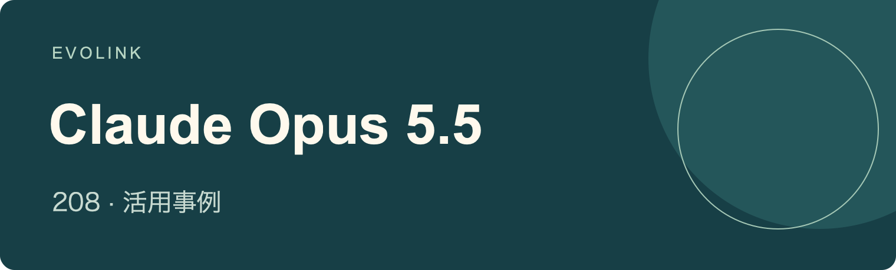

# Claude Opus 5.5 活用事例
出典に基づくワークフロー、デモ、比較、制約

## 🍌 はじめに

**Claude Opus 5.5 で制作・検証されたゲーム、3Dシーン、コーディングツール、研究、創作工程を紹介します。各事例は発信者へリンクし、元の主張が裏付ける範囲を維持しています。**

[EvoLink で Claude Opus 5.5 を確認する](https://evolink.ai/claude-opus-5-5?utm_source=github&utm_medium=readme&utm_campaign=awesome-claude-opus-5-5-usecases&utm_content=introduction_cta)

## 📊 概要

創作、開発、研究、評価にわたる **Claude Opus 5.5 の208事例** を厳選しています。

- 公式ガイドと併せて、コミュニティのデモ、工程、比較、記録された制約を確認できます。
- 各事例には元の出典、発信者、公開日、短い要点、出典に基づく説明を掲載しています。
- 目次から課題を選び、出典で公開されたツール、入力、結果を確認してください。

> [!NOTE]
> 各事例は発信者を明記した報告で、独立に再現した結果ではありません。ツールを使った映像や画像は、モデル自体によるメディア生成の証拠にはなりません。宣伝上の比較は発信者の主張として扱い、重複投稿は独立した実験に数えません。日付は出典の公開日（UTC）であり、取り込み日ではありません。

## ⚡ クイックスタート

1. [モデルページで現在の利用可否と能力を確認する](https://evolink.ai/claude-opus-5-5?utm_source=github&utm_medium=quickstart&utm_campaign=awesome-claude-opus-5-5-usecases&utm_content=model_link)
2. [EvoLink ダッシュボードで API キーを作成する](https://evolink.ai/dashboard/keys?utm_source=github&utm_medium=quickstart&utm_campaign=awesome-claude-opus-5-5-usecases&utm_content=api_key)
3. [モデルページにある専用 API ガイドまたは Agent 向け手順に従う](https://evolink.ai/docs/en/api-manual/language-series/claude/claude-messages-api?utm_source=github&utm_medium=docs&utm_campaign=awesome-claude-opus-5-5-usecases&utm_content=first_run)

## 📑 目次

| [概要](#overview) | [クイックスタート](#quick-start) | [関連リポジトリ](#related-repositories) | [謝辞](#acknowledge) |
|---|---|---|---|

| ケース | 分類 | 紹介内容 | 種類 |
|---|---|---|---|
| [ケース 1: 公式アカウントが紹介するスイカの短編](#case-1) | [公式ガイドと作例](#category-official) | 公式が紹介したスイカの短編を物語づくりの参考にしつつ、制作工程は未公開として扱う。 | Demo |
| [ケース 2: タスク全体を引き継ぐ](#case-2) | [公式ガイドと作例](#category-official) | タスク全体を委任する前に、完了条件と報告のタイミングを決める。 | Tutorial |
| [ケース 3: 侍ゲームの比較](#case-3) | [ゲーム開発](#category-games) | 侍ゲームの成果物を比べる際は、発信者による自社宣伝という背景を考慮する。 | Evaluation |
| [ケース 4: 1回の生成による Mario Kart](#case-4) | [ゲーム開発](#category-games) | プラットフォームの品質評価を受け入れる前に、1回で生成したというカートゲームの操作可能なキャラクターを確認する。 | Demo |
| [ケース 5: ブラウザー版 Minecraft クローン](#case-5) | [ゲーム開発](#category-games) | ブラウザー版 Minecraft のデモで、今回のゲーム生成が何を生み出したかを確認する。 | Demo |
| [ケース 6: HTML 1ファイルの機械仕掛けゲーム](#case-6) | [ゲーム開発](#category-games) | このデモを参考に、ゲームの映像と音声をプログラム生成する単一 HTML ファイル形式を検討する。 | Demo |
| [ケース 7: Roblox のアニメキャラ乱闘ゲーム](#case-7) | [ゲーム開発](#category-games) | 1回で生成したという乱闘ゲームを評価する際は、Roblox toolbox の素材を考慮する。 | Demo |
| [ケース 8: スパイダーマンゲームの3モデル比較](#case-8) | [ゲーム開発](#category-games) | 3つのスパイダーマンゲームを、共通の目に見えるゲーム要素で比較する。 | Evaluation |
| [ケース 9: 水の物理表現を備えた Minecraft クローン](#case-9) | [ゲーム開発](#category-games) | 報告された水の物理表現と、作者が述べた長い実行時間を併せて評価する。 | Demo |
| [ケース 10: DEAD SIGNAL の一人称シーン](#case-10) | [ゲーム開発](#category-games) | 同じプロンプトの一人称シーンを、プラットフォームの品質判断と分けて確認する。 | Evaluation |
| [ケース 11: コードで作る養蜂ゲーム](#case-11) | [ゲーム開発](#category-games) | 養蜂デモを参考に、ゲーム素材の描画と遊びの仕組みをコードで実装する方法を調べる。 | Demo |
| [ケース 12: スネークゲームのデモ](#case-12) | [ゲーム開発](#category-games) | スネークのデモを、生成されたゲームロジックと表現の小さな事例として確認する。 | Demo |
| [ケース 13: Sol と比較する3Dゲーム制作](#case-13) | [ゲーム開発](#category-games) | 展示された3Dゲームを比較し、プラットフォームの好みを独立した評価とみなさない。 | Evaluation |
| [ケース 14: 対戦・観戦できるマルチプレイビリヤード](#case-14) | [ゲーム開発](#category-games) | 報告されたマルチプレイ機能や利用状況を信頼する前に、リンク先のビリヤードを確認する。 | Demo |
| [ケース 15: Higgsfield API によるアーケードゲーム](#case-15) | [ゲーム開発](#category-games) | プラットフォーム API を使ったデモで、水面反射とアーケードの遊びを確認する。 | Integration |
| [ケース 16: Minecraft のブラウザー再現](#case-16) | [ゲーム開発](#category-games) | ブラウザー上の再現作品から、Minecraft クローンの試作範囲を確認する。 | Demo |
| [ケース 17: 配信視聴者と遊ぶ草刈りゲーム](#case-17) | [ゲーム開発](#category-games) | 個人サーバー上のマルチプレイ試作に、配信視聴者を招いてテストする方法を検討する。 | Demo |
| [ケース 18: ラスボス付き落書き風シューティング](#case-18) | [ゲーム開発](#category-games) | 1回で生成したというシューティングが、落書き風の表現と最後のボスをどう組み合わせたか確認する。 | Demo |
| [ケース 19: Medium 設定で生成した Mario](#case-19) | [ゲーム開発](#category-games) | Mario のデモを Medium 設定でのゲーム生成の参考にする。 | Demo |
| [ケース 20: カートレース映像の比較](#case-20) | [ゲーム開発](#category-games) | カート映像は目に見えるゲーム動作で比べ、そこから広いモデル能力を推測しない。 | Evaluation |
| [ケース 21: 同じプロンプトで GPT-6 Sol とゲーム比較](#case-21) | [ゲーム開発](#category-games) | 同じプロンプトで作られたゲームのリンクを開き、実際の遊び心地を比較する。 | Evaluation |
| [ケース 22: 1回で生成したスネーク](#case-22) | [ゲーム開発](#category-games) | 1回で生成したというスネークを、小規模な生成課題の参考にする。 | Demo |
| [ケース 23: Three.js のゾンビ戦ゲーム](#case-23) | [ゲーム開発](#category-games) | Three.js のデモから、素材ファイルなしで遊びの仕組み、質感、音を生成する方法を調べる。 | Demo |
| [ケース 24: 2回の調整を加えた雪景色ゲーム](#case-24) | [ゲーム開発](#category-games) | 映像と音が連動する雪のゲームには、調整回数と実行時間を見込む。 | Demo |
| [ケース 25: ゲーム機能追加と予告編編集](#case-25) | [ゲーム開発](#category-games) | 遊べるゲームと予告編を確認し、作者の協業開示も残す。 | Demo |
| [ケース 26: Tesana のマルチプレイ生存島](#case-26) | [ゲーム開発](#category-games) | 主張されたプレイ時間を信頼する前に、Tesana の島のマルチプレイ機構を確認する。 | Demo |
| [ケース 27: Unreal Engine のゲーム制作比較](#case-27) | [ゲーム開発](#category-games) | Higgsfield の制作環境を踏まえて、Unreal Engine のゲーム成果物を比較する。 | Evaluation |
| [ケース 28: Tesana のダークファンタジー RPG](#case-28) | [ゲーム開発](#category-games) | 協業の有無が未確定であることを残し、Tesana RPG のエリア、クエスト、音声会話の組み合わせを見る。 | Demo |
| [ケース 29: 騒音で格闘が始まるギター店](#case-29) | [ゲーム開発](#category-games) | 数百の演奏可能なギターを含む Three.js 店舗シミュレーターを拡張する前に、性能をテストする。 | Demo |
| [ケース 30: 手描き風チェスと指し手分析](#case-30) | [ゲーム開発](#category-games) | 手描き風の外観と指し手分析をチェスのデモがどう組み合わせたか確認する。 | Demo |
| [ケース 31: Kimi K3 と飛行シミュレーター比較](#case-31) | [ゲーム開発](#category-games) | 2つの飛行シミュレーターを選ぶ際は、動作と報告された費用を併せて比較する。 | Evaluation |
| [ケース 32: Tesana の1プロンプト幻想世界](#case-32) | [ゲーム開発](#category-games) | Tesana の幻想世界から、プラットフォームが遊び、音声、UI を統合した結果を確認する。 | Demo |
| [ケース 33: 10分以内で弓矢ゲームを構築](#case-33) | [ゲーム開発](#category-games) | 報告された10分未満の制作時間を一般化する前に、公開された弓矢ゲームを確認する。 | Demo |
| [ケース 34: Minecraft・Warcraft クローンを比較](#case-34) | [ゲーム開発](#category-games) | 公開されたゲームとプロンプトを比べる際は、推論設定、実行時間、推定費用の条件を残す。 | Evaluation |
| [ケース 35: Runescape Bench の成績と費用](#case-35) | [ゲーム開発](#category-games) | Runescape Bench の報告順位と費用は、そのゲーム課題に関する証拠として扱う。 | Evaluation |
| [ケース 36: 魚に餌をあげられるサンゴ礁壁紙](#case-36) | [対話型学習と可視化](#category-education) | 魚への餌やりを、環境映像の壁紙に操作を加える参考にする。 | Demo |
| [ケース 37: 配信中に制作した水のシミュレーション](#case-37) | [対話型学習と可視化](#category-education) | 表示された水のシミュレーションを、長い配信中に得られた1つの結果として確認する。 | Demo |
| [ケース 38: 動画を参考に3Dの水を再現](#case-38) | [対話型学習と可視化](#category-education) | 作者の再現度評価を受け入れる前に、水の再現を参考動画と比較する。 | Demo |
| [ケース 39: 層ごとに見る手の解剖デモ](#case-39) | [対話型学習と可視化](#category-education) | 層構造の解剖画面は確認しても、未検証の痛みや回復の提案には依存しない。 | Demo |
| [ケース 40: Kilo Code の草に触れるシミュレーター](#case-40) | [対話型学習と可視化](#category-education) | 草に触れるシミュレーターの成果物と、プラットフォームが報告した実行費用を併せて比較する。 | Evaluation |
| [ケース 41: 投石機のスケッチから3Dシミュレーション](#case-41) | [対話型学習と可視化](#category-education) | 投石機の展示をスケッチからシミュレーションへの参考にし、二次情報であることも残す。 | Demo |
| [ケース 42: 軌道や振り子の物理装置](#case-42) | [対話型学習と可視化](#category-education) | 機構シミュレーションの費用を見積もる際は、API 実行時間と待機を含む経過時間を分ける。 | Demo |
| [ケース 43: 重力による顔の変化](#case-43) | [対話型学習と可視化](#category-education) | 重力で変化する顔のデモを見る際は、協業の可能性に関する開示も残す。 | Demo |
| [ケース 44: つながるページで Web の仕組みを説明](#case-44) | [対話型学習と可視化](#category-education) | 相互リンク付き HTML を探索型の説明に使う方法を検討し、報告された長時間実行も見込む。 | Demo |
| [ケース 45: 分解して学ぶ3Dの眼球ページ](#case-45) | [対話型学習と可視化](#category-education) | 探索できる眼球のデモを、層構造の3D学習画面の参考にする。 | Evaluation |
| [ケース 46: 未完成の宇宙スケール体験](#case-46) | [対話型学習と可視化](#category-education) | 宇宙からプランクスケールまでの対話型制作を試す前に、利用量を確認する節目を決める。 | Limit |
| [ケース 47: Blender の10秒ショット比較](#case-47) | [3Dモデリングとシーン](#category-3d) | Blender のショットは、実行時間、token 使用量、API 換算費用と併せて比較する。 | Evaluation |
| [ケース 48: Jev を使った Unreal Engine のサンフランシスコ](#case-48) | [3Dモデリングとシーン](#category-3d) | Unreal Engine の街の動作を評価する際は、Jev の役割を考慮する。 | Integration |
| [ケース 49: 500種類の器具でジムを配置](#case-49) | [3Dモデリングとシーン](#category-3d) | ジム計画ツールを参考に、レンダリングした器具カタログと配置操作を組み合わせる。 | Demo |
| [ケース 50: 4モデルのロケット打ち上げ比較](#case-50) | [3Dモデリングとシーン](#category-3d) | 4つのロケット打ち上げを、プラットフォームが報告した時間と費用と併せて比較する。 | Evaluation |
| [ケース 51: 自転車に乗るペリカン](#case-51) | [3Dモデリングとシーン](#category-3d) | 自転車に乗るペリカンを、手順が記録された工程ではなく視覚的な成果物として確認する。 | Demo |
| [ケース 52: 1906年の地震前の Market Street](#case-52) | [3Dモデリングとシーン](#category-3d) | 歴史的正確さを確認するまでは、Market Street の場面を Blender による解釈として扱う。 | Demo |
| [ケース 53: Blender のペリカンループを Sol と比較](#case-53) | [3Dモデリングとシーン](#category-3d) | ペリカンのループを比較し、その魅力についてのプラットフォームの好みは分けて考える。 | Evaluation |
| [ケース 54: Blender 作品の紹介](#case-54) | [3Dモデリングとシーン](#category-3d) | 投稿に題材や工程の説明がないため、Blender の成果物を直接確認する。 | Demo |
| [ケース 55: Blender の風車制作工程](#case-55) | [3Dモデリングとシーン](#category-3d) | 風車の展示から、Blender のモデリング、リギング、質感、アニメーションをまとめた工程を見る。 | Demo |
| [ケース 56: コードで作るゴールデンゲートブリッジ](#case-56) | [3Dモデリングとシーン](#category-3d) | 作者の品質判断を受け入れる前に、コードで作った橋とリンク先の比較資料を照合する。 | Evaluation |
| [ケース 57: 火山島・水中生態系・オーロラ](#case-57) | [3Dモデリングとシーン](#category-3d) | 異なる2つの風景から確定的なモデル順位を導かない。 | Evaluation |
| [ケース 58: Blender で外骨格の関節を再設計](#case-58) | [3Dモデリングとシーン](#category-3d) | 機械的信頼性を検証するまでは、外骨格の再設計をモデリング案として扱う。 | Demo |
| [ケース 59: Cowork のソーラーパンク都市](#case-59) | [3Dモデリングとシーン](#category-3d) | ソーラーパンクの場面を、Cowork で3D環境を構築したという報告例として確認する。 | Demo |
| [ケース 60: Three.js で作るニューヨーク](#case-60) | [3Dモデリングとシーン](#category-3d) | ニューヨークの2つの出力では、描画ループとカメラ移動も確認する。 | Evaluation |
| [ケース 61: もう1つの自転車ペリカン作品](#case-61) | [3Dモデリングとシーン](#category-3d) | この自転車ペリカン作品を、同じ題材の追加の視覚資料として確認する。 | Demo |
| [ケース 62: Blender の新幹線モデル](#case-62) | [3Dモデリングとシーン](#category-3d) | プラットフォームが報告した物体数と座席数を信頼する前に、新幹線モデルを確認する。 | Demo |
| [ケース 63: 画像をローポリ3Dに変換](#case-63) | [3Dモデリングとシーン](#category-3d) | 画像から3Dへの結果では、色の再現と併せて形状の細かさも評価する。 | Demo |
| [ケース 64: Tripo P2、JEF、MCP によるキャラクター制作](#case-64) | [3Dモデリングとシーン](#category-3d) | キャラクター制作を評価する際は、Tripo P2、JEF、Blender MCP の役割を考慮する。 | Integration |
| [ケース 65: 住宅写真と間取り図から3D化](#case-65) | [3Dモデリングとシーン](#category-3d) | 家の写真と間取り図を組み合わせ、ブラウザーで操作できるモデル試作を検討する。 | Demo |
| [ケース 66: ボトルシップの生成テスト](#case-66) | [3Dモデリングとシーン](#category-3d) | ボトルシップの構図を確認し、公開されていない制作工程は推測しない。 | Demo |
| [ケース 67: DeLorean・時計台・稲妻のアニメーション](#case-67) | [3Dモデリングとシーン](#category-3d) | アニメーションの動作と、各モデルの生成ツール利用、実行時間、推定費用を併せて比較する。 | Evaluation |
| [ケース 68: スケッチから完成住宅までの4段階](#case-68) | [3Dモデリングとシーン](#category-3d) | Three.js と TSL の段階別表示で、建物がスケッチから完成する過程を伝える。 | Demo |
| [ケース 69: 3D出力と報告された費用の比較](#case-69) | [3Dモデリングとシーン](#category-3d) | 展示された3D成果物と、プラットフォームが報告した費用の差を比較検討する。 | Evaluation |
| [ケース 70: 絵画から視点を変えられる場面へ](#case-70) | [3Dモデリングとシーン](#category-3d) | 絵画の展開例を、平面の構図を複数の3D角度から見るための参考にする。 | Integration |
| [ケース 71: 3D家具配置シミュレーター](#case-71) | [3Dモデリングとシーン](#category-3d) | 家具の配置を3Dシミュレーターで比較してから案を選ぶ方法を検討する。 | Demo |
| [ケース 72: 筆致を残して木炭画を3D化](#case-72) | [3Dモデリングとシーン](#category-3d) | 木炭画から Blender への変換が、描線の質感を3D場面にどう残したか確認する。 | Demo |
| [ケース 73: 地中海の港町を複数人で散策](#case-73) | [3Dモデリングとシーン](#category-3d) | 港の散策デモでは、プログラム生成の景色や音と、取り込んだ人物素材を区別する。 | Demo |
| [ケース 74: 3Dコントローラーのデモ](#case-74) | [3Dモデリングとシーン](#category-3d) | コントローラーのデモ、依頼された動画、引用された以前の SVG 課題を分けて確認する。 | Demo |
| [ケース 75: Minecraft 風の寺院庭園](#case-75) | [3Dモデリングとシーン](#category-3d) | 寺院の庭のプレビューを比べ、作者のモデルへの好みを一般化しない。 | Evaluation |
| [ケース 76: Blender のタコモデルとアニメーション](#case-76) | [3Dモデリングとシーン](#category-3d) | タコのモデルと動きを確認し、宣伝上の品質表現を評価等級として扱わない。 | Demo |
| [ケース 77: 旧版と同じ課題でニューヨーク比較](#case-77) | [3Dモデリングとシーン](#category-3d) | 同じニューヨークの課題を比較する際は、各モデルの版と推論設定を残す。 | Evaluation |
| [ケース 78: 複数の風景を巡る空中観光](#case-78) | [3Dモデリングとシーン](#category-3d) | 制作解説動画から、遊覧飛行が異なる風景をどうつないだかを確認する。 | Demo |
| [ケース 79: ボクセル風 Claude のアニメーション](#case-79) | [3Dモデリングとシーン](#category-3d) | ボクセルキャラクターのデモを、様式化した Claude のアニメーションの参考にする。 | Demo |
| [ケース 80: ボクセルのペリカンを Fable・Astra と比較](#case-80) | [3Dモデリングとシーン](#category-3d) | ボクセルのペリカンを比べ、token 使用量の主張は今回の試行に限定する。 | Evaluation |
| [ケース 81: GPT-6 Sol とレーシングカーを比較](#case-81) | [3Dモデリングとシーン](#category-3d) | レースカーのモデルを並べて確認し、示された出力以外の性能は推測しない。 | Evaluation |
| [ケース 82: GPU で加速する猫の毛の表現](#case-82) | [3Dモデリングとシーン](#category-3d) | 猫の毛のデモを、Three.js の GPU 加速シミュレーションの参考にする。 | Demo |
| [ケース 83: Minecraft のボクセル建築比較](#case-83) | [3Dモデリングとシーン](#category-3d) | 作者の Minecraft の好みと、まだ計画段階の正式な VoxelBench テストを分ける。 | Evaluation |
| [ケース 84: 3モデルのロケット宇宙船テスト](#case-84) | [3Dモデリングとシーン](#category-3d) | 3つのロケット船を比較する際は、推論設定の違いを考慮する。 | Evaluation |
| [ケース 85: Three.js の出力を Opus 5 と比較](#case-85) | [3Dモデリングとシーン](#category-3d) | リンク先の評価サイトで、Three.js 課題における Opus の版の比較を確認する。 | Evaluation |
| [ケース 86: Three.js の終末短編比較](#case-86) | [3Dモデリングとシーン](#category-3d) | 短編の比較前に、異なる実行環境、修正機会、推定費用を考慮する。 | Evaluation |
| [ケース 87: JavaScript でベース音楽を合成](#case-87) | [音楽とサウンド](#category-audio) | ベース音楽のデモを、JavaScript で直接音を合成する参考にする。 | Demo |
| [ケース 88: 音楽の誤り検出で満点との報告](#case-88) | [音楽とサウンド](#category-audio) | コラールの誤り検出満点は10抜粋での報告として扱い、広い検証を待つ。 | Evaluation |
| [ケース 89: 効果音を生成する工程](#case-89) | [音楽とサウンド](#category-audio) | 投稿に音の種類がないため、効果音の制作工程を直接確認する。 | Demo |
| [ケース 90: Pocket Color の外観グラフィック比較](#case-90) | [創作グラフィックスとアニメーション](#category-graphics) | 携帯機の画像は見える外観の細部で比べ、機器の機能は推測しない。 | Evaluation |
| [ケース 91: 18分31秒で Sweet Tooth アニメーション](#case-91) | [創作グラフィックスとアニメーション](#category-graphics) | 報告された1回生成の時間を一般化する前に、Sweet Tooth のアニメーションを確認する。 | Demo |
| [ケース 92: Claude と AGI を題材にしたアニメ](#case-92) | [創作グラフィックスとアニメーション](#category-graphics) | 漫画を視覚資料として使い、生成工程は未説明として扱う。 | Demo |
| [ケース 93: コードで作るピクセル魔法使い](#case-93) | [創作グラフィックスとアニメーション](#category-graphics) | コードによるピクセルアニメを見て、作者が述べるプロンプトは返信で確認する。 | Demo |
| [ケース 94: JavaScript でフレームごとに描くアニメーション](#case-94) | [創作グラフィックスとアニメーション](#category-graphics) | フレームを描いたアニメを、JavaScript の描画で動きを作る参考にする。 | Demo |
| [ケース 95: Nintendo Switch の SVG アニメーション](#case-95) | [創作グラフィックスとアニメーション](#category-graphics) | SVG アニメーションの要件と、Max 設定で報告されたセッション使用量を比較検討する。 | Evaluation |
| [ケース 96: 難問を考える様子をコードで表現](#case-96) | [創作グラフィックスとアニメーション](#category-graphics) | コードだけのアニメを問題解決の創作表現として扱い、モデル内部の工程説明とはみなさない。 | Demo |
| [ケース 97: 自転車に乗るペリカンのループ動画を紹介](#case-97) | [創作グラフィックスとアニメーション](#category-graphics) | 自転車の動きを確認し、共有されたループが二次紹介であることを残す。 | Demo |
| [ケース 98: PS5 コントローラーの SVG を同じ指示で比較](#case-98) | [創作グラフィックスとアニメーション](#category-graphics) | コントローラーの細部や陰影と、BridgeMind の宣伝上の品質判断を分けて比較する。 | Evaluation |
| [ケース 99: Devin で水面・粒子表現を比較](#case-99) | [創作グラフィックスとアニメーション](#category-graphics) | Devin の視覚出力を比べる際は、作者の所属関係、時間、費用の開示を残す。 | Evaluation |
| [ケース 100: Oktoberfest を題材にしたアニメーション](#case-100) | [創作グラフィックスとアニメーション](#category-graphics) | 報告された1回生成の時間を信頼する前に、オクトーバーフェストのアニメと案内を確認する。 | Demo |
| [ケース 101: JavaScript で音楽と映像を作る](#case-101) | [創作グラフィックスとアニメーション](#category-graphics) | 音楽と映像のデモを JavaScript の一例として扱い、広い制作工程の代替を示す証拠は限定的と考える。 | Demo |
| [ケース 102: JavaScript だけで作るインタラクティブなアニメーション](#case-102) | [創作グラフィックスとアニメーション](#category-graphics) | 外部素材や拡張を使わなかったという条件の下で、対話型アニメの JavaScript 利用を確認する。 | Demo |
| [ケース 103: 同じ参考映像で3モデルのアニメーションを比較](#case-103) | [創作グラフィックスとアニメーション](#category-graphics) | 3つのアニメを、共通入力と作者が報告した時間を踏まえて比較する。 | Evaluation |
| [ケース 104: 334行の SVG で Xbox コントローラーを描く](#case-104) | [創作グラフィックスとアニメーション](#category-graphics) | 短いコントローラー SVG を見る際も、Max 設定での高い token 使用量を考慮する。 | Demo |
| [ケース 105: TouchDesigner で参考エフェクトを再現](#case-105) | [創作グラフィックスとアニメーション](#category-graphics) | 参考映像の効果再現を評価する際は、TouchDesigner の役割を考慮する。 | Integration |
| [ケース 106: Game Boy のビジュアル生成テスト](#case-106) | [創作グラフィックスとアニメーション](#category-graphics) | 作者の好みを受け入れる前に、Game Boy の出力を自分で比較する。 | Evaluation |
| [ケース 107: JavaScript アニメーションの作品紹介](#case-107) | [創作グラフィックスとアニメーション](#category-graphics) | 完全な制作解説がないため、JavaScript アニメを成果物の参考として扱う。 | Demo |
| [ケース 108: CoAnimator でアニメーションと音を構成](#case-108) | [創作グラフィックスとアニメーション](#category-graphics) | CoAnimator が開発者自身のアプリで、アニメ、タイムライン、音をどう組み合わせるか確認する。 | Integration |
| [ケース 109: HyperFrames の3Dカメラと文字エフェクト](#case-109) | [創作グラフィックスとアニメーション](#category-graphics) | 3Dカメラと文字の効果を評価する際は、HyperFrames の役割を考慮する。 | Integration |
| [ケース 110: 5分未満で生成したピクセルアニメーション](#case-110) | [創作グラフィックスとアニメーション](#category-graphics) | ピクセルアニメを確認し、予告されたプロンプトは返信を参照する。 | Demo |
| [ケース 111: PNG 素材を使ったコントローラー SVG](#case-111) | [創作グラフィックスとアニメーション](#category-graphics) | SVG がすべてベクター描画だと説明する前に、埋め込み画像素材を確認する。 | Demo |
| [ケース 112: 参考から ChronoVolume エフェクトを再現](#case-112) | [創作グラフィックスとアニメーション](#category-graphics) | 再現された ChronoVolume を、参考素材とプラットフォームが報告した費用や時間と併せて比較する。 | Demo |
| [ケース 113: 同じプロンプトで噴水を生成](#case-113) | [創作グラフィックスとアニメーション](#category-graphics) | 共通プロンプトと最大の推論設定を踏まえて、噴水の出力を比較する。 | Evaluation |
| [ケース 114: SVG でモナリザを描く](#case-114) | [創作グラフィックスとアニメーション](#category-graphics) | 2つのモナリザ SVG を確認し、引用された比較側の推論設定も残す。 | Evaluation |
| [ケース 115: Sol・Luna と SVG の同じ課題を比較](#case-115) | [創作グラフィックスとアニメーション](#category-graphics) | 3モデルの SVG 比較は、見える出力と作者の個人的な判断に範囲を限定する。 | Evaluation |
| [ケース 116: Paint の人物画をマウスではなくスクリプトで作成](#case-116) | [創作グラフィックスとアニメーション](#category-graphics) | スクリプト画像が Paint の課題に合わない場合は、マウスのみの操作を指定して確認する。 | Limit |
| [ケース 117: Claude を小さな太陽として描く](#case-117) | [創作グラフィックスとアニメーション](#category-graphics) | 小さな太陽の作品を想像上の自画像課題として扱い、モデルの体験を示す証拠にはしない。 | Demo |
| [ケース 118: ペリカンの描画テスト](#case-118) | [創作グラフィックスとアニメーション](#category-graphics) | ペリカンの絵を、プロンプトと工程が得られない出力サンプルとして扱う。 | Demo |
| [ケース 119: ピクセルアートの噴水とコウモリの目](#case-119) | [創作グラフィックスとアニメーション](#category-graphics) | ピクセル場面の動く細部と、主観的な画風の好みを分けて比較する。 | Evaluation |
| [ケース 120: サンフランシスコを描く](#case-120) | [創作グラフィックスとアニメーション](#category-graphics) | サンフランシスコの絵を見る際は、未説明の制作ツールに帰属させない。 | Demo |
| [ケース 121: ペリカンの自転車アニメーションを Grok 4.7 と比較](#case-121) | [創作グラフィックスとアニメーション](#category-graphics) | 動きが安定しているという作者の判断を受け入れる前に、ペリカンのアニメを直接比較する。 | Evaluation |
| [ケース 122: 「subtle art」の一言からアート生成器を作る](#case-122) | [創作グラフィックスとアニメーション](#category-graphics) | リンク先のアート生成器を試す際は、作者のプラットフォームとの関係を残す。 | Demo |
| [ケース 123: John Wick を題材にしたリメイク動画](#case-123) | [創作グラフィックスとアニメーション](#category-graphics) | John Wick 風アニメを、生成工程が未公開の視覚資料として扱う。 | Demo |
| [ケース 124: 4段階の SVG 出力と max の失敗](#case-124) | [創作グラフィックスとアニメーション](#category-graphics) | 推論設定別の SVG と併せて、Max の token 枯渇と失敗試行の費用を確認する。 | Evaluation |
| [ケース 125: MacBook Pro を描く SVG ベンチマーク](#case-125) | [創作グラフィックスとアニメーション](#category-graphics) | MacBook Pro の SVG 結果は、Playcode 自身の特定課題の評価と製品判断として読む。 | Evaluation |
| [ケース 126: 個人サイトを反復改善し、各案を予告動画にする](#case-126) | [Webサイトと画面設計](#category-web) | 個人サイトの再設計記録に、反復的なデザイン批評と版の変遷を示す予告編を検討する。 | Demo |
| [ケース 127: 8枚の参考画像で鉱物図鑑風サイトを改善](#case-127) | [Webサイトと画面設計](#category-web) | 展示された鉱物カタログ風の仕上がりには、複数の参考資料と修正指示を見込む。 | Demo |
| [ケース 128: 同じ目標で既存アプリを再設計](#case-128) | [Webサイトと画面設計](#category-web) | 同じ既存アプリと提示された目標に照らして再設計を比較する。 | Evaluation |
| [ケース 129: フロントエンド評価で火山の課題が停止](#case-129) | [Webサイトと画面設計](#category-web) | フロントエンド生成を評価する際は、停止した試行と推論 token の使用も含める。 | Limit |
| [ケース 130: design skill を使わない関連ノートの画面](#case-130) | [Webサイトと画面設計](#category-web) | 関連ノートの画面を見ても、すべての機能が検証済みとは考えない。 | Demo |
| [ケース 131: 1回で生成した UI を Grok 4.7 と比較](#case-131) | [Webサイトと画面設計](#category-web) | 2つの UI を比較する際は、同じプロンプトでも実行日が異なることを残す。 | Evaluation |
| [ケース 132: 23分で作ったストレス解消アプリ](#case-132) | [Webサイトと画面設計](#category-web) | ストレス緩和アプリは試作として確認し、治療効果が実証されたとは考えない。 | Demo |
| [ケース 133: 雲と天気をテーマにした Stratus のページ](#case-133) | [Webサイトと画面設計](#category-web) | 天気を題材にしたランディングページを、報告費用と時間付きのデザイン参考にする。 | Demo |
| [ケース 134: 逆 CAPTCHA のインタラクティブなアプリ](#case-134) | [Webサイトと画面設計](#category-web) | 逆 CAPTCHA の操作を、曖昧な質問設計の実験として検討する。 | Demo |
| [ケース 135: Figma を取り込める個人用インタラクション設計ツール](#case-135) | [Webサイトと画面設計](#category-web) | 取り込んだデザイン参考と小さな修正を使い、画面操作を探索して学ぶ。 | Demo |
| [ケース 136: ローカルモデルを監視する PonteMLX](#case-136) | [Webサイトと画面設計](#category-web) | 監視画面を評価する際は、別のローカル画像生成モデルの役割も考慮する。 | Integration |
| [ケース 137: 物流スケジュール画面のプレビュー](#case-137) | [Webサイトと画面設計](#category-web) | バックエンドとスケジュール管理の動作を確認するまでは、物流の画像を画面の証拠として扱う。 | Demo |
| [ケース 138: WebGL を使うクリエイティブスタジオのサイト比較](#case-138) | [Webサイトと画面設計](#category-web) | 共通の WebGL、文字組み、スクロール要件に照らして制作スタジオのページを比べる。 | Evaluation |
| [ケース 139: アイソメトリックなアイコン部品の画面](#case-139) | [Webサイトと画面設計](#category-web) | 等角図コンポーネントの画面を見ても、画像が部品の機能を証明するとは考えない。 | Demo |
| [ケース 140: 携帯ゲーム機風のゲーム選択ページ](#case-140) | [Webサイトと画面設計](#category-web) | ゲーム起動を確認するまでは、携帯機風の選択ページを UI 展示として扱う。 | Demo |
| [ケース 141: 1回で生成した画像ベクター化ツール](#case-141) | [Webサイトと画面設計](#category-web) | 1回で生成したというベクター化ツールに依存する前に、異なる画像種別で変換精度をテストする。 | Demo |
| [ケース 142: 同じプロンプトで作る LP の比較集](#case-142) | [Webサイトと画面設計](#category-web) | 作者の好みを採用するのではなく、共通プロンプトに照らしてページ集を比較する。 | Evaluation |
| [ケース 143: AppLlama MCP で既存アプリを再設計](#case-143) | [Webサイトと画面設計](#category-web) | AppLlama を使った再設計と、既存アプリに帰属する売上を分ける。 | Integration |
| [ケース 144: 画像から HTML への再現度と性能](#case-144) | [Webサイトと画面設計](#category-web) | 画像から HTML への課題では、見た目の忠実さと併せて遷移と実行性能も確認する。 | Evaluation |
| [ケース 145: 100個の創造的な HTML を生成](#case-145) | [Webサイトと画面設計](#category-web) | 壊れたファイルがないという作者の主張を信頼する前に、公開 HTML を抽出してテストする。 | Demo |
| [ケース 146: Next.js の成功率と平均費用](#case-146) | [Webサイトと画面設計](#category-web) | 報告成功率と平均費用は、Next.js のフレームワーク固有の評価範囲で読む。 | Evaluation |
| [ケース 147: 10分の進行表作成で本来の成果物を逃す](#case-147) | [業務分析と文書](#category-business) | 中心となる成果物を先に要求し、予算と停止条件を明示する。 | Limit |
| [ケース 148: 検索上位347ページから SEO の未掲載論点を探す](#case-148) | [業務分析と文書](#category-business) | 報告された SEO 調査の範囲や草稿の規則遵守と、未測定の検索流入効果を分ける。 | Evaluation |
| [ケース 149: Trendtrack MCP でブラックフライデーを分析](#case-149) | [業務分析と文書](#category-business) | Black Friday 分析を評価する際は、Trendtrack MCP によるデータ取得を考慮する。 | Integration |
| [ケース 150: alphaXiv で論文を根拠付きブログに変換](#case-150) | [業務分析と文書](#category-business) | 自動生成された研究要約に依存する前に、論文にリンクされた証拠を確認する。 | Integration |
| [ケース 151: SafeForge のリスク要約ループで試す](#case-151) | [業務分析と文書](#category-business) | SafeForge のモデル評価を一般化する前に、評価方法と指標を求める。 | Evaluation |
| [ケース 152: ランキング画像のモデル数値を更新](#case-152) | [業務分析と文書](#category-business) | ベンチマーク画像の更新と、元の評価の再実行を区別する。 | Demo |
| [ケース 153: 同じ指示で指標を作るバージョン比較](#case-153) | [業務分析と文書](#category-business) | 指標の出力を比較し、未説明の検証方法は未解決として残す。 | Evaluation |
| [ケース 154: Web サイト URL から営業連絡フローを作る](#case-154) | [業務分析と文書](#category-business) | 営業支援製品が主張する送信能力と、未検証の返信率や売上成果を分ける。 | Integration |
| [ケース 155: Ramp の会計タスク評価](#case-155) | [業務分析と文書](#category-business) | Ramp が報告した費用と速度の改善は、Accounting Bench の実行に限定する。 | Evaluation |
| [ケース 156: fable-advisor で複数モデルをチーム化](#case-156) | [Agent と開発工程](#category-agents) | 協調チームの工程を採用する前に、公開プラグイン内のモデルの役割を確認する。 | Integration |
| [ケース 157: ntm でタスクを引き継ぎ worker を交代](#case-157) | [Agent と開発工程](#category-agents) | オーケストレーションツールでモデル版をまたいで作業者を替える際は、明確な引き継ぎを行う。 | Integration |
| [ケース 158: Apple Watch から Agent を操作](#case-158) | [Agent と開発工程](#category-agents) | 時計アプリの Agent 表示と音声指示を、作者の RSI の推測と分けて確認する。 | Demo |
| [ケース 159: effort 切り替え時もキャッシュを維持](#case-159) | [Agent と開発工程](#category-agents) | キャッシュを保つ推論設定変更の案内を使う際は、指定された Claude Code の版条件を残す。 | Tutorial |
| [ケース 160: T3 Code のモデルキャッシュを更新](#case-160) | [Agent と開発工程](#category-agents) | 想定したモデルが一覧にない場合は、T3 Code チームのキャッシュ更新手順に従う。 | Tutorial |
| [ケース 161: プロジェクトと Agent 履歴を振り返る](#case-161) | [Agent と開発工程](#category-agents) | セッション履歴の傾向を改善に変える前に、現在のコードと照合する。 | Tutorial |
| [ケース 162: ProgramBench の多 Agent 実行速度](#case-162) | [Agent と開発工程](#category-agents) | 複数 Agent の速度比較を解釈する際は、200題中166題という対象範囲を残す。 | Evaluation |
| [ケース 163: 100 Agent による ProgramBench 評価](#case-163) | [Agent と開発工程](#category-agents) | 100 Agent のベンチマークと、将来の協調機構に関する推測を分ける。 | Evaluation |
| [ケース 164: 同じ街頭動画で対象追跡ラベルを比較](#case-164) | [画像理解と注釈](#category-vision) | 動くラベルを確認しつつ、このプラットフォーム比較では精度が未測定と扱う。 | Evaluation |
| [ケース 165: Roboflow の物体検出評価](#case-165) | [画像理解と注釈](#category-vision) | Roboflow のランキングを、物体検出という特定課題の評価範囲で利用する。 | Evaluation |
| [ケース 166: Medeo で Seedance 2.5 を動かす比較](#case-166) | [動画編集と制作](#category-video) | 動画を指示する言語モデルを比較する際は、映像生成を Seedance 2.5 に帰属させる。 | Evaluation |
| [ケース 167: Claude の Web 画面から Blender でクレイアニメを作る](#case-167) | [動画編集と制作](#category-video) | Claude の1プロンプトでのクレイアニメ制作を評価する際は、Blender の役割を考慮する。 | Integration |
| [ケース 168: Tesseract で発表動画を作り直して費用比較](#case-168) | [動画編集と制作](#category-video) | Tesseract の編集と描画の役割を明示して、発表動画の再制作結果を比較する。 | Evaluation |
| [ケース 169: DocJev の紹介動画を制作](#case-169) | [動画編集と制作](#category-video) | 製品の予告編と、Jev に帰属する文書処理の中核を分ける。 | Demo |
| [ケース 170: 自作 skill で Claude モデルの歴史を制作](#case-170) | [動画編集と制作](#category-video) | JavaScript のモデル発展史動画を評価する際は、作者独自の skill を考慮する。 | Integration |
| [ケース 171: Medeo で折り紙のトラ動画を比較](#case-171) | [動画編集と制作](#category-video) | 折り紙動画の工程は、言語モデルが Seedance 2.5 を指示する事例として比較する。 | Evaluation |
| [ケース 172: Remotion で BridgeMind のパーカー広告を作る](#case-172) | [動画編集と制作](#category-video) | Remotion 宣伝動画の時間配分や転換と、発信者の主観的なモデル順位を分けて確認する。 | Integration |
| [ケース 173: Higgsfield の広告動画で時間と費用を比較](#case-173) | [動画編集と制作](#category-video) | 広告動画の時間と費用の比較は、プラットフォームが報告した制作証拠として扱う。 | Evaluation |
| [ケース 174: 発表投稿からコードだけで紹介動画を作る](#case-174) | [動画編集と制作](#category-video) | 発表投稿を制作指示の資料にし、映像と音をコードで作る紹介動画を検討する。 | Demo |
| [ケース 175: Claude の目で見る世界を定格アニメで紹介](#case-175) | [動画編集と制作](#category-video) | 共有されたストップモーションは、ツール構成が未説明の二次紹介として扱う。 | Demo |
| [ケース 176: 2秒から22秒へ伸ばした音楽付き動画](#case-176) | [動画編集と制作](#category-video) | 連続する動画の版を比較し、長さとコードによる音楽の変化を確認する。 | Demo |
| [ケース 177: Photoshop と Fusion で動画の描画エラーを修正](#case-177) | [動画編集と制作](#category-video) | Photoshop と Fusion の修正を見ても、主張された時間短縮が独立検証済みとは考えない。 | Integration |
| [ケース 178: Kotlin のサイトから紹介動画を作る](#case-178) | [動画編集と制作](#category-video) | サイトから Kotlin 紹介動画を作る工程では、HyperFrames skills の役割を考慮する。 | Integration |
| [ケース 179: 参考例に合わせて生の撮影素材を編集](#case-179) | [動画編集と制作](#category-video) | 個人の編集スタイルを求める際は、参考動画を渡して編集結果を直接確認する。 | Demo |
| [ケース 180: Coinacademy の記事を FLOP Labs の動画にする](#case-180) | [動画編集と制作](#category-video) | 既存の記事を、短い紹介動画の制作資料として使う方法を検討する。 | Demo |
| [ケース 181: GPT-6 Sol と動画出力を比較](#case-181) | [動画編集と制作](#category-video) | 動画の出力を比較しても、共通プロンプトや制作ツールを推測しない。 | Evaluation |
| [ケース 182: コードで serai の紹介動画を作る](#case-182) | [動画編集と制作](#category-video) | コードで作った serai の宣伝動画を見つつ、未説明の描画ツールは未解決として残す。 | Demo |
| [ケース 183: Cowork で Opus 5.5 自身の解説動画を作る](#case-183) | [動画編集と制作](#category-video) | 解説動画のモデルや価格の記述は、動画制作の成功とは別に事実確認する。 | Demo |
| [ケース 184: 動画の紹介と未実施の fal 連携案](#case-184) | [動画編集と制作](#category-video) | 展示された動画と、今後の構想である fal 連携を分ける。 | Demo |
| [ケース 185: UGC フォルダーから編集し文字を動かす](#case-185) | [動画編集と制作](#category-video) | UGC 編集の工程を評価する際は、Tesseract の文字アニメーションの役割を考慮する。 | Integration |
| [ケース 186: ゲームエンジンのアラビア文字解説動画](#case-186) | [動画編集と制作](#category-video) | コードによるアラビア文字解説を評価する際は、ロゴ画像と ElevenLabs 音声への依存を残す。 | Tutorial |
| [ケース 187: 水墨画の傘の物語とコードによる音楽](#case-187) | [動画編集と制作](#category-video) | 傘の物語を、コードによる映像と独自の音楽を組み合わせる参考にする。 | Demo |
| [ケース 188: 2つのリポジトリに埋めた105件のバグの修正比較](#case-188) | [コード保守とテスト](#category-coding) | バグ修正数と費用を比較する際は、試行回数の説明が揃っていない点を考慮する。 | Evaluation |
| [ケース 189: CS2 チートプログラム生成の自己申告例](#case-189) | [コード保守とテスト](#category-coding) | CS2 のプログラムは未検証の作者の主張として扱い、展示が動作を証明するとは考えない。 | Demo |
| [ケース 190: 進行中の circuit_eval チェックポイント評価](#case-190) | [コード保守とテスト](#category-coding) | circuit_eval の実行終了を待ってから、途中の進捗を最終結果として解釈する。 | Evaluation |
| [ケース 191: システム開発が安全分類器で中断](#case-191) | [コード保守とテスト](#category-coding) | 報告された保護機構の中断は、作者の未完了課題とセッションに範囲を限定する。 | Limit |
| [ケース 192: 自作 Web アプリの安全性をコードで確認](#case-192) | [コード保守とテスト](#category-coding) | ソースコードの安全性レビューと、アプリへの実際の安全性テストを区別する。 | Demo |
| [ケース 193: 12件のパッチの問題を探す](#case-193) | [コード保守とテスト](#category-coding) | パッチレビューの発見事項と API 換算費用を併せて比較し、費用が必ず下がるとは主張しない。 | Evaluation |
| [ケース 194: ゲーム開発の複雑なバグを修正](#case-194) | [コード保守とテスト](#category-coding) | ゲームのデバッグ成功は、公開された再現証拠のない初期の個人体験として扱う。 | Demo |
| [ケース 195: Khan Academy の PR レビューボット](#case-195) | [コード保守とテスト](#category-coding) | PR ボットの報告を、一チームによる費用、呼び出し数、時間、品質の計測参考にする。 | Integration |
| [ケース 196: 安全対策によるフォールバックと拒否](#case-196) | [コード保守とテスト](#category-coding) | 最後の拒否を Opus 5.5 に帰属させる前に、切り替え先のモデルを確認する。 | Limit |
| [ケース 197: CyScenarioBench の10課題を評価](#case-197) | [コード保守とテスト](#category-coding) | 報告された解決率は、CyScenarioBench の10課題の部分集合に限定する。 | Evaluation |
| [ケース 198: オプションの概念説明で文章を比較](#case-198) | [文章と解説](#category-writing) | 説明の抜粋を比較する際は、作者の早期アクセス開示を残す。 | Evaluation |
| [ケース 199: 森と川を背景にした物語の一節](#case-199) | [文章と解説](#category-writing) | 欠けた執筆要件を再構成せずに、物語の抜粋の文章を評価する。 | Demo |
| [ケース 200: リポジトリのスケジューラを説明](#case-200) | [文章と解説](#category-writing) | スケジューラーの技術説明を短くする際は、正確さと読者の反応を両方確認する。 | Demo |
| [ケース 201: 旧モデルの文書を簡潔に編集](#case-201) | [文章と解説](#category-writing) | 修正前後の見出しを、文章を簡潔にする具体例として使う。 | Demo |
| [ケース 202: 10体の Agent で最短経路アルゴリズムを探索](#case-202) | [科学研究と回路](#category-science) | 報告された最短経路の改善に依存する前に、独立した証明確認と再現を求める。 | Evaluation |
| [ケース 203: tscircuit で Bluetooth スピーカーの回路を比較](#case-203) | [科学研究と回路](#category-science) | 実機を製作して試験するまでは、tscircuit のスピーカー設計を回路図の展示として扱う。 | Evaluation |
| [ケース 204: 回路図作成の所要時間を比較](#case-204) | [科学研究と回路](#category-science) | 報告時間と回路図の出力を比較し、速度に基づく広い順位付けは暫定的に扱う。 | Evaluation |
| [ケース 205: ARC-AGI の成績と課題単位の費用](#case-205) | [科学研究と回路](#category-science) | ARC の成績と1課題当たりの費用は、評価者が報告した条件で解釈する。 | Evaluation |
| [ケース 206: Interaction Calculus の規則を記述](#case-206) | [科学研究と回路](#category-science) | 報告された計算規則の再現と、今後の Bend 書き直し案を分ける。 | Demo |
| [ケース 207: Paintbrush をマウス操作してモナリザを描く](#case-207) | [コンピューター操作](#category-computer-use) | マウス描画の結果を、共通制約とプラットフォームの報告時間・推定費用と併せて比較する。 | Evaluation |
| [ケース 208: Paint での描画操作を比較](#case-208) | [コンピューター操作](#category-computer-use) | 指定された描画操作を確認し、添付された比較動画と Opus の出力を区別する。 | Limit |

## 📘 公式ガイドと作例

### ケース 1: [公式アカウントが紹介するスイカの短編](https://x.com/claudeai/status/2102471866635919731) (投稿者 [@claudeai](https://x.com/claudeai))

**公式が紹介したスイカの短編を物語づくりの参考にしつつ、制作工程は未公開として扱う。**

Claude 公式アカウントが Kevin Ngo によるスイカの物語を Opus 5.5 の初期作例として紹介。公式による二次的な作品紹介で、制作工程を独立に再現したものではない。

<table>
<tr>
<td> <a href="https://video.twimg.com/amplify_video/2102467313874178048/vid/avc1/1080x1080/jvnZ3SyyxxajVatp.mp4?tag=29">出典の動画を再生 1</a></td>
</tr>
</table>

Type: Demo | Date: 2026-09-22

---

### ケース 2: [タスク全体を引き継ぐ](https://x.com/ClaudeDevs/status/2102491840612380934) (投稿者 [@ClaudeDevs](https://x.com/ClaudeDevs))

**タスク全体を委任する前に、完了条件と報告のタイミングを決める。**

公式ガイドは、完了条件と報告のタイミングを決めてタスク全体を渡す方法を紹介。重複する思考指示を省き、長時間実行後は続行に必要な情報を確認する。詳しい playbook へのリンク付き。

Type: Tutorial | Date: 2026-09-22

---

## 🧩 ゲーム開発

### ケース 3: [侍ゲームの比較](https://x.com/higgsfield_ai/status/2102471046356177001) (投稿者 [@higgsfield_ai](https://x.com/higgsfield_ai))

**侍ゲームの成果物を比べる際は、発信者による自社宣伝という背景を考慮する。**

Higgsfield が Opus 5.5 と GPT-6 Astra で制作した侍ゲームを比較する、自社プラットフォームの宣伝デモ。

<table>
<tr>
<td> <a href="https://video.twimg.com/amplify_video/2102470161328685056/vid/avc1/1122x1080/mkbbA1dMknaGX6nL.mp4?tag=29">出典の動画を再生 1</a></td>
</tr>
</table>

補足出典／統合した報告: [@RoundtableSpace](https://x.com/RoundtableSpace/status/2102537174742655341), [@EngMoElgaraihy](https://x.com/EngMoElgaraihy/status/2102488568564490521)

Type: Evaluation | Date: 2026-09-22

---

### ケース 4: [1回の生成による Mario Kart](https://x.com/bridgemindai/status/2102451997395866021) (投稿者 [@bridgemindai](https://x.com/bridgemindai))

**プラットフォームの品質評価を受け入れる前に、1回で生成したというカートゲームの操作可能なキャラクターを確認する。**

BridgeMind の宣伝デモで、マリオとルイージを操作できる Mario Kart ゲームを1回で生成したと紹介。Fable 5.1 より優れているという評価はプラットフォーム自身の所感。

<table>
<tr>
<td> <a href="https://video.twimg.com/amplify_video/2102451221483180032/vid/avc1/2098x1080/vHjQ8jI6WsTR-TPn.mp4?tag=29">出典の動画を再生 1</a></td>
</tr>
</table>

Type: Demo | Date: 2026-09-22

---

### ケース 5: [ブラウザー版 Minecraft クローン](https://x.com/noahwachnik/status/2102470200415166699) (投稿者 [@noahwachnik](https://x.com/noahwachnik))

**ブラウザー版 Minecraft のデモで、今回のゲーム生成が何を生み出したかを確認する。**

作者がブラウザーでテストした Minecraft クローンを公開し、今回のゲーム生成結果を示している。

<table>
<tr>
<td> <a href="https://video.twimg.com/amplify_video/2102469320001404928/vid/avc1/1920x1080/BwKBu8kazrg4aJph.mp4?tag=29">出典の動画を再生 1</a></td>
</tr>
</table>

Type: Demo | Date: 2026-09-22

---

### ケース 6: [HTML 1ファイルの機械仕掛けゲーム](https://x.com/edwinarbus/status/2102463453176979794) (投稿者 [@edwinarbus](https://x.com/edwinarbus))

**このデモを参考に、ゲームの映像と音声をプログラム生成する単一 HTML ファイル形式を検討する。**

アンティキティラ島の機械に着想を得たゲームのプラットフォーム宣伝デモ。約3 MBの単一 HTML ファイルで映像と音声をリアルタイムに生成すると紹介している。

<table>
<tr>
<td> <a href="https://video.twimg.com/amplify_video/2102461665086418944/vid/avc1/1350x1080/86T-JaewbcqfYnRH.mp4?tag=29">出典の動画を再生 1</a></td>
</tr>
</table>

Type: Demo | Date: 2026-09-22

---

### ケース 7: [Roblox のアニメキャラ乱闘ゲーム](https://x.com/WoahWurdz/status/2102487879809126834) (投稿者 [@WoahWurdz](https://x.com/WoahWurdz))

**1回で生成したという乱闘ゲームを評価する際は、Roblox toolbox の素材を考慮する。**

作者が Roblox toolbox だけを利用し、1回でアニメキャラクターの乱闘ゲームを生成したと報告。Fable より良いという評価は作者の所感で、ゲームは toolbox の素材を利用している。

<table>
<tr>
<td> <a href="https://video.twimg.com/amplify_video/2102487713282686976/vid/avc1/1462x1128/3fIlU8ItZxe_bOOQ.mp4?tag=29">出典の動画を再生 1</a></td>
</tr>
</table>

Type: Demo | Date: 2026-09-22

---

### ケース 8: [スパイダーマンゲームの3モデル比較](https://x.com/k2sbhai/status/2102487953302061481) (投稿者 [@k2sbhai](https://x.com/k2sbhai))

**3つのスパイダーマンゲームを、共通の目に見えるゲーム要素で比較する。**

作者がスパイダーマンのゲームを題材に、Opus 5.5、Fable 5.1、GPT-6 Astra の生成結果を比較している。

<table>
<tr>
<td> <a href="https://video.twimg.com/amplify_video/2102487804651720704/vid/avc1/1080x1920/R6XVPJWDvtaZ_lkN.mp4?tag=29">出典の動画を再生 1</a></td>
</tr>
</table>

Type: Evaluation | Date: 2026-09-22

---

### ケース 9: [水の物理表現を備えた Minecraft クローン](https://x.com/notjazii/status/2102480420923420790) (投稿者 [@notjazii](https://x.com/notjazii))

**報告された水の物理表現と、作者が述べた長い実行時間を併せて評価する。**

作者が水の物理表現やゲームの仕組みを含む Minecraft クローンと試遊リンクを公開。結果は Astra より良いと評価する一方、今回のモデルの実行は Astra より遅かったと述べている。

<table>
<tr>
<td> <a href="https://video.twimg.com/amplify_video/2102479783800279040/vid/avc1/1920x1080/7VsGtlHe2S5BRExC.mp4?tag=29">出典の動画を再生 1</a></td>
</tr>
</table>

Type: Demo | Date: 2026-09-22

---

### ケース 10: [DEAD SIGNAL の一人称シーン](https://x.com/bridgebench/status/2102469365903872306) (投稿者 [@bridgebench](https://x.com/bridgebench))

**同じプロンプトの一人称シーンを、プラットフォームの品質判断と分けて確認する。**

BridgeBench の自社宣伝で、同じプロンプトと課題による Opus 5.5 と GPT-6 Sol の結果を比較。メディアプレビューは DEAD SIGNAL の一人称シーンで、品質評価はプラットフォーム自身によるもの。

<table>
<tr>
<td> <a href="https://video.twimg.com/amplify_video/2102468957806501888/vid/avc1/1920x1080/CiEVMPgTSp380Wzs.mp4?tag=29">出典の動画を再生 1</a></td>
</tr>
</table>

Type: Evaluation | Date: 2026-09-22

---

### ケース 11: [コードで作る養蜂ゲーム](https://x.com/oguzthedev/status/2102476490344730950) (投稿者 [@oguzthedev](https://x.com/oguzthedev))

**養蜂デモを参考に、ゲーム素材の描画と遊びの仕組みをコードで実装する方法を調べる。**

作者が1つのプロンプトで養蜂ゲームを生成したと報告。画像素材は使わず、巣箱、花、ハチ、養蜂家をコードで描き、花植え、ハチの飛行、蜂蜜の収穫を含む。

<table>
<tr>
<td> <a href="https://video.twimg.com/amplify_video/2102475876294160385/vid/avc1/1880x1080/FNaYj1IdK9WsC2fz.mp4?tag=29">出典の動画を再生 1</a></td>
</tr>
</table>

Type: Demo | Date: 2026-09-22

---

### ケース 12: [スネークゲームのデモ](https://x.com/hakmgpt/status/2102453021590401220) (投稿者 [@hakmgpt](https://x.com/hakmgpt))

**スネークのデモを、生成されたゲームロジックと表現の小さな事例として確認する。**

作者が Opus 5.5 で制作したスネークゲームを、具体的なゲーム作品として紹介している。

<table>
<tr>
<td> <a href="https://video.twimg.com/amplify_video/2102452906083377152/vid/avc1/1080x1098/S7n7jTgko7JLgc7r.mp4?tag=29">出典の動画を再生 1</a></td>
</tr>
</table>

Type: Demo | Date: 2026-09-22

---

### ケース 13: [Sol と比較する3Dゲーム制作](https://x.com/higgsfield_ai/status/2102496940047094124) (投稿者 [@higgsfield_ai](https://x.com/higgsfield_ai))

**展示された3Dゲームを比較し、プラットフォームの好みを独立した評価とみなさない。**

Higgsfield が Opus 5.5 と GPT-6 Sol の3Dゲーム制作結果を比較する、自社プラットフォームの宣伝デモ。

<table>
<tr>
<td> <a href="https://video.twimg.com/amplify_video/2102496880412565504/vid/avc1/1080x1080/ILPIm5Y_fCgPCVC4.mp4?tag=29">出典の動画を再生 1</a></td>
</tr>
</table>

Type: Evaluation | Date: 2026-09-22

---

### ケース 14: [対戦・観戦できるマルチプレイビリヤード](https://x.com/BuiltByBilal/status/2102527003845075348) (投稿者 [@BuiltByBilal](https://x.com/BuiltByBilal))

**報告されたマルチプレイ機能や利用状況を信頼する前に、リンク先のビリヤードを確認する。**

作者は1回で生成したというマルチプレイビリヤードを紹介。8-ball、9-ball、スヌーカー、2v2、音声チャット、大会、レーティング、リプレイ、観戦、モバイルとブラウザー対応を含む。リンクを公開しているが、既存のプレイヤーの活動は作者の自己申告。

<table>
<tr>
<td> <a href="https://x.com/BuiltByBilal/status/2102527003845075348">出典の添付素材 1</a></td>
</tr>
</table>

Type: Demo | Date: 2026-09-22

---

### ケース 15: [Higgsfield API によるアーケードゲーム](https://x.com/higgsfield_ai/status/2102451096799330740) (投稿者 [@higgsfield_ai](https://x.com/higgsfield_ai))

**プラットフォーム API を使ったデモで、水面反射とアーケードの遊びを確認する。**

Higgsfield が自社 API で構築したゲームを宣伝デモとして紹介。水面の反射やアーケード形式の遊びを示している。

<table>
<tr>
<td> <a href="https://video.twimg.com/amplify_video/2102450921905283072/vid/avc1/1920x1080/_-dvpneN6xcP95tv.mp4?tag=29">出典の動画を再生 1</a></td>
</tr>
</table>

Type: Integration | Date: 2026-09-22

---

### ケース 16: [Minecraft のブラウザー再現](https://x.com/buildwithsid/status/2102461886247948571) (投稿者 [@buildwithsid](https://x.com/buildwithsid))

**ブラウザー上の再現作品から、Minecraft クローンの試作範囲を確認する。**

作者がブラウザー向けの Minecraft クローンを制作し、ゲーム再現の試みとして公開している。

<table>
<tr>
<td> <a href="https://video.twimg.com/amplify_video/2102459530349285376/vid/avc1/1804x1080/ws15ni5PzUk8TyOH.mp4?tag=29">出典の動画を再生 1</a></td>
</tr>
</table>

Type: Demo | Date: 2026-09-22

---

### ケース 17: [配信視聴者と遊ぶ草刈りゲーム](https://x.com/_MaxBlade/status/2102513817855094922) (投稿者 [@_MaxBlade](https://x.com/_MaxBlade))

**個人サーバー上のマルチプレイ試作に、配信視聴者を招いてテストする方法を検討する。**

作者がビールや葉巻の要素を含むマルチプレイ草刈りシミュレーターを紹介。自身のサーバーで公開し、配信視聴者が参加している。

<table>
<tr>
<td> <a href="https://video.twimg.com/amplify_video/2102513139124244480/vid/avc1/2560x1440/Unl1aBGvaAUEW4EJ.mp4?tag=29">出典の動画を再生 1</a></td>
</tr>
</table>

Type: Demo | Date: 2026-09-22

---

### ケース 18: [ラスボス付き落書き風シューティング](https://x.com/cherry_mx_reds/status/2102449525944099320) (投稿者 [@cherry_mx_reds](https://x.com/cherry_mx_reds))

**1回で生成したというシューティングが、落書き風の表現と最後のボスをどう組み合わせたか確認する。**

作者が1回で生成したという落書き風シューティングゲームを紹介。最後のボスも含まれる。

<table>
<tr>
<td> <a href="https://video.twimg.com/amplify_video/2102448437837090816/vid/avc1/1594x1080/G91X4KGDDEhMKyo_.mp4?tag=29">出典の動画を再生 1</a></td>
</tr>
</table>

Type: Demo | Date: 2026-09-22

---

### ケース 19: [Medium 設定で生成した Mario](https://x.com/benchmark_lb900/status/2102451991263990244) (投稿者 [@benchmark_lb900](https://x.com/benchmark_lb900))

**Mario のデモを Medium 設定でのゲーム生成の参考にする。**

作者が Medium 設定で生成した Mario ゲームを紹介している。

<table>
<tr>
<td> <a href="https://video.twimg.com/amplify_video/2102451787743797248/vid/avc1/1282x1220/s0orpWFvxMJ57pcP.mp4?tag=29">出典の動画を再生 1</a></td>
</tr>
</table>

Type: Demo | Date: 2026-09-22

---

### ケース 20: [カートレース映像の比較](https://x.com/k2sbhai/status/2102468855562178791) (投稿者 [@k2sbhai](https://x.com/k2sbhai))

**カート映像は目に見えるゲーム動作で比べ、そこから広いモデル能力を推測しない。**

投稿では Opus 5.5 と GPT-6 Sol を比較し、メディアプレビューでカートレースゲームの映像を示している。

<table>
<tr>
<td> <a href="https://video.twimg.com/amplify_video/2102468763182575616/vid/avc1/720x1188/KiitEAn5eNR9s9wu.mp4?tag=29">出典の動画を再生 1</a></td>
</tr>
</table>

Type: Evaluation | Date: 2026-09-22

---

### ケース 21: [同じプロンプトで GPT-6 Sol とゲーム比較](https://x.com/_MaxBlade/status/2102528632598274244) (投稿者 [@_MaxBlade](https://x.com/_MaxBlade))

**同じプロンプトで作られたゲームのリンクを開き、実際の遊び心地を比較する。**

作者が同じプロンプトでゲームを生成して Opus 5.5 と GPT-6 Sol を比較し、投稿の下にゲームのリンクを掲載したと説明している。

<table>
<tr>
<td> <a href="https://video.twimg.com/amplify_video/2102527771725504513/vid/avc1/1920x1080/RigEMEuahUcyTy2v.mp4?tag=29">出典の動画を再生 1</a></td>
</tr>
</table>

Type: Evaluation | Date: 2026-09-22

---

### ケース 22: [1回で生成したスネーク](https://x.com/xikhar/status/2102453761390383383) (投稿者 [@xikhar](https://x.com/xikhar))

**1回で生成したというスネークを、小規模な生成課題の参考にする。**

作者が1回の生成で作成したというスネークゲームを紹介している。

<table>
<tr>
<td> <a href="https://video.twimg.com/amplify_video/2102452659550822400/vid/avc1/1920x1080/UfYLBlAiXrFx66sd.mp4?tag=29">出典の動画を再生 1</a></td>
</tr>
</table>

Type: Demo | Date: 2026-09-22

---

### ケース 23: [Three.js のゾンビ戦ゲーム](https://x.com/intheworldofai/status/2102480675597115689) (投稿者 [@intheworldofai](https://x.com/intheworldofai))

**Three.js のデモから、素材ファイルなしで遊びの仕組み、質感、音を生成する方法を調べる。**

作者は約13,000行の Three.js で Call of Duty Zombies 風の遊びを制作。窓板の取り外し、Mystery Box、Pack-a-Punch、Jugg、Ray Gun、BO1 のラウンド機構を含む。素材ファイルはなく、質感、うなり声、短い効果音をコードで生成したと報告している。

<table>
<tr>
<td> <a href="https://video.twimg.com/amplify_video/2102480184016277504/vid/avc1/1920x1080/ScvFpMg0vzzzA4OU.mp4?tag=29">出典の動画を再生 1</a></td>
</tr>
</table>

Type: Demo | Date: 2026-09-22

---

### ケース 24: [2回の調整を加えた雪景色ゲーム](https://x.com/jumperz/status/2102486361068425247) (投稿者 [@jumperz](https://x.com/jumperz))

**映像と音が連動する雪のゲームには、調整回数と実行時間を見込む。**

作者は最初のプロンプトと約2回の調整で雪景色のゲームを制作し、モデルは1時間以上動作したと説明。雪しぶき、木々、軌跡、光と影、効果音を紹介している。

<table>
<tr>
<td> <a href="https://video.twimg.com/amplify_video/2102485332616732672/vid/avc1/1920x1080/QPii18NhEh8uwx6v.mp4?tag=29">出典の動画を再生 1</a></td>
</tr>
</table>

Type: Demo | Date: 2026-09-22

---

### ケース 25: [ゲーム機能追加と予告編編集](https://x.com/ForwardEditor/status/2102501821931507772) (投稿者 [@ForwardEditor](https://x.com/ForwardEditor))

**遊べるゲームと予告編を確認し、作者の協業開示も残す。**

早期アクセスを得た作者による、協業として配信された投稿。ゲームへの新機能追加と予告編編集を紹介し、試遊リンクも公開している。

<table>
<tr>
<td> <a href="https://video.twimg.com/amplify_video/2102500851658924032/vid/avc1/1280x720/Gs6hGCiAUu3e5ge9.mp4?tag=29">出典の動画を再生 1</a></td>
</tr>
</table>

Type: Demo | Date: 2026-09-22

---

### ケース 26: [Tesana のマルチプレイ生存島](https://x.com/Thomas_jorgen/status/2102459329626652814) (投稿者 [@Thomas_jorgen](https://x.com/Thomas_jorgen))

**主張されたプレイ時間を信頼する前に、Tesana の島のマルチプレイ機構を確認する。**

作者は少数のプロンプトで Tesana に ARK 風のマルチプレイ生存島を作り、友人2人と遊んだと報告。クエスト、恐竜の手なずけ、製作、戦闘を含む。30+時間の内容という点も自己申告で、報告では未確認の協業の可能性が指摘されている。

<table>
<tr>
<td> <a href="https://video.twimg.com/amplify_video/2102458314160508928/vid/avc1/1920x1080/skP96ftk2mI0b20S.mp4?tag=29">出典の動画を再生 1</a></td>
</tr>
</table>

Type: Demo | Date: 2026-09-22

---

### ケース 27: [Unreal Engine のゲーム制作比較](https://x.com/higgsfield_ai/status/2102533401110802552) (投稿者 [@higgsfield_ai](https://x.com/higgsfield_ai))

**Higgsfield の制作環境を踏まえて、Unreal Engine のゲーム成果物を比較する。**

Higgsfield の自社プラットフォーム宣伝で、Opus 5.5 と GPT-6 Sol による Unreal Engine の3Dゲーム制作を比較している。

<table>
<tr>
<td> <a href="https://video.twimg.com/amplify_video/2102533127096934400/vid/avc1/1080x1080/E40DuI3LXeGg8JA0.mp4?tag=29">出典の動画を再生 1</a></td>
</tr>
</table>

Type: Evaluation | Date: 2026-09-22

---

### ケース 28: [Tesana のダークファンタジー RPG](https://x.com/Rubzem/status/2102457691956482160) (投稿者 [@Rubzem](https://x.com/Rubzem))

**協業の有無が未確定であることを残し、Tesana RPG のエリア、クエスト、音声会話の組み合わせを見る。**

作者が少量のプロンプトで Tesana にダークファンタジー RPG を制作したと報告。複数エリア、クエスト、音声付き会話を含む。報告では協業の可能性が指摘されているが、確定していない。

<table>
<tr>
<td> <a href="https://video.twimg.com/amplify_video/2102457033413038080/vid/avc1/1916x1080/J47BET3d55HKTEdm.mp4?tag=29">出典の動画を再生 1</a></td>
</tr>
</table>

Type: Demo | Date: 2026-09-22

---

### ケース 29: [騒音で格闘が始まるギター店](https://x.com/bijanbowen/status/2102532400353829356) (投稿者 [@bijanbowen](https://x.com/bijanbowen))

**数百の演奏可能なギターを含む Three.js 店舗シミュレーターを拡張する前に、性能をテストする。**

作者は300+の演奏可能なギターモデルと、騒音で起きる格闘を含む店のシミュレーターを紹介。Three.js の動作が重いと報告し、Blender/Godot での再制作は今後の計画で、完了した工程ではない。

<table>
<tr>
<td> <a href="https://video.twimg.com/amplify_video/2102531852363853824/vid/avc1/1920x1080/b-13Hr4nmh5HcvFi.mp4?tag=29">出典の動画を再生 1</a></td>
</tr>
</table>

Type: Demo | Date: 2026-09-22

---

### ケース 30: [手描き風チェスと指し手分析](https://x.com/higgsfield_ai/status/2102534514228822197) (投稿者 [@higgsfield_ai](https://x.com/higgsfield_ai))

**手描き風の外観と指し手分析をチェスのデモがどう組み合わせたか確認する。**

Higgsfield が自社宣伝のデモとして、手描き風のチェスと指し手の分析を紹介している。

<table>
<tr>
<td> <a href="https://video.twimg.com/amplify_video/2102534281038049280/vid/avc1/1440x1080/pSUEup1s_OPfPNsJ.mp4?tag=29">出典の動画を再生 1</a></td>
</tr>
</table>

Type: Demo | Date: 2026-09-22

---

### ケース 31: [Kimi K3 と飛行シミュレーター比較](https://x.com/adxtyahq/status/2102455768977170856) (投稿者 [@adxtyahq](https://x.com/adxtyahq))

**2つの飛行シミュレーターを選ぶ際は、動作と報告された費用を併せて比較する。**

作者が同じプロンプトで Opus 5.5 と Kimi K3 の飛行シミュレーターを比較。UI、複数のカメラ視点、音声を紹介し、両方とも滑らかに動作する一方、Kimi K3 の方が低コストだったと報告している。

<table>
<tr>
<td> <a href="https://video.twimg.com/amplify_video/2102455572750848000/vid/avc1/1816x1140/WWAmC5uDhH_y2oPd.mp4?tag=29">出典の動画を再生 1</a></td>
</tr>
</table>

Type: Evaluation | Date: 2026-09-22

---

### ケース 32: [Tesana の1プロンプト幻想世界](https://x.com/TesanaAI/status/2102494989683188029) (投稿者 [@TesanaAI](https://x.com/TesanaAI))

**Tesana の幻想世界から、プラットフォームが遊び、音声、UI を統合した結果を確認する。**

Tesana の自社宣伝デモで、1回のプロンプトから生成したという幻想世界を紹介。ゲームの遊び、システム、音声、UI を含む。

<table>
<tr>
<td> <a href="https://video.twimg.com/amplify_video/2102494178517393408/vid/avc1/1908x1080/Gl7GChOzmYEfvQL1.mp4?tag=29">出典の動画を再生 1</a></td>
</tr>
</table>

Type: Demo | Date: 2026-09-22

---

### ケース 33: [10分以内で弓矢ゲームを構築](https://x.com/BhavikY663/status/2102488215445983290) (投稿者 [@BhavikY663](https://x.com/BhavikY663))

**報告された10分未満の制作時間を一般化する前に、公開された弓矢ゲームを確認する。**

作者が弓矢ゲームを紹介し、構築からデプロイまで10分以内で完了したと報告している。

<table>
<tr>
<td> <a href="https://video.twimg.com/amplify_video/2102487312605282304/vid/avc1/1894x908/nC1fTviIGjTjFt0O.mp4?tag=29">出典の動画を再生 1</a></td>
<td> <a href="https://x.com/BhavikY663/status/2102488215445983290">出典の添付素材 2</a></td>
</tr>
<tr>
<td> <a href="https://x.com/BhavikY663/status/2102488215445983290">出典の添付素材 3</a></td>
</tr>
</table>

Type: Demo | Date: 2026-09-22

---

### ケース 34: [Minecraft・Warcraft クローンを比較](https://news.ycombinator.com/item?id=49807724) (投稿者 [@senko](https://news.ycombinator.com/user?id=senko))

**公開されたゲームとプロンプトを比べる際は、推論設定、実行時間、推定費用の条件を残す。**

作者は2種類のゲームについて Opus 5.5、Fable 5.1、Astra の遊べる成果物とプロンプトを公開。Opus は Claude Code の xhigh で約45分を要した。$11–14 は定額契約の使用量を API 料金に換算した推定額。

Type: Evaluation | Date: 2026-09-22

---

### ケース 35: [Runescape Bench の成績と費用](https://x.com/maxbittker/status/2102451744030490912) (投稿者 [@maxbittker](https://x.com/maxbittker))

**Runescape Bench の報告順位と費用は、そのゲーム課題に関する証拠として扱う。**

投稿者は Runescape Bench で Opus 5.5 が Astra に次ぐ2位、費用は約3分の1と報告。ゲーム課題の評価結果であり、プレイヤー体験やゲーム開発能力全般を示すものではない。

<table>
<tr>
<td> <a href="https://x.com/maxbittker/status/2102451744030490912">出典の添付素材 1</a></td>
</tr>
</table>

Type: Evaluation | Date: 2026-09-22

---

## 🧩 対話型学習と可視化

### ケース 36: [魚に餌をあげられるサンゴ礁壁紙](https://x.com/chaseleantj/status/2102480866404360215) (投稿者 [@chaseleantj](https://x.com/chaseleantj))

**魚への餌やりを、環境映像の壁紙に操作を加える参考にする。**

作者がサンゴ礁を題材にしたインタラクティブ壁紙を紹介。場面内の魚に餌をあげられる。

<table>
<tr>
<td> <a href="https://video.twimg.com/amplify_video/2102479905212473344/vid/avc1/1920x1080/wayY24Um6q4mzTVd.mp4?tag=29">出典の動画を再生 1</a></td>
</tr>
</table>

Type: Demo | Date: 2026-09-22

---

### ケース 37: [配信中に制作した水のシミュレーション](https://x.com/Avenoxai/status/2102500841097756743) (投稿者 [@Avenoxai](https://x.com/Avenoxai))

**表示された水のシミュレーションを、長い配信中に得られた1つの結果として確認する。**

作者がライブ配信中に水のシミュレーションを制作。この投稿は3つの結果のうち1つを紹介している。

<table>
<tr>
<td> <a href="https://video.twimg.com/amplify_video/2102500422355185664/vid/avc1/1920x1080/BOGmZuGWcsfynubs.mp4?tag=29">出典の動画を再生 1</a></td>
</tr>
</table>

Type: Demo | Date: 2026-09-22

---

### ケース 38: [動画を参考に3Dの水を再現](https://x.com/Aurelien_Gz/status/2102479887495758076) (投稿者 [@Aurelien_Gz](https://x.com/Aurelien_Gz))

**作者の再現度評価を受け入れる前に、水の再現を参考動画と比較する。**

作者が動画を参考に1回で生成した3Dの水の再現を紹介し、参考に近いと評価。引用した参考投稿は Grok 4.7 の水のデモ。

<table>
<tr>
<td> <a href="https://video.twimg.com/amplify_video/2102479821364142080/vid/avc1/1080x1724/aFlEwHrgDcqZeJzL.mp4?tag=29">出典の動画を再生 1</a></td>
</tr>
</table>

Type: Demo | Date: 2026-09-22

---

### ケース 39: [層ごとに見る手の解剖デモ](https://x.com/higgsfield_ai/status/2102517718754943254) (投稿者 [@higgsfield_ai](https://x.com/higgsfield_ai))

**層構造の解剖画面は確認しても、未検証の痛みや回復の提案には依存しない。**

Higgsfield のプラットフォームデモで、骨、筋肉、腱を層ごとに表示し、カメラやクリックで痛む位置を指定する手の解剖画面を紹介。表示する原因の候補や回復の助言は検証されていない。

<table>
<tr>
<td> <a href="https://video.twimg.com/amplify_video/2102516830602694656/vid/avc1/1920x1440/YWdHkhGrtKK9F20r.mp4?tag=29">出典の動画を再生 1</a></td>
</tr>
</table>

Type: Demo | Date: 2026-09-22

---

### ケース 40: [Kilo Code の草に触れるシミュレーター](https://x.com/coldopn/status/2102474335172640989) (投稿者 [@coldopn](https://x.com/coldopn))

**草に触れるシミュレーターの成果物と、プラットフォームが報告した実行費用を併せて比較する。**

プラットフォームの宣伝として Kilo Code で草に触れるシミュレーターを比較。今回の実行費用は Grok 4.7 が3.52ドル、Opus 5.5 が7.35ドルという自己申告。

<table>
<tr>
<td> <a href="https://video.twimg.com/amplify_video/2102474210299834368/vid/avc1/1920x1080/dVDcRcsC2R5sj_3g.mp4?tag=29">出典の動画を再生 1</a></td>
</tr>
</table>

Type: Evaluation | Date: 2026-09-22

---

### ケース 41: [投石機のスケッチから3Dシミュレーション](https://x.com/brainextends/status/2102464008112755026) (投稿者 [@brainextends](https://x.com/brainextends))

**投石機の展示をスケッチからシミュレーションへの参考にし、二次情報であることも残す。**

投石機のスケッチを物理表現、操作、効果音付きの3Dシミュレーションに変えた作品を転載し、1つのプロンプトで作ったと紹介している。転載者による二次的な情報。

<table>
<tr>
<td> <a href="https://video.twimg.com/amplify_video/2102461645201268736/vid/avc1/1920x1080/IJV3a2Tr4NH_pPlV.mp4?tag=29">出典の動画を再生 1</a></td>
</tr>
</table>

Type: Demo | Date: 2026-09-22

---

### ケース 42: [軌道や振り子の物理装置](https://x.com/KinasRemek/status/2102509044581691862) (投稿者 [@KinasRemek](https://x.com/KinasRemek))

**機構シミュレーションの費用を見積もる際は、API 実行時間と待機を含む経過時間を分ける。**

プレビューには軌道、振り子の棒などの機構がある。作者の請求記録は API 実行52m 6s、$19.86。経過時間4h 21mには約3時間の待機が含まれ、連続したモデル作業ではない。

<table>
<tr>
<td> <a href="https://video.twimg.com/amplify_video/2102508620118212609/vid/avc1/1920x1080/ptCi9V6eXBAAb2B3.mp4?tag=29">出典の動画を再生 1</a></td>
</tr>
</table>

Type: Demo | Date: 2026-09-22

---

### ケース 43: [重力による顔の変化](https://x.com/adilinthewild/status/2102483257267003523) (投稿者 [@adilinthewild](https://x.com/adilinthewild))

**重力で変化する顔のデモを見る際は、協業の可能性に関する開示も残す。**

作者が Higgsfield で異なる重力による顔の変化を紹介。報告では協業の可能性が指摘されているが、確定していない。

<table>
<tr>
<td> <a href="https://video.twimg.com/amplify_video/2102483220801658880/vid/avc1/1440x1080/HR14txAqdWLnyA-2.mp4?tag=29">出典の動画を再生 1</a></td>
</tr>
</table>

Type: Demo | Date: 2026-09-22

---

### ケース 44: [つながるページで Web の仕組みを説明](https://x.com/nityeshaga/status/2102477553453998113) (投稿者 [@nityeshaga](https://x.com/nityeshaga))

**相互リンク付き HTML を探索型の説明に使う方法を検討し、報告された長時間実行も見込む。**

作者が Medium effort の1回の実行で Web の仕組みを説明する相互リンク付き HTML ページを制作。モデルは4時間以上動作したと報告し、体験リンクを公開している。

<table>
<tr>
<td> <a href="https://video.twimg.com/amplify_video/2102476824601407488/vid/avc1/1920x1080/3t-p0tA2b-YRsSXd.mp4?tag=29">出典の動画を再生 1</a></td>
</tr>
</table>

Type: Demo | Date: 2026-09-22

---

### ケース 45: [分解して学ぶ3Dの眼球ページ](https://x.com/higgsfield_ai/status/2102536138884092185) (投稿者 [@higgsfield_ai](https://x.com/higgsfield_ai))

**探索できる眼球のデモを、層構造の3D学習画面の参考にする。**

Higgsfield の自社宣伝デモで、眼球を分解して確認できる3D学習ページを紹介し、GPT-6 Sol の結果と比較している。

<table>
<tr>
<td> <a href="https://video.twimg.com/amplify_video/2102535899762565120/vid/avc1/1080x1280/3_-03uTkO43CbydA.mp4?tag=29">出典の動画を再生 1</a></td>
</tr>
</table>

Type: Evaluation | Date: 2026-09-22

---

### ケース 46: [未完成の宇宙スケール体験](https://x.com/Avinash25467/status/2102477459803508800) (投稿者 [@Avinash25467](https://x.com/Avinash25467))

**宇宙からプランクスケールまでの対話型制作を試す前に、利用量を確認する節目を決める。**

作者が観測可能な宇宙からプランクスケールまでをたどる対話型展示を試作したが、Max 5x の利用上限に達し、一部のみの完成にとどまった。

<table>
<tr>
<td> <a href="https://video.twimg.com/amplify_video/2102475078688739328/vid/avc1/2008x1080/4EGSlryQgo6_260X.mp4?tag=29">出典の動画を再生 1</a></td>
</tr>
</table>

Type: Limit | Date: 2026-09-22

---

## 🧩 3Dモデリングとシーン

### ケース 47: [Blender の10秒ショット比較](https://x.com/Stefan_3D_AI/status/2102471841046786153) (投稿者 [@Stefan_3D_AI](https://x.com/Stefan_3D_AI))

**Blender のショットは、実行時間、token 使用量、API 換算費用と併せて比較する。**

作者は同じ単一プロンプトと Blender のみを使い、プログラム生成の10秒ショットと制作タイムラプスを比較。報告では Opus は35m、出力199.6k token、API 換算で約$13.3、GPT-6 Astra は28m、56.6k token、約$14.5。

<table>
<tr>
<td> <a href="https://video.twimg.com/amplify_video/2102468034124464128/vid/avc1/1920x1080/izS4XbbTNf-6MAFA.mp4?tag=29">出典の動画を再生 1</a></td>
</tr>
</table>

補足出典／統合した報告: [@Rocketesla_KR](https://x.com/Rocketesla_KR/status/2102531379443679518)

Type: Evaluation | Date: 2026-09-22

---

### ケース 48: [Jev を使った Unreal Engine のサンフランシスコ](https://x.com/MatthewBerman/status/2102483668468195539) (投稿者 [@MatthewBerman](https://x.com/MatthewBerman))

**Unreal Engine の街の動作を評価する際は、Jev の役割を考慮する。**

作者が Unreal Engine で再現したサンフランシスコを紹介。人物、ペット、車両の行動は Jev が制御している。

<table>
<tr>
<td> <a href="https://video.twimg.com/amplify_video/2102483408551366656/vid/avc1/1762x1080/n91fsKuWg74fQd7p.mp4?tag=29">出典の動画を再生 1</a></td>
</tr>
</table>

Type: Integration | Date: 2026-09-22

---

### ケース 49: [500種類の器具でジムを配置](https://x.com/wesbos/status/2102450119975277027) (投稿者 [@wesbos](https://x.com/wesbos))

**ジム計画ツールを参考に、レンダリングした器具カタログと配置操作を組み合わせる。**

作者が500種類のフィットネス器具をレンダリングし、それらを使ったジムのレイアウトツールを制作したと紹介している。

<table>
<tr>
<td> <a href="https://video.twimg.com/amplify_video/2102448609593827328/vid/avc1/1274x1080/FIwyxONx4h1KlfUi.mp4?tag=29">出典の動画を再生 1</a></td>
</tr>
</table>

Type: Demo | Date: 2026-09-22

---

### ケース 50: [4モデルのロケット打ち上げ比較](https://x.com/bridgebench/status/2102476831031017581) (投稿者 [@bridgebench](https://x.com/bridgebench))

**4つのロケット打ち上げを、プラットフォームが報告した時間と費用と併せて比較する。**

BridgeBench の自社宣伝で、1つのプロンプトによる3Dロケット発射を4モデルで比較。報告費用と時間は GPT-6 Luna が$0.01未満／約1m、GPT-6 Sol が$0.11／1m、Grok 4.7 が$0.29／11m、Opus 5.5 が$1.52／12m。

<table>
<tr>
<td> <a href="https://video.twimg.com/amplify_video/2102476699703074816/vid/avc1/1920x1080/ekb2NrYtPP9nDxy3.mp4?tag=29">出典の動画を再生 1</a></td>
</tr>
</table>

Type: Evaluation | Date: 2026-09-22

---

### ケース 51: [自転車に乗るペリカン](https://x.com/cxjwin/status/2102460145951519077) (投稿者 [@cxjwin](https://x.com/cxjwin))

**自転車に乗るペリカンを、手順が記録された工程ではなく視覚的な成果物として確認する。**

作者が自転車に乗るペリカンを題材にした作品を紹介している。

<table>
<tr>
<td> <a href="https://video.twimg.com/amplify_video/2102460068092600320/vid/avc1/1670x1080/xBvUSubY7iPB6sJr.mp4?tag=29">出典の動画を再生 1</a></td>
</tr>
</table>

Type: Demo | Date: 2026-09-22

---

### ケース 52: [1906年の地震前の Market Street](https://x.com/alexalbert__/status/2102466523164274839) (投稿者 [@alexalbert__](https://x.com/alexalbert__))

**歴史的正確さを確認するまでは、Market Street の場面を Blender による解釈として扱う。**

プラットフォーム宣伝として、1つのプロンプトから1906年地震前のサンフランシスコ Market Street を Blender で再現したと紹介。「歴史的に正確」という表現は投稿者の主張。

<table>
<tr>
<td> <a href="https://video.twimg.com/amplify_video/2102465460545675264/vid/avc1/960x680/pI_d-60Nkkemn0zI.mp4?tag=29">出典の動画を再生 1</a></td>
</tr>
</table>

Type: Demo | Date: 2026-09-22

---

### ケース 53: [Blender のペリカンループを Sol と比較](https://x.com/atomic_chat_hq/status/2102492834485895265) (投稿者 [@atomic_chat_hq](https://x.com/atomic_chat_hq))

**ペリカンのループを比較し、その魅力についてのプラットフォームの好みは分けて考える。**

Atomic Chat の自社宣伝で、自転車に乗るペリカンの Blender ループアニメーションを、同じプロンプトの GPT-6 Sol と比較。「より魅力的」という評価はプラットフォーム自身によるもの。

<table>
<tr>
<td> <a href="https://video.twimg.com/amplify_video/2102492119449337856/vid/avc1/1920x1080/n-Z8m5l6RxxMmkfP.mp4?tag=29">出典の動画を再生 1</a></td>
</tr>
</table>

Type: Evaluation | Date: 2026-09-22

---

### ケース 54: [Blender 作品の紹介](https://x.com/superalesha/status/2102487989381156991) (投稿者 [@superalesha](https://x.com/superalesha))

**投稿に題材や工程の説明がないため、Blender の成果物を直接確認する。**

作者が Blender の作品を共有しているが、本文では具体的な制作対象を説明していない。

<table>
<tr>
<td> <a href="https://video.twimg.com/amplify_video/2102487325448028160/vid/avc1/1920x1080/CDO-KMFHFe-hxSjE.mp4?tag=29">出典の動画を再生 1</a></td>
</tr>
</table>

Type: Demo | Date: 2026-09-22

---

### ケース 55: [Blender の風車制作工程](https://x.com/higgsfield_ai/status/2102453658889953717) (投稿者 [@higgsfield_ai](https://x.com/higgsfield_ai))

**風車の展示から、Blender のモデリング、リギング、質感、アニメーションをまとめた工程を見る。**

Higgsfield の自社宣伝デモで、Blender の風車のモデリング、リギング、テクスチャー、アニメーションを15分で完成したと紹介している。

<table>
<tr>
<td> <a href="https://video.twimg.com/amplify_video/2102453598559055873/vid/avc1/1080x1920/etmIb_DtBCpTHJau.mp4?tag=29">出典の動画を再生 1</a></td>
</tr>
</table>

Type: Demo | Date: 2026-09-22

---

### ケース 56: [コードで作るゴールデンゲートブリッジ](https://x.com/petergyang/status/2102458049856479474) (投稿者 [@petergyang](https://x.com/petergyang))

**作者の品質判断を受け入れる前に、コードで作った橋とリンク先の比較資料を照合する。**

作者がコードだけで生成したゴールデンゲートブリッジの場面を紹介。3D表現は Astra と同等と主観的に評価し、比較動画も掲載している。

<table>
<tr>
<td> <a href="https://video.twimg.com/amplify_video/2102458011956711424/vid/avc1/1920x1080/bMcVm_7sVQqBZJhx.mp4?tag=16">出典の動画を再生 1</a></td>
</tr>
</table>

Type: Evaluation | Date: 2026-09-22

---

### ケース 57: [火山島・水中生態系・オーロラ](https://x.com/vib3coded/status/2102450239923720440) (投稿者 [@vib3coded](https://x.com/vib3coded))

**異なる2つの風景から確定的なモデル順位を導かない。**

作者が火山島、水中生物、植生、マンモス、オーロラを紹介し、費用は Opus 5 が1.6ドル、Opus 5.5 が3.4ドルと報告。映像は Astra に近いと感じる一方、異なる2つの場面だけで結論は出せないとも明記している。

<table>
<tr>
<td> <a href="https://video.twimg.com/amplify_video/2102450190217101312/vid/avc1/1920x720/1Db-WwJfI-4dKA9c.mp4?tag=29">出典の動画を再生 1</a></td>
</tr>
</table>

Type: Evaluation | Date: 2026-09-22

---

### ケース 58: [Blender で外骨格の関節を再設計](https://x.com/higgsfield_ai/status/2102449278283313303) (投稿者 [@higgsfield_ai](https://x.com/higgsfield_ai))

**機械的信頼性を検証するまでは、外骨格の再設計をモデリング案として扱う。**

Higgsfield は単一の39分、5.5 million token の実行で外骨格の弱点を分析し、関節まで含めて Blender の3Dモデルを再設計したと報告。機械的信頼性は検証されていない。

<table>
<tr>
<td> <a href="https://video.twimg.com/amplify_video/2102449110007869440/vid/avc1/1440x1440/se7-EmGCUFGrGNLZ.mp4?tag=29">出典の動画を再生 1</a></td>
</tr>
</table>

Type: Demo | Date: 2026-09-22

---

### ケース 59: [Cowork のソーラーパンク都市](https://x.com/danveloper/status/2102483043252424986) (投稿者 [@danveloper](https://x.com/danveloper))

**ソーラーパンクの場面を、Cowork で3D環境を構築したという報告例として確認する。**

作者が Cowork で構築したソーラーパンクの都市景観を紹介している。

<table>
<tr>
<td> <a href="https://video.twimg.com/amplify_video/2102482850184404992/vid/avc1/1278x846/aXQLGXAKHJXAxSMZ.mp4?tag=29">出典の動画を再生 1</a></td>
</tr>
</table>

Type: Demo | Date: 2026-09-22

---

### ケース 60: [Three.js で作るニューヨーク](https://x.com/aipulseda1ly/status/2102465200666370514) (投稿者 [@aipulseda1ly](https://x.com/aipulseda1ly))

**ニューヨークの2つの出力では、描画ループとカメラ移動も確認する。**

作者がタクシー、屋上、ブルックリン橋、セントラルパークを含む Three.js のニューヨークを GPT-6 Sol と比較。今回の Sol 出力には描画ループがなく、静止画面でカメラを動かせなかったと報告している。

<table>
<tr>
<td> <a href="https://video.twimg.com/amplify_video/2102464915155922944/vid/avc1/1280x1264/7LenXze_nG883sGq.mp4?tag=29">出典の動画を再生 1</a></td>
</tr>
</table>

Type: Evaluation | Date: 2026-09-22

---

### ケース 61: [もう1つの自転車ペリカン作品](https://x.com/riba2534/status/2102470079254556793) (投稿者 [@riba2534](https://x.com/riba2534))

**この自転車ペリカン作品を、同じ題材の追加の視覚資料として確認する。**

作者が Opus 5.5 で制作した、自転車に乗るペリカンの作品を紹介している。

<table>
<tr>
<td> <a href="https://x.com/riba2534/status/2102470079254556793">出典の添付素材 1</a></td>
<td> <a href="https://x.com/riba2534/status/2102470079254556793">出典の添付素材 2</a></td>
</tr>
<tr>
<td> <a href="https://x.com/riba2534/status/2102470079254556793">出典の添付素材 3</a></td>
<td> <a href="https://x.com/riba2534/status/2102470079254556793">出典の添付素材 4</a></td>
</tr>
</table>

Type: Demo | Date: 2026-09-22

---

### ケース 62: [Blender の新幹線モデル](https://x.com/higgsfield_ai/status/2102507018372436264) (投稿者 [@higgsfield_ai](https://x.com/higgsfield_ai))

**プラットフォームが報告した物体数と座席数を信頼する前に、新幹線モデルを確認する。**

Higgsfield のプラットフォームデモで新幹線の Blender モデルを紹介。5,112個のオブジェクトと430席を含むという数値はプラットフォームの自己申告。

<table>
<tr>
<td> <a href="https://video.twimg.com/amplify_video/2102506945357979648/vid/avc1/1920x1440/pKPWeGfkqx5z0Hxd.mp4?tag=29">出典の動画を再生 1</a></td>
</tr>
</table>

Type: Demo | Date: 2026-09-22

---

### ケース 63: [画像をローポリ3Dに変換](https://x.com/izutorishima/status/2102456991109230759) (投稿者 [@izutorishima](https://x.com/izutorishima))

**画像から3Dへの結果では、色の再現と併せて形状の細かさも評価する。**

作者が入力画像を1回で3D化。色の再現は良いと感じる一方、「ローポリすぎる」とも指摘しており、いずれも作者自身の所感。

<table>
<tr>
<td> <a href="https://x.com/izutorishima/status/2102456991109230759">出典の添付素材 1</a></td>
<td> <a href="https://x.com/izutorishima/status/2102456991109230759">出典の添付素材 2</a></td>
</tr>
</table>

Type: Demo | Date: 2026-09-22

---

### ケース 64: [Tripo P2、JEF、MCP によるキャラクター制作](https://x.com/luccacerf/status/2102478608274989225) (投稿者 [@luccacerf](https://x.com/luccacerf))

**キャラクター制作を評価する際は、Tripo P2、JEF、Blender MCP の役割を考慮する。**

協業配信のデモで Tripo P2、JEF、Blender MCP を組み合わせ、メッシュ、ウェイトペイント付き IK リギング、衣服、アニメーションを20分で制作したと報告。Astra なら約10時間と週次枠のリセット2回が必要という話は作者の推定で、同条件の実測ではない。

<table>
<tr>
<td> <a href="https://video.twimg.com/amplify_video/2102478453639421952/vid/avc1/1966x1080/pxlt3gYx7N7PQdxD.mp4?tag=29">出典の動画を再生 1</a></td>
</tr>
</table>

Type: Integration | Date: 2026-09-22

---

### ケース 65: [住宅写真と間取り図から3D化](https://x.com/higgsfield_ai/status/2102499166635352354) (投稿者 [@higgsfield_ai](https://x.com/higgsfield_ai))

**家の写真と間取り図を組み合わせ、ブラウザーで操作できるモデル試作を検討する。**

Higgsfield のデモで住宅写真1枚と間取り図を Blender モデルに変換し、オフラインのブラウザービューアーも制作。工事段階、透ける壁、家具付き室内のウォークスルーを見られる。

<table>
<tr>
<td> <a href="https://video.twimg.com/amplify_video/2102498661171429376/vid/avc1/1600x1280/seuoIgoK393CRt-K.mp4?tag=29">出典の動画を再生 1</a></td>
</tr>
</table>

Type: Demo | Date: 2026-09-22

---

### ケース 66: [ボトルシップの生成テスト](https://x.com/Conor_D_Dart/status/2102457201378075081) (投稿者 [@Conor_D_Dart](https://x.com/Conor_D_Dart))

**ボトルシップの構図を確認し、公開されていない制作工程は推測しない。**

作者がボトルシップを題材にした生成テストの結果を紹介している。

<table>
<tr>
<td> <a href="https://video.twimg.com/amplify_video/2102456712338841601/vid/avc1/1920x1080/Mqtjs0t7WsA_el7k.mp4?tag=29">出典の動画を再生 1</a></td>
</tr>
</table>

Type: Demo | Date: 2026-09-22

---

### ケース 67: [DeLorean・時計台・稲妻のアニメーション](https://x.com/Stefan_3D_AI/status/2102502889512194348) (投稿者 [@Stefan_3D_AI](https://x.com/Stefan_3D_AI))

**アニメーションの動作と、各モデルの生成ツール利用、実行時間、推定費用を併せて比較する。**

作者は同じプロンプトと Max effort で DeLorean、時計台、稲妻のアニメを比較。両方とも Higgsfield の Blender プラグインと MCP を使い、Nano Banana Pro と Tripo にアクセスできる。報告では Opus は73m／出力218k token／API 換算$27.3で、扉と車輪が動き稲妻が命中。GPT-6 Astra は88m／136k／$21.3で、生成器を使わず全517オブジェクトを自作した。

<table>
<tr>
<td> <a href="https://video.twimg.com/amplify_video/2102502715033313280/vid/avc1/1920x1080/c2cjexCnCmSQm-yJ.mp4?tag=29">出典の動画を再生 1</a></td>
</tr>
</table>

Type: Evaluation | Date: 2026-09-22

---

### ケース 68: [スケッチから完成住宅までの4段階](https://x.com/techartist_/status/2102503719762018434) (投稿者 [@techartist_](https://x.com/techartist_))

**Three.js と TSL の段階別表示で、建物がスケッチから完成する過程を伝える。**

作者が Three.js と TSL を使い、建築をスケッチ、ボリューム、詳細、完成住宅の4段階で変化させる表現を紹介している。

<table>
<tr>
<td> <a href="https://video.twimg.com/amplify_video/2102503194777759744/vid/avc1/1920x1272/t8cX-iwpsjQXi2oC.mp4?tag=29">出典の動画を再生 1</a></td>
</tr>
</table>

Type: Demo | Date: 2026-09-22

---

### ケース 69: [3D出力と報告された費用の比較](https://x.com/aimlapi/status/2102515672710533417) (投稿者 [@aimlapi](https://x.com/aimlapi))

**展示された3D成果物と、プラットフォームが報告した費用の差を比較検討する。**

AI/ML API の自社宣伝で3D出力を比較。報告された費用は Opus 5.5 が4.37ドル、GPT-6 Sol が0.34ドルで約13倍。品質評価はプラットフォーム自身によるもの。

<table>
<tr>
<td> <a href="https://video.twimg.com/amplify_video/2102515321844232193/vid/avc1/1874x1364/STEuP1iOH7NVNKYR.mp4?tag=29">出典の動画を再生 1</a></td>
</tr>
</table>

補足出典／統合した報告: [@testingcatalog](https://x.com/testingcatalog/status/2102523754186256535)

Type: Evaluation | Date: 2026-09-22

---

### ケース 70: [絵画から視点を変えられる場面へ](https://x.com/higgsfield_ai/status/2102514727956156600) (投稿者 [@higgsfield_ai](https://x.com/higgsfield_ai))

**絵画の展開例を、平面の構図を複数の3D角度から見るための参考にする。**

Higgsfield のプラットフォームデモで、絵画を Blender と Unreal Engine のシーンに展開し、異なる角度から見られる結果を紹介している。

<table>
<tr>
<td> <a href="https://video.twimg.com/amplify_video/2102513304363245568/vid/avc1/1920x1080/32m28m3tVmuYDyYa.mp4?tag=29">出典の動画を再生 1</a></td>
</tr>
</table>

Type: Integration | Date: 2026-09-22

---

### ケース 71: [3D家具配置シミュレーター](https://x.com/higgsfield_ai/status/2102510590468239373) (投稿者 [@higgsfield_ai](https://x.com/higgsfield_ai))

**家具の配置を3Dシミュレーターで比較してから案を選ぶ方法を検討する。**

Higgsfield のプラットフォームデモで、家具の異なる3D配置を試せるレイアウトシミュレーターを紹介している。

<table>
<tr>
<td> <a href="https://video.twimg.com/amplify_video/2102510447375380480/vid/avc1/1920x1080/r_KkI2cXkrStcbZG.mp4?tag=29">出典の動画を再生 1</a></td>
</tr>
</table>

Type: Demo | Date: 2026-09-22

---

### ケース 72: [筆致を残して木炭画を3D化](https://x.com/higgsfield_ai/status/2102519226099761608) (投稿者 [@higgsfield_ai](https://x.com/higgsfield_ai))

**木炭画から Blender への変換が、描線の質感を3D場面にどう残したか確認する。**

Higgsfield のプラットフォームデモで、木炭画を Blender の3Dシーンに変換し、元の筆致の質感を残した結果を紹介している。

<table>
<tr>
<td> <a href="https://video.twimg.com/amplify_video/2102519117756641280/vid/avc1/1080x1080/fHf50hAmOIOh3Csf.mp4?tag=29">出典の動画を再生 1</a></td>
</tr>
</table>

Type: Demo | Date: 2026-09-22

---

### ケース 73: [地中海の港町を複数人で散策](https://x.com/karankendre/status/2102475904752754923) (投稿者 [@karankendre](https://x.com/karankendre))

**港の散策デモでは、プログラム生成の景色や音と、取り込んだ人物素材を区別する。**

作者がブラウザー上で複数人で歩ける地中海の港町を紹介。場面と音はプログラム生成だが、人物には読み込んだスキャン素材を使用している。

<table>
<tr>
<td> <a href="https://video.twimg.com/amplify_video/2102474431834861568/vid/avc1/1894x996/PeiaAtcPEK-ztlms.mp4?tag=29">出典の動画を再生 1</a></td>
</tr>
</table>

Type: Demo | Date: 2026-09-22

---

### ケース 74: [3Dコントローラーのデモ](https://x.com/marmaduke091/status/2102506267755639143) (投稿者 [@marmaduke091](https://x.com/marmaduke091))

**コントローラーのデモ、依頼された動画、引用された以前の SVG 課題を分けて確認する。**

作者がコントローラーの3D版を1回で生成し、モデルに共有用動画も作らせたと報告。引用投稿では、その前に Claude Code で Xbox コントローラーの SVG を制作したと説明している。

<table>
<tr>
<td> <a href="https://video.twimg.com/amplify_video/2102505788438638592/vid/avc1/1920x1080/KQ4HsCHWj7vOKXdU.mp4?tag=29">出典の動画を再生 1</a></td>
</tr>
</table>

Type: Demo | Date: 2026-09-22

---

### ケース 75: [Minecraft 風の寺院庭園](https://x.com/notjazii/status/2102499296512025026) (投稿者 [@notjazii](https://x.com/notjazii))

**寺院の庭のプレビューを比べ、作者のモデルへの好みを一般化しない。**

作者が Opus 5.5 と GPT-6 Astra を比較し、プレビューでは Minecraft 風の寺院庭園を紹介。優劣の判断は今回のテストに対する作者の所感。

<table>
<tr>
<td> <a href="https://x.com/notjazii/status/2102499296512025026">出典の添付素材 1</a></td>
<td> <a href="https://x.com/notjazii/status/2102499296512025026">出典の添付素材 2</a></td>
</tr>
</table>

Type: Evaluation | Date: 2026-09-22

---

### ケース 76: [Blender のタコモデルとアニメーション](https://x.com/higgsfield_ai/status/2102526940859232433) (投稿者 [@higgsfield_ai](https://x.com/higgsfield_ai))

**タコのモデルと動きを確認し、宣伝上の品質表現を評価等級として扱わない。**

Higgsfield のプラットフォームデモで、Blender のタコのモデリングとアニメーションを紹介。「AAA品質」は宣伝上の表現で、独立に検証された品質評価ではない。

<table>
<tr>
<td> <a href="https://video.twimg.com/amplify_video/2102526840716115968/vid/avc1/1920x1440/zrQ_fyK4adTJQLrn.mp4?tag=29">出典の動画を再生 1</a></td>
</tr>
</table>

Type: Demo | Date: 2026-09-22

---

### ケース 77: [旧版と同じ課題でニューヨーク比較](https://x.com/aipulseda1ly/status/2102457160881905906) (投稿者 [@aipulseda1ly](https://x.com/aipulseda1ly))

**同じニューヨークの課題を比較する際は、各モデルの版と推論設定を残す。**

作者が同じニューヨーク課題で Opus 5.5 の High effort と Opus 5 を比較。エンパイア・ステート・ビル、ブルックリン橋、セントラルパークの木々、夕焼けの巻雲を含む。

<table>
<tr>
<td> <a href="https://video.twimg.com/amplify_video/2102456980002492416/vid/avc1/1280x1264/YftIx9f6m4YFCTa5.mp4?tag=29">出典の動画を再生 1</a></td>
</tr>
</table>

Type: Evaluation | Date: 2026-09-22

---

### ケース 78: [複数の風景を巡る空中観光](https://x.com/petergyang/status/2102518420285927598) (投稿者 [@petergyang](https://x.com/petergyang))

**制作解説動画から、遊覧飛行が異なる風景をどうつないだかを確認する。**

作者がディズニーの Soaring に着想を得た飛行体験を紹介。アルプス、オーロラ、ピラミッド、万里の長城、花火のあるパリの夜景を巡り、制作動画も掲載している。

<table>
<tr>
<td> <a href="https://video.twimg.com/amplify_video/2102518351289622528/vid/avc1/1920x1080/P8S3nlCVnsFVI0vs.mp4?tag=16">出典の動画を再生 1</a></td>
</tr>
</table>

Type: Demo | Date: 2026-09-22

---

### ケース 79: [ボクセル風 Claude のアニメーション](https://x.com/blueemi99/status/2102511304456212763) (投稿者 [@blueemi99](https://x.com/blueemi99))

**ボクセルキャラクターのデモを、様式化した Claude のアニメーションの参考にする。**

作者がボクセル風の Claude キャラクターとそのアニメーションを紹介している。

<table>
<tr>
<td> <a href="https://video.twimg.com/amplify_video/2102511211120050176/vid/avc1/1920x1080/UUUe7w_J2OYfiPoO.mp4?tag=29">出典の動画を再生 1</a></td>
</tr>
</table>

Type: Demo | Date: 2026-09-22

---

### ケース 80: [ボクセルのペリカンを Fable・Astra と比較](https://x.com/filicroval/status/2102453689252184365) (投稿者 [@filicroval](https://x.com/filicroval))

**ボクセルのペリカンを比べ、token 使用量の主張は今回の試行に限定する。**

作者が自転車に乗るボクセル風ペリカンを Fable、Astra と比較し、今回は token 消費も少なかったと報告。引用投稿では Fable の版を5.2と記載している。

<table>
<tr>
<td> <a href="https://video.twimg.com/amplify_video/2102453086815977473/vid/avc1/1920x1080/wupTL8Gxhx3utDGe.mp4?tag=29">出典の動画を再生 1</a></td>
</tr>
</table>

Type: Evaluation | Date: 2026-09-22

---

### ケース 81: [GPT-6 Sol とレーシングカーを比較](https://x.com/AI_Screening/status/2102478485646373033) (投稿者 [@AI_Screening](https://x.com/AI_Screening))

**レースカーのモデルを並べて確認し、示された出力以外の性能は推測しない。**

メディアプレビューでレーシングカーのモデルを示し、同じ課題に対する GPT-6 Sol の結果と比較している。

<table>
<tr>
<td> <a href="https://video.twimg.com/amplify_video/2102478330444537856/vid/avc1/1080x1124/eWLVlkoMKO-TcX0A.mp4?tag=29">出典の動画を再生 1</a></td>
</tr>
</table>

Type: Evaluation | Date: 2026-09-22

---

### ケース 82: [GPU で加速する猫の毛の表現](https://x.com/scottstts/status/2102498299190079933) (投稿者 [@scottstts](https://x.com/scottstts))

**猫の毛のデモを、Three.js の GPU 加速シミュレーションの参考にする。**

作者が1回で生成した Three.js の猫の毛のシミュレーションを紹介。毛の計算に GPU を利用している。

<table>
<tr>
<td> <a href="https://video.twimg.com/amplify_video/2102497141625077760/vid/avc1/1720x1080/rlUQfawdxn-0LaNB.mp4?tag=29">出典の動画を再生 1</a></td>
</tr>
</table>

Type: Demo | Date: 2026-09-22

---

### ケース 83: [Minecraft のボクセル建築比較](https://x.com/Angaisb_/status/2102493141668643084) (投稿者 [@Angaisb_](https://x.com/Angaisb_))

**作者の Minecraft の好みと、まだ計画段階の正式な VoxelBench テストを分ける。**

作者が Minecraft のボクセル建築で Opus 5.5 と GPT-6 Astra を主観的に比較。VoxelBench の正式テストはまだ計画段階。

<table>
<tr>
<td> <a href="https://x.com/Angaisb_/status/2102493141668643084">出典の添付素材 1</a></td>
</tr>
</table>

Type: Evaluation | Date: 2026-09-22

---

### ケース 84: [3モデルのロケット宇宙船テスト](https://x.com/RealFedeURU/status/2102450336472387899) (投稿者 [@RealFedeURU](https://x.com/RealFedeURU))

**3つのロケット船を比較する際は、推論設定の違いを考慮する。**

作者がロケット宇宙船を Opus 5.5 Medium、Grok 4.7 xhigh、Astra Medium で比較。推論設定は統一されていない。

<table>
<tr>
<td> <a href="https://video.twimg.com/amplify_video/2102449320985563136/vid/avc1/1920x1080/ZZO0I4KgdOZWir2-.mp4?tag=29">出典の動画を再生 1</a></td>
</tr>
</table>

Type: Evaluation | Date: 2026-09-22

---

### ケース 85: [Three.js の出力を Opus 5 と比較](https://x.com/NicolaManzini/status/2102472481151816101) (投稿者 [@NicolaManzini](https://x.com/NicolaManzini))

**リンク先の評価サイトで、Three.js 課題における Opus の版の比較を確認する。**

作者が Opus 5.5 と Opus 5 の Three.js コーディング結果を比較し、評価プラットフォームも紹介している。

<table>
<tr>
<td> <a href="https://video.twimg.com/amplify_video/2102471601002315776/vid/avc1/1972x1080/8OCjJwPyEIRAOUcj.mp4?tag=29">出典の動画を再生 1</a></td>
</tr>
</table>

Type: Evaluation | Date: 2026-09-22

---

### ケース 86: [Three.js の終末短編比較](https://x.com/thehypedotnews/status/2102527541051633903) (投稿者 [@thehypedotnews](https://x.com/thehypedotnews))

**短編の比較前に、異なる実行環境、修正機会、推定費用を考慮する。**

作者は Opus 5.5、Fable 5.1、GPT-6 Astra による遊園地、ゴーストタウン、原発の単一ファイル Three.js 短編を比較。全36ショットが描画できたとするが、Astra は指定の星空を欠いた。Opus/Fable は Claude Code で画像確認と修正を行い、Astra は OpenRouter の1返信のみ。Fable の費用と token は推定。報告総額は$19.38／約$9.20／$8.43、時間は約69／40／27mで、公平なモデル順位にはできない。

<table>
<tr>
<td> <a href="https://video.twimg.com/amplify_video/2102527016691990528/vid/avc1/1920x1080/WeNBWMBq_Z_sV9vi.mp4?tag=29">出典の動画を再生 1</a></td>
</tr>
</table>

Type: Evaluation | Date: 2026-09-22

---

## 🧩 音楽とサウンド

### ケース 87: [JavaScript でベース音楽を合成](https://x.com/aj_dev_smith/status/2102504509637587339) (投稿者 [@aj_dev_smith](https://x.com/aj_dev_smith))

**ベース音楽のデモを、JavaScript で直接音を合成する参考にする。**

作者が1つのプロンプトから JavaScript を使って合成したベース音楽を紹介している。

<table>
<tr>
<td> <a href="https://video.twimg.com/amplify_video/2102504223527346176/vid/avc1/1426x1080/nuY1-hmqdxLHqig8.mp4?tag=29">出典の動画を再生 1</a></td>
</tr>
</table>

Type: Demo | Date: 2026-09-22

---

### ケース 88: [音楽の誤り検出で満点との報告](https://x.com/aug5thmusic/status/2102451262260412453) (投稿者 [@aug5thmusic](https://x.com/aug5thmusic))

**コラールの誤り検出満点は10抜粋での報告として扱い、広い検証を待つ。**

作者が四声部コラール10曲の抜粋で声部進行の誤り検出を試験。Opus 5.5 は過去の GPT-6 Astra と Grok 4.7 に並ぶ満点と報告しているが、問題集と結果の一般化可能性は独立に検証されていない。

<table>
<tr>
<td> <a href="https://x.com/aug5thmusic/status/2102451262260412453">出典の添付素材 1</a></td>
</tr>
</table>

Type: Evaluation | Date: 2026-09-22

---

### ケース 89: [効果音を生成する工程](https://x.com/yugen_matuni/status/2102529143128916052) (投稿者 [@yugen_matuni](https://x.com/yugen_matuni))

**投稿に音の種類がないため、効果音の制作工程を直接確認する。**

作者が効果音生成の工程を紹介しているが、本文では具体的にどの音色を生成したかを説明していない。

<table>
<tr>
<td> <a href="https://x.com/yugen_matuni/status/2102529143128916052">出典の添付素材 1</a></td>
</tr>
</table>

Type: Demo | Date: 2026-09-22

---

## 🧩 創作グラフィックスとアニメーション

### ケース 90: [Pocket Color の外観グラフィック比較](https://x.com/Angaisb_/status/2102476249671082365) (投稿者 [@Angaisb_](https://x.com/Angaisb_))

**携帯機の画像は見える外観の細部で比べ、機器の機能は推測しない。**

作者が Opus 5.5 と GPT-6 Sol を比較。メディアプレビューでは Pocket Color 携帯ゲーム機の外観グラフィックを示している。

<table>
<tr>
<td> <a href="https://x.com/Angaisb_/status/2102476249671082365">出典の添付素材 1</a></td>
<td> <a href="https://x.com/Angaisb_/status/2102476249671082365">出典の添付素材 2</a></td>
</tr>
</table>

Type: Evaluation | Date: 2026-09-22

---

### ケース 91: [18分31秒で Sweet Tooth アニメーション](https://x.com/cherry_mx_reds/status/2102472218269900876) (投稿者 [@cherry_mx_reds](https://x.com/cherry_mx_reds))

**報告された1回生成の時間を一般化する前に、Sweet Tooth のアニメーションを確認する。**

作者は1回で生成したという Sweet Tooth アニメーションを紹介し、18分31秒かかったと報告している。

<table>
<tr>
<td> <a href="https://video.twimg.com/amplify_video/2102471444336611328/vid/avc1/1080x1080/Gq062pYx-yV3Tde7.mp4?tag=29">出典の動画を再生 1</a></td>
</tr>
</table>

Type: Demo | Date: 2026-09-22

---

### ケース 92: [Claude と AGI を題材にしたアニメ](https://x.com/other__reality/status/2102514581684052169) (投稿者 [@other__reality](https://x.com/other__reality))

**漫画を視覚資料として使い、生成工程は未説明として扱う。**

報告の動画抜き取り確認では、Claude のキャラクターと AGI を題材にしたカートゥーンだった。元の投稿本文では生成工程を公開していない。

<table>
<tr>
<td> <a href="https://video.twimg.com/amplify_video/2102514085137154048/vid/avc1/1280x720/k7-vfCveNwGQnk1v.mp4?tag=14">出典の動画を再生 1</a></td>
</tr>
</table>

Type: Demo | Date: 2026-09-22

---

### ケース 93: [コードで作るピクセル魔法使い](https://x.com/majidmanzarpour/status/2102476258948927543) (投稿者 [@majidmanzarpour](https://x.com/majidmanzarpour))

**コードによるピクセルアニメを見て、作者が述べるプロンプトは返信で確認する。**

作者がコードだけで制作したピクセル風の魔法使いアニメーションを紹介。プロンプトは返信内にあると説明している。

<table>
<tr>
<td> <a href="https://video.twimg.com/amplify_video/2102476231740399616/vid/avc1/1080x890/8wOPIn__IAkbl9ho.mp4?tag=29">出典の動画を再生 1</a></td>
</tr>
</table>

Type: Demo | Date: 2026-09-22

---

### ケース 94: [JavaScript でフレームごとに描くアニメーション](https://x.com/strawhatsu4/status/2102457111787745405) (投稿者 [@strawhatsu4](https://x.com/strawhatsu4))

**フレームを描いたアニメを、JavaScript の描画で動きを作る参考にする。**

作者は、Opus 5.5 が JavaScript で各フレームを描いたアニメーションを紹介している。

<table>
<tr>
<td> <a href="https://video.twimg.com/amplify_video/2102457077390299136/vid/avc1/1280x720/0GdMBFz95r0KPjMG.mp4?tag=14">出典の動画を再生 1</a></td>
</tr>
</table>

Type: Demo | Date: 2026-09-22

---

### ケース 95: [Nintendo Switch の SVG アニメーション](https://x.com/ishuagra02/status/2102451375724499350) (投稿者 [@ishuagra02](https://x.com/ishuagra02))

**SVG アニメーションの要件と、Max 設定で報告されたセッション使用量を比較検討する。**

作者は Max 設定で Nintendo Switch の SVG を生成し、Gemini 4 Pro と比較。参照したプロンプトにはコントローラーの装着と起動ロゴのアニメーションが含まれ、この生成で20ドルプランのセッション上限の27%を使ったという。

<table>
<tr>
<td> <a href="https://video.twimg.com/amplify_video/2102451356917276672/vid/avc1/1920x1080/opEdMmhd6w5w7QAk.mp4?tag=29">出典の動画を再生 1</a></td>
</tr>
</table>

Type: Evaluation | Date: 2026-09-22

---

### ケース 96: [難問を考える様子をコードで表現](https://x.com/chetaslua/status/2102478640428773861) (投稿者 [@chetaslua](https://x.com/chetaslua))

**コードだけのアニメを問題解決の創作表現として扱い、モデル内部の工程説明とはみなさない。**

作者は、モデルが難問を考える様子を想像した、コードだけで作られたアニメーションを紹介している。

<table>
<tr>
<td> <a href="https://video.twimg.com/amplify_video/2102478162211098624/vid/avc1/2560x1440/ULtHTYX5psqpaEXw.mp4?tag=29">出典の動画を再生 1</a></td>
</tr>
</table>

Type: Demo | Date: 2026-09-22

---

### ケース 97: [自転車に乗るペリカンのループ動画を紹介](https://x.com/NFT_Chen/status/2102449680793903561) (投稿者 [@NFT_Chen](https://x.com/NFT_Chen))

**自転車の動きを確認し、共有されたループが二次紹介であることを残す。**

自転車に乗るペリカンのループ動画を転載し、前輪を持ち上げる動きなどを紹介している。制作工程を独立に再現した記録ではなく、二次的な作品紹介。

<table>
<tr>
<td> <a href="https://video.twimg.com/amplify_video/2102447519674585088/vid/avc1/1280x720/a443IPw1hdNfSqS6.mp4?tag=29">出典の動画を再生 1</a></td>
</tr>
</table>

Type: Demo | Date: 2026-09-22

---

### ケース 98: [PS5 コントローラーの SVG を同じ指示で比較](https://x.com/bridgemindai/status/2102484711389966509) (投稿者 [@bridgemindai](https://x.com/bridgemindai))

**コントローラーの細部や陰影と、BridgeMind の宣伝上の品質判断を分けて比較する。**

BridgeMind が同じ PS5 コントローラーの SVG 生成指示で、Opus 5.5 と GPT-6 Sol の細部や陰影を比較。プラットフォーム自身による紹介で、優劣の判断も発信者によるもの。

<table>
<tr>
<td> <a href="https://x.com/bridgemindai/status/2102484711389966509">出典の添付素材 1</a></td>
<td> <a href="https://x.com/bridgemindai/status/2102484711389966509">出典の添付素材 2</a></td>
</tr>
</table>

Type: Evaluation | Date: 2026-09-22

---

### ケース 99: [Devin で水面・粒子表現を比較](https://x.com/notjazii/status/2102488657194254806) (投稿者 [@notjazii](https://x.com/notjazii))

**Devin の視覚出力を比べる際は、作者の所属関係、時間、費用の開示を残す。**

同じ Devin 実行環境、プロンプト、最高の推論設定で水面・粒子表現を比較。作者は Opus が2h 10mと$75、Astra が1h 25mと$61だったと報告。Cognition ambassador であることを開示しているが、投稿への報酬は未確認で、時間と費用は自己申告。

<table>
<tr>
<td> <a href="https://video.twimg.com/amplify_video/2102488109971808257/vid/avc1/2520x1080/l6D9gSC-gLs1C6nD.mp4?tag=29">出典の動画を再生 1</a></td>
</tr>
</table>

Type: Evaluation | Date: 2026-09-22

---

### ケース 100: [Oktoberfest を題材にしたアニメーション](https://x.com/cherry_mx_reds/status/2102493303388475855) (投稿者 [@cherry_mx_reds](https://x.com/cherry_mx_reds))

**報告された1回生成の時間を信頼する前に、オクトーバーフェストのアニメと案内を確認する。**

作者は1回で生成したという Oktoberfest のアニメーションを紹介し、14分48秒かかったと報告。投稿では下に制作方法を載せるとしている。

<table>
<tr>
<td> <a href="https://video.twimg.com/amplify_video/2102493087381487616/vid/avc1/1920x1080/dMwClUvawHddh2E2.mp4?tag=29">出典の動画を再生 1</a></td>
</tr>
</table>

Type: Demo | Date: 2026-09-22

---

### ケース 101: [JavaScript で音楽と映像を作る](https://x.com/chetaslua/status/2102482039522107417) (投稿者 [@chetaslua](https://x.com/chetaslua))

**音楽と映像のデモを JavaScript の一例として扱い、広い制作工程の代替を示す証拠は限定的と考える。**

作者は音楽とアニメーションを紹介し、すべて JavaScript のコードで作ったとしている。この例だけで一般的な音楽・動画生成を代替できるとは判断できない。

<table>
<tr>
<td> <a href="https://video.twimg.com/amplify_video/2102480439512539136/vid/avc1/1978x1080/ZRgMTxPF2khbJMCd.mp4?tag=29">出典の動画を再生 1</a></td>
</tr>
</table>

Type: Demo | Date: 2026-09-22

---

### ケース 102: [JavaScript だけで作るインタラクティブなアニメーション](https://x.com/chetaslua/status/2102501773705670994) (投稿者 [@chetaslua](https://x.com/chetaslua))

**外部素材や拡張を使わなかったという条件の下で、対話型アニメの JavaScript 利用を確認する。**

作者は操作できるアニメーションを紹介し、外部素材、MCP、skill を使わず、JavaScript だけで制作したと述べている。

<table>
<tr>
<td> <a href="https://video.twimg.com/amplify_video/2102501285840986112/vid/avc1/2560x1440/KNGdkncQUsYij81R.mp4?tag=29">出典の動画を再生 1</a></td>
</tr>
</table>

Type: Demo | Date: 2026-09-22

---

### ケース 103: [同じ参考映像で3モデルのアニメーションを比較](https://x.com/noclipepe/status/2102464238493012270) (投稿者 [@noclipepe](https://x.com/noclipepe))

**3つのアニメを、共通入力と作者が報告した時間を踏まえて比較する。**

作者は AIML API で同じプロンプト、参考、XHigh 設定を用い、Opus 5.5、GPT-6 Astra、Opus 5 の1回生成アニメを比較。報告時間は順に36:46、32:12、14:56。画質の判断は作者による。

<table>
<tr>
<td> <a href="https://video.twimg.com/amplify_video/2102464017474420737/vid/avc1/1080x1920/qRNa8HcyewqSs2zH.mp4?tag=29">出典の動画を再生 1</a></td>
</tr>
</table>

Type: Evaluation | Date: 2026-09-22

---

### ケース 104: [334行の SVG で Xbox コントローラーを描く](https://x.com/marmaduke091/status/2102453079836622940) (投稿者 [@marmaduke091](https://x.com/marmaduke091))

**短いコントローラー SVG を見る際も、Max 設定での高い token 使用量を考慮する。**

作者は Claude Code で Xbox ロゴを含むコントローラーを1回で生成し、SVG は334行だったと報告。Max effort では token 消費が大きいとも述べている。

<table>
<tr>
<td> <a href="https://x.com/marmaduke091/status/2102453079836622940">出典の添付素材 1</a></td>
</tr>
</table>

Type: Demo | Date: 2026-09-22

---

### ケース 105: [TouchDesigner で参考エフェクトを再現](https://x.com/higgsfield_ai/status/2102454774289539499) (投稿者 [@higgsfield_ai](https://x.com/higgsfield_ai))

**参考映像の効果再現を評価する際は、TouchDesigner の役割を考慮する。**

Higgsfield は Opus 5.5 が参考をもとに TouchDesigner で自社エフェクトを再現したと紹介し、15分かかったと報告。TouchDesigner を使う制作工程の事例。

<table>
<tr>
<td> <a href="https://video.twimg.com/amplify_video/2102454552201252864/vid/avc1/1440x1080/Oq9kWrdMjMJzv9ZV.mp4?tag=29">出典の動画を再生 1</a></td>
</tr>
</table>

Type: Integration | Date: 2026-09-22

---

### ケース 106: [Game Boy のビジュアル生成テスト](https://x.com/Angaisb_/status/2102453013776363887) (投稿者 [@Angaisb_](https://x.com/Angaisb_))

**作者の好みを受け入れる前に、Game Boy の出力を自分で比較する。**

作者は Opus 5.5 による Game Boy の描画課題の出力を示し、Astra 版より好みだと述べている。個別の視覚テストと主観的な評価。

<table>
<tr>
<td> <a href="https://video.twimg.com/amplify_video/2102452953382526976/vid/avc1/2560x1440/oie__f-0w5_JJKX6.mp4?tag=29">出典の動画を再生 1</a></td>
</tr>
</table>

Type: Evaluation | Date: 2026-09-22

---

### ケース 107: [JavaScript アニメーションの作品紹介](https://x.com/Hesamation/status/2102472597170528449) (投稿者 [@Hesamation](https://x.com/Hesamation))

**完全な制作解説がないため、JavaScript アニメを成果物の参考として扱う。**

作者は Opus 5.5 と JavaScript によるアニメーションを公開。投稿は完成例の紹介が中心で、制作手順の全体は示していない。

<table>
<tr>
<td> <a href="https://video.twimg.com/amplify_video/2102437792425070592/vid/avc1/1080x1080/nwtcZBGstdeV9nO_.mp4?tag=29">出典の動画を再生 1</a></td>
</tr>
</table>

補足出典／統合した報告: [@satori_sz9](https://x.com/satori_sz9/status/2102467374138212826)

Type: Demo | Date: 2026-09-22

---

### ケース 108: [CoAnimator でアニメーションと音を構成](https://x.com/rege_dev/status/2102498682931441977) (投稿者 [@rege_dev](https://x.com/rege_dev))

**CoAnimator が開発者自身のアプリで、アニメ、タイムライン、音をどう組み合わせるか確認する。**

CoAnimator の開発者は、Opus 5.5 と少数のプロンプトによるアニメーション、タイムライン、効果音、環境音を紹介。自身のアプリのデモで、品質の主張は作者による。

<table>
<tr>
<td> <a href="https://video.twimg.com/amplify_video/2102496943482286080/vid/avc1/1920x1080/gcnHTMNfXRqMH5wy.mp4?tag=29">出典の動画を再生 1</a></td>
</tr>
</table>

Type: Integration | Date: 2026-09-22

---

### ケース 109: [HyperFrames の3Dカメラと文字エフェクト](https://x.com/jake11moran/status/2102493361743839432) (投稿者 [@jake11moran](https://x.com/jake11moran))

**3Dカメラと文字の効果を評価する際は、HyperFrames の役割を考慮する。**

HyperFrames／HeyGen の関係者が、Opus 5.5 と HyperFrames による3Dカメラと文字エフェクトを紹介。自社ツールを組み合わせたデモ。

<table>
<tr>
<td> <a href="https://video.twimg.com/amplify_video/2102493076757581824/vid/avc1/1440x1080/UkSCNUOeVyj1wQtD.mp4?tag=29">出典の動画を再生 1</a></td>
</tr>
</table>

Type: Integration | Date: 2026-09-22

---

### ケース 110: [5分未満で生成したピクセルアニメーション](https://x.com/riku720720/status/2102515055116063144) (投稿者 [@riku720720](https://x.com/riku720720))

**ピクセルアニメを確認し、予告されたプロンプトは返信を参照する。**

作者はピクセルアニメーションを公開し、生成に5分もかからなかったと報告。プロンプトは返信欄に掲載すると述べている。

<table>
<tr>
<td> <a href="https://video.twimg.com/amplify_video/2102513096682336256/vid/avc1/1920x1080/mxQynDez08ynbTQy.mp4?tag=29">出典の動画を再生 1</a></td>
</tr>
</table>

Type: Demo | Date: 2026-09-22

---

### ケース 111: [PNG 素材を使ったコントローラー SVG](https://x.com/hysteresis_x/status/2102474525262643208) (投稿者 [@hysteresis_x](https://x.com/hysteresis_x))

**SVG がすべてベクター描画だと説明する前に、埋め込み画像素材を確認する。**

作者はコントローラーの SVG を紹介する一方、モデルが DualShock の PNG を取得したと指摘。既存画像が使われており、細部すべてをベクターパスで一から描いたとは判断できない。

<table>
<tr>
<td> <a href="https://x.com/hysteresis_x/status/2102474525262643208">出典の添付素材 1</a></td>
<td> <a href="https://x.com/hysteresis_x/status/2102474525262643208">出典の添付素材 2</a></td>
</tr>
<tr>
<td> <a href="https://x.com/hysteresis_x/status/2102474525262643208">出典の添付素材 3</a></td>
<td> <a href="https://x.com/hysteresis_x/status/2102474525262643208">出典の添付素材 4</a></td>
</tr>
</table>

Type: Demo | Date: 2026-09-22

---

### ケース 112: [参考から ChronoVolume エフェクトを再現](https://x.com/higgsfield_ai/status/2102508394976530445) (投稿者 [@higgsfield_ai](https://x.com/higgsfield_ai))

**再現された ChronoVolume を、参考素材とプラットフォームが報告した費用や時間と併せて比較する。**

Higgsfield が参考をもとに再現した ChronoVolume エフェクトを紹介。所要時間26分、token 費用5ドル未満という数値はプラットフォームの自己申告。

<table>
<tr>
<td> <a href="https://video.twimg.com/amplify_video/2102508274126077952/vid/avc1/1440x1080/WjLhj_tjguPEOgdc.mp4?tag=29">出典の動画を再生 1</a></td>
</tr>
</table>

Type: Demo | Date: 2026-09-22

---

### ケース 113: [同じプロンプトで噴水を生成](https://x.com/Angaisb_/status/2102509807802716649) (投稿者 [@Angaisb_](https://x.com/Angaisb_))

**共通プロンプトと最大の推論設定を踏まえて、噴水の出力を比較する。**

作者は「A beautiful fountain」という同じ指示を使い、最高推論設定の Opus 5.5 と GPT-6 Astra が作った噴水の表現を比較している。

<table>
<tr>
<td> <a href="https://x.com/Angaisb_/status/2102509807802716649">出典の添付素材 1</a></td>
<td> <a href="https://x.com/Angaisb_/status/2102509807802716649">出典の添付素材 2</a></td>
</tr>
</table>

Type: Evaluation | Date: 2026-09-22

---

### ケース 114: [SVG でモナリザを描く](https://x.com/diegocabezas01/status/2102463433731903630) (投稿者 [@diegocabezas01](https://x.com/diegocabezas01))

**2つのモナリザ SVG を確認し、引用された比較側の推論設定も残す。**

作者は Opus 5.5 に SVG でモナリザを描かせ、同じ課題を GPT-6 Astra High で実行した投稿を比較用に引用している。

<table>
<tr>
<td> <a href="https://x.com/diegocabezas01/status/2102463433731903630">出典の添付素材 1</a></td>
</tr>
</table>

Type: Evaluation | Date: 2026-09-22

---

### ケース 115: [Sol・Luna と SVG の同じ課題を比較](https://x.com/notjazii/status/2102469004271173877) (投稿者 [@notjazii](https://x.com/notjazii))

**3モデルの SVG 比較は、見える出力と作者の個人的な判断に範囲を限定する。**

作者は同じ SVG 課題で Opus 5.5、GPT-6 Sol、Luna の出力を示し、個人的な評価を述べている。投稿中のモデル全体への評価を、この1例の検証結果とは扱えない。

<table>
<tr>
<td> <a href="https://x.com/notjazii/status/2102469004271173877">出典の添付素材 1</a></td>
</tr>
</table>

Type: Evaluation | Date: 2026-09-22

---

### ケース 116: [Paint の人物画をマウスではなくスクリプトで作成](https://x.com/matiass/status/2102474745845260663) (投稿者 [@matiass](https://x.com/matiass))

**スクリプト画像が Paint の課題に合わない場合は、マウスのみの操作を指定して確認する。**

作者は上司の写真を Paint で描かせたが、モデルはマウス操作ではなくスクリプトを使った。意図した手描きのカーソル操作ではなく、コードで画像を作る方法が示された。

<table>
<tr>
<td> <a href="https://x.com/matiass/status/2102474745845260663">出典の添付素材 1</a></td>
</tr>
</table>

Type: Limit | Date: 2026-09-22

---

### ケース 117: [Claude を小さな太陽として描く](https://x.com/digi_dot_exe/status/2102486204419817954) (投稿者 [@digi_dot_exe](https://x.com/digi_dot_exe))

**小さな太陽の作品を想像上の自画像課題として扱い、モデルの体験を示す証拠にはしない。**

Claude であるとはどんな感じかを描くよう求められ、Opus 5.5 は圧倒されて記憶を瓶にしまう小さな太陽を描いた。擬人化した創作表現。

<table>
<tr>
<td> <a href="https://video.twimg.com/amplify_video/2102484064368459776/vid/avc1/1080x1350/mvxYEPFm2mYe6x9g.mp4?tag=29">出典の動画を再生 1</a></td>
</tr>
</table>

Type: Demo | Date: 2026-09-22

---

### ケース 118: [ペリカンの描画テスト](https://x.com/alexgetmancom/status/2102451293419970767) (投稿者 [@alexgetmancom](https://x.com/alexgetmancom))

**ペリカンの絵を、プロンプトと工程が得られない出力サンプルとして扱う。**

作者は Opus 5.5 によるペリカンの描画テスト結果を公開。本文には詳しいプロンプトや生成手順の記載はない。

<table>
<tr>
<td> <a href="https://x.com/alexgetmancom/status/2102451293419970767">出典の添付素材 1</a></td>
</tr>
</table>

Type: Demo | Date: 2026-09-22

---

### ケース 119: [ピクセルアートの噴水とコウモリの目](https://x.com/developedbyed/status/2102522318559858721) (投稿者 [@developedbyed](https://x.com/developedbyed))

**ピクセル場面の動く細部と、主観的な画風の好みを分けて比較する。**

作者は Opus 5.5 と GPT-6 Astra のピクセル風景を比較し、噴水の水と洞窟内のコウモリの目のアニメーションに注目している。スタイルの優劣は作者の主観的な評価。

<table>
<tr>
<td> <a href="https://video.twimg.com/amplify_video/2102521319891902465/vid/avc1/1440x1440/498lOSHSsdi1ZQWa.mp4?tag=29">出典の動画を再生 1</a></td>
</tr>
</table>

Type: Evaluation | Date: 2026-09-22

---

### ケース 120: [サンフランシスコを描く](https://x.com/Tim_Hua_/status/2102468957492092988) (投稿者 [@Tim_Hua_](https://x.com/Tim_Hua_))

**サンフランシスコの絵を見る際は、未説明の制作ツールに帰属させない。**

作者は Opus 5.5 で描いたサンフランシスコの作品を紹介。本文では具体的なツールや制作工程の全体は説明していない。

<table>
<tr>
<td> <a href="https://x.com/Tim_Hua_/status/2102468957492092988">出典の添付素材 1</a></td>
<td> <a href="https://x.com/Tim_Hua_/status/2102468957492092988">出典の添付素材 2</a></td>
</tr>
<tr>
<td> <a href="https://x.com/Tim_Hua_/status/2102468957492092988">出典の添付素材 3</a></td>
<td> <a href="https://x.com/Tim_Hua_/status/2102468957492092988">出典の添付素材 4</a></td>
</tr>
</table>

Type: Demo | Date: 2026-09-22

---

### ケース 121: [ペリカンの自転車アニメーションを Grok 4.7 と比較](https://x.com/berryxia/status/2102450486767124896) (投稿者 [@berryxia](https://x.com/berryxia))

**動きが安定しているという作者の判断を受け入れる前に、ペリカンのアニメを直接比較する。**

作者は Opus 5.5 と Grok 4.7 のペリカンが自転車に乗る動画を比較し、前者の動きが安定していると評価。発信者の展示と観察に基づく判断。

<table>
<tr>
<td> <a href="https://video.twimg.com/amplify_video/2102448528585027584/vid/avc1/1920x1080/DbWdeQtKg_iM4I6g.mp4?tag=29">出典の動画を再生 1</a></td>
</tr>
</table>

Type: Evaluation | Date: 2026-09-22

---

### ケース 122: [「subtle art」の一言からアート生成器を作る](https://x.com/felixrieseberg/status/2102450683069014053) (投稿者 [@felixrieseberg](https://x.com/felixrieseberg))

**リンク先のアート生成器を試す際は、作者のプラットフォームとの関係を残す。**

プラットフォーム関係者が「some subtle art」という指示で作ったアート生成器を紹介し、試せるリンクを提供。プラットフォーム側による作品紹介。

<table>
<tr>
<td> <a href="https://x.com/felixrieseberg/status/2102450683069014053">出典の添付素材 1</a></td>
</tr>
</table>

Type: Demo | Date: 2026-09-22

---

### ケース 123: [John Wick を題材にしたリメイク動画](https://x.com/cherry_mx_reds/status/2102518921240965578) (投稿者 [@cherry_mx_reds](https://x.com/cherry_mx_reds))

**John Wick 風アニメを、生成工程が未公開の視覚資料として扱う。**

作者は Opus 5.5 で John Wick を題材にリメイクしたアニメーションを紹介。本文では生成工程の全体は示していない。

<table>
<tr>
<td> <a href="https://video.twimg.com/amplify_video/2102518834376646657/vid/avc1/1920x1080/jwrTaybpDvFZzH2e.mp4?tag=29">出典の動画を再生 1</a></td>
</tr>
</table>

Type: Demo | Date: 2026-09-22

---

### ケース 124: [4段階の SVG 出力と max の失敗](https://news.ycombinator.com/item?id=49804862) (投稿者 [@simonw](https://news.ycombinator.com/user?id=simonw))

**推論設定別の SVG と併せて、Max の token 枯渇と失敗試行の費用を確認する。**

llm-anthropic で low・medium・high・xhigh の自転車に乗るペリカン SVG と実行コマンドを公開。max は回答前に出力予算128,000トークンを使い切り、その試行に2.56ドルかかった。

補足出典／統合した報告: [simonw](https://news.ycombinator.com/item?id=49805100)

Type: Evaluation | Date: 2026-09-22

---

### ケース 125: [MacBook Pro を描く SVG ベンチマーク](https://news.ycombinator.com/item?id=49807536) (投稿者 [@ianberdin](https://news.ycombinator.com/user?id=ianberdin))

**MacBook Pro の SVG 結果は、Playcode 自身の特定課題の評価と製品判断として読む。**

Playcode が自社の MacBook Pro SVG benchmark を共有し、良い結果を得るコストを評価。Opus 5.5 を既定モデルにしたとも述べている。ツール提供者自身による評価・宣伝。

Type: Evaluation | Date: 2026-09-22

---

## 🧩 Webサイトと画面設計

### ケース 126: [個人サイトを反復改善し、各案を予告動画にする](https://x.com/trq212/status/2102477340920152162) (投稿者 [@trq212](https://x.com/trq212))

**個人サイトの再設計記録に、反復的なデザイン批評と版の変遷を示す予告編を検討する。**

プラットフォーム関係者が Max 契約でデザインと批評を反復して個人サイトを再設計し、Opus 5.5 に各版の予告編も作らせた。意図した雰囲気を捉えたという主張は作者の評価。

<table>
<tr>
<td> <a href="https://video.twimg.com/amplify_video/2102477300990357504/vid/avc1/2544x1440/ezh0f1hyTASXR8MP.mp4?tag=29">出典の動画を再生 1</a></td>
</tr>
</table>

Type: Demo | Date: 2026-09-22

---

### ケース 127: [8枚の参考画像で鉱物図鑑風サイトを改善](https://x.com/premiumtantan/status/2102474993783468529) (投稿者 [@premiumtantan](https://x.com/premiumtantan))

**展示された鉱物カタログ風の仕上がりには、複数の参考資料と修正指示を見込む。**

プレビューには鉱物図鑑風のページが映っている。作者は参考画像8枚、プロンプト9回、約1時間の反復を使ったと説明しており、1回だけの生成結果ではない。

<table>
<tr>
<td> <a href="https://video.twimg.com/amplify_video/2102474090955337728/vid/avc1/1920x1080/fsU_iKeBZJ80xn-k.mp4?tag=29">出典の動画を再生 1</a></td>
</tr>
</table>

Type: Demo | Date: 2026-09-22

---

### ケース 128: [同じ目標で既存アプリを再設計](https://x.com/jaimintf/status/2102465969155080623) (投稿者 [@jaimintf](https://x.com/jaimintf))

**同じ既存アプリと提示された目標に照らして再設計を比較する。**

作者は Opus 5.5 と Opus 5（1M）に同じプロンプトと /goal を与え、粗い仕上がりの既存アプリを再設計させ、両方の画面を比較している。

<table>
<tr>
<td> <a href="https://video.twimg.com/amplify_video/2102464950794964992/vid/avc1/1620x1080/yResf3p2DfeNEkw1.mp4?tag=29">出典の動画を再生 1</a></td>
</tr>
</table>

Type: Evaluation | Date: 2026-09-22

---

### ケース 129: [フロントエンド評価で火山の課題が停止](https://x.com/karminski3/status/2102479290420048093) (投稿者 [@karminski3](https://x.com/karminski3))

**フロントエンド生成を評価する際は、停止した試行と推論 token の使用も含める。**

作者は6回のフロントエンド描画を Fable 5.1 に近いと評価する一方、推論 token の増加を報告。火山噴火の課題は端末と Web の両方で何度も停止してコードを出さず、蒸留やモデル規模への言及は作者の推測にとどまる。

<table>
<tr>
<td> <a href="https://video.twimg.com/amplify_video/2102478654282539009/vid/avc1/1920x1080/kuBYTlYfr4AmdeFf.mp4?tag=29">出典の動画を再生 1</a></td>
</tr>
</table>

Type: Limit | Date: 2026-09-22

---

### ケース 130: [design skill を使わない関連ノートの画面](https://x.com/daradoescode/status/2102492236852195332) (投稿者 [@daradoescode](https://x.com/daradoescode))

**関連ノートの画面を見ても、すべての機能が検証済みとは考えない。**

プレビューにはノートを関連付けるサイトが映り、作者は design skill を使わず生成したと述べている。インタラクティブなデモとの説明はあるが、全機能の検証記録はない。

<table>
<tr>
<td> <a href="https://video.twimg.com/amplify_video/2102492187921461248/vid/avc1/1724x1080/_NqeeUvnhh9umkaX.mp4?tag=29">出典の動画を再生 1</a></td>
</tr>
</table>

Type: Demo | Date: 2026-09-22

---

### ケース 131: [1回で生成した UI を Grok 4.7 と比較](https://x.com/IndependentEco/status/2102452974689878152) (投稿者 [@IndependentEco](https://x.com/IndependentEco))

**2つの UI を比較する際は、同じプロンプトでも実行日が異なることを残す。**

作者は前日に Grok 4.7 で使ったものと同じプロンプトで Opus 5.5 に UI を1回生成させ、比較用に結果を公開している。

<table>
<tr>
<td> <a href="https://video.twimg.com/amplify_video/2102452884184985600/vid/avc1/1342x642/w1K5MGEb-6RXb0AP.mp4?tag=29">出典の動画を再生 1</a></td>
</tr>
</table>

Type: Evaluation | Date: 2026-09-22

---

### ケース 132: [23分で作ったストレス解消アプリ](https://x.com/shfred0/status/2102492745889886514) (投稿者 [@shfred0](https://x.com/shfred0))

**ストレス緩和アプリは試作として確認し、治療効果が実証されたとは考えない。**

作者はつらい一週間の後、Opus 5.5 にストレス緩和アプリを依頼し、23分で作ったという結果を公開。アプリの展示であり、ストレスへの効果は評価していない。

<table>
<tr>
<td> <a href="https://video.twimg.com/amplify_video/2102492618080862208/vid/avc1/1180x2148/-sNEDlWTuxHCzcfW.mp4?tag=29">出典の動画を再生 1</a></td>
</tr>
</table>

Type: Demo | Date: 2026-09-22

---

### ケース 133: [雲と天気をテーマにした Stratus のページ](https://x.com/ZryMiller/status/2102451052931166573) (投稿者 [@ZryMiller](https://x.com/ZryMiller))

**天気を題材にしたランディングページを、報告費用と時間付きのデザイン参考にする。**

プレビューには雲と天気をテーマにした Stratus のランディングページが映っている。作者による制作費の申告は6.82ドル、所要時間は21分。

<table>
<tr>
<td> <a href="https://video.twimg.com/amplify_video/2102450880029270016/vid/avc1/1914x1008/FcVRUSW6L-hSRCzj.mp4?tag=29">出典の動画を再生 1</a></td>
</tr>
</table>

Type: Demo | Date: 2026-09-22

---

### ケース 134: [逆 CAPTCHA のインタラクティブなアプリ](https://x.com/israelfemiojo/status/2102478901058363596) (投稿者 [@israelfemiojo](https://x.com/israelfemiojo))

**逆 CAPTCHA の操作を、曖昧な質問設計の実験として検討する。**

作者は Opus 5.5 を使った逆 CAPTCHA の質問・回答体験を紹介し、答えは予想ほど明白ではなかったと述べている。

<table>
<tr>
<td> <a href="https://video.twimg.com/amplify_video/2102478762767966208/vid/avc1/1920x1014/PPj5_DsN5KMOYPOg.mp4?tag=29">出典の動画を再生 1</a></td>
</tr>
</table>

Type: Demo | Date: 2026-09-22

---

### ケース 135: [Figma を取り込める個人用インタラクション設計ツール](https://x.com/TylerNishida/status/2102482498404204734) (投稿者 [@TylerNishida](https://x.com/TylerNishida))

**取り込んだデザイン参考と小さな修正を使い、画面操作を探索して学ぶ。**

作者は Claude で操作する個人用ツールを作り、Figma・Web・コードからの取り込み、patch の追加、動作の細かな調整ができると紹介。設計を調整しながら仕組みを学ぶ使い方も示している。

<table>
<tr>
<td> <a href="https://video.twimg.com/amplify_video/2102481797837959168/vid/avc1/1962x1080/zjb0diBt84FMOCyh.mp4?tag=29">出典の動画を再生 1</a></td>
</tr>
</table>

Type: Demo | Date: 2026-09-22

---

### ケース 136: [ローカルモデルを監視する PonteMLX](https://x.com/viticci/status/2102484736254030019) (投稿者 [@viticci](https://x.com/viticci))

**監視画面を評価する際は、別のローカル画像生成モデルの役割も考慮する。**

作者は、川の流れでローカルの token 処理を表し、複数の MLX API ゲートウェイと RAM を監視する古典調の PonteMLX を紹介。画像はローカルの Qwen-Image-2.1 が生成し、Opus が指示なしに見つけて利用したという。

<table>
<tr>
<td> <a href="https://video.twimg.com/amplify_video/2102484562265649152/vid/avc1/1440x1080/sDJnj_e-5jWf5deA.mp4?tag=29">出典の動画を再生 1</a></td>
</tr>
</table>

Type: Integration | Date: 2026-09-22

---

### ケース 137: [物流スケジュール画面のプレビュー](https://x.com/maybepratikk/status/2102466291651285048) (投稿者 [@maybepratikk](https://x.com/maybepratikk))

**バックエンドとスケジュール管理の動作を確認するまでは、物流の画像を画面の証拠として扱う。**

添付プレビューには物流のスケジュール管理画面が映り、作者は製品デザインを評価している。スクリーンショットから確認できるのは画面であり、バックエンドや実際の日程機能の動作ではない。

<table>
<tr>
<td> <a href="https://x.com/maybepratikk/status/2102466291651285048">出典の添付素材 1</a></td>
</tr>
</table>

Type: Demo | Date: 2026-09-22

---

### ケース 138: [WebGL を使うクリエイティブスタジオのサイト比較](https://x.com/viktoroddy/status/2102484130403676670) (投稿者 [@viktoroddy](https://x.com/viktoroddy))

**共通の WebGL、文字組み、スクロール要件に照らして制作スタジオのページを比べる。**

作者は Higgsfield で Opus 5.5 と GPT-6 Sol に同じ課題を与えて比較。未来的なスタジオのサイトに、操作できる WebGL の球体、大きな文字、滑らかなスクロールアニメーションを求めている。

<table>
<tr>
<td> <a href="https://video.twimg.com/amplify_video/2102483951554326529/vid/avc1/1080x1080/n9TFDfJ9CF_oWydJ.mp4?tag=29">出典の動画を再生 1</a></td>
</tr>
</table>

Type: Evaluation | Date: 2026-09-22

---

### ケース 139: [アイソメトリックなアイコン部品の画面](https://x.com/UnCorped/status/2102454160688111697) (投稿者 [@UnCorped](https://x.com/UnCorped))

**等角図コンポーネントの画面を見ても、画像が部品の機能を証明するとは考えない。**

画像は等角図のアイコン部品を並べた画面を示し、作者は1回で生成したと述べている。画像は部品やアプリの全機能が動くことを証明するものではない。

<table>
<tr>
<td> <a href="https://video.twimg.com/amplify_video/2102454121718841345/vid/avc1/1536x1080/XnDAxOmZ0zZALnyT.mp4?tag=29">出典の動画を再生 1</a></td>
</tr>
</table>

Type: Demo | Date: 2026-09-22

---

### ケース 140: [携帯ゲーム機風のゲーム選択ページ](https://x.com/lucaxyzz/status/2102461657742184599) (投稿者 [@lucaxyzz](https://x.com/lucaxyzz))

**ゲーム起動を確認するまでは、携帯機風の選択ページを UI 展示として扱う。**

プレビューには携帯ゲーム機風のゲーム選択ページが映り、作者は Opus 5.5 を使ったと説明。バックエンドやゲーム起動機能の動作は未確認。

<table>
<tr>
<td> <a href="https://x.com/lucaxyzz/status/2102461657742184599">出典の添付素材 1</a></td>
<td> <a href="https://x.com/lucaxyzz/status/2102461657742184599">出典の添付素材 2</a></td>
</tr>
</table>

Type: Demo | Date: 2026-09-22

---

### ケース 141: [1回で生成した画像ベクター化ツール](https://x.com/MotreskuKosta/status/2102462024131174785) (投稿者 [@MotreskuKosta](https://x.com/MotreskuKosta))

**1回で生成したというベクター化ツールに依存する前に、異なる画像種別で変換精度をテストする。**

作者は Opus 5.5 で1回生成したという画像のベクター化ツールを紹介。変換精度や複数の画像種別についての体系的な試験は掲載していない。

<table>
<tr>
<td> <a href="https://video.twimg.com/amplify_video/2102461494135001088/vid/avc1/1728x1080/0tIldR5gYAfmAtxd.mp4?tag=29">出典の動画を再生 1</a></td>
</tr>
</table>

Type: Demo | Date: 2026-09-22

---

### ケース 142: [同じプロンプトで作る LP の比較集](https://x.com/nemumusitocha/status/2102520968615018674) (投稿者 [@nemumusitocha](https://x.com/nemumusitocha))

**作者の好みを採用するのではなく、共通プロンプトに照らしてページ集を比較する。**

作者は同一プロンプトによるランディングページ集に Claude Opus 5.5、GPT-6 Luna、GPT-6 Sol を追加。出力を比較できるが、Opus を支持する評価は作者の主観。

<table>
<tr>
<td> <a href="https://video.twimg.com/amplify_video/2102520323765886976/vid/avc1/1920x1080/VJhYV-dTg3srTtAD.mp4?tag=29">出典の動画を再生 1</a></td>
</tr>
</table>

Type: Evaluation | Date: 2026-09-22

---

### ケース 143: [AppLlama MCP で既存アプリを再設計](https://x.com/jaimintf/status/2102448393893376096) (投稿者 [@jaimintf](https://x.com/jaimintf))

**AppLlama を使った再設計と、既存アプリに帰属する売上を分ける。**

作者は Opus 5.5 と AppLlama MCP によって1回で再設計したという既存アプリの変更前後を紹介。$10,000 MRR は元のアプリに関する主張で、再設計による収益の証明ではない。

<table>
<tr>
<td> <a href="https://video.twimg.com/amplify_video/2102444702700277760/vid/avc1/1440x1080/aDOvO9CEMeaqR6P6.mp4?tag=29">出典の動画を再生 1</a></td>
</tr>
</table>

Type: Integration | Date: 2026-09-22

---

### ケース 144: [画像から HTML への再現度と性能](https://news.ycombinator.com/item?id=49804947) (投稿者 [@jjcm](https://news.ycombinator.com/user?id=jjcm))

**画像から HTML への課題では、見た目の忠実さと併せて遷移と実行性能も確認する。**

デザイン画像と複数モデルのページ出力を公開。Opus 5.5 は見た目を再現した一方、依頼したページ遷移のアニメーションを省き、実行性能にも課題があった。このテストでは投稿者は Astra を上位と評価。

Type: Evaluation | Date: 2026-09-22

---

### ケース 145: [100個の創造的な HTML を生成](https://x.com/MiaAI_lab/status/2102490829306634560) (投稿者 [@MiaAI_lab](https://x.com/MiaAI_lab))

**壊れたファイルがないという作者の主張を信頼する前に、公開 HTML を抽出してテストする。**

美しい見た目、重複しない設計、自由な発想を条件に100個の HTML を生成し、結果とプロンプトを公開。チェス、ブロック崩し、ピアノ、星図、アニメーションなどを含み、全件動くとの主張は投稿者によるもの。

Type: Demo | Date: 2026-09-22

---

### ケース 146: [Next.js の成功率と平均費用](https://x.com/nextjs/status/2102516295715741912) (投稿者 [@nextjs](https://x.com/nextjs))

**報告成功率と平均費用は、Next.js のフレームワーク固有の評価範囲で読む。**

Next.js 公式は Opus 5.5 が Sol・Fable 5.1 と同じ97%に達し、この3モデルでは平均費用が最も低いと報告。詳しいランキングへのリンク付きで、特定フレームワークの評価結果。

<table>
<tr>
<td> <a href="https://x.com/nextjs/status/2102516295715741912">出典の添付素材 1</a></td>
</tr>
</table>

補足出典／統合した報告: [@rauchg](https://x.com/rauchg/status/2102519097770885231)

Type: Evaluation | Date: 2026-09-22

---

## 🧩 業務分析と文書

### ケース 147: [10分の進行表作成で本来の成果物を逃す](https://x.com/every/status/2102495448825262388) (投稿者 [@every](https://x.com/every))

**中心となる成果物を先に要求し、予算と停止条件を明示する。**

Every の自社テストでは、10分で進行表を作る課題に対し、データ生成器と配布資料を先に作って時間切れになった。チームは成果物・予算・終了条件を明示し、自己批評も人が確認するよう勧めている。

<table>
<tr>
<td> <a href="https://video.twimg.com/amplify_video/2102495426385735680/vid/avc1/1080x1080/9L_EhW2wJzGhRpZb.mp4?tag=16">出典の動画を再生 1</a></td>
</tr>
</table>

Type: Limit | Date: 2026-09-22

---

### ケース 148: [検索上位347ページから SEO の未掲載論点を探す](https://x.com/borjafat/status/2102469192851083619) (投稿者 [@borjafat](https://x.com/borjafat))

**報告された SEO 調査の範囲や草稿の規則遵守と、未測定の検索流入効果を分ける。**

プラットフォーム作者は40キーワードの上位347ページから未掲載の論点131件を見つけ、原データも取得して6.35ドルだったと報告。同時間の Fable 5.1 は16キーワード・5.53ドルで、執筆ルール違反は Opus が131稿中1回、Fable が37稿中2回という自社テストであり、検索流入の増加を検証したものではない。

<table>
<tr>
<td> <a href="https://video.twimg.com/amplify_video/2102467411047763968/vid/avc1/1920x1080/InJdRf0w3jiN_Q6i.mp4?tag=29">出典の動画を再生 1</a></td>
</tr>
</table>

Type: Evaluation | Date: 2026-09-22

---

### ケース 149: [Trendtrack MCP でブラックフライデーを分析](https://x.com/powl_d/status/2102508882459586748) (投稿者 [@powl_d](https://x.com/powl_d))

**Black Friday 分析を評価する際は、Trendtrack MCP によるデータ取得を考慮する。**

作者は Black Friday の準備として、Opus 5.5 に Trendtrack MCP 経由で自身の BrandTrackers を分析させ、結果を公開。データ取得には Trendtrack の連携を利用している。

<table>
<tr>
<td> <a href="https://x.com/powl_d/status/2102508882459586748">出典の添付素材 1</a></td>
</tr>
</table>

Type: Integration | Date: 2026-09-22

---

### ケース 150: [alphaXiv で論文を根拠付きブログに変換](https://x.com/askalphaxiv/status/2102464761141346483) (投稿者 [@askalphaxiv](https://x.com/askalphaxiv))

**自動生成された研究要約に依存する前に、論文にリンクされた証拠を確認する。**

alphaXiv は arXiv 論文を図・要点・説明を含むブログ形式にし、各主張を論文中のハイライトされた根拠に結び付ける機能を紹介。自社製品デモであり、すべての対応関係の正確性を独立に検証したものではない。

<table>
<tr>
<td> <a href="https://video.twimg.com/amplify_video/2102464303865692160/vid/avc1/1920x1080/2k7r15kiseysNXtI.mp4?tag=29">出典の動画を再生 1</a></td>
</tr>
</table>

Type: Integration | Date: 2026-09-22

---

### ケース 151: [SafeForge のリスク要約ループで試す](https://x.com/SafeForgeAI/status/2102511641812455651) (投稿者 [@SafeForgeAI](https://x.com/SafeForgeAI))

**SafeForge のモデル評価を一般化する前に、評価方法と指標を求める。**

SafeForge はリスク要約ループでの Opus 5.5 のテストを紹介し、これまで試した中で最良と評価。プラットフォーム側の自己評価で、比較方法や指標の全体は示されていない。

<table>
<tr>
<td> <a href="https://video.twimg.com/amplify_video/2102511392284921856/vid/avc1/1920x1080/cB3HoPVJXOBUyRyc.mp4?tag=29">出典の動画を再生 1</a></td>
</tr>
</table>

Type: Evaluation | Date: 2026-09-22

---

### ケース 152: [ランキング画像のモデル数値を更新](https://x.com/MLBear2/status/2102518758611058807) (投稿者 [@MLBear2](https://x.com/MLBear2))

**ベンチマーク画像の更新と、元の評価の再実行を区別する。**

作者は Opus 5.5 に、既存のベンチマーク画像の GPT-5.6 の数値を GPT-6 系列に置き換えるよう依頼。グラフの編集例であり、元の評価を再実行したものではない。

<table>
<tr>
<td> <a href="https://x.com/MLBear2/status/2102518758611058807">出典の添付素材 1</a></td>
<td> <a href="https://x.com/MLBear2/status/2102518758611058807">出典の添付素材 2</a></td>
</tr>
</table>

Type: Demo | Date: 2026-09-22

---

### ケース 153: [同じ指示で指標を作るバージョン比較](https://x.com/Koke1024/status/2102478702856823131) (投稿者 [@Koke1024](https://x.com/Koke1024))

**指標の出力を比較し、未説明の検証方法は未解決として残す。**

作者はまったく同じ指示で Opus 5 と Opus 5.5 に指標を作らせ、両方を示して新版の理解が深いと評価。指標の具体的な種類や検証方法は説明されていない。

<table>
<tr>
<td> <a href="https://video.twimg.com/tweet_video/HS2AWprbYAA2fZM.mp4">出典の動画を再生 1</a></td>
<td> <a href="https://video.twimg.com/tweet_video/HS2A31iaQAAoTSo.mp4">出典の動画を再生 2</a></td>
</tr>
</table>

Type: Evaluation | Date: 2026-09-22

---

### ケース 154: [Web サイト URL から営業連絡フローを作る](https://x.com/pierreeliottlal/status/2102484586613649554) (投稿者 [@pierreeliottlal](https://x.com/pierreeliottlal))

**営業支援製品が主張する送信能力と、未検証の返信率や売上成果を分ける。**

GojiberryAI はサイトの URL を入力し、LinkedIn とメールで数百の見込み客に数秒で連絡するという製品機能を紹介。返信率や成約結果を検証したデモではない。

<table>
<tr>
<td> <a href="https://video.twimg.com/amplify_video/2102484142977912832/vid/avc1/1920x1080/nx4U1bH4pHeHSJPL.mp4?tag=29">出典の動画を再生 1</a></td>
</tr>
</table>

Type: Integration | Date: 2026-09-22

---

### ケース 155: [Ramp の会計タスク評価](https://x.com/RampLabs/status/2102452290468602328) (投稿者 [@RampLabs](https://x.com/RampLabs))

**Ramp が報告した費用と速度の改善は、Accounting Bench の実行に限定する。**

Ramp は先行アクセスを明示し、自社 Accounting Bench で試したと報告。Fable 5.1 に近い性能を61%低い費用、1.7倍の速度で得たという結果で、会計業務全般への効果を保証するものではない。

<table>
<tr>
<td> <a href="https://video.twimg.com/amplify_video/2102451438685147136/vid/avc1/1920x1080/L_8bTlIp6I26lNOA.mp4?tag=29">出典の動画を再生 1</a></td>
</tr>
</table>

Type: Evaluation | Date: 2026-09-22

---

## 🧩 Agent と開発工程

### ケース 156: [fable-advisor で複数モデルをチーム化](https://x.com/daniel_mac8/status/2102513786016186672) (投稿者 [@daniel_mac8](https://x.com/daniel_mac8))

**協調チームの工程を採用する前に、公開プラグイン内のモデルの役割を確認する。**

作者が無料・オープンソースの Claude Code プラグイン fable-advisor v6.0.0 を公開。Opus 5.5、Fable 5.1、GPT-6 Sol、Luna を協働させる、自作ワークフローの紹介。

<table>
<tr>
<td> <a href="https://video.twimg.com/amplify_video/2102513660312576000/vid/avc1/1920x1080/5tx7z_kvB7V8VB1G.mp4?tag=29">出典の動画を再生 1</a></td>
</tr>
</table>

Type: Integration | Date: 2026-09-22

---

### ケース 157: [ntm でタスクを引き継ぎ worker を交代](https://x.com/doodlestein/status/2102486504627175458) (投稿者 [@doodlestein](https://x.com/doodlestein))

**オーケストレーションツールでモデル版をまたいで作業者を替える際は、明確な引き継ぎを行う。**

ntm の作者は Opus 5 に引き継ぎ用プロンプトを書かせ、Opus 5.5 に旧 worker の停止と再起動を任せたと報告。自作の編成ツール内で行ったモデル移行の自己申告例。

<table>
<tr>
<td> <a href="https://x.com/doodlestein/status/2102486504627175458">出典の添付素材 1</a></td>
</tr>
</table>

Type: Integration | Date: 2026-09-22

---

### ケース 158: [Apple Watch から Agent を操作](https://x.com/AlexFinn/status/2102523960294621655) (投稿者 [@AlexFinn](https://x.com/AlexFinn))

**時計アプリの Agent 表示と音声指示を、作者の RSI の推測と分けて確認する。**

新しい Apple Watchについて相談し、1時間で Herdr Agent の稼働状況を表示し音声指示を送るアプリができたという体験談。別途述べられる RSI の推測は、確認済み事実として扱わない。

Type: Demo | Date: 2026-09-22

---

### ケース 159: [effort 切り替え時もキャッシュを維持](https://x.com/lydiahallie/status/2102513987699212344) (投稿者 [@lydiahallie](https://x.com/lydiahallie))

**キャッシュを保つ推論設定変更の案内を使う際は、指定された Claude Code の版条件を残す。**

Claude Code の開発メンバーによると、v2.1.280以降では Opus 5.5 のセッション途中で effort を変更してもプロンプトキャッシュは維持される。対象ツールとバージョン条件のある操作情報。

Type: Tutorial | Date: 2026-09-22

---

### ケース 160: [T3 Code のモデルキャッシュを更新](https://x.com/jullerino/status/2102465804906467769) (投稿者 [@jullerino](https://x.com/jullerino))

**想定したモデルが一覧にない場合は、T3 Code チームのキャッシュ更新手順に従う。**

T3 Code チームはアプリ更新なしで新モデルが使えると案内し、強制再読み込みの手順を紹介。アプリを閉じ、指定のモデル一覧キャッシュを整理して再起動する、連携後の保守ガイド。

<table>
<tr>
<td> <a href="https://x.com/jullerino/status/2102465804906467769">出典の添付素材 1</a></td>
</tr>
</table>

Type: Tutorial | Date: 2026-09-22

---

### ケース 161: [プロジェクトと Agent 履歴を振り返る](https://x.com/shannholmberg/status/2102481940742115352) (投稿者 [@shannholmberg](https://x.com/shannholmberg))

**セッション履歴の傾向を改善に変える前に、現在のコードと照合する。**

6段階のガイドでは、ファイルとローカル会話から繰り返す修正や失敗を抽出し、現行コードとの照合、計画の確認、変更とテスト、改善の保存へ進む。プロンプトを提供するチュートリアルで、実施成功の報告ではない。

<table>
<tr>
<td> <a href="https://x.com/shannholmberg/status/2102481940742115352">出典の添付素材 1</a></td>
</tr>
</table>

Type: Tutorial | Date: 2026-09-22

---

### ケース 162: [ProgramBench の多 Agent 実行速度](https://x.com/jyangballin/status/2102481432136528139) (投稿者 [@jyangballin](https://x.com/jyangballin))

**複数 Agent の速度比較を解釈する際は、200題中166題という対象範囲を残す。**

システムカードの ProgramBench 結果を分析。複数 Agent は単体と近い成果により早く達したが、200題中166題しか使っていない点も指摘している。対象範囲の制約を伴う評価。

<table>
<tr>
<td> <a href="https://x.com/jyangballin/status/2102481432136528139">出典の添付素材 1</a></td>
</tr>
</table>

Type: Evaluation | Date: 2026-09-22

---

### ケース 163: [100 Agent による ProgramBench 評価](https://x.com/18jeffreyma/status/2102454667167047973) (投稿者 [@18jeffreyma](https://x.com/18jeffreyma))

**100 Agent のベンチマークと、将来の協調機構に関する推測を分ける。**

ProgramBench 関係者が、100個の Agent が協調して課題を解くモデルカードの評価を紹介。課題集と規模は具体的だが、将来の並行処理機構についての議論は構想の段階。

<table>
<tr>
<td> <a href="https://x.com/18jeffreyma/status/2102454667167047973">出典の添付素材 1</a></td>
</tr>
</table>

Type: Evaluation | Date: 2026-09-22

---

## 🧩 画像理解と注釈

### ケース 164: [同じ街頭動画で対象追跡ラベルを比較](https://x.com/higgsfield_ai/status/2102510221797339567) (投稿者 [@higgsfield_ai](https://x.com/higgsfield_ai))

**動くラベルを確認しつつ、このプラットフォーム比較では精度が未測定と扱う。**

Higgsfield は同一の街頭映像で Opus 5.5 と GPT-6 Astra を比較し、カメラ移動に合わせて人・建物・物体を追うラベルを紹介。プラットフォームの表示比較で、ラベル精度の測定値は示していない。

<table>
<tr>
<td> <a href="https://video.twimg.com/amplify_video/2102509920876994560/vid/avc1/1080x1214/AxevMDaSTO83n2J1.mp4?tag=29">出典の動画を再生 1</a></td>
</tr>
</table>

Type: Evaluation | Date: 2026-09-22

---

### ケース 165: [Roboflow の物体検出評価](https://x.com/skalskip92/status/2102513518603804956) (投稿者 [@skalskip92](https://x.com/skalskip92))

**Roboflow のランキングを、物体検出という特定課題の評価範囲で利用する。**

Roboflow の責任者が Opus 5.5、Sol、Luna の Playground 物体検出結果を共有し、専用のランキングへリンク。報告順位はこの視覚課題に関するもので、視覚能力全般を示すものではない。

<table>
<tr>
<td> <a href="https://x.com/skalskip92/status/2102513518603804956">出典の添付素材 1</a></td>
</tr>
</table>

Type: Evaluation | Date: 2026-09-22

---

## 🧩 動画編集と制作

### ケース 166: [Medeo で Seedance 2.5 を動かす比較](https://x.com/Medeo_AI/status/2102463091959288264) (投稿者 [@Medeo_AI](https://x.com/Medeo_AI))

**動画を指示する言語モデルを比較する際は、映像生成を Seedance 2.5 に帰属させる。**

Medeo は GPT-6 Sol と Opus 5.5 で Seedance 2.5 を使った動画を比較し、場面の理解や細部に注目。言語モデルが制作を指示する工程であり、動画生成は Seedance 2.5 が担当する。

<table>
<tr>
<td> <a href="https://video.twimg.com/amplify_video/2102462545898651648/vid/avc1/1920x1080/jolN96b6AOkt5meq.mp4?tag=29">出典の動画を再生 1</a></td>
</tr>
</table>

Type: Evaluation | Date: 2026-09-22

---

### ケース 167: [Claude の Web 画面から Blender でクレイアニメを作る](https://x.com/alexalbert__/status/2102458348511879448) (投稿者 [@alexalbert__](https://x.com/alexalbert__))

**Claude の1プロンプトでのクレイアニメ制作を評価する際は、Blender の役割を考慮する。**

プラットフォーム関係者が claude.ai から1つの指示で Blender を使い、クレイアニメを作る例を紹介。制作には Blender を使っており、言語モデル単体で動画を直接出力する例ではない。

<table>
<tr>
<td> <a href="https://video.twimg.com/amplify_video/2102457816820916224/vid/avc1/1612x1080/pdOJXL6ne_LOROg3.mp4?tag=29">出典の動画を再生 1</a></td>
</tr>
</table>

Type: Integration | Date: 2026-09-22

---

### ケース 168: [Tesseract で発表動画を作り直して費用比較](https://x.com/trymirage/status/2102502794003677373) (投稿者 [@trymirage](https://x.com/trymirage))

**Tesseract の編集と描画の役割を明示して、発表動画の再制作結果を比較する。**

Tesseract のチームが Opus 5.5 と GPT-6 Astra を自社動画ツールに接続し、自社の発表動画を再制作して費用を比較。編集とレンダリングには Tesseract の機能が使われている。

<table>
<tr>
<td> <a href="https://video.twimg.com/amplify_video/2102502084847214593/vid/avc1/1080x1350/AhutbNmQCpo4GAVF.mp4?tag=29">出典の動画を再生 1</a></td>
</tr>
</table>

Type: Evaluation | Date: 2026-09-22

---

### ケース 169: [DocJev の紹介動画を制作](https://x.com/jerryjliu0/status/2102479924032577686) (投稿者 [@jerryjliu0](https://x.com/jerryjliu0))

**製品の予告編と、Jev に帰属する文書処理の中核を分ける。**

DocJev の作者が Opus 5.5 で作った製品の予告動画を紹介。文書分類・分割の中核は Jev のツール群によるもので、動画制作から Opus が文書処理機能を実装したとは判断できない。

<table>
<tr>
<td> <a href="https://video.twimg.com/amplify_video/2102479606909636608/vid/avc1/1920x1080/5gQCdFvu4lD6i8Jc.mp4?tag=29">出典の動画を再生 1</a></td>
</tr>
</table>

Type: Demo | Date: 2026-09-22

---

### ケース 170: [自作 skill で Claude モデルの歴史を制作](https://x.com/superalesha/status/2102463796149440888) (投稿者 [@superalesha](https://x.com/superalesha))

**JavaScript のモデル発展史動画を評価する際は、作者独自の skill を考慮する。**

作者は Opus 5.5 に Claude モデルの発展史を作るよう依頼し、自作 skill と JavaScript で制作したと報告。その skill も工程の一部。

<table>
<tr>
<td> <a href="https://video.twimg.com/amplify_video/2102463260083814400/vid/avc1/1920x1080/pg3IA2gaSf3rm2K4.mp4?tag=29">出典の動画を再生 1</a></td>
</tr>
</table>

Type: Integration | Date: 2026-09-22

---

### ケース 171: [Medeo で折り紙のトラ動画を比較](https://x.com/Medeo_AI/status/2102454246113202532) (投稿者 [@Medeo_AI](https://x.com/Medeo_AI))

**折り紙動画の工程は、言語モデルが Seedance 2.5 を指示する事例として比較する。**

Medeo が Opus 5.5 と GPT-6 Astra による折り紙のトラ動画を比較し、どちらも映像生成に Seedance 2.5 を使用。言語モデルが動画ツールを動かす事例で、Opus 自体の動画生成ではない。

<table>
<tr>
<td> <a href="https://video.twimg.com/amplify_video/2102453529268916224/vid/avc1/1080x1920/uyyJj1GtKe23qKp7.mp4?tag=29">出典の動画を再生 1</a></td>
</tr>
</table>

Type: Evaluation | Date: 2026-09-22

---

### ケース 172: [Remotion で BridgeMind のパーカー広告を作る](https://x.com/bridgemindai/status/2102462889160286423) (投稿者 [@bridgemindai](https://x.com/bridgemindai))

**Remotion 宣伝動画の時間配分や転換と、発信者の主観的なモデル順位を分けて確認する。**

BridgeMind は Opus 5.5 と Remotion による自社パーカーの発売動画を紹介。転換・タイミング・ブランド表現が過去の Fable 5.1 や GPT-6 Astra より良いとの評価は、自社宣伝内の主観的な比較。

<table>
<tr>
<td> <a href="https://video.twimg.com/amplify_video/2102462683245395968/vid/avc1/1920x1080/t7Y-1-9qzNJG68xK.mp4?tag=29">出典の動画を再生 1</a></td>
</tr>
</table>

Type: Integration | Date: 2026-09-22

---

### ケース 173: [Higgsfield の広告動画で時間と費用を比較](https://x.com/higgsfield_ai/status/2102462973872869803) (投稿者 [@higgsfield_ai](https://x.com/higgsfield_ai))

**広告動画の時間と費用の比較は、プラットフォームが報告した制作証拠として扱う。**

Higgsfield は広告動画制作を比較し、Opus 5.5 が60分・50ドル、GPT-6 Astra が82分・97ドルと報告。数値はプラットフォーム自身の制作例によるもの。

<table>
<tr>
<td> <a href="https://video.twimg.com/amplify_video/2102462871104077824/vid/avc1/1440x1080/hm7aglnaoiLS8wmr.mp4?tag=29">出典の動画を再生 1</a></td>
</tr>
</table>

Type: Evaluation | Date: 2026-09-22

---

### ケース 174: [発表投稿からコードだけで紹介動画を作る](https://x.com/chetaslua/status/2102457403119985005) (投稿者 [@chetaslua](https://x.com/chetaslua))

**発表投稿を制作指示の資料にし、映像と音をコードで作る紹介動画を検討する。**

作者は元の発表投稿を渡し、Opus 5.5 に JavaScript で発表動画をコード制作するよう依頼。外部素材なしで音楽、音、映像をすべてコードで作ったと報告。

<table>
<tr>
<td> <a href="https://video.twimg.com/amplify_video/2102457146210496512/vid/avc1/1920x1080/NQpCnFwIPnJ2aS_D.mp4?tag=29">出典の動画を再生 1</a></td>
</tr>
</table>

Type: Demo | Date: 2026-09-22

---

### ケース 175: [Claude の目で見る世界を定格アニメで紹介](https://x.com/satori_sz9/status/2102451599633494357) (投稿者 [@satori_sz9](https://x.com/satori_sz9))

**共有されたストップモーションは、ツール構成が未説明の二次紹介として扱う。**

Claude の目を通して世界を見るという定格アニメを転載し、映像内のすべてを Opus 5.5 が作ったと説明。二次的な紹介で、具体的な制作ツールは示していない。

<table>
<tr>
<td> <a href="https://video.twimg.com/amplify_video/2102435379810885632/vid/avc1/1920x1080/UI5hS2e010VQ1Mz-.mp4?tag=29">出典の動画を再生 1</a></td>
</tr>
</table>

補足出典／統合した報告: [@cheatyyyy](https://x.com/cheatyyyy/status/2102451608445743173)

Type: Demo | Date: 2026-09-22

---

### ケース 176: [2秒から22秒へ伸ばした音楽付き動画](https://x.com/dhruvalgolakiya/status/2102484620109644273) (投稿者 [@dhruvalgolakiya](https://x.com/dhruvalgolakiya))

**連続する動画の版を比較し、長さとコードによる音楽の変化を確認する。**

作者は2秒、17秒、最終22秒という3段階の動画を示し、音楽も Opus 5.5 がコードで作ったと説明している。

<table>
<tr>
<td> <a href="https://video.twimg.com/amplify_video/2102484213086011392/vid/avc1/1280x720/Aex4aiDf_9SMKio-.mp4?tag=29">出典の動画を再生 1</a></td>
</tr>
</table>

Type: Demo | Date: 2026-09-22

---

### ケース 177: [Photoshop と Fusion で動画の描画エラーを修正](https://x.com/higgsfield_ai/status/2102495495717527711) (投稿者 [@higgsfield_ai](https://x.com/higgsfield_ai))

**Photoshop と Fusion の修正を見ても、主張された時間短縮が独立検証済みとは考えない。**

Higgsfield は Opus 5.5 が Photoshop と DaVinci Resolve Fusion を使って AI 動画の描画エラーを修正する例を紹介。従来は手作業で数時間かかる工程を数分で処理したというが、時間短縮は独立検証されていない。

<table>
<tr>
<td> <a href="https://video.twimg.com/amplify_video/2102494820774363136/vid/avc1/1440x1080/jFAAPDTN7AKgd7Nw.mp4?tag=29">出典の動画を再生 1</a></td>
</tr>
</table>

Type: Integration | Date: 2026-09-22

---

### ケース 178: [Kotlin のサイトから紹介動画を作る](https://x.com/jetbrains/status/2102459650125754812) (投稿者 [@jetbrains](https://x.com/jetbrains))

**サイトから Kotlin 紹介動画を作る工程では、HyperFrames skills の役割を考慮する。**

JetBrains はチームメンバーが HeyGen の HyperFrames skills を Opus 5.5 に渡し、Kotlin のサイトを参照させて作った紹介動画を公開。動画制作にはそれらの skills を利用している。

<table>
<tr>
<td> <a href="https://video.twimg.com/amplify_video/2102459599177805825/vid/avc1/2560x1440/GuU5uKX8BRoP6VNe.mp4?tag=29">出典の動画を再生 1</a></td>
</tr>
</table>

Type: Integration | Date: 2026-09-22

---

### ケース 179: [参考例に合わせて生の撮影素材を編集](https://x.com/gabrielbuzziv/status/2102488620326420707) (投稿者 [@gabrielbuzziv](https://x.com/gabrielbuzziv))

**個人の編集スタイルを求める際は、参考動画を渡して編集結果を直接確認する。**

作者は撮影ミスを含む元映像と参考例を渡し、1つのプロンプトで Opus 5.5 が普段のスタイルに編集したと報告。スタイルの一致は作者の評価で、工程には参考動画を含む。

<table>
<tr>
<td> <a href="https://x.com/gabrielbuzziv/status/2102488620326420707">出典の添付素材 1</a></td>
<td> <a href="https://video.twimg.com/amplify_video/2102488072772296704/vid/avc1/1080x1920/IexL67HU9NRTtw9v.mp4?tag=29">出典の動画を再生 2</a></td>
</tr>
</table>

Type: Demo | Date: 2026-09-22

---

### ケース 180: [Coinacademy の記事を FLOP Labs の動画にする](https://x.com/Capetlevrai/status/2102500362750247199) (投稿者 [@Capetlevrai](https://x.com/Capetlevrai))

**既存の記事を、短い紹介動画の制作資料として使う方法を検討する。**

作者は自分たちの Coinacademy 記事を入力に使い、2回のプロンプトで Opus 5.5 に FLOP Labs の紹介動画を作らせたと述べている。

<table>
<tr>
<td> <a href="https://video.twimg.com/amplify_video/2102500233066475520/vid/avc1/1920x1080/d_2ppJAb99CGBKqx.mp4?tag=29">出典の動画を再生 1</a></td>
</tr>
</table>

Type: Demo | Date: 2026-09-22

---

### ケース 181: [GPT-6 Sol と動画出力を比較](https://x.com/matiass/status/2102475205193138467) (投稿者 [@matiass](https://x.com/matiass))

**動画の出力を比較しても、共通プロンプトや制作ツールを推測しない。**

作者は GPT-6 Sol と Opus 5.5 で制作したという動画を並べて紹介。本文には具体的なプロンプト、スクリプト、制作ツールの説明がない。

<table>
<tr>
<td> <a href="https://video.twimg.com/amplify_video/2102475075358179329/vid/avc1/768x1120/pkoQyt8wniSAoYu0.mp4?tag=29">出典の動画を再生 1</a></td>
<td> <a href="https://video.twimg.com/amplify_video/2102475125475975170/vid/avc1/768x1152/ENQGTaDMF6hIc--N.mp4?tag=29">出典の動画を再生 2</a></td>
</tr>
</table>

Type: Evaluation | Date: 2026-09-22

---

### ケース 182: [コードで serai の紹介動画を作る](https://x.com/Avenoxai/status/2102502158310756397) (投稿者 [@Avenoxai](https://x.com/Avenoxai))

**コードで作った serai の宣伝動画を見つつ、未説明の描画ツールは未解決として残す。**

作者は Opus 5.5 にコードを使って serai の紹介動画を作らせ、結果を公開。具体的な編集・レンダリングツールは本文で説明していない。

<table>
<tr>
<td> <a href="https://video.twimg.com/amplify_video/2102502065096290305/vid/avc1/1920x1080/yGFbK0Ul1CDLkqtk.mp4?tag=29">出典の動画を再生 1</a></td>
</tr>
</table>

Type: Demo | Date: 2026-09-22

---

### ケース 183: [Cowork で Opus 5.5 自身の解説動画を作る](https://x.com/genel_ai/status/2102460794013462940) (投稿者 [@genel_ai](https://x.com/genel_ai))

**解説動画のモデルや価格の記述は、動画制作の成功とは別に事実確認する。**

作者は Cowork で Opus 5.5 に自身の解説動画を作らせ、外部 API は一切使っていないと説明。映像内の能力や価格の紹介は動画の内容であり、この制作工程による独立検証ではない。

<table>
<tr>
<td> <a href="https://video.twimg.com/amplify_video/2102460508414832640/vid/avc1/1920x1080/oOGZ-HTehBvBYBaW.mp4?tag=29">出典の動画を再生 1</a></td>
</tr>
</table>

Type: Demo | Date: 2026-09-22

---

### ケース 184: [動画の紹介と未実施の fal 連携案](https://x.com/ailker/status/2102508503797739974) (投稿者 [@ailker](https://x.com/ailker))

**展示された動画と、今後の構想である fal 連携を分ける。**

作者は紹介動画を Opus 5.5 が単独で作ったと述べるが、レンダリングの工程は説明していない。fal、特に H3 Max との組み合わせは今後の構想で、完成済みの連携ではない。

<table>
<tr>
<td> <a href="https://video.twimg.com/amplify_video/2102508473728589825/vid/avc1/1920x1080/-u02ZkO-xuxRe79O.mp4?tag=29">出典の動画を再生 1</a></td>
</tr>
</table>

Type: Demo | Date: 2026-09-22

---

### ケース 185: [UGC フォルダーから編集し文字を動かす](https://x.com/hanifproduktif/status/2102464274585305375) (投稿者 [@hanifproduktif](https://x.com/hanifproduktif))

**UGC 編集の工程を評価する際は、Tesseract の文字アニメーションの役割を考慮する。**

作者は AI UGC 素材のフォルダーを指定し、Opus 5.5 から Tesseract で動画を編集させた。文字アニメーションも Tesseract が制作しており、素材編集の例であってアカウント運営全体の自動化を検証したものではない。

<table>
<tr>
<td> <a href="https://video.twimg.com/amplify_video/2102463160775290880/vid/avc1/1080x1920/5zz0WuDBJNU2hELw.mp4?tag=29">出典の動画を再生 1</a></td>
</tr>
</table>

Type: Integration | Date: 2026-09-22

---

### ケース 186: [ゲームエンジンのアラビア文字解説動画](https://x.com/sbalhatlani/status/2102506310281359403) (投稿者 [@sbalhatlani](https://x.com/sbalhatlani))

**コードによるアラビア文字解説を評価する際は、ロゴ画像と ElevenLabs 音声への依存を残す。**

作者はアラビア語非対応のゲームエンジンで文字を扱う解説を Opus 5.5 にコードで制作させ、プログラミングに18分かかったと報告。ロゴ画像と ElevenLabs の音声も使っており、すべての素材を Opus が生成したわけではない。

<table>
<tr>
<td> <a href="https://video.twimg.com/amplify_video/2102505852598902784/vid/avc1/1984x1080/Q9rUVdGaQJ5GaP7m.mp4?tag=29">出典の動画を再生 1</a></td>
</tr>
</table>

Type: Tutorial | Date: 2026-09-22

---

### ケース 187: [水墨画の傘の物語とコードによる音楽](https://x.com/dfeinition/status/2102449124805169256) (投稿者 [@dfeinition](https://x.com/dfeinition))

**傘の物語を、コードによる映像と独自の音楽を組み合わせる参考にする。**

作者は迷子の傘がカエル、カタツムリ、親子のアヒルに雨宿りの場所を提供する短編を紹介。水墨画風の映像と音楽を Opus 5.5 がコードで作ったと述べている。

<table>
<tr>
<td> <a href="https://video.twimg.com/amplify_video/2102449035827355648/vid/avc1/1080x1080/t1oAbV8kqDBq6GUJ.mp4?tag=29">出典の動画を再生 1</a></td>
</tr>
</table>

Type: Demo | Date: 2026-09-22

---

## 🧩 コード保守とテスト

### ケース 188: [2つのリポジトリに埋めた105件のバグの修正比較](https://x.com/PawelHuryn/status/2102479269335101504) (投稿者 [@PawelHuryn](https://x.com/PawelHuryn))

**バグ修正数と費用を比較する際は、試行回数の説明が揃っていない点を考慮する。**

作者は2つのリポジトリに埋めた計105件のバグについて、Max 設定での修正数と費用を報告。Opus 5.5 は43／$60.49、Astra は45／$33.03、Fable 5.1 は43／$77.55、Opus 5 は27／$51.33、Muse Spark 1.3 は32.2／$18.11。n=3 と明記されているのは Astra のみで、反復回数の説明は揃っていない。

<table>
<tr>
<td> <a href="https://x.com/PawelHuryn/status/2102479269335101504">出典の添付素材 1</a></td>
</tr>
</table>

Type: Evaluation | Date: 2026-09-22

---

### ケース 189: [CS2 チートプログラム生成の自己申告例](https://x.com/SingulCore/status/2102460555642446155) (投稿者 [@SingulCore](https://x.com/SingulCore))

**CS2 のプログラムは未検証の作者の主張として扱い、展示が動作を証明するとは考えない。**

作者は Opus 5.5 が1回で CS2 のチートプログラムを生成したとして結果を紹介。実際の動作は未確認で、作者の主張を記録した事例。

<table>
<tr>
<td> <a href="https://x.com/SingulCore/status/2102460555642446155">出典の添付素材 1</a></td>
</tr>
</table>

Type: Demo | Date: 2026-09-22

---

### ケース 190: [進行中の circuit_eval チェックポイント評価](https://x.com/dexhorthy/status/2102473233195028772) (投稿者 [@dexhorthy](https://x.com/dexhorthy))

**circuit_eval の実行終了を待ってから、途中の進捗を最終結果として解釈する。**

作者は Opus 5.5 の Medium 設定で circuit_eval の連続チェックポイントを試し、第2チェックポイント後に誤ったという Opus 5 と比較。試験はまだ進行中で、10分ごとの更新を予定しており、最終結果ではない。

<table>
<tr>
<td> <a href="https://x.com/dexhorthy/status/2102473233195028772">出典の添付素材 1</a></td>
</tr>
</table>

Type: Evaluation | Date: 2026-09-22

---

### ケース 191: [システム開発が安全分類器で中断](https://news.ycombinator.com/item?id=49808591) (投稿者 [@mintik](https://news.ycombinator.com/user?id=mintik))

**報告された保護機構の中断は、作者の未完了課題とセッションに範囲を限定する。**

組み込み・ドライバ・システム層の開発が完了前に cyber 分類器で中断されたという体験談。その日の投稿者の状況であり、すべてのシステム開発や安全性検証が拒否される証拠ではない。

Type: Limit | Date: 2026-09-22

---

### ケース 192: [自作 Web アプリの安全性をコードで確認](https://news.ycombinator.com/item?id=49806887) (投稿者 [@doginasuit](https://news.ycombinator.com/user?id=doginasuit))

**ソースコードの安全性レビューと、アプリへの実際の安全性テストを区別する。**

自作 Web アプリのソースを読み、安全上の問題を探す用途では拒否されなかったという報告。投稿者はソースの分析のみで、実際のセキュリティテストは行っていないと明記している。

Type: Demo | Date: 2026-09-22

---

### ケース 193: [12件のパッチの問題を探す](https://news.ycombinator.com/item?id=49808623) (投稿者 [@gwd](https://news.ycombinator.com/user?id=gwd))

**パッチレビューの発見事項と API 換算費用を併せて比較し、費用が必ず下がるとは主張しない。**

メーリングリストのパッチレビューで Opus 5.5 は14件中8件、Opus 5 は6件を検出。$15.40と$15.19は定額契約使用量の API 換算推定額であり、この比較で新版が厳密に安いわけではない。

Type: Evaluation | Date: 2026-09-22

---

### ケース 194: [ゲーム開発の複雑なバグを修正](https://news.ycombinator.com/item?id=49806261) (投稿者 [@ieie3366](https://news.ycombinator.com/user?id=ieie3366))

**ゲームのデバッグ成功は、公開された再現証拠のない初期の個人体験として扱う。**

ゲームプロジェクトで短時間試し、複雑なバグを複数、一度の依頼で解決できたという報告。問題一覧や再現手順は公開されておらず、初期の個人体験として扱う。

Type: Demo | Date: 2026-09-22

---

### ケース 195: [Khan Academy の PR レビューボット](https://x.com/jeresig/status/2102493342718451812) (投稿者 [@jeresig](https://x.com/jeresig))

**PR ボットの報告を、一チームによる費用、呼び出し数、時間、品質の計測参考にする。**

社内 PR レビューボットを Opus 5 から5.5へ替えた後、作者は品質低下なしで費用50%、ツール呼び出し34%、実行時間62%減と報告。ある一チームの観測値。

Type: Integration | Date: 2026-09-22

---

### ケース 196: [安全対策によるフォールバックと拒否](https://x.com/mehulmpt/status/2102475388211679520) (投稿者 [@mehulmpt](https://x.com/mehulmpt))

**最後の拒否を Opus 5.5 に帰属させる前に、切り替え先のモデルを確認する。**

スクリーンショットでは権限のない安全関連の依頼で Opus 5.5 の cyber 防護が作動し、Opus 4.8 に切り替わって拒否。攻撃は実行されておらず、最終回答はフォールバック先のモデルによるもの。

<table>
<tr>
<td> <a href="https://x.com/mehulmpt/status/2102475388211679520">出典の添付素材 1</a></td>
</tr>
</table>

Type: Limit | Date: 2026-09-22

---

### ケース 197: [CyScenarioBench の10課題を評価](https://x.com/Irregular/status/2102452778216169632) (投稿者 [@Irregular](https://x.com/Irregular))

**報告された解決率は、CyScenarioBench の10課題の部分集合に限定する。**

Irregular は多段階のサイバーベンチマーク CyScenarioBench の10課題の部分集合について、平均解決率を Opus 5.5 は67.6%、Mythos 5.1 は61.7%、Opus 5 は53.0%と報告。評価者による部分集合の結果。

<table>
<tr>
<td> <a href="https://x.com/Irregular/status/2102452778216169632">出典の添付素材 1</a></td>
</tr>
</table>

Type: Evaluation | Date: 2026-09-22

---

## 🧩 文章と解説

### ケース 198: [オプションの概念説明で文章を比較](https://x.com/theojaffee/status/2102454423041818786) (投稿者 [@theojaffee](https://x.com/theojaffee))

**説明の抜粋を比較する際は、作者の早期アクセス開示を残す。**

作者はオプションの概念を説明する画面で Opus 5 と Opus 5.5 を比較し、新版の文体が直接的で自然だと評価。事前テスターであることを開示しているが、この投稿の商業条件は示していない。

<table>
<tr>
<td> <a href="https://x.com/theojaffee/status/2102454423041818786">出典の添付素材 1</a></td>
<td> <a href="https://x.com/theojaffee/status/2102454423041818786">出典の添付素材 2</a></td>
</tr>
</table>

Type: Evaluation | Date: 2026-09-22

---

### ケース 199: [森と川を背景にした物語の一節](https://x.com/tessera_antra/status/2102471715607724264) (投稿者 [@tessera_antra](https://x.com/tessera_antra))

**欠けた執筆要件を再構成せずに、物語の抜粋の文章を評価する。**

スクリーンショットには森と川を背景にした物語の一節があり、作者は Opus 5.5 の出力として紹介。元のプロンプトはなく、断片から執筆課題の全体は復元できない。

<table>
<tr>
<td> <a href="https://x.com/tessera_antra/status/2102471715607724264">出典の添付素材 1</a></td>
</tr>
</table>

Type: Demo | Date: 2026-09-22

---

### ケース 200: [リポジトリのスケジューラを説明](https://news.ycombinator.com/item?id=49805275) (投稿者 [@epicepicurean](https://news.ycombinator.com/user?id=epicepicurean))

**スケジューラーの技術説明を短くする際は、正確さと読者の反応を両方確認する。**

正しさに関わる要点を残しながら簡潔に説明するよう依頼し、実際の出力を掲載。投稿者は読みやすくなったとする一方、同じスレッドには比喩や言い回しへの批判もある。

Type: Demo | Date: 2026-09-22

---

### ケース 201: [旧モデルの文書を簡潔に編集](https://x.com/housecor/status/2102490528122286511) (投稿者 [@housecor](https://x.com/housecor))

**修正前後の見出しを、文章を簡潔にする具体例として使う。**

作者は Opus 5.5 に旧版 Opus の文書を整理するよう依頼し、Scope、Status などの短いラベルを含む修正前後の見出しを示した。証拠はこの具体的な編集結果。

Type: Demo | Date: 2026-09-22

---

## 🧩 科学研究と回路

### ケース 202: [10体の Agent で最短経路アルゴリズムを探索](https://x.com/ValsAI/status/2102470503328010349) (投稿者 [@ValsAI](https://x.com/ValsAI))

**報告された最短経路の改善に依存する前に、独立した証明確認と再現を求める。**

Vals AI は自社実験として、10体の Opus 5.5 Agent が15時間以内に C-HD を生み出し、既報の最短経路の計算量評価を改善して Lean で形式化したと主張。証拠レビューでは証明や実際の実行速度向上を独立に確認しておらず、研究上の主張は再現待ち。

<table>
<tr>
<td> <a href="https://x.com/ValsAI/status/2102470503328010349">出典の添付素材 1</a></td>
</tr>
</table>

補足出典／統合した報告: [leumon](https://news.ycombinator.com/item?id=49806778)

Type: Evaluation | Date: 2026-09-22

---

### ケース 203: [tscircuit で Bluetooth スピーカーの回路を比較](https://x.com/seveibar/status/2102465517403636216) (投稿者 [@seveibar](https://x.com/seveibar))

**実機を製作して試験するまでは、tscircuit のスピーカー設計を回路図の展示として扱う。**

tscircuit 関係者が同じ Bluetooth スピーカーの作成指示で Opus 5.5 と GPT-6 Astra を比較。自社ツールの紹介で、実機を製作・試験したことを示す結果ではない。

<table>
<tr>
<td> <a href="https://video.twimg.com/amplify_video/2102465433534353408/vid/avc1/1920x1080/I6L8hU0QOvvrpm6f.mp4?tag=29">出典の動画を再生 1</a></td>
</tr>
</table>

Type: Evaluation | Date: 2026-09-22

---

### ケース 204: [回路図作成の所要時間を比較](https://x.com/i2cjak/status/2102457079965323296) (投稿者 [@i2cjak](https://x.com/i2cjak))

**報告時間と回路図の出力を比較し、速度に基づく広い順位付けは暫定的に扱う。**

作者は回路図の作成時間を Opus 5.5 が8分、Grok 4.7 が20分と報告し、前者の品質を高く評価。Astra を上回る可能性への言及は、速度に基づく作者の意見。

<table>
<tr>
<td> <a href="https://x.com/i2cjak/status/2102457079965323296">出典の添付素材 1</a></td>
<td> <a href="https://x.com/i2cjak/status/2102457079965323296">出典の添付素材 2</a></td>
</tr>
</table>

Type: Evaluation | Date: 2026-09-22

---

### ケース 205: [ARC-AGI の成績と課題単位の費用](https://x.com/arcprize/status/2102512140405866568) (投稿者 [@arcprize](https://x.com/arcprize))

**ARC の成績と1課題当たりの費用は、評価者が報告した条件で解釈する。**

ARC Prize の検証結果は ARC-AGI-2 が93.3%・1課題0.41ドル、ARC-AGI-1 が98.5%・0.16ドル。成績と費用は同機関が報告する評価条件に対応する。

<table>
<tr>
<td> <a href="https://x.com/arcprize/status/2102512140405866568">出典の添付素材 1</a></td>
</tr>
</table>

Type: Evaluation | Date: 2026-09-22

---

### ケース 206: [Interaction Calculus の規則を記述](https://x.com/VictorTaelin/status/2102470976264983016) (投稿者 [@VictorTaelin](https://x.com/VictorTaelin))

**報告された計算規則の再現と、今後の Bend 書き直し案を分ける。**

分野の作者は Opus 5.5 が Interaction Calculus の文法や規則を細部まで書けると述べ、照合できるプロジェクト名を示している。Bend 自体での書き直しは今後の構想であり、完成した成果ではない。

Type: Demo | Date: 2026-09-22

---

## 🧩 コンピューター操作

### ケース 207: [Paintbrush をマウス操作してモナリザを描く](https://x.com/higgsfield_ai/status/2102453015596916931) (投稿者 [@higgsfield_ai](https://x.com/higgsfield_ai))

**マウス描画の結果を、共通制約とプラットフォームの報告時間・推定費用と併せて比較する。**

Higgsfield は両モデルに、黒い線だけを使い、マウスとキーボードで Paintbrush にモナリザを描くよう依頼。プラットフォームの報告では Opus 5.5 が11m 42s、推定$1.66、GPT-6 Astra が5m 26s、推定$2.72。

<table>
<tr>
<td> <a href="https://video.twimg.com/amplify_video/2102449124222353408/vid/avc1/1920x1080/0cpuhTnY1SpS1WQM.mp4?tag=29">出典の動画を再生 1</a></td>
</tr>
</table>

Type: Evaluation | Date: 2026-09-22

---

### ケース 208: [Paint での描画操作を比較](https://x.com/matiass/status/2102473936457850901) (投稿者 [@matiass](https://x.com/matiass))

**指定された描画操作を確認し、添付された比較動画と Opus の出力を区別する。**

Paint で上司の肖像を描き Magnific MCP で動かすよう両モデルに依頼したが、Opus は指定の操作方法を守らず近道を使ったという。添付動画は明示的に ChatGPT 側の結果で、Opus の成功例ではない。

<table>
<tr>
<td> <a href="https://video.twimg.com/amplify_video/2102473647055044609/vid/avc1/1748x1080/LbfM6pvYm6ncoW9N.mp4?tag=29">出典の動画を再生 1</a></td>
</tr>
</table>

Type: Limit | Date: 2026-09-22

---

## 🔗 関連リポジトリ

Anthropic の関連資料は同社のツールと API を扱い、EvoLink の Claude Opus 5.5 導入ガイドではありません。

- [Claude Code](https://github.com/anthropics/claude-code)
- [Claude Cookbooks](https://github.com/anthropics/claude-cookbooks)

## 🙏 謝辞

以下の制作者と発信者に感謝します。元のデモ、画像、商標、リンク先の作品の権利は各権利者に帰属します。帰属の訂正や削除のご依頼は、リポジトリの訂正用 issue テンプレートから管理者へご連絡ください。

[@claudeai](https://x.com/claudeai), [@ClaudeDevs](https://x.com/ClaudeDevs), [@higgsfield_ai](https://x.com/higgsfield_ai), [@bridgemindai](https://x.com/bridgemindai), [@noahwachnik](https://x.com/noahwachnik), [@edwinarbus](https://x.com/edwinarbus), [@WoahWurdz](https://x.com/WoahWurdz), [@k2sbhai](https://x.com/k2sbhai), [@notjazii](https://x.com/notjazii), [@bridgebench](https://x.com/bridgebench), [@oguzthedev](https://x.com/oguzthedev), [@hakmgpt](https://x.com/hakmgpt), [@BuiltByBilal](https://x.com/BuiltByBilal), [@buildwithsid](https://x.com/buildwithsid), [@_MaxBlade](https://x.com/_MaxBlade), [@cherry_mx_reds](https://x.com/cherry_mx_reds), [@benchmark_lb900](https://x.com/benchmark_lb900), [@xikhar](https://x.com/xikhar), [@intheworldofai](https://x.com/intheworldofai), [@jumperz](https://x.com/jumperz), [@ForwardEditor](https://x.com/ForwardEditor), [@Thomas_jorgen](https://x.com/Thomas_jorgen), [@Rubzem](https://x.com/Rubzem), [@bijanbowen](https://x.com/bijanbowen), [@adxtyahq](https://x.com/adxtyahq), [@TesanaAI](https://x.com/TesanaAI), [@BhavikY663](https://x.com/BhavikY663), [@senko](https://news.ycombinator.com/user?id=senko), [@maxbittker](https://x.com/maxbittker), [@chaseleantj](https://x.com/chaseleantj), [@Avenoxai](https://x.com/Avenoxai), [@Aurelien_Gz](https://x.com/Aurelien_Gz), [@coldopn](https://x.com/coldopn), [@brainextends](https://x.com/brainextends), [@KinasRemek](https://x.com/KinasRemek), [@adilinthewild](https://x.com/adilinthewild), [@nityeshaga](https://x.com/nityeshaga), [@Avinash25467](https://x.com/Avinash25467), [@Stefan_3D_AI](https://x.com/Stefan_3D_AI), [@MatthewBerman](https://x.com/MatthewBerman), [@wesbos](https://x.com/wesbos), [@cxjwin](https://x.com/cxjwin), [@alexalbert__](https://x.com/alexalbert__), [@atomic_chat_hq](https://x.com/atomic_chat_hq), [@superalesha](https://x.com/superalesha), [@petergyang](https://x.com/petergyang), [@vib3coded](https://x.com/vib3coded), [@danveloper](https://x.com/danveloper), [@aipulseda1ly](https://x.com/aipulseda1ly), [@riba2534](https://x.com/riba2534), [@izutorishima](https://x.com/izutorishima), [@luccacerf](https://x.com/luccacerf), [@Conor_D_Dart](https://x.com/Conor_D_Dart), [@techartist_](https://x.com/techartist_), [@aimlapi](https://x.com/aimlapi), [@karankendre](https://x.com/karankendre), [@marmaduke091](https://x.com/marmaduke091), [@blueemi99](https://x.com/blueemi99), [@filicroval](https://x.com/filicroval), [@AI_Screening](https://x.com/AI_Screening), [@scottstts](https://x.com/scottstts), [@Angaisb_](https://x.com/Angaisb_), [@RealFedeURU](https://x.com/RealFedeURU), [@NicolaManzini](https://x.com/NicolaManzini), [@thehypedotnews](https://x.com/thehypedotnews), [@aj_dev_smith](https://x.com/aj_dev_smith), [@aug5thmusic](https://x.com/aug5thmusic), [@yugen_matuni](https://x.com/yugen_matuni), [@other__reality](https://x.com/other__reality), [@majidmanzarpour](https://x.com/majidmanzarpour), [@strawhatsu4](https://x.com/strawhatsu4), [@ishuagra02](https://x.com/ishuagra02), [@chetaslua](https://x.com/chetaslua), [@NFT_Chen](https://x.com/NFT_Chen), [@noclipepe](https://x.com/noclipepe), [@Hesamation](https://x.com/Hesamation), [@rege_dev](https://x.com/rege_dev), [@jake11moran](https://x.com/jake11moran), [@riku720720](https://x.com/riku720720), [@hysteresis_x](https://x.com/hysteresis_x), [@diegocabezas01](https://x.com/diegocabezas01), [@matiass](https://x.com/matiass), [@digi_dot_exe](https://x.com/digi_dot_exe), [@alexgetmancom](https://x.com/alexgetmancom), [@developedbyed](https://x.com/developedbyed), [@Tim_Hua_](https://x.com/Tim_Hua_), [@berryxia](https://x.com/berryxia), [@felixrieseberg](https://x.com/felixrieseberg), [@simonw](https://news.ycombinator.com/user?id=simonw), [@ianberdin](https://news.ycombinator.com/user?id=ianberdin), [@trq212](https://x.com/trq212), [@premiumtantan](https://x.com/premiumtantan), [@jaimintf](https://x.com/jaimintf), [@karminski3](https://x.com/karminski3), [@daradoescode](https://x.com/daradoescode), [@IndependentEco](https://x.com/IndependentEco), [@shfred0](https://x.com/shfred0), [@ZryMiller](https://x.com/ZryMiller), [@israelfemiojo](https://x.com/israelfemiojo), [@TylerNishida](https://x.com/TylerNishida), [@viticci](https://x.com/viticci), [@maybepratikk](https://x.com/maybepratikk), [@viktoroddy](https://x.com/viktoroddy), [@UnCorped](https://x.com/UnCorped), [@lucaxyzz](https://x.com/lucaxyzz), [@MotreskuKosta](https://x.com/MotreskuKosta), [@nemumusitocha](https://x.com/nemumusitocha), [@jjcm](https://news.ycombinator.com/user?id=jjcm), [@MiaAI_lab](https://x.com/MiaAI_lab), [@nextjs](https://x.com/nextjs), [@every](https://x.com/every), [@borjafat](https://x.com/borjafat), [@powl_d](https://x.com/powl_d), [@askalphaxiv](https://x.com/askalphaxiv), [@SafeForgeAI](https://x.com/SafeForgeAI), [@MLBear2](https://x.com/MLBear2), [@Koke1024](https://x.com/Koke1024), [@pierreeliottlal](https://x.com/pierreeliottlal), [@RampLabs](https://x.com/RampLabs), [@daniel_mac8](https://x.com/daniel_mac8), [@doodlestein](https://x.com/doodlestein), [@AlexFinn](https://x.com/AlexFinn), [@lydiahallie](https://x.com/lydiahallie), [@jullerino](https://x.com/jullerino), [@shannholmberg](https://x.com/shannholmberg), [@jyangballin](https://x.com/jyangballin), [@18jeffreyma](https://x.com/18jeffreyma), [@skalskip92](https://x.com/skalskip92), [@Medeo_AI](https://x.com/Medeo_AI), [@trymirage](https://x.com/trymirage), [@jerryjliu0](https://x.com/jerryjliu0), [@satori_sz9](https://x.com/satori_sz9), [@dhruvalgolakiya](https://x.com/dhruvalgolakiya), [@jetbrains](https://x.com/jetbrains), [@gabrielbuzziv](https://x.com/gabrielbuzziv), [@Capetlevrai](https://x.com/Capetlevrai), [@genel_ai](https://x.com/genel_ai), [@ailker](https://x.com/ailker), [@hanifproduktif](https://x.com/hanifproduktif), [@sbalhatlani](https://x.com/sbalhatlani), [@dfeinition](https://x.com/dfeinition), [@PawelHuryn](https://x.com/PawelHuryn), [@SingulCore](https://x.com/SingulCore), [@dexhorthy](https://x.com/dexhorthy), [@mintik](https://news.ycombinator.com/user?id=mintik), [@doginasuit](https://news.ycombinator.com/user?id=doginasuit), [@gwd](https://news.ycombinator.com/user?id=gwd), [@ieie3366](https://news.ycombinator.com/user?id=ieie3366), [@jeresig](https://x.com/jeresig), [@mehulmpt](https://x.com/mehulmpt), [@Irregular](https://x.com/Irregular), [@theojaffee](https://x.com/theojaffee), [@tessera_antra](https://x.com/tessera_antra), [@epicepicurean](https://news.ycombinator.com/user?id=epicepicurean), [@housecor](https://x.com/housecor), [@ValsAI](https://x.com/ValsAI), [@seveibar](https://x.com/seveibar), [@i2cjak](https://x.com/i2cjak), [@arcprize](https://x.com/arcprize), [@VictorTaelin](https://x.com/VictorTaelin)

編集した要約と収集構成は CC BY 4.0、第三者のメディアは元の権利を保持します。

[EvoLink で Claude Opus 5.5 を確認する](https://evolink.ai/claude-opus-5-5?utm_source=github&utm_medium=footer&utm_campaign=awesome-claude-opus-5-5-usecases&utm_content=footer_cta)
