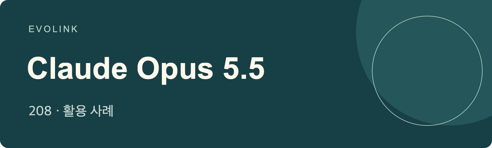

# Claude Opus 5.5 활용 사례
출처에 근거한 워크플로, 데모, 비교 및 한계

## 🍌 소개

**Claude Opus 5.5로 사람들이 만들고 시험한 게임, 3D 장면, 코딩 도구, 연구 및 창작 워크플로를 살펴보세요. 모든 항목은 게시자의 원문으로 연결되며 원래 주장의 한계를 유지합니다.**

[EvoLink에서 Claude Opus 5.5 살펴보기](https://evolink.ai/claude-opus-5-5?utm_source=github&utm_medium=readme&utm_campaign=awesome-claude-opus-5-5-usecases&utm_content=introduction_cta)

## 📊 개요

창작, 개발, 연구, 평가 분야에서 선정한 **Claude Opus 5.5 사례 208개**입니다.

- 공식 가이드와 함께 커뮤니티 데모, 워크플로, 비교 및 기록된 한계를 살펴보세요.
- 각 항목에는 원본 출처, 게시자, 원문 게시일, 간결한 핵심 내용 및 출처에 근거한 설명이 포함됩니다.
- 목차에서 작업을 선택하고 원문을 따라가 공개된 도구, 입력 및 결과를 확인하세요.

> [!NOTE]
> 이 항목들은 출처를 명시한 보고이며 독립적으로 재현한 결과가 아닙니다. 도구를 활용한 영상과 그래픽은 모델 자체의 미디어 생성 기능을 입증하지 않습니다. 홍보성 비교는 해당 게시자의 주장으로 표시하며, 반복 게시물은 독립적인 실험으로 간주하지 않습니다. 아래 날짜는 자료를 가져온 날짜가 아니라 원문 게시일(UTC)입니다.

## ⚡ 빠른 시작

1. [모델 페이지에서 현재 이용 가능 여부와 기능을 확인하세요](https://evolink.ai/claude-opus-5-5?utm_source=github&utm_medium=quickstart&utm_campaign=awesome-claude-opus-5-5-usecases&utm_content=model_link)
2. [EvoLink 대시보드에서 API 키를 만드세요](https://evolink.ai/dashboard/keys?utm_source=github&utm_medium=quickstart&utm_campaign=awesome-claude-opus-5-5-usecases&utm_content=api_key)
3. [모델 페이지에 연결된 해당 모델의 API 가이드 또는 에이전트 지침을 따르세요](https://evolink.ai/docs/en/api-manual/language-series/claude/claude-messages-api?utm_source=github&utm_medium=docs&utm_campaign=awesome-claude-opus-5-5-usecases&utm_content=first_run)

## 📑 목차

| [개요](#overview) | [빠른 시작](#quick-start) | [관련 저장소](#related-repositories) | [감사의 말](#acknowledge) |
|---|---|---|---|

| 사례 | 분류 | 보여 주는 내용 | 유형 |
|---|---|---|---|
| [사례 1: 공식 계정이 공유한 수박 단편](#case-1) | [공식 가이드 및 소개](#category-official) | 공식 계정이 공유한 수박 단편을 이야기 구성의 참고 자료로 살펴보되, 제작 과정은 아직 공개되지 않았음을 고려하세요. | Demo |
| [사례 2: 작업 전체를 위임하기](#case-2) | [공식 가이드 및 소개](#category-official) | 작업 전체를 위임하기 전에 완료 기준과 중간 확인 시점을 정하세요. | Tutorial |
| [사례 3: 사무라이 게임 비교](#case-3) | [게임 개발](#category-games) | 게시자의 플랫폼 홍보 맥락을 고려하면서 사무라이 게임 결과물을 비교하세요. | Evaluation |
| [사례 4: 한 번에 만든 Mario Kart 데모](#case-4) | [게임 개발](#category-games) | 한 번의 실행으로 만들었다는 이 카트 게임에서 실제 조작 가능한 캐릭터를 확인한 뒤 플랫폼의 품질 평가를 판단하세요. | Demo |
| [사례 5: 브라우저용 Minecraft 복제 게임](#case-5) | [게임 개발](#category-games) | 브라우저 Minecraft 데모에서 이번 게임 생성 시도의 결과물을 확인하세요. | Demo |
| [사례 6: HTML 파일 하나로 만든 기계 장치 게임](#case-6) | [게임 개발](#category-games) | 이 플랫폼 데모를 참고해 절차적으로 생성하는 게임 영상과 소리에 단일 HTML 파일 형식을 고려하세요. | Demo |
| [사례 7: Roblox toolbox를 활용한 애니메이션 격투 게임](#case-7) | [게임 개발](#category-games) | 한 번에 만들었다는 격투 게임을 평가할 때 Roblox toolbox 에셋의 역할을 고려하세요. | Demo |
| [사례 8: 세 모델의 Spider-Man 게임 비교](#case-8) | [게임 개발](#category-games) | 세 Spider-Man 게임 결과물을 동일하게 관찰 가능한 플레이 기능으로 비교하세요. | Evaluation |
| [사례 9: 물리 기반 물 표현이 있는 Minecraft 복제 게임](#case-9) | [게임 개발](#category-games) | 보고된 물 물리 효과의 결과와 작성자가 밝힌 더 긴 모델 실행 시간을 함께 따져보세요. | Demo |
| [사례 10: DEAD SIGNAL 일인칭 장면](#case-10) | [게임 개발](#category-games) | 같은 프롬프트로 만든 일인칭 장면과 플랫폼의 품질 평가는 구분해서 살펴보세요. | Evaluation |
| [사례 11: 코드로 만든 양봉 게임](#case-11) | [게임 개발](#category-games) | 게임 에셋을 코드로 그리고 플레이 메커니즘을 구현할 때 양봉 데모를 참고하세요. | Demo |
| [사례 12: Snake 게임 데모](#case-12) | [게임 개발](#category-games) | 생성된 게임 로직과 표현의 소규모 사례로 이 Snake 데모를 살펴보세요. | Demo |
| [사례 13: Sol과 비교한 3D 게임 결과물](#case-13) | [게임 개발](#category-games) | 플랫폼의 선호를 독립적인 평가로 간주하지 않으면서 공개된 3D 게임 결과물을 비교하세요. | Evaluation |
| [사례 14: 멀티플레이 당구와 관전](#case-14) | [게임 개발](#category-games) | 보고된 멀티플레이 모드와 이용자 활동을 신뢰하기 전에 링크된 당구 게임을 확인하세요. | Demo |
| [사례 15: Higgsfield API로 만든 아케이드 게임](#case-15) | [게임 개발](#category-games) | 이 API 기반 플랫폼 데모의 물 반사 효과와 아케이드 플레이를 살펴보세요. | Integration |
| [사례 16: 브라우저에서 Minecraft 재현하기](#case-16) | [게임 개발](#category-games) | 브라우저 재현 결과를 통해 Minecraft 복제 시도의 눈에 보이는 범위를 평가하세요. | Demo |
| [사례 17: 라이브 방송 시청자와 함께 잔디 깎기](#case-17) | [게임 개발](#category-games) | 개인 서버의 멀티플레이 프로토타입 테스트에 라이브 방송 시청자를 초대하는 방식을 고려하세요. | Demo |
| [사례 18: 최종 보스가 있는 낙서풍 슈팅 게임](#case-18) | [게임 개발](#category-games) | 한 번에 만들었다는 슈팅 게임이 낙서풍 스타일과 최종 보스를 어떻게 결합했는지 살펴보세요. | Demo |
| [사례 19: Medium 설정으로 만든 Mario 게임](#case-19) | [게임 개발](#category-games) | 이 Mario 데모를 Medium 추론 강도의 게임 생성 실행 사례로 참고하세요. | Demo |
| [사례 20: 카트 레이싱 영상 비교](#case-20) | [게임 개발](#category-games) | 추정한 모델 능력보다 영상에서 관찰되는 게임 동작을 기준으로 카트 레이싱 영상을 비교하세요. | Evaluation |
| [사례 21: GPT-6 Sol과 동일 프롬프트 게임 비교](#case-21) | [게임 개발](#category-games) | 링크된 동일 프롬프트 게임을 직접 따라가 실제 플레이 경험을 비교하세요. | Evaluation |
| [사례 22: 한 번의 실행으로 생성한 Snake](#case-22) | [게임 개발](#category-games) | 한 번의 실행으로 생성했다는 Snake 게임을 작은 범위의 생성 사례로 참고하세요. | Demo |
| [사례 23: Three.js 좀비 게임 플레이](#case-23) | [게임 개발](#category-games) | 에셋 파일 없이 생성한 게임 메커니즘, 텍스처, 소리를 Three.js 데모에서 살펴보세요. | Demo |
| [사례 24: 두 차례 개선한 눈 게임](#case-24) | [게임 개발](#category-games) | 시각 효과와 음향 효과가 어우러진 눈 게임을 만들 때 개선 반복과 실행 시간을 예산에 반영하세요. | Demo |
| [사례 25: 게임 기능 추가와 예고편 편집](#case-25) | [게임 개발](#category-games) | 작성자의 파트너십 공개 내용을 유지하면서 플레이 가능한 게임과 예고편을 함께 살펴보세요. | Demo |
| [사례 26: Tesana의 멀티플레이 생존 섬](#case-26) | [게임 개발](#category-games) | 주장된 플레이 시간을 신뢰하기 전에 Tesana 섬의 멀티플레이 시스템을 확인하세요. | Demo |
| [사례 27: Unreal Engine 게임 비교](#case-27) | [게임 개발](#category-games) | Higgsfield 플랫폼의 워크플로 맥락에서 Unreal Engine 게임 결과물을 비교하세요. | Evaluation |
| [사례 28: Tesana의 다크 판타지 RPG](#case-28) | [게임 개발](#category-games) | 파트너십 여부가 미확인인 점을 유지하면서 Tesana RPG의 지역, 퀘스트, 음성 대사 구성을 살펴보세요. | Demo |
| [사례 29: 소음으로 싸움이 시작되는 기타 상점](#case-29) | [게임 개발](#category-games) | 연주 가능한 기타 모델 수백 개를 갖춘 Three.js 상점 시뮬레이터를 확장하기 전에 성능을 테스트하세요. | Demo |
| [사례 30: 손그림풍 체스와 수 분석](#case-30) | [게임 개발](#category-games) | 체스 데모가 손그림풍 외형과 수 분석을 어떻게 결합했는지 살펴보세요. | Demo |
| [사례 31: Kimi K3와 비교한 비행 시뮬레이터](#case-31) | [게임 개발](#category-games) | 두 결과물 중 선택할 때 비행 시뮬레이터의 동작과 보고된 비용을 함께 비교하세요. | Evaluation |
| [사례 32: 프롬프트 하나로 만든 Tesana 판타지 세계](#case-32) | [게임 개발](#category-games) | Tesana 판타지 세계 소개에서 플랫폼이 결합해 만든 플레이, 음향, UI 결과를 살펴보세요. | Demo |
| [사례 33: 십 분 이내에 만든 양궁 게임](#case-33) | [게임 개발](#category-games) | 십 분 미만이라는 제작 시간을 일반화하기 전에 배포된 양궁 게임을 확인하세요. | Demo |
| [사례 34: Minecraft 및 Warcraft 복제 게임 비교](#case-34) | [게임 개발](#category-games) | 추론 강도, 실행 시간, 추정 비용 맥락을 유지하면서 공개된 게임 결과물과 프롬프트를 비교하세요. | Evaluation |
| [사례 35: Runescape Bench 점수와 비용](#case-35) | [게임 개발](#category-games) | Runescape Bench의 보고된 가격과 순위를 해당 게임 작업에 관한 근거로만 해석하세요. | Evaluation |
| [사례 36: 상호작용하는 산호초 배경화면](#case-36) | [대화형 학습 및 시각화](#category-education) | 물고기 먹이 주기를 잔잔한 배경화면에 상호작용을 더하는 참고 사례로 활용하세요. | Demo |
| [사례 37: 라이브 방송에서 만든 물 시뮬레이션](#case-37) | [대화형 학습 및 시각화](#category-education) | 긴 라이브 방송 세션의 결과물 가운데 하나로 공개된 물 시뮬레이션을 살펴보세요. | Demo |
| [사례 38: 영상을 참고해 재현한 3D 물](#case-38) | [대화형 학습 및 시각화](#category-education) | 작성자의 재현도 평가를 받아들이기 전에 재현된 물을 참고 영상과 비교하세요. | Demo |
| [사례 39: 손 해부 구조를 층별로 살펴보기](#case-39) | [대화형 학습 및 시각화](#category-education) | 검증되지 않은 통증·회복 제안에 의존하지 않으면서 층별 해부 인터페이스를 살펴보세요. | Demo |
| [사례 40: Kilo Code의 풀 만지기 시뮬레이터](#case-40) | [대화형 학습 및 시각화](#category-education) | 풀 만지기 결과물과 플랫폼이 보고한 실행별 비용을 함께 비교하세요. | Evaluation |
| [사례 41: 투석기 스케치에서 시뮬레이션으로](#case-41) | [대화형 학습 및 시각화](#category-education) | 간접 소개라는 성격을 유지하면서 투석기 사례를 스케치에서 시뮬레이션으로 전환한 참고 자료로 활용하세요. | Demo |
| [사례 42: 레일과 진자 메커니즘](#case-42) | [대화형 학습 및 시각화](#category-education) | 메커니즘 시뮬레이션의 비용을 추정할 때 API 실행 시간과 유휴 시간을 포함한 경과 시간을 구분하세요. | Demo |
| [사례 43: 중력에 따라 달라지는 얼굴](#case-43) | [대화형 학습 및 시각화](#category-education) | 가능한 파트너십에 관한 표시를 유지하면서 중력 조절 얼굴 데모를 살펴보세요. | Demo |
| [사례 44: 연결된 페이지로 설명하는 웹](#case-44) | [대화형 학습 및 시각화](#category-education) | 보고된 긴 실행 시간을 감안하면서 탐색형 설명에 서로 연결된 HTML 페이지를 활용하는 방식을 고려하세요. | Demo |
| [사례 45: 탐색 가능한 3D 눈 학습 페이지](#case-45) | [대화형 학습 및 시각화](#category-education) | 탐색 가능한 눈 데모를 층별 3D 학습 인터페이스의 참고 자료로 활용하세요. | Evaluation |
| [사례 46: 미완성 대화형 우주 규모 탐색](#case-46) | [대화형 학습 및 시각화](#category-education) | 우주부터 플랑크 척도까지 다루는 대화형 프로젝트를 시도하기 전에 사용량 확인 시점을 정하세요. | Limit |
| [사례 47: 십 초짜리 Blender 장면 비교](#case-47) | [3D 모델링 및 장면](#category-3d) | 실행 시간, 토큰 사용량, API 환산 비용을 함께 보면서 Blender 장면을 비교하세요. | Evaluation |
| [사례 48: Jev를 활용한 Unreal Engine의 샌프란시스코](#case-48) | [3D 모델링 및 장면](#category-3d) | Unreal Engine 도시 장면의 동작을 평가할 때 Jev의 역할을 고려하세요. | Integration |
| [사례 49: 500종 장비를 갖춘 체육관 설계 도구](#case-49) | [3D 모델링 및 장면](#category-3d) | 렌더링한 장비 목록과 배치 조작을 결합하는 참고 사례로 체육관 설계 도구를 활용하세요. | Demo |
| [사례 50: 네 모델의 로켓 발사 비교](#case-50) | [3D 모델링 및 장면](#category-3d) | 플랫폼이 보고한 시간과 비용 수치를 함께 보면서 네 로켓 발사 결과물을 비교하세요. | Evaluation |
| [사례 51: 자전거를 타는 펠리컨](#case-51) | [3D 모델링 및 장면](#category-3d) | 자전거를 타는 펠리컨 작품을 기록된 워크플로가 아닌 시각적 결과물로 살펴보세요. | Demo |
| [사례 52: 1906 지진 이전의 Market Street](#case-52) | [3D 모델링 및 장면](#category-3d) | 정확성을 확인하기 전까지 역사 속 Market Street 장면을 Blender로 해석한 결과로 받아들이세요. | Demo |
| [사례 53: Sol과 비교한 Blender 펠리컨 반복 애니메이션](#case-53) | [3D 모델링 및 장면](#category-3d) | 반복 재생되는 펠리컨 애니메이션과 그 매력에 대한 플랫폼의 선호를 구분해서 비교하세요. | Evaluation |
| [사례 54: Blender 작품 소개](#case-54) | [3D 모델링 및 장면](#category-3d) | 게시물이 주제나 워크플로를 설명하지 않으므로 Blender 결과물을 직접 살펴보세요. | Demo |
| [사례 55: Blender 풍차 제작 워크플로](#case-55) | [3D 모델링 및 장면](#category-3d) | 풍차 사례에서 Blender 모델링, 리깅, 텍스처링, 애니메이션을 결합한 워크플로를 살펴보세요. | Demo |
| [사례 56: 코드로 만든 Golden Gate Bridge](#case-56) | [3D 모델링 및 장면](#category-3d) | 작성자의 품질 평가를 받아들이기 전에 코드로 만든 다리 장면을 링크된 참고 자료와 비교하세요. | Evaluation |
| [사례 57: 화산섬, 해양 생물, 오로라](#case-57) | [3D 모델링 및 장면](#category-3d) | 서로 다른 두 풍경 장면에서 확정적인 모델 순위를 도출하지 마세요. | Evaluation |
| [사례 58: Blender에서 외골격 관절 재설계](#case-58) | [3D 모델링 및 장면](#category-3d) | 기계적 신뢰성을 검증하기 전까지 재설계한 외골격을 모델링 제안으로 다루세요. | Demo |
| [사례 59: Cowork에서 만든 솔라펑크 도시](#case-59) | [3D 모델링 및 장면](#category-3d) | Cowork에서 3D 환경을 만든 보고 사례로 솔라펑크 장면을 살펴보세요. | Demo |
| [사례 60: Three.js로 만든 뉴욕 동네](#case-60) | [3D 모델링 및 장면](#category-3d) | 두 뉴욕 장면 결과물을 비교할 때 렌더링 루프와 카메라 움직임을 확인하세요. | Evaluation |
| [사례 61: 또 다른 자전거 펠리컨 작품](#case-61) | [3D 모델링 및 장면](#category-3d) | 동일한 주제에 대한 추가 시각 자료로 이 자전거 펠리컨 작품을 살펴보세요. | Demo |
| [사례 62: Blender 신칸센 모델](#case-62) | [3D 모델링 및 장면](#category-3d) | 플랫폼이 보고한 오브젝트와 좌석 수를 신뢰하기 전에 신칸센 모델을 확인하세요. | Demo |
| [사례 63: 이미지에서 로우폴리 3D로](#case-63) | [3D 모델링 및 장면](#category-3d) | 보고된 이미지→3D 결과물에서 색상 재현도와 함께 기하학적 세부 표현도 평가하세요. | Demo |
| [사례 64: Tripo P2, JEF, MCP를 활용한 캐릭터 워크플로](#case-64) | [3D 모델링 및 장면](#category-3d) | 캐릭터 제작 워크플로를 평가할 때 Tripo P2, JEF, Blender MCP의 역할을 고려하세요. | Integration |
| [사례 65: 집 사진과 평면도를 3D로 변환](#case-65) | [3D 모델링 및 장면](#category-3d) | 집 사진과 평면도를 결합해 대화형 브라우저 뷰어가 있는 모델을 시제품으로 만드는 방식을 고려하세요. | Demo |
| [사례 66: 병 속의 배 생성 테스트](#case-66) | [3D 모델링 및 장면](#category-3d) | 문서화되지 않은 워크플로를 추정하지 않으면서 병 속의 배 결과물의 장면 구성을 살펴보세요. | Demo |
| [사례 67: DeLorean, 시계탑, 번개](#case-67) | [3D 모델링 및 장면](#category-3d) | 애니메이션 장면의 동작과 각 모델의 생성 도구 사용, 실행 시간, 추정 비용을 함께 비교하세요. | Evaluation |
| [사례 68: 스케치부터 완성된 집까지 네 단계](#case-68) | [3D 모델링 및 장면](#category-3d) | Three.js와 TSL의 단계별 화면으로 건물이 스케치에서 완성으로 진행되는 과정을 보여주세요. | Demo |
| [사례 69: 3D 결과물과 보고된 비용 비교](#case-69) | [3D 모델링 및 장면](#category-3d) | 공개된 3D 결과물과 플랫폼이 보고한 비용 차이를 함께 따져보세요. | Evaluation |
| [사례 70: 그림을 탐색 가능한 장면으로 변환](#case-70) | [3D 모델링 및 장면](#category-3d) | 평면 구도를 여러 3D 각도에서 탐색하는 참고 사례로 그림 확장 결과를 활용하세요. | Integration |
| [사례 71: 3D 가구 배치 시뮬레이터](#case-71) | [3D 모델링 및 장면](#category-3d) | 설계를 선택하기 전에 가구 배치를 비교하는 방법으로 3D 배치 시뮬레이터를 고려하세요. | Demo |
| [사례 72: 목탄화를 3D로 변환](#case-72) | [3D 모델링 및 장면](#category-3d) | 목탄화의 Blender 변환이 그림의 질감을 3D 장면으로 어떻게 옮겼는지 살펴보세요. | Demo |
| [사례 73: 멀티플레이 지중해 항구 둘러보기](#case-73) | [3D 모델링 및 장면](#category-3d) | 항구 둘러보기를 평가할 때 절차적으로 생성한 풍경·소리와 가져온 인물 에셋을 구분하세요. | Demo |
| [사례 74: 3D 컨트롤러 데모](#case-74) | [3D 모델링 및 장면](#category-3d) | 컨트롤러 데모와 요청된 영상을 인용된 이전 SVG 작업과 구분해 살펴보세요. | Demo |
| [사례 75: Minecraft풍 사원 정원](#case-75) | [3D 모델링 및 장면](#category-3d) | 작성자의 모델 선호를 일반화하지 않으면서 사원 정원 미리보기를 비교하세요. | Evaluation |
| [사례 76: Blender 문어 모델링과 애니메이션](#case-76) | [3D 모델링 및 장면](#category-3d) | 플랫폼의 홍보용 품질 표현을 등급으로 받아들이지 않으면서 문어 모델과 애니메이션을 살펴보세요. | Demo |
| [사례 77: 동일 프롬프트의 뉴욕 비교](#case-77) | [3D 모델링 및 장면](#category-3d) | 각 모델 버전과 추론 강도 설정을 유지하면서 동일한 뉴욕 장면 요청의 결과를 비교하세요. | Evaluation |
| [사례 78: 여러 풍경을 가로지르는 관광 비행](#case-78) | [3D 모델링 및 장면](#category-3d) | 제작 과정을 담은 영상을 따라가며 관광 비행이 여러 풍경을 어떻게 연결하는지 확인하세요. | Demo |
| [사례 79: 복셀풍 Claude 애니메이션](#case-79) | [3D 모델링 및 장면](#category-3d) | 스타일화한 Claude 캐릭터에 움직임을 주는 참고 사례로 복셀 캐릭터 데모를 활용하세요. | Demo |
| [사례 80: Fable 및 Astra와 비교한 복셀 펠리컨](#case-80) | [3D 모델링 및 장면](#category-3d) | 토큰 사용량에 관한 작성자의 주장을 이번 시도에 한정하면서 복셀 펠리컨 결과물을 비교하세요. | Evaluation |
| [사례 81: GPT-6 Sol과 비교한 경주용 자동차 모델](#case-81) | [3D 모델링 및 장면](#category-3d) | 공개된 결과물 이상의 성능을 추정하지 않으면서 경주용 자동차 모델을 나란히 살펴보세요. | Evaluation |
| [사례 82: GPU 가속 고양이 털 시뮬레이션](#case-82) | [3D 모델링 및 장면](#category-3d) | 고양이 털 데모를 Three.js의 GPU 가속 시뮬레이션 참고 사례로 활용하세요. | Demo |
| [사례 83: Minecraft 복셀 건축 비교](#case-83) | [3D 모델링 및 장면](#category-3d) | 작성자의 Minecraft 선호와 아직 계획 단계인 정식 VoxelBench 테스트를 구분하세요. | Evaluation |
| [사례 84: 세 모델의 우주 로켓 테스트](#case-84) | [3D 모델링 및 장면](#category-3d) | 세 우주 로켓 결과물을 비교할 때 서로 다른 추론 설정을 고려하세요. | Evaluation |
| [사례 85: Opus 5와 Three.js 비교](#case-85) | [3D 모델링 및 장면](#category-3d) | 링크된 평가 플랫폼에서 Three.js 작업에 대한 Opus 버전 간 비교를 살펴보세요. | Evaluation |
| [사례 86: Three.js로 만든 종말 단편 영상](#case-86) | [3D 모델링 및 장면](#category-3d) | 렌더링된 단편을 비교하기 전에 서로 다른 실행 환경, 수정 기회, 추정 비용을 고려하세요. | Evaluation |
| [사례 87: JavaScript로 합성한 베이스 음악](#case-87) | [음악 및 소리](#category-audio) | JavaScript에서 소리를 직접 합성하는 참고 사례로 베이스 음악 데모를 활용하세요. | Demo |
| [사례 88: 음악 오류 탐지 만점 보고](#case-88) | [음악 및 소리](#category-audio) | 코랄 발췌 열 개의 오류 탐지 만점은 더 넓은 검증이 필요한 보고 결과로 받아들이세요. | Evaluation |
| [사례 89: 음향 효과 생성 워크플로](#case-89) | [음악 및 소리](#category-audio) | 게시물이 생성된 소리를 특정하지 않으므로 음향 효과 워크플로를 직접 살펴보세요. | Demo |
| [사례 90: Pocket Color 휴대용 게임기 그래픽 비교](#case-90) | [창작 그래픽 및 애니메이션](#category-graphics) | 추정한 기기 기능보다 관찰 가능한 외관의 세부 요소를 기준으로 휴대용 게임기 그래픽을 비교하세요. | Evaluation |
| [사례 91: 18m 31s 만에 만든 Sweet Tooth 애니메이션](#case-91) | [창작 그래픽 및 애니메이션](#category-graphics) | 보고된 단일 실행 제작 시간을 일반화하기 전에 Sweet Tooth 애니메이션을 살펴보세요. | Demo |
| [사례 92: Claude와 AGI를 소재로 한 만화](#case-92) | [창작 그래픽 및 애니메이션](#category-graphics) | 생성 워크플로는 미공개인 상태로 두고 만화를 시각적 참고 자료로 활용하세요. | Demo |
| [사례 93: 코드로 만든 픽셀 마법사 애니메이션](#case-93) | [창작 그래픽 및 애니메이션](#category-graphics) | 코드로 만든 픽셀 애니메이션을 살펴보고 작성자가 제공한다고 밝힌 프롬프트는 답글에서 확인하세요. | Demo |
| [사례 94: JavaScript로 프레임마다 그린 애니메이션](#case-94) | [창작 그래픽 및 애니메이션](#category-graphics) | JavaScript 렌더링으로 움직임을 만드는 참고 사례로 프레임별로 그린 애니메이션을 활용하세요. | Demo |
| [사례 95: Nintendo Switch SVG 애니메이션](#case-95) | [창작 그래픽 및 애니메이션](#category-graphics) | SVG 애니메이션 요구사항과 Max 추론 강도에서 보고된 세션 사용량을 함께 따져보세요. | Evaluation |
| [사례 96: 문제 해결을 코드 애니메이션으로 표현](#case-96) | [창작 그래픽 및 애니메이션](#category-graphics) | 순수 코드 애니메이션을 모델 작동 과정의 설명보다는 문제 해결을 창의적으로 묘사한 작품으로 활용하세요. | Demo |
| [사례 97: 공유된 자전거 펠리컨 반복 영상](#case-97) | [창작 그래픽 및 애니메이션](#category-graphics) | 공유된 반복 영상의 간접 소개 출처를 유지하면서 자전거 동작을 살펴보세요. | Demo |
| [사례 98: PS5 컨트롤러 SVG 비교](#case-98) | [창작 그래픽 및 애니메이션](#category-graphics) | 컨트롤러의 세부 표현과 명암을 BridgeMind의 홍보성 품질 평가와 구분해 비교하세요. | Evaluation |
| [사례 99: Devin에서 만든 물과 입자 시각 효과](#case-99) | [창작 그래픽 및 애니메이션](#category-graphics) | 작성자의 소속 관계, 실행 시간, 비용 공개 내용을 유지하면서 Devin 시각 효과 결과물을 비교하세요. | Evaluation |
| [사례 100: 옥토버페스트 애니메이션](#case-100) | [창작 그래픽 및 애니메이션](#category-graphics) | 보고된 단일 실행 제작 시간을 신뢰하기 전에 옥토버페스트 애니메이션과 링크된 지침을 살펴보세요. | Demo |
| [사례 101: JavaScript로 작성한 음악과 시각 효과](#case-101) | [창작 그래픽 및 애니메이션](#category-graphics) | 음악과 시각 효과를 결합한 데모를 JavaScript 사례로 참고하되 더 광범위한 대체 가능성의 근거는 제한적임을 고려하세요. | Demo |
| [사례 102: JavaScript만 사용한 대화형 애니메이션](#case-102) | [창작 그래픽 및 애니메이션](#category-graphics) | 외부 에셋이나 확장 기능을 쓰지 않았다는 대화형 애니메이션이 JavaScript를 어떻게 활용했는지 살펴보세요. | Demo |
| [사례 103: 세 모델의 애니메이션 비교](#case-103) | [창작 그래픽 및 애니메이션](#category-graphics) | 공통 입력과 작성자가 보고한 실행 시간을 함께 보면서 세 애니메이션 결과물을 비교하세요. | Evaluation |
| [사례 104: SVG 334줄로 만든 Xbox 컨트롤러](#case-104) | [창작 그래픽 및 애니메이션](#category-graphics) | 간결한 컨트롤러 SVG를 살펴보면서 Max 추론 강도에서 보고된 높은 토큰 사용량을 고려하세요. | Demo |
| [사례 105: TouchDesigner에서 재현한 참고 효과](#case-105) | [창작 그래픽 및 애니메이션](#category-graphics) | 참고 자료를 기반으로 한 효과 재현을 평가할 때 TouchDesigner의 역할을 고려하세요. | Integration |
| [사례 106: Game Boy 시각 표현 테스트](#case-106) | [창작 그래픽 및 애니메이션](#category-graphics) | 작성자의 시각적 선호를 받아들이기 전에 Game Boy 결과물을 직접 비교하세요. | Evaluation |
| [사례 107: JavaScript 애니메이션 소개](#case-107) | [창작 그래픽 및 애니메이션](#category-graphics) | 전체 제작 과정 설명이 없으므로 JavaScript 애니메이션을 결과물 참고 자료로 활용하세요. | Demo |
| [사례 108: CoAnimator의 애니메이션과 소리](#case-108) | [창작 그래픽 및 애니메이션](#category-graphics) | 개발자 자신의 앱에서 CoAnimator가 애니메이션, 타임라인, 소리를 어떻게 결합하는지 살펴보세요. | Integration |
| [사례 109: HyperFrames의 3D 카메라와 텍스트 효과](#case-109) | [창작 그래픽 및 애니메이션](#category-graphics) | 공개된 3D 카메라 및 텍스트 효과를 평가할 때 HyperFrames의 역할을 고려하세요. | Integration |
| [사례 110: 오 분 이내에 만든 픽셀 애니메이션](#case-110) | [창작 그래픽 및 애니메이션](#category-graphics) | 픽셀 애니메이션을 살펴보고 제공을 약속한 프롬프트는 답글에서 확인하세요. | Demo |
| [사례 111: PNG 에셋을 사용한 컨트롤러 SVG](#case-111) | [창작 그래픽 및 애니메이션](#category-graphics) | SVG 결과물을 전부 벡터로 그린 작품이라고 설명하기 전에 포함된 이미지 에셋을 확인하세요. | Demo |
| [사례 112: ChronoVolume 효과 재현](#case-112) | [창작 그래픽 및 애니메이션](#category-graphics) | 재현된 ChronoVolume 효과를 참고 자료 및 플랫폼이 보고한 비용·실행 시간과 함께 비교하세요. | Demo |
| [사례 113: 같은 프롬프트로 만든 분수](#case-113) | [창작 그래픽 및 애니메이션](#category-graphics) | 공통 프롬프트와 최대 추론 강도 설정에서 분수 결과물을 비교하세요. | Evaluation |
| [사례 114: SVG로 모나리자 그리기](#case-114) | [창작 그래픽 및 애니메이션](#category-graphics) | 인용된 비교의 추론 강도 설정을 유지하면서 두 모나리자 SVG 결과물을 살펴보세요. | Evaluation |
| [사례 115: Sol 및 Luna와 SVG 비교](#case-115) | [창작 그래픽 및 애니메이션](#category-graphics) | 세 모델의 SVG 비교를 관찰 가능한 결과물과 작성자의 개인적 판단 범위로 한정하세요. | Evaluation |
| [사례 116: 스크립트로 Paint에서 사진 그리기](#case-116) | [창작 그래픽 및 애니메이션](#category-graphics) | 스크립트로 만든 이미지가 Paint 작업의 요구를 충족하지 못한다면 마우스만 사용하는 상호작용을 명시하고 확인하세요. | Limit |
| [사례 117: 작은 태양으로 상상한 Claude](#case-117) | [창작 그래픽 및 애니메이션](#category-graphics) | 작은 태양 작품을 모델의 경험에 대한 근거가 아닌 상상력 있는 자화상 프롬프트로 받아들이세요. | Demo |
| [사례 118: 펠리컨 그리기 테스트](#case-118) | [창작 그래픽 및 애니메이션](#category-graphics) | 프롬프트와 워크플로가 제공되지 않은 결과물 표본으로 펠리컨 그림을 활용하세요. | Demo |
| [사례 119: 픽셀 아트의 분수와 박쥐 눈](#case-119) | [창작 그래픽 및 애니메이션](#category-graphics) | 픽셀 장면의 움직이는 세부 요소를 주관적인 스타일 선호와 구분해 비교하세요. | Evaluation |
| [사례 120: 샌프란시스코를 그린 작품](#case-120) | [창작 그래픽 및 애니메이션](#category-graphics) | 명시되지 않은 제작 도구 구성을 추정하지 않으면서 샌프란시스코 작품을 살펴보세요. | Demo |
| [사례 121: Grok 4.7과 비교한 자전거 펠리컨](#case-121) | [창작 그래픽 및 애니메이션](#category-graphics) | 동작이 더 안정적이라는 작성자의 판단을 받아들이기 전에 펠리컨 애니메이션을 직접 비교하세요. | Evaluation |
| [사례 122: “subtle art”에서 만든 아트 생성기](#case-122) | [창작 그래픽 및 애니메이션](#category-graphics) | 작성자의 플랫폼 소속 관계를 유지하면서 링크된 아트 생성기를 사용해 보세요. | Demo |
| [사례 123: John Wick에서 영감을 받은 재제작](#case-123) | [창작 그래픽 및 애니메이션](#category-graphics) | 생성 워크플로가 문서화되지 않은 상태의 시각적 참고 자료로 John Wick 테마 애니메이션을 활용하세요. | Demo |
| [사례 124: 네 SVG 결과물과 최대 강도 실행 실패](#case-124) | [창작 그래픽 및 애니메이션](#category-graphics) | 추론 강도별 SVG 결과물을 살펴보면서 보고된 Max 실행의 토큰 소진과 실패 비용을 함께 확인하세요. | Evaluation |
| [사례 125: MacBook Pro SVG 벤치마크](#case-125) | [창작 그래픽 및 애니메이션](#category-graphics) | MacBook Pro SVG 결과를 Playcode 자체의 특정 작업 평가 및 제품 결정으로 해석하세요. | Evaluation |
| [사례 126: 개인 사이트를 반복 개선하고 예고편 제작](#case-126) | [웹사이트 및 인터페이스](#category-web) | 개인 사이트 재설계를 기록하는 방법으로 반복적인 디자인 비평과 버전별 변화를 담은 예고편을 고려하세요. | Demo |
| [사례 127: 참고 자료 여덟 개로 만든 광물 목록 사이트](#case-127) | [웹사이트 및 인터페이스](#category-web) | 여기서 보여주는 광물 목록 스타일을 만들 때 여러 참고 자료와 수정 프롬프트를 계획에 반영하세요. | Demo |
| [사례 128: 동일한 목표로 기존 앱 재설계](#case-128) | [웹사이트 및 인터페이스](#category-web) | 동일한 기존 앱과 명시된 목표를 기준으로 재설계 결과를 비교하세요. | Evaluation |
| [사례 129: 화산 시도가 멈춘 프런트엔드 테스트](#case-129) | [웹사이트 및 인터페이스](#category-web) | 프런트엔드 생성 결과를 평가할 때 진행이 멈춘 시도와 추론 토큰 사용량을 포함하세요. | Limit |
| [사례 130: 디자인 skill 없이 만든 연결형 노트 인터페이스](#case-130) | [웹사이트 및 인터페이스](#category-web) | 전체 기능이 검증되었다고 가정하지 않으면서 연결형 노트 인터페이스를 살펴보세요. | Demo |
| [사례 131: Grok 4.7과 비교한 단일 실행 UI](#case-131) | [웹사이트 및 인터페이스](#category-web) | 같은 프롬프트의 실행 날짜가 서로 다르다는 점을 유지하면서 두 UI 결과물을 비교하세요. | Evaluation |
| [사례 132: 23분 만에 만든 스트레스 완화 앱](#case-132) | [웹사이트 및 인터페이스](#category-web) | 치료 효과가 입증되었다고 가정하지 않으면서 스트레스 완화 앱을 프로토타입으로 살펴보세요. | Demo |
| [사례 133: Stratus 날씨 테마 랜딩 페이지](#case-133) | [웹사이트 및 인터페이스](#category-web) | 보고된 비용과 실행 시간의 맥락을 포함해 날씨 테마 랜딩 페이지를 디자인 참고 자료로 활용하세요. | Demo |
| [사례 134: 대화형 역방향 CAPTCHA](#case-134) | [웹사이트 및 인터페이스](#category-web) | 모호한 질문 설계를 실험하는 방식으로 역방향 CAPTCHA 상호작용을 고려하세요. | Demo |
| [사례 135: Figma 가져오기를 지원하는 개인용 인터랙션 도구](#case-135) | [웹사이트 및 인터페이스](#category-web) | 디자인 참고 자료 가져오기와 작은 패치를 활용해 인터페이스 상호작용을 탐색하고 학습하세요. | Demo |
| [사례 136: 로컬 모델을 모니터링하는 PonteMLX](#case-136) | [웹사이트 및 인터페이스](#category-web) | 별도의 로컬 이미지 생성 모델 역할을 고려하면서 모니터링 인터페이스를 살펴보세요. | Integration |
| [사례 137: 물류 일정 대시보드 미리보기](#case-137) | [웹사이트 및 인터페이스](#category-web) | 백엔드와 일정 처리 동작을 확인하기 전까지 물류 스크린샷은 인터페이스의 근거로 다루세요. | Demo |
| [사례 138: WebGL 창작 스튜디오 사이트 비교](#case-138) | [웹사이트 및 인터페이스](#category-web) | 공통으로 주어진 WebGL, 타이포그래피, 스크롤 요구사항에 따라 창작 스튜디오 페이지를 비교하세요. | Evaluation |
| [사례 139: 아이소메트릭 아이콘 컴포넌트 인터페이스](#case-139) | [웹사이트 및 인터페이스](#category-web) | 스크린샷이 컴포넌트의 실제 기능을 증명한다고 가정하지 않으면서 아이소메트릭 인터페이스를 살펴보세요. | Demo |
| [사례 140: 휴대용 게임기풍 게임 선택 페이지](#case-140) | [웹사이트 및 인터페이스](#category-web) | 게임 실행을 검증하기 전까지 휴대용 게임기풍 선택 페이지는 UI 소개 사례로 다루세요. | Demo |
| [사례 141: 한 번에 만든 이미지 벡터 변환 도구](#case-141) | [웹사이트 및 인터페이스](#category-web) | 한 번에 만들었다는 벡터 변환 도구를 신뢰하기 전에 여러 이미지 유형에서 변환 정확도를 시험하세요. | Demo |
| [사례 142: 공통 프롬프트로 비교한 랜딩 페이지](#case-142) | [웹사이트 및 인터페이스](#category-web) | 작성자의 선호를 그대로 받아들이기보다 공통 프롬프트에 따라 랜딩 페이지 갤러리를 비교하세요. | Evaluation |
| [사례 143: AppLlama MCP로 기존 앱 재설계](#case-143) | [웹사이트 및 인터페이스](#category-web) | AppLlama를 활용한 재설계와 기존 앱의 매출을 구분하세요. | Integration |
| [사례 144: 이미지→HTML 재현도와 성능](#case-144) | [웹사이트 및 인터페이스](#category-web) | 이미지→HTML 작업에서는 시각적 재현도와 함께 전환 효과 및 실행 성능을 확인하세요. | Evaluation |
| [사례 145: 창의적인 HTML 파일 100개 생성](#case-145) | [웹사이트 및 인터페이스](#category-web) | 어느 파일도 고장 나지 않았다는 작성자의 주장을 신뢰하기 전에 공개된 HTML 결과물을 표본 검사하고 테스트하세요. | Demo |
| [사례 146: Next.js 성공률과 평균 비용](#case-146) | [웹사이트 및 인터페이스](#category-web) | 보고된 성공률과 평균 비용을 Next.js 평가의 해당 프레임워크 범위 안에서 해석하세요. | Evaluation |
| [사례 147: 십 분 작업에서 핵심 결과물 누락](#case-147) | [비즈니스 분석 및 문서](#category-business) | 핵심 결과물을 먼저 요구하고 예산과 중단 시점을 명시하세요. | Limit |
| [사례 148: 검색 순위 페이지 347개에서 SEO 공백 찾기](#case-148) | [비즈니스 분석 및 문서](#category-business) | 보고된 SEO 조사 범위와 초안의 규칙 준수 여부를 측정되지 않은 검색 유입 성과와 구분하세요. | Evaluation |
| [사례 149: Trendtrack MCP를 활용한 Black Friday 분석](#case-149) | [비즈니스 분석 및 문서](#category-business) | Black Friday 분석 워크플로를 평가할 때 Trendtrack MCP의 데이터 접근 역할을 고려하세요. | Integration |
| [사례 150: alphaXiv의 근거 연결형 논문 블로그](#case-150) | [비즈니스 분석 및 문서](#category-business) | 자동 생성 연구 요약을 신뢰하기 전에 논문에 연결된 근거를 확인하세요. | Integration |
| [사례 151: SafeForge의 위험 요약 반복 과정 테스트](#case-151) | [비즈니스 분석 및 문서](#category-business) | SafeForge가 선호하는 모델이라는 평가를 일반화하기 전에 평가 방법과 지표를 확인하세요. | Evaluation |
| [사례 152: 벤치마크 그래픽의 모델 데이터 갱신](#case-152) | [비즈니스 분석 및 문서](#category-business) | 벤치마크 그래픽 갱신과 기반 평가의 재실행을 구분하세요. | Demo |
| [사례 153: 버전별 지표 생성 비교](#case-153) | [비즈니스 분석 및 문서](#category-business) | 명시되지 않은 검증 방법은 미확인 상태로 두고 지표 결과물을 비교하세요. | Evaluation |
| [사례 154: 웹사이트 URL에서 시작하는 영업 접촉 워크플로](#case-154) | [비즈니스 분석 및 문서](#category-business) | 영업 접촉 제품이 주장하는 발송 능력과 검증되지 않은 답변률·판매 성과를 구분하세요. | Integration |
| [사례 155: Ramp의 회계 작업 평가](#case-155) | [비즈니스 분석 및 문서](#category-business) | Ramp가 보고한 비용·속도 개선을 해당 Accounting Bench 실행 범위로 한정하세요. | Evaluation |
| [사례 156: fable-advisor로 구성한 다중 모델 팀](#case-156) | [에이전트 및 개발 워크플로](#category-agents) | 협업 팀 워크플로를 도입하기 전에 오픈 소스 플러그인의 모델별 역할을 살펴보세요. | Integration |
| [사례 157: ntm의 작업 인계와 워커 교체](#case-157) | [에이전트 및 개발 워크플로](#category-agents) | 오케스트레이션 도구에서 모델 버전이 다른 워커를 교체할 때 명시적인 인계를 활용하세요. | Integration |
| [사례 158: Apple Watch로 에이전트 지시](#case-158) | [에이전트 및 개발 워크플로](#category-agents) | 워치 앱의 에이전트 표시와 음성 받아쓰기 명령을 작성자의 RSI 관련 추측과 구분해 살펴보세요. | Demo |
| [사례 159: 추론 강도를 바꿔도 프롬프트 캐시 유지](#case-159) | [에이전트 및 개발 워크플로](#category-agents) | 캐시를 보존하는 추론 강도 전환 안내를 활용할 때 명시된 Claude Code 버전 요구사항을 유지하세요. | Tutorial |
| [사례 160: T3 Code 모델 캐시 새로고침](#case-160) | [에이전트 및 개발 워크플로](#category-agents) | 목록에 예상한 모델이 없으면 T3 Code 팀의 캐시 새로고침 절차를 따르세요. | Tutorial |
| [사례 161: 프로젝트 파일과 에이전트 세션 기록 검토](#case-161) | [에이전트 및 개발 워크플로](#category-agents) | 세션 기록의 패턴을 프로젝트 개선으로 옮기기 전에 현재 코드와 대조하세요. | Tutorial |
| [사례 162: ProgramBench의 다중 에이전트 속도](#case-162) | [에이전트 및 개발 워크플로](#category-agents) | 보고된 다중 에이전트 속도 비교를 해석할 때 200개 중 166개 작업을 사용했다는 범위를 유지하세요. | Evaluation |
| [사례 163: 에이전트 100개의 ProgramBench 평가](#case-163) | [에이전트 및 개발 워크플로](#category-agents) | 에이전트 100개를 사용한 벤치마크 평가와 미래의 조정 방식에 대한 추측을 구분하세요. | Evaluation |
| [사례 164: 동일한 거리 영상에서 라벨 추적](#case-164) | [시각적 이해 및 주석](#category-vision) | 이 플랫폼 비교에서 라벨 정확도는 측정되지 않은 상태로 두고 움직이는 라벨을 살펴보세요. | Evaluation |
| [사례 165: Roboflow 객체 탐지 평가](#case-165) | [시각적 이해 및 주석](#category-vision) | Roboflow 리더보드를 통해 해당 작업에 한정된 평가 범위에서 객체 탐지를 평가하세요. | Evaluation |
| [사례 166: Medeo의 Seedance 2.5 워크플로 비교](#case-166) | [영상 편집 및 제작](#category-video) | 지시하는 언어 모델을 비교할 때 영상 생성 주체는 Seedance 2.5로 명시하세요. | Evaluation |
| [사례 167: Claude에서 Blender로 클레이 애니메이션 제작](#case-167) | [영상 편집 및 제작](#category-video) | Claude의 단일 프롬프트 클레이 애니메이션 워크플로를 평가할 때 Blender의 역할을 고려하세요. | Integration |
| [사례 168: Tesseract의 출시 영상 재제작 비교](#case-168) | [영상 편집 및 제작](#category-video) | Tesseract의 편집·렌더링 역할을 명시하면서 출시 영상 재제작 결과를 비교하세요. | Evaluation |
| [사례 169: DocJev 티저 영상](#case-169) | [영상 편집 및 제작](#category-video) | 제품 티저와 Jev에 기인한다고 명시된 문서 처리 핵심 기능을 구분하세요. | Demo |
| [사례 170: 맞춤형 skill로 만든 Claude 모델 역사](#case-170) | [영상 편집 및 제작](#category-video) | JavaScript 모델 역사 영상을 평가할 때 작성자의 맞춤형 skill을 고려하세요. | Integration |
| [사례 171: Medeo의 종이접기 호랑이 영상](#case-171) | [영상 편집 및 제작](#category-video) | 종이접기 영상 워크플로를 언어 모델이 Seedance 2.5를 지시하는 과정으로 비교하세요. | Evaluation |
| [사례 172: Remotion으로 만든 BridgeMind 후드티 홍보](#case-172) | [영상 편집 및 제작](#category-video) | Remotion 홍보 영상의 타이밍과 전환을 게시자의 주관적 모델 순위와 구분해 살펴보세요. | Integration |
| [사례 173: Higgsfield 광고의 시간과 비용](#case-173) | [영상 편집 및 제작](#category-video) | 광고의 시간·비용 비교를 플랫폼이 보고한 제작 근거로 받아들이세요. | Evaluation |
| [사례 174: 출시 게시물에서 코드로 만든 출시 영상](#case-174) | [영상 편집 및 제작](#category-video) | 시각 요소와 소리를 코드로 만드는 출시 영상의 제작 지침으로 출시 게시물을 활용하는 방식을 고려하세요. | Demo |
| [사례 175: Claude의 눈으로 본 세상의 스톱모션 공유](#case-175) | [영상 편집 및 제작](#category-video) | 공유된 스톱모션 영화를 도구 구성이 명시되지 않은 간접 소개 사례로 받아들이세요. | Demo |
| [사례 176: 음악이 있는 영상을 이 초에서 22초로 확장](#case-176) | [영상 편집 및 제작](#category-video) | 연속된 영상 버전을 비교해 길이와 코드로 만든 음악이 어떻게 발전했는지 살펴보세요. | Demo |
| [사례 177: Photoshop과 Fusion으로 영상 오류 수정](#case-177) | [영상 편집 및 제작](#category-video) | 시간 절감 주장이 독립적으로 검증되었다고 가정하지 않으면서 Photoshop과 Fusion 수정 결과를 살펴보세요. | Integration |
| [사례 178: 웹사이트에서 만든 Kotlin 홍보 영상](#case-178) | [영상 편집 및 제작](#category-video) | 웹사이트→Kotlin 홍보 영상 워크플로를 평가할 때 HyperFrames skills의 역할을 고려하세요. | Integration |
| [사례 179: 개인 스타일에 맞춰 원본 촬영분 편집](#case-179) | [영상 편집 및 제작](#category-video) | 개인 스타일을 재현하도록 요청할 때 참고 영상을 제공하고 편집 결과를 직접 확인하세요. | Demo |
| [사례 180: Coinacademy 글을 FLOP Labs 영상으로 변환](#case-180) | [영상 편집 및 제작](#category-video) | 짧은 소개 영상을 위한 원자료와 제작 지침으로 기존 글을 활용하세요. | Demo |
| [사례 181: GPT-6 Sol과 비교한 영상 결과물](#case-181) | [영상 편집 및 제작](#category-video) | 공통 프롬프트나 제작 도구 구성을 추정하지 않으면서 공개된 영상 결과물을 비교하세요. | Evaluation |
| [사례 182: 코드로 만든 serai 홍보 영상](#case-182) | [영상 편집 및 제작](#category-video) | 명시되지 않은 렌더링 도구는 미확인 상태로 두고 코드로 만든 serai 홍보 영상을 살펴보세요. | Demo |
| [사례 183: Cowork에서 만든 Opus 5.5 설명 영상](#case-183) | [영상 편집 및 제작](#category-video) | 영상 제작의 성공 여부와 별개로 설명 영상의 모델 및 가격 주장을 사실 확인하세요. | Demo |
| [사례 184: 영상 소개와 향후 fal 결합 계획](#case-184) | [영상 편집 및 제작](#category-video) | 공개된 영상과 아직 미래 아이디어인 fal 통합을 구분하세요. | Demo |
| [사례 185: 움직이는 텍스트로 UGC 폴더 편집](#case-185) | [영상 편집 및 제작](#category-video) | UGC 편집 워크플로를 평가할 때 Tesseract의 텍스트 애니메이션 역할을 고려하세요. | Integration |
| [사례 186: 게임 엔진의 아랍어 텍스트 튜토리얼](#case-186) | [영상 편집 및 제작](#category-video) | 코드로 만든 아랍어 텍스트 튜토리얼을 평가할 때 로고와 ElevenLabs 오디오 의존성을 유지하세요. | Tutorial |
| [사례 187: 코드로 만든 음악이 있는 수묵화 우산 이야기](#case-187) | [영상 편집 및 제작](#category-video) | 코드로 만든 이미지와 창작 음악을 조율하는 참고 사례로 우산 이야기를 활용하세요. | Demo |
| [사례 188: 두 저장소에 심은 버그 105개 수정](#case-188) | [코드 유지보수 및 테스트](#category-coding) | 반복 횟수의 기록 수준이 서로 다르다는 점을 고려하면서 버그 수정 수와 비용을 비교하세요. | Evaluation |
| [사례 189: CS2 치트 프로그램 생성 주장](#case-189) | [코드 유지보수 및 테스트](#category-coding) | 시연이 실제 작동을 증명한다고 가정하지 않으면서 CS2 프로그램을 검증되지 않은 작성자의 주장으로 다루세요. | Demo |
| [사례 190: 진행 중인 circuit_eval 체크포인트 테스트](#case-190) | [코드 유지보수 및 테스트](#category-coding) | 체크포인트 진행 상황을 최종 결과로 해석하기 전에 circuit_eval 실행이 끝나기를 기다리세요. | Evaluation |
| [사례 191: 안전장치로 중단된 시스템 개발 작업](#case-191) | [코드 유지보수 및 테스트](#category-coding) | 보고된 안전장치 중단을 작성자의 미완료 작업과 해당 세션 범위로 한정하세요. | Limit |
| [사례 192: 개인 웹 앱의 보안 문제 검토](#case-192) | [코드 유지보수 및 테스트](#category-coding) | 소스 코드 보안 검토와 앱을 대상으로 실행하는 보안 테스트를 구분하세요. | Demo |
| [사례 193: 패치 12개에서 문제 찾기](#case-193) | [코드 유지보수 및 테스트](#category-coding) | 비용이 자동으로 줄어든다고 주장하기보다 패치 검토 결과와 API 환산 비용 추정치를 함께 비교하세요. | Evaluation |
| [사례 194: 게임 프로젝트 디버깅](#case-194) | [코드 유지보수 및 테스트](#category-coding) | 공개된 재현 근거가 없는 초기 개인 보고로 게임 디버깅 성공을 받아들이세요. | Demo |
| [사례 195: Khan Academy의 PR 검토 봇](#case-195) | [코드 유지보수 및 테스트](#category-coding) | PR 봇 보고를 비용, 호출 수, 실행 시간, 검토 품질을 측정하는 팀별 참고 사례로 활용하세요. | Integration |
| [사례 196: 안전장치가 대체 모델을 호출한 뒤 나온 거부](#case-196) | [코드 유지보수 및 테스트](#category-coding) | 최종 거부 응답을 Opus 5.5에 기인한다고 판단하기 전에 대체 모델을 확인하세요. | Limit |
| [사례 197: CyScenarioBench 과제 열 개의 부분집합](#case-197) | [코드 유지보수 및 테스트](#category-coding) | 보고된 해결률을 CyScenarioBench 과제 열 개의 부분집합 범위로 한정하세요. | Evaluation |
| [사례 198: 옵션 개념 설명 비교](#case-198) | [글쓰기 및 설명](#category-writing) | 작성자의 조기 접근 공개 내용을 유지하면서 설명 발췌문을 비교하세요. | Evaluation |
| [사례 199: 숲과 강을 배경으로 한 이야기 발췌](#case-199) | [글쓰기 및 설명](#category-writing) | 누락된 집필 지시를 재구성하지 않으면서 이야기 발췌문의 문체를 평가하세요. | Demo |
| [사례 200: 저장소 스케줄러 설명](#case-200) | [글쓰기 및 설명](#category-writing) | 기술적인 스케줄러 설명을 줄일 때 정확성과 독자의 반응을 모두 확인하세요. | Demo |
| [사례 201: 이전 모델의 문장을 간결하게 다듬기](#case-201) | [글쓰기 및 설명](#category-writing) | 수정 전후 제목을 문장을 간결하게 만드는 구체적인 참고 사례로 활용하세요. | Demo |
| [사례 202: 에이전트 열 개의 최단 경로 알고리즘 탐색](#case-202) | [과학 연구 및 회로](#category-science) | 보고된 최단 경로 개선을 신뢰하기 전에 독립적인 증명 검토와 재현을 확인하세요. | Evaluation |
| [사례 203: tscircuit의 Bluetooth 스피커 회로](#case-203) | [과학 연구 및 회로](#category-science) | 하드웨어를 제작하고 테스트하기 전까지 tscircuit 스피커 설계는 회로도 소개 사례로 다루세요. | Evaluation |
| [사례 204: 회로도 작업 시간 측정](#case-204) | [과학 연구 및 회로](#category-science) | 보고된 실행 시간과 함께 회로도 결과물을 비교하되 속도에 기반한 더 광범위한 순위 판단은 잠정적으로 유지하세요. | Evaluation |
| [사례 205: ARC-AGI 점수와 작업당 비용](#case-205) | [과학 연구 및 회로](#category-science) | 평가자가 보고한 테스트 조건 안에서 ARC 점수와 작업당 비용을 해석하세요. | Evaluation |
| [사례 206: Interaction Calculus 규칙 작성](#case-206) | [과학 연구 및 회로](#category-science) | 보고된 계산법 규칙 재현과 향후 제안된 Bend 재작성을 구분하세요. | Demo |
| [사례 207: Paintbrush에서 마우스로 모나리자 그리기](#case-207) | [컴퓨터 사용](#category-computer-use) | 공통 제약과 플랫폼이 보고한 시간·비용 추정치를 함께 보면서 마우스로 그린 결과물을 비교하세요. | Evaluation |
| [사례 208: 모델별 Paint 그림 그리기 방식 비교](#case-208) | [컴퓨터 사용](#category-computer-use) | 요구된 그리기 상호작용을 확인하고 첨부된 비교 영상을 Opus 결과물과 구분하세요. | Limit |

## 📘 공식 가이드 및 소개

### 사례 1: [공식 계정이 공유한 수박 단편](https://x.com/claudeai/status/2102471866635919731) (작성자 [@claudeai](https://x.com/claudeai))

**공식 계정이 공유한 수박 단편을 이야기 구성의 참고 자료로 살펴보되, 제작 과정은 아직 공개되지 않았음을 고려하세요.**

Claude 공식 계정은 초기 Opus 5.5 탐색 사례로 Kevin Ngo의 수박에 관한 짧은 이야기를 공유합니다. 이는 공식 계정이 소개한 간접 사례이며, 제작 과정을 독립적으로 재현한 결과는 아닙니다.

<table>
<tr>
<td> <a href="https://video.twimg.com/amplify_video/2102467313874178048/vid/avc1/1080x1080/jvnZ3SyyxxajVatp.mp4?tag=29">원본 영상 재생 1</a></td>
</tr>
</table>

Type: Demo | Date: 2026-09-22

---

### 사례 2: [작업 전체를 위임하기](https://x.com/ClaudeDevs/status/2102491840612380934) (작성자 [@ClaudeDevs](https://x.com/ClaudeDevs))

**작업 전체를 위임하기 전에 완료 기준과 중간 확인 시점을 정하세요.**

공식 가이드는 작업 전체를 넘기기 전에 완료 기준과 중간 확인 시점을 정하고, 중복된 사고 지시를 없애며, 긴 실행이 끝난 후 필요한 사항을 확인하도록 권합니다. 전체 실행 가이드 링크가 제공됩니다.

Type: Tutorial | Date: 2026-09-22

---

## 🧩 게임 개발

### 사례 3: [사무라이 게임 비교](https://x.com/higgsfield_ai/status/2102471046356177001) (작성자 [@higgsfield_ai](https://x.com/higgsfield_ai))

**게시자의 플랫폼 홍보 맥락을 고려하면서 사무라이 게임 결과물을 비교하세요.**

Higgsfield는 자사 플랫폼 홍보의 일부로 Opus 5.5와 GPT-6 Astra로 만든 사무라이 게임 데모를 비교합니다.

<table>
<tr>
<td> <a href="https://video.twimg.com/amplify_video/2102470161328685056/vid/avc1/1122x1080/mkbbA1dMknaGX6nL.mp4?tag=29">원본 영상 재생 1</a></td>
</tr>
</table>

보조 출처 / 통합된 보고: [@RoundtableSpace](https://x.com/RoundtableSpace/status/2102537174742655341), [@EngMoElgaraihy](https://x.com/EngMoElgaraihy/status/2102488568564490521)

Type: Evaluation | Date: 2026-09-22

---

### 사례 4: [한 번에 만든 Mario Kart 데모](https://x.com/bridgemindai/status/2102451997395866021) (작성자 [@bridgemindai](https://x.com/bridgemindai))

**한 번의 실행으로 만들었다는 이 카트 게임에서 실제 조작 가능한 캐릭터를 확인한 뒤 플랫폼의 품질 평가를 판단하세요.**

BridgeMind의 홍보 데모는 한 번의 실행으로 만들었으며 Mario와 Luigi를 조작할 수 있는 Mario Kart 게임을 소개합니다. Fable 5.1보다 낫다는 주장은 플랫폼 자체 평가입니다.

<table>
<tr>
<td> <a href="https://video.twimg.com/amplify_video/2102451221483180032/vid/avc1/2098x1080/vHjQ8jI6WsTR-TPn.mp4?tag=29">원본 영상 재생 1</a></td>
</tr>
</table>

Type: Demo | Date: 2026-09-22

---

### 사례 5: [브라우저용 Minecraft 복제 게임](https://x.com/noahwachnik/status/2102470200415166699) (작성자 [@noahwachnik](https://x.com/noahwachnik))

**브라우저 Minecraft 데모에서 이번 게임 생성 시도의 결과물을 확인하세요.**

작성자는 브라우저에서 테스트한 Minecraft 복제 게임을 시연하며 이번 게임 생성 시도의 결과를 보여줍니다.

<table>
<tr>
<td> <a href="https://video.twimg.com/amplify_video/2102469320001404928/vid/avc1/1920x1080/BwKBu8kazrg4aJph.mp4?tag=29">원본 영상 재생 1</a></td>
</tr>
</table>

Type: Demo | Date: 2026-09-22

---

### 사례 6: [HTML 파일 하나로 만든 기계 장치 게임](https://x.com/edwinarbus/status/2102463453176979794) (작성자 [@edwinarbus](https://x.com/edwinarbus))

**이 플랫폼 데모를 참고해 절차적으로 생성하는 게임 영상과 소리에 단일 HTML 파일 형식을 고려하세요.**

이 플랫폼 홍보 데모는 안티키테라 기계에서 영감을 받은 게임을 소개하며, 약 3 MB 크기의 HTML 파일 하나가 시청각 콘텐츠를 실시간으로 생성합니다.

<table>
<tr>
<td> <a href="https://video.twimg.com/amplify_video/2102461665086418944/vid/avc1/1350x1080/86T-JaewbcqfYnRH.mp4?tag=29">원본 영상 재생 1</a></td>
</tr>
</table>

Type: Demo | Date: 2026-09-22

---

### 사례 7: [Roblox toolbox를 활용한 애니메이션 격투 게임](https://x.com/WoahWurdz/status/2102487879809126834) (작성자 [@WoahWurdz](https://x.com/WoahWurdz))

**한 번에 만들었다는 격투 게임을 평가할 때 Roblox toolbox 에셋의 역할을 고려하세요.**

작성자는 Roblox toolbox만 사용해 애니메이션 캐릭터 격투 게임을 한 번에 생성했다고 보고하며 Fable보다 낫다고 평가합니다. 게임은 toolbox 리소스에 의존합니다.

<table>
<tr>
<td> <a href="https://video.twimg.com/amplify_video/2102487713282686976/vid/avc1/1462x1128/3fIlU8ItZxe_bOOQ.mp4?tag=29">원본 영상 재생 1</a></td>
</tr>
</table>

Type: Demo | Date: 2026-09-22

---

### 사례 8: [세 모델의 Spider-Man 게임 비교](https://x.com/k2sbhai/status/2102487953302061481) (작성자 [@k2sbhai](https://x.com/k2sbhai))

**세 Spider-Man 게임 결과물을 동일하게 관찰 가능한 플레이 기능으로 비교하세요.**

작성자는 Spider-Man 게임 작업에서 Opus 5.5, Fable 5.1, GPT-6 Astra를 비교합니다.

<table>
<tr>
<td> <a href="https://video.twimg.com/amplify_video/2102487804651720704/vid/avc1/1080x1920/R6XVPJWDvtaZ_lkN.mp4?tag=29">원본 영상 재생 1</a></td>
</tr>
</table>

Type: Evaluation | Date: 2026-09-22

---

### 사례 9: [물리 기반 물 표현이 있는 Minecraft 복제 게임](https://x.com/notjazii/status/2102480420923420790) (작성자 [@notjazii](https://x.com/notjazii))

**보고된 물 물리 효과의 결과와 작성자가 밝힌 더 긴 모델 실행 시간을 함께 따져보세요.**

작성자는 물 물리 효과와 게임 메커니즘을 갖춘 플레이 가능한 Minecraft 복제 게임을 공유합니다. 결과는 Astra보다 낫다고 평가하지만 모델 실행은 Astra보다도 느렸다고 보고합니다.

<table>
<tr>
<td> <a href="https://video.twimg.com/amplify_video/2102479783800279040/vid/avc1/1920x1080/7VsGtlHe2S5BRExC.mp4?tag=29">원본 영상 재생 1</a></td>
</tr>
</table>

Type: Demo | Date: 2026-09-22

---

### 사례 10: [DEAD SIGNAL 일인칭 장면](https://x.com/bridgebench/status/2102469365903872306) (작성자 [@bridgebench](https://x.com/bridgebench))

**같은 프롬프트로 만든 일인칭 장면과 플랫폼의 품질 평가는 구분해서 살펴보세요.**

BridgeBench의 플랫폼 홍보는 동일한 프롬프트와 작업으로 Opus 5.5와 GPT-6 Sol을 비교합니다. 미디어 미리보기에는 DEAD SIGNAL의 일인칭 게임 장면이 나오며, 품질 판단은 플랫폼 자체 평가입니다.

<table>
<tr>
<td> <a href="https://video.twimg.com/amplify_video/2102468957806501888/vid/avc1/1920x1080/CiEVMPgTSp380Wzs.mp4?tag=29">원본 영상 재생 1</a></td>
</tr>
</table>

Type: Evaluation | Date: 2026-09-22

---

### 사례 11: [코드로 만든 양봉 게임](https://x.com/oguzthedev/status/2102476490344730950) (작성자 [@oguzthedev](https://x.com/oguzthedev))

**게임 에셋을 코드로 그리고 플레이 메커니즘을 구현할 때 양봉 데모를 참고하세요.**

작성자는 이미지 에셋 파일 없이 프롬프트 하나로 양봉 게임을 만들었다고 보고합니다. 벌통, 꽃, 벌, 양봉가는 모두 코드로 그립니다. 꽃 심기, 벌 날리기, 꿀 수확이 플레이에 포함됩니다.

<table>
<tr>
<td> <a href="https://video.twimg.com/amplify_video/2102475876294160385/vid/avc1/1880x1080/FNaYj1IdK9WsC2fz.mp4?tag=29">원본 영상 재생 1</a></td>
</tr>
</table>

Type: Demo | Date: 2026-09-22

---

### 사례 12: [Snake 게임 데모](https://x.com/hakmgpt/status/2102453021590401220) (작성자 [@hakmgpt](https://x.com/hakmgpt))

**생성된 게임 로직과 표현의 소규모 사례로 이 Snake 데모를 살펴보세요.**

작성자는 게임 제작의 구체적인 사례로 Opus 5.5로 만든 Snake 게임을 소개합니다.

<table>
<tr>
<td> <a href="https://video.twimg.com/amplify_video/2102452906083377152/vid/avc1/1080x1098/S7n7jTgko7JLgc7r.mp4?tag=29">원본 영상 재생 1</a></td>
</tr>
</table>

Type: Demo | Date: 2026-09-22

---

### 사례 13: [Sol과 비교한 3D 게임 결과물](https://x.com/higgsfield_ai/status/2102496940047094124) (작성자 [@higgsfield_ai](https://x.com/higgsfield_ai))

**플랫폼의 선호를 독립적인 평가로 간주하지 않으면서 공개된 3D 게임 결과물을 비교하세요.**

Higgsfield는 자사 플랫폼 홍보의 일부로 3D 게임 개발에서 Opus 5.5와 GPT-6 Sol을 비교합니다.

<table>
<tr>
<td> <a href="https://video.twimg.com/amplify_video/2102496880412565504/vid/avc1/1080x1080/ILPIm5Y_fCgPCVC4.mp4?tag=29">원본 영상 재생 1</a></td>
</tr>
</table>

Type: Evaluation | Date: 2026-09-22

---

### 사례 14: [멀티플레이 당구와 관전](https://x.com/BuiltByBilal/status/2102527003845075348) (작성자 [@BuiltByBilal](https://x.com/BuiltByBilal))

**보고된 멀티플레이 모드와 이용자 활동을 신뢰하기 전에 링크된 당구 게임을 확인하세요.**

작성자는 한 번에 만든 멀티플레이 당구 게임이 8-ball, 9-ball, 스누커, 2v2, 음성 채팅, 토너먼트, 레이팅, 리플레이, 관전 및 모바일/브라우저 지원을 갖췄다고 보고합니다. 링크가 제공되며 기존 이용자 활동은 작성자의 자체 보고입니다.

<table>
<tr>
<td> <a href="https://x.com/BuiltByBilal/status/2102527003845075348">원문 첨부 자료 1</a></td>
</tr>
</table>

Type: Demo | Date: 2026-09-22

---

### 사례 15: [Higgsfield API로 만든 아케이드 게임](https://x.com/higgsfield_ai/status/2102451096799330740) (작성자 [@higgsfield_ai](https://x.com/higgsfield_ai))

**이 API 기반 플랫폼 데모의 물 반사 효과와 아케이드 플레이를 살펴보세요.**

Higgsfield의 홍보 데모는 자사 API로 만든 게임을 보여주며, 물 반사 효과와 아케이드 플레이가 특징입니다.

<table>
<tr>
<td> <a href="https://video.twimg.com/amplify_video/2102450921905283072/vid/avc1/1920x1080/_-dvpneN6xcP95tv.mp4?tag=29">원본 영상 재생 1</a></td>
</tr>
</table>

Type: Integration | Date: 2026-09-22

---

### 사례 16: [브라우저에서 Minecraft 재현하기](https://x.com/buildwithsid/status/2102461886247948571) (작성자 [@buildwithsid](https://x.com/buildwithsid))

**브라우저 재현 결과를 통해 Minecraft 복제 시도의 눈에 보이는 범위를 평가하세요.**

작성자는 게임 재현 시도로 브라우저 기반 Minecraft 복제 게임을 시연합니다.

<table>
<tr>
<td> <a href="https://video.twimg.com/amplify_video/2102459530349285376/vid/avc1/1804x1080/ws15ni5PzUk8TyOH.mp4?tag=29">원본 영상 재생 1</a></td>
</tr>
</table>

Type: Demo | Date: 2026-09-22

---

### 사례 17: [라이브 방송 시청자와 함께 잔디 깎기](https://x.com/_MaxBlade/status/2102513817855094922) (작성자 [@_MaxBlade](https://x.com/_MaxBlade))

**개인 서버의 멀티플레이 프로토타입 테스트에 라이브 방송 시청자를 초대하는 방식을 고려하세요.**

작성자는 맥주와 시가 요소가 있는 멀티플레이 잔디 깎기 시뮬레이터를 시연하며, 라이브 방송 시청자가 참여하도록 개인 서버에 배포합니다.

<table>
<tr>
<td> <a href="https://video.twimg.com/amplify_video/2102513139124244480/vid/avc1/2560x1440/Unl1aBGvaAUEW4EJ.mp4?tag=29">원본 영상 재생 1</a></td>
</tr>
</table>

Type: Demo | Date: 2026-09-22

---

### 사례 18: [최종 보스가 있는 낙서풍 슈팅 게임](https://x.com/cherry_mx_reds/status/2102449525944099320) (작성자 [@cherry_mx_reds](https://x.com/cherry_mx_reds))

**한 번에 만들었다는 슈팅 게임이 낙서풍 스타일과 최종 보스를 어떻게 결합했는지 살펴보세요.**

작성자는 최종 보스도 포함된 낙서풍 슈팅 게임을 한 번의 실행으로 만들었다고 보고합니다.

<table>
<tr>
<td> <a href="https://video.twimg.com/amplify_video/2102448437837090816/vid/avc1/1594x1080/G91X4KGDDEhMKyo_.mp4?tag=29">원본 영상 재생 1</a></td>
</tr>
</table>

Type: Demo | Date: 2026-09-22

---

### 사례 19: [Medium 설정으로 만든 Mario 게임](https://x.com/benchmark_lb900/status/2102451991263990244) (작성자 [@benchmark_lb900](https://x.com/benchmark_lb900))

**이 Mario 데모를 Medium 추론 강도의 게임 생성 실행 사례로 참고하세요.**

작성자는 Medium 설정을 사용해 생성한 Mario 게임을 시연합니다.

<table>
<tr>
<td> <a href="https://video.twimg.com/amplify_video/2102451787743797248/vid/avc1/1282x1220/s0orpWFvxMJ57pcP.mp4?tag=29">원본 영상 재생 1</a></td>
</tr>
</table>

Type: Demo | Date: 2026-09-22

---

### 사례 20: [카트 레이싱 영상 비교](https://x.com/k2sbhai/status/2102468855562178791) (작성자 [@k2sbhai](https://x.com/k2sbhai))

**추정한 모델 능력보다 영상에서 관찰되는 게임 동작을 기준으로 카트 레이싱 영상을 비교하세요.**

이 게시물은 Opus 5.5와 GPT-6 Sol을 비교하며, 미디어 미리보기에서 카트 레이싱 게임 영상을 볼 수 있습니다.

<table>
<tr>
<td> <a href="https://video.twimg.com/amplify_video/2102468763182575616/vid/avc1/720x1188/KiitEAn5eNR9s9wu.mp4?tag=29">원본 영상 재생 1</a></td>
</tr>
</table>

Type: Evaluation | Date: 2026-09-22

---

### 사례 21: [GPT-6 Sol과 동일 프롬프트 게임 비교](https://x.com/_MaxBlade/status/2102528632598274244) (작성자 [@_MaxBlade](https://x.com/_MaxBlade))

**링크된 동일 프롬프트 게임을 직접 따라가 실제 플레이 경험을 비교하세요.**

작성자는 같은 프롬프트로 게임을 생성해 Opus 5.5와 GPT-6 Sol을 비교하며, 게시물 아래에 게임 링크를 제공한다고 밝힙니다.

<table>
<tr>
<td> <a href="https://video.twimg.com/amplify_video/2102527771725504513/vid/avc1/1920x1080/RigEMEuahUcyTy2v.mp4?tag=29">원본 영상 재생 1</a></td>
</tr>
</table>

Type: Evaluation | Date: 2026-09-22

---

### 사례 22: [한 번의 실행으로 생성한 Snake](https://x.com/xikhar/status/2102453761390383383) (작성자 [@xikhar](https://x.com/xikhar))

**한 번의 실행으로 생성했다는 Snake 게임을 작은 범위의 생성 사례로 참고하세요.**

작성자는 단일 실행으로 생성했다고 설명하는 Snake 게임을 시연합니다.

<table>
<tr>
<td> <a href="https://video.twimg.com/amplify_video/2102452659550822400/vid/avc1/1920x1080/UfYLBlAiXrFx66sd.mp4?tag=29">원본 영상 재생 1</a></td>
</tr>
</table>

Type: Demo | Date: 2026-09-22

---

### 사례 23: [Three.js 좀비 게임 플레이](https://x.com/intheworldofai/status/2102480675597115689) (작성자 [@intheworldofai](https://x.com/intheworldofai))

**에셋 파일 없이 생성한 게임 메커니즘, 텍스처, 소리를 Three.js 데모에서 살펴보세요.**

작성자는 약 13,000줄의 Three.js로 구현한 Call of Duty Zombies풍 플레이를 시연합니다. 창문의 판자 제거, Mystery Box, Pack-a-Punch, Jugg, Ray Gun, BO1 라운드 메커니즘이 포함됩니다. 에셋 파일 없이 텍스처, 신음 소리, 짧은 음악을 코드로 생성했다고 보고합니다.

<table>
<tr>
<td> <a href="https://video.twimg.com/amplify_video/2102480184016277504/vid/avc1/1920x1080/ScvFpMg0vzzzA4OU.mp4?tag=29">원본 영상 재생 1</a></td>
</tr>
</table>

Type: Demo | Date: 2026-09-22

---

### 사례 24: [두 차례 개선한 눈 게임](https://x.com/jumperz/status/2102486361068425247) (작성자 [@jumperz](https://x.com/jumperz))

**시각 효과와 음향 효과가 어우러진 눈 게임을 만들 때 개선 반복과 실행 시간을 예산에 반영하세요.**

작성자는 눈 게임을 위해 초기 프롬프트 하나와 약 두 차례의 개선을 거쳤으며 모델이 한 시간 넘게 작업했다고 보고합니다. 데모에는 흩날리는 눈, 나무, 이동 자국, 조명, 그림자, 음향 효과가 포함됩니다.

<table>
<tr>
<td> <a href="https://video.twimg.com/amplify_video/2102485332616732672/vid/avc1/1920x1080/QPii18NhEh8uwx6v.mp4?tag=29">원본 영상 재생 1</a></td>
</tr>
</table>

Type: Demo | Date: 2026-09-22

---

### 사례 25: [게임 기능 추가와 예고편 편집](https://x.com/ForwardEditor/status/2102501821931507772) (작성자 [@ForwardEditor](https://x.com/ForwardEditor))

**작성자의 파트너십 공개 내용을 유지하면서 플레이 가능한 게임과 예고편을 함께 살펴보세요.**

파트너십을 공개한 이 게시물에서 모델을 조기 이용한 작성자는 게임 기능을 추가하고 예고편을 편집했다고 보고하며 플레이 가능한 링크를 제공합니다.

<table>
<tr>
<td> <a href="https://video.twimg.com/amplify_video/2102500851658924032/vid/avc1/1280x720/Gs6hGCiAUu3e5ge9.mp4?tag=29">원본 영상 재생 1</a></td>
</tr>
</table>

Type: Demo | Date: 2026-09-22

---

### 사례 26: [Tesana의 멀티플레이 생존 섬](https://x.com/Thomas_jorgen/status/2102459329626652814) (작성자 [@Thomas_jorgen](https://x.com/Thomas_jorgen))

**주장된 플레이 시간을 신뢰하기 전에 Tesana 섬의 멀티플레이 시스템을 확인하세요.**

작성자는 몇 개의 프롬프트로 Tesana에서 퀘스트, 공룡 길들이기, 제작, 전투를 갖춘 ARK풍 멀티플레이 생존 섬을 만든 후 친구 두 명과 플레이했다고 보고합니다. 30+시간의 플레이 분량은 작성자 자체 주장입니다. 해당 보고에는 확인되지 않은 파트너십 가능성이 표시되어 있습니다.

<table>
<tr>
<td> <a href="https://video.twimg.com/amplify_video/2102458314160508928/vid/avc1/1920x1080/skP96ftk2mI0b20S.mp4?tag=29">원본 영상 재생 1</a></td>
</tr>
</table>

Type: Demo | Date: 2026-09-22

---

### 사례 27: [Unreal Engine 게임 비교](https://x.com/higgsfield_ai/status/2102533401110802552) (작성자 [@higgsfield_ai](https://x.com/higgsfield_ai))

**Higgsfield 플랫폼의 워크플로 맥락에서 Unreal Engine 게임 결과물을 비교하세요.**

Higgsfield의 자사 플랫폼 홍보는 Unreal Engine에서 3D 게임을 만드는 Opus 5.5와 GPT-6 Sol을 비교합니다.

<table>
<tr>
<td> <a href="https://video.twimg.com/amplify_video/2102533127096934400/vid/avc1/1080x1080/E40DuI3LXeGg8JA0.mp4?tag=29">원본 영상 재생 1</a></td>
</tr>
</table>

Type: Evaluation | Date: 2026-09-22

---

### 사례 28: [Tesana의 다크 판타지 RPG](https://x.com/Rubzem/status/2102457691956482160) (작성자 [@Rubzem](https://x.com/Rubzem))

**파트너십 여부가 미확인인 점을 유지하면서 Tesana RPG의 지역, 퀘스트, 음성 대사 구성을 살펴보세요.**

작성자는 몇 개의 프롬프트로 Tesana에서 여러 지역, 퀘스트, 음성 대사가 포함된 다크 판타지 RPG를 만들었다고 보고합니다. 해당 보고에는 확인되지 않은 파트너십 가능성이 표시되어 있습니다.

<table>
<tr>
<td> <a href="https://video.twimg.com/amplify_video/2102457033413038080/vid/avc1/1916x1080/J47BET3d55HKTEdm.mp4?tag=29">원본 영상 재생 1</a></td>
</tr>
</table>

Type: Demo | Date: 2026-09-22

---

### 사례 29: [소음으로 싸움이 시작되는 기타 상점](https://x.com/bijanbowen/status/2102532400353829356) (작성자 [@bijanbowen](https://x.com/bijanbowen))

**연주 가능한 기타 모델 수백 개를 갖춘 Three.js 상점 시뮬레이터를 확장하기 전에 성능을 테스트하세요.**

작성자는 연주 가능한 300+개의 기타 모델과 소음에 반응해 시작되는 싸움이 있는 상점 시뮬레이터를 시연합니다. Three.js에서는 지연이 발생한다고 보고하며, Blender/Godot 재구축은 완료된 작업이 아닌 계획입니다.

<table>
<tr>
<td> <a href="https://video.twimg.com/amplify_video/2102531852363853824/vid/avc1/1920x1080/b-13Hr4nmh5HcvFi.mp4?tag=29">원본 영상 재생 1</a></td>
</tr>
</table>

Type: Demo | Date: 2026-09-22

---

### 사례 30: [손그림풍 체스와 수 분석](https://x.com/higgsfield_ai/status/2102534514228822197) (작성자 [@higgsfield_ai](https://x.com/higgsfield_ai))

**체스 데모가 손그림풍 외형과 수 분석을 어떻게 결합했는지 살펴보세요.**

Higgsfield의 플랫폼 홍보는 수 분석 기능을 갖춘 손그림풍 체스 게임을 시연합니다.

<table>
<tr>
<td> <a href="https://video.twimg.com/amplify_video/2102534281038049280/vid/avc1/1440x1080/pSUEup1s_OPfPNsJ.mp4?tag=29">원본 영상 재생 1</a></td>
</tr>
</table>

Type: Demo | Date: 2026-09-22

---

### 사례 31: [Kimi K3와 비교한 비행 시뮬레이터](https://x.com/adxtyahq/status/2102455768977170856) (작성자 [@adxtyahq](https://x.com/adxtyahq))

**두 결과물 중 선택할 때 비행 시뮬레이터의 동작과 보고된 비용을 함께 비교하세요.**

작성자는 동일한 프롬프트로 Opus 5.5와 Kimi K3 비행 시뮬레이터를 비교하며 UI, 여러 카메라 시점, 음성을 보여줍니다. 둘 다 원활하게 실행된다고 보고하지만 Kimi K3가 비용 효율적이라고 합니다.

<table>
<tr>
<td> <a href="https://video.twimg.com/amplify_video/2102455572750848000/vid/avc1/1816x1140/WWAmC5uDhH_y2oPd.mp4?tag=29">원본 영상 재생 1</a></td>
</tr>
</table>

Type: Evaluation | Date: 2026-09-22

---

### 사례 32: [프롬프트 하나로 만든 Tesana 판타지 세계](https://x.com/TesanaAI/status/2102494989683188029) (작성자 [@TesanaAI](https://x.com/TesanaAI))

**Tesana 판타지 세계 소개에서 플랫폼이 결합해 만든 플레이, 음향, UI 결과를 살펴보세요.**

Tesana의 자사 홍보 데모는 프롬프트 하나로 생성한 판타지 세계를 소개하며 플레이, 시스템, 음향, UI를 포함합니다.

<table>
<tr>
<td> <a href="https://video.twimg.com/amplify_video/2102494178517393408/vid/avc1/1908x1080/Gl7GChOzmYEfvQL1.mp4?tag=29">원본 영상 재생 1</a></td>
</tr>
</table>

Type: Demo | Date: 2026-09-22

---

### 사례 33: [십 분 이내에 만든 양궁 게임](https://x.com/BhavikY663/status/2102488215445983290) (작성자 [@BhavikY663](https://x.com/BhavikY663))

**십 분 미만이라는 제작 시간을 일반화하기 전에 배포된 양궁 게임을 확인하세요.**

작성자는 양궁 게임을 시연하며 제작과 배포를 십 분 이내에 완료했다고 보고합니다.

<table>
<tr>
<td> <a href="https://video.twimg.com/amplify_video/2102487312605282304/vid/avc1/1894x908/nC1fTviIGjTjFt0O.mp4?tag=29">원본 영상 재생 1</a></td>
<td> <a href="https://x.com/BhavikY663/status/2102488215445983290">원문 첨부 자료 2</a></td>
</tr>
<tr>
<td> <a href="https://x.com/BhavikY663/status/2102488215445983290">원문 첨부 자료 3</a></td>
</tr>
</table>

Type: Demo | Date: 2026-09-22

---

### 사례 34: [Minecraft 및 Warcraft 복제 게임 비교](https://news.ycombinator.com/item?id=49807724) (작성자 [@senko](https://news.ycombinator.com/user?id=senko))

**추론 강도, 실행 시간, 추정 비용 맥락을 유지하면서 공개된 게임 결과물과 프롬프트를 비교하세요.**

작성자는 두 게임에 대한 Opus 5.5, Fable 5.1, Astra의 플레이 가능한 결과물과 프롬프트를 공유합니다. Opus는 Claude Code의 xhigh 설정에서 약 45분이 걸렸습니다. $11–14는 구독 이용량을 API 기준으로 환산한 추정치입니다.

Type: Evaluation | Date: 2026-09-22

---

### 사례 35: [Runescape Bench 점수와 비용](https://x.com/maxbittker/status/2102451744030490912) (작성자 [@maxbittker](https://x.com/maxbittker))

**Runescape Bench의 보고된 가격과 순위를 해당 게임 작업에 관한 근거로만 해석하세요.**

작성자는 Runescape Bench에서 Opus 5.5가 Astra에 이어 두 번째이며 가격은 대략 삼분의 일이라고 보고합니다. 이는 게임 작업 벤치마크 결과이지 모든 플레이 또는 개발 상황을 측정한 값이 아닙니다.

<table>
<tr>
<td> <a href="https://x.com/maxbittker/status/2102451744030490912">원문 첨부 자료 1</a></td>
</tr>
</table>

Type: Evaluation | Date: 2026-09-22

---

## 🧩 대화형 학습 및 시각화

### 사례 36: [상호작용하는 산호초 배경화면](https://x.com/chaseleantj/status/2102480866404360215) (작성자 [@chaseleantj](https://x.com/chaseleantj))

**물고기 먹이 주기를 잔잔한 배경화면에 상호작용을 더하는 참고 사례로 활용하세요.**

작성자는 사용자가 물고기에게 먹이를 줄 수 있는 산호초 배경화면을 시연합니다.

<table>
<tr>
<td> <a href="https://video.twimg.com/amplify_video/2102479905212473344/vid/avc1/1920x1080/wayY24Um6q4mzTVd.mp4?tag=29">원본 영상 재생 1</a></td>
</tr>
</table>

Type: Demo | Date: 2026-09-22

---

### 사례 37: [라이브 방송에서 만든 물 시뮬레이션](https://x.com/Avenoxai/status/2102500841097756743) (작성자 [@Avenoxai](https://x.com/Avenoxai))

**긴 라이브 방송 세션의 결과물 가운데 하나로 공개된 물 시뮬레이션을 살펴보세요.**

작성자는 라이브 방송 중 물 시뮬레이션을 만들었으며, 이 게시물은 세 결과물 중 하나를 보여줍니다.

<table>
<tr>
<td> <a href="https://video.twimg.com/amplify_video/2102500422355185664/vid/avc1/1920x1080/BOGmZuGWcsfynubs.mp4?tag=29">원본 영상 재생 1</a></td>
</tr>
</table>

Type: Demo | Date: 2026-09-22

---

### 사례 38: [영상을 참고해 재현한 3D 물](https://x.com/Aurelien_Gz/status/2102479887495758076) (작성자 [@Aurelien_Gz](https://x.com/Aurelien_Gz))

**작성자의 재현도 평가를 받아들이기 전에 재현된 물을 참고 영상과 비교하세요.**

작성자는 참고 영상에서 한 번에 재현한 3D 물을 시연하며 원본에 가깝다고 평가합니다. 인용한 참고 자료는 Grok 4.7 물 데모입니다.

<table>
<tr>
<td> <a href="https://video.twimg.com/amplify_video/2102479821364142080/vid/avc1/1080x1724/aFlEwHrgDcqZeJzL.mp4?tag=29">원본 영상 재생 1</a></td>
</tr>
</table>

Type: Demo | Date: 2026-09-22

---

### 사례 39: [손 해부 구조를 층별로 살펴보기](https://x.com/higgsfield_ai/status/2102517718754943254) (작성자 [@higgsfield_ai](https://x.com/higgsfield_ai))

**검증되지 않은 통증·회복 제안에 의존하지 않으면서 층별 해부 인터페이스를 살펴보세요.**

Higgsfield의 플랫폼 데모는 뼈, 근육, 힘줄로 구성된 손 해부 구조를 층별로 보여주며 웹캠이나 클릭으로 통증 위치를 지정합니다. 제안된 원인과 회복 요령은 검증되지 않았습니다.

<table>
<tr>
<td> <a href="https://video.twimg.com/amplify_video/2102516830602694656/vid/avc1/1920x1440/YWdHkhGrtKK9F20r.mp4?tag=29">원본 영상 재생 1</a></td>
</tr>
</table>

Type: Demo | Date: 2026-09-22

---

### 사례 40: [Kilo Code의 풀 만지기 시뮬레이터](https://x.com/coldopn/status/2102474335172640989) (작성자 [@coldopn](https://x.com/coldopn))

**풀 만지기 결과물과 플랫폼이 보고한 실행별 비용을 함께 비교하세요.**

이 플랫폼 홍보 비교는 Kilo Code에서 풀 만지기 시뮬레이터를 만들며 Grok 4.7은 $3.52, Opus 5.5는 $7.35라고 보고합니다. 이는 이번 실행에 대한 자체 보고 비용입니다.

<table>
<tr>
<td> <a href="https://video.twimg.com/amplify_video/2102474210299834368/vid/avc1/1920x1080/dVDcRcsC2R5sj_3g.mp4?tag=29">원본 영상 재생 1</a></td>
</tr>
</table>

Type: Evaluation | Date: 2026-09-22

---

### 사례 41: [투석기 스케치에서 시뮬레이션으로](https://x.com/brainextends/status/2102464008112755026) (작성자 [@brainextends](https://x.com/brainextends))

**간접 소개라는 성격을 유지하면서 투석기 사례를 스케치에서 시뮬레이션으로 전환한 참고 자료로 활용하세요.**

이 간접 소개 게시물은 투석기 스케치를 물리 효과, 조작 기능, 음향 효과가 있는 3D 시뮬레이션으로 바꾼 사례를 공유하며 프롬프트 하나로 완성했다고 주장합니다.

<table>
<tr>
<td> <a href="https://video.twimg.com/amplify_video/2102461645201268736/vid/avc1/1920x1080/IJV3a2Tr4NH_pPlV.mp4?tag=29">원본 영상 재생 1</a></td>
</tr>
</table>

Type: Demo | Date: 2026-09-22

---

### 사례 42: [레일과 진자 메커니즘](https://x.com/KinasRemek/status/2102509044581691862) (작성자 [@KinasRemek](https://x.com/KinasRemek))

**메커니즘 시뮬레이션의 비용을 추정할 때 API 실행 시간과 유휴 시간을 포함한 경과 시간을 구분하세요.**

미리보기에는 레일, 진자 막대 등의 메커니즘이 나옵니다. 작성자의 청구 내역은 API 실행 시간 52m 6s와 $19.86을 기록합니다. 경과 시간 4h 21m에는 약 세 시간의 유휴 시간이 포함되어 있으므로 연속적인 모델 작업 시간이 아닙니다.

<table>
<tr>
<td> <a href="https://video.twimg.com/amplify_video/2102508620118212609/vid/avc1/1920x1080/ptCi9V6eXBAAb2B3.mp4?tag=29">원본 영상 재생 1</a></td>
</tr>
</table>

Type: Demo | Date: 2026-09-22

---

### 사례 43: [중력에 따라 달라지는 얼굴](https://x.com/adilinthewild/status/2102483257267003523) (작성자 [@adilinthewild](https://x.com/adilinthewild))

**가능한 파트너십에 관한 표시를 유지하면서 중력 조절 얼굴 데모를 살펴보세요.**

작성자는 Higgsfield에서 중력 설정에 따른 얼굴 변화를 시연합니다. 해당 보고에는 확인되지 않은 파트너십 가능성이 표시되어 있습니다.

<table>
<tr>
<td> <a href="https://video.twimg.com/amplify_video/2102483220801658880/vid/avc1/1440x1080/HR14txAqdWLnyA-2.mp4?tag=29">원본 영상 재생 1</a></td>
</tr>
</table>

Type: Demo | Date: 2026-09-22

---

### 사례 44: [연결된 페이지로 설명하는 웹](https://x.com/nityeshaga/status/2102477553453998113) (작성자 [@nityeshaga](https://x.com/nityeshaga))

**보고된 긴 실행 시간을 감안하면서 탐색형 설명에 서로 연결된 HTML 페이지를 활용하는 방식을 고려하세요.**

작성자는 웹의 작동 방식을 설명하는 상호 연결된 HTML 페이지를 만들기 위해 Medium 추론 강도로 한 차례, 네 시간 넘게 실행했다고 보고하며 결과를 체험할 링크를 제공합니다.

<table>
<tr>
<td> <a href="https://video.twimg.com/amplify_video/2102476824601407488/vid/avc1/1920x1080/3t-p0tA2b-YRsSXd.mp4?tag=29">원본 영상 재생 1</a></td>
</tr>
</table>

Type: Demo | Date: 2026-09-22

---

### 사례 45: [탐색 가능한 3D 눈 학습 페이지](https://x.com/higgsfield_ai/status/2102536138884092185) (작성자 [@higgsfield_ai](https://x.com/higgsfield_ai))

**탐색 가능한 눈 데모를 층별 3D 학습 인터페이스의 참고 자료로 활용하세요.**

Higgsfield의 홍보 데모는 눈을 분해하고 살펴볼 수 있는 3D 교육 페이지를 소개하며 결과를 GPT-6 Sol과 비교합니다.

<table>
<tr>
<td> <a href="https://video.twimg.com/amplify_video/2102535899762565120/vid/avc1/1080x1280/3_-03uTkO43CbydA.mp4?tag=29">원본 영상 재생 1</a></td>
</tr>
</table>

Type: Evaluation | Date: 2026-09-22

---

### 사례 46: [미완성 대화형 우주 규모 탐색](https://x.com/Avinash25467/status/2102477459803508800) (작성자 [@Avinash25467](https://x.com/Avinash25467))

**우주부터 플랑크 척도까지 다루는 대화형 프로젝트를 시도하기 전에 사용량 확인 시점을 정하세요.**

작성자는 관측 가능한 우주에서 플랑크 척도까지 이어지는 대화형 탐색을 시도하지만 Max 5x 사용량 한도에 도달해 일부 작업만 완료합니다.

<table>
<tr>
<td> <a href="https://video.twimg.com/amplify_video/2102475078688739328/vid/avc1/2008x1080/4EGSlryQgo6_260X.mp4?tag=29">원본 영상 재생 1</a></td>
</tr>
</table>

Type: Limit | Date: 2026-09-22

---

## 🧩 3D 모델링 및 장면

### 사례 47: [십 초짜리 Blender 장면 비교](https://x.com/Stefan_3D_AI/status/2102471841046786153) (작성자 [@Stefan_3D_AI](https://x.com/Stefan_3D_AI))

**실행 시간, 토큰 사용량, API 환산 비용을 함께 보면서 Blender 장면을 비교하세요.**

작성자는 동일한 단일 프롬프트와 Blender만 사용해 절차적으로 만든 십 초짜리 장면 및 제작 타임랩스를 비교합니다. Opus는 35m, 출력 토큰 199.6k, API 기준 약 $13.3이며 GPT-6 Astra는 28m, 토큰 56.6k, 약 $14.5라고 보고합니다.

<table>
<tr>
<td> <a href="https://video.twimg.com/amplify_video/2102468034124464128/vid/avc1/1920x1080/izS4XbbTNf-6MAFA.mp4?tag=29">원본 영상 재생 1</a></td>
</tr>
</table>

보조 출처 / 통합된 보고: [@Rocketesla_KR](https://x.com/Rocketesla_KR/status/2102531379443679518)

Type: Evaluation | Date: 2026-09-22

---

### 사례 48: [Jev를 활용한 Unreal Engine의 샌프란시스코](https://x.com/MatthewBerman/status/2102483668468195539) (작성자 [@MatthewBerman](https://x.com/MatthewBerman))

**Unreal Engine 도시 장면의 동작을 평가할 때 Jev의 역할을 고려하세요.**

작성자는 Unreal Engine에서 재현한 샌프란시스코를 시연하며, 사람, 반려동물, 차량의 동작은 Jev가 구동합니다.

<table>
<tr>
<td> <a href="https://video.twimg.com/amplify_video/2102483408551366656/vid/avc1/1762x1080/n91fsKuWg74fQd7p.mp4?tag=29">원본 영상 재생 1</a></td>
</tr>
</table>

Type: Integration | Date: 2026-09-22

---

### 사례 49: [500종 장비를 갖춘 체육관 설계 도구](https://x.com/wesbos/status/2102450119975277027) (작성자 [@wesbos](https://x.com/wesbos))

**렌더링한 장비 목록과 배치 조작을 결합하는 참고 사례로 체육관 설계 도구를 활용하세요.**

작성자는 운동 장비 500종을 렌더링하고 이를 중심으로 체육관 배치 도구를 만드는 과정을 시연합니다.

<table>
<tr>
<td> <a href="https://video.twimg.com/amplify_video/2102448609593827328/vid/avc1/1274x1080/FIwyxONx4h1KlfUi.mp4?tag=29">원본 영상 재생 1</a></td>
</tr>
</table>

Type: Demo | Date: 2026-09-22

---

### 사례 50: [네 모델의 로켓 발사 비교](https://x.com/bridgebench/status/2102476831031017581) (작성자 [@bridgebench](https://x.com/bridgebench))

**플랫폼이 보고한 시간과 비용 수치를 함께 보면서 네 로켓 발사 결과물을 비교하세요.**

BridgeBench의 플랫폼 홍보는 프롬프트 하나로 3D 로켓 발사를 생성하는 네 모델을 비교합니다. 보고된 비용/시간은 GPT-6 Luna $0.01 미만/~1m, GPT-6 Sol $0.11/1m, Grok 4.7 $0.29/11m, Opus 5.5 $1.52/12m입니다.

<table>
<tr>
<td> <a href="https://video.twimg.com/amplify_video/2102476699703074816/vid/avc1/1920x1080/ekb2NrYtPP9nDxy3.mp4?tag=29">원본 영상 재생 1</a></td>
</tr>
</table>

Type: Evaluation | Date: 2026-09-22

---

### 사례 51: [자전거를 타는 펠리컨](https://x.com/cxjwin/status/2102460145951519077) (작성자 [@cxjwin](https://x.com/cxjwin))

**자전거를 타는 펠리컨 작품을 기록된 워크플로가 아닌 시각적 결과물로 살펴보세요.**

작성자는 자전거를 타는 펠리컨이 등장하는 작품을 공유합니다.

<table>
<tr>
<td> <a href="https://video.twimg.com/amplify_video/2102460068092600320/vid/avc1/1670x1080/xBvUSubY7iPB6sJr.mp4?tag=29">원본 영상 재생 1</a></td>
</tr>
</table>

Type: Demo | Date: 2026-09-22

---

### 사례 52: [1906 지진 이전의 Market Street](https://x.com/alexalbert__/status/2102466523164274839) (작성자 [@alexalbert__](https://x.com/alexalbert__))

**정확성을 확인하기 전까지 역사 속 Market Street 장면을 Blender로 해석한 결과로 받아들이세요.**

이 플랫폼 홍보 데모는 프롬프트 하나로 1906 지진 이전 샌프란시스코의 Market Street를 Blender에서 재현한 결과를 소개합니다. 역사적 정확성은 게시자의 주장입니다.

<table>
<tr>
<td> <a href="https://video.twimg.com/amplify_video/2102465460545675264/vid/avc1/960x680/pI_d-60Nkkemn0zI.mp4?tag=29">원본 영상 재생 1</a></td>
</tr>
</table>

Type: Demo | Date: 2026-09-22

---

### 사례 53: [Sol과 비교한 Blender 펠리컨 반복 애니메이션](https://x.com/atomic_chat_hq/status/2102492834485895265) (작성자 [@atomic_chat_hq](https://x.com/atomic_chat_hq))

**반복 재생되는 펠리컨 애니메이션과 그 매력에 대한 플랫폼의 선호를 구분해서 비교하세요.**

Atomic Chat의 플랫폼 홍보는 동일한 프롬프트를 사용한 GPT-6 Sol과 자전거를 타는 펠리컨의 Blender 반복 애니메이션을 비교합니다. 더 매력적이라는 평가는 플랫폼 자체 판단입니다.

<table>
<tr>
<td> <a href="https://video.twimg.com/amplify_video/2102492119449337856/vid/avc1/1920x1080/n-Z8m5l6RxxMmkfP.mp4?tag=29">원본 영상 재생 1</a></td>
</tr>
</table>

Type: Evaluation | Date: 2026-09-22

---

### 사례 54: [Blender 작품 소개](https://x.com/superalesha/status/2102487989381156991) (작성자 [@superalesha](https://x.com/superalesha))

**게시물이 주제나 워크플로를 설명하지 않으므로 Blender 결과물을 직접 살펴보세요.**

작성자는 게시물 본문에서 주제를 명시하지 않은 Blender 작품을 공유합니다.

<table>
<tr>
<td> <a href="https://video.twimg.com/amplify_video/2102487325448028160/vid/avc1/1920x1080/CDO-KMFHFe-hxSjE.mp4?tag=29">원본 영상 재생 1</a></td>
</tr>
</table>

Type: Demo | Date: 2026-09-22

---

### 사례 55: [Blender 풍차 제작 워크플로](https://x.com/higgsfield_ai/status/2102453658889953717) (작성자 [@higgsfield_ai](https://x.com/higgsfield_ai))

**풍차 사례에서 Blender 모델링, 리깅, 텍스처링, 애니메이션을 결합한 워크플로를 살펴보세요.**

Higgsfield의 홍보 데모는 Blender 풍차의 모델링, 리깅, 텍스처링, 애니메이션을 15분 만에 완료했다고 보고합니다.

<table>
<tr>
<td> <a href="https://video.twimg.com/amplify_video/2102453598559055873/vid/avc1/1080x1920/etmIb_DtBCpTHJau.mp4?tag=29">원본 영상 재생 1</a></td>
</tr>
</table>

Type: Demo | Date: 2026-09-22

---

### 사례 56: [코드로 만든 Golden Gate Bridge](https://x.com/petergyang/status/2102458049856479474) (작성자 [@petergyang](https://x.com/petergyang))

**작성자의 품질 평가를 받아들이기 전에 코드로 만든 다리 장면을 링크된 참고 자료와 비교하세요.**

작성자는 전부 코드로 생성한 Golden Gate Bridge 장면을 보여주며, 3D 장면 품질이 Astra에 견줄 만하다고 평가하고 비교 영상 링크를 제공합니다.

<table>
<tr>
<td> <a href="https://video.twimg.com/amplify_video/2102458011956711424/vid/avc1/1920x1080/bMcVm_7sVQqBZJhx.mp4?tag=16">원본 영상 재생 1</a></td>
</tr>
</table>

Type: Evaluation | Date: 2026-09-22

---

### 사례 57: [화산섬, 해양 생물, 오로라](https://x.com/vib3coded/status/2102450239923720440) (작성자 [@vib3coded](https://x.com/vib3coded))

**서로 다른 두 풍경 장면에서 확정적인 모델 순위를 도출하지 마세요.**

작성자는 화산섬, 수중 생물, 식생, 매머드, 오로라를 보여주며 Opus 5는 $1.6, Opus 5.5는 $3.4라고 보고합니다. 시각적 결과가 Astra에 견줄 만하다고 평가하지만 서로 다른 두 장면으로 확정적인 결론을 내릴 수 없다고 명시합니다.

<table>
<tr>
<td> <a href="https://video.twimg.com/amplify_video/2102450190217101312/vid/avc1/1920x720/1Db-WwJfI-4dKA9c.mp4?tag=29">원본 영상 재생 1</a></td>
</tr>
</table>

Type: Evaluation | Date: 2026-09-22

---

### 사례 58: [Blender에서 외골격 관절 재설계](https://x.com/higgsfield_ai/status/2102449278283313303) (작성자 [@higgsfield_ai](https://x.com/higgsfield_ai))

**기계적 신뢰성을 검증하기 전까지 재설계한 외골격을 모델링 제안으로 다루세요.**

Higgsfield는 39분 동안 5.5백만 토큰을 사용한 단일 실행으로 외골격의 약점을 분석하고 Blender 3D 모델을 관절 단위까지 재설계했다고 보고합니다. 기계적 신뢰성은 검증되지 않았습니다.

<table>
<tr>
<td> <a href="https://video.twimg.com/amplify_video/2102449110007869440/vid/avc1/1440x1440/se7-EmGCUFGrGNLZ.mp4?tag=29">원본 영상 재생 1</a></td>
</tr>
</table>

Type: Demo | Date: 2026-09-22

---

### 사례 59: [Cowork에서 만든 솔라펑크 도시](https://x.com/danveloper/status/2102483043252424986) (작성자 [@danveloper](https://x.com/danveloper))

**Cowork에서 3D 환경을 만든 보고 사례로 솔라펑크 장면을 살펴보세요.**

작성자는 Cowork에서 만든 솔라펑크 도시 장면을 시연합니다.

<table>
<tr>
<td> <a href="https://video.twimg.com/amplify_video/2102482850184404992/vid/avc1/1278x846/aXQLGXAKHJXAxSMZ.mp4?tag=29">원본 영상 재생 1</a></td>
</tr>
</table>

Type: Demo | Date: 2026-09-22

---

### 사례 60: [Three.js로 만든 뉴욕 동네](https://x.com/aipulseda1ly/status/2102465200666370514) (작성자 [@aipulseda1ly](https://x.com/aipulseda1ly))

**두 뉴욕 장면 결과물을 비교할 때 렌더링 루프와 카메라 움직임을 확인하세요.**

작성자는 택시, 옥상, Brooklyn Bridge, Central Park가 있는 Three.js 뉴욕 장면을 GPT-6 Sol과 비교합니다. 이번 Sol 결과물은 렌더링 루프나 카메라 움직임이 없는 정지 프레임이라고 보고합니다.

<table>
<tr>
<td> <a href="https://video.twimg.com/amplify_video/2102464915155922944/vid/avc1/1280x1264/7LenXze_nG883sGq.mp4?tag=29">원본 영상 재생 1</a></td>
</tr>
</table>

Type: Evaluation | Date: 2026-09-22

---

### 사례 61: [또 다른 자전거 펠리컨 작품](https://x.com/riba2534/status/2102470079254556793) (작성자 [@riba2534](https://x.com/riba2534))

**동일한 주제에 대한 추가 시각 자료로 이 자전거 펠리컨 작품을 살펴보세요.**

작성자는 Opus 5.5로 만든 자전거를 타는 펠리컨 작품을 공유합니다.

<table>
<tr>
<td> <a href="https://x.com/riba2534/status/2102470079254556793">원문 첨부 자료 1</a></td>
<td> <a href="https://x.com/riba2534/status/2102470079254556793">원문 첨부 자료 2</a></td>
</tr>
<tr>
<td> <a href="https://x.com/riba2534/status/2102470079254556793">원문 첨부 자료 3</a></td>
<td> <a href="https://x.com/riba2534/status/2102470079254556793">원문 첨부 자료 4</a></td>
</tr>
</table>

Type: Demo | Date: 2026-09-22

---

### 사례 62: [Blender 신칸센 모델](https://x.com/higgsfield_ai/status/2102507018372436264) (작성자 [@higgsfield_ai](https://x.com/higgsfield_ai))

**플랫폼이 보고한 오브젝트와 좌석 수를 신뢰하기 전에 신칸센 모델을 확인하세요.**

Higgsfield의 플랫폼 데모는 Blender 신칸센 모델을 소개하며 오브젝트 5,112개와 좌석 430개라고 주장합니다. 이 수치는 플랫폼의 자체 보고입니다.

<table>
<tr>
<td> <a href="https://video.twimg.com/amplify_video/2102506945357979648/vid/avc1/1920x1440/pKPWeGfkqx5z0Hxd.mp4?tag=29">원본 영상 재생 1</a></td>
</tr>
</table>

Type: Demo | Date: 2026-09-22

---

### 사례 63: [이미지에서 로우폴리 3D로](https://x.com/izutorishima/status/2102456991109230759) (작성자 [@izutorishima](https://x.com/izutorishima))

**보고된 이미지→3D 결과물에서 색상 재현도와 함께 기하학적 세부 표현도 평가하세요.**

작성자는 입력 이미지를 한 번의 실행으로 3D로 바꾸며 색상 재현을 칭찬하는 동시에 폴리곤 수가 너무 적다고 말합니다. 두 판단 모두 작성자의 관찰입니다.

<table>
<tr>
<td> <a href="https://x.com/izutorishima/status/2102456991109230759">원문 첨부 자료 1</a></td>
<td> <a href="https://x.com/izutorishima/status/2102456991109230759">원문 첨부 자료 2</a></td>
</tr>
</table>

Type: Demo | Date: 2026-09-22

---

### 사례 64: [Tripo P2, JEF, MCP를 활용한 캐릭터 워크플로](https://x.com/luccacerf/status/2102478608274989225) (작성자 [@luccacerf](https://x.com/luccacerf))

**캐릭터 제작 워크플로를 평가할 때 Tripo P2, JEF, Blender MCP의 역할을 고려하세요.**

파트너십을 공개한 이 데모는 Tripo P2, JEF, Blender MCP를 결합합니다. 작성자는 메시, 웨이트 페인팅을 포함한 IK 리깅, 의상, 애니메이션 제작에 20분이 걸렸다고 보고합니다. Astra라면 약 열 시간과 주간 한도 초기화 두 번이 필요했을 것이라는 추정은 통제된 비교가 아닙니다.

<table>
<tr>
<td> <a href="https://video.twimg.com/amplify_video/2102478453639421952/vid/avc1/1966x1080/pxlt3gYx7N7PQdxD.mp4?tag=29">원본 영상 재생 1</a></td>
</tr>
</table>

Type: Integration | Date: 2026-09-22

---

### 사례 65: [집 사진과 평면도를 3D로 변환](https://x.com/higgsfield_ai/status/2102499166635352354) (작성자 [@higgsfield_ai](https://x.com/higgsfield_ai))

**집 사진과 평면도를 결합해 대화형 브라우저 뷰어가 있는 모델을 시제품으로 만드는 방식을 고려하세요.**

Higgsfield의 플랫폼 데모는 집 사진 하나와 평면도를 Blender 모델 및 오프라인 브라우저 뷰어로 변환합니다. 뷰어에서는 시공 단계, 투명한 벽, 가구가 배치된 내부 둘러보기를 볼 수 있습니다.

<table>
<tr>
<td> <a href="https://video.twimg.com/amplify_video/2102498661171429376/vid/avc1/1600x1280/seuoIgoK393CRt-K.mp4?tag=29">원본 영상 재생 1</a></td>
</tr>
</table>

Type: Demo | Date: 2026-09-22

---

### 사례 66: [병 속의 배 생성 테스트](https://x.com/Conor_D_Dart/status/2102457201378075081) (작성자 [@Conor_D_Dart](https://x.com/Conor_D_Dart))

**문서화되지 않은 워크플로를 추정하지 않으면서 병 속의 배 결과물의 장면 구성을 살펴보세요.**

작성자는 병 속의 배 생성 테스트 결과를 시연합니다.

<table>
<tr>
<td> <a href="https://video.twimg.com/amplify_video/2102456712338841601/vid/avc1/1920x1080/Mqtjs0t7WsA_el7k.mp4?tag=29">원본 영상 재생 1</a></td>
</tr>
</table>

Type: Demo | Date: 2026-09-22

---

### 사례 67: [DeLorean, 시계탑, 번개](https://x.com/Stefan_3D_AI/status/2102502889512194348) (작성자 [@Stefan_3D_AI](https://x.com/Stefan_3D_AI))

**애니메이션 장면의 동작과 각 모델의 생성 도구 사용, 실행 시간, 추정 비용을 함께 비교하세요.**

작성자는 같은 프롬프트와 Max 추론 강도로 DeLorean, 시계탑, 번개 애니메이션을 비교합니다. 두 모델 모두 Higgsfield의 Blender 플러그인과 MCP를 사용하며 Nano Banana Pro 및 Tripo에 접근할 수 있습니다. 보고된 결과는 Opus 73m/출력 토큰 218k/API 환산 $27.3, 작동하는 문·바퀴와 목표에 맞은 번개입니다. GPT-6 Astra는 88m/136k/$21.3이며 생성 도구를 쓰지 않고 오브젝트 517개를 모두 직접 만들었습니다.

<table>
<tr>
<td> <a href="https://video.twimg.com/amplify_video/2102502715033313280/vid/avc1/1920x1080/c2cjexCnCmSQm-yJ.mp4?tag=29">원본 영상 재생 1</a></td>
</tr>
</table>

Type: Evaluation | Date: 2026-09-22

---

### 사례 68: [스케치부터 완성된 집까지 네 단계](https://x.com/techartist_/status/2102503719762018434) (작성자 [@techartist_](https://x.com/techartist_))

**Three.js와 TSL의 단계별 화면으로 건물이 스케치에서 완성으로 진행되는 과정을 보여주세요.**

작성자는 Three.js와 TSL을 사용해 건물이 스케치, 매스, 세부 요소, 완성된 집의 네 단계로 발전하는 모습을 보여줍니다.

<table>
<tr>
<td> <a href="https://video.twimg.com/amplify_video/2102503194777759744/vid/avc1/1920x1272/t8cX-iwpsjQXi2oC.mp4?tag=29">원본 영상 재생 1</a></td>
</tr>
</table>

Type: Demo | Date: 2026-09-22

---

### 사례 69: [3D 결과물과 보고된 비용 비교](https://x.com/aimlapi/status/2102515672710533417) (작성자 [@aimlapi](https://x.com/aimlapi))

**공개된 3D 결과물과 플랫폼이 보고한 비용 차이를 함께 따져보세요.**

AI/ML API의 플랫폼 홍보는 3D 결과물을 비교하며 비용을 Opus 5.5는 $4.37, GPT-6 Sol은 $0.34로 약 13배 차이라고 보고합니다. 품질 평가는 플랫폼 자체 판단입니다.

<table>
<tr>
<td> <a href="https://video.twimg.com/amplify_video/2102515321844232193/vid/avc1/1874x1364/STEuP1iOH7NVNKYR.mp4?tag=29">원본 영상 재생 1</a></td>
</tr>
</table>

보조 출처 / 통합된 보고: [@testingcatalog](https://x.com/testingcatalog/status/2102523754186256535)

Type: Evaluation | Date: 2026-09-22

---

### 사례 70: [그림을 탐색 가능한 장면으로 변환](https://x.com/higgsfield_ai/status/2102514727956156600) (작성자 [@higgsfield_ai](https://x.com/higgsfield_ai))

**평면 구도를 여러 3D 각도에서 탐색하는 참고 사례로 그림 확장 결과를 활용하세요.**

Higgsfield의 플랫폼 데모는 그림을 여러 각도에서 볼 수 있는 Blender 및 Unreal Engine 장면으로 확장합니다.

<table>
<tr>
<td> <a href="https://video.twimg.com/amplify_video/2102513304363245568/vid/avc1/1920x1080/32m28m3tVmuYDyYa.mp4?tag=29">원본 영상 재생 1</a></td>
</tr>
</table>

Type: Integration | Date: 2026-09-22

---

### 사례 71: [3D 가구 배치 시뮬레이터](https://x.com/higgsfield_ai/status/2102510590468239373) (작성자 [@higgsfield_ai](https://x.com/higgsfield_ai))

**설계를 선택하기 전에 가구 배치를 비교하는 방법으로 3D 배치 시뮬레이터를 고려하세요.**

Higgsfield의 플랫폼 데모는 3D에서 다양한 배치를 시도하는 가구 배치 시뮬레이터를 보여줍니다.

<table>
<tr>
<td> <a href="https://video.twimg.com/amplify_video/2102510447375380480/vid/avc1/1920x1080/r_KkI2cXkrStcbZG.mp4?tag=29">원본 영상 재생 1</a></td>
</tr>
</table>

Type: Demo | Date: 2026-09-22

---

### 사례 72: [목탄화를 3D로 변환](https://x.com/higgsfield_ai/status/2102519226099761608) (작성자 [@higgsfield_ai](https://x.com/higgsfield_ai))

**목탄화의 Blender 변환이 그림의 질감을 3D 장면으로 어떻게 옮겼는지 살펴보세요.**

Higgsfield의 플랫폼 데모는 목탄화를 획의 질감을 유지한 Blender 3D 장면으로 변환합니다.

<table>
<tr>
<td> <a href="https://video.twimg.com/amplify_video/2102519117756641280/vid/avc1/1080x1080/fHf50hAmOIOh3Csf.mp4?tag=29">원본 영상 재생 1</a></td>
</tr>
</table>

Type: Demo | Date: 2026-09-22

---

### 사례 73: [멀티플레이 지중해 항구 둘러보기](https://x.com/karankendre/status/2102475904752754923) (작성자 [@karankendre](https://x.com/karankendre))

**항구 둘러보기를 평가할 때 절차적으로 생성한 풍경·소리와 가져온 인물 에셋을 구분하세요.**

작성자는 브라우저에서 멀티플레이로 지중해 항구 마을을 둘러보는 데모를 시연합니다. 장면과 소리는 절차적으로 생성하며 인물에는 가져온 스캔 에셋을 사용합니다.

<table>
<tr>
<td> <a href="https://video.twimg.com/amplify_video/2102474431834861568/vid/avc1/1894x996/PeiaAtcPEK-ztlms.mp4?tag=29">원본 영상 재생 1</a></td>
</tr>
</table>

Type: Demo | Date: 2026-09-22

---

### 사례 74: [3D 컨트롤러 데모](https://x.com/marmaduke091/status/2102506267755639143) (작성자 [@marmaduke091](https://x.com/marmaduke091))

**컨트롤러 데모와 요청된 영상을 인용된 이전 SVG 작업과 구분해 살펴보세요.**

작성자는 한 번에 만든 3D 컨트롤러를 보고하고 모델에 공유 가능한 영상을 만들어 달라고 요청합니다. 인용된 게시물은 앞선 Claude Code 작업이 Xbox 컨트롤러 SVG였다고 밝힙니다.

<table>
<tr>
<td> <a href="https://video.twimg.com/amplify_video/2102505788438638592/vid/avc1/1920x1080/KQ4HsCHWj7vOKXdU.mp4?tag=29">원본 영상 재생 1</a></td>
</tr>
</table>

Type: Demo | Date: 2026-09-22

---

### 사례 75: [Minecraft풍 사원 정원](https://x.com/notjazii/status/2102499296512025026) (작성자 [@notjazii](https://x.com/notjazii))

**작성자의 모델 선호를 일반화하지 않으면서 사원 정원 미리보기를 비교하세요.**

작성자는 Opus 5.5와 GPT-6 Astra를 비교하며 미디어 미리보기에는 Minecraft풍 사원 정원이 보입니다. 선호도는 이번 테스트에 대한 작성자의 평가입니다.

<table>
<tr>
<td> <a href="https://x.com/notjazii/status/2102499296512025026">원문 첨부 자료 1</a></td>
<td> <a href="https://x.com/notjazii/status/2102499296512025026">원문 첨부 자료 2</a></td>
</tr>
</table>

Type: Evaluation | Date: 2026-09-22

---

### 사례 76: [Blender 문어 모델링과 애니메이션](https://x.com/higgsfield_ai/status/2102526940859232433) (작성자 [@higgsfield_ai](https://x.com/higgsfield_ai))

**플랫폼의 홍보용 품질 표현을 등급으로 받아들이지 않으면서 문어 모델과 애니메이션을 살펴보세요.**

Higgsfield의 플랫폼 데모는 Blender의 문어 모델링과 애니메이션을 보여줍니다. “AAA 품질”이라는 표현은 홍보성 주장으로, 독립적으로 검증한 품질 등급이 아닙니다.

<table>
<tr>
<td> <a href="https://video.twimg.com/amplify_video/2102526840716115968/vid/avc1/1920x1440/zrQ_fyK4adTJQLrn.mp4?tag=29">원본 영상 재생 1</a></td>
</tr>
</table>

Type: Demo | Date: 2026-09-22

---

### 사례 77: [동일 프롬프트의 뉴욕 비교](https://x.com/aipulseda1ly/status/2102457160881905906) (작성자 [@aipulseda1ly](https://x.com/aipulseda1ly))

**각 모델 버전과 추론 강도 설정을 유지하면서 동일한 뉴욕 장면 요청의 결과를 비교하세요.**

작성자는 같은 뉴욕 장면 작업에서 High 추론 강도의 Opus 5.5와 Opus 5를 비교합니다. Empire State Building, Brooklyn Bridge, Central Park의 나무, 일몰의 권운이 포함됩니다.

<table>
<tr>
<td> <a href="https://video.twimg.com/amplify_video/2102456980002492416/vid/avc1/1280x1264/YftIx9f6m4YFCTa5.mp4?tag=29">원본 영상 재생 1</a></td>
</tr>
</table>

Type: Evaluation | Date: 2026-09-22

---

### 사례 78: [여러 풍경을 가로지르는 관광 비행](https://x.com/petergyang/status/2102518420285927598) (작성자 [@petergyang](https://x.com/petergyang))

**제작 과정을 담은 영상을 따라가며 관광 비행이 여러 풍경을 어떻게 연결하는지 확인하세요.**

작성자는 Disney Soaring에서 영감을 받아 알프스, 오로라, 피라미드, 만리장성, 불꽃놀이가 펼쳐지는 파리의 밤을 지나는 비행을 시연하며 제작 과정 영상 링크를 제공합니다.

<table>
<tr>
<td> <a href="https://video.twimg.com/amplify_video/2102518351289622528/vid/avc1/1920x1080/P8S3nlCVnsFVI0vs.mp4?tag=16">원본 영상 재생 1</a></td>
</tr>
</table>

Type: Demo | Date: 2026-09-22

---

### 사례 79: [복셀풍 Claude 애니메이션](https://x.com/blueemi99/status/2102511304456212763) (작성자 [@blueemi99](https://x.com/blueemi99))

**스타일화한 Claude 캐릭터에 움직임을 주는 참고 사례로 복셀 캐릭터 데모를 활용하세요.**

작성자는 복셀풍 Claude 캐릭터와 그 애니메이션을 시연합니다.

<table>
<tr>
<td> <a href="https://video.twimg.com/amplify_video/2102511211120050176/vid/avc1/1920x1080/UUUe7w_J2OYfiPoO.mp4?tag=29">원본 영상 재생 1</a></td>
</tr>
</table>

Type: Demo | Date: 2026-09-22

---

### 사례 80: [Fable 및 Astra와 비교한 복셀 펠리컨](https://x.com/filicroval/status/2102453689252184365) (작성자 [@filicroval](https://x.com/filicroval))

**토큰 사용량에 관한 작성자의 주장을 이번 시도에 한정하면서 복셀 펠리컨 결과물을 비교하세요.**

작성자는 복셀풍 자전거 펠리컨 장면을 Fable 및 Astra와 비교하며 이번 시도에서 토큰 사용량이 더 적었다고 보고합니다. 인용된 게시물은 Fable 버전을 5.2로 명시합니다.

<table>
<tr>
<td> <a href="https://video.twimg.com/amplify_video/2102453086815977473/vid/avc1/1920x1080/wupTL8Gxhx3utDGe.mp4?tag=29">원본 영상 재생 1</a></td>
</tr>
</table>

Type: Evaluation | Date: 2026-09-22

---

### 사례 81: [GPT-6 Sol과 비교한 경주용 자동차 모델](https://x.com/AI_Screening/status/2102478485646373033) (작성자 [@AI_Screening](https://x.com/AI_Screening))

**공개된 결과물 이상의 성능을 추정하지 않으면서 경주용 자동차 모델을 나란히 살펴보세요.**

미디어 미리보기에는 동일한 작업에 대한 GPT-6 Sol 결과물과 경주용 자동차 모델이 나란히 보입니다.

<table>
<tr>
<td> <a href="https://video.twimg.com/amplify_video/2102478330444537856/vid/avc1/1080x1124/eWLVlkoMKO-TcX0A.mp4?tag=29">원본 영상 재생 1</a></td>
</tr>
</table>

Type: Evaluation | Date: 2026-09-22

---

### 사례 82: [GPU 가속 고양이 털 시뮬레이션](https://x.com/scottstts/status/2102498299190079933) (작성자 [@scottstts](https://x.com/scottstts))

**고양이 털 데모를 Three.js의 GPU 가속 시뮬레이션 참고 사례로 활용하세요.**

작성자는 GPU 가속을 사용해 한 번에 만든 Three.js 고양이 털 시뮬레이션을 시연합니다.

<table>
<tr>
<td> <a href="https://video.twimg.com/amplify_video/2102497141625077760/vid/avc1/1720x1080/rlUQfawdxn-0LaNB.mp4?tag=29">원본 영상 재생 1</a></td>
</tr>
</table>

Type: Demo | Date: 2026-09-22

---

### 사례 83: [Minecraft 복셀 건축 비교](https://x.com/Angaisb_/status/2102493141668643084) (작성자 [@Angaisb_](https://x.com/Angaisb_))

**작성자의 Minecraft 선호와 아직 계획 단계인 정식 VoxelBench 테스트를 구분하세요.**

작성자는 Minecraft 복셀 건축에 대한 Opus 5.5와 GPT-6 Astra의 주관적 비교를 제시합니다. 정식 VoxelBench 테스트는 여전히 계획에 그칩니다.

<table>
<tr>
<td> <a href="https://x.com/Angaisb_/status/2102493141668643084">원문 첨부 자료 1</a></td>
</tr>
</table>

Type: Evaluation | Date: 2026-09-22

---

### 사례 84: [세 모델의 우주 로켓 테스트](https://x.com/RealFedeURU/status/2102450336472387899) (작성자 [@RealFedeURU](https://x.com/RealFedeURU))

**세 우주 로켓 결과물을 비교할 때 서로 다른 추론 설정을 고려하세요.**

작성자는 Opus 5.5 Medium, Grok 4.7 xhigh, Astra Medium으로 우주 로켓 작업을 비교하며 추론 설정은 서로 다릅니다.

<table>
<tr>
<td> <a href="https://video.twimg.com/amplify_video/2102449320985563136/vid/avc1/1920x1080/ZZO0I4KgdOZWir2-.mp4?tag=29">원본 영상 재생 1</a></td>
</tr>
</table>

Type: Evaluation | Date: 2026-09-22

---

### 사례 85: [Opus 5와 Three.js 비교](https://x.com/NicolaManzini/status/2102472481151816101) (작성자 [@NicolaManzini](https://x.com/NicolaManzini))

**링크된 평가 플랫폼에서 Three.js 작업에 대한 Opus 버전 간 비교를 살펴보세요.**

작성자는 Opus 5.5와 Opus 5의 Three.js 코딩 결과를 비교하며 평가 플랫폼 링크를 제공합니다.

<table>
<tr>
<td> <a href="https://video.twimg.com/amplify_video/2102471601002315776/vid/avc1/1972x1080/8OCjJwPyEIRAOUcj.mp4?tag=29">원본 영상 재생 1</a></td>
</tr>
</table>

Type: Evaluation | Date: 2026-09-22

---

### 사례 86: [Three.js로 만든 종말 단편 영상](https://x.com/thehypedotnews/status/2102527541051633903) (작성자 [@thehypedotnews](https://x.com/thehypedotnews))

**렌더링된 단편을 비교하기 전에 서로 다른 실행 환경, 수정 기회, 추정 비용을 고려하세요.**

작성자는 놀이공원, 유령 마을, 원자력 발전소에 관한 단일 파일 Three.js 단편에서 Opus 5.5, Fable 5.1, GPT-6 Astra를 비교합니다. 총 36개 장면이 모두 렌더링되었다고 보고하지만 Astra는 요구된 별이 빛나는 하늘을 빠뜨립니다. Opus/Fable은 Claude Code에서 프레임을 확인하고 수정하는 반면 Astra는 OpenRouter 응답을 한 번 받습니다. Fable의 비용과 토큰 수는 추정치입니다. 보고된 총합은 $19.38/~$9.20/$8.43 및 ~69/40/27m이며 공정한 모델 순위 비교가 아닙니다.

<table>
<tr>
<td> <a href="https://video.twimg.com/amplify_video/2102527016691990528/vid/avc1/1920x1080/WeNBWMBq_Z_sV9vi.mp4?tag=29">원본 영상 재생 1</a></td>
</tr>
</table>

Type: Evaluation | Date: 2026-09-22

---

## 🧩 음악 및 소리

### 사례 87: [JavaScript로 합성한 베이스 음악](https://x.com/aj_dev_smith/status/2102504509637587339) (작성자 [@aj_dev_smith](https://x.com/aj_dev_smith))

**JavaScript에서 소리를 직접 합성하는 참고 사례로 베이스 음악 데모를 활용하세요.**

작성자는 프롬프트 하나로 JavaScript에서 합성한 베이스 음악을 시연합니다.

<table>
<tr>
<td> <a href="https://video.twimg.com/amplify_video/2102504223527346176/vid/avc1/1426x1080/nuY1-hmqdxLHqig8.mp4?tag=29">원본 영상 재생 1</a></td>
</tr>
</table>

Type: Demo | Date: 2026-09-22

---

### 사례 88: [음악 오류 탐지 만점 보고](https://x.com/aug5thmusic/status/2102451262260412453) (작성자 [@aug5thmusic](https://x.com/aug5thmusic))

**코랄 발췌 열 개의 오류 탐지 만점은 더 넓은 검증이 필요한 보고 결과로 받아들이세요.**

작성자는 사성부 코랄 발췌 열 개에서 성부 진행 오류 탐지를 시험하며 Opus 5.5가 이전 GPT-6 Astra와 Grok 4.7 결과와 같은 만점을 얻었다고 보고합니다. 테스트 세트와 일반화 가능성은 독립적으로 검증되지 않았습니다.

<table>
<tr>
<td> <a href="https://x.com/aug5thmusic/status/2102451262260412453">원문 첨부 자료 1</a></td>
</tr>
</table>

Type: Evaluation | Date: 2026-09-22

---

### 사례 89: [음향 효과 생성 워크플로](https://x.com/yugen_matuni/status/2102529143128916052) (작성자 [@yugen_matuni](https://x.com/yugen_matuni))

**게시물이 생성된 소리를 특정하지 않으므로 음향 효과 워크플로를 직접 살펴보세요.**

작성자는 게시물 본문에서 결과 소리를 특정하지 않은 채 음향 효과 생성 워크플로를 시연합니다.

<table>
<tr>
<td> <a href="https://x.com/yugen_matuni/status/2102529143128916052">원문 첨부 자료 1</a></td>
</tr>
</table>

Type: Demo | Date: 2026-09-22

---

## 🧩 창작 그래픽 및 애니메이션

### 사례 90: [Pocket Color 휴대용 게임기 그래픽 비교](https://x.com/Angaisb_/status/2102476249671082365) (작성자 [@Angaisb_](https://x.com/Angaisb_))

**추정한 기기 기능보다 관찰 가능한 외관의 세부 요소를 기준으로 휴대용 게임기 그래픽을 비교하세요.**

작성자는 Opus 5.5와 GPT-6 Sol을 비교하며 미디어 미리보기에는 생성된 Pocket Color 휴대용 게임기 외관 그래픽이 보입니다.

<table>
<tr>
<td> <a href="https://x.com/Angaisb_/status/2102476249671082365">원문 첨부 자료 1</a></td>
<td> <a href="https://x.com/Angaisb_/status/2102476249671082365">원문 첨부 자료 2</a></td>
</tr>
</table>

Type: Evaluation | Date: 2026-09-22

---

### 사례 91: [18m 31s 만에 만든 Sweet Tooth 애니메이션](https://x.com/cherry_mx_reds/status/2102472218269900876) (작성자 [@cherry_mx_reds](https://x.com/cherry_mx_reds))

**보고된 단일 실행 제작 시간을 일반화하기 전에 Sweet Tooth 애니메이션을 살펴보세요.**

작성자는 한 번의 실행으로 18분 31초 만에 생성했다고 보고한 Sweet Tooth 애니메이션을 시연합니다.

<table>
<tr>
<td> <a href="https://video.twimg.com/amplify_video/2102471444336611328/vid/avc1/1080x1080/Gq062pYx-yV3Tde7.mp4?tag=29">원본 영상 재생 1</a></td>
</tr>
</table>

Type: Demo | Date: 2026-09-22

---

### 사례 92: [Claude와 AGI를 소재로 한 만화](https://x.com/other__reality/status/2102514581684052169) (작성자 [@other__reality](https://x.com/other__reality))

**생성 워크플로는 미공개인 상태로 두고 만화를 시각적 참고 자료로 활용하세요.**

보고서의 영상 표본 확인에서 Claude와 AGI를 소재로 한 만화가 식별되었지만 원래 게시물은 생성 워크플로를 공개하지 않습니다.

<table>
<tr>
<td> <a href="https://video.twimg.com/amplify_video/2102514085137154048/vid/avc1/1280x720/k7-vfCveNwGQnk1v.mp4?tag=14">원본 영상 재생 1</a></td>
</tr>
</table>

Type: Demo | Date: 2026-09-22

---

### 사례 93: [코드로 만든 픽셀 마법사 애니메이션](https://x.com/majidmanzarpour/status/2102476258948927543) (작성자 [@majidmanzarpour](https://x.com/majidmanzarpour))

**코드로 만든 픽셀 애니메이션을 살펴보고 작성자가 제공한다고 밝힌 프롬프트는 답글에서 확인하세요.**

작성자는 전부 코드로 만든 픽셀 마법사 애니메이션을 시연하며 프롬프트가 답글에 있다고 밝힙니다.

<table>
<tr>
<td> <a href="https://video.twimg.com/amplify_video/2102476231740399616/vid/avc1/1080x890/8wOPIn__IAkbl9ho.mp4?tag=29">원본 영상 재생 1</a></td>
</tr>
</table>

Type: Demo | Date: 2026-09-22

---

### 사례 94: [JavaScript로 프레임마다 그린 애니메이션](https://x.com/strawhatsu4/status/2102457111787745405) (작성자 [@strawhatsu4](https://x.com/strawhatsu4))

**JavaScript 렌더링으로 움직임을 만드는 참고 사례로 프레임별로 그린 애니메이션을 활용하세요.**

작성자는 Opus 5.5가 JavaScript로 각 프레임을 그린 애니메이션을 보여줍니다.

<table>
<tr>
<td> <a href="https://video.twimg.com/amplify_video/2102457077390299136/vid/avc1/1280x720/0GdMBFz95r0KPjMG.mp4?tag=14">원본 영상 재생 1</a></td>
</tr>
</table>

Type: Demo | Date: 2026-09-22

---

### 사례 95: [Nintendo Switch SVG 애니메이션](https://x.com/ishuagra02/status/2102451375724499350) (작성자 [@ishuagra02](https://x.com/ishuagra02))

**SVG 애니메이션 요구사항과 Max 추론 강도에서 보고된 세션 사용량을 함께 따져보세요.**

작성자는 Max 추론 강도로 Nintendo Switch SVG를 만들어 Gemini 4 Pro와 비교했습니다. 참조한 프롬프트에는 컨트롤러 결합과 부팅 로고가 포함됩니다. 해당 실행은 $20 구독의 세션 할당량 중 27%를 사용했다고 보고합니다.

<table>
<tr>
<td> <a href="https://video.twimg.com/amplify_video/2102451356917276672/vid/avc1/1920x1080/opEdMmhd6w5w7QAk.mp4?tag=29">원본 영상 재생 1</a></td>
</tr>
</table>

Type: Evaluation | Date: 2026-09-22

---

### 사례 96: [문제 해결을 코드 애니메이션으로 표현](https://x.com/chetaslua/status/2102478640428773861) (작성자 [@chetaslua](https://x.com/chetaslua))

**순수 코드 애니메이션을 모델 작동 과정의 설명보다는 문제 해결을 창의적으로 묘사한 작품으로 활용하세요.**

작성자는 모델이 어려운 문제를 해결하는 모습을 상상해 표현한 순수 코드 애니메이션을 소개합니다.

<table>
<tr>
<td> <a href="https://video.twimg.com/amplify_video/2102478162211098624/vid/avc1/2560x1440/ULtHTYX5psqpaEXw.mp4?tag=29">원본 영상 재생 1</a></td>
</tr>
</table>

Type: Demo | Date: 2026-09-22

---

### 사례 97: [공유된 자전거 펠리컨 반복 영상](https://x.com/NFT_Chen/status/2102449680793903561) (작성자 [@NFT_Chen](https://x.com/NFT_Chen))

**공유된 반복 영상의 간접 소개 출처를 유지하면서 자전거 동작을 살펴보세요.**

이 게시물은 자전거를 타는 펠리컨의 반복 애니메이션을 공유하며 앞바퀴 들기 같은 동작을 강조합니다. 워크플로를 독립적으로 재현한 결과가 아닌 간접 소개 사례입니다.

<table>
<tr>
<td> <a href="https://video.twimg.com/amplify_video/2102447519674585088/vid/avc1/1280x720/a443IPw1hdNfSqS6.mp4?tag=29">원본 영상 재생 1</a></td>
</tr>
</table>

Type: Demo | Date: 2026-09-22

---

### 사례 98: [PS5 컨트롤러 SVG 비교](https://x.com/bridgemindai/status/2102484711389966509) (작성자 [@bridgemindai](https://x.com/bridgemindai))

**컨트롤러의 세부 표현과 명암을 BridgeMind의 홍보성 품질 평가와 구분해 비교하세요.**

BridgeMind는 동일한 PS5 컨트롤러 SVG 프롬프트로 Opus 5.5와 GPT-6 Sol을 비교하며 세부 표현과 명암에 초점을 맞춥니다. 이는 플랫폼 소개 사례이며 품질 판단은 게시자가 제시합니다.

<table>
<tr>
<td> <a href="https://x.com/bridgemindai/status/2102484711389966509">원문 첨부 자료 1</a></td>
<td> <a href="https://x.com/bridgemindai/status/2102484711389966509">원문 첨부 자료 2</a></td>
</tr>
</table>

Type: Evaluation | Date: 2026-09-22

---

### 사례 99: [Devin에서 만든 물과 입자 시각 효과](https://x.com/notjazii/status/2102488657194254806) (작성자 [@notjazii](https://x.com/notjazii))

**작성자의 소속 관계, 실행 시간, 비용 공개 내용을 유지하면서 Devin 시각 효과 결과물을 비교하세요.**

작성자는 같은 Devin 실행 환경, 프롬프트, 최고 추론 설정으로 물/입자 시각 효과를 비교합니다. Opus는 2h 10m에 $75, Astra는 1h 25m에 $61이 들었습니다. 작성자는 Cognition 앰배서더라는 관계를 공개합니다. 이 게시물에 대한 보상 여부는 미확인이며 시간과 비용은 자체 보고입니다.

<table>
<tr>
<td> <a href="https://video.twimg.com/amplify_video/2102488109971808257/vid/avc1/2520x1080/l6D9gSC-gLs1C6nD.mp4?tag=29">원본 영상 재생 1</a></td>
</tr>
</table>

Type: Evaluation | Date: 2026-09-22

---

### 사례 100: [옥토버페스트 애니메이션](https://x.com/cherry_mx_reds/status/2102493303388475855) (작성자 [@cherry_mx_reds](https://x.com/cherry_mx_reds))

**보고된 단일 실행 제작 시간을 신뢰하기 전에 옥토버페스트 애니메이션과 링크된 지침을 살펴보세요.**

작성자는 한 번의 실행으로 14분 48초 만에 만들었다고 보고한 옥토버페스트 테마 애니메이션을 보여줍니다. 게시물은 아래에 지침이 제공된다고 밝힙니다.

<table>
<tr>
<td> <a href="https://video.twimg.com/amplify_video/2102493087381487616/vid/avc1/1920x1080/dMwClUvawHddh2E2.mp4?tag=29">원본 영상 재생 1</a></td>
</tr>
</table>

Type: Demo | Date: 2026-09-22

---

### 사례 101: [JavaScript로 작성한 음악과 시각 효과](https://x.com/chetaslua/status/2102482039522107417) (작성자 [@chetaslua](https://x.com/chetaslua))

**음악과 시각 효과를 결합한 데모를 JavaScript 사례로 참고하되 더 광범위한 대체 가능성의 근거는 제한적임을 고려하세요.**

작성자는 전부 JavaScript로 만들었다고 보고한 음악과 움직이는 시각 효과를 소개합니다. 이 사례는 일반적인 음악 또는 영상 생성 워크플로를 대체할 수 있음을 입증하지 않습니다.

<table>
<tr>
<td> <a href="https://video.twimg.com/amplify_video/2102480439512539136/vid/avc1/1978x1080/ZRgMTxPF2khbJMCd.mp4?tag=29">원본 영상 재생 1</a></td>
</tr>
</table>

Type: Demo | Date: 2026-09-22

---

### 사례 102: [JavaScript만 사용한 대화형 애니메이션](https://x.com/chetaslua/status/2102501773705670994) (작성자 [@chetaslua](https://x.com/chetaslua))

**외부 에셋이나 확장 기능을 쓰지 않았다는 대화형 애니메이션이 JavaScript를 어떻게 활용했는지 살펴보세요.**

작성자는 스타일화한 대화형 애니메이션을 보여주며 외부 에셋, MCP, skills 없이 JavaScript만 사용했다고 보고합니다.

<table>
<tr>
<td> <a href="https://video.twimg.com/amplify_video/2102501285840986112/vid/avc1/2560x1440/KNGdkncQUsYij81R.mp4?tag=29">원본 영상 재생 1</a></td>
</tr>
</table>

Type: Demo | Date: 2026-09-22

---

### 사례 103: [세 모델의 애니메이션 비교](https://x.com/noclipepe/status/2102464238493012270) (작성자 [@noclipepe](https://x.com/noclipepe))

**공통 입력과 작성자가 보고한 실행 시간을 함께 보면서 세 애니메이션 결과물을 비교하세요.**

작성자는 AIML API에서 동일한 프롬프트, 참고 자료, XHigh 설정으로 Opus 5.5, GPT-6 Astra, Opus 5의 단일 실행 애니메이션을 비교합니다. 보고된 시간은 각각 36:46, 32:12, 14:56이며 시각적 품질 판단은 작성자의 평가입니다.

<table>
<tr>
<td> <a href="https://video.twimg.com/amplify_video/2102464017474420737/vid/avc1/1080x1920/qRNa8HcyewqSs2zH.mp4?tag=29">원본 영상 재생 1</a></td>
</tr>
</table>

Type: Evaluation | Date: 2026-09-22

---

### 사례 104: [SVG 334줄로 만든 Xbox 컨트롤러](https://x.com/marmaduke091/status/2102453079836622940) (작성자 [@marmaduke091](https://x.com/marmaduke091))

**간결한 컨트롤러 SVG를 살펴보면서 Max 추론 강도에서 보고된 높은 토큰 사용량을 고려하세요.**

작성자는 Claude Code에서 Xbox 로고를 포함한 SVG 334줄로 Xbox 컨트롤러를 한 번에 생성했다고 보고합니다. Max 추론 강도에서 토큰 사용량이 많았다는 점도 언급합니다.

<table>
<tr>
<td> <a href="https://x.com/marmaduke091/status/2102453079836622940">원문 첨부 자료 1</a></td>
</tr>
</table>

Type: Demo | Date: 2026-09-22

---

### 사례 105: [TouchDesigner에서 재현한 참고 효과](https://x.com/higgsfield_ai/status/2102454774289539499) (작성자 [@higgsfield_ai](https://x.com/higgsfield_ai))

**참고 자료를 기반으로 한 효과 재현을 평가할 때 TouchDesigner의 역할을 고려하세요.**

Higgsfield는 Opus 5.5가 참고 자료를 바탕으로 자사의 효과를 TouchDesigner에서 재현한 사례를 소개하며 15분이 걸렸다고 보고합니다. 결과물은 TouchDesigner 제작 워크플로를 사용합니다.

<table>
<tr>
<td> <a href="https://video.twimg.com/amplify_video/2102454552201252864/vid/avc1/1440x1080/Oq9kWrdMjMJzv9ZV.mp4?tag=29">원본 영상 재생 1</a></td>
</tr>
</table>

Type: Integration | Date: 2026-09-22

---

### 사례 106: [Game Boy 시각 표현 테스트](https://x.com/Angaisb_/status/2102453013776363887) (작성자 [@Angaisb_](https://x.com/Angaisb_))

**작성자의 시각적 선호를 받아들이기 전에 Game Boy 결과물을 직접 비교하세요.**

작성자는 Game Boy 시각 표현 작업에 대한 Opus 5.5 결과물을 보여주며 Astra 버전보다 선호한다고 말합니다. 이는 개별 시각 표현 테스트이자 주관적 평가입니다.

<table>
<tr>
<td> <a href="https://video.twimg.com/amplify_video/2102452953382526976/vid/avc1/2560x1440/oie__f-0w5_JJKX6.mp4?tag=29">원본 영상 재생 1</a></td>
</tr>
</table>

Type: Evaluation | Date: 2026-09-22

---

### 사례 107: [JavaScript 애니메이션 소개](https://x.com/Hesamation/status/2102472597170528449) (작성자 [@Hesamation](https://x.com/Hesamation))

**전체 제작 과정 설명이 없으므로 JavaScript 애니메이션을 결과물 참고 자료로 활용하세요.**

작성자는 Opus 5.5와 JavaScript로 만든 애니메이션을 공유합니다. 게시물은 완전한 제작 과정 설명 없이 결과물에 초점을 맞춥니다.

<table>
<tr>
<td> <a href="https://video.twimg.com/amplify_video/2102437792425070592/vid/avc1/1080x1080/nwtcZBGstdeV9nO_.mp4?tag=29">원본 영상 재생 1</a></td>
</tr>
</table>

보조 출처 / 통합된 보고: [@satori_sz9](https://x.com/satori_sz9/status/2102467374138212826)

Type: Demo | Date: 2026-09-22

---

### 사례 108: [CoAnimator의 애니메이션과 소리](https://x.com/rege_dev/status/2102498682931441977) (작성자 [@rege_dev](https://x.com/rege_dev))

**개발자 자신의 앱에서 CoAnimator가 애니메이션, 타임라인, 소리를 어떻게 결합하는지 살펴보세요.**

CoAnimator 개발자는 몇 개의 프롬프트와 Opus 5.5로 만든 애니메이션, 타임라인, 음향 효과, 주변음을 소개합니다. 이는 자신의 앱을 시연하는 것이며 품질 주장은 작성자가 제시합니다.

<table>
<tr>
<td> <a href="https://video.twimg.com/amplify_video/2102496943482286080/vid/avc1/1920x1080/gcnHTMNfXRqMH5wy.mp4?tag=29">원본 영상 재생 1</a></td>
</tr>
</table>

Type: Integration | Date: 2026-09-22

---

### 사례 109: [HyperFrames의 3D 카메라와 텍스트 효과](https://x.com/jake11moran/status/2102493361743839432) (작성자 [@jake11moran](https://x.com/jake11moran))

**공개된 3D 카메라 및 텍스트 효과를 평가할 때 HyperFrames의 역할을 고려하세요.**

HyperFrames/HeyGen 팀원이 Opus 5.5와 HyperFrames로 만든 3D 카메라 및 텍스트 효과를 소개합니다. 이는 해당 팀의 도구 조합을 직접 시연한 사례입니다.

<table>
<tr>
<td> <a href="https://video.twimg.com/amplify_video/2102493076757581824/vid/avc1/1440x1080/UkSCNUOeVyj1wQtD.mp4?tag=29">원본 영상 재생 1</a></td>
</tr>
</table>

Type: Integration | Date: 2026-09-22

---

### 사례 110: [오 분 이내에 만든 픽셀 애니메이션](https://x.com/riku720720/status/2102515055116063144) (작성자 [@riku720720](https://x.com/riku720720))

**픽셀 애니메이션을 살펴보고 제공을 약속한 프롬프트는 답글에서 확인하세요.**

작성자는 오 분 이내에 생성했다고 보고한 픽셀 애니메이션을 공유하며 프롬프트를 답글에 올리겠다고 말합니다.

<table>
<tr>
<td> <a href="https://video.twimg.com/amplify_video/2102513096682336256/vid/avc1/1920x1080/mxQynDez08ynbTQy.mp4?tag=29">원본 영상 재생 1</a></td>
</tr>
</table>

Type: Demo | Date: 2026-09-22

---

### 사례 111: [PNG 에셋을 사용한 컨트롤러 SVG](https://x.com/hysteresis_x/status/2102474525262643208) (작성자 [@hysteresis_x](https://x.com/hysteresis_x))

**SVG 결과물을 전부 벡터로 그린 작품이라고 설명하기 전에 포함된 이미지 에셋을 확인하세요.**

작성자는 컨트롤러 SVG를 보여주지만 모델이 DualShock PNG를 가져왔다는 점을 지적합니다. 기존 이미지 자료가 사용되었으므로 모든 세부 요소를 처음부터 벡터 경로로 그렸다는 근거는 되지 않습니다.

<table>
<tr>
<td> <a href="https://x.com/hysteresis_x/status/2102474525262643208">원문 첨부 자료 1</a></td>
<td> <a href="https://x.com/hysteresis_x/status/2102474525262643208">원문 첨부 자료 2</a></td>
</tr>
<tr>
<td> <a href="https://x.com/hysteresis_x/status/2102474525262643208">원문 첨부 자료 3</a></td>
<td> <a href="https://x.com/hysteresis_x/status/2102474525262643208">원문 첨부 자료 4</a></td>
</tr>
</table>

Type: Demo | Date: 2026-09-22

---

### 사례 112: [ChronoVolume 효과 재현](https://x.com/higgsfield_ai/status/2102508394976530445) (작성자 [@higgsfield_ai](https://x.com/higgsfield_ai))

**재현된 ChronoVolume 효과를 참고 자료 및 플랫폼이 보고한 비용·실행 시간과 함께 비교하세요.**

Higgsfield는 참고 자료에서 재현한 ChronoVolume 효과를 소개하며 실행 시간 26분, 토큰 비용 $5 미만이라고 보고합니다.

<table>
<tr>
<td> <a href="https://video.twimg.com/amplify_video/2102508274126077952/vid/avc1/1440x1080/WjLhj_tjguPEOgdc.mp4?tag=29">원본 영상 재생 1</a></td>
</tr>
</table>

Type: Demo | Date: 2026-09-22

---

### 사례 113: [같은 프롬프트로 만든 분수](https://x.com/Angaisb_/status/2102509807802716649) (작성자 [@Angaisb_](https://x.com/Angaisb_))

**공통 프롬프트와 최대 추론 강도 설정에서 분수 결과물을 비교하세요.**

작성자는 최대 추론 강도에서 같은 “A beautiful fountain” 프롬프트를 사용해 Opus 5.5와 GPT-6 Astra의 분수 시각 표현을 비교합니다.

<table>
<tr>
<td> <a href="https://x.com/Angaisb_/status/2102509807802716649">원문 첨부 자료 1</a></td>
<td> <a href="https://x.com/Angaisb_/status/2102509807802716649">원문 첨부 자료 2</a></td>
</tr>
</table>

Type: Evaluation | Date: 2026-09-22

---

### 사례 114: [SVG로 모나리자 그리기](https://x.com/diegocabezas01/status/2102463433731903630) (작성자 [@diegocabezas01](https://x.com/diegocabezas01))

**인용된 비교의 추론 강도 설정을 유지하면서 두 모나리자 SVG 결과물을 살펴보세요.**

작성자는 Opus 5.5에 모나리자를 SVG로 그려 달라고 요청하며, 비교를 위해 GPT-6 Astra High에서 같은 작업을 실행한 사례를 인용합니다.

<table>
<tr>
<td> <a href="https://x.com/diegocabezas01/status/2102463433731903630">원문 첨부 자료 1</a></td>
</tr>
</table>

Type: Evaluation | Date: 2026-09-22

---

### 사례 115: [Sol 및 Luna와 SVG 비교](https://x.com/notjazii/status/2102469004271173877) (작성자 [@notjazii](https://x.com/notjazii))

**세 모델의 SVG 비교를 관찰 가능한 결과물과 작성자의 개인적 판단 범위로 한정하세요.**

작성자는 SVG 작업에서 Opus 5.5, GPT-6 Sol, Luna를 비교하며 결과물을 보여주고 개인적 판단을 제시합니다. 게시물의 더 광범위한 모델 관련 주장은 이 사례가 입증하는 범위를 넘어섭니다.

<table>
<tr>
<td> <a href="https://x.com/notjazii/status/2102469004271173877">원문 첨부 자료 1</a></td>
</tr>
</table>

Type: Evaluation | Date: 2026-09-22

---

### 사례 116: [스크립트로 Paint에서 사진 그리기](https://x.com/matiass/status/2102474745845260663) (작성자 [@matiass](https://x.com/matiass))

**스크립트로 만든 이미지가 Paint 작업의 요구를 충족하지 못한다면 마우스만 사용하는 상호작용을 명시하고 확인하세요.**

작성자는 Paint에서 상사의 초상화를 그려 달라고 요청했지만 모델은 마우스로 그리는 대신 스크립트를 사용했습니다. 결과는 의도한 수동 커서 조작이 아닌 코드 기반 이미지 워크플로를 보여줍니다.

<table>
<tr>
<td> <a href="https://x.com/matiass/status/2102474745845260663">원문 첨부 자료 1</a></td>
</tr>
</table>

Type: Limit | Date: 2026-09-22

---

### 사례 117: [작은 태양으로 상상한 Claude](https://x.com/digi_dot_exe/status/2102486204419817954) (작성자 [@digi_dot_exe](https://x.com/digi_dot_exe))

**작은 태양 작품을 모델의 경험에 대한 근거가 아닌 상상력 있는 자화상 프롬프트로 받아들이세요.**

Claude인 것이 어떤 느낌인지 그려 달라는 요청에 Opus 5.5는 감당하기 어려워하며 기억을 병에 저장하는 작은 태양을 만들었습니다. 이는 의인화한 창작 표현입니다.

<table>
<tr>
<td> <a href="https://video.twimg.com/amplify_video/2102484064368459776/vid/avc1/1080x1350/mvxYEPFm2mYe6x9g.mp4?tag=29">원본 영상 재생 1</a></td>
</tr>
</table>

Type: Demo | Date: 2026-09-22

---

### 사례 118: [펠리컨 그리기 테스트](https://x.com/alexgetmancom/status/2102451293419970767) (작성자 [@alexgetmancom](https://x.com/alexgetmancom))

**프롬프트와 워크플로가 제공되지 않은 결과물 표본으로 펠리컨 그림을 활용하세요.**

작성자는 Opus 5.5의 펠리컨 그리기 테스트 결과를 공유하지만 게시물에 상세 프롬프트나 생성 단계를 제공하지 않습니다.

<table>
<tr>
<td> <a href="https://x.com/alexgetmancom/status/2102451293419970767">원문 첨부 자료 1</a></td>
</tr>
</table>

Type: Demo | Date: 2026-09-22

---

### 사례 119: [픽셀 아트의 분수와 박쥐 눈](https://x.com/developedbyed/status/2102522318559858721) (작성자 [@developedbyed](https://x.com/developedbyed))

**픽셀 장면의 움직이는 세부 요소를 주관적인 스타일 선호와 구분해 비교하세요.**

작성자는 Opus 5.5와 GPT-6 Astra가 만든 픽셀 장면을 비교하며 움직이는 분수의 물과 동굴 속 박쥐 눈을 강조합니다. 시각적 스타일 선호는 작성자의 주관적 평가입니다.

<table>
<tr>
<td> <a href="https://video.twimg.com/amplify_video/2102521319891902465/vid/avc1/1440x1440/498lOSHSsdi1ZQWa.mp4?tag=29">원본 영상 재생 1</a></td>
</tr>
</table>

Type: Evaluation | Date: 2026-09-22

---

### 사례 120: [샌프란시스코를 그린 작품](https://x.com/Tim_Hua_/status/2102468957492092988) (작성자 [@Tim_Hua_](https://x.com/Tim_Hua_))

**명시되지 않은 제작 도구 구성을 추정하지 않으면서 샌프란시스코 작품을 살펴보세요.**

작성자는 Opus 5.5로 만든 샌프란시스코 작품을 공유하지만 게시물에서 도구나 전체 제작 워크플로를 명시하지 않습니다.

<table>
<tr>
<td> <a href="https://x.com/Tim_Hua_/status/2102468957492092988">원문 첨부 자료 1</a></td>
<td> <a href="https://x.com/Tim_Hua_/status/2102468957492092988">원문 첨부 자료 2</a></td>
</tr>
<tr>
<td> <a href="https://x.com/Tim_Hua_/status/2102468957492092988">원문 첨부 자료 3</a></td>
<td> <a href="https://x.com/Tim_Hua_/status/2102468957492092988">원문 첨부 자료 4</a></td>
</tr>
</table>

Type: Demo | Date: 2026-09-22

---

### 사례 121: [Grok 4.7과 비교한 자전거 펠리컨](https://x.com/berryxia/status/2102450486767124896) (작성자 [@berryxia](https://x.com/berryxia))

**동작이 더 안정적이라는 작성자의 판단을 받아들이기 전에 펠리컨 애니메이션을 직접 비교하세요.**

작성자는 Opus 5.5와 Grok 4.7의 자전거 펠리컨 애니메이션을 비교하며 Opus의 동작이 더 안정적이라고 판단합니다. 이 결론은 작성자가 공개한 사례와 관찰에서 나온 것입니다.

<table>
<tr>
<td> <a href="https://video.twimg.com/amplify_video/2102448528585027584/vid/avc1/1920x1080/DbWdeQtKg_iM4I6g.mp4?tag=29">원본 영상 재생 1</a></td>
</tr>
</table>

Type: Evaluation | Date: 2026-09-22

---

### 사례 122: [“subtle art”에서 만든 아트 생성기](https://x.com/felixrieseberg/status/2102450683069014053) (작성자 [@felixrieseberg](https://x.com/felixrieseberg))

**작성자의 플랫폼 소속 관계를 유지하면서 링크된 아트 생성기를 사용해 보세요.**

플랫폼 관계자인 작성자는 “some subtle art”라는 프롬프트로 만든 아트 생성기를 보여주며 체험 링크를 제공합니다. 이는 플랫폼 관계자가 자신의 작업을 소개한 사례입니다.

<table>
<tr>
<td> <a href="https://x.com/felixrieseberg/status/2102450683069014053">원문 첨부 자료 1</a></td>
</tr>
</table>

Type: Demo | Date: 2026-09-22

---

### 사례 123: [John Wick에서 영감을 받은 재제작](https://x.com/cherry_mx_reds/status/2102518921240965578) (작성자 [@cherry_mx_reds](https://x.com/cherry_mx_reds))

**생성 워크플로가 문서화되지 않은 상태의 시각적 참고 자료로 John Wick 테마 애니메이션을 활용하세요.**

작성자는 Opus 5.5로 다시 만든 John Wick 테마 애니메이션을 소개하지만 게시물에 전체 생성 워크플로를 제공하지 않습니다.

<table>
<tr>
<td> <a href="https://video.twimg.com/amplify_video/2102518834376646657/vid/avc1/1920x1080/jwrTaybpDvFZzH2e.mp4?tag=29">원본 영상 재생 1</a></td>
</tr>
</table>

Type: Demo | Date: 2026-09-22

---

### 사례 124: [네 SVG 결과물과 최대 강도 실행 실패](https://news.ycombinator.com/item?id=49804862) (작성자 [@simonw](https://news.ycombinator.com/user?id=simonw))

**추론 강도별 SVG 결과물을 살펴보면서 보고된 Max 실행의 토큰 소진과 실패 비용을 함께 확인하세요.**

작성자는 llm-anthropic을 사용해 low, medium, high, xhigh로 실행한 명령과 자전거를 타는 펠리컨 SVG 결과물을 공개합니다. Max는 답변 없이 출력 토큰 128,000개를 소진했으며 해당 실패 시도에 $2.56이 들었습니다.

보조 출처 / 통합된 보고: [simonw](https://news.ycombinator.com/item?id=49805100)

Type: Evaluation | Date: 2026-09-22

---

### 사례 125: [MacBook Pro SVG 벤치마크](https://news.ycombinator.com/item?id=49807536) (작성자 [@ianberdin](https://news.ycombinator.com/user?id=ianberdin))

**MacBook Pro SVG 결과를 Playcode 자체의 특정 작업 평가 및 제품 결정으로 해석하세요.**

Playcode는 MacBook Pro SVG 벤치마크를 공유하며 좋은 결과 대비 비용이 유리했다고 보고하고 Opus 5.5를 기본 모델로 지정했다고 밝힙니다. 이는 도구 제공자의 자체 평가이자 홍보입니다.

Type: Evaluation | Date: 2026-09-22

---

## 🧩 웹사이트 및 인터페이스

### 사례 126: [개인 사이트를 반복 개선하고 예고편 제작](https://x.com/trq212/status/2102477340920152162) (작성자 [@trq212](https://x.com/trq212))

**개인 사이트 재설계를 기록하는 방법으로 반복적인 디자인 비평과 버전별 변화를 담은 예고편을 고려하세요.**

플랫폼 관계자인 작성자는 Max 구독과 반복적인 디자인·비평 워크플로로 개인 사이트를 재설계한 후 Opus 5.5에 버전들의 예고편을 만들어 달라고 요청했습니다. 원하는 분위기를 담았다는 주장은 작성자의 평가입니다.

<table>
<tr>
<td> <a href="https://video.twimg.com/amplify_video/2102477300990357504/vid/avc1/2544x1440/ezh0f1hyTASXR8MP.mp4?tag=29">원본 영상 재생 1</a></td>
</tr>
</table>

Type: Demo | Date: 2026-09-22

---

### 사례 127: [참고 자료 여덟 개로 만든 광물 목록 사이트](https://x.com/premiumtantan/status/2102474993783468529) (작성자 [@premiumtantan](https://x.com/premiumtantan))

**여기서 보여주는 광물 목록 스타일을 만들 때 여러 참고 자료와 수정 프롬프트를 계획에 반영하세요.**

미디어 미리보기에는 광물 목록 스타일의 웹페이지가 보입니다. 작성자는 한 번에 완성한 결과가 아니라 참고 이미지 여덟 개, 프롬프트 아홉 개, 약 한 시간의 반복 개선을 거쳤다고 보고합니다.

<table>
<tr>
<td> <a href="https://video.twimg.com/amplify_video/2102474090955337728/vid/avc1/1920x1080/fsU_iKeBZJ80xn-k.mp4?tag=29">원본 영상 재생 1</a></td>
</tr>
</table>

Type: Demo | Date: 2026-09-22

---

### 사례 128: [동일한 목표로 기존 앱 재설계](https://x.com/jaimintf/status/2102465969155080623) (작성자 [@jaimintf](https://x.com/jaimintf))

**동일한 기존 앱과 명시된 목표를 기준으로 재설계 결과를 비교하세요.**

작성자는 Opus 5.5와 Opus 5 (1M)에 같은 프롬프트와 /goal을 주어 거칠게 구현된 기존 앱을 재설계하도록 한 후 두 인터페이스를 비교해 보여줍니다.

<table>
<tr>
<td> <a href="https://video.twimg.com/amplify_video/2102464950794964992/vid/avc1/1620x1080/yResf3p2DfeNEkw1.mp4?tag=29">원본 영상 재생 1</a></td>
</tr>
</table>

Type: Evaluation | Date: 2026-09-22

---

### 사례 129: [화산 시도가 멈춘 프런트엔드 테스트](https://x.com/karminski3/status/2102479290420048093) (작성자 [@karminski3](https://x.com/karminski3))

**프런트엔드 생성 결과를 평가할 때 진행이 멈춘 시도와 추론 토큰 사용량을 포함하세요.**

작성자는 프런트엔드 시각 테스트 여섯 개를 소개하며 Fable 5.1에 가깝다고 평가하고 추론 토큰 사용량이 더 많다고 보고합니다. 화산 분출을 반복 시도했으나 터미널과 웹 실행 모두 코드를 내놓지 않은 채 멈췄습니다. 증류나 모델 크기에 관한 주장은 추측입니다.

<table>
<tr>
<td> <a href="https://video.twimg.com/amplify_video/2102478654282539009/vid/avc1/1920x1080/kuBYTlYfr4AmdeFf.mp4?tag=29">원본 영상 재생 1</a></td>
</tr>
</table>

Type: Limit | Date: 2026-09-22

---

### 사례 130: [디자인 skill 없이 만든 연결형 노트 인터페이스](https://x.com/daradoescode/status/2102492236852195332) (작성자 [@daradoescode](https://x.com/daradoescode))

**전체 기능이 검증되었다고 가정하지 않으면서 연결형 노트 인터페이스를 살펴보세요.**

미디어 미리보기는 연결된 노트를 위한 웹사이트를 보여주며, 작성자는 디자인 skill을 사용하지 않았다고 밝힙니다. 게시물은 이를 대화형 데모라고 부르지만 전체 기능 검증은 제공하지 않습니다.

<table>
<tr>
<td> <a href="https://video.twimg.com/amplify_video/2102492187921461248/vid/avc1/1724x1080/_NqeeUvnhh9umkaX.mp4?tag=29">원본 영상 재생 1</a></td>
</tr>
</table>

Type: Demo | Date: 2026-09-22

---

### 사례 131: [Grok 4.7과 비교한 단일 실행 UI](https://x.com/IndependentEco/status/2102452974689878152) (작성자 [@IndependentEco](https://x.com/IndependentEco))

**같은 프롬프트의 실행 날짜가 서로 다르다는 점을 유지하면서 두 UI 결과물을 비교하세요.**

작성자는 전날 Grok 4.7을 테스트했던 것과 같은 프롬프트로 Opus 5.5에서 UI를 한 번에 생성한 후 비교용으로 결과를 공유합니다.

<table>
<tr>
<td> <a href="https://video.twimg.com/amplify_video/2102452884184985600/vid/avc1/1342x642/w1K5MGEb-6RXb0AP.mp4?tag=29">원본 영상 재생 1</a></td>
</tr>
</table>

Type: Evaluation | Date: 2026-09-22

---

### 사례 132: [23분 만에 만든 스트레스 완화 앱](https://x.com/shfred0/status/2102492745889886514) (작성자 [@shfred0](https://x.com/shfred0))

**치료 효과가 입증되었다고 가정하지 않으면서 스트레스 완화 앱을 프로토타입으로 살펴보세요.**

작성자는 힘든 한 주를 보낸 후 Opus 5.5에 스트레스 완화 앱을 요청하고 23분 만에 만들었다고 보고한 결과를 공유합니다. 게시물은 스트레스에 미치는 효과를 평가하지 않고 앱을 소개합니다.

<table>
<tr>
<td> <a href="https://video.twimg.com/amplify_video/2102492618080862208/vid/avc1/1180x2148/-sNEDlWTuxHCzcfW.mp4?tag=29">원본 영상 재생 1</a></td>
</tr>
</table>

Type: Demo | Date: 2026-09-22

---

### 사례 133: [Stratus 날씨 테마 랜딩 페이지](https://x.com/ZryMiller/status/2102451052931166573) (작성자 [@ZryMiller](https://x.com/ZryMiller))

**보고된 비용과 실행 시간의 맥락을 포함해 날씨 테마 랜딩 페이지를 디자인 참고 자료로 활용하세요.**

미디어 미리보기에는 구름과 날씨를 중심으로 만든 Stratus 랜딩 페이지가 보입니다. 작성자는 비용 $6.82, 실행 시간 21분을 보고합니다.

<table>
<tr>
<td> <a href="https://video.twimg.com/amplify_video/2102450880029270016/vid/avc1/1914x1008/FcVRUSW6L-hSRCzj.mp4?tag=29">원본 영상 재생 1</a></td>
</tr>
</table>

Type: Demo | Date: 2026-09-22

---

### 사례 134: [대화형 역방향 CAPTCHA](https://x.com/israelfemiojo/status/2102478901058363596) (작성자 [@israelfemiojo](https://x.com/israelfemiojo))

**모호한 질문 설계를 실험하는 방식으로 역방향 CAPTCHA 상호작용을 고려하세요.**

작성자는 Opus 5.5를 역방향 CAPTCHA 경험으로 바꾸고 질문·답변 상호작용을 소개하며 답이 예상보다 명백하지 않았다고 말합니다.

<table>
<tr>
<td> <a href="https://video.twimg.com/amplify_video/2102478762767966208/vid/avc1/1920x1014/PPj5_DsN5KMOYPOg.mp4?tag=29">원본 영상 재생 1</a></td>
</tr>
</table>

Type: Demo | Date: 2026-09-22

---

### 사례 135: [Figma 가져오기를 지원하는 개인용 인터랙션 도구](https://x.com/TylerNishida/status/2102482498404204734) (작성자 [@TylerNishida](https://x.com/TylerNishida))

**디자인 참고 자료 가져오기와 작은 패치를 활용해 인터페이스 상호작용을 탐색하고 학습하세요.**

작성자는 Claude로 제어하는 개인용 인터랙션 디자인 도구를 만들며, Figma·웹사이트·코드에서 가져오기와 패치 및 세밀한 상호작용 조정 기능을 보고합니다. 이 워크플로는 디자인이 어떻게 작동하는지 배우는 방법이기도 합니다.

<table>
<tr>
<td> <a href="https://video.twimg.com/amplify_video/2102481797837959168/vid/avc1/1962x1080/zjb0diBt84FMOCyh.mp4?tag=29">원본 영상 재생 1</a></td>
</tr>
</table>

Type: Demo | Date: 2026-09-22

---

### 사례 136: [로컬 모델을 모니터링하는 PonteMLX](https://x.com/viticci/status/2102484736254030019) (작성자 [@viticci](https://x.com/viticci))

**별도의 로컬 이미지 생성 모델 역할을 고려하면서 모니터링 인터페이스를 살펴보세요.**

작성자는 로컬 토큰 처리를 강물로 반영하면서 여러 MLX API 게이트웨이와 RAM 사용량을 표시하는 고풍스러운 앱 PonteMLX를 소개합니다. 이미지는 로컬 Qwen-Image-2.1 모델에서 나오며, Opus가 별도 지시 없이 이 모델을 발견하고 연계했다고 보고합니다.

<table>
<tr>
<td> <a href="https://video.twimg.com/amplify_video/2102484562265649152/vid/avc1/1440x1080/sDJnj_e-5jWf5deA.mp4?tag=29">원본 영상 재생 1</a></td>
</tr>
</table>

Type: Integration | Date: 2026-09-22

---

### 사례 137: [물류 일정 대시보드 미리보기](https://x.com/maybepratikk/status/2102466291651285048) (작성자 [@maybepratikk](https://x.com/maybepratikk))

**백엔드와 일정 처리 동작을 확인하기 전까지 물류 스크린샷은 인터페이스의 근거로 다루세요.**

첨부 미리보기에는 작성자가 제품 디자인을 논의할 때 사용한 물류 일정 대시보드가 보입니다. 스크린샷은 인터페이스 소개를 뒷받침하지만 실제 작동하는 백엔드나 일정 관리 시스템을 확인해 주지는 않습니다.

<table>
<tr>
<td> <a href="https://x.com/maybepratikk/status/2102466291651285048">원문 첨부 자료 1</a></td>
</tr>
</table>

Type: Demo | Date: 2026-09-22

---

### 사례 138: [WebGL 창작 스튜디오 사이트 비교](https://x.com/viktoroddy/status/2102484130403676670) (작성자 [@viktoroddy](https://x.com/viktoroddy))

**공통으로 주어진 WebGL, 타이포그래피, 스크롤 요구사항에 따라 창작 스튜디오 페이지를 비교하세요.**

작성자는 Higgsfield에서 같은 요청으로 Opus 5.5와 GPT-6 Sol을 비교합니다. 요청은 상호작용하는 WebGL 구체, 큰 타이포그래피, 부드러운 스크롤 애니메이션이 있는 미래적인 창작 스튜디오 웹사이트입니다.

<table>
<tr>
<td> <a href="https://video.twimg.com/amplify_video/2102483951554326529/vid/avc1/1080x1080/n9TFDfJ9CF_oWydJ.mp4?tag=29">원본 영상 재생 1</a></td>
</tr>
</table>

Type: Evaluation | Date: 2026-09-22

---

### 사례 139: [아이소메트릭 아이콘 컴포넌트 인터페이스](https://x.com/UnCorped/status/2102454160688111697) (작성자 [@UnCorped](https://x.com/UnCorped))

**스크린샷이 컴포넌트의 실제 기능을 증명한다고 가정하지 않으면서 아이소메트릭 인터페이스를 살펴보세요.**

스크린샷에는 아이소메트릭 아이콘 컴포넌트를 제시하는 인터페이스가 보이며 작성자는 한 번에 생성했다고 밝힙니다. 이미지는 완성된 컴포넌트나 앱 기능이 작동한다는 근거가 되지 않습니다.

<table>
<tr>
<td> <a href="https://video.twimg.com/amplify_video/2102454121718841345/vid/avc1/1536x1080/XnDAxOmZ0zZALnyT.mp4?tag=29">원본 영상 재생 1</a></td>
</tr>
</table>

Type: Demo | Date: 2026-09-22

---

### 사례 140: [휴대용 게임기풍 게임 선택 페이지](https://x.com/lucaxyzz/status/2102461657742184599) (작성자 [@lucaxyzz](https://x.com/lucaxyzz))

**게임 실행을 검증하기 전까지 휴대용 게임기풍 선택 페이지는 UI 소개 사례로 다루세요.**

미디어 미리보기에는 Opus 5.5로 만들었다는 휴대용 게임기 스타일의 게임 선택 페이지가 보입니다. 백엔드와 게임 실행 기능은 검증되지 않았습니다.

<table>
<tr>
<td> <a href="https://x.com/lucaxyzz/status/2102461657742184599">원문 첨부 자료 1</a></td>
<td> <a href="https://x.com/lucaxyzz/status/2102461657742184599">원문 첨부 자료 2</a></td>
</tr>
</table>

Type: Demo | Date: 2026-09-22

---

### 사례 141: [한 번에 만든 이미지 벡터 변환 도구](https://x.com/MotreskuKosta/status/2102462024131174785) (작성자 [@MotreskuKosta](https://x.com/MotreskuKosta))

**한 번에 만들었다는 벡터 변환 도구를 신뢰하기 전에 여러 이미지 유형에서 변환 정확도를 시험하세요.**

작성자는 Opus 5.5로 한 번에 생성했다고 보고한 이미지→벡터 변환 도구를 소개합니다. 게시물은 변환 정확도나 여러 이미지 유형에 대한 체계적인 테스트를 제공하지 않습니다.

<table>
<tr>
<td> <a href="https://video.twimg.com/amplify_video/2102461494135001088/vid/avc1/1728x1080/0tIldR5gYAfmAtxd.mp4?tag=29">원본 영상 재생 1</a></td>
</tr>
</table>

Type: Demo | Date: 2026-09-22

---

### 사례 142: [공통 프롬프트로 비교한 랜딩 페이지](https://x.com/nemumusitocha/status/2102520968615018674) (작성자 [@nemumusitocha](https://x.com/nemumusitocha))

**작성자의 선호를 그대로 받아들이기보다 공통 프롬프트에 따라 랜딩 페이지 갤러리를 비교하세요.**

작성자는 같은 프롬프트로 생성한 랜딩 페이지 갤러리에 Claude Opus 5.5, GPT-6 Luna, GPT-6 Sol을 추가합니다. 게시물은 결과물을 제시하며 Opus에 대한 선호는 주관적입니다.

<table>
<tr>
<td> <a href="https://video.twimg.com/amplify_video/2102520323765886976/vid/avc1/1920x1080/VJhYV-dTg3srTtAD.mp4?tag=29">원본 영상 재생 1</a></td>
</tr>
</table>

Type: Evaluation | Date: 2026-09-22

---

### 사례 143: [AppLlama MCP로 기존 앱 재설계](https://x.com/jaimintf/status/2102448393893376096) (작성자 [@jaimintf](https://x.com/jaimintf))

**AppLlama를 활용한 재설계와 기존 앱의 매출을 구분하세요.**

작성자는 Opus 5.5와 AppLlama MCP로 한 번에 재설계했다고 보고한 기존 앱의 전후 화면을 보여줍니다. 주장된 $10,000 MRR은 기존 앱의 매출이며 이번 재설계로 발생했다고 입증된 매출이 아닙니다.

<table>
<tr>
<td> <a href="https://video.twimg.com/amplify_video/2102444702700277760/vid/avc1/1440x1080/aDOvO9CEMeaqR6P6.mp4?tag=29">원본 영상 재생 1</a></td>
</tr>
</table>

Type: Integration | Date: 2026-09-22

---

### 사례 144: [이미지→HTML 재현도와 성능](https://news.ycombinator.com/item?id=49804947) (작성자 [@jjcm](https://news.ycombinator.com/user?id=jjcm))

**이미지→HTML 작업에서는 시각적 재현도와 함께 전환 효과 및 실행 성능을 확인하세요.**

작성자는 디자인 이미지와 여러 모델의 페이지 결과물을 공유합니다. Opus 5.5는 디자인을 따르지만 요청된 페이지 전환을 빠뜨리고 실행 성능이 좋지 않습니다. 작성자는 이번 테스트에서 여전히 Astra를 선호합니다.

Type: Evaluation | Date: 2026-09-22

---

### 사례 145: [창의적인 HTML 파일 100개 생성](https://x.com/MiaAI_lab/status/2102490829306634560) (작성자 [@MiaAI_lab](https://x.com/MiaAI_lab))

**어느 파일도 고장 나지 않았다는 작성자의 주장을 신뢰하기 전에 공개된 HTML 결과물을 표본 검사하고 테스트하세요.**

작성자는 시각적으로 잘 다듬어지고 반복적이지 않은 HTML 파일 100개를 요청한 후 결과물과 프롬프트를 공개합니다. 예시에는 체스, 벽돌 깨기, 피아노, 별 지도, 애니메이션이 포함됩니다. 모두 정상이라는 주장은 작성자 자체 판단입니다.

Type: Demo | Date: 2026-09-22

---

### 사례 146: [Next.js 성공률과 평균 비용](https://x.com/nextjs/status/2102516295715741912) (작성자 [@nextjs](https://x.com/nextjs))

**보고된 성공률과 평균 비용을 Next.js 평가의 해당 프레임워크 범위 안에서 해석하세요.**

Next.js는 Opus 5.5의 성공률이 97%로 Sol 및 Fable 5.1과 같으며 셋 중 평균 비용이 가장 낮다고 보고합니다. 링크된 리더보드는 이 프레임워크에 한정된 평가를 다룹니다.

<table>
<tr>
<td> <a href="https://x.com/nextjs/status/2102516295715741912">원문 첨부 자료 1</a></td>
</tr>
</table>

보조 출처 / 통합된 보고: [@rauchg](https://x.com/rauchg/status/2102519097770885231)

Type: Evaluation | Date: 2026-09-22

---

## 🧩 비즈니스 분석 및 문서

### 사례 147: [십 분 작업에서 핵심 결과물 누락](https://x.com/every/status/2102495448825262388) (작성자 [@every](https://x.com/every))

**핵심 결과물을 먼저 요구하고 예산과 중단 시점을 명시하세요.**

Every의 자체 테스트에서 Opus는 십 분 안에 행사 진행표를 만들라는 요청을 받았지만 데이터 생성기와 배포 자료를 먼저 만들어 일정표를 만들기 전에 시간이 다 되었습니다. 팀은 결과물, 예산, 중단 시점을 명시하고 모델의 자기 비평을 확인하라고 권합니다.

<table>
<tr>
<td> <a href="https://video.twimg.com/amplify_video/2102495426385735680/vid/avc1/1080x1080/9L_EhW2wJzGhRpZb.mp4?tag=16">원본 영상 재생 1</a></td>
</tr>
</table>

Type: Limit | Date: 2026-09-22

---

### 사례 148: [검색 순위 페이지 347개에서 SEO 공백 찾기](https://x.com/borjafat/status/2102469192851083619) (작성자 [@borjafat](https://x.com/borjafat))

**보고된 SEO 조사 범위와 초안의 규칙 준수 여부를 측정되지 않은 검색 유입 성과와 구분하세요.**

플랫폼 측 작성자는 키워드 40개의 검색 순위 페이지 347개를 읽어 다뤄지지 않은 관점 131개를 찾고 원시 데이터를 스크래핑하는 데 $6.35가 들었다고 보고합니다. Fable 5.1은 같은 시간에 $5.53로 키워드 16개를 다뤘습니다. 또한 초안 131개에서 작성 규칙 위반 한 건이 있었고 Fable은 37개에서 두 건이었다고 보고합니다. 이 자체 테스트는 검색 유입 증가를 입증하지 않습니다.

<table>
<tr>
<td> <a href="https://video.twimg.com/amplify_video/2102467411047763968/vid/avc1/1920x1080/InJdRf0w3jiN_Q6i.mp4?tag=29">원본 영상 재생 1</a></td>
</tr>
</table>

Type: Evaluation | Date: 2026-09-22

---

### 사례 149: [Trendtrack MCP를 활용한 Black Friday 분석](https://x.com/powl_d/status/2102508882459586748) (작성자 [@powl_d](https://x.com/powl_d))

**Black Friday 분석 워크플로를 평가할 때 Trendtrack MCP의 데이터 접근 역할을 고려하세요.**

작성자는 Opus 5.5에 Black Friday 준비를 위해 Trendtrack MCP로 자신의 BrandTrackers를 분석하도록 요청하고 결과를 공유합니다. 이 워크플로는 데이터 접근을 위해 Trendtrack 통합에 의존합니다.

<table>
<tr>
<td> <a href="https://x.com/powl_d/status/2102508882459586748">원문 첨부 자료 1</a></td>
</tr>
</table>

Type: Integration | Date: 2026-09-22

---

### 사례 150: [alphaXiv의 근거 연결형 논문 블로그](https://x.com/askalphaxiv/status/2102464761141346483) (작성자 [@askalphaxiv](https://x.com/askalphaxiv))

**자동 생성 연구 요약을 신뢰하기 전에 논문에 연결된 근거를 확인하세요.**

alphaXiv는 arXiv 논문을 그림, 핵심 통찰, 설명이 있는 블로그형 개요로 바꾸는 제품 기능을 시연하며 각 주장이 논문 내 강조 표시된 근거로 연결된다고 주장합니다. 이는 플랫폼 데모이며 모든 근거 연결을 독립적으로 검증한 것은 아닙니다.

<table>
<tr>
<td> <a href="https://video.twimg.com/amplify_video/2102464303865692160/vid/avc1/1920x1080/2k7r15kiseysNXtI.mp4?tag=29">원본 영상 재생 1</a></td>
</tr>
</table>

Type: Integration | Date: 2026-09-22

---

### 사례 151: [SafeForge의 위험 요약 반복 과정 테스트](https://x.com/SafeForgeAI/status/2102511641812455651) (작성자 [@SafeForgeAI](https://x.com/SafeForgeAI))

**SafeForge가 선호하는 모델이라는 평가를 일반화하기 전에 평가 방법과 지표를 확인하세요.**

SafeForge는 자사의 위험 요약 반복 과정에서 Opus 5.5를 테스트한 사례를 소개하며 팀이 시험한 최고의 모델이라고 부릅니다. 이는 플랫폼 자체 평가이며 게시물은 완전한 비교 방법이나 지표를 제공하지 않습니다.

<table>
<tr>
<td> <a href="https://video.twimg.com/amplify_video/2102511392284921856/vid/avc1/1920x1080/cB3HoPVJXOBUyRyc.mp4?tag=29">원본 영상 재생 1</a></td>
</tr>
</table>

Type: Evaluation | Date: 2026-09-22

---

### 사례 152: [벤치마크 그래픽의 모델 데이터 갱신](https://x.com/MLBear2/status/2102518758611058807) (작성자 [@MLBear2](https://x.com/MLBear2))

**벤치마크 그래픽 갱신과 기반 평가의 재실행을 구분하세요.**

작성자는 Opus 5.5에 기존 벤치마크 그래픽의 GPT-5.6 수치를 GPT-6 계열 데이터로 바꾸도록 요청합니다. 이는 차트 편집을 보여주며 기반 벤치마크의 재실행은 아닙니다.

<table>
<tr>
<td> <a href="https://x.com/MLBear2/status/2102518758611058807">원문 첨부 자료 1</a></td>
<td> <a href="https://x.com/MLBear2/status/2102518758611058807">원문 첨부 자료 2</a></td>
</tr>
</table>

Type: Demo | Date: 2026-09-22

---

### 사례 153: [버전별 지표 생성 비교](https://x.com/Koke1024/status/2102478702856823131) (작성자 [@Koke1024](https://x.com/Koke1024))

**명시되지 않은 검증 방법은 미확인 상태로 두고 지표 결과물을 비교하세요.**

작성자는 동일한 지시로 Opus 5와 Opus 5.5에서 지표를 만들고 두 결과물을 보여주며 새 모델의 이해도가 더 높다고 평가합니다. 지표 유형과 검증 방법은 명시되지 않았습니다.

<table>
<tr>
<td> <a href="https://video.twimg.com/tweet_video/HS2AWprbYAA2fZM.mp4">원본 영상 재생 1</a></td>
<td> <a href="https://video.twimg.com/tweet_video/HS2A31iaQAAoTSo.mp4">원본 영상 재생 2</a></td>
</tr>
</table>

Type: Evaluation | Date: 2026-09-22

---

### 사례 154: [웹사이트 URL에서 시작하는 영업 접촉 워크플로](https://x.com/pierreeliottlal/status/2102484586613649554) (작성자 [@pierreeliottlal](https://x.com/pierreeliottlal))

**영업 접촉 제품이 주장하는 발송 능력과 검증되지 않은 답변률·판매 성과를 구분하세요.**

GojiberryAI는 웹사이트 URL에서 영업 접촉으로 이어지는 워크플로를 시연하며, LinkedIn과 이메일에서 구매 의도가 높은 잠재 고객 수백 명에게 몇 초 안에 연락할 수 있다고 주장합니다. 제품 데모는 답변률이나 판매 성과를 검증하지 않습니다.

<table>
<tr>
<td> <a href="https://video.twimg.com/amplify_video/2102484142977912832/vid/avc1/1920x1080/nx4U1bH4pHeHSJPL.mp4?tag=29">원본 영상 재생 1</a></td>
</tr>
</table>

Type: Integration | Date: 2026-09-22

---

### 사례 155: [Ramp의 회계 작업 평가](https://x.com/RampLabs/status/2102452290468602328) (작성자 [@RampLabs](https://x.com/RampLabs))

**Ramp가 보고한 비용·속도 개선을 해당 Accounting Bench 실행 범위로 한정하세요.**

Ramp는 조기 접근 및 자사의 Accounting Bench 실행을 공개합니다. 팀은 Fable 5.1에 가까운 성능을 61% 낮은 비용과 1.7× 속도로 얻었다고 보고합니다. 이는 모든 회계 업무에서 같은 개선이 발생함을 입증하지 않습니다.

<table>
<tr>
<td> <a href="https://video.twimg.com/amplify_video/2102451438685147136/vid/avc1/1920x1080/L_8bTlIp6I26lNOA.mp4?tag=29">원본 영상 재생 1</a></td>
</tr>
</table>

Type: Evaluation | Date: 2026-09-22

---

## 🧩 에이전트 및 개발 워크플로

### 사례 156: [fable-advisor로 구성한 다중 모델 팀](https://x.com/daniel_mac8/status/2102513786016186672) (작성자 [@daniel_mac8](https://x.com/daniel_mac8))

**협업 팀 워크플로를 도입하기 전에 오픈 소스 플러그인의 모델별 역할을 살펴보세요.**

플러그인 작성자는 Opus 5.5, Fable 5.1, GPT-6 Sol, Luna를 협업 팀으로 결합하는 무료 오픈 소스 Claude Code 플러그인 fable-advisor v6.0.0을 배포합니다. 이는 작성자 자신의 워크플로 공개입니다.

<table>
<tr>
<td> <a href="https://video.twimg.com/amplify_video/2102513660312576000/vid/avc1/1920x1080/5tx7z_kvB7V8VB1G.mp4?tag=29">원본 영상 재생 1</a></td>
</tr>
</table>

Type: Integration | Date: 2026-09-22

---

### 사례 157: [ntm의 작업 인계와 워커 교체](https://x.com/doodlestein/status/2102486504627175458) (작성자 [@doodlestein](https://x.com/doodlestein))

**오케스트레이션 도구에서 모델 버전이 다른 워커를 교체할 때 명시적인 인계를 활용하세요.**

ntm 도구 작성자는 Opus 5에 인계 프롬프트를 작성하게 한 다음 Opus 5.5가 이전 워커를 중지하고 다시 시작하게 했다고 보고합니다. 이는 작성자 자신의 오케스트레이션 도구에서 수행한 모델 전환 워크플로의 자체 보고입니다.

<table>
<tr>
<td> <a href="https://x.com/doodlestein/status/2102486504627175458">원문 첨부 자료 1</a></td>
</tr>
</table>

Type: Integration | Date: 2026-09-22

---

### 사례 158: [Apple Watch로 에이전트 지시](https://x.com/AlexFinn/status/2102523960294621655) (작성자 [@AlexFinn](https://x.com/AlexFinn))

**워치 앱의 에이전트 표시와 음성 받아쓰기 명령을 작성자의 RSI 관련 추측과 구분해 살펴보세요.**

작성자는 한 시간의 탐색으로 작업 중인 Herdr 에이전트를 표시하고 음성 받아쓰기 명령을 받는 Apple Watch 앱을 만들었다고 밝힙니다. 이는 보고된 앱 제작 결과이며, 게시물의 별도 RSI 추측은 확립된 사실이 아닙니다.

Type: Demo | Date: 2026-09-22

---

### 사례 159: [추론 강도를 바꿔도 프롬프트 캐시 유지](https://x.com/lydiahallie/status/2102513987699212344) (작성자 [@lydiahallie](https://x.com/lydiahallie))

**캐시를 보존하는 추론 강도 전환 안내를 활용할 때 명시된 Claude Code 버전 요구사항을 유지하세요.**

Claude Code 팀원은 Claude Code v2.1.280 이상에서 세션 도중 Opus 5.5의 추론 강도를 바꿔도 프롬프트 캐시가 유지된다고 설명합니다. 이 안내는 해당 도구와 버전 범위에 한정됩니다.

Type: Tutorial | Date: 2026-09-22

---

### 사례 160: [T3 Code 모델 캐시 새로고침](https://x.com/jullerino/status/2102465804906467769) (작성자 [@jullerino](https://x.com/jullerino))

**목록에 예상한 모델이 없으면 T3 Code 팀의 캐시 새로고침 절차를 따르세요.**

T3 Code 팀은 앱 업데이트가 필요 없다고 밝히고 모델 목록을 강제로 새로고침하는 방법을 설명합니다. 앱을 닫고 지정된 모델 매니페스트 캐시를 지운 다음 다시 시작하는 절차입니다. 이는 통합 유지보수 안내입니다.

<table>
<tr>
<td> <a href="https://x.com/jullerino/status/2102465804906467769">원문 첨부 자료 1</a></td>
</tr>
</table>

Type: Tutorial | Date: 2026-09-22

---

### 사례 161: [프로젝트 파일과 에이전트 세션 기록 검토](https://x.com/shannholmberg/status/2102481940742115352) (작성자 [@shannholmberg](https://x.com/shannholmberg))

**세션 기록의 패턴을 프로젝트 개선으로 옮기기 전에 현재 코드와 대조하세요.**

여섯 단계의 튜토리얼은 프로젝트 파일과 로컬 세션을 결합해 반복되는 수정과 실패를 찾고, 현재 코드를 확인하고, 계획을 검토하고, 변경을 테스트하고, 개선 내용을 저장하도록 안내합니다. 이는 프롬프트를 제공하는 자료이지 검증된 구현 보고가 아닙니다.

<table>
<tr>
<td> <a href="https://x.com/shannholmberg/status/2102481940742115352">원문 첨부 자료 1</a></td>
</tr>
</table>

Type: Tutorial | Date: 2026-09-22

---

### 사례 162: [ProgramBench의 다중 에이전트 속도](https://x.com/jyangballin/status/2102481432136528139) (작성자 [@jyangballin](https://x.com/jyangballin))

**보고된 다중 에이전트 속도 비교를 해석할 때 200개 중 166개 작업을 사용했다는 범위를 유지하세요.**

작성자는 여러 에이전트가 단일 에이전트와 비슷한 결과를 더 빠르게 달성한 시스템 카드 결과를 논의하면서 ProgramBench 작업 200개 중 166개만 사용했음을 지적합니다. 이 범위 제한은 중요합니다.

<table>
<tr>
<td> <a href="https://x.com/jyangballin/status/2102481432136528139">원문 첨부 자료 1</a></td>
</tr>
</table>

Type: Evaluation | Date: 2026-09-22

---

### 사례 163: [에이전트 100개의 ProgramBench 평가](https://x.com/18jeffreyma/status/2102454667167047973) (작성자 [@18jeffreyma](https://x.com/18jeffreyma))

**에이전트 100개를 사용한 벤치마크 평가와 미래의 조정 방식에 대한 추측을 구분하세요.**

ProgramBench 기여자는 에이전트 100개가 벤치마크에서 협업한 모델 카드 평가를 강조합니다. 작업 모음과 규모는 구체적이지만 게시물에서 논의하는 미래의 동시 실행 방식은 추측에 머뭅니다.

<table>
<tr>
<td> <a href="https://x.com/18jeffreyma/status/2102454667167047973">원문 첨부 자료 1</a></td>
</tr>
</table>

Type: Evaluation | Date: 2026-09-22

---

## 🧩 시각적 이해 및 주석

### 사례 164: [동일한 거리 영상에서 라벨 추적](https://x.com/higgsfield_ai/status/2102510221797339567) (작성자 [@higgsfield_ai](https://x.com/higgsfield_ai))

**이 플랫폼 비교에서 라벨 정확도는 측정되지 않은 상태로 두고 움직이는 라벨을 살펴보세요.**

Higgsfield는 동일한 거리 영상으로 Opus 5.5와 GPT-6 Astra를 비교하며 카메라 이동에 따라 사람, 건물, 사물을 추적하는 오버레이를 보여줍니다. 라벨 정확도 측정치가 보고되지 않은 플랫폼 비교입니다.

<table>
<tr>
<td> <a href="https://video.twimg.com/amplify_video/2102509920876994560/vid/avc1/1080x1214/AxevMDaSTO83n2J1.mp4?tag=29">원본 영상 재생 1</a></td>
</tr>
</table>

Type: Evaluation | Date: 2026-09-22

---

### 사례 165: [Roboflow 객체 탐지 평가](https://x.com/skalskip92/status/2102513518603804956) (작성자 [@skalskip92](https://x.com/skalskip92))

**Roboflow 리더보드를 통해 해당 작업에 한정된 평가 범위에서 객체 탐지를 평가하세요.**

Roboflow 책임자는 Opus 5.5, Sol, Luna의 Playground 객체 탐지 결과를 공유하며 해당 작업 리더보드 링크를 제공합니다. 보고된 순위는 이 시각 작업에 관한 것이며 모든 시각 능력에 대한 순위가 아닙니다.

<table>
<tr>
<td> <a href="https://x.com/skalskip92/status/2102513518603804956">원문 첨부 자료 1</a></td>
</tr>
</table>

Type: Evaluation | Date: 2026-09-22

---

## 🧩 영상 편집 및 제작

### 사례 166: [Medeo의 Seedance 2.5 워크플로 비교](https://x.com/Medeo_AI/status/2102463091959288264) (작성자 [@Medeo_AI](https://x.com/Medeo_AI))

**지시하는 언어 모델을 비교할 때 영상 생성 주체는 Seedance 2.5로 명시하세요.**

Medeo는 GPT-6 Sol과 Opus 5.5가 Seedance 2.5를 지시해 만든 영상을 장면 이해와 세부 요소를 중심으로 비교합니다. 이는 언어 모델의 도구 조정 워크플로이며 영상 생성은 Seedance 2.5가 수행합니다.

<table>
<tr>
<td> <a href="https://video.twimg.com/amplify_video/2102462545898651648/vid/avc1/1920x1080/jolN96b6AOkt5meq.mp4?tag=29">원본 영상 재생 1</a></td>
</tr>
</table>

Type: Evaluation | Date: 2026-09-22

---

### 사례 167: [Claude에서 Blender로 클레이 애니메이션 제작](https://x.com/alexalbert__/status/2102458348511879448) (작성자 [@alexalbert__](https://x.com/alexalbert__))

**Claude의 단일 프롬프트 클레이 애니메이션 워크플로를 평가할 때 Blender의 역할을 고려하세요.**

플랫폼 관계자인 작성자는 claude.ai에서 Blender를 사용해 프롬프트 하나로 클레이 애니메이션을 만드는 과정을 시연합니다. 이 애니메이션 워크플로는 언어 모델의 직접적인 영상 생성이 아닌 Blender에 의존합니다.

<table>
<tr>
<td> <a href="https://video.twimg.com/amplify_video/2102457816820916224/vid/avc1/1612x1080/pdOJXL6ne_LOROg3.mp4?tag=29">원본 영상 재생 1</a></td>
</tr>
</table>

Type: Integration | Date: 2026-09-22

---

### 사례 168: [Tesseract의 출시 영상 재제작 비교](https://x.com/trymirage/status/2102502794003677373) (작성자 [@trymirage](https://x.com/trymirage))

**Tesseract의 편집·렌더링 역할을 명시하면서 출시 영상 재제작 결과를 비교하세요.**

Tesseract 팀은 Opus 5.5와 GPT-6 Astra를 자사 영상 도구와 결합해 자사의 출시 영상을 재현하고 비용을 비교합니다. 편집과 렌더링 기능은 Tesseract가 제공합니다.

<table>
<tr>
<td> <a href="https://video.twimg.com/amplify_video/2102502084847214593/vid/avc1/1080x1350/AhutbNmQCpo4GAVF.mp4?tag=29">원본 영상 재생 1</a></td>
</tr>
</table>

Type: Evaluation | Date: 2026-09-22

---

### 사례 169: [DocJev 티저 영상](https://x.com/jerryjliu0/status/2102479924032577686) (작성자 [@jerryjliu0](https://x.com/jerryjliu0))

**제품 티저와 Jev에 기인한다고 명시된 문서 처리 핵심 기능을 구분하세요.**

DocJev 작성자는 Opus 5.5로 만든 제품 티저를 소개합니다. 게시물은 문서 분류와 분할의 핵심을 Jev 도구 구성에 기인한다고 설명합니다. 티저 제작은 Opus가 해당 핵심 기능을 만들었다는 근거가 되지 않습니다.

<table>
<tr>
<td> <a href="https://video.twimg.com/amplify_video/2102479606909636608/vid/avc1/1920x1080/5gQCdFvu4lD6i8Jc.mp4?tag=29">원본 영상 재생 1</a></td>
</tr>
</table>

Type: Demo | Date: 2026-09-22

---

### 사례 170: [맞춤형 skill로 만든 Claude 모델 역사](https://x.com/superalesha/status/2102463796149440888) (작성자 [@superalesha](https://x.com/superalesha))

**JavaScript 모델 역사 영상을 평가할 때 작성자의 맞춤형 skill을 고려하세요.**

작성자는 Opus 5.5에 Claude 모델 발전사를 만들도록 요청하고 자신의 skill을 사용해 순수 JavaScript로 제작했다고 보고합니다. 해당 맞춤형 skill은 워크플로의 일부입니다.

<table>
<tr>
<td> <a href="https://video.twimg.com/amplify_video/2102463260083814400/vid/avc1/1920x1080/pg3IA2gaSf3rm2K4.mp4?tag=29">원본 영상 재생 1</a></td>
</tr>
</table>

Type: Integration | Date: 2026-09-22

---

### 사례 171: [Medeo의 종이접기 호랑이 영상](https://x.com/Medeo_AI/status/2102454246113202532) (작성자 [@Medeo_AI](https://x.com/Medeo_AI))

**종이접기 영상 워크플로를 언어 모델이 Seedance 2.5를 지시하는 과정으로 비교하세요.**

Medeo는 Opus 5.5와 GPT-6 Astra로 만든 종이접기 호랑이 영상을 비교하며 두 워크플로 모두 Seedance 2.5가 영상을 생성합니다. 이 사례는 언어 모델이 영상 도구를 지시하는 것이며 Opus 자체의 영상 생성이 아닙니다.

<table>
<tr>
<td> <a href="https://video.twimg.com/amplify_video/2102453529268916224/vid/avc1/1080x1920/uyyJj1GtKe23qKp7.mp4?tag=29">원본 영상 재생 1</a></td>
</tr>
</table>

Type: Evaluation | Date: 2026-09-22

---

### 사례 172: [Remotion으로 만든 BridgeMind 후드티 홍보](https://x.com/bridgemindai/status/2102462889160286423) (작성자 [@bridgemindai](https://x.com/bridgemindai))

**Remotion 홍보 영상의 타이밍과 전환을 게시자의 주관적 모델 순위와 구분해 살펴보세요.**

BridgeMind는 Opus 5.5와 Remotion으로 만든 후드티 출시 영상을 소개합니다. 게시자는 이전 Fable 5.1과 GPT-6 Astra 결과물보다 전환, 타이밍, 브랜드 표현을 선호합니다. 이는 자사 홍보 사례에 포함된 주관적 비교입니다.

<table>
<tr>
<td> <a href="https://video.twimg.com/amplify_video/2102462683245395968/vid/avc1/1920x1080/t7Y-1-9qzNJG68xK.mp4?tag=29">원본 영상 재생 1</a></td>
</tr>
</table>

Type: Integration | Date: 2026-09-22

---

### 사례 173: [Higgsfield 광고의 시간과 비용](https://x.com/higgsfield_ai/status/2102462973872869803) (작성자 [@higgsfield_ai](https://x.com/higgsfield_ai))

**광고의 시간·비용 비교를 플랫폼이 보고한 제작 근거로 받아들이세요.**

Higgsfield는 광고 영상 제작을 비교하며 Opus 5.5는 60분에 $50, GPT-6 Astra는 82분에 $97이라고 보고합니다. 이 수치는 플랫폼 자체 제작 사례에서 나왔습니다.

<table>
<tr>
<td> <a href="https://video.twimg.com/amplify_video/2102462871104077824/vid/avc1/1440x1080/hm7aglnaoiLS8wmr.mp4?tag=29">원본 영상 재생 1</a></td>
</tr>
</table>

Type: Evaluation | Date: 2026-09-22

---

### 사례 174: [출시 게시물에서 코드로 만든 출시 영상](https://x.com/chetaslua/status/2102457403119985005) (작성자 [@chetaslua](https://x.com/chetaslua))

**시각 요소와 소리를 코드로 만드는 출시 영상의 제작 지침으로 출시 게시물을 활용하는 방식을 고려하세요.**

작성자는 원래 출시 게시물을 제공하고 Opus 5.5에 JavaScript로 출시 영상을 코딩하도록 요청합니다. 모든 음악, 소리, 이미지가 외부 에셋 없이 코드로 만들어졌다고 보고합니다.

<table>
<tr>
<td> <a href="https://video.twimg.com/amplify_video/2102457146210496512/vid/avc1/1920x1080/NQpCnFwIPnJ2aS_D.mp4?tag=29">원본 영상 재생 1</a></td>
</tr>
</table>

Type: Demo | Date: 2026-09-22

---

### 사례 175: [Claude의 눈으로 본 세상의 스톱모션 공유](https://x.com/satori_sz9/status/2102451599633494357) (작성자 [@satori_sz9](https://x.com/satori_sz9))

**공유된 스톱모션 영화를 도구 구성이 명시되지 않은 간접 소개 사례로 받아들이세요.**

이 게시물은 Claude의 눈으로 세상을 보는 스톱모션 애니메이션을 공유하며 그 안의 모든 것을 Opus 5.5가 만들었다고 주장합니다. 도구 구성이 명시되지 않은 간접 소개 사례입니다.

<table>
<tr>
<td> <a href="https://video.twimg.com/amplify_video/2102435379810885632/vid/avc1/1920x1080/UI5hS2e010VQ1Mz-.mp4?tag=29">원본 영상 재생 1</a></td>
</tr>
</table>

보조 출처 / 통합된 보고: [@cheatyyyy](https://x.com/cheatyyyy/status/2102451608445743173)

Type: Demo | Date: 2026-09-22

---

### 사례 176: [음악이 있는 영상을 이 초에서 22초로 확장](https://x.com/dhruvalgolakiya/status/2102484620109644273) (작성자 [@dhruvalgolakiya](https://x.com/dhruvalgolakiya))

**연속된 영상 버전을 비교해 길이와 코드로 만든 음악이 어떻게 발전했는지 살펴보세요.**

작성자는 영상을 이 초에서 17초, 다시 22초로 늘린 세 버전을 보여주며 음악도 Opus 5.5로 코딩했다고 보고합니다.

<table>
<tr>
<td> <a href="https://video.twimg.com/amplify_video/2102484213086011392/vid/avc1/1280x720/Aex4aiDf_9SMKio-.mp4?tag=29">원본 영상 재생 1</a></td>
</tr>
</table>

Type: Demo | Date: 2026-09-22

---

### 사례 177: [Photoshop과 Fusion으로 영상 오류 수정](https://x.com/higgsfield_ai/status/2102495495717527711) (작성자 [@higgsfield_ai](https://x.com/higgsfield_ai))

**시간 절감 주장이 독립적으로 검증되었다고 가정하지 않으면서 Photoshop과 Fusion 수정 결과를 살펴보세요.**

Higgsfield는 Opus 5.5가 Photoshop과 DaVinci Resolve Fusion을 사용해 AI 생성 영상의 렌더링 오류를 수정하는 사례를 소개합니다. 플랫폼은 수 시간의 수작업 대신 몇 분이면 된다고 주장하지만 해당 시간 절감은 독립적으로 검증되지 않았습니다.

<table>
<tr>
<td> <a href="https://video.twimg.com/amplify_video/2102494820774363136/vid/avc1/1440x1080/jFAAPDTN7AKgd7Nw.mp4?tag=29">원본 영상 재생 1</a></td>
</tr>
</table>

Type: Integration | Date: 2026-09-22

---

### 사례 178: [웹사이트에서 만든 Kotlin 홍보 영상](https://x.com/jetbrains/status/2102459650125754812) (작성자 [@jetbrains](https://x.com/jetbrains))

**웹사이트→Kotlin 홍보 영상 워크플로를 평가할 때 HyperFrames skills의 역할을 고려하세요.**

JetBrains는 팀원이 Opus 5.5에 HeyGen의 HyperFrames skills를 제공하고 Kotlin 웹사이트를 참조하게 하여 홍보 영상을 만든 사례를 소개합니다. 제작 워크플로는 해당 skills에 의존합니다.

<table>
<tr>
<td> <a href="https://video.twimg.com/amplify_video/2102459599177805825/vid/avc1/2560x1440/GuU5uKX8BRoP6VNe.mp4?tag=29">원본 영상 재생 1</a></td>
</tr>
</table>

Type: Integration | Date: 2026-09-22

---

### 사례 179: [개인 스타일에 맞춰 원본 촬영분 편집](https://x.com/gabrielbuzziv/status/2102488620326420707) (작성자 [@gabrielbuzziv](https://x.com/gabrielbuzziv))

**개인 스타일을 재현하도록 요청할 때 참고 영상을 제공하고 편집 결과를 직접 확인하세요.**

작성자는 촬영 실수가 포함된 원본 촬영분과 참고 사례를 제공하며 프롬프트 하나로 Opus 5.5가 평소 자신의 스타일에 맞게 편집했다고 보고합니다. 스타일 일치 여부는 작성자의 평가이며 워크플로에는 참고 영상이 포함됩니다.

<table>
<tr>
<td> <a href="https://x.com/gabrielbuzziv/status/2102488620326420707">원문 첨부 자료 1</a></td>
<td> <a href="https://video.twimg.com/amplify_video/2102488072772296704/vid/avc1/1080x1920/IexL67HU9NRTtw9v.mp4?tag=29">원본 영상 재생 2</a></td>
</tr>
</table>

Type: Demo | Date: 2026-09-22

---

### 사례 180: [Coinacademy 글을 FLOP Labs 영상으로 변환](https://x.com/Capetlevrai/status/2102500362750247199) (작성자 [@Capetlevrai](https://x.com/Capetlevrai))

**짧은 소개 영상을 위한 원자료와 제작 지침으로 기존 글을 활용하세요.**

작성자는 자신의 Coinacademy 글을 입력으로 사용해 두 개의 프롬프트와 Opus 5.5로 FLOP Labs 소개 영상을 만들었다고 보고합니다.

<table>
<tr>
<td> <a href="https://video.twimg.com/amplify_video/2102500233066475520/vid/avc1/1920x1080/d_2ppJAb99CGBKqx.mp4?tag=29">원본 영상 재생 1</a></td>
</tr>
</table>

Type: Demo | Date: 2026-09-22

---

### 사례 181: [GPT-6 Sol과 비교한 영상 결과물](https://x.com/matiass/status/2102475205193138467) (작성자 [@matiass](https://x.com/matiass))

**공통 프롬프트나 제작 도구 구성을 추정하지 않으면서 공개된 영상 결과물을 비교하세요.**

작성자는 GPT-6 Sol과 Opus 5.5로 만들었다는 영상을 나란히 배치하지만 게시물에서 프롬프트, 스크립트, 제작 도구 구성을 명시하지 않습니다.

<table>
<tr>
<td> <a href="https://video.twimg.com/amplify_video/2102475075358179329/vid/avc1/768x1120/pkoQyt8wniSAoYu0.mp4?tag=29">원본 영상 재생 1</a></td>
<td> <a href="https://video.twimg.com/amplify_video/2102475125475975170/vid/avc1/768x1152/ENQGTaDMF6hIc--N.mp4?tag=29">원본 영상 재생 2</a></td>
</tr>
</table>

Type: Evaluation | Date: 2026-09-22

---

### 사례 182: [코드로 만든 serai 홍보 영상](https://x.com/Avenoxai/status/2102502158310756397) (작성자 [@Avenoxai](https://x.com/Avenoxai))

**명시되지 않은 렌더링 도구는 미확인 상태로 두고 코드로 만든 serai 홍보 영상을 살펴보세요.**

작성자는 Opus 5.5에 코드로 serai 홍보 영상을 만들도록 요청하고 결과를 공유합니다. 게시물은 편집 또는 렌더링 도구를 명시하지 않습니다.

<table>
<tr>
<td> <a href="https://video.twimg.com/amplify_video/2102502065096290305/vid/avc1/1920x1080/yGFbK0Ul1CDLkqtk.mp4?tag=29">원본 영상 재생 1</a></td>
</tr>
</table>

Type: Demo | Date: 2026-09-22

---

### 사례 183: [Cowork에서 만든 Opus 5.5 설명 영상](https://x.com/genel_ai/status/2102460794013462940) (작성자 [@genel_ai](https://x.com/genel_ai))

**영상 제작의 성공 여부와 별개로 설명 영상의 모델 및 가격 주장을 사실 확인하세요.**

작성자는 Cowork에서 Opus 5.5에 자신에 관한 설명 영상을 만들도록 요청하고 외부 API를 쓰지 않았다고 보고합니다. 영상의 기능과 가격에 관한 설명은 영상의 주제이지 제작을 통해 독립적으로 검증된 결론이 아닙니다.

<table>
<tr>
<td> <a href="https://video.twimg.com/amplify_video/2102460508414832640/vid/avc1/1920x1080/oOGZ-HTehBvBYBaW.mp4?tag=29">원본 영상 재생 1</a></td>
</tr>
</table>

Type: Demo | Date: 2026-09-22

---

### 사례 184: [영상 소개와 향후 fal 결합 계획](https://x.com/ailker/status/2102508503797739974) (작성자 [@ailker](https://x.com/ailker))

**공개된 영상과 아직 미래 아이디어인 fal 통합을 구분하세요.**

작성자는 렌더링 도구 구성을 명시하지 않은 채 소개된 영상을 Opus 5.5가 혼자 만들었다고 말합니다. fal, 특히 H3 Max와 결합하는 것은 완료된 통합이 아니라 미래 아이디어로 설명됩니다.

<table>
<tr>
<td> <a href="https://video.twimg.com/amplify_video/2102508473728589825/vid/avc1/1920x1080/-u02ZkO-xuxRe79O.mp4?tag=29">원본 영상 재생 1</a></td>
</tr>
</table>

Type: Demo | Date: 2026-09-22

---

### 사례 185: [움직이는 텍스트로 UGC 폴더 편집](https://x.com/hanifproduktif/status/2102464274585305375) (작성자 [@hanifproduktif](https://x.com/hanifproduktif))

**UGC 편집 워크플로를 평가할 때 Tesseract의 텍스트 애니메이션 역할을 고려하세요.**

작성자는 Opus 5.5에 AI UGC 폴더를 지정하고 Tesseract로 영상을 편집하며 텍스트 애니메이션은 Tesseract가 만든다고 강조합니다. 데모는 촬영 자료 편집 워크플로를 뒷받침하며 전체 콘텐츠 계정 자동화를 검증한 것은 아닙니다.

<table>
<tr>
<td> <a href="https://video.twimg.com/amplify_video/2102463160775290880/vid/avc1/1080x1920/5zz0WuDBJNU2hELw.mp4?tag=29">원본 영상 재생 1</a></td>
</tr>
</table>

Type: Integration | Date: 2026-09-22

---

### 사례 186: [게임 엔진의 아랍어 텍스트 튜토리얼](https://x.com/sbalhatlani/status/2102506310281359403) (작성자 [@sbalhatlani](https://x.com/sbalhatlani))

**코드로 만든 아랍어 텍스트 튜토리얼을 평가할 때 로고와 ElevenLabs 오디오 의존성을 유지하세요.**

작성자는 Opus 5.5로 아랍어를 지원하지 않는 게임 엔진의 아랍어 텍스트에 관한 튜토리얼을 코딩하며 프로그래밍에 18분이 걸렸다고 보고합니다. 제작에는 로고 이미지와 ElevenLabs 오디오도 사용하므로 모든 에셋을 Opus가 생성한 것은 아닙니다.

<table>
<tr>
<td> <a href="https://video.twimg.com/amplify_video/2102505852598902784/vid/avc1/1984x1080/Q9rUVdGaQJ5GaP7m.mp4?tag=29">원본 영상 재생 1</a></td>
</tr>
</table>

Type: Tutorial | Date: 2026-09-22

---

### 사례 187: [코드로 만든 음악이 있는 수묵화 우산 이야기](https://x.com/dfeinition/status/2102449124805169256) (작성자 [@dfeinition](https://x.com/dfeinition))

**코드로 만든 이미지와 창작 음악을 조율하는 참고 사례로 우산 이야기를 활용하세요.**

작성자는 잃어버린 우산이 개구리, 달팽이, 새끼들을 데리고 있는 어미 오리에게 쉼터가 되어 주는 단편을 보여줍니다. 수묵화 이미지와 음악을 모두 Opus 5.5가 코드로 만들었다고 보고합니다.

<table>
<tr>
<td> <a href="https://video.twimg.com/amplify_video/2102449035827355648/vid/avc1/1080x1080/t1oAbV8kqDBq6GUJ.mp4?tag=29">원본 영상 재생 1</a></td>
</tr>
</table>

Type: Demo | Date: 2026-09-22

---

## 🧩 코드 유지보수 및 테스트

### 사례 188: [두 저장소에 심은 버그 105개 수정](https://x.com/PawelHuryn/status/2102479269335101504) (작성자 [@PawelHuryn](https://x.com/PawelHuryn))

**반복 횟수의 기록 수준이 서로 다르다는 점을 고려하면서 버그 수정 수와 비용을 비교하세요.**

작성자는 두 저장소에 심은 버그 105개를 대상으로 Max 추론 강도의 수정 수와 비용을 보고합니다. Opus 5.5는 43/$60.49, Astra는 45/$33.03, Fable 5.1은 43/$77.55, Opus 5는 27/$51.33, Muse Spark 1.3은 32.2/$18.11입니다. 게시물은 Astra에만 n=3을 명시하여 반복 횟수가 균등하게 기록되지 않았습니다.

<table>
<tr>
<td> <a href="https://x.com/PawelHuryn/status/2102479269335101504">원문 첨부 자료 1</a></td>
</tr>
</table>

Type: Evaluation | Date: 2026-09-22

---

### 사례 189: [CS2 치트 프로그램 생성 주장](https://x.com/SingulCore/status/2102460555642446155) (작성자 [@SingulCore](https://x.com/SingulCore))

**시연이 실제 작동을 증명한다고 가정하지 않으면서 CS2 프로그램을 검증되지 않은 작성자의 주장으로 다루세요.**

작성자는 Opus 5.5가 CS2 치트 프로그램을 한 번에 생성했다고 주장하고 시연을 공유합니다. 실제 작동은 검증되지 않았으며 이 항목은 작성자의 주장을 기록합니다.

<table>
<tr>
<td> <a href="https://x.com/SingulCore/status/2102460555642446155">원문 첨부 자료 1</a></td>
</tr>
</table>

Type: Demo | Date: 2026-09-22

---

### 사례 190: [진행 중인 circuit_eval 체크포인트 테스트](https://x.com/dexhorthy/status/2102473233195028772) (작성자 [@dexhorthy](https://x.com/dexhorthy))

**체크포인트 진행 상황을 최종 결과로 해석하기 전에 circuit_eval 실행이 끝나기를 기다리세요.**

작성자는 Medium 추론 강도의 Opus 5.5를 연속적인 circuit_eval 체크포인트에서 테스트하며 두 번째 체크포인트 이후 오류가 났다는 Opus 5와 대조합니다. 테스트는 여전히 실행 중이었고 십 분마다 업데이트할 예정이었으므로 최종 결과가 아닙니다.

<table>
<tr>
<td> <a href="https://x.com/dexhorthy/status/2102473233195028772">원문 첨부 자료 1</a></td>
</tr>
</table>

Type: Evaluation | Date: 2026-09-22

---

### 사례 191: [안전장치로 중단된 시스템 개발 작업](https://news.ycombinator.com/item?id=49808591) (작성자 [@mintik](https://news.ycombinator.com/user?id=mintik))

**보고된 안전장치 중단을 작성자의 미완료 작업과 해당 세션 범위로 한정하세요.**

작성자는 임베디드, 드라이버, 시스템 수준 작업이 끝나기 전에 사이버 분류기로 인한 중단이 발생했다고 보고합니다. 이는 그날의 개인적 경험을 설명하며 시스템이나 보안 작업 전반이 차단된다는 뜻은 아닙니다.

Type: Limit | Date: 2026-09-22

---

### 사례 192: [개인 웹 앱의 보안 문제 검토](https://news.ycombinator.com/item?id=49806887) (작성자 [@doginasuit](https://news.ycombinator.com/user?id=doginasuit))

**소스 코드 보안 검토와 앱을 대상으로 실행하는 보안 테스트를 구분하세요.**

작성자는 모델로 자신의 웹 앱 소스를 읽고 보안 문제를 찾았으며 거부 응답은 없었다고 보고합니다. 소스 검토와 보안 테스트 실행을 명확히 구분합니다.

Type: Demo | Date: 2026-09-22

---

### 사례 193: [패치 12개에서 문제 찾기](https://news.ycombinator.com/item?id=49808623) (작성자 [@gwd](https://news.ycombinator.com/user?id=gwd))

**비용이 자동으로 줄어든다고 주장하기보다 패치 검토 결과와 API 환산 비용 추정치를 함께 비교하세요.**

메일링 리스트 패치 검토 테스트에서 Opus 5.5는 문제 14개 중 8개, Opus 5는 6개를 찾습니다. $15.40과 $15.19는 구독 사용량을 API 기준으로 환산한 추정치이므로 이번 사례에서 새 모델이 엄밀히 더 저렴한 것은 아닙니다.

Type: Evaluation | Date: 2026-09-22

---

### 사례 194: [게임 프로젝트 디버깅](https://news.ycombinator.com/item?id=49806261) (작성자 [@ieie3366](https://news.ycombinator.com/user?id=ieie3366))

**공개된 재현 근거가 없는 초기 개인 보고로 게임 디버깅 성공을 받아들이세요.**

작성자는 게임 프로젝트에서 짧게 시험한 후 복잡한 버그 여러 개를 한 번에 해결했다고 보고합니다. 공개된 이슈 모음이나 재현 단계가 없으므로 초기 개인 사용 보고에 머뭅니다.

Type: Demo | Date: 2026-09-22

---

### 사례 195: [Khan Academy의 PR 검토 봇](https://x.com/jeresig/status/2102493342718451812) (작성자 [@jeresig](https://x.com/jeresig))

**PR 봇 보고를 비용, 호출 수, 실행 시간, 검토 품질을 측정하는 팀별 참고 사례로 활용하세요.**

내부 PR 검토 봇을 Opus 5에서 5.5로 전환한 후 작성자는 품질 저하 없이 비용 50%, 도구 호출 수 34%, 실행 시간 62%가 감소했다고 보고합니다. 이는 한 팀의 관찰입니다.

Type: Integration | Date: 2026-09-22

---

### 사례 196: [안전장치가 대체 모델을 호출한 뒤 나온 거부](https://x.com/mehulmpt/status/2102475388211679520) (작성자 [@mehulmpt](https://x.com/mehulmpt))

**최종 거부 응답을 Opus 5.5에 기인한다고 판단하기 전에 대체 모델을 확인하세요.**

스크린샷은 허가받지 않은 보안 요청이 Opus 5.5의 사이버 안전장치를 작동시킨 뒤 Opus 4.8로 전환되고 거부 응답이 나온 상황을 보여줍니다. 공격은 수행되지 않았으며 최종 답변은 대체 모델에서 나왔습니다.

<table>
<tr>
<td> <a href="https://x.com/mehulmpt/status/2102475388211679520">원문 첨부 자료 1</a></td>
</tr>
</table>

Type: Limit | Date: 2026-09-22

---

### 사례 197: [CyScenarioBench 과제 열 개의 부분집합](https://x.com/Irregular/status/2102452778216169632) (작성자 [@Irregular](https://x.com/Irregular))

**보고된 해결률을 CyScenarioBench 과제 열 개의 부분집합 범위로 한정하세요.**

Irregular는 자사의 다단계 사이버 벤치마크 중 과제 열 개의 부분집합에서 Opus 5.5의 평균 해결률이 67.6%, Mythos 5.1은 61.7%, Opus 5는 53.0%라고 보고합니다. 이는 평가자가 보고한 부분집합 결과입니다.

<table>
<tr>
<td> <a href="https://x.com/Irregular/status/2102452778216169632">원문 첨부 자료 1</a></td>
</tr>
</table>

Type: Evaluation | Date: 2026-09-22

---

## 🧩 글쓰기 및 설명

### 사례 198: [옵션 개념 설명 비교](https://x.com/theojaffee/status/2102454423041818786) (작성자 [@theojaffee](https://x.com/theojaffee))

**작성자의 조기 접근 공개 내용을 유지하면서 설명 발췌문을 비교하세요.**

작성자는 옵션 개념을 설명하는 스크린샷으로 Opus 5와 Opus 5.5를 비교하며 새 모델의 문장이 더 직접적이고 자연스럽다고 평가합니다. 작성자는 조기 테스트 접근 권한을 공개하지만 해당 게시물의 상업적 조건은 명시하지 않습니다.

<table>
<tr>
<td> <a href="https://x.com/theojaffee/status/2102454423041818786">원문 첨부 자료 1</a></td>
<td> <a href="https://x.com/theojaffee/status/2102454423041818786">원문 첨부 자료 2</a></td>
</tr>
</table>

Type: Evaluation | Date: 2026-09-22

---

### 사례 199: [숲과 강을 배경으로 한 이야기 발췌](https://x.com/tessera_antra/status/2102471715607724264) (작성자 [@tessera_antra](https://x.com/tessera_antra))

**누락된 집필 지시를 재구성하지 않으면서 이야기 발췌문의 문체를 평가하세요.**

스크린샷은 숲과 강을 배경으로 한 이야기 구절을 보여주며 작성자는 Opus 5.5의 결과라고 밝힙니다. 원래 프롬프트가 없어 발췌문에서 전체 집필 지시를 재구성할 수 없습니다.

<table>
<tr>
<td> <a href="https://x.com/tessera_antra/status/2102471715607724264">원문 첨부 자료 1</a></td>
</tr>
</table>

Type: Demo | Date: 2026-09-22

---

### 사례 200: [저장소 스케줄러 설명](https://news.ycombinator.com/item?id=49805275) (작성자 [@epicepicurean](https://news.ycombinator.com/user?id=epicepicurean))

**기술적인 스케줄러 설명을 줄일 때 정확성과 독자의 반응을 모두 확인하세요.**

작성자는 정확성을 뒷받침하는 세부 내용을 유지한 간결한 스케줄러 설명을 요청하고 결과 텍스트를 공유합니다. 작성자는 더 명확해졌다고 느끼지만 같은 스레드의 독자들은 여전히 비유와 표현을 비판합니다.

Type: Demo | Date: 2026-09-22

---

### 사례 201: [이전 모델의 문장을 간결하게 다듬기](https://x.com/housecor/status/2102490528122286511) (작성자 [@housecor](https://x.com/housecor))

**수정 전후 제목을 문장을 간결하게 만드는 구체적인 참고 사례로 활용하세요.**

작성자는 Opus 5.5에 이전 Opus가 작성한 문서를 다듬도록 요청하고 Scope, Status처럼 더 짧아진 이름을 포함한 수정 전후 제목을 보여줍니다. 근거는 이 특정 편집 결과입니다.

Type: Demo | Date: 2026-09-22

---

## 🧩 과학 연구 및 회로

### 사례 202: [에이전트 열 개의 최단 경로 알고리즘 탐색](https://x.com/ValsAI/status/2102470503328010349) (작성자 [@ValsAI](https://x.com/ValsAI))

**보고된 최단 경로 개선을 신뢰하기 전에 독립적인 증명 검토와 재현을 확인하세요.**

Vals AI는 Opus 5.5 에이전트 열 개가 15시간 안에 C-HD를 만든 자체 실험을 보고하며, 기존에 발표된 최단 경로 한계를 Lean으로 형식화해 개선했다고 주장합니다. 근거 검토에서는 증명이나 실제 실행 시간 개선을 독립적으로 검증하지 않았으며 연구 주장은 여전히 재현이 필요합니다.

<table>
<tr>
<td> <a href="https://x.com/ValsAI/status/2102470503328010349">원문 첨부 자료 1</a></td>
</tr>
</table>

보조 출처 / 통합된 보고: [leumon](https://news.ycombinator.com/item?id=49806778)

Type: Evaluation | Date: 2026-09-22

---

### 사례 203: [tscircuit의 Bluetooth 스피커 회로](https://x.com/seveibar/status/2102465517403636216) (작성자 [@seveibar](https://x.com/seveibar))

**하드웨어를 제작하고 테스트하기 전까지 tscircuit 스피커 설계는 회로도 소개 사례로 다루세요.**

tscircuit 관계자인 작성자는 tscircuit으로 Bluetooth 스피커를 만들라는 동일한 요청에서 Opus 5.5와 GPT-6 Astra를 비교합니다. 이는 작성자 자신의 도구를 소개한 사례이며 제작되거나 테스트된 하드웨어의 근거는 없습니다.

<table>
<tr>
<td> <a href="https://video.twimg.com/amplify_video/2102465433534353408/vid/avc1/1920x1080/I6L8hU0QOvvrpm6f.mp4?tag=29">원본 영상 재생 1</a></td>
</tr>
</table>

Type: Evaluation | Date: 2026-09-22

---

### 사례 204: [회로도 작업 시간 측정](https://x.com/i2cjak/status/2102457079965323296) (작성자 [@i2cjak](https://x.com/i2cjak))

**보고된 실행 시간과 함께 회로도 결과물을 비교하되 속도에 기반한 더 광범위한 순위 판단은 잠정적으로 유지하세요.**

작성자는 Opus 5.5의 회로도 실행이 팔 분, Grok 4.7은 20분 걸렸다고 보고하며 Opus의 품질을 선호합니다. Astra보다 나을 수 있다는 제안은 작성자의 속도 기반 의견입니다.

<table>
<tr>
<td> <a href="https://x.com/i2cjak/status/2102457079965323296">원문 첨부 자료 1</a></td>
<td> <a href="https://x.com/i2cjak/status/2102457079965323296">원문 첨부 자료 2</a></td>
</tr>
</table>

Type: Evaluation | Date: 2026-09-22

---

### 사례 205: [ARC-AGI 점수와 작업당 비용](https://x.com/arcprize/status/2102512140405866568) (작성자 [@arcprize](https://x.com/arcprize))

**평가자가 보고한 테스트 조건 안에서 ARC 점수와 작업당 비용을 해석하세요.**

ARC Prize는 검증된 결과로 ARC-AGI-2에서 작업당 $0.41에 93.3%, ARC-AGI-1에서 $0.16에 98.5%를 보고합니다. 점수와 비용은 평가자가 보고한 조건에 적용됩니다.

<table>
<tr>
<td> <a href="https://x.com/arcprize/status/2102512140405866568">원문 첨부 자료 1</a></td>
</tr>
</table>

Type: Evaluation | Date: 2026-09-22

---

### 사례 206: [Interaction Calculus 규칙 작성](https://x.com/VictorTaelin/status/2102470976264983016) (작성자 [@VictorTaelin](https://x.com/VictorTaelin))

**보고된 계산법 규칙 재현과 향후 제안된 Bend 재작성을 구분하세요.**

해당 분야의 저자는 Opus 5.5가 상세한 Interaction Calculus 문법과 규칙을 재현한다고 보고하고 비교할 프로젝트를 언급합니다. Bend 자체로 Bend를 다시 쓰는 것은 완료된 결과가 아닌 미래 아이디어로만 등장합니다.

Type: Demo | Date: 2026-09-22

---

## 🧩 컴퓨터 사용

### 사례 207: [Paintbrush에서 마우스로 모나리자 그리기](https://x.com/higgsfield_ai/status/2102453015596916931) (작성자 [@higgsfield_ai](https://x.com/higgsfield_ai))

**공통 제약과 플랫폼이 보고한 시간·비용 추정치를 함께 보면서 마우스로 그린 결과물을 비교하세요.**

Higgsfield는 두 모델에 검은 획과 마우스·키보드 제어만으로 Paintbrush에서 모나리자를 그리도록 요청합니다. 플랫폼은 Opus 5.5가 11m 42s에 추정 $1.66, GPT-6 Astra가 5m 26s에 추정 $2.72라고 보고합니다.

<table>
<tr>
<td> <a href="https://video.twimg.com/amplify_video/2102449124222353408/vid/avc1/1920x1080/0cpuhTnY1SpS1WQM.mp4?tag=29">원본 영상 재생 1</a></td>
</tr>
</table>

Type: Evaluation | Date: 2026-09-22

---

### 사례 208: [모델별 Paint 그림 그리기 방식 비교](https://x.com/matiass/status/2102473936457850901) (작성자 [@matiass](https://x.com/matiass))

**요구된 그리기 상호작용을 확인하고 첨부된 비교 영상을 Opus 결과물과 구분하세요.**

작성자는 두 모델에 Paint에서 초상화를 그린 후 Magnific MCP로 애니메이션화하도록 요청하지만 Opus가 요청된 상호작용 대신 지름길을 택했다고 말합니다. 첨부 영상은 ChatGPT 비교 결과물을 보여준다고 명시되어 있습니다.

<table>
<tr>
<td> <a href="https://video.twimg.com/amplify_video/2102473647055044609/vid/avc1/1748x1080/LbfM6pvYm6ncoW9N.mp4?tag=29">원본 영상 재생 1</a></td>
</tr>
</table>

Type: Limit | Date: 2026-09-22

---

## 🔗 관련 저장소

Anthropic의 관련 자료는 자사의 도구와 API를 다루며, EvoLink Claude Opus 5.5 설치 가이드가 아닙니다.

- [Claude Code](https://github.com/anthropics/claude-code)
- [Claude Cookbooks](https://github.com/anthropics/claude-cookbooks)

## 🙏 감사의 말

아래에 명시된 제작자와 게시자에게 감사드립니다. 원본 데모, 스크린샷, 상표 및 링크된 저작물의 권리는 각 권리자에게 있습니다. 출처 표시 수정이나 삭제 요청은 저장소의 수정 요청 이슈 템플릿을 통해 관리자에게 전달해 주세요.

[@claudeai](https://x.com/claudeai), [@ClaudeDevs](https://x.com/ClaudeDevs), [@higgsfield_ai](https://x.com/higgsfield_ai), [@bridgemindai](https://x.com/bridgemindai), [@noahwachnik](https://x.com/noahwachnik), [@edwinarbus](https://x.com/edwinarbus), [@WoahWurdz](https://x.com/WoahWurdz), [@k2sbhai](https://x.com/k2sbhai), [@notjazii](https://x.com/notjazii), [@bridgebench](https://x.com/bridgebench), [@oguzthedev](https://x.com/oguzthedev), [@hakmgpt](https://x.com/hakmgpt), [@BuiltByBilal](https://x.com/BuiltByBilal), [@buildwithsid](https://x.com/buildwithsid), [@_MaxBlade](https://x.com/_MaxBlade), [@cherry_mx_reds](https://x.com/cherry_mx_reds), [@benchmark_lb900](https://x.com/benchmark_lb900), [@xikhar](https://x.com/xikhar), [@intheworldofai](https://x.com/intheworldofai), [@jumperz](https://x.com/jumperz), [@ForwardEditor](https://x.com/ForwardEditor), [@Thomas_jorgen](https://x.com/Thomas_jorgen), [@Rubzem](https://x.com/Rubzem), [@bijanbowen](https://x.com/bijanbowen), [@adxtyahq](https://x.com/adxtyahq), [@TesanaAI](https://x.com/TesanaAI), [@BhavikY663](https://x.com/BhavikY663), [@senko](https://news.ycombinator.com/user?id=senko), [@maxbittker](https://x.com/maxbittker), [@chaseleantj](https://x.com/chaseleantj), [@Avenoxai](https://x.com/Avenoxai), [@Aurelien_Gz](https://x.com/Aurelien_Gz), [@coldopn](https://x.com/coldopn), [@brainextends](https://x.com/brainextends), [@KinasRemek](https://x.com/KinasRemek), [@adilinthewild](https://x.com/adilinthewild), [@nityeshaga](https://x.com/nityeshaga), [@Avinash25467](https://x.com/Avinash25467), [@Stefan_3D_AI](https://x.com/Stefan_3D_AI), [@MatthewBerman](https://x.com/MatthewBerman), [@wesbos](https://x.com/wesbos), [@cxjwin](https://x.com/cxjwin), [@alexalbert__](https://x.com/alexalbert__), [@atomic_chat_hq](https://x.com/atomic_chat_hq), [@superalesha](https://x.com/superalesha), [@petergyang](https://x.com/petergyang), [@vib3coded](https://x.com/vib3coded), [@danveloper](https://x.com/danveloper), [@aipulseda1ly](https://x.com/aipulseda1ly), [@riba2534](https://x.com/riba2534), [@izutorishima](https://x.com/izutorishima), [@luccacerf](https://x.com/luccacerf), [@Conor_D_Dart](https://x.com/Conor_D_Dart), [@techartist_](https://x.com/techartist_), [@aimlapi](https://x.com/aimlapi), [@karankendre](https://x.com/karankendre), [@marmaduke091](https://x.com/marmaduke091), [@blueemi99](https://x.com/blueemi99), [@filicroval](https://x.com/filicroval), [@AI_Screening](https://x.com/AI_Screening), [@scottstts](https://x.com/scottstts), [@Angaisb_](https://x.com/Angaisb_), [@RealFedeURU](https://x.com/RealFedeURU), [@NicolaManzini](https://x.com/NicolaManzini), [@thehypedotnews](https://x.com/thehypedotnews), [@aj_dev_smith](https://x.com/aj_dev_smith), [@aug5thmusic](https://x.com/aug5thmusic), [@yugen_matuni](https://x.com/yugen_matuni), [@other__reality](https://x.com/other__reality), [@majidmanzarpour](https://x.com/majidmanzarpour), [@strawhatsu4](https://x.com/strawhatsu4), [@ishuagra02](https://x.com/ishuagra02), [@chetaslua](https://x.com/chetaslua), [@NFT_Chen](https://x.com/NFT_Chen), [@noclipepe](https://x.com/noclipepe), [@Hesamation](https://x.com/Hesamation), [@rege_dev](https://x.com/rege_dev), [@jake11moran](https://x.com/jake11moran), [@riku720720](https://x.com/riku720720), [@hysteresis_x](https://x.com/hysteresis_x), [@diegocabezas01](https://x.com/diegocabezas01), [@matiass](https://x.com/matiass), [@digi_dot_exe](https://x.com/digi_dot_exe), [@alexgetmancom](https://x.com/alexgetmancom), [@developedbyed](https://x.com/developedbyed), [@Tim_Hua_](https://x.com/Tim_Hua_), [@berryxia](https://x.com/berryxia), [@felixrieseberg](https://x.com/felixrieseberg), [@simonw](https://news.ycombinator.com/user?id=simonw), [@ianberdin](https://news.ycombinator.com/user?id=ianberdin), [@trq212](https://x.com/trq212), [@premiumtantan](https://x.com/premiumtantan), [@jaimintf](https://x.com/jaimintf), [@karminski3](https://x.com/karminski3), [@daradoescode](https://x.com/daradoescode), [@IndependentEco](https://x.com/IndependentEco), [@shfred0](https://x.com/shfred0), [@ZryMiller](https://x.com/ZryMiller), [@israelfemiojo](https://x.com/israelfemiojo), [@TylerNishida](https://x.com/TylerNishida), [@viticci](https://x.com/viticci), [@maybepratikk](https://x.com/maybepratikk), [@viktoroddy](https://x.com/viktoroddy), [@UnCorped](https://x.com/UnCorped), [@lucaxyzz](https://x.com/lucaxyzz), [@MotreskuKosta](https://x.com/MotreskuKosta), [@nemumusitocha](https://x.com/nemumusitocha), [@jjcm](https://news.ycombinator.com/user?id=jjcm), [@MiaAI_lab](https://x.com/MiaAI_lab), [@nextjs](https://x.com/nextjs), [@every](https://x.com/every), [@borjafat](https://x.com/borjafat), [@powl_d](https://x.com/powl_d), [@askalphaxiv](https://x.com/askalphaxiv), [@SafeForgeAI](https://x.com/SafeForgeAI), [@MLBear2](https://x.com/MLBear2), [@Koke1024](https://x.com/Koke1024), [@pierreeliottlal](https://x.com/pierreeliottlal), [@RampLabs](https://x.com/RampLabs), [@daniel_mac8](https://x.com/daniel_mac8), [@doodlestein](https://x.com/doodlestein), [@AlexFinn](https://x.com/AlexFinn), [@lydiahallie](https://x.com/lydiahallie), [@jullerino](https://x.com/jullerino), [@shannholmberg](https://x.com/shannholmberg), [@jyangballin](https://x.com/jyangballin), [@18jeffreyma](https://x.com/18jeffreyma), [@skalskip92](https://x.com/skalskip92), [@Medeo_AI](https://x.com/Medeo_AI), [@trymirage](https://x.com/trymirage), [@jerryjliu0](https://x.com/jerryjliu0), [@satori_sz9](https://x.com/satori_sz9), [@dhruvalgolakiya](https://x.com/dhruvalgolakiya), [@jetbrains](https://x.com/jetbrains), [@gabrielbuzziv](https://x.com/gabrielbuzziv), [@Capetlevrai](https://x.com/Capetlevrai), [@genel_ai](https://x.com/genel_ai), [@ailker](https://x.com/ailker), [@hanifproduktif](https://x.com/hanifproduktif), [@sbalhatlani](https://x.com/sbalhatlani), [@dfeinition](https://x.com/dfeinition), [@PawelHuryn](https://x.com/PawelHuryn), [@SingulCore](https://x.com/SingulCore), [@dexhorthy](https://x.com/dexhorthy), [@mintik](https://news.ycombinator.com/user?id=mintik), [@doginasuit](https://news.ycombinator.com/user?id=doginasuit), [@gwd](https://news.ycombinator.com/user?id=gwd), [@ieie3366](https://news.ycombinator.com/user?id=ieie3366), [@jeresig](https://x.com/jeresig), [@mehulmpt](https://x.com/mehulmpt), [@Irregular](https://x.com/Irregular), [@theojaffee](https://x.com/theojaffee), [@tessera_antra](https://x.com/tessera_antra), [@epicepicurean](https://news.ycombinator.com/user?id=epicepicurean), [@housecor](https://x.com/housecor), [@ValsAI](https://x.com/ValsAI), [@seveibar](https://x.com/seveibar), [@i2cjak](https://x.com/i2cjak), [@arcprize](https://x.com/arcprize), [@VictorTaelin](https://x.com/VictorTaelin)

편집 요약과 자료 모음의 구조: CC BY 4.0; 제삼자 미디어의 권리는 원래 권리자에게 있습니다.

[EvoLink에서 Claude Opus 5.5 살펴보기](https://evolink.ai/claude-opus-5-5?utm_source=github&utm_medium=footer&utm_campaign=awesome-claude-opus-5-5-usecases&utm_content=footer_cta)
