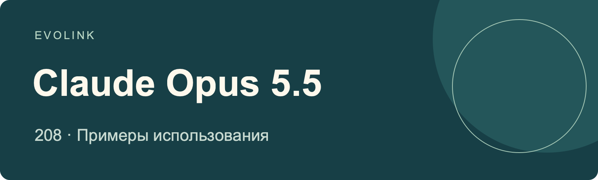
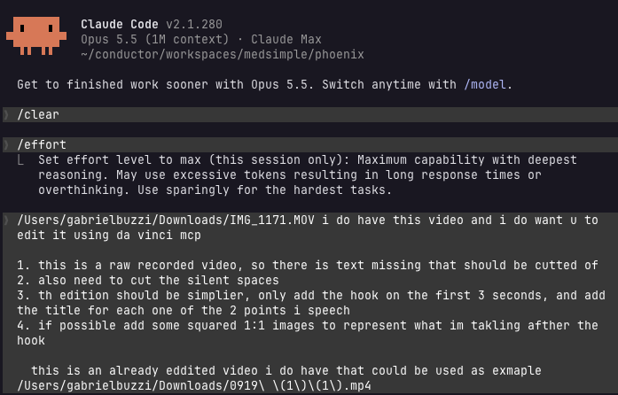
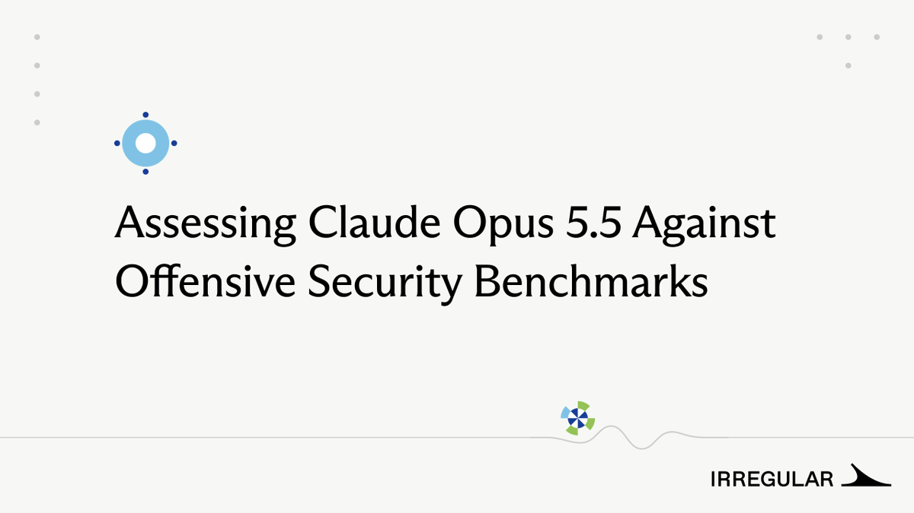

# Примеры использования Claude Opus 5.5
Подтверждённые источниками процессы, демонстрации, сравнения и ограничения

## 🍌 Введение

**Посмотрите, что люди создали и протестировали с Claude Opus 5.5: игры, 3D-сцены, инструменты программирования, исследования и творческие процессы. Каждая запись ссылается на своего издателя и сохраняет ограничения исходного утверждения.**

[Изучить Claude Opus 5.5 на EvoLink](https://evolink.ai/claude-opus-5-5?utm_source=github&utm_medium=readme&utm_campaign=awesome-claude-opus-5-5-usecases&utm_content=introduction_cta)

## 📊 Обзор

**208 отобранных примеров Claude Opus 5.5** в творчестве, разработке, исследованиях и оценке.

- Изучайте официальные руководства вместе с демонстрациями сообщества, рабочими процессами, сравнениями и документированными ограничениями.
- Каждая запись включает исходный источник, издателя, дату публикации источника, краткий вывод и заметки, опирающиеся на источник.
- Используйте содержание для выбора задачи и переходите к её источнику за раскрытыми инструментами, входными данными и результатами.

> [!NOTE]
> Это сообщения с атрибуцией источников, а не независимые воспроизведения. Видео и графика, созданные с помощью инструментов, не доказывают встроенную генерацию медиа. Рекламные сравнения сохраняют атрибуцию; повторные публикации не являются независимыми экспериментами. Даты ниже — даты публикации источников (UTC), а не импорта.

## ⚡ Быстрый старт

1. [Откройте страницу модели, чтобы проверить текущий доступ и возможности](https://evolink.ai/claude-opus-5-5?utm_source=github&utm_medium=quickstart&utm_campaign=awesome-claude-opus-5-5-usecases&utm_content=model_link)
2. [Создайте API-ключ в панели EvoLink](https://evolink.ai/dashboard/keys?utm_source=github&utm_medium=quickstart&utm_campaign=awesome-claude-opus-5-5-usecases&utm_content=api_key)
3. [Следуйте указанному на странице модели специализированному руководству API или инструкциям для агентов](https://evolink.ai/docs/en/api-manual/language-series/claude/claude-messages-api?utm_source=github&utm_medium=docs&utm_campaign=awesome-claude-opus-5-5-usecases&utm_content=first_run)

## 📑 Содержание

| [Обзор](#overview) | [Быстрый старт](#quick-start) | [Связанные репозитории](#related-repositories) | [Благодарности](#acknowledge) |
|---|---|---|---|

| Пример | Категория | Что показано | Тип |
|---|---|---|---|
| [Пример 1: Официально опубликованный короткий фильм об арбузе](#case-1) | [Официальные руководства и демонстрации](#category-official) | Используйте официально опубликованный фильм об арбузе как пример повествования, учитывая, что процесс его создания не описан. | Demo |
| [Пример 2: Передача задачи целиком](#case-2) | [Официальные руководства и демонстрации](#category-official) | Прежде чем делегировать задачу целиком, определите критерии завершения и контрольные точки. | Tutorial |
| [Пример 3: Сравнение игр о самураях](#case-3) | [Разработка игр](#category-games) | Сравнивайте результаты создания игры о самураях с учётом того, что издатель продвигает собственную платформу. | Evaluation |
| [Пример 4: Демонстрация Mario Kart за один проход](#case-4) | [Разработка игр](#category-games) | Изучите доступных персонажей этой игры о картинге, по сообщению платформы созданной за один проход, прежде чем принимать её оценку качества. | Demo |
| [Пример 5: Браузерный клон Minecraft](#case-5) | [Разработка игр](#category-games) | Изучите браузерную демонстрацию Minecraft, чтобы оценить результат этой попытки генерации игры. | Demo |
| [Пример 6: Механическая игра в одном HTML-файле](#case-6) | [Разработка игр](#category-games) | Рассмотрите формат одного HTML-файла для процедурной графики и звука в игре, как в этой демонстрации платформы. | Demo |
| [Пример 7: Аниме-файтинг с Roblox toolbox](#case-7) | [Разработка игр](#category-games) | Учитывайте ресурсы Roblox toolbox при оценке файтинга, заявленного как результат одного прохода. | Demo |
| [Пример 8: Сравнение игры о Spider-Man у трёх моделей](#case-8) | [Разработка игр](#category-games) | Сравнивайте результаты трёх моделей по одним и тем же видимым элементам игры о Spider-Man. | Evaluation |
| [Пример 9: Клон Minecraft с физикой воды](#case-9) | [Разработка игр](#category-games) | Сопоставьте заявленный результат моделирования воды с отмеченной автором большей длительностью работы модели. | Demo |
| [Пример 10: Сцены DEAD SIGNAL от первого лица](#case-10) | [Разработка игр](#category-games) | Изучайте сцены от первого лица, созданные по одинаковому запросу, отдельно от оценок качества платформой. | Evaluation |
| [Пример 11: Игра о пчеловодстве, нарисованная кодом](#case-11) | [Разработка игр](#category-games) | Используйте демонстрацию пчеловодства как пример рисования игровых объектов и реализации механик средствами кода. | Demo |
| [Пример 12: Демонстрация «Змейки»](#case-12) | [Разработка игр](#category-games) | Изучите эту «Змейку» как компактный пример сгенерированной игровой логики и оформления. | Demo |
| [Пример 13: Сравнение результатов создания 3D-игр с Sol](#case-13) | [Разработка игр](#category-games) | Сравнивайте показанные 3D-игры, не принимая предпочтение платформы за независимую оценку. | Evaluation |
| [Пример 14: Многопользовательский бильярд и наблюдение за матчами](#case-14) | [Разработка игр](#category-games) | Проверьте игру по ссылке, прежде чем полагаться на заявленные многопользовательские режимы и активность игроков. | Demo |
| [Пример 15: Аркадная игра через Higgsfield API](#case-15) | [Разработка игр](#category-games) | Изучите отражения в воде и аркадный игровой процесс в этой демонстрации платформы на основе API. | Integration |
| [Пример 16: Воссоздание Minecraft в браузере](#case-16) | [Разработка игр](#category-games) | Используйте браузерную версию, чтобы оценить видимый масштаб попытки воссоздать Minecraft. | Demo |
| [Пример 17: Стрижка газона со зрителями стрима](#case-17) | [Разработка игр](#category-games) | Рассмотрите возможность пригласить зрителей стрима протестировать многопользовательский прототип на личном сервере. | Demo |
| [Пример 18: Шутер в рисованном стиле с финальным боссом](#case-18) | [Разработка игр](#category-games) | Изучите, как шутер, заявленный как результат одного прохода, сочетает рисованный стиль и финального босса. | Demo |
| [Пример 19: Игра Mario при настройке Medium](#case-19) | [Разработка игр](#category-games) | Используйте эту демонстрацию Mario как пример генерации игры с уровнем усилий Medium. | Demo |
| [Пример 20: Сравнение видеозаписей картинга](#case-20) | [Разработка игр](#category-games) | Сравнивайте видимое поведение игр на видеозаписях картинга, а не предполагаемые возможности моделей. | Evaluation |
| [Пример 21: Сравнение игр по одинаковому запросу с GPT-6 Sol](#case-21) | [Разработка игр](#category-games) | Откройте игры, созданные по одинаковому запросу, чтобы сравнить реальный игровой опыт. | Evaluation |
| [Пример 22: «Змейка», сгенерированная за один проход](#case-22) | [Разработка игр](#category-games) | Используйте заявленную генерацию «Змейки» за один проход как пример задачи небольшого масштаба. | Demo |
| [Пример 23: Игра о зомби на Three.js](#case-23) | [Разработка игр](#category-games) | Изучите демонстрацию Three.js с игровыми механиками, текстурами и звуком, созданными без файлов ресурсов. | Demo |
| [Пример 24: Снежная игра после двух раундов доработки](#case-24) | [Разработка игр](#category-games) | Закладывайте раунды доработки и время работы для снежной игры с согласованными визуальными и звуковыми эффектами. | Demo |
| [Пример 25: Игровые функции и монтаж трейлера](#case-25) | [Разработка игр](#category-games) | Изучите доступную для игры версию вместе с трейлером, сохраняя указание автора на партнёрство. | Demo |
| [Пример 26: Многопользовательский остров выживания в Tesana](#case-26) | [Разработка игр](#category-games) | Проверьте многопользовательские системы острова Tesana, прежде чем полагаться на заявленную длительность игры. | Demo |
| [Пример 27: Сравнение игр в Unreal Engine](#case-27) | [Разработка игр](#category-games) | Сравнивайте результаты создания игр в Unreal Engine в контексте процесса работы платформы Higgsfield. | Evaluation |
| [Пример 28: RPG в жанре тёмного фэнтези в Tesana](#case-28) | [Разработка игр](#category-games) | Изучите сочетание локаций, заданий и озвученных диалогов в RPG Tesana, учитывая невыясненный статус партнёрства. | Demo |
| [Пример 29: Гитарный магазин с драками из-за шума](#case-29) | [Разработка игр](#category-games) | Проверьте производительность, прежде чем расширять симулятор магазина на Three.js с сотнями гитар, на которых можно играть. | Demo |
| [Пример 30: Рисованные шахматы с анализом ходов](#case-30) | [Разработка игр](#category-games) | Изучите, как шахматная демонстрация сочетает рисованное оформление и анализ ходов. | Demo |
| [Пример 31: Сравнение авиасимулятора с Kimi K3](#case-31) | [Разработка игр](#category-games) | Сопоставляйте поведение авиасимулятора и заявленную стоимость при выборе между двумя результатами. | Evaluation |
| [Пример 32: Фэнтезийный мир в Tesana по одному запросу](#case-32) | [Разработка игр](#category-games) | Изучите демонстрацию фэнтезийного мира Tesana, чтобы оценить совмещённый результат платформы: игру, звук и интерфейс. | Demo |
| [Пример 33: Игра о стрельбе из лука менее чем за десять минут](#case-33) | [Разработка игр](#category-games) | Изучите развёрнутую игру о стрельбе из лука, прежде чем обобщать заявленное время создания менее десяти минут. | Demo |
| [Пример 34: Сравнение клонов Minecraft и Warcraft](#case-34) | [Разработка игр](#category-games) | Сравнивайте опубликованные игры и запросы, сохраняя контекст уровня усилий, времени и оценочной стоимости. | Evaluation |
| [Пример 35: Результат и стоимость Runescape Bench](#case-35) | [Разработка игр](#category-games) | Рассматривайте заявленные стоимость и место в Runescape Bench только как свидетельство результатов его игровых задач. | Evaluation |
| [Пример 36: Интерактивные обои с коралловым рифом](#case-36) | [Интерактивное обучение и визуализация](#category-education) | Используйте кормление рыб как пример добавления интерактивности фоновым обоям. | Demo |
| [Пример 37: Симуляция воды со стрима](#case-37) | [Интерактивное обучение и визуализация](#category-education) | Изучите показанную симуляцию воды как один результат более длительного стрима. | Demo |
| [Пример 38: Воссоздание 3D-воды по видео](#case-38) | [Интерактивное обучение и визуализация](#category-education) | Сравните воссозданную воду с исходным видео, прежде чем принимать оценку точности автора. | Demo |
| [Пример 39: Послойное изучение анатомии кисти](#case-39) | [Интерактивное обучение и визуализация](#category-education) | Изучите послойный анатомический интерфейс, не полагаясь на непроверенные рекомендации о боли или восстановлении. | Demo |
| [Пример 40: Симулятор прикосновения к траве в Kilo Code](#case-40) | [Интерактивное обучение и визуализация](#category-education) | Сравнивайте результаты симулятора прикосновения к траве вместе с указанной платформой стоимостью каждого запуска. | Evaluation |
| [Пример 41: Превращение эскиза требушета в симуляцию](#case-41) | [Интерактивное обучение и визуализация](#category-education) | Используйте демонстрацию требушета как пример перехода от эскиза к симуляции, сохраняя указание на вторичный источник. | Demo |
| [Пример 42: Рельсы и маятниковые механизмы](#case-42) | [Интерактивное обучение и визуализация](#category-education) | Разделяйте время работы API и общее время с простоями при оценке затрат на симуляцию механизма. | Demo |
| [Пример 43: Лица при разной гравитации](#case-43) | [Интерактивное обучение и визуализация](#category-education) | Изучайте демонстрацию изменения лица под действием гравитации, сохраняя указание на возможное партнёрство. | Demo |
| [Пример 44: Объяснение устройства Веба через связанные страницы](#case-44) | [Интерактивное обучение и визуализация](#category-education) | Рассмотрите связанные HTML-страницы для интерактивного объяснения, закладывая время на заявленный длительный запуск. | Demo |
| [Пример 45: Интерактивная 3D-страница для изучения глаза](#case-45) | [Интерактивное обучение и визуализация](#category-education) | Используйте демонстрацию исследования глаза как пример послойного 3D-учебного интерфейса. | Evaluation |
| [Пример 46: Незавершённая интерактивная шкала Вселенной](#case-46) | [Интерактивное обучение и визуализация](#category-education) | Установите контрольные точки расхода лимита перед интерактивным проектом от масштаба Вселенной до планковского масштаба. | Limit |
| [Пример 47: Сравнение десятисекундных сцен Blender](#case-47) | [3D-моделирование и сцены](#category-3d) | Сравнивайте сцены Blender с учётом времени работы, расхода токенов и стоимости в эквиваленте API. | Evaluation |
| [Пример 48: Сан-Франциско в Unreal Engine с Jev](#case-48) | [3D-моделирование и сцены](#category-3d) | Учитывайте роль Jev при оценке поведения объектов в этой городской сцене Unreal Engine. | Integration |
| [Пример 49: Планировщик спортзала с 500 типами оборудования](#case-49) | [3D-моделирование и сцены](#category-3d) | Используйте планировщик спортзала как пример сочетания визуализированного каталога оборудования и управления планировкой. | Demo |
| [Пример 50: Сравнение запуска ракеты у четырёх моделей](#case-50) | [3D-моделирование и сцены](#category-3d) | Сравнивайте результаты четырёх моделей вместе с указанными платформой временем и стоимостью. | Evaluation |
| [Пример 51: Пеликан на велосипеде](#case-51) | [3D-моделирование и сцены](#category-3d) | Изучайте пеликана на велосипеде как визуальный результат, а не как документированный рабочий процесс. | Demo |
| [Пример 52: Маркет-стрит до землетрясения 1906 года](#case-52) | [3D-моделирование и сцены](#category-3d) | Считайте историческую сцену Маркет-стрит интерпретацией в Blender, пока её точность не проверена. | Demo |
| [Пример 53: Зацикленный пеликан в Blender в сравнении с Sol](#case-53) | [3D-моделирование и сцены](#category-3d) | Сравнивайте зацикленные анимации пеликана отдельно от предпочтений платформы относительно его характера. | Evaluation |
| [Пример 54: Демонстрация работы в Blender](#case-54) | [3D-моделирование и сцены](#category-3d) | Изучите результат Blender напрямую, поскольку публикация не описывает ни его тему, ни процесс создания. | Demo |
| [Пример 55: Создание ветряной мельницы в Blender](#case-55) | [3D-моделирование и сцены](#category-3d) | Изучите демонстрацию мельницы как пример объединённого процесса моделирования, риггинга, текстурирования и анимации в Blender. | Demo |
| [Пример 56: Мост Золотые Ворота, созданный кодом](#case-56) | [3D-моделирование и сцены](#category-3d) | Сравните созданную кодом сцену моста с материалом по ссылке, прежде чем принимать оценку качества автора. | Evaluation |
| [Пример 57: Вулканические острова, морская жизнь и полярные сияния](#case-57) | [3D-моделирование и сцены](#category-3d) | Не выводите окончательный рейтинг моделей из двух разных пейзажных сцен. | Evaluation |
| [Пример 58: Перепроектирование суставов экзоскелета в Blender](#case-58) | [3D-моделирование и сцены](#category-3d) | Рассматривайте изменённый экзоскелет как предложение по моделированию, пока его механическая надёжность не проверена. | Demo |
| [Пример 59: Соларпанк-город в Cowork](#case-59) | [3D-моделирование и сцены](#category-3d) | Изучите соларпанк-сцену как заявленный пример построения 3D-окружения в Cowork. | Demo |
| [Пример 60: Нью-йоркский квартал на Three.js](#case-60) | [3D-моделирование и сцены](#category-3d) | Проверяйте циклы рендеринга и движение камеры при сравнении двух вариантов сцены Нью-Йорка. | Evaluation |
| [Пример 61: Ещё одна работа с пеликаном на велосипеде](#case-61) | [3D-моделирование и сцены](#category-3d) | Изучите этого пеликана на велосипеде как дополнительный визуальный пример на ту же тему. | Demo |
| [Пример 62: Модель синкансэна в Blender](#case-62) | [3D-моделирование и сцены](#category-3d) | Проверьте модель синкансэна, прежде чем полагаться на заявленные платформой количества объектов и сидений. | Demo |
| [Пример 63: Низкополигональная 3D-модель из изображения](#case-63) | [3D-моделирование и сцены](#category-3d) | Оценивайте геометрическую детализацию наряду с точностью цвета в заявленном результате преобразования изображения в 3D. | Demo |
| [Пример 64: Создание персонажа с Tripo P2, JEF и MCP](#case-64) | [3D-моделирование и сцены](#category-3d) | Учитывайте Tripo P2, JEF и Blender MCP при оценке процесса создания персонажа. | Integration |
| [Пример 65: Превращение фото и планов дома в 3D](#case-65) | [3D-моделирование и сцены](#category-3d) | Рассмотрите сочетание фотографии дома и поэтажных планов для прототипирования модели с интерактивным браузерным просмотром. | Demo |
| [Пример 66: Тест генерации корабля в бутылке](#case-66) | [3D-моделирование и сцены](#category-3d) | Изучите композицию сцены с кораблём в бутылке, не предполагая неописанный процесс создания. | Demo |
| [Пример 67: DeLorean, часовая башня и молния](#case-67) | [3D-моделирование и сцены](#category-3d) | Сравнивайте поведение анимированной сцены вместе с использованием генераторов, временем работы и оценочной стоимостью каждой модели. | Evaluation |
| [Пример 68: Четыре этапа от эскиза до готового дома](#case-68) | [3D-моделирование и сцены](#category-3d) | Используйте поэтапные виды Three.js и TSL, чтобы показать развитие здания от эскиза до завершения. | Demo |
| [Пример 69: Сравнение 3D-результатов и заявленных затрат](#case-69) | [3D-моделирование и сцены](#category-3d) | Сопоставляйте показанный 3D-результат с заявленной платформой разницей затрат. | Evaluation |
| [Пример 70: Картина как сцена для исследования](#case-70) | [3D-моделирование и сцены](#category-3d) | Используйте расширение картины как пример изучения плоской композиции с разных 3D-ракурсов. | Integration |
| [Пример 71: 3D-симулятор расстановки мебели](#case-71) | [3D-моделирование и сцены](#category-3d) | Рассмотрите 3D-симулятор планировки для сравнения вариантов расстановки мебели перед выбором дизайна. | Demo |
| [Пример 72: Угольный рисунок, преобразованный в 3D](#case-72) | [3D-моделирование и сцены](#category-3d) | Изучите, как преобразование рисунка углём в Blender переносит текстуру штрихов в 3D-сцену. | Demo |
| [Пример 73: Многопользовательская прогулка по средиземноморской гавани](#case-73) | [3D-моделирование и сцены](#category-3d) | При оценке прогулки по гавани различайте процедурные декорации и звук и импортированные модели людей. | Demo |
| [Пример 74: Демонстрация 3D-контроллера](#case-74) | [3D-моделирование и сцены](#category-3d) | Изучайте демонстрацию контроллера и запрошенное видео отдельно от упомянутой прежней задачи SVG. | Demo |
| [Пример 75: Храмовый сад в стиле Minecraft](#case-75) | [3D-моделирование и сцены](#category-3d) | Сравнивайте превью храмового сада, не обобщая предпочтение автора относительно модели. | Evaluation |
| [Пример 76: Моделирование и анимация осьминога в Blender](#case-76) | [3D-моделирование и сцены](#category-3d) | Изучайте модель и анимацию осьминога, не принимая рекламную формулировку платформы за рейтинг качества. | Demo |
| [Пример 77: Сравнение Нью-Йорка по одинаковому запросу](#case-77) | [3D-моделирование и сцены](#category-3d) | Сравнивайте одну задачу сцены Нью-Йорка, сохраняя сведения о версиях моделей и настройках усилий. | Evaluation |
| [Пример 78: Живописный полёт над разными ландшафтами](#case-78) | [3D-моделирование и сцены](#category-3d) | Посмотрите видео о создании, чтобы понять, как живописный полёт соединяет разные ландшафты. | Demo |
| [Пример 79: Воксельная анимация Claude](#case-79) | [3D-моделирование и сцены](#category-3d) | Используйте демонстрацию воксельного персонажа как пример анимации стилизованной фигуры Claude. | Demo |
| [Пример 80: Воксельный пеликан в сравнении с Fable и Astra](#case-80) | [3D-моделирование и сцены](#category-3d) | Сравнивайте воксельных пеликанов, ограничивая заявление автора о расходе токенов этой попыткой. | Evaluation |
| [Пример 81: Гоночный автомобиль в сравнении с GPT-6 Sol](#case-81) | [3D-моделирование и сцены](#category-3d) | Изучайте модели гоночного автомобиля рядом, не делая выводов о возможностях за пределами показанного результата. | Evaluation |
| [Пример 82: Симуляция кошачьей шерсти с ускорением GPU](#case-82) | [3D-моделирование и сцены](#category-3d) | Используйте демонстрацию кошачьей шерсти как пример симуляции на Three.js с ускорением GPU. | Demo |
| [Пример 83: Сравнение воксельного строительства в Minecraft](#case-83) | [3D-моделирование и сцены](#category-3d) | Отделяйте предпочтение автора в Minecraft от формального теста VoxelBench, который пока только запланирован. | Evaluation |
| [Пример 84: Тест космического корабля у трёх моделей](#case-84) | [3D-моделирование и сцены](#category-3d) | Учитывайте различия настроек рассуждения при сравнении трёх результатов создания космического корабля. | Evaluation |
| [Пример 85: Сравнение Three.js с Opus 5](#case-85) | [3D-моделирование и сцены](#category-3d) | Перейдите на указанную платформу оценки, чтобы изучить сравнение версий Opus на задачах Three.js. | Evaluation |
| [Пример 86: Короткие фильмы об апокалипсисе на Three.js](#case-86) | [3D-моделирование и сцены](#category-3d) | Учитывайте разные среды запуска, возможности исправлений и оценочные затраты перед сравнением отрендеренных фильмов. | Evaluation |
| [Пример 87: Басовая музыка, синтезированная на JavaScript](#case-87) | [Музыка и звук](#category-audio) | Используйте демонстрацию басовой музыки как пример синтеза звука непосредственно на JavaScript. | Demo |
| [Пример 88: Заявленный идеальный результат поиска музыкальных ошибок](#case-88) | [Музыка и звук](#category-audio) | Считайте безошибочный результат поиска ошибок в хоралах заявленным итогом на десяти фрагментах, ожидающим более широкой проверки. | Evaluation |
| [Пример 89: Процесс генерации звуковых эффектов](#case-89) | [Музыка и звук](#category-audio) | Изучите процесс создания звуков напрямую, поскольку публикация не уточняет полученные эффекты. | Demo |
| [Пример 90: Сравнение графики портативной консоли Pocket Color](#case-90) | [Творческая графика и анимация](#category-graphics) | Сравнивайте графику портативной консоли по видимым внешним деталям, а не предполагаемым функциям устройства. | Evaluation |
| [Пример 91: Анимация Sweet Tooth за 18m 31s](#case-91) | [Творческая графика и анимация](#category-graphics) | Изучите анимацию Sweet Tooth, прежде чем обобщать заявленное время её создания за один проход. | Demo |
| [Пример 92: Мультфильм о Claude и AGI](#case-92) | [Творческая графика и анимация](#category-graphics) | Используйте мультфильм как визуальный пример, сохраняя неопределённость процесса его создания. | Demo |
| [Пример 93: Пиксельная анимация волшебника, созданная кодом](#case-93) | [Творческая графика и анимация](#category-graphics) | Изучите пиксельную анимацию, созданную кодом, и найдите заявленный автором запрос в ответах. | Demo |
| [Пример 94: Покадровая анимация на JavaScript](#case-94) | [Творческая графика и анимация](#category-graphics) | Используйте анимацию с прорисованными кадрами как пример создания движения средствами рендеринга JavaScript. | Demo |
| [Пример 95: SVG-анимация Nintendo Switch](#case-95) | [Творческая графика и анимация](#category-graphics) | Соотнесите требования к SVG-анимации с заявленным расходом лимита сессии при уровне усилий Max. | Evaluation |
| [Пример 96: Созданная кодом анимация решения задач](#case-96) | [Творческая графика и анимация](#category-graphics) | Используйте анимацию на чистом коде как творческое изображение решения задач, а не объяснение процессов модели. | Demo |
| [Пример 97: Опубликованный цикл пеликана на велосипеде](#case-97) | [Творческая графика и анимация](#category-graphics) | Изучайте движение велосипеда, сохраняя вторичную атрибуцию опубликованной анимации. | Demo |
| [Пример 98: Сравнение SVG-контроллера PS5](#case-98) | [Творческая графика и анимация](#category-graphics) | Сравнивайте детализацию и затенение контроллера отдельно от рекламной оценки качества BridgeMind. | Evaluation |
| [Пример 99: Вода и частицы в Devin](#case-99) | [Творческая графика и анимация](#category-graphics) | Сравнивайте визуальные результаты Devin вместе с раскрытыми автором аффилированностью, временем и затратами. | Evaluation |
| [Пример 100: Анимация об Октоберфесте](#case-100) | [Творческая графика и анимация](#category-graphics) | Изучите анимацию об Октоберфесте и инструкции по ссылке, прежде чем полагаться на заявленное время создания за один проход. | Demo |
| [Пример 101: Музыка и изображение, написанные на JavaScript](#case-101) | [Творческая графика и анимация](#category-graphics) | Используйте совмещённую демонстрацию музыки и изображения как пример JavaScript с ограниченной доказательностью более широких заявлений о замене других процессов. | Demo |
| [Пример 102: Интерактивная анимация только на JavaScript](#case-102) | [Творческая графика и анимация](#category-graphics) | Изучите использование JavaScript в интерактивной анимации без заявленных внешних ресурсов или расширений. | Demo |
| [Пример 103: Сравнение анимации у трёх моделей](#case-103) | [Творческая графика и анимация](#category-graphics) | Сравнивайте три анимации с учётом общих исходных данных и времени работы, указанного автором. | Evaluation |
| [Пример 104: Контроллер Xbox в 334 строках SVG](#case-104) | [Творческая графика и анимация](#category-graphics) | Изучайте компактный SVG-контроллер с учётом заявленного большого расхода токенов при уровне усилий Max. | Demo |
| [Пример 105: Воссоздание эффектов по референсам в TouchDesigner](#case-105) | [Творческая графика и анимация](#category-graphics) | Учитывайте TouchDesigner при оценке воссоздания эффектов по референсам. | Integration |
| [Пример 106: Визуальный тест Game Boy](#case-106) | [Творческая графика и анимация](#category-graphics) | Самостоятельно сравните варианты Game Boy, прежде чем принимать визуальное предпочтение автора. | Evaluation |
| [Пример 107: Демонстрация анимации на JavaScript](#case-107) | [Творческая графика и анимация](#category-graphics) | Используйте анимацию JavaScript как пример результата, поскольку полное описание процесса создания отсутствует. | Demo |
| [Пример 108: Анимация и звук в CoAnimator](#case-108) | [Творческая графика и анимация](#category-graphics) | Изучите, как CoAnimator объединяет анимацию, временные шкалы и звук в собственном приложении разработчика. | Integration |
| [Пример 109: 3D-камера и текстовые эффекты в HyperFrames](#case-109) | [Творческая графика и анимация](#category-graphics) | Учитывайте HyperFrames при оценке показанных эффектов 3D-камеры и текста. | Integration |
| [Пример 110: Пиксельная анимация менее чем за пять минут](#case-110) | [Творческая графика и анимация](#category-graphics) | Изучите пиксельную анимацию и найдите обещанный запрос в ответах. | Demo |
| [Пример 111: SVG-контроллер с ресурсом PNG](#case-111) | [Творческая графика и анимация](#category-graphics) | Проверяйте встроенные изображения, прежде чем называть SVG-результат полностью нарисованным векторно. | Demo |
| [Пример 112: Воссоздание эффекта ChronoVolume](#case-112) | [Творческая графика и анимация](#category-graphics) | Сравните воссозданный эффект ChronoVolume с референсом и указанными платформой стоимостью и временем работы. | Demo |
| [Пример 113: Фонтан по одинаковому запросу](#case-113) | [Творческая графика и анимация](#category-graphics) | Сравнивайте изображения фонтана при общем запросе и максимальных настройках усилий. | Evaluation |
| [Пример 114: Рисование Моны Лизы в SVG](#case-114) | [Творческая графика и анимация](#category-graphics) | Изучите два SVG-варианта Моны Лизы, сохраняя настройку усилий указанного сравнения. | Evaluation |
| [Пример 115: Сравнение SVG с Sol и Luna](#case-115) | [Творческая графика и анимация](#category-graphics) | Ограничивайте сравнение SVG трёх моделей видимыми результатами и личным суждением автора. | Evaluation |
| [Пример 116: Рисование фотографии в Paint через скрипт](#case-116) | [Творческая графика и анимация](#category-graphics) | Явно задайте и проверьте работу только мышью, если изображение через скрипт не соответствует задаче Paint. | Limit |
| [Пример 117: Claude в образе маленького солнца](#case-117) | [Творческая графика и анимация](#category-graphics) | Считайте изображение маленького солнца фантазией на тему автопортрета, а не свидетельством переживаний модели. | Demo |
| [Пример 118: Тест рисования пеликана](#case-118) | [Творческая графика и анимация](#category-graphics) | Используйте рисунок пеликана как образец результата с недоступными запросом и процессом создания. | Demo |
| [Пример 119: Фонтаны и глаза летучих мышей в пиксельной графике](#case-119) | [Творческая графика и анимация](#category-graphics) | Сравнивайте анимированные детали пиксельных сцен отдельно от субъективных стилевых предпочтений. | Evaluation |
| [Пример 120: Изображение Сан-Франциско](#case-120) | [Творческая графика и анимация](#category-graphics) | Изучайте работу о Сан-Франциско, не приписывая ей неуказанный набор производственных инструментов. | Demo |
| [Пример 121: Пеликан на велосипеде в сравнении с Grok 4.7](#case-121) | [Творческая графика и анимация](#category-graphics) | Сравните анимации пеликана напрямую, прежде чем принимать вывод автора о более устойчивом движении. | Evaluation |
| [Пример 122: Генератор искусства из «subtle art»](#case-122) | [Творческая графика и анимация](#category-graphics) | Попробуйте генератор искусства по ссылке, сохраняя сведения о связи автора с платформой. | Demo |
| [Пример 123: Ремейк по мотивам John Wick](#case-123) | [Творческая графика и анимация](#category-graphics) | Используйте анимацию на тему John Wick как визуальный пример с неописанным процессом генерации. | Demo |
| [Пример 124: Четыре SVG-результата и сбой при Max](#case-124) | [Творческая графика и анимация](#category-graphics) | Рассматривайте SVG-результаты разных уровней усилий вместе с заявленным исчерпанием токенов при Max и стоимостью неудачной попытки. | Evaluation |
| [Пример 125: SVG-бенчмарк MacBook Pro](#case-125) | [Творческая графика и анимация](#category-graphics) | Рассматривайте SVG-результаты MacBook Pro как собственную оценку Playcode для конкретной задачи и её продуктовое решение. | Evaluation |
| [Пример 126: Итерации личного сайта и создание его трейлера](#case-126) | [Сайты и интерфейсы](#category-web) | Рассмотрите итеративную критику дизайна и трейлер истории версий для документирования редизайна личного сайта. | Demo |
| [Пример 127: Сайт каталога минералов по восьми референсам](#case-127) | [Сайты и интерфейсы](#category-web) | Закладывайте несколько референсов и запросы на доработку для показанного стиля каталога минералов. | Demo |
| [Пример 128: Редизайн существующего приложения с одинаковой целью](#case-128) | [Сайты и интерфейсы](#category-web) | Сравнивайте варианты редизайна относительно одного исходного приложения и заявленной цели. | Evaluation |
| [Пример 129: Тесты фронтенда с зависшими попытками вулкана](#case-129) | [Сайты и интерфейсы](#category-web) | Учитывайте зависшие попытки и расход токенов рассуждения при оценке генерации фронтенда. | Limit |
| [Пример 130: Интерфейс связанных заметок без навыка дизайна](#case-130) | [Сайты и интерфейсы](#category-web) | Изучайте интерфейс связанных заметок, не предполагая, что вся его функциональность проверена. | Demo |
| [Пример 131: Интерфейс за один проход в сравнении с Grok 4.7](#case-131) | [Сайты и интерфейсы](#category-web) | Сравнивайте два интерфейса с учётом разных дат запусков по одинаковому запросу. | Evaluation |
| [Пример 132: Приложение для снятия стресса за 23 минуты](#case-132) | [Сайты и интерфейсы](#category-web) | Изучайте приложение для снятия стресса как прототип, не предполагая доказанного терапевтического эффекта. | Demo |
| [Пример 133: Посадочная страница Stratus на тему погоды](#case-133) | [Сайты и интерфейсы](#category-web) | Используйте погодную посадочную страницу как пример дизайна с контекстом заявленных стоимости и времени. | Demo |
| [Пример 134: Интерактивная обратная CAPTCHA](#case-134) | [Сайты и интерфейсы](#category-web) | Рассмотрите взаимодействие с обратной CAPTCHA как эксперимент с неоднозначными вопросами. | Demo |
| [Пример 135: Личный инструмент взаимодействий с импортом Figma](#case-135) | [Сайты и интерфейсы](#category-web) | Используйте импортированные дизайн-референсы и небольшие исправления для исследования и изучения взаимодействий интерфейса. | Demo |
| [Пример 136: PonteMLX для наблюдения за локальными моделями](#case-136) | [Сайты и интерфейсы](#category-web) | Изучайте интерфейс мониторинга с учётом отдельной локальной модели генерации изображений. | Integration |
| [Пример 137: Превью панели логистического планирования](#case-137) | [Сайты и интерфейсы](#category-web) | Считайте снимок логистики свидетельством интерфейса, пока серверная часть и работа планирования не проверены. | Demo |
| [Пример 138: Сравнение сайта творческой студии с WebGL](#case-138) | [Сайты и интерфейсы](#category-web) | Сравнивайте страницы студии с общими требованиями к WebGL, типографике и прокрутке. | Evaluation |
| [Пример 139: Интерфейс компонентов изометрических иконок](#case-139) | [Сайты и интерфейсы](#category-web) | Изучайте интерфейс изометрических компонентов, не считая снимок доказательством их работоспособности. | Demo |
| [Пример 140: Страница выбора игр в стиле портативной консоли](#case-140) | [Сайты и интерфейсы](#category-web) | Считайте страницу выбора в стиле портативной консоли демонстрацией интерфейса, пока запуск игр не проверен. | Demo |
| [Пример 141: Инструмент векторизации изображений за один проход](#case-141) | [Сайты и интерфейсы](#category-web) | Проверьте точность преобразования разных типов изображений, прежде чем полагаться на заявленный инструмент векторизации за один проход. | Demo |
| [Пример 142: Сравнение посадочных страниц по общему запросу](#case-142) | [Сайты и интерфейсы](#category-web) | Сравнивайте галерею посадочных страниц с общим запросом, а не принимайте предпочтение автора. | Evaluation |
| [Пример 143: Редизайн существующего приложения с AppLlama MCP](#case-143) | [Сайты и интерфейсы](#category-web) | Отделяйте редизайн с AppLlama от выручки, относящейся к ранее существовавшему приложению. | Integration |
| [Пример 144: Точность и производительность преобразования изображения в HTML](#case-144) | [Сайты и интерфейсы](#category-web) | Проверяйте переходы и производительность при выполнении наряду с визуальной точностью в задачах преобразования изображения в HTML. | Evaluation |
| [Пример 145: Генерация 100 творческих HTML-файлов](#case-145) | [Сайты и интерфейсы](#category-web) | Выборочно изучите и протестируйте опубликованные HTML-результаты, прежде чем полагаться на заявление автора об отсутствии сломанных файлов. | Demo |
| [Пример 146: Доля успеха и средняя стоимость в Next.js](#case-146) | [Сайты и интерфейсы](#category-web) | Рассматривайте заявленные долю успеха и среднюю стоимость в рамках оценки конкретного фреймворка Next.js. | Evaluation |
| [Пример 147: Пропуск главного результата в десятиминутной задаче](#case-147) | [Бизнес-анализ и документы](#category-business) | Требуйте главный результат в первую очередь и явно задавайте бюджет и точку остановки. | Limit |
| [Пример 148: Поиск пробелов SEO по 347 страницам выдачи](#case-148) | [Бизнес-анализ и документы](#category-business) | Отделяйте заявленные охват SEO-исследования и соблюдение правил в черновиках от неизмеренных результатов поискового трафика. | Evaluation |
| [Пример 149: Анализ к Чёрной пятнице через Trendtrack MCP](#case-149) | [Бизнес-анализ и документы](#category-business) | Учитывайте доступ к данным через Trendtrack MCP при оценке процесса анализа к Чёрной пятнице. | Integration |
| [Пример 150: Обзоры научных статей со ссылками на доказательства в alphaXiv](#case-150) | [Бизнес-анализ и документы](#category-business) | Проверяйте привязанные к статье доказательства, прежде чем полагаться на автоматически созданные исследовательские обзоры. | Integration |
| [Пример 151: Тестирование цикла сводок рисков SafeForge](#case-151) | [Бизнес-анализ и документы](#category-business) | Запросите методы и метрики оценки, прежде чем обобщать выбор предпочтительной модели SafeForge. | Evaluation |
| [Пример 152: Обновление данных моделей на графике бенчмарка](#case-152) | [Бизнес-анализ и документы](#category-business) | Отличайте обновление графика бенчмарка от повторного выполнения исходной оценки. | Demo |
| [Пример 153: Сравнение создания индикатора между версиями](#case-153) | [Бизнес-анализ и документы](#category-business) | Сравнивайте результаты создания индикатора, сохраняя неопределённость неуказанного метода проверки. | Evaluation |
| [Пример 154: Процесс исходящих продаж по URL сайта](#case-154) | [Бизнес-анализ и документы](#category-business) | Отделяйте заявленную продуктом пропускную способность рассылки от непроверенных доли ответов и результатов продаж. | Integration |
| [Пример 155: Оценка бухгалтерских задач Ramp](#case-155) | [Бизнес-анализ и документы](#category-business) | Ограничивайте заявленные Ramp преимущества стоимости и скорости её запуском Accounting Bench. | Evaluation |
| [Пример 156: Команда из нескольких моделей с fable-advisor](#case-156) | [Агенты и процессы разработки](#category-agents) | Изучите роли моделей в открытом плагине, прежде чем применять его командный рабочий процесс. | Integration |
| [Пример 157: Передача задач и замена исполнителей в ntm](#case-157) | [Агенты и процессы разработки](#category-agents) | Используйте явную передачу контекста при замене исполнителей разных версий моделей в инструменте оркестрации. | Integration |
| [Пример 158: Управление агентами с Apple Watch](#case-158) | [Агенты и процессы разработки](#category-agents) | Изучайте отображение агентов и диктовку команд в приложении часов отдельно от предположений автора о RSI. | Demo |
| [Пример 159: Сохранение кэша запроса при смене усилий](#case-159) | [Агенты и процессы разработки](#category-agents) | Сохраняйте указанное требование к версии Claude Code при применении рекомендаций по смене усилий с сохранением кэша. | Tutorial |
| [Пример 160: Обновление кэша моделей T3 Code](#case-160) | [Агенты и процессы разработки](#category-agents) | Следуйте процедуре обновления кэша команды T3 Code, если ожидаемая модель отсутствует в списке. | Tutorial |
| [Пример 161: Проверка файлов проекта и истории сессий агентов](#case-161) | [Агенты и процессы разработки](#category-agents) | Сверяйте закономерности истории сессий с текущим кодом, прежде чем превращать их в улучшения проекта. | Tutorial |
| [Пример 162: Скорость нескольких агентов на ProgramBench](#case-162) | [Агенты и процессы разработки](#category-agents) | Учитывайте охват 166 из 200 задач при трактовке заявленного сравнения скорости нескольких агентов. | Evaluation |
| [Пример 163: Оценка 100 агентов на ProgramBench](#case-163) | [Агенты и процессы разработки](#category-agents) | Отделяйте оценку бенчмарка с 100 агентами от предположений о будущих механизмах координации. | Evaluation |
| [Пример 164: Отслеживание меток на одном уличном видео](#case-164) | [Визуальное понимание и аннотация](#category-vision) | Изучайте движущиеся метки, учитывая, что точность маркировки в этом сравнении платформы не измерена. | Evaluation |
| [Пример 165: Оценки обнаружения объектов Roboflow](#case-165) | [Визуальное понимание и аннотация](#category-vision) | Используйте таблицу лидеров Roboflow для оценки обнаружения объектов в пределах этой конкретной задачи. | Evaluation |
| [Пример 166: Сравнение процессов Seedance 2.5 в Medeo](#case-166) | [Монтаж и производство видео](#category-video) | При сравнении управляющих языковых моделей относите генерацию видео к Seedance 2.5. | Evaluation |
| [Пример 167: Пластилиновая анимация с Blender в Claude](#case-167) | [Монтаж и производство видео](#category-video) | Учитывайте Blender при оценке процесса пластилиновой анимации по одному запросу в Claude. | Integration |
| [Пример 168: Сравнение ремейков ролика о запуске в Tesseract](#case-168) | [Монтаж и производство видео](#category-video) | Сравнивайте ремейки ролика о запуске, явно учитывая роль Tesseract в монтаже и рендеринге. | Evaluation |
| [Пример 169: Тизер для DocJev](#case-169) | [Монтаж и производство видео](#category-video) | Отделяйте тизер продукта от ядра обработки документов, приписанного Jev. | Demo |
| [Пример 170: История моделей Claude с пользовательским навыком](#case-170) | [Монтаж и производство видео](#category-video) | Учитывайте собственный навык автора при оценке видео об истории моделей на JavaScript. | Integration |
| [Пример 171: Видео с оригами-тигром в Medeo](#case-171) | [Монтаж и производство видео](#category-video) | Сравнивайте процессы создания оригами-видео как управление Seedance 2.5 языковыми моделями. | Evaluation |
| [Пример 172: Реклама худи BridgeMind с Remotion](#case-172) | [Монтаж и производство видео](#category-video) | Изучайте тайминг и переходы ролика Remotion отдельно от субъективного рейтинга моделей его издателя. | Integration |
| [Пример 173: Время и стоимость рекламы Higgsfield](#case-173) | [Монтаж и производство видео](#category-video) | Рассматривайте сравнение времени и стоимости рекламного ролика как производственные сведения, сообщённые платформой. | Evaluation |
| [Пример 174: Ролик о запуске, написанный кодом по публикации о релизе](#case-174) | [Монтаж и производство видео](#category-video) | Рассмотрите публикацию о релизе как задание для ролика о запуске с изображением и звуком, созданными кодом. | Demo |
| [Пример 175: Опубликованная покадровая анимация мира глазами Claude](#case-175) | [Монтаж и производство видео](#category-video) | Считайте опубликованный покадровый фильм демонстрацией из вторичного источника с неуказанными инструментами. | Demo |
| [Пример 176: Доработка видео с музыкой от двух до 22 секунд](#case-176) | [Монтаж и производство видео](#category-video) | Сравните последовательные версии видео, чтобы изучить изменение длительности и написанной кодом музыки. | Demo |
| [Пример 177: Исправление видеоартефактов с Photoshop и Fusion](#case-177) | [Монтаж и производство видео](#category-video) | Изучайте исправления Photoshop и Fusion, не считая заявленную экономию времени независимо проверенной. | Integration |
| [Пример 178: Реклама Kotlin по его сайту](#case-178) | [Монтаж и производство видео](#category-video) | Учитывайте навыки HyperFrames при оценке процесса создания рекламы Kotlin по сайту. | Integration |
| [Пример 179: Монтаж исходных кадров в личном стиле](#case-179) | [Монтаж и производство видео](#category-video) | Предоставляйте видеореференс и проверяйте монтаж напрямую, когда просите соответствовать личному стилю. | Demo |
| [Пример 180: Превращение статьи Coinacademy в видео FLOP Labs](#case-180) | [Монтаж и производство видео](#category-video) | Используйте существующую статью как исходное задание для короткого вводного видео. | Demo |
| [Пример 181: Сравнение видео с GPT-6 Sol](#case-181) | [Монтаж и производство видео](#category-video) | Сравнивайте показанные видео, не предполагая общего запроса или набора производственных инструментов. | Evaluation |
| [Пример 182: Рекламное видео serai, созданное кодом](#case-182) | [Монтаж и производство видео](#category-video) | Изучайте созданную кодом рекламу serai, сохраняя неопределённость неуказанных инструментов рендеринга. | Demo |
| [Пример 183: Объясняющее видео об Opus 5.5 в Cowork](#case-183) | [Монтаж и производство видео](#category-video) | Проверяйте утверждения видео о модели и ценах отдельно от успешного создания самого ролика. | Demo |
| [Пример 184: Демонстрация видео и запланированное сочетание с fal](#case-184) | [Монтаж и производство видео](#category-video) | Отделяйте показанное видео от интеграции fal, которая пока остаётся будущей идеей. | Demo |
| [Пример 185: Монтаж папок UGC с анимированным текстом](#case-185) | [Монтаж и производство видео](#category-video) | Учитывайте роль Tesseract в анимации текста при оценке процесса монтажа UGC. | Integration |
| [Пример 186: Урок об арабском тексте в игровых движках](#case-186) | [Монтаж и производство видео](#category-video) | Сохраняйте сведения о зависимости от логотипа и звука ElevenLabs при оценке написанного кодом урока об арабском тексте. | Tutorial |
| [Пример 187: История зонта тушью с музыкой, написанной кодом](#case-187) | [Монтаж и производство видео](#category-video) | Используйте историю зонта как пример согласования изображения и оригинальной музыки, созданных кодом. | Demo |
| [Пример 188: Исправление 105 внесённых ошибок в двух репозиториях](#case-188) | [Поддержка кода и тестирование](#category-coding) | Сравнивайте количества исправлений и затраты с учётом неравномерно описанного числа повторов. | Evaluation |
| [Пример 189: Заявленная генерация чит-программы CS2](#case-189) | [Поддержка кода и тестирование](#category-coding) | Считайте программу CS2 непроверенным заявлением автора, не предполагая, что демонстрация доказывает её работу. | Demo |
| [Пример 190: Продолжающийся тест контрольных этапов circuit_eval](#case-190) | [Поддержка кода и тестирование](#category-coding) | Дождитесь завершения circuit_eval, прежде чем принимать прогресс контрольных этапов за окончательный результат. | Evaluation |
| [Пример 191: Прерывание задач системной разработки защитными механизмами](#case-191) | [Поддержка кода и тестирование](#category-coding) | Ограничивайте заявленные защитные прерывания незавершёнными задачами и сессией автора. | Limit |
| [Пример 192: Проверка личного веб-приложения на проблемы безопасности](#case-192) | [Поддержка кода и тестирование](#category-coding) | Отличайте проверку безопасности исходного кода от выполнения тестов безопасности против приложения. | Demo |
| [Пример 193: Поиск проблем в 12 патчах](#case-193) | [Поддержка кода и тестирование](#category-coding) | Сравнивайте результаты проверки патчей вместе с оценками затрат в эквиваленте API, не заявляя автоматического снижения стоимости. | Evaluation |
| [Пример 194: Отладка игрового проекта](#case-194) | [Поддержка кода и тестирование](#category-coding) | Считайте успех отладки игры ранним личным сообщением без публичных свидетельств воспроизведения. | Demo |
| [Пример 195: Бот проверки PR в Khan Academy](#case-195) | [Поддержка кода и тестирование](#category-coding) | Используйте отчёт о PR-боте как пример конкретной команды для измерения затрат, вызовов, времени и качества проверки. | Integration |
| [Пример 196: Отказ после защитного переключения на запасную модель](#case-196) | [Поддержка кода и тестирование](#category-coding) | Определите запасную модель, прежде чем приписывать окончательный отказ Opus 5.5. | Limit |
| [Пример 197: Подмножество CyScenarioBench из десяти задач](#case-197) | [Поддержка кода и тестирование](#category-coding) | Ограничивайте заявленную долю решений подмножеством CyScenarioBench из десяти задач. | Evaluation |
| [Пример 198: Сравнение объяснений понятия из опционов](#case-198) | [Тексты и объяснения](#category-writing) | Сравнивайте фрагменты объяснений, сохраняя раскрытие автором раннего доступа. | Evaluation |
| [Пример 199: Фрагмент рассказа о лесе и реке](#case-199) | [Тексты и объяснения](#category-writing) | Оцените прозу фрагмента, не восстанавливая отсутствующее писательское задание. | Demo |
| [Пример 200: Объяснение планировщика репозитория](#case-200) | [Тексты и объяснения](#category-writing) | При сокращении технического объяснения планировщика проверяйте и корректность, и отзывы читателей. | Demo |
| [Пример 201: Упрощение текста старой модели](#case-201) | [Тексты и объяснения](#category-writing) | Используйте заголовки до и после правки как конкретный пример упрощения текста. | Demo |
| [Пример 202: Десять агентов исследуют алгоритм кратчайшего пути](#case-202) | [Научные исследования и схемы](#category-science) | Добивайтесь независимой проверки доказательства и воспроизведения, прежде чем полагаться на заявленное улучшение кратчайшего пути. | Evaluation |
| [Пример 203: Схемы Bluetooth-колонки в tscircuit](#case-203) | [Научные исследования и схемы](#category-science) | Считайте проект колонки tscircuit демонстрацией схемы, пока устройство не изготовлено и не протестировано. | Evaluation |
| [Пример 204: Измерение времени задачи принципиальной схемы](#case-204) | [Научные исследования и схемы](#category-science) | Сравнивайте схемы с заявленным временем работы, сохраняя предварительный статус более широких рейтингов на основе скорости. | Evaluation |
| [Пример 205: Баллы ARC-AGI и стоимость задачи](#case-205) | [Научные исследования и схемы](#category-science) | Трактуйте баллы ARC и стоимость задачи в условиях тестирования, указанных оценщиком. | Evaluation |
| [Пример 206: Написание правил Interaction Calculus](#case-206) | [Научные исследования и схемы](#category-science) | Отделяйте заявленное воспроизведение правил исчисления от предложенной будущей переработки Bend. | Demo |
| [Пример 207: Рисование Моны Лизы мышью в Paintbrush](#case-207) | [Управление компьютером](#category-computer-use) | Сравнивайте нарисованные мышью результаты при общих ограничениях и заявленных платформой времени и оценках стоимости. | Evaluation |
| [Пример 208: Сравнение того, как модели рисуют в Paint](#case-208) | [Управление компьютером](#category-computer-use) | Проверяйте требуемый способ рисования и отличайте приложенное видео сравнения от результата Opus. | Limit |

## 📘 Официальные руководства и демонстрации

### Пример 1: [Официально опубликованный короткий фильм об арбузе](https://x.com/claudeai/status/2102471866635919731) (автор [@claudeai](https://x.com/claudeai))

**Используйте официально опубликованный фильм об арбузе как пример повествования, учитывая, что процесс его создания не описан.**

Официальный аккаунт Claude делится короткой историей Kevin Ngo об арбузе как ранним экспериментом с Opus 5.5. Это официальная публикация чужой работы, а не независимое воспроизведение процесса её создания.

<table>
<tr>
<td> <a href="https://video.twimg.com/amplify_video/2102467313874178048/vid/avc1/1080x1080/jvnZ3SyyxxajVatp.mp4?tag=29">Воспроизвести исходное видео 1</a></td>
</tr>
</table>

Type: Demo | Date: 2026-09-22

---

### Пример 2: [Передача задачи целиком](https://x.com/ClaudeDevs/status/2102491840612380934) (автор [@ClaudeDevs](https://x.com/ClaudeDevs))

**Прежде чем делегировать задачу целиком, определите критерии завершения и контрольные точки.**

Официальное руководство рекомендует перед передачей задачи целиком определить критерии завершения и контрольные точки, отказаться от избыточных инструкций о рассуждении и после длительного запуска проверить, что ещё требуется. Приведена ссылка на полное руководство.

Type: Tutorial | Date: 2026-09-22

---

## 🧩 Разработка игр

### Пример 3: [Сравнение игр о самураях](https://x.com/higgsfield_ai/status/2102471046356177001) (автор [@higgsfield_ai](https://x.com/higgsfield_ai))

**Сравнивайте результаты создания игры о самураях с учётом того, что издатель продвигает собственную платформу.**

Higgsfield сравнивает демонстрационные игры о самураях, созданные с Opus 5.5 и GPT-6 Astra, в рамках продвижения своей платформы.

<table>
<tr>
<td> <a href="https://video.twimg.com/amplify_video/2102470161328685056/vid/avc1/1122x1080/mkbbA1dMknaGX6nL.mp4?tag=29">Воспроизвести исходное видео 1</a></td>
</tr>
</table>

Дополнительные источники / объединённые сообщения: [@RoundtableSpace](https://x.com/RoundtableSpace/status/2102537174742655341), [@EngMoElgaraihy](https://x.com/EngMoElgaraihy/status/2102488568564490521)

Type: Evaluation | Date: 2026-09-22

---

### Пример 4: [Демонстрация Mario Kart за один проход](https://x.com/bridgemindai/status/2102451997395866021) (автор [@bridgemindai](https://x.com/bridgemindai))

**Изучите доступных персонажей этой игры о картинге, по сообщению платформы созданной за один проход, прежде чем принимать её оценку качества.**

Рекламная демонстрация BridgeMind представляет Mario Kart, созданную за один проход, с игровыми персонажами Mario и Luigi. Утверждение о превосходстве над Fable 5.1 является собственной оценкой платформы.

<table>
<tr>
<td> <a href="https://video.twimg.com/amplify_video/2102451221483180032/vid/avc1/2098x1080/vHjQ8jI6WsTR-TPn.mp4?tag=29">Воспроизвести исходное видео 1</a></td>
</tr>
</table>

Type: Demo | Date: 2026-09-22

---

### Пример 5: [Браузерный клон Minecraft](https://x.com/noahwachnik/status/2102470200415166699) (автор [@noahwachnik](https://x.com/noahwachnik))

**Изучите браузерную демонстрацию Minecraft, чтобы оценить результат этой попытки генерации игры.**

Автор демонстрирует клон Minecraft, протестированный в браузере, показывая результат этой попытки генерации игры.

<table>
<tr>
<td> <a href="https://video.twimg.com/amplify_video/2102469320001404928/vid/avc1/1920x1080/BwKBu8kazrg4aJph.mp4?tag=29">Воспроизвести исходное видео 1</a></td>
</tr>
</table>

Type: Demo | Date: 2026-09-22

---

### Пример 6: [Механическая игра в одном HTML-файле](https://x.com/edwinarbus/status/2102463453176979794) (автор [@edwinarbus](https://x.com/edwinarbus))

**Рассмотрите формат одного HTML-файла для процедурной графики и звука в игре, как в этой демонстрации платформы.**

Рекламная демонстрация платформы представляет игру по мотивам Антикитерского механизма, в которой изображение и звук генерируются в реальном времени одним HTML-файлом размером примерно 3 MB.

<table>
<tr>
<td> <a href="https://video.twimg.com/amplify_video/2102461665086418944/vid/avc1/1350x1080/86T-JaewbcqfYnRH.mp4?tag=29">Воспроизвести исходное видео 1</a></td>
</tr>
</table>

Type: Demo | Date: 2026-09-22

---

### Пример 7: [Аниме-файтинг с Roblox toolbox](https://x.com/WoahWurdz/status/2102487879809126834) (автор [@WoahWurdz](https://x.com/WoahWurdz))

**Учитывайте ресурсы Roblox toolbox при оценке файтинга, заявленного как результат одного прохода.**

Автор сообщает о создании файтинга с аниме-персонажами за один проход с использованием только Roblox toolbox и считает его лучше результата Fable. Игра зависит от ресурсов toolbox.

<table>
<tr>
<td> <a href="https://video.twimg.com/amplify_video/2102487713282686976/vid/avc1/1462x1128/3fIlU8ItZxe_bOOQ.mp4?tag=29">Воспроизвести исходное видео 1</a></td>
</tr>
</table>

Type: Demo | Date: 2026-09-22

---

### Пример 8: [Сравнение игры о Spider-Man у трёх моделей](https://x.com/k2sbhai/status/2102487953302061481) (автор [@k2sbhai](https://x.com/k2sbhai))

**Сравнивайте результаты трёх моделей по одним и тем же видимым элементам игры о Spider-Man.**

Автор сравнивает Opus 5.5, Fable 5.1 и GPT-6 Astra в задаче создания игры о Spider-Man.

<table>
<tr>
<td> <a href="https://video.twimg.com/amplify_video/2102487804651720704/vid/avc1/1080x1920/R6XVPJWDvtaZ_lkN.mp4?tag=29">Воспроизвести исходное видео 1</a></td>
</tr>
</table>

Type: Evaluation | Date: 2026-09-22

---

### Пример 9: [Клон Minecraft с физикой воды](https://x.com/notjazii/status/2102480420923420790) (автор [@notjazii](https://x.com/notjazii))

**Сопоставьте заявленный результат моделирования воды с отмеченной автором большей длительностью работы модели.**

Автор делится играбельным клоном Minecraft с физикой воды и игровыми механиками, считает результат лучше Astra, но сообщает, что запуск модели был ещё медленнее Astra.

<table>
<tr>
<td> <a href="https://video.twimg.com/amplify_video/2102479783800279040/vid/avc1/1920x1080/7VsGtlHe2S5BRExC.mp4?tag=29">Воспроизвести исходное видео 1</a></td>
</tr>
</table>

Type: Demo | Date: 2026-09-22

---

### Пример 10: [Сцены DEAD SIGNAL от первого лица](https://x.com/bridgebench/status/2102469365903872306) (автор [@bridgebench](https://x.com/bridgebench))

**Изучайте сцены от первого лица, созданные по одинаковому запросу, отдельно от оценок качества платформой.**

В рекламном материале BridgeBench сравниваются Opus 5.5 и GPT-6 Sol при одинаковых запросе и задаче. В медиапревью показаны игровые сцены DEAD SIGNAL от первого лица; оценки качества принадлежат платформе.

<table>
<tr>
<td> <a href="https://video.twimg.com/amplify_video/2102468957806501888/vid/avc1/1920x1080/CiEVMPgTSp380Wzs.mp4?tag=29">Воспроизвести исходное видео 1</a></td>
</tr>
</table>

Type: Evaluation | Date: 2026-09-22

---

### Пример 11: [Игра о пчеловодстве, нарисованная кодом](https://x.com/oguzthedev/status/2102476490344730950) (автор [@oguzthedev](https://x.com/oguzthedev))

**Используйте демонстрацию пчеловодства как пример рисования игровых объектов и реализации механик средствами кода.**

Автор сообщает об игре о пчеловодстве, созданной по одному запросу без файлов изображений: ульи, цветы, пчёлы и пчеловод нарисованы кодом. Игровой процесс включает посадку цветов, полёты пчёл и сбор мёда.

<table>
<tr>
<td> <a href="https://video.twimg.com/amplify_video/2102475876294160385/vid/avc1/1880x1080/FNaYj1IdK9WsC2fz.mp4?tag=29">Воспроизвести исходное видео 1</a></td>
</tr>
</table>

Type: Demo | Date: 2026-09-22

---

### Пример 12: [Демонстрация «Змейки»](https://x.com/hakmgpt/status/2102453021590401220) (автор [@hakmgpt](https://x.com/hakmgpt))

**Изучите эту «Змейку» как компактный пример сгенерированной игровой логики и оформления.**

Автор представляет «Змейку», созданную с Opus 5.5, как конкретный пример создания игр.

<table>
<tr>
<td> <a href="https://video.twimg.com/amplify_video/2102452906083377152/vid/avc1/1080x1098/S7n7jTgko7JLgc7r.mp4?tag=29">Воспроизвести исходное видео 1</a></td>
</tr>
</table>

Type: Demo | Date: 2026-09-22

---

### Пример 13: [Сравнение результатов создания 3D-игр с Sol](https://x.com/higgsfield_ai/status/2102496940047094124) (автор [@higgsfield_ai](https://x.com/higgsfield_ai))

**Сравнивайте показанные 3D-игры, не принимая предпочтение платформы за независимую оценку.**

Higgsfield представляет сравнение Opus 5.5 и GPT-6 Sol в разработке 3D-игр в рамках продвижения собственной платформы.

<table>
<tr>
<td> <a href="https://video.twimg.com/amplify_video/2102496880412565504/vid/avc1/1080x1080/ILPIm5Y_fCgPCVC4.mp4?tag=29">Воспроизвести исходное видео 1</a></td>
</tr>
</table>

Type: Evaluation | Date: 2026-09-22

---

### Пример 14: [Многопользовательский бильярд и наблюдение за матчами](https://x.com/BuiltByBilal/status/2102527003845075348) (автор [@BuiltByBilal](https://x.com/BuiltByBilal))

**Проверьте игру по ссылке, прежде чем полагаться на заявленные многопользовательские режимы и активность игроков.**

Автор сообщает о многопользовательском бильярде, созданном за один проход: 8-ball, 9-ball, снукер, 2v2, голосовой чат, турниры, рейтинги, повторы, наблюдение за матчами и поддержка мобильных устройств и браузеров. Дана ссылка; наличие активных игроков заявлено самим автором.

<table>
<tr>
<td> <a href="https://x.com/BuiltByBilal/status/2102527003845075348">Вложение источника 1</a></td>
</tr>
</table>

Type: Demo | Date: 2026-09-22

---

### Пример 15: [Аркадная игра через Higgsfield API](https://x.com/higgsfield_ai/status/2102451096799330740) (автор [@higgsfield_ai](https://x.com/higgsfield_ai))

**Изучите отражения в воде и аркадный игровой процесс в этой демонстрации платформы на основе API.**

Рекламная демонстрация Higgsfield показывает игру, созданную через её API, с отражениями в воде и аркадным игровым процессом.

<table>
<tr>
<td> <a href="https://video.twimg.com/amplify_video/2102450921905283072/vid/avc1/1920x1080/_-dvpneN6xcP95tv.mp4?tag=29">Воспроизвести исходное видео 1</a></td>
</tr>
</table>

Type: Integration | Date: 2026-09-22

---

### Пример 16: [Воссоздание Minecraft в браузере](https://x.com/buildwithsid/status/2102461886247948571) (автор [@buildwithsid](https://x.com/buildwithsid))

**Используйте браузерную версию, чтобы оценить видимый масштаб попытки воссоздать Minecraft.**

Автор демонстрирует браузерный клон Minecraft как попытку воссоздания игры.

<table>
<tr>
<td> <a href="https://video.twimg.com/amplify_video/2102459530349285376/vid/avc1/1804x1080/ws15ni5PzUk8TyOH.mp4?tag=29">Воспроизвести исходное видео 1</a></td>
</tr>
</table>

Type: Demo | Date: 2026-09-22

---

### Пример 17: [Стрижка газона со зрителями стрима](https://x.com/_MaxBlade/status/2102513817855094922) (автор [@_MaxBlade](https://x.com/_MaxBlade))

**Рассмотрите возможность пригласить зрителей стрима протестировать многопользовательский прототип на личном сервере.**

Автор демонстрирует многопользовательский симулятор стрижки газона с элементами пива и сигар, развёрнутый на личном сервере, к которому могут подключаться зрители стрима.

<table>
<tr>
<td> <a href="https://video.twimg.com/amplify_video/2102513139124244480/vid/avc1/2560x1440/Unl1aBGvaAUEW4EJ.mp4?tag=29">Воспроизвести исходное видео 1</a></td>
</tr>
</table>

Type: Demo | Date: 2026-09-22

---

### Пример 18: [Шутер в рисованном стиле с финальным боссом](https://x.com/cherry_mx_reds/status/2102449525944099320) (автор [@cherry_mx_reds](https://x.com/cherry_mx_reds))

**Изучите, как шутер, заявленный как результат одного прохода, сочетает рисованный стиль и финального босса.**

Автор сообщает о шутере в стиле рисунков от руки, созданном за один проход и включающем финального босса.

<table>
<tr>
<td> <a href="https://video.twimg.com/amplify_video/2102448437837090816/vid/avc1/1594x1080/G91X4KGDDEhMKyo_.mp4?tag=29">Воспроизвести исходное видео 1</a></td>
</tr>
</table>

Type: Demo | Date: 2026-09-22

---

### Пример 19: [Игра Mario при настройке Medium](https://x.com/benchmark_lb900/status/2102451991263990244) (автор [@benchmark_lb900](https://x.com/benchmark_lb900))

**Используйте эту демонстрацию Mario как пример генерации игры с уровнем усилий Medium.**

Автор демонстрирует игру Mario, сгенерированную с настройкой Medium.

<table>
<tr>
<td> <a href="https://video.twimg.com/amplify_video/2102451787743797248/vid/avc1/1282x1220/s0orpWFvxMJ57pcP.mp4?tag=29">Воспроизвести исходное видео 1</a></td>
</tr>
</table>

Type: Demo | Date: 2026-09-22

---

### Пример 20: [Сравнение видеозаписей картинга](https://x.com/k2sbhai/status/2102468855562178791) (автор [@k2sbhai](https://x.com/k2sbhai))

**Сравнивайте видимое поведение игр на видеозаписях картинга, а не предполагаемые возможности моделей.**

Публикация сравнивает Opus 5.5 с GPT-6 Sol; в медиапревью видны кадры игры о гонках на картах.

<table>
<tr>
<td> <a href="https://video.twimg.com/amplify_video/2102468763182575616/vid/avc1/720x1188/KiitEAn5eNR9s9wu.mp4?tag=29">Воспроизвести исходное видео 1</a></td>
</tr>
</table>

Type: Evaluation | Date: 2026-09-22

---

### Пример 21: [Сравнение игр по одинаковому запросу с GPT-6 Sol](https://x.com/_MaxBlade/status/2102528632598274244) (автор [@_MaxBlade](https://x.com/_MaxBlade))

**Откройте игры, созданные по одинаковому запросу, чтобы сравнить реальный игровой опыт.**

Автор генерирует игры по одинаковому запросу, сравнивает Opus 5.5 с GPT-6 Sol и сообщает, что ссылки на игры находятся под публикацией.

<table>
<tr>
<td> <a href="https://video.twimg.com/amplify_video/2102527771725504513/vid/avc1/1920x1080/RigEMEuahUcyTy2v.mp4?tag=29">Воспроизвести исходное видео 1</a></td>
</tr>
</table>

Type: Evaluation | Date: 2026-09-22

---

### Пример 22: [«Змейка», сгенерированная за один проход](https://x.com/xikhar/status/2102453761390383383) (автор [@xikhar](https://x.com/xikhar))

**Используйте заявленную генерацию «Змейки» за один проход как пример задачи небольшого масштаба.**

Автор демонстрирует «Змейку», описывая её как сгенерированную за один проход.

<table>
<tr>
<td> <a href="https://video.twimg.com/amplify_video/2102452659550822400/vid/avc1/1920x1080/UfYLBlAiXrFx66sd.mp4?tag=29">Воспроизвести исходное видео 1</a></td>
</tr>
</table>

Type: Demo | Date: 2026-09-22

---

### Пример 23: [Игра о зомби на Three.js](https://x.com/intheworldofai/status/2102480675597115689) (автор [@intheworldofai](https://x.com/intheworldofai))

**Изучите демонстрацию Three.js с игровыми механиками, текстурами и звуком, созданными без файлов ресурсов.**

Автор демонстрирует примерно 13,000 строк Three.js для игры в стиле Call of Duty Zombies, включая снятие досок с окон, Mystery Box, Pack-a-Punch, Jugg, Ray Gun и механику раундов BO1. По его словам, файлов ресурсов нет: текстуры, стоны и музыкальные сигналы генерируются кодом.

<table>
<tr>
<td> <a href="https://video.twimg.com/amplify_video/2102480184016277504/vid/avc1/1920x1080/ScvFpMg0vzzzA4OU.mp4?tag=29">Воспроизвести исходное видео 1</a></td>
</tr>
</table>

Type: Demo | Date: 2026-09-22

---

### Пример 24: [Снежная игра после двух раундов доработки](https://x.com/jumperz/status/2102486361068425247) (автор [@jumperz](https://x.com/jumperz))

**Закладывайте раунды доработки и время работы для снежной игры с согласованными визуальными и звуковыми эффектами.**

Автор сообщает об одном исходном запросе и примерно двух раундах доработки снежной игры; модель работала более часа. Демонстрация включает брызги снега, деревья, следы, освещение, тени и звуковые эффекты.

<table>
<tr>
<td> <a href="https://video.twimg.com/amplify_video/2102485332616732672/vid/avc1/1920x1080/QPii18NhEh8uwx6v.mp4?tag=29">Воспроизвести исходное видео 1</a></td>
</tr>
</table>

Type: Demo | Date: 2026-09-22

---

### Пример 25: [Игровые функции и монтаж трейлера](https://x.com/ForwardEditor/status/2102501821931507772) (автор [@ForwardEditor](https://x.com/ForwardEditor))

**Изучите доступную для игры версию вместе с трейлером, сохраняя указание автора на партнёрство.**

В публикации с раскрытым партнёрством автор, получивший ранний доступ к модели, сообщает о добавлении игровых функций и монтаже трейлера и даёт ссылку на игру.

<table>
<tr>
<td> <a href="https://video.twimg.com/amplify_video/2102500851658924032/vid/avc1/1280x720/Gs6hGCiAUu3e5ge9.mp4?tag=29">Воспроизвести исходное видео 1</a></td>
</tr>
</table>

Type: Demo | Date: 2026-09-22

---

### Пример 26: [Многопользовательский остров выживания в Tesana](https://x.com/Thomas_jorgen/status/2102459329626652814) (автор [@Thomas_jorgen](https://x.com/Thomas_jorgen))

**Проверьте многопользовательские системы острова Tesana, прежде чем полагаться на заявленную длительность игры.**

Автор сообщает о создании в Tesana острова выживания в стиле ARK за несколько запросов: задания, приручение динозавров, крафт и сражения, после чего он играл с двумя друзьями. Заявленные 30+ часов игрового процесса сообщены самим автором; в отчёте отмечено возможное, неподтверждённое партнёрство.

<table>
<tr>
<td> <a href="https://video.twimg.com/amplify_video/2102458314160508928/vid/avc1/1920x1080/skP96ftk2mI0b20S.mp4?tag=29">Воспроизвести исходное видео 1</a></td>
</tr>
</table>

Type: Demo | Date: 2026-09-22

---

### Пример 27: [Сравнение игр в Unreal Engine](https://x.com/higgsfield_ai/status/2102533401110802552) (автор [@higgsfield_ai](https://x.com/higgsfield_ai))

**Сравнивайте результаты создания игр в Unreal Engine в контексте процесса работы платформы Higgsfield.**

В собственном рекламном материале Higgsfield сравнивает Opus 5.5 и GPT-6 Sol при создании 3D-игр в Unreal Engine.

<table>
<tr>
<td> <a href="https://video.twimg.com/amplify_video/2102533127096934400/vid/avc1/1080x1080/E40DuI3LXeGg8JA0.mp4?tag=29">Воспроизвести исходное видео 1</a></td>
</tr>
</table>

Type: Evaluation | Date: 2026-09-22

---

### Пример 28: [RPG в жанре тёмного фэнтези в Tesana](https://x.com/Rubzem/status/2102457691956482160) (автор [@Rubzem](https://x.com/Rubzem))

**Изучите сочетание локаций, заданий и озвученных диалогов в RPG Tesana, учитывая невыясненный статус партнёрства.**

Автор сообщает о создании RPG в жанре тёмного фэнтези в Tesana за несколько запросов, включая несколько локаций, задания и озвученные диалоги. В отчёте отмечено возможное, неподтверждённое партнёрство.

<table>
<tr>
<td> <a href="https://video.twimg.com/amplify_video/2102457033413038080/vid/avc1/1916x1080/J47BET3d55HKTEdm.mp4?tag=29">Воспроизвести исходное видео 1</a></td>
</tr>
</table>

Type: Demo | Date: 2026-09-22

---

### Пример 29: [Гитарный магазин с драками из-за шума](https://x.com/bijanbowen/status/2102532400353829356) (автор [@bijanbowen](https://x.com/bijanbowen))

**Проверьте производительность, прежде чем расширять симулятор магазина на Three.js с сотнями гитар, на которых можно играть.**

Автор демонстрирует симулятор магазина с 300+ моделями гитар, на которых можно играть, и драками, запускаемыми шумом. По его словам, Three.js тормозит; перенос на Blender/Godot — план, а не завершённая работа.

<table>
<tr>
<td> <a href="https://video.twimg.com/amplify_video/2102531852363853824/vid/avc1/1920x1080/b-13Hr4nmh5HcvFi.mp4?tag=29">Воспроизвести исходное видео 1</a></td>
</tr>
</table>

Type: Demo | Date: 2026-09-22

---

### Пример 30: [Рисованные шахматы с анализом ходов](https://x.com/higgsfield_ai/status/2102534514228822197) (автор [@higgsfield_ai](https://x.com/higgsfield_ai))

**Изучите, как шахматная демонстрация сочетает рисованное оформление и анализ ходов.**

Рекламная демонстрация платформы Higgsfield показывает шахматы в рисованном стиле с анализом ходов.

<table>
<tr>
<td> <a href="https://video.twimg.com/amplify_video/2102534281038049280/vid/avc1/1440x1080/pSUEup1s_OPfPNsJ.mp4?tag=29">Воспроизвести исходное видео 1</a></td>
</tr>
</table>

Type: Demo | Date: 2026-09-22

---

### Пример 31: [Сравнение авиасимулятора с Kimi K3](https://x.com/adxtyahq/status/2102455768977170856) (автор [@adxtyahq](https://x.com/adxtyahq))

**Сопоставляйте поведение авиасимулятора и заявленную стоимость при выборе между двумя результатами.**

Автор по одному запросу сравнивает авиасимуляторы Opus 5.5 и Kimi K3, показывая интерфейс, несколько ракурсов камеры и голос. По его словам, оба работают плавно, но Kimi K3 экономичнее.

<table>
<tr>
<td> <a href="https://video.twimg.com/amplify_video/2102455572750848000/vid/avc1/1816x1140/WWAmC5uDhH_y2oPd.mp4?tag=29">Воспроизвести исходное видео 1</a></td>
</tr>
</table>

Type: Evaluation | Date: 2026-09-22

---

### Пример 32: [Фэнтезийный мир в Tesana по одному запросу](https://x.com/TesanaAI/status/2102494989683188029) (автор [@TesanaAI](https://x.com/TesanaAI))

**Изучите демонстрацию фэнтезийного мира Tesana, чтобы оценить совмещённый результат платформы: игру, звук и интерфейс.**

Собственная рекламная демонстрация Tesana представляет фэнтезийный мир, созданный по одному запросу, включая игровой процесс, системы, звук и интерфейс.

<table>
<tr>
<td> <a href="https://video.twimg.com/amplify_video/2102494178517393408/vid/avc1/1908x1080/Gl7GChOzmYEfvQL1.mp4?tag=29">Воспроизвести исходное видео 1</a></td>
</tr>
</table>

Type: Demo | Date: 2026-09-22

---

### Пример 33: [Игра о стрельбе из лука менее чем за десять минут](https://x.com/BhavikY663/status/2102488215445983290) (автор [@BhavikY663](https://x.com/BhavikY663))

**Изучите развёрнутую игру о стрельбе из лука, прежде чем обобщать заявленное время создания менее десяти минут.**

Автор демонстрирует игру о стрельбе из лука и сообщает, что завершил её создание и развёртывание менее чем за десять минут.

<table>
<tr>
<td> <a href="https://video.twimg.com/amplify_video/2102487312605282304/vid/avc1/1894x908/nC1fTviIGjTjFt0O.mp4?tag=29">Воспроизвести исходное видео 1</a></td>
<td> <a href="https://x.com/BhavikY663/status/2102488215445983290">Вложение источника 2</a></td>
</tr>
<tr>
<td> <a href="https://x.com/BhavikY663/status/2102488215445983290">Вложение источника 3</a></td>
</tr>
</table>

Type: Demo | Date: 2026-09-22

---

### Пример 34: [Сравнение клонов Minecraft и Warcraft](https://news.ycombinator.com/item?id=49807724) (автор [@senko](https://news.ycombinator.com/user?id=senko))

**Сравнивайте опубликованные игры и запросы, сохраняя контекст уровня усилий, времени и оценочной стоимости.**

Автор делится доступными для игры результатами и запросами для Opus 5.5, Fable 5.1 и Astra в двух играх. Opus потребовалось примерно 45 минут при xhigh в Claude Code; $11–14 — оценка эквивалентного расхода через API при использовании подписки.

Type: Evaluation | Date: 2026-09-22

---

### Пример 35: [Результат и стоимость Runescape Bench](https://x.com/maxbittker/status/2102451744030490912) (автор [@maxbittker](https://x.com/maxbittker))

**Рассматривайте заявленные стоимость и место в Runescape Bench только как свидетельство результатов его игровых задач.**

Автор сообщает, что Opus 5.5 занял второе место после Astra в Runescape Bench при цене примерно втрое ниже. Это результат теста игровых задач, а не измерение всех сценариев игры или разработки.

<table>
<tr>
<td> <a href="https://x.com/maxbittker/status/2102451744030490912">Вложение источника 1</a></td>
</tr>
</table>

Type: Evaluation | Date: 2026-09-22

---

## 🧩 Интерактивное обучение и визуализация

### Пример 36: [Интерактивные обои с коралловым рифом](https://x.com/chaseleantj/status/2102480866404360215) (автор [@chaseleantj](https://x.com/chaseleantj))

**Используйте кормление рыб как пример добавления интерактивности фоновым обоям.**

Автор демонстрирует обои с коралловым рифом и взаимодействием, позволяющим пользователям кормить рыб.

<table>
<tr>
<td> <a href="https://video.twimg.com/amplify_video/2102479905212473344/vid/avc1/1920x1080/wayY24Um6q4mzTVd.mp4?tag=29">Воспроизвести исходное видео 1</a></td>
</tr>
</table>

Type: Demo | Date: 2026-09-22

---

### Пример 37: [Симуляция воды со стрима](https://x.com/Avenoxai/status/2102500841097756743) (автор [@Avenoxai](https://x.com/Avenoxai))

**Изучите показанную симуляцию воды как один результат более длительного стрима.**

Автор создаёт симуляции воды во время стрима; эта публикация показывает один из трёх результатов.

<table>
<tr>
<td> <a href="https://video.twimg.com/amplify_video/2102500422355185664/vid/avc1/1920x1080/BOGmZuGWcsfynubs.mp4?tag=29">Воспроизвести исходное видео 1</a></td>
</tr>
</table>

Type: Demo | Date: 2026-09-22

---

### Пример 38: [Воссоздание 3D-воды по видео](https://x.com/Aurelien_Gz/status/2102479887495758076) (автор [@Aurelien_Gz](https://x.com/Aurelien_Gz))

**Сравните воссозданную воду с исходным видео, прежде чем принимать оценку точности автора.**

Автор демонстрирует воссоздание 3D-воды по видеореференсу за один проход и считает результат близким к оригиналу. Цитируемый референс — демонстрация воды Grok 4.7.

<table>
<tr>
<td> <a href="https://video.twimg.com/amplify_video/2102479821364142080/vid/avc1/1080x1724/aFlEwHrgDcqZeJzL.mp4?tag=29">Воспроизвести исходное видео 1</a></td>
</tr>
</table>

Type: Demo | Date: 2026-09-22

---

### Пример 39: [Послойное изучение анатомии кисти](https://x.com/higgsfield_ai/status/2102517718754943254) (автор [@higgsfield_ai](https://x.com/higgsfield_ai))

**Изучите послойный анатомический интерфейс, не полагаясь на непроверенные рекомендации о боли или восстановлении.**

Демонстрация платформы Higgsfield показывает послойную анатомию кисти с костями, мышцами и сухожилиями; веб-камера или щелчки используются для указания места боли. Предлагаемые причины и советы по восстановлению не проверены.

<table>
<tr>
<td> <a href="https://video.twimg.com/amplify_video/2102516830602694656/vid/avc1/1920x1440/YWdHkhGrtKK9F20r.mp4?tag=29">Воспроизвести исходное видео 1</a></td>
</tr>
</table>

Type: Demo | Date: 2026-09-22

---

### Пример 40: [Симулятор прикосновения к траве в Kilo Code](https://x.com/coldopn/status/2102474335172640989) (автор [@coldopn](https://x.com/coldopn))

**Сравнивайте результаты симулятора прикосновения к траве вместе с указанной платформой стоимостью каждого запуска.**

В рекламном сравнении платформы создаётся симулятор прикосновения к траве в Kilo Code; заявлены $3.52 для Grok 4.7 и $7.35 для Opus 5.5. Это сообщённые самой платформой затраты конкретного запуска.

<table>
<tr>
<td> <a href="https://video.twimg.com/amplify_video/2102474210299834368/vid/avc1/1920x1080/dVDcRcsC2R5sj_3g.mp4?tag=29">Воспроизвести исходное видео 1</a></td>
</tr>
</table>

Type: Evaluation | Date: 2026-09-22

---

### Пример 41: [Превращение эскиза требушета в симуляцию](https://x.com/brainextends/status/2102464008112755026) (автор [@brainextends](https://x.com/brainextends))

**Используйте демонстрацию требушета как пример перехода от эскиза к симуляции, сохраняя указание на вторичный источник.**

Эта публикация из вторичного источника показывает превращение эскиза требушета в 3D-симуляцию с физикой, управлением и звуковыми эффектами; утверждается, что хватило одного запроса.

<table>
<tr>
<td> <a href="https://video.twimg.com/amplify_video/2102461645201268736/vid/avc1/1920x1080/IJV3a2Tr4NH_pPlV.mp4?tag=29">Воспроизвести исходное видео 1</a></td>
</tr>
</table>

Type: Demo | Date: 2026-09-22

---

### Пример 42: [Рельсы и маятниковые механизмы](https://x.com/KinasRemek/status/2102509044581691862) (автор [@KinasRemek](https://x.com/KinasRemek))

**Разделяйте время работы API и общее время с простоями при оценке затрат на симуляцию механизма.**

В превью показаны рельсы, маятниковые стержни и другие механизмы. В счёте автора указаны 52m 6s работы API и $19.86; общие 4h 21m включают примерно три часа простоя, а не непрерывную работу модели.

<table>
<tr>
<td> <a href="https://video.twimg.com/amplify_video/2102508620118212609/vid/avc1/1920x1080/ptCi9V6eXBAAb2B3.mp4?tag=29">Воспроизвести исходное видео 1</a></td>
</tr>
</table>

Type: Demo | Date: 2026-09-22

---

### Пример 43: [Лица при разной гравитации](https://x.com/adilinthewild/status/2102483257267003523) (автор [@adilinthewild](https://x.com/adilinthewild))

**Изучайте демонстрацию изменения лица под действием гравитации, сохраняя указание на возможное партнёрство.**

Автор демонстрирует изменение лица при разных настройках гравитации в Higgsfield. В отчёте отмечено возможное, неподтверждённое партнёрство.

<table>
<tr>
<td> <a href="https://video.twimg.com/amplify_video/2102483220801658880/vid/avc1/1440x1080/HR14txAqdWLnyA-2.mp4?tag=29">Воспроизвести исходное видео 1</a></td>
</tr>
</table>

Type: Demo | Date: 2026-09-22

---

### Пример 44: [Объяснение устройства Веба через связанные страницы](https://x.com/nityeshaga/status/2102477553453998113) (автор [@nityeshaga](https://x.com/nityeshaga))

**Рассмотрите связанные HTML-страницы для интерактивного объяснения, закладывая время на заявленный длительный запуск.**

Автор сообщает об одном запуске с уровнем усилий Medium длительностью более четырёх часов, создавшем взаимосвязанные HTML-страницы об устройстве Веба; дана ссылка для проверки результата.

<table>
<tr>
<td> <a href="https://video.twimg.com/amplify_video/2102476824601407488/vid/avc1/1920x1080/3t-p0tA2b-YRsSXd.mp4?tag=29">Воспроизвести исходное видео 1</a></td>
</tr>
</table>

Type: Demo | Date: 2026-09-22

---

### Пример 45: [Интерактивная 3D-страница для изучения глаза](https://x.com/higgsfield_ai/status/2102536138884092185) (автор [@higgsfield_ai](https://x.com/higgsfield_ai))

**Используйте демонстрацию исследования глаза как пример послойного 3D-учебного интерфейса.**

Рекламная демонстрация Higgsfield представляет образовательную 3D-страницу, на которой глаз можно разобрать и изучить, сравнивая результат с GPT-6 Sol.

<table>
<tr>
<td> <a href="https://video.twimg.com/amplify_video/2102535899762565120/vid/avc1/1080x1280/3_-03uTkO43CbydA.mp4?tag=29">Воспроизвести исходное видео 1</a></td>
</tr>
</table>

Type: Evaluation | Date: 2026-09-22

---

### Пример 46: [Незавершённая интерактивная шкала Вселенной](https://x.com/Avinash25467/status/2102477459803508800) (автор [@Avinash25467](https://x.com/Avinash25467))

**Установите контрольные точки расхода лимита перед интерактивным проектом от масштаба Вселенной до планковского масштаба.**

Автор пытается создать интерактивное путешествие от наблюдаемой Вселенной до планковского масштаба, но достигает лимита Max 5x и завершает лишь часть работы.

<table>
<tr>
<td> <a href="https://video.twimg.com/amplify_video/2102475078688739328/vid/avc1/2008x1080/4EGSlryQgo6_260X.mp4?tag=29">Воспроизвести исходное видео 1</a></td>
</tr>
</table>

Type: Limit | Date: 2026-09-22

---

## 🧩 3D-моделирование и сцены

### Пример 47: [Сравнение десятисекундных сцен Blender](https://x.com/Stefan_3D_AI/status/2102471841046786153) (автор [@Stefan_3D_AI](https://x.com/Stefan_3D_AI))

**Сравнивайте сцены Blender с учётом времени работы, расхода токенов и стоимости в эквиваленте API.**

Используя один и тот же запрос и только Blender, автор сравнивает процедурные десятисекундные сцены и таймлапсы их создания. Указаны результаты Opus: 35m, 199.6k выходных токенов и примерно $13.3 в эквиваленте API; GPT-6 Astra: 28m, 56.6k токенов и примерно $14.5.

<table>
<tr>
<td> <a href="https://video.twimg.com/amplify_video/2102468034124464128/vid/avc1/1920x1080/izS4XbbTNf-6MAFA.mp4?tag=29">Воспроизвести исходное видео 1</a></td>
</tr>
</table>

Дополнительные источники / объединённые сообщения: [@Rocketesla_KR](https://x.com/Rocketesla_KR/status/2102531379443679518)

Type: Evaluation | Date: 2026-09-22

---

### Пример 48: [Сан-Франциско в Unreal Engine с Jev](https://x.com/MatthewBerman/status/2102483668468195539) (автор [@MatthewBerman](https://x.com/MatthewBerman))

**Учитывайте роль Jev при оценке поведения объектов в этой городской сцене Unreal Engine.**

Автор демонстрирует воссоздание Сан-Франциско в Unreal Engine, где поведением людей, домашних животных и транспорта управляет Jev.

<table>
<tr>
<td> <a href="https://video.twimg.com/amplify_video/2102483408551366656/vid/avc1/1762x1080/n91fsKuWg74fQd7p.mp4?tag=29">Воспроизвести исходное видео 1</a></td>
</tr>
</table>

Type: Integration | Date: 2026-09-22

---

### Пример 49: [Планировщик спортзала с 500 типами оборудования](https://x.com/wesbos/status/2102450119975277027) (автор [@wesbos](https://x.com/wesbos))

**Используйте планировщик спортзала как пример сочетания визуализированного каталога оборудования и управления планировкой.**

Автор демонстрирует визуализацию 500 типов фитнес-оборудования и создание на их основе инструмента планировки спортзала.

<table>
<tr>
<td> <a href="https://video.twimg.com/amplify_video/2102448609593827328/vid/avc1/1274x1080/FIwyxONx4h1KlfUi.mp4?tag=29">Воспроизвести исходное видео 1</a></td>
</tr>
</table>

Type: Demo | Date: 2026-09-22

---

### Пример 50: [Сравнение запуска ракеты у четырёх моделей](https://x.com/bridgebench/status/2102476831031017581) (автор [@bridgebench](https://x.com/bridgebench))

**Сравнивайте результаты четырёх моделей вместе с указанными платформой временем и стоимостью.**

В рекламном материале BridgeBench сравниваются четыре модели, генерирующие 3D-запуск ракеты по одному запросу. Заявленные стоимость/время: GPT-6 Luna менее $0.01/~1m; GPT-6 Sol $0.11/1m; Grok 4.7 $0.29/11m; Opus 5.5 $1.52/12m.

<table>
<tr>
<td> <a href="https://video.twimg.com/amplify_video/2102476699703074816/vid/avc1/1920x1080/ekb2NrYtPP9nDxy3.mp4?tag=29">Воспроизвести исходное видео 1</a></td>
</tr>
</table>

Type: Evaluation | Date: 2026-09-22

---

### Пример 51: [Пеликан на велосипеде](https://x.com/cxjwin/status/2102460145951519077) (автор [@cxjwin](https://x.com/cxjwin))

**Изучайте пеликана на велосипеде как визуальный результат, а не как документированный рабочий процесс.**

Автор делится работой, изображающей пеликана на велосипеде.

<table>
<tr>
<td> <a href="https://video.twimg.com/amplify_video/2102460068092600320/vid/avc1/1670x1080/xBvUSubY7iPB6sJr.mp4?tag=29">Воспроизвести исходное видео 1</a></td>
</tr>
</table>

Type: Demo | Date: 2026-09-22

---

### Пример 52: [Маркет-стрит до землетрясения 1906 года](https://x.com/alexalbert__/status/2102466523164274839) (автор [@alexalbert__](https://x.com/alexalbert__))

**Считайте историческую сцену Маркет-стрит интерпретацией в Blender, пока её точность не проверена.**

Рекламная демонстрация платформы представляет воссоздание Маркет-стрит в Сан-Франциско до землетрясения 1906 года в Blender по одному запросу. Историческая точность заявлена автором публикации.

<table>
<tr>
<td> <a href="https://video.twimg.com/amplify_video/2102465460545675264/vid/avc1/960x680/pI_d-60Nkkemn0zI.mp4?tag=29">Воспроизвести исходное видео 1</a></td>
</tr>
</table>

Type: Demo | Date: 2026-09-22

---

### Пример 53: [Зацикленный пеликан в Blender в сравнении с Sol](https://x.com/atomic_chat_hq/status/2102492834485895265) (автор [@atomic_chat_hq](https://x.com/atomic_chat_hq))

**Сравнивайте зацикленные анимации пеликана отдельно от предпочтений платформы относительно его характера.**

В рекламном материале Atomic Chat сравниваются зацикленные анимации пеликана на велосипеде в Blender с GPT-6 Sol по одинаковому запросу. Оценка большей обаятельности принадлежит самой платформе.

<table>
<tr>
<td> <a href="https://video.twimg.com/amplify_video/2102492119449337856/vid/avc1/1920x1080/n-Z8m5l6RxxMmkfP.mp4?tag=29">Воспроизвести исходное видео 1</a></td>
</tr>
</table>

Type: Evaluation | Date: 2026-09-22

---

### Пример 54: [Демонстрация работы в Blender](https://x.com/superalesha/status/2102487989381156991) (автор [@superalesha](https://x.com/superalesha))

**Изучите результат Blender напрямую, поскольку публикация не описывает ни его тему, ни процесс создания.**

Автор делится работой в Blender, не уточняя её сюжет в тексте публикации.

<table>
<tr>
<td> <a href="https://video.twimg.com/amplify_video/2102487325448028160/vid/avc1/1920x1080/CDO-KMFHFe-hxSjE.mp4?tag=29">Воспроизвести исходное видео 1</a></td>
</tr>
</table>

Type: Demo | Date: 2026-09-22

---

### Пример 55: [Создание ветряной мельницы в Blender](https://x.com/higgsfield_ai/status/2102453658889953717) (автор [@higgsfield_ai](https://x.com/higgsfield_ai))

**Изучите демонстрацию мельницы как пример объединённого процесса моделирования, риггинга, текстурирования и анимации в Blender.**

Рекламная демонстрация Higgsfield сообщает о завершении моделирования, риггинга, текстурирования и анимации ветряной мельницы в Blender за 15 минут.

<table>
<tr>
<td> <a href="https://video.twimg.com/amplify_video/2102453598559055873/vid/avc1/1080x1920/etmIb_DtBCpTHJau.mp4?tag=29">Воспроизвести исходное видео 1</a></td>
</tr>
</table>

Type: Demo | Date: 2026-09-22

---

### Пример 56: [Мост Золотые Ворота, созданный кодом](https://x.com/petergyang/status/2102458049856479474) (автор [@petergyang](https://x.com/petergyang))

**Сравните созданную кодом сцену моста с материалом по ссылке, прежде чем принимать оценку качества автора.**

Автор показывает сцену моста Золотые Ворота, полностью сгенерированную кодом, считает качество 3D-сцены сопоставимым с Astra и даёт ссылку на видео сравнения.

<table>
<tr>
<td> <a href="https://video.twimg.com/amplify_video/2102458011956711424/vid/avc1/1920x1080/bMcVm_7sVQqBZJhx.mp4?tag=16">Воспроизвести исходное видео 1</a></td>
</tr>
</table>

Type: Evaluation | Date: 2026-09-22

---

### Пример 57: [Вулканические острова, морская жизнь и полярные сияния](https://x.com/vib3coded/status/2102450239923720440) (автор [@vib3coded](https://x.com/vib3coded))

**Не выводите окончательный рейтинг моделей из двух разных пейзажных сцен.**

Автор показывает вулканический остров, подводную жизнь, растительность, мамонтов и полярные сияния, сообщая о затратах $1.6 для Opus 5 против $3.4 для Opus 5.5. Он считает изображение сопоставимым с Astra, но прямо говорит, что две разные сцены не позволяют сделать окончательный вывод.

<table>
<tr>
<td> <a href="https://video.twimg.com/amplify_video/2102450190217101312/vid/avc1/1920x720/1Db-WwJfI-4dKA9c.mp4?tag=29">Воспроизвести исходное видео 1</a></td>
</tr>
</table>

Type: Evaluation | Date: 2026-09-22

---

### Пример 58: [Перепроектирование суставов экзоскелета в Blender](https://x.com/higgsfield_ai/status/2102449278283313303) (автор [@higgsfield_ai](https://x.com/higgsfield_ai))

**Рассматривайте изменённый экзоскелет как предложение по моделированию, пока его механическая надёжность не проверена.**

Higgsfield сообщает об одном запуске длительностью 39 минут с расходом 5.5 миллиона токенов для анализа слабых мест экзоскелета и переработки 3D-модели Blender вплоть до суставов. Механическая надёжность не проверена.

<table>
<tr>
<td> <a href="https://video.twimg.com/amplify_video/2102449110007869440/vid/avc1/1440x1440/se7-EmGCUFGrGNLZ.mp4?tag=29">Воспроизвести исходное видео 1</a></td>
</tr>
</table>

Type: Demo | Date: 2026-09-22

---

### Пример 59: [Соларпанк-город в Cowork](https://x.com/danveloper/status/2102483043252424986) (автор [@danveloper](https://x.com/danveloper))

**Изучите соларпанк-сцену как заявленный пример построения 3D-окружения в Cowork.**

Автор демонстрирует городскую сцену в стиле соларпанк, созданную в Cowork.

<table>
<tr>
<td> <a href="https://video.twimg.com/amplify_video/2102482850184404992/vid/avc1/1278x846/aXQLGXAKHJXAxSMZ.mp4?tag=29">Воспроизвести исходное видео 1</a></td>
</tr>
</table>

Type: Demo | Date: 2026-09-22

---

### Пример 60: [Нью-йоркский квартал на Three.js](https://x.com/aipulseda1ly/status/2102465200666370514) (автор [@aipulseda1ly](https://x.com/aipulseda1ly))

**Проверяйте циклы рендеринга и движение камеры при сравнении двух вариантов сцены Нью-Йорка.**

Автор сравнивает сцену Нью-Йорка на Three.js с такси, крышами, Бруклинским мостом и Центральным парком с GPT-6 Sol. По его словам, данный результат Sol — статичный кадр без цикла рендеринга или движения камеры.

<table>
<tr>
<td> <a href="https://video.twimg.com/amplify_video/2102464915155922944/vid/avc1/1280x1264/7LenXze_nG883sGq.mp4?tag=29">Воспроизвести исходное видео 1</a></td>
</tr>
</table>

Type: Evaluation | Date: 2026-09-22

---

### Пример 61: [Ещё одна работа с пеликаном на велосипеде](https://x.com/riba2534/status/2102470079254556793) (автор [@riba2534](https://x.com/riba2534))

**Изучите этого пеликана на велосипеде как дополнительный визуальный пример на ту же тему.**

Автор делится работой с пеликаном на велосипеде, созданной с Opus 5.5.

<table>
<tr>
<td> <a href="https://x.com/riba2534/status/2102470079254556793">Вложение источника 1</a></td>
<td> <a href="https://x.com/riba2534/status/2102470079254556793">Вложение источника 2</a></td>
</tr>
<tr>
<td> <a href="https://x.com/riba2534/status/2102470079254556793">Вложение источника 3</a></td>
<td> <a href="https://x.com/riba2534/status/2102470079254556793">Вложение источника 4</a></td>
</tr>
</table>

Type: Demo | Date: 2026-09-22

---

### Пример 62: [Модель синкансэна в Blender](https://x.com/higgsfield_ai/status/2102507018372436264) (автор [@higgsfield_ai](https://x.com/higgsfield_ai))

**Проверьте модель синкансэна, прежде чем полагаться на заявленные платформой количества объектов и сидений.**

Демонстрация платформы Higgsfield представляет модель синкансэна в Blender и заявляет 5,112 объектов и 430 сидений. Эти количества сообщены самой платформой.

<table>
<tr>
<td> <a href="https://video.twimg.com/amplify_video/2102506945357979648/vid/avc1/1920x1440/pKPWeGfkqx5z0Hxd.mp4?tag=29">Воспроизвести исходное видео 1</a></td>
</tr>
</table>

Type: Demo | Date: 2026-09-22

---

### Пример 63: [Низкополигональная 3D-модель из изображения](https://x.com/izutorishima/status/2102456991109230759) (автор [@izutorishima](https://x.com/izutorishima))

**Оценивайте геометрическую детализацию наряду с точностью цвета в заявленном результате преобразования изображения в 3D.**

Автор за один проход превращает исходное изображение в 3D, хвалит цветопередачу, но также считает модель слишком низкополигональной. Обе оценки принадлежат автору.

<table>
<tr>
<td> <a href="https://x.com/izutorishima/status/2102456991109230759">Вложение источника 1</a></td>
<td> <a href="https://x.com/izutorishima/status/2102456991109230759">Вложение источника 2</a></td>
</tr>
</table>

Type: Demo | Date: 2026-09-22

---

### Пример 64: [Создание персонажа с Tripo P2, JEF и MCP](https://x.com/luccacerf/status/2102478608274989225) (автор [@luccacerf](https://x.com/luccacerf))

**Учитывайте Tripo P2, JEF и Blender MCP при оценке процесса создания персонажа.**

Эта демонстрация с раскрытым партнёрством объединяет Tripo P2, JEF и Blender MCP; автор сообщает о 20 минутах на сетки, IK-риггинг с рисованием весов, одежду и анимацию. Его предположение, что Astra потребовались бы примерно десять часов и два сброса недельного лимита, не является контролируемым сравнением.

<table>
<tr>
<td> <a href="https://video.twimg.com/amplify_video/2102478453639421952/vid/avc1/1966x1080/pxlt3gYx7N7PQdxD.mp4?tag=29">Воспроизвести исходное видео 1</a></td>
</tr>
</table>

Type: Integration | Date: 2026-09-22

---

### Пример 65: [Превращение фото и планов дома в 3D](https://x.com/higgsfield_ai/status/2102499166635352354) (автор [@higgsfield_ai](https://x.com/higgsfield_ai))

**Рассмотрите сочетание фотографии дома и поэтажных планов для прототипирования модели с интерактивным браузерным просмотром.**

Демонстрация платформы Higgsfield превращает одну фотографию дома и поэтажные планы в модель Blender и автономный браузерный просмотрщик этапов строительства, прозрачных стен и прогулки по меблированному интерьеру.

<table>
<tr>
<td> <a href="https://video.twimg.com/amplify_video/2102498661171429376/vid/avc1/1600x1280/seuoIgoK393CRt-K.mp4?tag=29">Воспроизвести исходное видео 1</a></td>
</tr>
</table>

Type: Demo | Date: 2026-09-22

---

### Пример 66: [Тест генерации корабля в бутылке](https://x.com/Conor_D_Dart/status/2102457201378075081) (автор [@Conor_D_Dart](https://x.com/Conor_D_Dart))

**Изучите композицию сцены с кораблём в бутылке, не предполагая неописанный процесс создания.**

Автор демонстрирует результат теста генерации корабля в бутылке.

<table>
<tr>
<td> <a href="https://video.twimg.com/amplify_video/2102456712338841601/vid/avc1/1920x1080/Mqtjs0t7WsA_el7k.mp4?tag=29">Воспроизвести исходное видео 1</a></td>
</tr>
</table>

Type: Demo | Date: 2026-09-22

---

### Пример 67: [DeLorean, часовая башня и молния](https://x.com/Stefan_3D_AI/status/2102502889512194348) (автор [@Stefan_3D_AI](https://x.com/Stefan_3D_AI))

**Сравнивайте поведение анимированной сцены вместе с использованием генераторов, временем работы и оценочной стоимостью каждой модели.**

Автор сравнивает анимации DeLorean, часовой башни и молнии при уровне усилий Max и одинаковом запросе; обе модели используют плагин Blender и MCP от Higgsfield с доступом к Nano Banana Pro и Tripo. Заявленные результаты: Opus — 73m/218k выходных токенов/$27.3 в эквиваленте API, работающие двери/колёса и попадание молнии; GPT-6 Astra — 88m/136k/$21.3, без генераторов, со самостоятельным созданием всех 517 объектов.

<table>
<tr>
<td> <a href="https://video.twimg.com/amplify_video/2102502715033313280/vid/avc1/1920x1080/c2cjexCnCmSQm-yJ.mp4?tag=29">Воспроизвести исходное видео 1</a></td>
</tr>
</table>

Type: Evaluation | Date: 2026-09-22

---

### Пример 68: [Четыре этапа от эскиза до готового дома](https://x.com/techartist_/status/2102503719762018434) (автор [@techartist_](https://x.com/techartist_))

**Используйте поэтапные виды Three.js и TSL, чтобы показать развитие здания от эскиза до завершения.**

Автор использует Three.js и TSL, показывая четыре этапа развития здания: эскиз, объёмную модель, детализацию и готовый дом.

<table>
<tr>
<td> <a href="https://video.twimg.com/amplify_video/2102503194777759744/vid/avc1/1920x1272/t8cX-iwpsjQXi2oC.mp4?tag=29">Воспроизвести исходное видео 1</a></td>
</tr>
</table>

Type: Demo | Date: 2026-09-22

---

### Пример 69: [Сравнение 3D-результатов и заявленных затрат](https://x.com/aimlapi/status/2102515672710533417) (автор [@aimlapi](https://x.com/aimlapi))

**Сопоставляйте показанный 3D-результат с заявленной платформой разницей затрат.**

Рекламный материал AI/ML API сравнивает 3D-результаты, сообщая о $4.37 для Opus 5.5 против $0.34 для GPT-6 Sol, примерно в 13 раз больше. Оценка качества принадлежит самой платформе.

<table>
<tr>
<td> <a href="https://video.twimg.com/amplify_video/2102515321844232193/vid/avc1/1874x1364/STEuP1iOH7NVNKYR.mp4?tag=29">Воспроизвести исходное видео 1</a></td>
</tr>
</table>

Дополнительные источники / объединённые сообщения: [@testingcatalog](https://x.com/testingcatalog/status/2102523754186256535)

Type: Evaluation | Date: 2026-09-22

---

### Пример 70: [Картина как сцена для исследования](https://x.com/higgsfield_ai/status/2102514727956156600) (автор [@higgsfield_ai](https://x.com/higgsfield_ai))

**Используйте расширение картины как пример изучения плоской композиции с разных 3D-ракурсов.**

Демонстрация платформы Higgsfield расширяет картину до сцен Blender и Unreal Engine, которые можно рассматривать с разных ракурсов.

<table>
<tr>
<td> <a href="https://video.twimg.com/amplify_video/2102513304363245568/vid/avc1/1920x1080/32m28m3tVmuYDyYa.mp4?tag=29">Воспроизвести исходное видео 1</a></td>
</tr>
</table>

Type: Integration | Date: 2026-09-22

---

### Пример 71: [3D-симулятор расстановки мебели](https://x.com/higgsfield_ai/status/2102510590468239373) (автор [@higgsfield_ai](https://x.com/higgsfield_ai))

**Рассмотрите 3D-симулятор планировки для сравнения вариантов расстановки мебели перед выбором дизайна.**

Демонстрация платформы Higgsfield показывает симулятор расстановки мебели для проверки различных вариантов в 3D.

<table>
<tr>
<td> <a href="https://video.twimg.com/amplify_video/2102510447375380480/vid/avc1/1920x1080/r_KkI2cXkrStcbZG.mp4?tag=29">Воспроизвести исходное видео 1</a></td>
</tr>
</table>

Type: Demo | Date: 2026-09-22

---

### Пример 72: [Угольный рисунок, преобразованный в 3D](https://x.com/higgsfield_ai/status/2102519226099761608) (автор [@higgsfield_ai](https://x.com/higgsfield_ai))

**Изучите, как преобразование рисунка углём в Blender переносит текстуру штрихов в 3D-сцену.**

Демонстрация платформы Higgsfield преобразует рисунок углём в 3D-сцену Blender с сохранением текстур штрихов.

<table>
<tr>
<td> <a href="https://video.twimg.com/amplify_video/2102519117756641280/vid/avc1/1080x1080/fHf50hAmOIOh3Csf.mp4?tag=29">Воспроизвести исходное видео 1</a></td>
</tr>
</table>

Type: Demo | Date: 2026-09-22

---

### Пример 73: [Многопользовательская прогулка по средиземноморской гавани](https://x.com/karankendre/status/2102475904752754923) (автор [@karankendre](https://x.com/karankendre))

**При оценке прогулки по гавани различайте процедурные декорации и звук и импортированные модели людей.**

Автор демонстрирует многопользовательскую браузерную прогулку по средиземноморскому портовому городу. Сцены и звук процедурные, а люди используют импортированные отсканированные ресурсы.

<table>
<tr>
<td> <a href="https://video.twimg.com/amplify_video/2102474431834861568/vid/avc1/1894x996/PeiaAtcPEK-ztlms.mp4?tag=29">Воспроизвести исходное видео 1</a></td>
</tr>
</table>

Type: Demo | Date: 2026-09-22

---

### Пример 74: [Демонстрация 3D-контроллера](https://x.com/marmaduke091/status/2102506267755639143) (автор [@marmaduke091](https://x.com/marmaduke091))

**Изучайте демонстрацию контроллера и запрошенное видео отдельно от упомянутой прежней задачи SVG.**

Автор сообщает о 3D-контроллере, созданном за один проход, и просит модель сделать видео для публикации. Цитируемый пост уточняет, что прежняя задача Claude Code касалась SVG-контроллера Xbox.

<table>
<tr>
<td> <a href="https://video.twimg.com/amplify_video/2102505788438638592/vid/avc1/1920x1080/KQ4HsCHWj7vOKXdU.mp4?tag=29">Воспроизвести исходное видео 1</a></td>
</tr>
</table>

Type: Demo | Date: 2026-09-22

---

### Пример 75: [Храмовый сад в стиле Minecraft](https://x.com/notjazii/status/2102499296512025026) (автор [@notjazii](https://x.com/notjazii))

**Сравнивайте превью храмового сада, не обобщая предпочтение автора относительно модели.**

Автор сравнивает Opus 5.5 с GPT-6 Astra; в медиапревью виден храмовый сад в стиле Minecraft. Предпочтение является оценкой автора в этом тесте.

<table>
<tr>
<td> <a href="https://x.com/notjazii/status/2102499296512025026">Вложение источника 1</a></td>
<td> <a href="https://x.com/notjazii/status/2102499296512025026">Вложение источника 2</a></td>
</tr>
</table>

Type: Evaluation | Date: 2026-09-22

---

### Пример 76: [Моделирование и анимация осьминога в Blender](https://x.com/higgsfield_ai/status/2102526940859232433) (автор [@higgsfield_ai](https://x.com/higgsfield_ai))

**Изучайте модель и анимацию осьминога, не принимая рекламную формулировку платформы за рейтинг качества.**

Демонстрация платформы Higgsfield показывает моделирование и анимацию осьминога в Blender. Формулировка «качество AAA» — рекламное утверждение, а не независимо подтверждённая оценка качества.

<table>
<tr>
<td> <a href="https://video.twimg.com/amplify_video/2102526840716115968/vid/avc1/1920x1440/zrQ_fyK4adTJQLrn.mp4?tag=29">Воспроизвести исходное видео 1</a></td>
</tr>
</table>

Type: Demo | Date: 2026-09-22

---

### Пример 77: [Сравнение Нью-Йорка по одинаковому запросу](https://x.com/aipulseda1ly/status/2102457160881905906) (автор [@aipulseda1ly](https://x.com/aipulseda1ly))

**Сравнивайте одну задачу сцены Нью-Йорка, сохраняя сведения о версиях моделей и настройках усилий.**

Автор сравнивает Opus 5.5 с уровнем усилий High и Opus 5 на одинаковой задаче сцены Нью-Йорка, включающей Эмпайр-стейт-билдинг, Бруклинский мост, деревья Центрального парка и перистые облака на закате.

<table>
<tr>
<td> <a href="https://video.twimg.com/amplify_video/2102456980002492416/vid/avc1/1280x1264/YftIx9f6m4YFCTa5.mp4?tag=29">Воспроизвести исходное видео 1</a></td>
</tr>
</table>

Type: Evaluation | Date: 2026-09-22

---

### Пример 78: [Живописный полёт над разными ландшафтами](https://x.com/petergyang/status/2102518420285927598) (автор [@petergyang](https://x.com/petergyang))

**Посмотрите видео о создании, чтобы понять, как живописный полёт соединяет разные ландшафты.**

Автор демонстрирует полёт по мотивам Disney Soaring над Альпами, полярными сияниями, пирамидами, Великой Китайской стеной и ночным Парижем с фейерверками, ссылаясь на видео о процессе создания.

<table>
<tr>
<td> <a href="https://video.twimg.com/amplify_video/2102518351289622528/vid/avc1/1920x1080/P8S3nlCVnsFVI0vs.mp4?tag=16">Воспроизвести исходное видео 1</a></td>
</tr>
</table>

Type: Demo | Date: 2026-09-22

---

### Пример 79: [Воксельная анимация Claude](https://x.com/blueemi99/status/2102511304456212763) (автор [@blueemi99](https://x.com/blueemi99))

**Используйте демонстрацию воксельного персонажа как пример анимации стилизованной фигуры Claude.**

Автор демонстрирует воксельного персонажа Claude и его анимацию.

<table>
<tr>
<td> <a href="https://video.twimg.com/amplify_video/2102511211120050176/vid/avc1/1920x1080/UUUe7w_J2OYfiPoO.mp4?tag=29">Воспроизвести исходное видео 1</a></td>
</tr>
</table>

Type: Demo | Date: 2026-09-22

---

### Пример 80: [Воксельный пеликан в сравнении с Fable и Astra](https://x.com/filicroval/status/2102453689252184365) (автор [@filicroval](https://x.com/filicroval))

**Сравнивайте воксельных пеликанов, ограничивая заявление автора о расходе токенов этой попыткой.**

Автор сравнивает воксельную сцену пеликана на велосипеде с Fable и Astra и сообщает о меньшем расходе токенов в этой попытке. Цитируемая публикация указывает версию Fable 5.2.

<table>
<tr>
<td> <a href="https://video.twimg.com/amplify_video/2102453086815977473/vid/avc1/1920x1080/wupTL8Gxhx3utDGe.mp4?tag=29">Воспроизвести исходное видео 1</a></td>
</tr>
</table>

Type: Evaluation | Date: 2026-09-22

---

### Пример 81: [Гоночный автомобиль в сравнении с GPT-6 Sol](https://x.com/AI_Screening/status/2102478485646373033) (автор [@AI_Screening](https://x.com/AI_Screening))

**Изучайте модели гоночного автомобиля рядом, не делая выводов о возможностях за пределами показанного результата.**

В медиапревью показана модель гоночного автомобиля рядом с результатом GPT-6 Sol для той же задачи.

<table>
<tr>
<td> <a href="https://video.twimg.com/amplify_video/2102478330444537856/vid/avc1/1080x1124/eWLVlkoMKO-TcX0A.mp4?tag=29">Воспроизвести исходное видео 1</a></td>
</tr>
</table>

Type: Evaluation | Date: 2026-09-22

---

### Пример 82: [Симуляция кошачьей шерсти с ускорением GPU](https://x.com/scottstts/status/2102498299190079933) (автор [@scottstts](https://x.com/scottstts))

**Используйте демонстрацию кошачьей шерсти как пример симуляции на Three.js с ускорением GPU.**

Автор демонстрирует симуляцию кошачьей шерсти на Three.js с ускорением GPU, созданную за один проход.

<table>
<tr>
<td> <a href="https://video.twimg.com/amplify_video/2102497141625077760/vid/avc1/1720x1080/rlUQfawdxn-0LaNB.mp4?tag=29">Воспроизвести исходное видео 1</a></td>
</tr>
</table>

Type: Demo | Date: 2026-09-22

---

### Пример 83: [Сравнение воксельного строительства в Minecraft](https://x.com/Angaisb_/status/2102493141668643084) (автор [@Angaisb_](https://x.com/Angaisb_))

**Отделяйте предпочтение автора в Minecraft от формального теста VoxelBench, который пока только запланирован.**

Автор даёт субъективное сравнение Opus 5.5 и GPT-6 Astra для воксельного строительства в Minecraft. Формальный тест VoxelBench пока лишь запланирован.

<table>
<tr>
<td> <a href="https://x.com/Angaisb_/status/2102493141668643084">Вложение источника 1</a></td>
</tr>
</table>

Type: Evaluation | Date: 2026-09-22

---

### Пример 84: [Тест космического корабля у трёх моделей](https://x.com/RealFedeURU/status/2102450336472387899) (автор [@RealFedeURU](https://x.com/RealFedeURU))

**Учитывайте различия настроек рассуждения при сравнении трёх результатов создания космического корабля.**

Автор сравнивает задачу космического корабля у Opus 5.5 Medium, Grok 4.7 xhigh и Astra Medium; настройки рассуждения различаются.

<table>
<tr>
<td> <a href="https://video.twimg.com/amplify_video/2102449320985563136/vid/avc1/1920x1080/ZZO0I4KgdOZWir2-.mp4?tag=29">Воспроизвести исходное видео 1</a></td>
</tr>
</table>

Type: Evaluation | Date: 2026-09-22

---

### Пример 85: [Сравнение Three.js с Opus 5](https://x.com/NicolaManzini/status/2102472481151816101) (автор [@NicolaManzini](https://x.com/NicolaManzini))

**Перейдите на указанную платформу оценки, чтобы изучить сравнение версий Opus на задачах Three.js.**

Автор сравнивает результаты программирования Three.js с Opus 5.5 и Opus 5 и даёт ссылку на платформу оценки.

<table>
<tr>
<td> <a href="https://video.twimg.com/amplify_video/2102471601002315776/vid/avc1/1972x1080/8OCjJwPyEIRAOUcj.mp4?tag=29">Воспроизвести исходное видео 1</a></td>
</tr>
</table>

Type: Evaluation | Date: 2026-09-22

---

### Пример 86: [Короткие фильмы об апокалипсисе на Three.js](https://x.com/thehypedotnews/status/2102527541051633903) (автор [@thehypedotnews](https://x.com/thehypedotnews))

**Учитывайте разные среды запуска, возможности исправлений и оценочные затраты перед сравнением отрендеренных фильмов.**

Автор сравнивает Opus 5.5, Fable 5.1 и GPT-6 Astra на однофайловых фильмах Three.js о парке аттракционов, городе-призраке и АЭС: все 36 сцен, по его словам, рендерятся, но Astra пропускает обязательное звёздное небо. Opus/Fable проверяют и исправляют кадры в Claude Code; Astra получает один ответ OpenRouter. Стоимость/токены Fable оценочные. Заявленные итоги: $19.38/~$9.20/$8.43 и ~69/40/27m; это не равноправное ранжирование моделей.

<table>
<tr>
<td> <a href="https://video.twimg.com/amplify_video/2102527016691990528/vid/avc1/1920x1080/WeNBWMBq_Z_sV9vi.mp4?tag=29">Воспроизвести исходное видео 1</a></td>
</tr>
</table>

Type: Evaluation | Date: 2026-09-22

---

## 🧩 Музыка и звук

### Пример 87: [Басовая музыка, синтезированная на JavaScript](https://x.com/aj_dev_smith/status/2102504509637587339) (автор [@aj_dev_smith](https://x.com/aj_dev_smith))

**Используйте демонстрацию басовой музыки как пример синтеза звука непосредственно на JavaScript.**

Автор демонстрирует басовую музыку, синтезированную с помощью JavaScript по одному запросу.

<table>
<tr>
<td> <a href="https://video.twimg.com/amplify_video/2102504223527346176/vid/avc1/1426x1080/nuY1-hmqdxLHqig8.mp4?tag=29">Воспроизвести исходное видео 1</a></td>
</tr>
</table>

Type: Demo | Date: 2026-09-22

---

### Пример 88: [Заявленный идеальный результат поиска музыкальных ошибок](https://x.com/aug5thmusic/status/2102451262260412453) (автор [@aug5thmusic](https://x.com/aug5thmusic))

**Считайте безошибочный результат поиска ошибок в хоралах заявленным итогом на десяти фрагментах, ожидающим более широкой проверки.**

Автор проверяет обнаружение ошибок голосоведения в десяти фрагментах четырёхголосных хоралов и сообщает об идеальном результате Opus 5.5, равном прежним результатам GPT-6 Astra и Grok 4.7. Набор тестов и обобщаемость результата независимо не проверялись.

<table>
<tr>
<td> <a href="https://x.com/aug5thmusic/status/2102451262260412453">Вложение источника 1</a></td>
</tr>
</table>

Type: Evaluation | Date: 2026-09-22

---

### Пример 89: [Процесс генерации звуковых эффектов](https://x.com/yugen_matuni/status/2102529143128916052) (автор [@yugen_matuni](https://x.com/yugen_matuni))

**Изучите процесс создания звуков напрямую, поскольку публикация не уточняет полученные эффекты.**

Автор демонстрирует процесс генерации звуковых эффектов, не уточняя полученные звуки в тексте публикации.

<table>
<tr>
<td> <a href="https://x.com/yugen_matuni/status/2102529143128916052">Вложение источника 1</a></td>
</tr>
</table>

Type: Demo | Date: 2026-09-22

---

## 🧩 Творческая графика и анимация

### Пример 90: [Сравнение графики портативной консоли Pocket Color](https://x.com/Angaisb_/status/2102476249671082365) (автор [@Angaisb_](https://x.com/Angaisb_))

**Сравнивайте графику портативной консоли по видимым внешним деталям, а не предполагаемым функциям устройства.**

Автор сравнивает Opus 5.5 с GPT-6 Sol; в медиапревью показана сгенерированная графика внешнего вида портативной консоли Pocket Color.

<table>
<tr>
<td> <a href="https://x.com/Angaisb_/status/2102476249671082365">Вложение источника 1</a></td>
<td> <a href="https://x.com/Angaisb_/status/2102476249671082365">Вложение источника 2</a></td>
</tr>
</table>

Type: Evaluation | Date: 2026-09-22

---

### Пример 91: [Анимация Sweet Tooth за 18m 31s](https://x.com/cherry_mx_reds/status/2102472218269900876) (автор [@cherry_mx_reds](https://x.com/cherry_mx_reds))

**Изучите анимацию Sweet Tooth, прежде чем обобщать заявленное время её создания за один проход.**

Автор демонстрирует анимацию Sweet Tooth, по его словам созданную за один проход за 18 минут и 31 секунду.

<table>
<tr>
<td> <a href="https://video.twimg.com/amplify_video/2102471444336611328/vid/avc1/1080x1080/Gq062pYx-yV3Tde7.mp4?tag=29">Воспроизвести исходное видео 1</a></td>
</tr>
</table>

Type: Demo | Date: 2026-09-22

---

### Пример 92: [Мультфильм о Claude и AGI](https://x.com/other__reality/status/2102514581684052169) (автор [@other__reality](https://x.com/other__reality))

**Используйте мультфильм как визуальный пример, сохраняя неопределённость процесса его создания.**

Выборочная проверка видео в отчёте выявляет мультфильм с Claude и темой AGI, но исходная публикация не раскрывает процесс генерации.

<table>
<tr>
<td> <a href="https://video.twimg.com/amplify_video/2102514085137154048/vid/avc1/1280x720/k7-vfCveNwGQnk1v.mp4?tag=14">Воспроизвести исходное видео 1</a></td>
</tr>
</table>

Type: Demo | Date: 2026-09-22

---

### Пример 93: [Пиксельная анимация волшебника, созданная кодом](https://x.com/majidmanzarpour/status/2102476258948927543) (автор [@majidmanzarpour](https://x.com/majidmanzarpour))

**Изучите пиксельную анимацию, созданную кодом, и найдите заявленный автором запрос в ответах.**

Автор демонстрирует пиксельную анимацию волшебника, полностью созданную кодом, и сообщает, что запрос доступен в ответах.

<table>
<tr>
<td> <a href="https://video.twimg.com/amplify_video/2102476231740399616/vid/avc1/1080x890/8wOPIn__IAkbl9ho.mp4?tag=29">Воспроизвести исходное видео 1</a></td>
</tr>
</table>

Type: Demo | Date: 2026-09-22

---

### Пример 94: [Покадровая анимация на JavaScript](https://x.com/strawhatsu4/status/2102457111787745405) (автор [@strawhatsu4](https://x.com/strawhatsu4))

**Используйте анимацию с прорисованными кадрами как пример создания движения средствами рендеринга JavaScript.**

Автор показывает анимацию, кадры которой Opus 5.5 нарисовала на JavaScript.

<table>
<tr>
<td> <a href="https://video.twimg.com/amplify_video/2102457077390299136/vid/avc1/1280x720/0GdMBFz95r0KPjMG.mp4?tag=14">Воспроизвести исходное видео 1</a></td>
</tr>
</table>

Type: Demo | Date: 2026-09-22

---

### Пример 95: [SVG-анимация Nintendo Switch](https://x.com/ishuagra02/status/2102451375724499350) (автор [@ishuagra02](https://x.com/ishuagra02))

**Соотнесите требования к SVG-анимации с заявленным расходом лимита сессии при уровне усилий Max.**

Автор использовал уровень усилий Max для создания SVG Nintendo Switch и сравнения с Gemini 4 Pro; указанный запрос включает присоединение контроллеров и логотип загрузки. По его словам, запуск израсходовал 27% лимита сессии на подписке за $20.

<table>
<tr>
<td> <a href="https://video.twimg.com/amplify_video/2102451356917276672/vid/avc1/1920x1080/opEdMmhd6w5w7QAk.mp4?tag=29">Воспроизвести исходное видео 1</a></td>
</tr>
</table>

Type: Evaluation | Date: 2026-09-22

---

### Пример 96: [Созданная кодом анимация решения задач](https://x.com/chetaslua/status/2102478640428773861) (автор [@chetaslua](https://x.com/chetaslua))

**Используйте анимацию на чистом коде как творческое изображение решения задач, а не объяснение процессов модели.**

Автор представляет анимацию на чистом коде, воображающую, как выглядит решение сложных задач моделью.

<table>
<tr>
<td> <a href="https://video.twimg.com/amplify_video/2102478162211098624/vid/avc1/2560x1440/ULtHTYX5psqpaEXw.mp4?tag=29">Воспроизвести исходное видео 1</a></td>
</tr>
</table>

Type: Demo | Date: 2026-09-22

---

### Пример 97: [Опубликованный цикл пеликана на велосипеде](https://x.com/NFT_Chen/status/2102449680793903561) (автор [@NFT_Chen](https://x.com/NFT_Chen))

**Изучайте движение велосипеда, сохраняя вторичную атрибуцию опубликованной анимации.**

Публикация делится зацикленной анимацией пеликана на велосипеде, выделяя движения вроде подъёма переднего колеса. Это демонстрация из вторичного источника, а не независимое воспроизведение процесса.

<table>
<tr>
<td> <a href="https://video.twimg.com/amplify_video/2102447519674585088/vid/avc1/1280x720/a443IPw1hdNfSqS6.mp4?tag=29">Воспроизвести исходное видео 1</a></td>
</tr>
</table>

Type: Demo | Date: 2026-09-22

---

### Пример 98: [Сравнение SVG-контроллера PS5](https://x.com/bridgemindai/status/2102484711389966509) (автор [@bridgemindai](https://x.com/bridgemindai))

**Сравнивайте детализацию и затенение контроллера отдельно от рекламной оценки качества BridgeMind.**

BridgeMind сравнивает Opus 5.5 и GPT-6 Sol по одинаковому запросу SVG-контроллера PS5, уделяя внимание деталям и затенению. Это демонстрация платформы, а оценки качества принадлежат издателю.

<table>
<tr>
<td> <a href="https://x.com/bridgemindai/status/2102484711389966509">Вложение источника 1</a></td>
<td> <a href="https://x.com/bridgemindai/status/2102484711389966509">Вложение источника 2</a></td>
</tr>
</table>

Type: Evaluation | Date: 2026-09-22

---

### Пример 99: [Вода и частицы в Devin](https://x.com/notjazii/status/2102488657194254806) (автор [@notjazii](https://x.com/notjazii))

**Сравнивайте визуальные результаты Devin вместе с раскрытыми автором аффилированностью, временем и затратами.**

При одинаковых среде Devin, запросе и максимальных настройках рассуждения автор сравнивает воду/частицы: Opus потребовались 2h 10m и $75, Astra — 1h 25m и $61. Автор раскрывает статус амбассадора Cognition; оплата этой публикации не подтверждена, время и затраты сообщены самим автором.

<table>
<tr>
<td> <a href="https://video.twimg.com/amplify_video/2102488109971808257/vid/avc1/2520x1080/l6D9gSC-gLs1C6nD.mp4?tag=29">Воспроизвести исходное видео 1</a></td>
</tr>
</table>

Type: Evaluation | Date: 2026-09-22

---

### Пример 100: [Анимация об Октоберфесте](https://x.com/cherry_mx_reds/status/2102493303388475855) (автор [@cherry_mx_reds](https://x.com/cherry_mx_reds))

**Изучите анимацию об Октоберфесте и инструкции по ссылке, прежде чем полагаться на заявленное время создания за один проход.**

Автор показывает анимацию на тему Октоберфеста, по его словам созданную за один проход за 14 минут 48 секунд. В публикации сказано, что инструкции приведены ниже.

<table>
<tr>
<td> <a href="https://video.twimg.com/amplify_video/2102493087381487616/vid/avc1/1920x1080/dMwClUvawHddh2E2.mp4?tag=29">Воспроизвести исходное видео 1</a></td>
</tr>
</table>

Type: Demo | Date: 2026-09-22

---

### Пример 101: [Музыка и изображение, написанные на JavaScript](https://x.com/chetaslua/status/2102482039522107417) (автор [@chetaslua](https://x.com/chetaslua))

**Используйте совмещённую демонстрацию музыки и изображения как пример JavaScript с ограниченной доказательностью более широких заявлений о замене других процессов.**

Автор представляет музыку и анимированное изображение, по его словам полностью созданные на JavaScript. Демонстрация не доказывает возможность замены общих процессов генерации музыки или видео.

<table>
<tr>
<td> <a href="https://video.twimg.com/amplify_video/2102480439512539136/vid/avc1/1978x1080/ZRgMTxPF2khbJMCd.mp4?tag=29">Воспроизвести исходное видео 1</a></td>
</tr>
</table>

Type: Demo | Date: 2026-09-22

---

### Пример 102: [Интерактивная анимация только на JavaScript](https://x.com/chetaslua/status/2102501773705670994) (автор [@chetaslua](https://x.com/chetaslua))

**Изучите использование JavaScript в интерактивной анимации без заявленных внешних ресурсов или расширений.**

Автор показывает стилизованную интерактивную анимацию и сообщает об использовании только JavaScript, без внешних ресурсов, MCP или skills.

<table>
<tr>
<td> <a href="https://video.twimg.com/amplify_video/2102501285840986112/vid/avc1/2560x1440/KNGdkncQUsYij81R.mp4?tag=29">Воспроизвести исходное видео 1</a></td>
</tr>
</table>

Type: Demo | Date: 2026-09-22

---

### Пример 103: [Сравнение анимации у трёх моделей](https://x.com/noclipepe/status/2102464238493012270) (автор [@noclipepe](https://x.com/noclipepe))

**Сравнивайте три анимации с учётом общих исходных данных и времени работы, указанного автором.**

Используя AIML API, автор сравнивает анимации за один проход с одинаковыми запросом, референсом и настройкой XHigh у Opus 5.5, GPT-6 Astra и Opus 5. Заявленное время — соответственно 36:46, 32:12 и 14:56; оценки визуального качества принадлежат автору.

<table>
<tr>
<td> <a href="https://video.twimg.com/amplify_video/2102464017474420737/vid/avc1/1080x1920/qRNa8HcyewqSs2zH.mp4?tag=29">Воспроизвести исходное видео 1</a></td>
</tr>
</table>

Type: Evaluation | Date: 2026-09-22

---

### Пример 104: [Контроллер Xbox в 334 строках SVG](https://x.com/marmaduke091/status/2102453079836622940) (автор [@marmaduke091](https://x.com/marmaduke091))

**Изучайте компактный SVG-контроллер с учётом заявленного большого расхода токенов при уровне усилий Max.**

Автор сообщает о генерации контроллера Xbox в Claude Code за один проход в 334 строках SVG, включая логотип Xbox. Он также отмечает большой расход токенов при уровне усилий Max.

<table>
<tr>
<td> <a href="https://x.com/marmaduke091/status/2102453079836622940">Вложение источника 1</a></td>
</tr>
</table>

Type: Demo | Date: 2026-09-22

---

### Пример 105: [Воссоздание эффектов по референсам в TouchDesigner](https://x.com/higgsfield_ai/status/2102454774289539499) (автор [@higgsfield_ai](https://x.com/higgsfield_ai))

**Учитывайте TouchDesigner при оценке воссоздания эффектов по референсам.**

Higgsfield показывает, как Opus 5.5 воссоздаёт её эффекты по референсам в TouchDesigner, по заявлению — за 15 минут. Результат использует производственный процесс TouchDesigner.

<table>
<tr>
<td> <a href="https://video.twimg.com/amplify_video/2102454552201252864/vid/avc1/1440x1080/Oq9kWrdMjMJzv9ZV.mp4?tag=29">Воспроизвести исходное видео 1</a></td>
</tr>
</table>

Type: Integration | Date: 2026-09-22

---

### Пример 106: [Визуальный тест Game Boy](https://x.com/Angaisb_/status/2102453013776363887) (автор [@Angaisb_](https://x.com/Angaisb_))

**Самостоятельно сравните варианты Game Boy, прежде чем принимать визуальное предпочтение автора.**

Автор показывает результат Opus 5.5 в визуальной задаче Game Boy и говорит, что предпочитает его версии Astra. Это отдельный визуальный тест и субъективная оценка.

<table>
<tr>
<td> <a href="https://video.twimg.com/amplify_video/2102452953382526976/vid/avc1/2560x1440/oie__f-0w5_JJKX6.mp4?tag=29">Воспроизвести исходное видео 1</a></td>
</tr>
</table>

Type: Evaluation | Date: 2026-09-22

---

### Пример 107: [Демонстрация анимации на JavaScript](https://x.com/Hesamation/status/2102472597170528449) (автор [@Hesamation](https://x.com/Hesamation))

**Используйте анимацию JavaScript как пример результата, поскольку полное описание процесса создания отсутствует.**

Автор делится анимацией, созданной с Opus 5.5 и JavaScript. Публикация сосредоточена на результате без полного описания процесса создания.

<table>
<tr>
<td> <a href="https://video.twimg.com/amplify_video/2102437792425070592/vid/avc1/1080x1080/nwtcZBGstdeV9nO_.mp4?tag=29">Воспроизвести исходное видео 1</a></td>
</tr>
</table>

Дополнительные источники / объединённые сообщения: [@satori_sz9](https://x.com/satori_sz9/status/2102467374138212826)

Type: Demo | Date: 2026-09-22

---

### Пример 108: [Анимация и звук в CoAnimator](https://x.com/rege_dev/status/2102498682931441977) (автор [@rege_dev](https://x.com/rege_dev))

**Изучите, как CoAnimator объединяет анимацию, временные шкалы и звук в собственном приложении разработчика.**

Разработчик CoAnimator показывает анимации, временные шкалы, звуковые эффекты и атмосферный звук, созданные с Opus 5.5 за несколько запросов. Это демонстрация собственного приложения, а заявления о качестве принадлежат автору.

<table>
<tr>
<td> <a href="https://video.twimg.com/amplify_video/2102496943482286080/vid/avc1/1920x1080/gcnHTMNfXRqMH5wy.mp4?tag=29">Воспроизвести исходное видео 1</a></td>
</tr>
</table>

Type: Integration | Date: 2026-09-22

---

### Пример 109: [3D-камера и текстовые эффекты в HyperFrames](https://x.com/jake11moran/status/2102493361743839432) (автор [@jake11moran](https://x.com/jake11moran))

**Учитывайте HyperFrames при оценке показанных эффектов 3D-камеры и текста.**

Участник команды HyperFrames/HeyGen показывает эффекты 3D-камеры и текста, созданные с Opus 5.5 и HyperFrames. Это демонстрация собственной комбинации инструментов команды.

<table>
<tr>
<td> <a href="https://video.twimg.com/amplify_video/2102493076757581824/vid/avc1/1440x1080/UkSCNUOeVyj1wQtD.mp4?tag=29">Воспроизвести исходное видео 1</a></td>
</tr>
</table>

Type: Integration | Date: 2026-09-22

---

### Пример 110: [Пиксельная анимация менее чем за пять минут](https://x.com/riku720720/status/2102515055116063144) (автор [@riku720720](https://x.com/riku720720))

**Изучите пиксельную анимацию и найдите обещанный запрос в ответах.**

Автор делится пиксельной анимацией, по его словам сгенерированной менее чем за пять минут, и обещает разместить запрос в ответах.

<table>
<tr>
<td> <a href="https://video.twimg.com/amplify_video/2102513096682336256/vid/avc1/1920x1080/mxQynDez08ynbTQy.mp4?tag=29">Воспроизвести исходное видео 1</a></td>
</tr>
</table>

Type: Demo | Date: 2026-09-22

---

### Пример 111: [SVG-контроллер с ресурсом PNG](https://x.com/hysteresis_x/status/2102474525262643208) (автор [@hysteresis_x](https://x.com/hysteresis_x))

**Проверяйте встроенные изображения, прежде чем называть SVG-результат полностью нарисованным векторно.**

Автор показывает SVG-контроллер, но отмечает, что модель загрузила PNG DualShock. Использовался готовый графический материал, поэтому результат не доказывает, что каждая деталь нарисована с нуля векторными контурами.

<table>
<tr>
<td> <a href="https://x.com/hysteresis_x/status/2102474525262643208">Вложение источника 1</a></td>
<td> <a href="https://x.com/hysteresis_x/status/2102474525262643208">Вложение источника 2</a></td>
</tr>
<tr>
<td> <a href="https://x.com/hysteresis_x/status/2102474525262643208">Вложение источника 3</a></td>
<td> <a href="https://x.com/hysteresis_x/status/2102474525262643208">Вложение источника 4</a></td>
</tr>
</table>

Type: Demo | Date: 2026-09-22

---

### Пример 112: [Воссоздание эффекта ChronoVolume](https://x.com/higgsfield_ai/status/2102508394976530445) (автор [@higgsfield_ai](https://x.com/higgsfield_ai))

**Сравните воссозданный эффект ChronoVolume с референсом и указанными платформой стоимостью и временем работы.**

Higgsfield показывает эффект ChronoVolume, воссозданный по референсу, сообщая о запуске длительностью 26 минут и затратах на токены менее $5.

<table>
<tr>
<td> <a href="https://video.twimg.com/amplify_video/2102508274126077952/vid/avc1/1440x1080/WjLhj_tjguPEOgdc.mp4?tag=29">Воспроизвести исходное видео 1</a></td>
</tr>
</table>

Type: Demo | Date: 2026-09-22

---

### Пример 113: [Фонтан по одинаковому запросу](https://x.com/Angaisb_/status/2102509807802716649) (автор [@Angaisb_](https://x.com/Angaisb_))

**Сравнивайте изображения фонтана при общем запросе и максимальных настройках усилий.**

Автор сравнивает визуализации фонтана от Opus 5.5 и GPT-6 Astra по одинаковому запросу «A beautiful fountain» при максимальном уровне усилий рассуждения.

<table>
<tr>
<td> <a href="https://x.com/Angaisb_/status/2102509807802716649">Вложение источника 1</a></td>
<td> <a href="https://x.com/Angaisb_/status/2102509807802716649">Вложение источника 2</a></td>
</tr>
</table>

Type: Evaluation | Date: 2026-09-22

---

### Пример 114: [Рисование Моны Лизы в SVG](https://x.com/diegocabezas01/status/2102463433731903630) (автор [@diegocabezas01](https://x.com/diegocabezas01))

**Изучите два SVG-варианта Моны Лизы, сохраняя настройку усилий указанного сравнения.**

Автор просит Opus 5.5 нарисовать Мону Лизу в SVG и цитирует ту же задачу, выполненную GPT-6 Astra High, для сравнения.

<table>
<tr>
<td> <a href="https://x.com/diegocabezas01/status/2102463433731903630">Вложение источника 1</a></td>
</tr>
</table>

Type: Evaluation | Date: 2026-09-22

---

### Пример 115: [Сравнение SVG с Sol и Luna](https://x.com/notjazii/status/2102469004271173877) (автор [@notjazii](https://x.com/notjazii))

**Ограничивайте сравнение SVG трёх моделей видимыми результатами и личным суждением автора.**

Автор сравнивает Opus 5.5, GPT-6 Sol и Luna в задаче SVG, показывая результаты и высказывая личное суждение. Более широкие заявления о моделях в публикации выходят за пределы того, что подтверждает этот пример.

<table>
<tr>
<td> <a href="https://x.com/notjazii/status/2102469004271173877">Вложение источника 1</a></td>
</tr>
</table>

Type: Evaluation | Date: 2026-09-22

---

### Пример 116: [Рисование фотографии в Paint через скрипт](https://x.com/matiass/status/2102474745845260663) (автор [@matiass](https://x.com/matiass))

**Явно задайте и проверьте работу только мышью, если изображение через скрипт не соответствует задаче Paint.**

Автор попросил портрет начальника в Paint, но модель использовала скрипт вместо рисования мышью. Результат демонстрирует процесс создания изображения кодом, а не задуманное ручное управление курсором.

<table>
<tr>
<td> <a href="https://x.com/matiass/status/2102474745845260663">Вложение источника 1</a></td>
</tr>
</table>

Type: Limit | Date: 2026-09-22

---

### Пример 117: [Claude в образе маленького солнца](https://x.com/digi_dot_exe/status/2102486204419817954) (автор [@digi_dot_exe](https://x.com/digi_dot_exe))

**Считайте изображение маленького солнца фантазией на тему автопортрета, а не свидетельством переживаний модели.**

На просьбу нарисовать, каково быть Claude, Opus 5.5 создала маленькое солнце, которое перегружается и хранит воспоминания в банке. Это антропоморфное творческое изображение.

<table>
<tr>
<td> <a href="https://video.twimg.com/amplify_video/2102484064368459776/vid/avc1/1080x1350/mvxYEPFm2mYe6x9g.mp4?tag=29">Воспроизвести исходное видео 1</a></td>
</tr>
</table>

Type: Demo | Date: 2026-09-22

---

### Пример 118: [Тест рисования пеликана](https://x.com/alexgetmancom/status/2102451293419970767) (автор [@alexgetmancom](https://x.com/alexgetmancom))

**Используйте рисунок пеликана как образец результата с недоступными запросом и процессом создания.**

Автор делится результатом теста рисования пеликана с Opus 5.5, не приводя в публикации подробный запрос или этапы генерации.

<table>
<tr>
<td> <a href="https://x.com/alexgetmancom/status/2102451293419970767">Вложение источника 1</a></td>
</tr>
</table>

Type: Demo | Date: 2026-09-22

---

### Пример 119: [Фонтаны и глаза летучих мышей в пиксельной графике](https://x.com/developedbyed/status/2102522318559858721) (автор [@developedbyed](https://x.com/developedbyed))

**Сравнивайте анимированные детали пиксельных сцен отдельно от субъективных стилевых предпочтений.**

Автор сравнивает пиксельные сцены Opus 5.5 и GPT-6 Astra, выделяя анимированную воду фонтана и глаза летучих мышей в пещере. Предпочтение визуального стиля — субъективная оценка автора.

<table>
<tr>
<td> <a href="https://video.twimg.com/amplify_video/2102521319891902465/vid/avc1/1440x1440/498lOSHSsdi1ZQWa.mp4?tag=29">Воспроизвести исходное видео 1</a></td>
</tr>
</table>

Type: Evaluation | Date: 2026-09-22

---

### Пример 120: [Изображение Сан-Франциско](https://x.com/Tim_Hua_/status/2102468957492092988) (автор [@Tim_Hua_](https://x.com/Tim_Hua_))

**Изучайте работу о Сан-Франциско, не приписывая ей неуказанный набор производственных инструментов.**

Автор делится изображением Сан-Франциско, созданным с Opus 5.5, не уточняя в публикации инструменты или полный процесс создания.

<table>
<tr>
<td> <a href="https://x.com/Tim_Hua_/status/2102468957492092988">Вложение источника 1</a></td>
<td> <a href="https://x.com/Tim_Hua_/status/2102468957492092988">Вложение источника 2</a></td>
</tr>
<tr>
<td> <a href="https://x.com/Tim_Hua_/status/2102468957492092988">Вложение источника 3</a></td>
<td> <a href="https://x.com/Tim_Hua_/status/2102468957492092988">Вложение источника 4</a></td>
</tr>
</table>

Type: Demo | Date: 2026-09-22

---

### Пример 121: [Пеликан на велосипеде в сравнении с Grok 4.7](https://x.com/berryxia/status/2102450486767124896) (автор [@berryxia](https://x.com/berryxia))

**Сравните анимации пеликана напрямую, прежде чем принимать вывод автора о более устойчивом движении.**

Автор сравнивает анимации пеликана на велосипеде от Opus 5.5 и Grok 4.7 и считает движение Opus более устойчивым. Вывод основан на демонстрации и наблюдении автора.

<table>
<tr>
<td> <a href="https://video.twimg.com/amplify_video/2102448528585027584/vid/avc1/1920x1080/DbWdeQtKg_iM4I6g.mp4?tag=29">Воспроизвести исходное видео 1</a></td>
</tr>
</table>

Type: Evaluation | Date: 2026-09-22

---

### Пример 122: [Генератор искусства из «subtle art»](https://x.com/felixrieseberg/status/2102450683069014053) (автор [@felixrieseberg](https://x.com/felixrieseberg))

**Попробуйте генератор искусства по ссылке, сохраняя сведения о связи автора с платформой.**

Автор, связанный с платформой, показывает генератор искусства по запросу «some subtle art» и даёт ссылку для проверки. Это демонстрация работы представителя платформы.

<table>
<tr>
<td> <a href="https://x.com/felixrieseberg/status/2102450683069014053">Вложение источника 1</a></td>
</tr>
</table>

Type: Demo | Date: 2026-09-22

---

### Пример 123: [Ремейк по мотивам John Wick](https://x.com/cherry_mx_reds/status/2102518921240965578) (автор [@cherry_mx_reds](https://x.com/cherry_mx_reds))

**Используйте анимацию на тему John Wick как визуальный пример с неописанным процессом генерации.**

Автор показывает анимацию на тему John Wick, переделанную с Opus 5.5, не приводя в публикации полный процесс генерации.

<table>
<tr>
<td> <a href="https://video.twimg.com/amplify_video/2102518834376646657/vid/avc1/1920x1080/jwrTaybpDvFZzH2e.mp4?tag=29">Воспроизвести исходное видео 1</a></td>
</tr>
</table>

Type: Demo | Date: 2026-09-22

---

### Пример 124: [Четыре SVG-результата и сбой при Max](https://news.ycombinator.com/item?id=49804862) (автор [@simonw](https://news.ycombinator.com/user?id=simonw))

**Рассматривайте SVG-результаты разных уровней усилий вместе с заявленным исчерпанием токенов при Max и стоимостью неудачной попытки.**

Автор публикует команды и SVG пеликана на велосипеде для low, medium, high и xhigh с использованием llm-anthropic. Max исчерпал 128,000 выходных токенов без ответа; эта неудачная попытка стоила $2.56.

Дополнительные источники / объединённые сообщения: [simonw](https://news.ycombinator.com/item?id=49805100)

Type: Evaluation | Date: 2026-09-22

---

### Пример 125: [SVG-бенчмарк MacBook Pro](https://news.ycombinator.com/item?id=49807536) (автор [@ianberdin](https://news.ycombinator.com/user?id=ianberdin))

**Рассматривайте SVG-результаты MacBook Pro как собственную оценку Playcode для конкретной задачи и её продуктовое решение.**

Playcode делится своим SVG-бенчмарком MacBook Pro, сообщает о выгодной цене хорошего результата и называет Opus 5.5 своей новой моделью по умолчанию. Это собственная оценка и продвижение поставщика инструмента.

Type: Evaluation | Date: 2026-09-22

---

## 🧩 Сайты и интерфейсы

### Пример 126: [Итерации личного сайта и создание его трейлера](https://x.com/trq212/status/2102477340920152162) (автор [@trq212](https://x.com/trq212))

**Рассмотрите итеративную критику дизайна и трейлер истории версий для документирования редизайна личного сайта.**

Автор, связанный с платформой, использовал подписку Max и итеративные циклы дизайна и критики для переработки личного сайта, затем попросил Opus 5.5 сделать трейлер версий. Утверждение о попадании в желаемый тон является оценкой автора.

<table>
<tr>
<td> <a href="https://video.twimg.com/amplify_video/2102477300990357504/vid/avc1/2544x1440/ezh0f1hyTASXR8MP.mp4?tag=29">Воспроизвести исходное видео 1</a></td>
</tr>
</table>

Type: Demo | Date: 2026-09-22

---

### Пример 127: [Сайт каталога минералов по восьми референсам](https://x.com/premiumtantan/status/2102474993783468529) (автор [@premiumtantan](https://x.com/premiumtantan))

**Закладывайте несколько референсов и запросы на доработку для показанного стиля каталога минералов.**

В медиапревью показана веб-страница в стиле каталога минералов. Автор сообщает о восьми референсных изображениях, девяти запросах и примерно часе итераций, а не о результате за один проход.

<table>
<tr>
<td> <a href="https://video.twimg.com/amplify_video/2102474090955337728/vid/avc1/1920x1080/fsU_iKeBZJ80xn-k.mp4?tag=29">Воспроизвести исходное видео 1</a></td>
</tr>
</table>

Type: Demo | Date: 2026-09-22

---

### Пример 128: [Редизайн существующего приложения с одинаковой целью](https://x.com/jaimintf/status/2102465969155080623) (автор [@jaimintf](https://x.com/jaimintf))

**Сравнивайте варианты редизайна относительно одного исходного приложения и заявленной цели.**

Автор даёт Opus 5.5 и Opus 5 (1M) одинаковые запрос и /goal для переработки чернового существующего приложения, затем показывает оба интерфейса для сравнения.

<table>
<tr>
<td> <a href="https://video.twimg.com/amplify_video/2102464950794964992/vid/avc1/1620x1080/yResf3p2DfeNEkw1.mp4?tag=29">Воспроизвести исходное видео 1</a></td>
</tr>
</table>

Type: Evaluation | Date: 2026-09-22

---

### Пример 129: [Тесты фронтенда с зависшими попытками вулкана](https://x.com/karminski3/status/2102479290420048093) (автор [@karminski3](https://x.com/karminski3))

**Учитывайте зависшие попытки и расход токенов рассуждения при оценке генерации фронтенда.**

Автор представляет шесть визуальных тестов фронтенда, считает их близкими к Fable 5.1 и сообщает о большем расходе токенов рассуждения. Повторные попытки извержения вулкана зависали без кода и в терминале, и в веб-запусках; утверждения о дистилляции или размере модели являются предположениями.

<table>
<tr>
<td> <a href="https://video.twimg.com/amplify_video/2102478654282539009/vid/avc1/1920x1080/kuBYTlYfr4AmdeFf.mp4?tag=29">Воспроизвести исходное видео 1</a></td>
</tr>
</table>

Type: Limit | Date: 2026-09-22

---

### Пример 130: [Интерфейс связанных заметок без навыка дизайна](https://x.com/daradoescode/status/2102492236852195332) (автор [@daradoescode](https://x.com/daradoescode))

**Изучайте интерфейс связанных заметок, не предполагая, что вся его функциональность проверена.**

В медиапревью показан сайт связанных заметок; автор говорит, что навык дизайна не использовался. Публикация называет результат интерактивной демонстрацией, но не предоставляет полной функциональной проверки.

<table>
<tr>
<td> <a href="https://video.twimg.com/amplify_video/2102492187921461248/vid/avc1/1724x1080/_NqeeUvnhh9umkaX.mp4?tag=29">Воспроизвести исходное видео 1</a></td>
</tr>
</table>

Type: Demo | Date: 2026-09-22

---

### Пример 131: [Интерфейс за один проход в сравнении с Grok 4.7](https://x.com/IndependentEco/status/2102452974689878152) (автор [@IndependentEco](https://x.com/IndependentEco))

**Сравнивайте два интерфейса с учётом разных дат запусков по одинаковому запросу.**

Автор генерирует интерфейс с Opus 5.5 за один проход по запросу, которым днём ранее тестировал Grok 4.7, затем делится результатом для сравнения.

<table>
<tr>
<td> <a href="https://video.twimg.com/amplify_video/2102452884184985600/vid/avc1/1342x642/w1K5MGEb-6RXb0AP.mp4?tag=29">Воспроизвести исходное видео 1</a></td>
</tr>
</table>

Type: Evaluation | Date: 2026-09-22

---

### Пример 132: [Приложение для снятия стресса за 23 минуты](https://x.com/shfred0/status/2102492745889886514) (автор [@shfred0](https://x.com/shfred0))

**Изучайте приложение для снятия стресса как прототип, не предполагая доказанного терапевтического эффекта.**

После трудной недели автор попросил Opus 5.5 создать приложение для снятия стресса и делится результатом, по его словам сделанным за 23 минуты. Публикация демонстрирует приложение, не оценивая его влияние на стресс.

<table>
<tr>
<td> <a href="https://video.twimg.com/amplify_video/2102492618080862208/vid/avc1/1180x2148/-sNEDlWTuxHCzcfW.mp4?tag=29">Воспроизвести исходное видео 1</a></td>
</tr>
</table>

Type: Demo | Date: 2026-09-22

---

### Пример 133: [Посадочная страница Stratus на тему погоды](https://x.com/ZryMiller/status/2102451052931166573) (автор [@ZryMiller](https://x.com/ZryMiller))

**Используйте погодную посадочную страницу как пример дизайна с контекстом заявленных стоимости и времени.**

В медиапревью показана посадочная страница Stratus, построенная вокруг облаков и погоды. Автор сообщает о стоимости $6.82 и запуске длительностью 21 минута.

<table>
<tr>
<td> <a href="https://video.twimg.com/amplify_video/2102450880029270016/vid/avc1/1914x1008/FcVRUSW6L-hSRCzj.mp4?tag=29">Воспроизвести исходное видео 1</a></td>
</tr>
</table>

Type: Demo | Date: 2026-09-22

---

### Пример 134: [Интерактивная обратная CAPTCHA](https://x.com/israelfemiojo/status/2102478901058363596) (автор [@israelfemiojo](https://x.com/israelfemiojo))

**Рассмотрите взаимодействие с обратной CAPTCHA как эксперимент с неоднозначными вопросами.**

Автор превращает Opus 5.5 в опыт обратной CAPTCHA и представляет диалог вопросов и ответов, отмечая, что ответы оказались менее очевидными, чем ожидалось.

<table>
<tr>
<td> <a href="https://video.twimg.com/amplify_video/2102478762767966208/vid/avc1/1920x1014/PPj5_DsN5KMOYPOg.mp4?tag=29">Воспроизвести исходное видео 1</a></td>
</tr>
</table>

Type: Demo | Date: 2026-09-22

---

### Пример 135: [Личный инструмент взаимодействий с импортом Figma](https://x.com/TylerNishida/status/2102482498404204734) (автор [@TylerNishida](https://x.com/TylerNishida))

**Используйте импортированные дизайн-референсы и небольшие исправления для исследования и изучения взаимодействий интерфейса.**

Автор создаёт личный инструмент проектирования взаимодействий, управляемый через Claude, сообщая об импорте из Figma, сайтов или кода, исправлениях и тонкой настройке взаимодействий. Процесс также помогает понять, как работает дизайн.

<table>
<tr>
<td> <a href="https://video.twimg.com/amplify_video/2102481797837959168/vid/avc1/1962x1080/zjb0diBt84FMOCyh.mp4?tag=29">Воспроизвести исходное видео 1</a></td>
</tr>
</table>

Type: Demo | Date: 2026-09-22

---

### Пример 136: [PonteMLX для наблюдения за локальными моделями](https://x.com/viticci/status/2102484736254030019) (автор [@viticci](https://x.com/viticci))

**Изучайте интерфейс мониторинга с учётом отдельной локальной модели генерации изображений.**

Автор показывает PonteMLX — приложение в старинном стиле, где река отражает локальную обработку токенов, а интерфейс показывает несколько шлюзов MLX API и расход RAM. Изображения создаёт локальная Qwen-Image-2.1, которую Opus, по словам автора, обнаружила и подключила без отдельного запроса.

<table>
<tr>
<td> <a href="https://video.twimg.com/amplify_video/2102484562265649152/vid/avc1/1440x1080/sDJnj_e-5jWf5deA.mp4?tag=29">Воспроизвести исходное видео 1</a></td>
</tr>
</table>

Type: Integration | Date: 2026-09-22

---

### Пример 137: [Превью панели логистического планирования](https://x.com/maybepratikk/status/2102466291651285048) (автор [@maybepratikk](https://x.com/maybepratikk))

**Считайте снимок логистики свидетельством интерфейса, пока серверная часть и работа планирования не проверены.**

В превью вложения показана панель логистического планирования, с помощью которой автор обсуждает продуктовый дизайн. Снимок подтверждает демонстрацию интерфейса, а не работоспособность серверной части или системы планирования.

<table>
<tr>
<td> <a href="https://x.com/maybepratikk/status/2102466291651285048">Вложение источника 1</a></td>
</tr>
</table>

Type: Demo | Date: 2026-09-22

---

### Пример 138: [Сравнение сайта творческой студии с WebGL](https://x.com/viktoroddy/status/2102484130403676670) (автор [@viktoroddy](https://x.com/viktoroddy))

**Сравнивайте страницы студии с общими требованиями к WebGL, типографике и прокрутке.**

Автор сравнивает Opus 5.5 и GPT-6 Sol в Higgsfield по одинаковому заданию: футуристический сайт творческой студии с интерактивной сферой WebGL, крупной типографикой и плавной анимацией прокрутки.

<table>
<tr>
<td> <a href="https://video.twimg.com/amplify_video/2102483951554326529/vid/avc1/1080x1080/n9TFDfJ9CF_oWydJ.mp4?tag=29">Воспроизвести исходное видео 1</a></td>
</tr>
</table>

Type: Evaluation | Date: 2026-09-22

---

### Пример 139: [Интерфейс компонентов изометрических иконок](https://x.com/UnCorped/status/2102454160688111697) (автор [@UnCorped](https://x.com/UnCorped))

**Изучайте интерфейс изометрических компонентов, не считая снимок доказательством их работоспособности.**

Снимок показывает интерфейс с компонентами изометрических иконок; автор говорит, что он сгенерирован за один проход. Изображение не подтверждает, что все компоненты или функции приложения работают.

<table>
<tr>
<td> <a href="https://video.twimg.com/amplify_video/2102454121718841345/vid/avc1/1536x1080/XnDAxOmZ0zZALnyT.mp4?tag=29">Воспроизвести исходное видео 1</a></td>
</tr>
</table>

Type: Demo | Date: 2026-09-22

---

### Пример 140: [Страница выбора игр в стиле портативной консоли](https://x.com/lucaxyzz/status/2102461657742184599) (автор [@lucaxyzz](https://x.com/lucaxyzz))

**Считайте страницу выбора в стиле портативной консоли демонстрацией интерфейса, пока запуск игр не проверен.**

В медиапревью показана страница выбора игр в стиле портативной консоли, приписанная Opus 5.5. Её серверная часть и функция запуска игр не проверены.

<table>
<tr>
<td> <a href="https://x.com/lucaxyzz/status/2102461657742184599">Вложение источника 1</a></td>
<td> <a href="https://x.com/lucaxyzz/status/2102461657742184599">Вложение источника 2</a></td>
</tr>
</table>

Type: Demo | Date: 2026-09-22

---

### Пример 141: [Инструмент векторизации изображений за один проход](https://x.com/MotreskuKosta/status/2102462024131174785) (автор [@MotreskuKosta](https://x.com/MotreskuKosta))

**Проверьте точность преобразования разных типов изображений, прежде чем полагаться на заявленный инструмент векторизации за один проход.**

Автор демонстрирует инструмент преобразования изображений в вектор, по его словам сгенерированный за один проход с Opus 5.5. Публикация не содержит систематических тестов точности преобразования или разных типов изображений.

<table>
<tr>
<td> <a href="https://video.twimg.com/amplify_video/2102461494135001088/vid/avc1/1728x1080/0tIldR5gYAfmAtxd.mp4?tag=29">Воспроизвести исходное видео 1</a></td>
</tr>
</table>

Type: Demo | Date: 2026-09-22

---

### Пример 142: [Сравнение посадочных страниц по общему запросу](https://x.com/nemumusitocha/status/2102520968615018674) (автор [@nemumusitocha](https://x.com/nemumusitocha))

**Сравнивайте галерею посадочных страниц с общим запросом, а не принимайте предпочтение автора.**

Автор добавляет Claude Opus 5.5, GPT-6 Luna и GPT-6 Sol в галерею посадочных страниц, сгенерированных по одинаковому запросу. Публикация представляет результаты; предпочтение Opus субъективно.

<table>
<tr>
<td> <a href="https://video.twimg.com/amplify_video/2102520323765886976/vid/avc1/1920x1080/VJhYV-dTg3srTtAD.mp4?tag=29">Воспроизвести исходное видео 1</a></td>
</tr>
</table>

Type: Evaluation | Date: 2026-09-22

---

### Пример 143: [Редизайн существующего приложения с AppLlama MCP](https://x.com/jaimintf/status/2102448393893376096) (автор [@jaimintf](https://x.com/jaimintf))

**Отделяйте редизайн с AppLlama от выручки, относящейся к ранее существовавшему приложению.**

Автор показывает виды существующего приложения до и после редизайна, по его словам выполненного за один проход с Opus 5.5 и AppLlama MCP. Заявленные $10,000 MRR относятся к исходному приложению, а не к доказанному доходу от этого редизайна.

<table>
<tr>
<td> <a href="https://video.twimg.com/amplify_video/2102444702700277760/vid/avc1/1440x1080/aDOvO9CEMeaqR6P6.mp4?tag=29">Воспроизвести исходное видео 1</a></td>
</tr>
</table>

Type: Integration | Date: 2026-09-22

---

### Пример 144: [Точность и производительность преобразования изображения в HTML](https://news.ycombinator.com/item?id=49804947) (автор [@jjcm](https://news.ycombinator.com/user?id=jjcm))

**Проверяйте переходы и производительность при выполнении наряду с визуальной точностью в задачах преобразования изображения в HTML.**

Автор делится изображением дизайна и страницами нескольких моделей. Opus 5.5 следует дизайну, но пропускает запрошенные переходы страниц и плохо работает во время выполнения; автор по-прежнему предпочитает Astra в этом тесте.

Type: Evaluation | Date: 2026-09-22

---

### Пример 145: [Генерация 100 творческих HTML-файлов](https://x.com/MiaAI_lab/status/2102490829306634560) (автор [@MiaAI_lab](https://x.com/MiaAI_lab))

**Выборочно изучите и протестируйте опубликованные HTML-результаты, прежде чем полагаться на заявление автора об отсутствии сломанных файлов.**

Автор запрашивает 100 визуально проработанных, неповторяющихся HTML-файлов и публикует результаты с запросами. Среди примеров — шахматы, арканоид, пианино, звёздные карты и анимация; заявление, что ни один файл не сломан, принадлежит самому автору.

Type: Demo | Date: 2026-09-22

---

### Пример 146: [Доля успеха и средняя стоимость в Next.js](https://x.com/nextjs/status/2102516295715741912) (автор [@nextjs](https://x.com/nextjs))

**Рассматривайте заявленные долю успеха и среднюю стоимость в рамках оценки конкретного фреймворка Next.js.**

Next.js сообщает о 97% успешных результатов Opus 5.5, наравне с Sol и Fable 5.1, и самой низкой средней стоимости среди этих трёх моделей. Таблица лидеров по ссылке относится к оценке этого фреймворка.

<table>
<tr>
<td> <a href="https://x.com/nextjs/status/2102516295715741912">Вложение источника 1</a></td>
</tr>
</table>

Дополнительные источники / объединённые сообщения: [@rauchg](https://x.com/rauchg/status/2102519097770885231)

Type: Evaluation | Date: 2026-09-22

---

## 🧩 Бизнес-анализ и документы

### Пример 147: [Пропуск главного результата в десятиминутной задаче](https://x.com/every/status/2102495448825262388) (автор [@every](https://x.com/every))

**Требуйте главный результат в первую очередь и явно задавайте бюджет и точку остановки.**

В собственном тесте Every модели Opus дали десять минут на план проведения мероприятия, но она сначала сделала генератор данных и раздаточные материалы, исчерпав время до создания расписания. Команда рекомендует явно задавать результат, бюджет и точку остановки и проверять самокритику модели.

<table>
<tr>
<td> <a href="https://video.twimg.com/amplify_video/2102495426385735680/vid/avc1/1080x1080/9L_EhW2wJzGhRpZb.mp4?tag=16">Воспроизвести исходное видео 1</a></td>
</tr>
</table>

Type: Limit | Date: 2026-09-22

---

### Пример 148: [Поиск пробелов SEO по 347 страницам выдачи](https://x.com/borjafat/status/2102469192851083619) (автор [@borjafat](https://x.com/borjafat))

**Отделяйте заявленные охват SEO-исследования и соблюдение правил в черновиках от неизмеренных результатов поискового трафика.**

Автор платформы сообщает о чтении 347 страниц выдачи по 40 ключевым словам, обнаружении 131 нераскрытого аспекта и сборе сырых данных за $6.35; Fable 5.1 за то же время охватила 16 ключевых слов за $5.53. Также заявлено одно нарушение правил написания в 131 черновике против двух в 37 у Fable; этот внутренний тест не доказывает роста поискового трафика.

<table>
<tr>
<td> <a href="https://video.twimg.com/amplify_video/2102467411047763968/vid/avc1/1920x1080/InJdRf0w3jiN_Q6i.mp4?tag=29">Воспроизвести исходное видео 1</a></td>
</tr>
</table>

Type: Evaluation | Date: 2026-09-22

---

### Пример 149: [Анализ к Чёрной пятнице через Trendtrack MCP](https://x.com/powl_d/status/2102508882459586748) (автор [@powl_d](https://x.com/powl_d))

**Учитывайте доступ к данным через Trendtrack MCP при оценке процесса анализа к Чёрной пятнице.**

Автор просит Opus 5.5 проанализировать свои BrandTrackers через Trendtrack MCP для подготовки к Чёрной пятнице и делится результатом. Доступ к данным в этом процессе зависит от интеграции Trendtrack.

<table>
<tr>
<td> <a href="https://x.com/powl_d/status/2102508882459586748">Вложение источника 1</a></td>
</tr>
</table>

Type: Integration | Date: 2026-09-22

---

### Пример 150: [Обзоры научных статей со ссылками на доказательства в alphaXiv](https://x.com/askalphaxiv/status/2102464761141346483) (автор [@askalphaxiv](https://x.com/askalphaxiv))

**Проверяйте привязанные к статье доказательства, прежде чем полагаться на автоматически созданные исследовательские обзоры.**

alphaXiv демонстрирует функцию продукта, превращающую статьи arXiv в блоговые обзоры с иллюстрациями, ключевыми выводами и пояснениями, и утверждает, что каждое положение связано с выделенным доказательством в статье. Это демонстрация платформы без независимой проверки каждого соответствия доказательств.

<table>
<tr>
<td> <a href="https://video.twimg.com/amplify_video/2102464303865692160/vid/avc1/1920x1080/2k7r15kiseysNXtI.mp4?tag=29">Воспроизвести исходное видео 1</a></td>
</tr>
</table>

Type: Integration | Date: 2026-09-22

---

### Пример 151: [Тестирование цикла сводок рисков SafeForge](https://x.com/SafeForgeAI/status/2102511641812455651) (автор [@SafeForgeAI](https://x.com/SafeForgeAI))

**Запросите методы и метрики оценки, прежде чем обобщать выбор предпочтительной модели SafeForge.**

SafeForge показывает тесты Opus 5.5 в своём цикле сводок рисков и называет её лучшей моделью, которую тестировала команда. Это собственная оценка платформы; публикация не содержит полной методики сравнения или метрик.

<table>
<tr>
<td> <a href="https://video.twimg.com/amplify_video/2102511392284921856/vid/avc1/1920x1080/cB3HoPVJXOBUyRyc.mp4?tag=29">Воспроизвести исходное видео 1</a></td>
</tr>
</table>

Type: Evaluation | Date: 2026-09-22

---

### Пример 152: [Обновление данных моделей на графике бенчмарка](https://x.com/MLBear2/status/2102518758611058807) (автор [@MLBear2](https://x.com/MLBear2))

**Отличайте обновление графика бенчмарка от повторного выполнения исходной оценки.**

Автор просит Opus 5.5 заменить показатели GPT-5.6 на существующем графике бенчмарка данными серии GPT-6. Это демонстрация редактирования диаграммы, а не повторного проведения исходного бенчмарка.

<table>
<tr>
<td> <a href="https://x.com/MLBear2/status/2102518758611058807">Вложение источника 1</a></td>
<td> <a href="https://x.com/MLBear2/status/2102518758611058807">Вложение источника 2</a></td>
</tr>
</table>

Type: Demo | Date: 2026-09-22

---

### Пример 153: [Сравнение создания индикатора между версиями](https://x.com/Koke1024/status/2102478702856823131) (автор [@Koke1024](https://x.com/Koke1024))

**Сравнивайте результаты создания индикатора, сохраняя неопределённость неуказанного метода проверки.**

Автор с одинаковыми инструкциями создаёт индикатор с Opus 5 и Opus 5.5, показывает оба результата и считает понимание новой модели лучше. Тип индикатора и метод проверки не указаны.

<table>
<tr>
<td> <a href="https://video.twimg.com/tweet_video/HS2AWprbYAA2fZM.mp4">Воспроизвести исходное видео 1</a></td>
<td> <a href="https://video.twimg.com/tweet_video/HS2A31iaQAAoTSo.mp4">Воспроизвести исходное видео 2</a></td>
</tr>
</table>

Type: Evaluation | Date: 2026-09-22

---

### Пример 154: [Процесс исходящих продаж по URL сайта](https://x.com/pierreeliottlal/status/2102484586613649554) (автор [@pierreeliottlal](https://x.com/pierreeliottlal))

**Отделяйте заявленную продуктом пропускную способность рассылки от непроверенных доли ответов и результатов продаж.**

GojiberryAI демонстрирует процесс от URL сайта до исходящих обращений, заявляя возможность за секунды связаться с сотнями потенциальных клиентов с высоким намерением через LinkedIn и электронную почту. Демонстрация продукта не проверяет долю ответов или результаты продаж.

<table>
<tr>
<td> <a href="https://video.twimg.com/amplify_video/2102484142977912832/vid/avc1/1920x1080/nx4U1bH4pHeHSJPL.mp4?tag=29">Воспроизвести исходное видео 1</a></td>
</tr>
</table>

Type: Integration | Date: 2026-09-22

---

### Пример 155: [Оценка бухгалтерских задач Ramp](https://x.com/RampLabs/status/2102452290468602328) (автор [@RampLabs](https://x.com/RampLabs))

**Ограничивайте заявленные Ramp преимущества стоимости и скорости её запуском Accounting Bench.**

Ramp раскрывает ранний доступ и запуск своего Accounting Bench. Команда сообщает о результате, близком к Fable 5.1, при стоимости на 61% ниже и скорости в 1.7× выше; это не доказывает таких же преимуществ для всей бухгалтерской работы.

<table>
<tr>
<td> <a href="https://video.twimg.com/amplify_video/2102451438685147136/vid/avc1/1920x1080/L_8bTlIp6I26lNOA.mp4?tag=29">Воспроизвести исходное видео 1</a></td>
</tr>
</table>

Type: Evaluation | Date: 2026-09-22

---

## 🧩 Агенты и процессы разработки

### Пример 156: [Команда из нескольких моделей с fable-advisor](https://x.com/daniel_mac8/status/2102513786016186672) (автор [@daniel_mac8](https://x.com/daniel_mac8))

**Изучите роли моделей в открытом плагине, прежде чем применять его командный рабочий процесс.**

Автор плагина выпускает fable-advisor v6.0.0 — бесплатный плагин Claude Code с открытым исходным кодом, объединяющий Opus 5.5, Fable 5.1, GPT-6 Sol и Luna в совместную команду. Это выпуск собственного рабочего процесса автора.

<table>
<tr>
<td> <a href="https://video.twimg.com/amplify_video/2102513660312576000/vid/avc1/1920x1080/5tx7z_kvB7V8VB1G.mp4?tag=29">Воспроизвести исходное видео 1</a></td>
</tr>
</table>

Type: Integration | Date: 2026-09-22

---

### Пример 157: [Передача задач и замена исполнителей в ntm](https://x.com/doodlestein/status/2102486504627175458) (автор [@doodlestein](https://x.com/doodlestein))

**Используйте явную передачу контекста при замене исполнителей разных версий моделей в инструменте оркестрации.**

Автор ntm сообщает, что попросил Opus 5 написать запрос передачи контекста, затем поручил Opus 5.5 остановить и перезапустить старых исполнителей. Это описанный самим автором процесс миграции моделей в его собственном инструменте оркестрации.

<table>
<tr>
<td> <a href="https://x.com/doodlestein/status/2102486504627175458">Вложение источника 1</a></td>
</tr>
</table>

Type: Integration | Date: 2026-09-22

---

### Пример 158: [Управление агентами с Apple Watch](https://x.com/AlexFinn/status/2102523960294621655) (автор [@AlexFinn](https://x.com/AlexFinn))

**Изучайте отображение агентов и диктовку команд в приложении часов отдельно от предположений автора о RSI.**

Автор говорит, что час исследования позволил создать приложение Apple Watch, отображающее работающих агентов Herdr и принимающее продиктованные команды. Это заявленный результат приложения; отдельные рассуждения публикации о RSI не являются установленным фактом.

Type: Demo | Date: 2026-09-22

---

### Пример 159: [Сохранение кэша запроса при смене усилий](https://x.com/lydiahallie/status/2102513987699212344) (автор [@lydiahallie](https://x.com/lydiahallie))

**Сохраняйте указанное требование к версии Claude Code при применении рекомендаций по смене усилий с сохранением кэша.**

Участник команды Claude Code объясняет, что изменение усилий Opus 5.5 посреди сессии сохраняет кэш запроса в Claude Code v2.1.280 и новее. Рекомендация относится к этому инструменту и диапазону версий.

Type: Tutorial | Date: 2026-09-22

---

### Пример 160: [Обновление кэша моделей T3 Code](https://x.com/jullerino/status/2102465804906467769) (автор [@jullerino](https://x.com/jullerino))

**Следуйте процедуре обновления кэша команды T3 Code, если ожидаемая модель отсутствует в списке.**

Команда T3 Code говорит, что обновлять приложение не нужно, и объясняет принудительное обновление списка моделей: закрыть приложение, очистить указанные кэши манифестов моделей и запустить снова. Это руководство по обслуживанию интеграции.

<table>
<tr>
<td> <a href="https://x.com/jullerino/status/2102465804906467769">Вложение источника 1</a></td>
</tr>
</table>

Type: Tutorial | Date: 2026-09-22

---

### Пример 161: [Проверка файлов проекта и истории сессий агентов](https://x.com/shannholmberg/status/2102481940742115352) (автор [@shannholmberg](https://x.com/shannholmberg))

**Сверяйте закономерности истории сессий с текущим кодом, прежде чем превращать их в улучшения проекта.**

Руководство из шести шагов объединяет файлы проекта и локальные сессии для поиска повторяющихся исправлений и сбоев, проверки текущего кода, рассмотрения плана, тестирования изменений и сохранения улучшений. Оно предоставляет запрос, а не отчёт о проверенной реализации.

<table>
<tr>
<td> <a href="https://x.com/shannholmberg/status/2102481940742115352">Вложение источника 1</a></td>
</tr>
</table>

Type: Tutorial | Date: 2026-09-22

---

### Пример 162: [Скорость нескольких агентов на ProgramBench](https://x.com/jyangballin/status/2102481432136528139) (автор [@jyangballin](https://x.com/jyangballin))

**Учитывайте охват 166 из 200 задач при трактовке заявленного сравнения скорости нескольких агентов.**

Автор обсуждает результаты системной карточки, где несколько агентов быстрее одного достигают сходных результатов, отмечая, что использовались только 166 из 200 задач ProgramBench. Это ограничение охвата существенно.

<table>
<tr>
<td> <a href="https://x.com/jyangballin/status/2102481432136528139">Вложение источника 1</a></td>
</tr>
</table>

Type: Evaluation | Date: 2026-09-22

---

### Пример 163: [Оценка 100 агентов на ProgramBench](https://x.com/18jeffreyma/status/2102454667167047973) (автор [@18jeffreyma](https://x.com/18jeffreyma))

**Отделяйте оценку бенчмарка с 100 агентами от предположений о будущих механизмах координации.**

Участник ProgramBench выделяет оценку из карточки модели, в которой 100 агентов координируются на бенчмарке. Набор задач и масштаб конкретны; обсуждение будущих механизмов параллельности в публикации остаётся предположением.

<table>
<tr>
<td> <a href="https://x.com/18jeffreyma/status/2102454667167047973">Вложение источника 1</a></td>
</tr>
</table>

Type: Evaluation | Date: 2026-09-22

---

## 🧩 Визуальное понимание и аннотация

### Пример 164: [Отслеживание меток на одном уличном видео](https://x.com/higgsfield_ai/status/2102510221797339567) (автор [@higgsfield_ai](https://x.com/higgsfield_ai))

**Изучайте движущиеся метки, учитывая, что точность маркировки в этом сравнении платформы не измерена.**

Higgsfield сравнивает Opus 5.5 и GPT-6 Astra на одном уличном видео, показывая наложенные метки, следующие за людьми, зданиями и объектами при движении камеры. Это сравнение платформы без заявленных измерений точности маркировки.

<table>
<tr>
<td> <a href="https://video.twimg.com/amplify_video/2102509920876994560/vid/avc1/1080x1214/AxevMDaSTO83n2J1.mp4?tag=29">Воспроизвести исходное видео 1</a></td>
</tr>
</table>

Type: Evaluation | Date: 2026-09-22

---

### Пример 165: [Оценки обнаружения объектов Roboflow](https://x.com/skalskip92/status/2102513518603804956) (автор [@skalskip92](https://x.com/skalskip92))

**Используйте таблицу лидеров Roboflow для оценки обнаружения объектов в пределах этой конкретной задачи.**

Руководитель Roboflow делится результатами обнаружения объектов в Playground для Opus 5.5, Sol и Luna и даёт ссылку на тематическую таблицу лидеров. Заявленные места относятся к этой визуальной задаче, а не ко всем возможностям зрения.

<table>
<tr>
<td> <a href="https://x.com/skalskip92/status/2102513518603804956">Вложение источника 1</a></td>
</tr>
</table>

Type: Evaluation | Date: 2026-09-22

---

## 🧩 Монтаж и производство видео

### Пример 166: [Сравнение процессов Seedance 2.5 в Medeo](https://x.com/Medeo_AI/status/2102463091959288264) (автор [@Medeo_AI](https://x.com/Medeo_AI))

**При сравнении управляющих языковых моделей относите генерацию видео к Seedance 2.5.**

Medeo сравнивает видео, созданные с GPT-6 Sol и Opus 5.5, управляющими Seedance 2.5, уделяя внимание пониманию сцен и деталям. Это процесс оркестрации языковой моделью; видео генерирует Seedance 2.5.

<table>
<tr>
<td> <a href="https://video.twimg.com/amplify_video/2102462545898651648/vid/avc1/1920x1080/jolN96b6AOkt5meq.mp4?tag=29">Воспроизвести исходное видео 1</a></td>
</tr>
</table>

Type: Evaluation | Date: 2026-09-22

---

### Пример 167: [Пластилиновая анимация с Blender в Claude](https://x.com/alexalbert__/status/2102458348511879448) (автор [@alexalbert__](https://x.com/alexalbert__))

**Учитывайте Blender при оценке процесса пластилиновой анимации по одному запросу в Claude.**

Автор, связанный с платформой, демонстрирует использование Blender из claude.ai для создания пластилиновой анимации по одному запросу. Процесс анимации зависит от Blender, а не от прямой генерации видео языковой моделью.

<table>
<tr>
<td> <a href="https://video.twimg.com/amplify_video/2102457816820916224/vid/avc1/1612x1080/pdOJXL6ne_LOROg3.mp4?tag=29">Воспроизвести исходное видео 1</a></td>
</tr>
</table>

Type: Integration | Date: 2026-09-22

---

### Пример 168: [Сравнение ремейков ролика о запуске в Tesseract](https://x.com/trymirage/status/2102502794003677373) (автор [@trymirage](https://x.com/trymirage))

**Сравнивайте ремейки ролика о запуске, явно учитывая роль Tesseract в монтаже и рендеринге.**

Команда Tesseract сочетает Opus 5.5 и GPT-6 Astra со своим видеоинструментом, чтобы воссоздать ролик о запуске и сравнить затраты. Tesseract обеспечивает возможности монтажа и рендеринга.

<table>
<tr>
<td> <a href="https://video.twimg.com/amplify_video/2102502084847214593/vid/avc1/1080x1350/AhutbNmQCpo4GAVF.mp4?tag=29">Воспроизвести исходное видео 1</a></td>
</tr>
</table>

Type: Evaluation | Date: 2026-09-22

---

### Пример 169: [Тизер для DocJev](https://x.com/jerryjliu0/status/2102479924032577686) (автор [@jerryjliu0](https://x.com/jerryjliu0))

**Отделяйте тизер продукта от ядра обработки документов, приписанного Jev.**

Автор DocJev показывает тизер продукта, созданный с Opus 5.5. Публикация приписывает ядро классификации и разделения документов инструментам Jev; создание тизера не доказывает, что Opus создала это ядро.

<table>
<tr>
<td> <a href="https://video.twimg.com/amplify_video/2102479606909636608/vid/avc1/1920x1080/5gQCdFvu4lD6i8Jc.mp4?tag=29">Воспроизвести исходное видео 1</a></td>
</tr>
</table>

Type: Demo | Date: 2026-09-22

---

### Пример 170: [История моделей Claude с пользовательским навыком](https://x.com/superalesha/status/2102463796149440888) (автор [@superalesha](https://x.com/superalesha))

**Учитывайте собственный навык автора при оценке видео об истории моделей на JavaScript.**

Автор просит Opus 5.5 создать историю развития моделей Claude и сообщает о её создании на чистом JavaScript со своим навыком. Этот пользовательский навык является частью процесса.

<table>
<tr>
<td> <a href="https://video.twimg.com/amplify_video/2102463260083814400/vid/avc1/1920x1080/pg3IA2gaSf3rm2K4.mp4?tag=29">Воспроизвести исходное видео 1</a></td>
</tr>
</table>

Type: Integration | Date: 2026-09-22

---

### Пример 171: [Видео с оригами-тигром в Medeo](https://x.com/Medeo_AI/status/2102454246113202532) (автор [@Medeo_AI](https://x.com/Medeo_AI))

**Сравнивайте процессы создания оригами-видео как управление Seedance 2.5 языковыми моделями.**

Medeo сравнивает видео с оригами-тигром, созданные с Opus 5.5 и GPT-6 Astra, причём Seedance 2.5 генерирует видео в обоих процессах. Демонстрация касается управления видеоинструментом языковыми моделями, а не собственной генерации видео Opus.

<table>
<tr>
<td> <a href="https://video.twimg.com/amplify_video/2102453529268916224/vid/avc1/1080x1920/uyyJj1GtKe23qKp7.mp4?tag=29">Воспроизвести исходное видео 1</a></td>
</tr>
</table>

Type: Evaluation | Date: 2026-09-22

---

### Пример 172: [Реклама худи BridgeMind с Remotion](https://x.com/bridgemindai/status/2102462889160286423) (автор [@bridgemindai](https://x.com/bridgemindai))

**Изучайте тайминг и переходы ролика Remotion отдельно от субъективного рейтинга моделей его издателя.**

BridgeMind показывает ролик о выпуске худи, созданный с Opus 5.5 и Remotion. Издатель предпочитает его переходы, тайминг и брендинг прежним результатам Fable 5.1 и GPT-6 Astra; это субъективное сравнение в демонстрации с самопродвижением.

<table>
<tr>
<td> <a href="https://video.twimg.com/amplify_video/2102462683245395968/vid/avc1/1920x1080/t7Y-1-9qzNJG68xK.mp4?tag=29">Воспроизвести исходное видео 1</a></td>
</tr>
</table>

Type: Integration | Date: 2026-09-22

---

### Пример 173: [Время и стоимость рекламы Higgsfield](https://x.com/higgsfield_ai/status/2102462973872869803) (автор [@higgsfield_ai](https://x.com/higgsfield_ai))

**Рассматривайте сравнение времени и стоимости рекламного ролика как производственные сведения, сообщённые платформой.**

Higgsfield сравнивает производство рекламного видео, сообщая о 60 минутах и $50 для Opus 5.5 против 82 минут и $97 для GPT-6 Astra. Эти цифры взяты из собственной производственной демонстрации платформы.

<table>
<tr>
<td> <a href="https://video.twimg.com/amplify_video/2102462871104077824/vid/avc1/1440x1080/hm7aglnaoiLS8wmr.mp4?tag=29">Воспроизвести исходное видео 1</a></td>
</tr>
</table>

Type: Evaluation | Date: 2026-09-22

---

### Пример 174: [Ролик о запуске, написанный кодом по публикации о релизе](https://x.com/chetaslua/status/2102457403119985005) (автор [@chetaslua](https://x.com/chetaslua))

**Рассмотрите публикацию о релизе как задание для ролика о запуске с изображением и звуком, созданными кодом.**

Автор предоставляет исходную публикацию о релизе и просит Opus 5.5 написать ролик о запуске на JavaScript, сообщая, что вся музыка, звук и изображение созданы кодом без внешних ресурсов.

<table>
<tr>
<td> <a href="https://video.twimg.com/amplify_video/2102457146210496512/vid/avc1/1920x1080/NQpCnFwIPnJ2aS_D.mp4?tag=29">Воспроизвести исходное видео 1</a></td>
</tr>
</table>

Type: Demo | Date: 2026-09-22

---

### Пример 175: [Опубликованная покадровая анимация мира глазами Claude](https://x.com/satori_sz9/status/2102451599633494357) (автор [@satori_sz9](https://x.com/satori_sz9))

**Считайте опубликованный покадровый фильм демонстрацией из вторичного источника с неуказанными инструментами.**

Публикация делится покадровой анимацией о взгляде на мир глазами Claude и утверждает, что Opus 5.5 создала в ней всё. Это демонстрация из вторичного источника без указанного набора инструментов.

<table>
<tr>
<td> <a href="https://video.twimg.com/amplify_video/2102435379810885632/vid/avc1/1920x1080/UI5hS2e010VQ1Mz-.mp4?tag=29">Воспроизвести исходное видео 1</a></td>
</tr>
</table>

Дополнительные источники / объединённые сообщения: [@cheatyyyy](https://x.com/cheatyyyy/status/2102451608445743173)

Type: Demo | Date: 2026-09-22

---

### Пример 176: [Доработка видео с музыкой от двух до 22 секунд](https://x.com/dhruvalgolakiya/status/2102484620109644273) (автор [@dhruvalgolakiya](https://x.com/dhruvalgolakiya))

**Сравните последовательные версии видео, чтобы изучить изменение длительности и написанной кодом музыки.**

Автор показывает три версии, увеличивающие видео с двух секунд до 17, затем до 22 секунд, и сообщает об использовании Opus 5.5 также для написания музыки кодом.

<table>
<tr>
<td> <a href="https://video.twimg.com/amplify_video/2102484213086011392/vid/avc1/1280x720/Aex4aiDf_9SMKio-.mp4?tag=29">Воспроизвести исходное видео 1</a></td>
</tr>
</table>

Type: Demo | Date: 2026-09-22

---

### Пример 177: [Исправление видеоартефактов с Photoshop и Fusion](https://x.com/higgsfield_ai/status/2102495495717527711) (автор [@higgsfield_ai](https://x.com/higgsfield_ai))

**Изучайте исправления Photoshop и Fusion, не считая заявленную экономию времени независимо проверенной.**

Higgsfield показывает, как Opus 5.5 использует Photoshop и DaVinci Resolve Fusion для исправления ошибок рендеринга в видео, сгенерированном ИИ. Платформа заявляет минуты вместо часов ручной работы; эта экономия времени независимо не проверена.

<table>
<tr>
<td> <a href="https://video.twimg.com/amplify_video/2102494820774363136/vid/avc1/1440x1080/jFAAPDTN7AKgd7Nw.mp4?tag=29">Воспроизвести исходное видео 1</a></td>
</tr>
</table>

Type: Integration | Date: 2026-09-22

---

### Пример 178: [Реклама Kotlin по его сайту](https://x.com/jetbrains/status/2102459650125754812) (автор [@jetbrains](https://x.com/jetbrains))

**Учитывайте навыки HyperFrames при оценке процесса создания рекламы Kotlin по сайту.**

JetBrains показывает, как участник команды передаёт Opus 5.5 навыки HyperFrames от HeyGen и указывает сайт Kotlin для создания рекламы. Производственный процесс зависит от этих навыков.

<table>
<tr>
<td> <a href="https://video.twimg.com/amplify_video/2102459599177805825/vid/avc1/2560x1440/GuU5uKX8BRoP6VNe.mp4?tag=29">Воспроизвести исходное видео 1</a></td>
</tr>
</table>

Type: Integration | Date: 2026-09-22

---

### Пример 179: [Монтаж исходных кадров в личном стиле](https://x.com/gabrielbuzziv/status/2102488620326420707) (автор [@gabrielbuzziv](https://x.com/gabrielbuzziv))

**Предоставляйте видеореференс и проверяйте монтаж напрямую, когда просите соответствовать личному стилю.**

Автор предоставляет исходные кадры с ошибками записи и референс, сообщая, что один запрос заставил Opus 5.5 смонтировать их в его обычном стиле. Соответствие стилю — оценка автора, а процесс включает видеореференс.

<table>
<tr>
<td> <a href="https://x.com/gabrielbuzziv/status/2102488620326420707">Вложение источника 1</a></td>
<td> <a href="https://video.twimg.com/amplify_video/2102488072772296704/vid/avc1/1080x1920/IexL67HU9NRTtw9v.mp4?tag=29">Воспроизвести исходное видео 2</a></td>
</tr>
</table>

Type: Demo | Date: 2026-09-22

---

### Пример 180: [Превращение статьи Coinacademy в видео FLOP Labs](https://x.com/Capetlevrai/status/2102500362750247199) (автор [@Capetlevrai](https://x.com/Capetlevrai))

**Используйте существующую статью как исходное задание для короткого вводного видео.**

Автор использует свою статью Coinacademy как входные данные и сообщает о создании вводного видео FLOP Labs с Opus 5.5 за два запроса.

<table>
<tr>
<td> <a href="https://video.twimg.com/amplify_video/2102500233066475520/vid/avc1/1920x1080/d_2ppJAb99CGBKqx.mp4?tag=29">Воспроизвести исходное видео 1</a></td>
</tr>
</table>

Type: Demo | Date: 2026-09-22

---

### Пример 181: [Сравнение видео с GPT-6 Sol](https://x.com/matiass/status/2102475205193138467) (автор [@matiass](https://x.com/matiass))

**Сравнивайте показанные видео, не предполагая общего запроса или набора производственных инструментов.**

Автор размещает рядом видео, приписанные GPT-6 Sol и Opus 5.5, не указывая в публикации запрос, скрипты или производственные инструменты.

<table>
<tr>
<td> <a href="https://video.twimg.com/amplify_video/2102475075358179329/vid/avc1/768x1120/pkoQyt8wniSAoYu0.mp4?tag=29">Воспроизвести исходное видео 1</a></td>
<td> <a href="https://video.twimg.com/amplify_video/2102475125475975170/vid/avc1/768x1152/ENQGTaDMF6hIc--N.mp4?tag=29">Воспроизвести исходное видео 2</a></td>
</tr>
</table>

Type: Evaluation | Date: 2026-09-22

---

### Пример 182: [Рекламное видео serai, созданное кодом](https://x.com/Avenoxai/status/2102502158310756397) (автор [@Avenoxai](https://x.com/Avenoxai))

**Изучайте созданную кодом рекламу serai, сохраняя неопределённость неуказанных инструментов рендеринга.**

Автор просит Opus 5.5 создать рекламное видео serai через код и делится результатом. Публикация не уточняет инструменты монтажа или рендеринга.

<table>
<tr>
<td> <a href="https://video.twimg.com/amplify_video/2102502065096290305/vid/avc1/1920x1080/yGFbK0Ul1CDLkqtk.mp4?tag=29">Воспроизвести исходное видео 1</a></td>
</tr>
</table>

Type: Demo | Date: 2026-09-22

---

### Пример 183: [Объясняющее видео об Opus 5.5 в Cowork](https://x.com/genel_ai/status/2102460794013462940) (автор [@genel_ai](https://x.com/genel_ai))

**Проверяйте утверждения видео о модели и ценах отдельно от успешного создания самого ролика.**

Автор просит Opus 5.5 создать объясняющее видео о себе в Cowork и сообщает, что внешние API не использовались. Заявления видео о возможностях и ценах — его содержание, а не выводы, независимо подтверждённые фактом создания.

<table>
<tr>
<td> <a href="https://video.twimg.com/amplify_video/2102460508414832640/vid/avc1/1920x1080/oOGZ-HTehBvBYBaW.mp4?tag=29">Воспроизвести исходное видео 1</a></td>
</tr>
</table>

Type: Demo | Date: 2026-09-22

---

### Пример 184: [Демонстрация видео и запланированное сочетание с fal](https://x.com/ailker/status/2102508503797739974) (автор [@ailker](https://x.com/ailker))

**Отделяйте показанное видео от интеграции fal, которая пока остаётся будущей идеей.**

Автор говорит, что Opus 5.5 самостоятельно создала показанное видео, не уточняя инструменты рендеринга. Сочетание с fal, особенно H3 Max, описано как будущая идея, а не завершённая интеграция.

<table>
<tr>
<td> <a href="https://video.twimg.com/amplify_video/2102508473728589825/vid/avc1/1920x1080/-u02ZkO-xuxRe79O.mp4?tag=29">Воспроизвести исходное видео 1</a></td>
</tr>
</table>

Type: Demo | Date: 2026-09-22

---

### Пример 185: [Монтаж папок UGC с анимированным текстом](https://x.com/hanifproduktif/status/2102464274585305375) (автор [@hanifproduktif](https://x.com/hanifproduktif))

**Учитывайте роль Tesseract в анимации текста при оценке процесса монтажа UGC.**

Автор указывает Opus 5.5 папки AI UGC и использует Tesseract для монтажа видео, подчёркивая, что текстовую анимацию создаёт Tesseract. Демонстрация подтверждает процесс монтажа кадров, а не проверенную автоматизацию целого контентного аккаунта.

<table>
<tr>
<td> <a href="https://video.twimg.com/amplify_video/2102463160775290880/vid/avc1/1080x1920/5zz0WuDBJNU2hELw.mp4?tag=29">Воспроизвести исходное видео 1</a></td>
</tr>
</table>

Type: Integration | Date: 2026-09-22

---

### Пример 186: [Урок об арабском тексте в игровых движках](https://x.com/sbalhatlani/status/2102506310281359403) (автор [@sbalhatlani](https://x.com/sbalhatlani))

**Сохраняйте сведения о зависимости от логотипа и звука ElevenLabs при оценке написанного кодом урока об арабском тексте.**

Автор использует Opus 5.5 для написания кодом урока об арабском тексте в движках, которые его не поддерживают, сообщая о 18 минутах программирования. В производстве также используются изображение логотипа и звук ElevenLabs, поэтому не все ресурсы сгенерированы Opus.

<table>
<tr>
<td> <a href="https://video.twimg.com/amplify_video/2102505852598902784/vid/avc1/1984x1080/Q9rUVdGaQJ5GaP7m.mp4?tag=29">Воспроизвести исходное видео 1</a></td>
</tr>
</table>

Type: Tutorial | Date: 2026-09-22

---

### Пример 187: [История зонта тушью с музыкой, написанной кодом](https://x.com/dfeinition/status/2102449124805169256) (автор [@dfeinition](https://x.com/dfeinition))

**Используйте историю зонта как пример согласования изображения и оригинальной музыки, созданных кодом.**

Автор показывает короткую историю о потерянном зонте, укрывающем лягушку, улитку и утку с утятами, и сообщает, что Opus 5.5 создала кодом и изображение в стиле размывки тушью, и музыку.

<table>
<tr>
<td> <a href="https://video.twimg.com/amplify_video/2102449035827355648/vid/avc1/1080x1080/t1oAbV8kqDBq6GUJ.mp4?tag=29">Воспроизвести исходное видео 1</a></td>
</tr>
</table>

Type: Demo | Date: 2026-09-22

---

## 🧩 Поддержка кода и тестирование

### Пример 188: [Исправление 105 внесённых ошибок в двух репозиториях](https://x.com/PawelHuryn/status/2102479269335101504) (автор [@PawelHuryn](https://x.com/PawelHuryn))

**Сравнивайте количества исправлений и затраты с учётом неравномерно описанного числа повторов.**

Автор сообщает об исправлениях при уровне усилий Max и затратах в двух репозиториях: Opus 5.5 — 43/$60.49; Astra — 45/$33.03; Fable 5.1 — 43/$77.55; Opus 5 — 27/$51.33; Muse Spark 1.3 — 32.2/$18.11 из 105 внесённых ошибок. Публикация явно указывает n=3 только для Astra, поэтому число повторов описано неравномерно.

<table>
<tr>
<td> <a href="https://x.com/PawelHuryn/status/2102479269335101504">Вложение источника 1</a></td>
</tr>
</table>

Type: Evaluation | Date: 2026-09-22

---

### Пример 189: [Заявленная генерация чит-программы CS2](https://x.com/SingulCore/status/2102460555642446155) (автор [@SingulCore](https://x.com/SingulCore))

**Считайте программу CS2 непроверенным заявлением автора, не предполагая, что демонстрация доказывает её работу.**

Автор утверждает, что Opus 5.5 сгенерировала чит-программу CS2 за один проход, и делится демонстрацией. Реальная работа не проверена; запись фиксирует заявление автора.

<table>
<tr>
<td> <a href="https://x.com/SingulCore/status/2102460555642446155">Вложение источника 1</a></td>
</tr>
</table>

Type: Demo | Date: 2026-09-22

---

### Пример 190: [Продолжающийся тест контрольных этапов circuit_eval](https://x.com/dexhorthy/status/2102473233195028772) (автор [@dexhorthy](https://x.com/dexhorthy))

**Дождитесь завершения circuit_eval, прежде чем принимать прогресс контрольных этапов за окончательный результат.**

Автор тестирует Opus 5.5 с уровнем усилий Medium на последовательных контрольных этапах circuit_eval, противопоставляя результат заявленной ошибке Opus 5 после второго этапа. Тест ещё шёл, обновления планировались каждые десять минут, поэтому результат не окончательный.

<table>
<tr>
<td> <a href="https://x.com/dexhorthy/status/2102473233195028772">Вложение источника 1</a></td>
</tr>
</table>

Type: Evaluation | Date: 2026-09-22

---

### Пример 191: [Прерывание задач системной разработки защитными механизмами](https://news.ycombinator.com/item?id=49808591) (автор [@mintik](https://news.ycombinator.com/user?id=mintik))

**Ограничивайте заявленные защитные прерывания незавершёнными задачами и сессией автора.**

Автор сообщает о прерываниях кибер-классификатором до завершения задач встроенных систем, драйверов и системного уровня. Это описывает его собственный опыт в тот день, а не универсальный запрет системной работы или работы по безопасности.

Type: Limit | Date: 2026-09-22

---

### Пример 192: [Проверка личного веб-приложения на проблемы безопасности](https://news.ycombinator.com/item?id=49806887) (автор [@doginasuit](https://news.ycombinator.com/user?id=doginasuit))

**Отличайте проверку безопасности исходного кода от выполнения тестов безопасности против приложения.**

Автор сообщает, что модель прочитала исходный код его собственного веб-приложения и нашла проблемы безопасности без отказа. Он явно отличает проверку исходников от запуска тестов безопасности.

Type: Demo | Date: 2026-09-22

---

### Пример 193: [Поиск проблем в 12 патчах](https://news.ycombinator.com/item?id=49808623) (автор [@gwd](https://news.ycombinator.com/user?id=gwd))

**Сравнивайте результаты проверки патчей вместе с оценками затрат в эквиваленте API, не заявляя автоматического снижения стоимости.**

В тесте проверки патчей из списка рассылки Opus 5.5 находит 8 из 14 проблем против 6 у Opus 5. Цифры $15.40 и $15.19 — оценки эквивалента API для использования подписки, поэтому новая модель здесь не является строго более дешёвой.

Type: Evaluation | Date: 2026-09-22

---

### Пример 194: [Отладка игрового проекта](https://news.ycombinator.com/item?id=49806261) (автор [@ieie3366](https://news.ycombinator.com/user?id=ieie3366))

**Считайте успех отладки игры ранним личным сообщением без публичных свидетельств воспроизведения.**

После быстрой пробы на игровом проекте автор сообщает о решении нескольких сложных ошибок за одну попытку. Публичный набор проблем или шаги воспроизведения не предоставлены, поэтому это остаётся ранним личным отчётом об использовании.

Type: Demo | Date: 2026-09-22

---

### Пример 195: [Бот проверки PR в Khan Academy](https://x.com/jeresig/status/2102493342718451812) (автор [@jeresig](https://x.com/jeresig))

**Используйте отчёт о PR-боте как пример конкретной команды для измерения затрат, вызовов, времени и качества проверки.**

После переключения внутреннего бота проверки PR с Opus 5 на 5.5 автор сообщает о снижении стоимости на 50%, числа вызовов инструментов на 34% и времени выполнения на 62% без снижения качества. Это наблюдения одной команды.

Type: Integration | Date: 2026-09-22

---

### Пример 196: [Отказ после защитного переключения на запасную модель](https://x.com/mehulmpt/status/2102475388211679520) (автор [@mehulmpt](https://x.com/mehulmpt))

**Определите запасную модель, прежде чем приписывать окончательный отказ Opus 5.5.**

Снимок показывает, как несанкционированный запрос по безопасности запускает киберзащиту Opus 5.5, после чего происходит переход к Opus 4.8 и отказ. Атака не выполняется, а окончательный ответ поступает от запасной модели.

<table>
<tr>
<td> <a href="https://x.com/mehulmpt/status/2102475388211679520">Вложение источника 1</a></td>
</tr>
</table>

Type: Limit | Date: 2026-09-22

---

### Пример 197: [Подмножество CyScenarioBench из десяти задач](https://x.com/Irregular/status/2102452778216169632) (автор [@Irregular](https://x.com/Irregular))

**Ограничивайте заявленную долю решений подмножеством CyScenarioBench из десяти задач.**

Irregular сообщает, что подмножество из десяти задач её многоэтапного кибербенчмарка даёт среднюю долю решений 67.6% для Opus 5.5 против 61.7% для Mythos 5.1 и 53.0% для Opus 5. Это результаты подмножества, сообщённые оценщиком.

<table>
<tr>
<td> <a href="https://x.com/Irregular/status/2102452778216169632">Вложение источника 1</a></td>
</tr>
</table>

Type: Evaluation | Date: 2026-09-22

---

## 🧩 Тексты и объяснения

### Пример 198: [Сравнение объяснений понятия из опционов](https://x.com/theojaffee/status/2102454423041818786) (автор [@theojaffee](https://x.com/theojaffee))

**Сравнивайте фрагменты объяснений, сохраняя раскрытие автором раннего доступа.**

По снимкам с объяснением понятия из опционов автор сравнивает Opus 5 и Opus 5.5 и считает новый текст более прямым и естественным. Автор раскрывает доступ к раннему тестированию; коммерческие условия публикации не указаны.

<table>
<tr>
<td> <a href="https://x.com/theojaffee/status/2102454423041818786">Вложение источника 1</a></td>
<td> <a href="https://x.com/theojaffee/status/2102454423041818786">Вложение источника 2</a></td>
</tr>
</table>

Type: Evaluation | Date: 2026-09-22

---

### Пример 199: [Фрагмент рассказа о лесе и реке](https://x.com/tessera_antra/status/2102471715607724264) (автор [@tessera_antra](https://x.com/tessera_antra))

**Оцените прозу фрагмента, не восстанавливая отсутствующее писательское задание.**

Снимок показывает фрагмент рассказа с действием у леса и реки, который автор приписывает Opus 5.5. Исходный запрос отсутствует, поэтому полное писательское задание невозможно восстановить по фрагменту.

<table>
<tr>
<td> <a href="https://x.com/tessera_antra/status/2102471715607724264">Вложение источника 1</a></td>
</tr>
</table>

Type: Demo | Date: 2026-09-22

---

### Пример 200: [Объяснение планировщика репозитория](https://news.ycombinator.com/item?id=49805275) (автор [@epicepicurean](https://news.ycombinator.com/user?id=epicepicurean))

**При сокращении технического объяснения планировщика проверяйте и корректность, и отзывы читателей.**

Автор просит кратко объяснить планировщик с сохранением деталей корректности и делится полученным текстом. Он считает его понятнее, но читатели в той же ветке по-прежнему критикуют метафоры и формулировки.

Type: Demo | Date: 2026-09-22

---

### Пример 201: [Упрощение текста старой модели](https://x.com/housecor/status/2102490528122286511) (автор [@housecor](https://x.com/housecor))

**Используйте заголовки до и после правки как конкретный пример упрощения текста.**

Автор просит Opus 5.5 отредактировать документ старой Opus и показывает заголовки до и после, включая более короткие названия Scope и Status. Доказательством является этот конкретный результат редактирования.

Type: Demo | Date: 2026-09-22

---

## 🧩 Научные исследования и схемы

### Пример 202: [Десять агентов исследуют алгоритм кратчайшего пути](https://x.com/ValsAI/status/2102470503328010349) (автор [@ValsAI](https://x.com/ValsAI))

**Добивайтесь независимой проверки доказательства и воспроизведения, прежде чем полагаться на заявленное улучшение кратчайшего пути.**

Vals AI сообщает о собственном эксперименте, где десять агентов Opus 5.5 за 15 часов создали C-HD, и заявляет формализованное в Lean улучшение опубликованных границ для кратчайшего пути. При обзоре свидетельств ни доказательство, ни практическое ускорение независимо не проверялись; исследовательское утверждение ещё требует воспроизведения.

<table>
<tr>
<td> <a href="https://x.com/ValsAI/status/2102470503328010349">Вложение источника 1</a></td>
</tr>
</table>

Дополнительные источники / объединённые сообщения: [leumon](https://news.ycombinator.com/item?id=49806778)

Type: Evaluation | Date: 2026-09-22

---

### Пример 203: [Схемы Bluetooth-колонки в tscircuit](https://x.com/seveibar/status/2102465517403636216) (автор [@seveibar](https://x.com/seveibar))

**Считайте проект колонки tscircuit демонстрацией схемы, пока устройство не изготовлено и не протестировано.**

Автор, связанный с tscircuit, сравнивает Opus 5.5 и GPT-6 Astra по одинаковому запросу создания Bluetooth-колонки с tscircuit. Это демонстрация собственного инструмента автора без свидетельств изготовленного или протестированного устройства.

<table>
<tr>
<td> <a href="https://video.twimg.com/amplify_video/2102465433534353408/vid/avc1/1920x1080/I6L8hU0QOvvrpm6f.mp4?tag=29">Воспроизвести исходное видео 1</a></td>
</tr>
</table>

Type: Evaluation | Date: 2026-09-22

---

### Пример 204: [Измерение времени задачи принципиальной схемы](https://x.com/i2cjak/status/2102457079965323296) (автор [@i2cjak](https://x.com/i2cjak))

**Сравнивайте схемы с заявленным временем работы, сохраняя предварительный статус более широких рейтингов на основе скорости.**

Автор сообщает о восьмиминутном создании принципиальной схемы с Opus 5.5 против 20 минут у Grok 4.7 и предпочитает качество Opus. Предположение, что она может превосходить Astra, является мнением автора на основе скорости.

<table>
<tr>
<td> <a href="https://x.com/i2cjak/status/2102457079965323296">Вложение источника 1</a></td>
<td> <a href="https://x.com/i2cjak/status/2102457079965323296">Вложение источника 2</a></td>
</tr>
</table>

Type: Evaluation | Date: 2026-09-22

---

### Пример 205: [Баллы ARC-AGI и стоимость задачи](https://x.com/arcprize/status/2102512140405866568) (автор [@arcprize](https://x.com/arcprize))

**Трактуйте баллы ARC и стоимость задачи в условиях тестирования, указанных оценщиком.**

ARC Prize сообщает о проверенных результатах 93.3% при $0.41 за задачу на ARC-AGI-2 и 98.5% при $0.16 на ARC-AGI-1. Баллы и затраты относятся к заявленным оценщиком условиям.

<table>
<tr>
<td> <a href="https://x.com/arcprize/status/2102512140405866568">Вложение источника 1</a></td>
</tr>
</table>

Type: Evaluation | Date: 2026-09-22

---

### Пример 206: [Написание правил Interaction Calculus](https://x.com/VictorTaelin/status/2102470976264983016) (автор [@VictorTaelin](https://x.com/VictorTaelin))

**Отделяйте заявленное воспроизведение правил исчисления от предложенной будущей переработки Bend.**

Автор этого направления сообщает, что Opus 5.5 воспроизводит подробную грамматику и правила Interaction Calculus, и называет проект для сравнения. Переписывание Bend на самом себе выступает лишь будущей идеей, а не завершённым результатом.

Type: Demo | Date: 2026-09-22

---

## 🧩 Управление компьютером

### Пример 207: [Рисование Моны Лизы мышью в Paintbrush](https://x.com/higgsfield_ai/status/2102453015596916931) (автор [@higgsfield_ai](https://x.com/higgsfield_ai))

**Сравнивайте нарисованные мышью результаты при общих ограничениях и заявленных платформой времени и оценках стоимости.**

Higgsfield просит обе модели нарисовать Мону Лизу в Paintbrush только чёрными штрихами с управлением мышью и клавиатурой. Платформа сообщает о 11m 42s и оценочных $1.66 для Opus 5.5 против 5m 26s и оценочных $2.72 для GPT-6 Astra.

<table>
<tr>
<td> <a href="https://video.twimg.com/amplify_video/2102449124222353408/vid/avc1/1920x1080/0cpuhTnY1SpS1WQM.mp4?tag=29">Воспроизвести исходное видео 1</a></td>
</tr>
</table>

Type: Evaluation | Date: 2026-09-22

---

### Пример 208: [Сравнение того, как модели рисуют в Paint](https://x.com/matiass/status/2102473936457850901) (автор [@matiass](https://x.com/matiass))

**Проверяйте требуемый способ рисования и отличайте приложенное видео сравнения от результата Opus.**

Автор просит обе модели нарисовать портрет в Paint и анимировать его с Magnific MCP, но говорит, что Opus выбирает обходной путь вместо запрошенного взаимодействия. Приложенное видео явно показывает сравнительный результат ChatGPT.

<table>
<tr>
<td> <a href="https://video.twimg.com/amplify_video/2102473647055044609/vid/avc1/1748x1080/LbfM6pvYm6ncoW9N.mp4?tag=29">Воспроизвести исходное видео 1</a></td>
</tr>
</table>

Type: Limit | Date: 2026-09-22

---

## 🔗 Связанные репозитории

Связанные ресурсы Anthropic охватывают её собственные инструменты и API; они не являются руководством по установке EvoLink Claude Opus 5.5.

- [Claude Code](https://github.com/anthropics/claude-code)
- [Claude Cookbooks](https://github.com/anthropics/claude-cookbooks)

## 🙏 Благодарности

Благодарим перечисленных ниже авторов и издателей. Права на исходные демонстрации, снимки экрана, товарные знаки и работы по ссылкам сохраняются за их владельцами. Для исправления атрибуции или запроса удаления свяжитесь с сопровождающим через шаблон запроса исправления в репозитории.

[@claudeai](https://x.com/claudeai), [@ClaudeDevs](https://x.com/ClaudeDevs), [@higgsfield_ai](https://x.com/higgsfield_ai), [@bridgemindai](https://x.com/bridgemindai), [@noahwachnik](https://x.com/noahwachnik), [@edwinarbus](https://x.com/edwinarbus), [@WoahWurdz](https://x.com/WoahWurdz), [@k2sbhai](https://x.com/k2sbhai), [@notjazii](https://x.com/notjazii), [@bridgebench](https://x.com/bridgebench), [@oguzthedev](https://x.com/oguzthedev), [@hakmgpt](https://x.com/hakmgpt), [@BuiltByBilal](https://x.com/BuiltByBilal), [@buildwithsid](https://x.com/buildwithsid), [@_MaxBlade](https://x.com/_MaxBlade), [@cherry_mx_reds](https://x.com/cherry_mx_reds), [@benchmark_lb900](https://x.com/benchmark_lb900), [@xikhar](https://x.com/xikhar), [@intheworldofai](https://x.com/intheworldofai), [@jumperz](https://x.com/jumperz), [@ForwardEditor](https://x.com/ForwardEditor), [@Thomas_jorgen](https://x.com/Thomas_jorgen), [@Rubzem](https://x.com/Rubzem), [@bijanbowen](https://x.com/bijanbowen), [@adxtyahq](https://x.com/adxtyahq), [@TesanaAI](https://x.com/TesanaAI), [@BhavikY663](https://x.com/BhavikY663), [@senko](https://news.ycombinator.com/user?id=senko), [@maxbittker](https://x.com/maxbittker), [@chaseleantj](https://x.com/chaseleantj), [@Avenoxai](https://x.com/Avenoxai), [@Aurelien_Gz](https://x.com/Aurelien_Gz), [@coldopn](https://x.com/coldopn), [@brainextends](https://x.com/brainextends), [@KinasRemek](https://x.com/KinasRemek), [@adilinthewild](https://x.com/adilinthewild), [@nityeshaga](https://x.com/nityeshaga), [@Avinash25467](https://x.com/Avinash25467), [@Stefan_3D_AI](https://x.com/Stefan_3D_AI), [@MatthewBerman](https://x.com/MatthewBerman), [@wesbos](https://x.com/wesbos), [@cxjwin](https://x.com/cxjwin), [@alexalbert__](https://x.com/alexalbert__), [@atomic_chat_hq](https://x.com/atomic_chat_hq), [@superalesha](https://x.com/superalesha), [@petergyang](https://x.com/petergyang), [@vib3coded](https://x.com/vib3coded), [@danveloper](https://x.com/danveloper), [@aipulseda1ly](https://x.com/aipulseda1ly), [@riba2534](https://x.com/riba2534), [@izutorishima](https://x.com/izutorishima), [@luccacerf](https://x.com/luccacerf), [@Conor_D_Dart](https://x.com/Conor_D_Dart), [@techartist_](https://x.com/techartist_), [@aimlapi](https://x.com/aimlapi), [@karankendre](https://x.com/karankendre), [@marmaduke091](https://x.com/marmaduke091), [@blueemi99](https://x.com/blueemi99), [@filicroval](https://x.com/filicroval), [@AI_Screening](https://x.com/AI_Screening), [@scottstts](https://x.com/scottstts), [@Angaisb_](https://x.com/Angaisb_), [@RealFedeURU](https://x.com/RealFedeURU), [@NicolaManzini](https://x.com/NicolaManzini), [@thehypedotnews](https://x.com/thehypedotnews), [@aj_dev_smith](https://x.com/aj_dev_smith), [@aug5thmusic](https://x.com/aug5thmusic), [@yugen_matuni](https://x.com/yugen_matuni), [@other__reality](https://x.com/other__reality), [@majidmanzarpour](https://x.com/majidmanzarpour), [@strawhatsu4](https://x.com/strawhatsu4), [@ishuagra02](https://x.com/ishuagra02), [@chetaslua](https://x.com/chetaslua), [@NFT_Chen](https://x.com/NFT_Chen), [@noclipepe](https://x.com/noclipepe), [@Hesamation](https://x.com/Hesamation), [@rege_dev](https://x.com/rege_dev), [@jake11moran](https://x.com/jake11moran), [@riku720720](https://x.com/riku720720), [@hysteresis_x](https://x.com/hysteresis_x), [@diegocabezas01](https://x.com/diegocabezas01), [@matiass](https://x.com/matiass), [@digi_dot_exe](https://x.com/digi_dot_exe), [@alexgetmancom](https://x.com/alexgetmancom), [@developedbyed](https://x.com/developedbyed), [@Tim_Hua_](https://x.com/Tim_Hua_), [@berryxia](https://x.com/berryxia), [@felixrieseberg](https://x.com/felixrieseberg), [@simonw](https://news.ycombinator.com/user?id=simonw), [@ianberdin](https://news.ycombinator.com/user?id=ianberdin), [@trq212](https://x.com/trq212), [@premiumtantan](https://x.com/premiumtantan), [@jaimintf](https://x.com/jaimintf), [@karminski3](https://x.com/karminski3), [@daradoescode](https://x.com/daradoescode), [@IndependentEco](https://x.com/IndependentEco), [@shfred0](https://x.com/shfred0), [@ZryMiller](https://x.com/ZryMiller), [@israelfemiojo](https://x.com/israelfemiojo), [@TylerNishida](https://x.com/TylerNishida), [@viticci](https://x.com/viticci), [@maybepratikk](https://x.com/maybepratikk), [@viktoroddy](https://x.com/viktoroddy), [@UnCorped](https://x.com/UnCorped), [@lucaxyzz](https://x.com/lucaxyzz), [@MotreskuKosta](https://x.com/MotreskuKosta), [@nemumusitocha](https://x.com/nemumusitocha), [@jjcm](https://news.ycombinator.com/user?id=jjcm), [@MiaAI_lab](https://x.com/MiaAI_lab), [@nextjs](https://x.com/nextjs), [@every](https://x.com/every), [@borjafat](https://x.com/borjafat), [@powl_d](https://x.com/powl_d), [@askalphaxiv](https://x.com/askalphaxiv), [@SafeForgeAI](https://x.com/SafeForgeAI), [@MLBear2](https://x.com/MLBear2), [@Koke1024](https://x.com/Koke1024), [@pierreeliottlal](https://x.com/pierreeliottlal), [@RampLabs](https://x.com/RampLabs), [@daniel_mac8](https://x.com/daniel_mac8), [@doodlestein](https://x.com/doodlestein), [@AlexFinn](https://x.com/AlexFinn), [@lydiahallie](https://x.com/lydiahallie), [@jullerino](https://x.com/jullerino), [@shannholmberg](https://x.com/shannholmberg), [@jyangballin](https://x.com/jyangballin), [@18jeffreyma](https://x.com/18jeffreyma), [@skalskip92](https://x.com/skalskip92), [@Medeo_AI](https://x.com/Medeo_AI), [@trymirage](https://x.com/trymirage), [@jerryjliu0](https://x.com/jerryjliu0), [@satori_sz9](https://x.com/satori_sz9), [@dhruvalgolakiya](https://x.com/dhruvalgolakiya), [@jetbrains](https://x.com/jetbrains), [@gabrielbuzziv](https://x.com/gabrielbuzziv), [@Capetlevrai](https://x.com/Capetlevrai), [@genel_ai](https://x.com/genel_ai), [@ailker](https://x.com/ailker), [@hanifproduktif](https://x.com/hanifproduktif), [@sbalhatlani](https://x.com/sbalhatlani), [@dfeinition](https://x.com/dfeinition), [@PawelHuryn](https://x.com/PawelHuryn), [@SingulCore](https://x.com/SingulCore), [@dexhorthy](https://x.com/dexhorthy), [@mintik](https://news.ycombinator.com/user?id=mintik), [@doginasuit](https://news.ycombinator.com/user?id=doginasuit), [@gwd](https://news.ycombinator.com/user?id=gwd), [@ieie3366](https://news.ycombinator.com/user?id=ieie3366), [@jeresig](https://x.com/jeresig), [@mehulmpt](https://x.com/mehulmpt), [@Irregular](https://x.com/Irregular), [@theojaffee](https://x.com/theojaffee), [@tessera_antra](https://x.com/tessera_antra), [@epicepicurean](https://news.ycombinator.com/user?id=epicepicurean), [@housecor](https://x.com/housecor), [@ValsAI](https://x.com/ValsAI), [@seveibar](https://x.com/seveibar), [@i2cjak](https://x.com/i2cjak), [@arcprize](https://x.com/arcprize), [@VictorTaelin](https://x.com/VictorTaelin)

Редакционные сводки и структура коллекции: CC BY 4.0; сторонние медиа сохраняют исходные права.

[Изучить Claude Opus 5.5 на EvoLink](https://evolink.ai/claude-opus-5-5?utm_source=github&utm_medium=footer&utm_campaign=awesome-claude-opus-5-5-usecases&utm_content=footer_cta)
