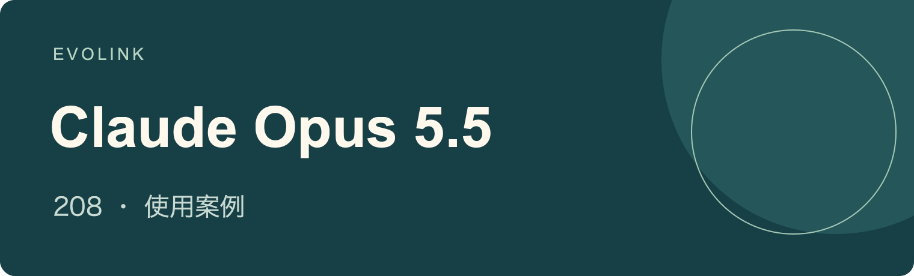

# Claude Opus 5.5 使用案例
有來源依據的工作流程、展示、對比與限制

## 🍌 簡介

**探索大家使用 Claude Opus 5.5 製作與測試的遊戲、3D 場景、編碼工具、研究及創意流程，每則案例皆連結至發布方，並保留原始主張的適用界限**

[在 EvoLink 了解 Claude Opus 5.5](https://evolink.ai/claude-opus-5-5?utm_source=github&utm_medium=readme&utm_campaign=awesome-claude-opus-5-5-usecases&utm_content=introduction_cta)

## 📊 概覽

**精選 208 則 Claude Opus 5.5 案例**，涵蓋創作、開發、研究與評測

- 結合官方指南，探索社群展示、工作流程、對比及有記錄的限制
- 每則案例包含原始來源、發布方、來源發布日期、簡明要點及有來源依據的說明
- 透過目錄檢視任務，再循來源了解已揭露的工具、輸入與結果

> [!NOTE]
> 這些是註明歸屬的來源報告，未經獨立重現；藉助工具製作的影片與圖像，不能證明模型具備原生媒體生成能力；推廣對比保留發布方歸屬，重複帖子不算獨立實驗；下列日期為來源發布日期（UTC），並非匯入日期

## ⚡ 快速開始

1. [開啟模型頁面，確認目前可用性與能力](https://evolink.ai/claude-opus-5-5?utm_source=github&utm_medium=quickstart&utm_campaign=awesome-claude-opus-5-5-usecases&utm_content=model_link)
2. [在 EvoLink 控制台建立 API 金鑰](https://evolink.ai/dashboard/keys?utm_source=github&utm_medium=quickstart&utm_campaign=awesome-claude-opus-5-5-usecases&utm_content=api_key)
3. [依模型頁面連結的專用 API 指南或 agent 使用說明操作](https://evolink.ai/docs/en/api-manual/language-series/claude/claude-messages-api?utm_source=github&utm_medium=docs&utm_campaign=awesome-claude-opus-5-5-usecases&utm_content=first_run)

## 📑 目錄

| [概覽](#overview) | [快速開始](#quick-start) | [相關倉庫](#related-repositories) | [致謝](#acknowledge) |
|---|---|---|---|

| 案例 | 分類 | 展示內容 | 類型 |
|---|---|---|---|
| [案例 1: 官方分享的西瓜故事短片](#case-1) | [官方指南與展示](#category-official) | 可將官方分享的西瓜短片作為敘事參考，但其製作流程仍未公開 | Demo |
| [案例 2: 交付一項完整任務](#case-2) | [官方指南與展示](#category-official) | 委派整項任務前，先定義完成標準與進度確認節點 | Tutorial |
| [案例 3: 武士遊戲對比](#case-3) | [遊戲開發](#category-games) | 比較武士遊戲產物時，應一併考量發布方的平台推廣背景 | Evaluation |
| [案例 4: 一次生成的 Mario Kart 展示](#case-4) | [遊戲開發](#category-games) | 採納平台的品質評價前，先檢查這款據稱一次生成的賽車遊戲及其可玩角色 | Demo |
| [案例 5: 瀏覽器版 Minecraft 仿作](#case-5) | [遊戲開發](#category-games) | 透過瀏覽器中的 Minecraft 展示，查看這次遊戲生成嘗試的產物 | Demo |
| [案例 6: 單一 HTML 檔案中的機械遊戲](#case-6) | [遊戲開發](#category-games) | 可參考此平台展示，以單一 HTML 檔案實作程序化遊戲畫面與聲音 | Demo |
| [案例 7: 運用 Roblox toolbox 的動漫格鬥遊戲](#case-7) | [遊戲開發](#category-games) | 評估據稱一次生成的格鬥遊戲時，應計入 Roblox toolbox 素材的作用 | Demo |
| [案例 8: 蜘蛛人遊戲的三模型對比](#case-8) | [遊戲開發](#category-games) | 依據相同的可見玩法特徵，比較三款蜘蛛人遊戲產物 | Evaluation |
| [案例 9: 具水體物理的 Minecraft 仿作](#case-9) | [遊戲開發](#category-games) | 衡量作者所述的水體物理效果時，也應考量較長的模型執行時間 | Demo |
| [案例 10: DEAD SIGNAL 第一人稱場景](#case-10) | [遊戲開發](#category-games) | 查看同提示詞的第一人稱場景時，應將平台的品質評價分開看待 | Evaluation |
| [案例 11: 以程式碼製作的養蜂遊戲](#case-11) | [遊戲開發](#category-games) | 可參考養蜂展示，了解以程式碼繪製遊戲素材並實作玩法的方式 | Demo |
| [案例 12: 貪食蛇遊戲展示](#case-12) | [遊戲開發](#category-games) | 可將此貪食蛇展示視為生成遊戲邏輯與畫面的小型範例 | Demo |
| [案例 13: 與 Sol 對比的 3D 遊戲產物](#case-13) | [遊戲開發](#category-games) | 比較展示中的 3D 遊戲產物時，不應將平台偏好當作獨立評測 | Evaluation |
| [案例 14: 多人撞球與觀戰系統](#case-14) | [遊戲開發](#category-games) | 採信多人模式與玩家活動的說法前，先查看連結中的撞球遊戲 | Demo |
| [案例 15: 透過 Higgsfield API 製作街機遊戲](#case-15) | [遊戲開發](#category-games) | 查看此平台 API 遊戲展示中的水面反射與街機玩法 | Integration |
| [案例 16: 在瀏覽器中重現 Minecraft](#case-16) | [遊戲開發](#category-games) | 透過瀏覽器中的重現作品，評估這次 Minecraft 仿作嘗試的可見範圍 | Demo |
| [案例 17: 邀請直播觀眾加入割草遊戲](#case-17) | [遊戲開發](#category-games) | 可邀請直播觀眾在個人伺服器上測試多人原型 | Demo |
| [案例 18: 含最終 Boss 的塗鴉射擊遊戲](#case-18) | [遊戲開發](#category-games) | 查看據稱一次生成的射擊遊戲如何結合塗鴉風格與最終 Boss | Demo |
| [案例 19: 以 Medium 設定生成 Mario 遊戲](#case-19) | [遊戲開發](#category-games) | 可將此 Mario 展示作為 Medium 推理強度下遊戲生成的參考 | Demo |
| [案例 20: 卡丁車競速畫面對比](#case-20) | [遊戲開發](#category-games) | 依可見遊戲行為比較卡丁車片段，不據此推論模型能力 | Evaluation |
| [案例 21: 相同提示詞下與 GPT-6 Sol 比較遊戲](#case-21) | [遊戲開發](#category-games) | 開啟同提示詞遊戲的連結，比較實際遊玩體驗 | Evaluation |
| [案例 22: 一次生成的貪食蛇](#case-22) | [遊戲開發](#category-games) | 可將據稱一次生成的貪食蛇作為小範圍生成任務的參考 | Demo |
| [案例 23: Three.js 殭屍遊戲玩法](#case-23) | [遊戲開發](#category-games) | 研究此 Three.js 展示如何在不使用素材檔案的情況下生成玩法、紋理與聲音 | Demo |
| [案例 24: 經兩輪修整的雪地遊戲](#case-24) | [遊戲開發](#category-games) | 製作視聽效果配合的雪地遊戲時，應預留修整輪次與執行時間 | Demo |
| [案例 25: 擴充遊戲功能與剪輯預告片](#case-25) | [遊戲開發](#category-games) | 查看可玩的遊戲與預告片時，應保留作者的合作揭露 | Demo |
| [案例 26: Tesana 多人生存島](#case-26) | [遊戲開發](#category-games) | 採信所稱的遊戲時數前，先檢查 Tesana 島嶼的多人系統 | Demo |
| [案例 27: Unreal Engine 遊戲對比](#case-27) | [遊戲開發](#category-games) | 比較 Unreal Engine 遊戲產物時，應納入 Higgsfield 平台工作流程的背景 | Evaluation |
| [案例 28: Tesana 黑暗奇幻 RPG](#case-28) | [遊戲開發](#category-games) | 查看 Tesana RPG 如何結合區域、任務與配音對話時，應保留合作狀態尚未確認的資訊 | Demo |
| [案例 29: 噪音會引發打鬥的吉他店](#case-29) | [遊戲開發](#category-games) | 擴充含數百個可演奏吉他模型的 Three.js 店鋪模擬器前，先測試效能 | Demo |
| [案例 30: 手繪風西洋棋與走法分析](#case-30) | [遊戲開發](#category-games) | 查看西洋棋展示如何結合手繪外觀與走法分析 | Demo |
| [案例 31: 與 Kimi K3 比較飛行模擬器](#case-31) | [遊戲開發](#category-games) | 選擇兩款飛行模擬器產物時，應同時比較執行表現與所報成本 | Evaluation |
| [案例 32: Tesana 單提示詞奇幻世界](#case-32) | [遊戲開發](#category-games) | 透過 Tesana 奇幻世界展示，查看平台整合玩法、音訊與 UI 的產物 | Demo |
| [案例 33: 不到十分鐘建好的射箭遊戲](#case-33) | [遊戲開發](#category-games) | 將其自述的十分鐘內建置時間推廣至其他任務前，先檢查已部署的射箭遊戲 | Demo |
| [案例 34: Minecraft 與 Warcraft 仿作對比](#case-34) | [遊戲開發](#category-games) | 比較公開的遊戲產物與提示詞時，應保留推理強度、執行時間及估算成本背景 | Evaluation |
| [案例 35: Runescape Bench 分數與成本](#case-35) | [遊戲開發](#category-games) | 應將 Runescape Bench 所報價格與排名限定於該遊戲任務範圍內理解 | Evaluation |
| [案例 36: 互動珊瑚礁桌布](#case-36) | [互動學習與視覺化](#category-education) | 可參考餵魚互動，讓氛圍桌布具備互動性 | Demo |
| [案例 37: 直播中的水體模擬](#case-37) | [互動學習與視覺化](#category-education) | 可將展示的水體模擬視為較長直播中的一項產物 | Demo |
| [案例 38: 依影片重現 3D 水體](#case-38) | [互動學習與視覺化](#category-education) | 採納作者的逼真度評價前，先將重現水體與參考影片比較 | Demo |
| [案例 39: 分層手部解剖探索介面](#case-39) | [互動學習與視覺化](#category-education) | 可查看分層解剖介面，但不應依賴其中未經驗證的疼痛或復原建議 | Demo |
| [案例 40: Kilo Code 摸草模擬器](#case-40) | [互動學習與視覺化](#category-education) | 比較摸草模擬器產物時，應一併考量平台所報的單次執行成本 | Evaluation |
| [案例 41: 投石機草圖轉模擬](#case-41) | [互動學習與視覺化](#category-education) | 可將投石機展示作為草圖轉模擬的參考，同時保留其二手來源性質 | Demo |
| [案例 42: 軌道與擺桿機構](#case-42) | [互動學習與視覺化](#category-education) | 估算機構模擬成本時，應區分 API 執行時間與閒置經過時間 | Demo |
| [案例 43: 不同重力下的臉部變化](#case-43) | [互動學習與視覺化](#category-education) | 查看重力控制的臉部展示時，應保留可能合作的揭露 | Demo |
| [案例 44: 以互連網頁解說 Web](#case-44) | [互動學習與視覺化](#category-education) | 可使用互相連結的 HTML 網頁製作可探索的解說，同時為所報的長時間執行預留預算 | Demo |
| [案例 45: 可探索的 3D 眼球學習頁](#case-45) | [互動學習與視覺化](#category-education) | 可將可探索的眼球展示作為分層 3D 學習介面的參考 | Evaluation |
| [案例 46: 未完成的宇宙尺度互動作品](#case-46) | [互動學習與視覺化](#category-education) | 嘗試從宇宙延伸至普朗克尺度的互動專案前，應設定用量檢查節點 | Limit |
| [案例 47: 十秒 Blender 鏡頭對比](#case-47) | [3D 建模與場景](#category-3d) | 比較 Blender 鏡頭時，應同時考量執行時間、token 用量與 API 等價成本 | Evaluation |
| [案例 48: 以 Jev 驅動的 Unreal Engine 舊金山](#case-48) | [3D 建模與場景](#category-3d) | 評估 Unreal Engine 城市場景中的行為時，應計入 Jev 的作用 | Integration |
| [案例 49: 含 500 種器材的健身房規劃器](#case-49) | [3D 建模與場景](#category-3d) | 可參考此健身房規劃器，結合算繪器材目錄與配置控制 | Demo |
| [案例 50: 四模型火箭發射對比](#case-50) | [3D 建模與場景](#category-3d) | 比較四款火箭發射產物時，應一併考量平台所報時間與成本 | Evaluation |
| [案例 51: 騎腳踏車的鵜鶘](#case-51) | [3D 建模與場景](#category-3d) | 應將騎腳踏車的鵜鶘作品視為視覺產物，而非有記錄的工作流程 | Demo |
| [案例 52: 1906 年地震前的 Market Street](#case-52) | [3D 建模與場景](#category-3d) | 在歷史準確性通過檢查前，應將 Market Street 場景視為 Blender 詮釋作品 | Demo |
| [案例 53: Blender 鵜鶘循環動畫對比 Sol](#case-53) | [3D 建模與場景](#category-3d) | 比較鵜鶘循環動畫時，應將平台對角色魅力的偏好分開看待 | Evaluation |
| [案例 54: Blender 作品展示](#case-54) | [3D 建模與場景](#category-3d) | 帖子未說明主題與流程，應直接查看 Blender 產物 | Demo |
| [案例 55: Blender 風車製作流程](#case-55) | [3D 建模與場景](#category-3d) | 可透過風車展示查看整合 Blender 建模、綁定、貼圖與動畫的流程 | Demo |
| [案例 56: 以程式碼建造金門大橋](#case-56) | [3D 建模與場景](#category-3d) | 採納作者的品質評價前，先比較程式碼橋樑場景與連結中的參考 | Evaluation |
| [案例 57: 火山島、海洋生物與極光](#case-57) | [3D 建模與場景](#category-3d) | 不應根據兩個不同景觀場景，得出確定的模型排名 | Evaluation |
| [案例 58: 在 Blender 重新設計外骨骼關節](#case-58) | [3D 建模與場景](#category-3d) | 機械可靠性獲得驗證前，應將外骨骼重新設計視為建模提案 | Demo |
| [案例 59: Cowork 中的太陽龐克城市](#case-59) | [3D 建模與場景](#category-3d) | 可將此太陽龐克場景視為作者所述的 Cowork 3D 環境建置範例 | Demo |
| [案例 60: Three.js 紐約街區](#case-60) | [3D 建模與場景](#category-3d) | 比較兩款紐約場景產物時，應檢查算繪迴圈與攝影機移動 | Evaluation |
| [案例 61: 另一件騎車鵜鶘作品](#case-61) | [3D 建模與場景](#category-3d) | 可將這件騎車鵜鶘作品視為相同主題的額外視覺參考 | Demo |
| [案例 62: Blender 新幹線模型](#case-62) | [3D 建模與場景](#category-3d) | 採信平台所報物件與座位數前，先檢查新幹線模型 | Demo |
| [案例 63: 圖像轉低多邊形 3D](#case-63) | [3D 建模與場景](#category-3d) | 評估所報圖像轉 3D 產物時，應同時檢視幾何細節與色彩還原度 | Demo |
| [案例 64: 結合 Tripo P2、JEF 與 MCP 的角色流程](#case-64) | [3D 建模與場景](#category-3d) | 評估角色製作流程時，應計入 Tripo P2、JEF 與 Blender MCP 的作用 | Integration |
| [案例 65: 房屋照片與平面圖轉 3D](#case-65) | [3D 建模與場景](#category-3d) | 可結合房屋照片與平面圖，製作具互動瀏覽器檢視器的模型原型 | Demo |
| [案例 66: 瓶中船生成測試](#case-66) | [3D 建模與場景](#category-3d) | 可查看瓶中船產物的場景構圖，但不應推論未記錄的製作流程 | Demo |
| [案例 67: DeLorean、鐘樓與閃電](#case-67) | [3D 建模與場景](#category-3d) | 比較動畫場景行為時，應同時考量各模型使用生成器的情況、執行時間與估計成本 | Evaluation |
| [案例 68: 從草圖到成屋的四階段](#case-68) | [3D 建模與場景](#category-3d) | 可用分階段的 Three.js 與 TSL 畫面，說明建築從草圖到完工的進程 | Demo |
| [案例 69: 3D 產物與自報成本對比](#case-69) | [3D 建模與場景](#category-3d) | 應將展示的 3D 產物與平台所報的成本差異一起衡量 | Evaluation |
| [案例 70: 將畫作轉成可探索場景](#case-70) | [3D 建模與場景](#category-3d) | 可參考畫作擴展，從多個 3D 角度探索平面構圖 | Integration |
| [案例 71: 3D 家具配置模擬器](#case-71) | [3D 建模與場景](#category-3d) | 選定設計前，可使用 3D 配置模擬器比較家具擺設 | Demo |
| [案例 72: 炭筆畫轉 3D](#case-72) | [3D 建模與場景](#category-3d) | 查看炭筆畫轉 Blender 的流程如何將筆觸紋理帶入 3D 場景 | Demo |
| [案例 73: 多人地中海港鎮漫遊](#case-73) | [3D 建模與場景](#category-3d) | 評估港鎮漫遊時，應區分程序化場景與聲音，以及匯入的人物素材 | Demo |
| [案例 74: 3D 控制器展示](#case-74) | [3D 建模與場景](#category-3d) | 查看控制器展示與所要求的影片時，應與其引用的早期 SVG 任務分開 | Demo |
| [案例 75: Minecraft 風格寺廟花園](#case-75) | [3D 建模與場景](#category-3d) | 比較寺廟花園預覽時，不應泛化作者的模型偏好 | Evaluation |
| [案例 76: Blender 章魚建模與動畫](#case-76) | [3D 建模與場景](#category-3d) | 查看章魚模型與動畫時，不應將平台的推廣品質用語當成評級 | Demo |
| [案例 77: 相同提示詞的紐約場景對比](#case-77) | [3D 建模與場景](#category-3d) | 比較相同紐約場景要求時，應保留各模型版本與推理強度設定 | Evaluation |
| [案例 78: 穿越多種景觀的飛行](#case-78) | [3D 建模與場景](#category-3d) | 可透過製作影片了解景觀飛行如何串連不同地景 | Demo |
| [案例 79: 體素風 Claude 動畫](#case-79) | [3D 建模與場景](#category-3d) | 可將體素角色展示作為風格化 Claude 角色動畫的參考 | Demo |
| [案例 80: 體素鵜鶘對比 Fable 與 Astra](#case-80) | [3D 建模與場景](#category-3d) | 比較體素鵜鶘產物時，應將作者的 token 用量說法限定於此次嘗試 | Evaluation |
| [案例 81: 賽車模型對比 GPT-6 Sol](#case-81) | [3D 建模與場景](#category-3d) | 可並列檢查賽車模型，不應推論展示產物之外的表現 | Evaluation |
| [案例 82: GPU 加速貓毛模擬](#case-82) | [3D 建模與場景](#category-3d) | 可將貓毛展示作為 Three.js 中 GPU 加速模擬的參考 | Demo |
| [案例 83: Minecraft 體素建造對比](#case-83) | [3D 建模與場景](#category-3d) | 應將作者的 Minecraft 偏好與仍在規劃中的正式 VoxelBench 測試分開 | Evaluation |
| [案例 84: 三模型太空船測試](#case-84) | [3D 建模與場景](#category-3d) | 比較三款太空船產物時，應考量推理設定不同 | Evaluation |
| [案例 85: Three.js 與 Opus 5 對比](#case-85) | [3D 建模與場景](#category-3d) | 可前往連結中的評測平台，查看不同 Opus 版本在 Three.js 任務的對比 | Evaluation |
| [案例 86: Three.js 末日短片](#case-86) | [3D 建模與場景](#category-3d) | 比較算繪短片前，應計入執行環境、修復機會不相等及成本估計的限制 | Evaluation |
| [案例 87: JavaScript 合成低音音樂](#case-87) | [音樂與聲音](#category-audio) | 可將低音音樂展示作為直接以 JavaScript 合成聲音的參考 | Demo |
| [案例 88: 自述滿分的音樂錯誤檢測](#case-88) | [音樂與聲音](#category-audio) | 應將四部合唱錯誤檢測滿分視為十段片段上的自行報告結果，仍待更廣泛驗證 | Evaluation |
| [案例 89: 音效生成流程](#case-89) | [音樂與聲音](#category-audio) | 帖子未指明生成的聲音，應直接查看音效製作流程 | Demo |
| [案例 90: Pocket Color 掌機圖像對比](#case-90) | [創意圖像與動畫](#category-graphics) | 應依可見外觀細節比較掌機圖像，不推論裝置功能 | Evaluation |
| [案例 91: 18m 31s 製作的 Sweet Tooth 動畫](#case-91) | [創意圖像與動畫](#category-graphics) | 將所報單次生成時間推廣至其他任務前，先檢查 Sweet Tooth 動畫 | Demo |
| [案例 92: Claude 與 AGI 主題卡通](#case-92) | [創意圖像與動畫](#category-graphics) | 可將卡通作為視覺參考，同時保留生成流程未公開的狀態 | Demo |
| [案例 93: 以程式碼製作像素巫師動畫](#case-93) | [創意圖像與動畫](#category-graphics) | 查看程式碼像素動畫，並至回覆中查找作者所述提示詞 | Demo |
| [案例 94: 逐格 JavaScript 動畫](#case-94) | [創意圖像與動畫](#category-graphics) | 可將逐格繪製的動畫作為透過 JavaScript 算繪創造動態的參考 | Demo |
| [案例 95: Nintendo Switch SVG 動畫](#case-95) | [創意圖像與動畫](#category-graphics) | 應將 SVG 動畫需求與所報 Max 推理強度下的工作階段用量一起衡量 | Evaluation |
| [案例 96: 以程式碼描繪解題過程](#case-96) | [創意圖像與動畫](#category-graphics) | 可將純程式碼動畫視為解題的創意描繪，不應當作模型運作過程的說明 | Demo |
| [案例 97: 轉分享的鵜鶘騎車循環動畫](#case-97) | [創意圖像與動畫](#category-graphics) | 查看騎車動作時，應保留此循環動畫的二手來源歸屬 | Demo |
| [案例 98: PS5 控制器 SVG 對比](#case-98) | [創意圖像與動畫](#category-graphics) | 應將控制器細節與陰影的比較，和 BridgeMind 的推廣品質判斷分開 | Evaluation |
| [案例 99: Devin 中的水體與粒子視覺效果](#case-99) | [創意圖像與動畫](#category-graphics) | 比較 Devin 視覺產物時，應保留作者關係、執行時間與成本揭露 | Evaluation |
| [案例 100: 慕尼黑啤酒節動畫](#case-100) | [創意圖像與動畫](#category-graphics) | 採信所報一次完成的時間前，先查看啤酒節動畫與所附指示 | Demo |
| [案例 101: 以 JavaScript 撰寫音樂與視覺效果](#case-101) | [創意圖像與動畫](#category-graphics) | 可將音樂與視覺整合展示作為 JavaScript 範例，但對更廣泛替代能力的支持有限 | Demo |
| [案例 102: 僅以 JavaScript 製作的互動動畫](#case-102) | [創意圖像與動畫](#category-graphics) | 可查看此互動動畫如何在據稱未使用外部素材與擴充工具的情況下運用 JavaScript | Demo |
| [案例 103: 三模型動畫對比](#case-103) | [創意圖像與動畫](#category-graphics) | 比較三款動畫產物時，應考量共同輸入與作者所報執行時間 | Evaluation |
| [案例 104: 334 行 SVG 的 Xbox 控制器](#case-104) | [創意圖像與動畫](#category-graphics) | 檢查精簡控制器 SVG 時，應考量作者所報 Max 推理強度下的大量 token 用量 | Demo |
| [案例 105: 在 TouchDesigner 重現參考效果](#case-105) | [創意圖像與動畫](#category-graphics) | 評估依參考重現的效果時，應計入 TouchDesigner 的作用 | Integration |
| [案例 106: Game Boy 視覺測試](#case-106) | [創意圖像與動畫](#category-graphics) | 採納作者的視覺偏好前，應自行比較 Game Boy 產物 | Evaluation |
| [案例 107: JavaScript 動畫展示](#case-107) | [創意圖像與動畫](#category-graphics) | 完整製作流程未公開，可將此 JavaScript 動畫作為產物參考 | Demo |
| [案例 108: CoAnimator 中的動畫與聲音](#case-108) | [創意圖像與動畫](#category-graphics) | 可查看 CoAnimator 如何在開發者自身應用程式中整合動畫、時間軸與聲音 | Integration |
| [案例 109: HyperFrames 中的 3D 攝影機與文字效果](#case-109) | [創意圖像與動畫](#category-graphics) | 評估所展示的 3D 攝影機與文字效果時，應計入 HyperFrames 的作用 | Integration |
| [案例 110: 五分鐘內的像素動畫](#case-110) | [創意圖像與動畫](#category-graphics) | 查看像素動畫，並至回覆中查找作者承諾提供的提示詞 | Demo |
| [案例 111: 使用 PNG 素材的控制器 SVG](#case-111) | [創意圖像與動畫](#category-graphics) | 將 SVG 產物描述為全向量繪製前，應檢查其中嵌入的圖像素材 | Demo |
| [案例 112: 重現 ChronoVolume 效果](#case-112) | [創意圖像與動畫](#category-graphics) | 可將重現的 ChronoVolume 效果與其參考、平台所報成本及執行時間比較 | Demo |
| [案例 113: 同一提示詞的噴泉](#case-113) | [創意圖像與動畫](#category-graphics) | 可在共同提示詞與最高推理強度設定下比較噴泉產物 | Evaluation |
| [案例 114: 以 SVG 繪製蒙娜麗莎](#case-114) | [創意圖像與動畫](#category-graphics) | 查看兩款蒙娜麗莎 SVG 產物時，應保留引用對比中的推理強度設定 | Evaluation |
| [案例 115: 與 Sol、Luna 比較 SVG](#case-115) | [創意圖像與動畫](#category-graphics) | 應將三模型 SVG 對比限定於可見產物與作者個人判斷 | Evaluation |
| [案例 116: 透過腳本在 Paint 繪製照片](#case-116) | [創意圖像與動畫](#category-graphics) | 若腳本產圖不符合 Paint 任務需求，應明定並驗證僅使用滑鼠互動 | Limit |
| [案例 117: 將 Claude 想像成小太陽](#case-117) | [創意圖像與動畫](#category-graphics) | 應將小太陽作品視為想像式自畫像提示，不應用來證明模型具有感受 | Demo |
| [案例 118: 鵜鶘繪圖測試](#case-118) | [創意圖像與動畫](#category-graphics) | 可將鵜鶘繪圖視為產物樣本，其提示詞與流程未提供 | Demo |
| [案例 119: 像素藝術中的噴泉與蝙蝠眼睛](#case-119) | [創意圖像與動畫](#category-graphics) | 應將像素場景的動畫細節比較與主觀風格偏好分開 | Evaluation |
| [案例 120: 舊金山畫作](#case-120) | [創意圖像與動畫](#category-graphics) | 可查看舊金山作品，但不應歸因於未指明的製作工具鏈 | Demo |
| [案例 121: 鵜鶘騎車對比 Grok 4.7](#case-121) | [創意圖像與動畫](#category-graphics) | 接受作者認為動作更穩定的結論前，應直接比較鵜鶘動畫 | Evaluation |
| [案例 122: 由「subtle art」生成的藝術工具](#case-122) | [創意圖像與動畫](#category-graphics) | 可試用連結中的藝術生成器，同時保留作者的平台關係 | Demo |
| [案例 123: John Wick 風格重製動畫](#case-123) | [創意圖像與動畫](#category-graphics) | 可將 John Wick 主題動畫作為視覺參考，其生成流程未完整記錄 | Demo |
| [案例 124: 四款 SVG 產物與 Max 推理失敗](#case-124) | [創意圖像與動畫](#category-graphics) | 審視不同推理強度的 SVG 產物時，應一併考量所報 Max token 耗盡及失敗成本 | Evaluation |
| [案例 125: MacBook Pro SVG 基準測試](#case-125) | [創意圖像與動畫](#category-graphics) | 應將 MacBook Pro SVG 結果理解為 Playcode 自身針對特定任務的評測與產品決策 | Evaluation |
| [案例 126: 反覆改版個人網站並製作預告片](#case-126) | [網站與介面](#category-web) | 可透過反覆設計與批評，以及版本歷程預告片，記錄個人網站改版 | Demo |
| [案例 127: 依八張參考製作礦物目錄網站](#case-127) | [網站與介面](#category-web) | 若要達到展示的礦物目錄風格，應為多張參考與修改提示預留空間 | Demo |
| [案例 128: 以相同目標重做現有應用程式](#case-128) | [網站與介面](#category-web) | 應依相同既有應用程式與明定目標比較改版成果 | Evaluation |
| [案例 129: 包含火山卡住案例的前端測試](#case-129) | [網站與介面](#category-web) | 評估前端生成結果時，應納入卡住的嘗試與推理 token 用量 | Limit |
| [案例 130: 未使用設計 skill 的連結筆記介面](#case-130) | [網站與介面](#category-web) | 可查看互連筆記介面，但不應假設完整功能已經驗證 | Demo |
| [案例 131: 一次生成 UI 對比 Grok 4.7](#case-131) | [網站與介面](#category-web) | 比較兩款 UI 產物時，應保留相同提示詞在不同日期執行的背景 | Evaluation |
| [案例 132: 23 分鐘製作的紓壓應用程式](#case-132) | [網站與介面](#category-web) | 應將紓壓應用程式視為原型，不應假設已證明療效 | Demo |
| [案例 133: Stratus 天氣主題著陸頁](#case-133) | [網站與介面](#category-web) | 可將天氣主題著陸頁作為設計參考，並保留所報成本與執行時間背景 | Demo |
| [案例 134: 互動反向 CAPTCHA](#case-134) | [網站與介面](#category-web) | 可將反向 CAPTCHA 互動視為模糊問題設計的實驗 | Demo |
| [案例 135: 可匯入 Figma 的個人互動工具](#case-135) | [網站與介面](#category-web) | 可透過匯入設計參考與小幅修補，探索並學習介面互動 | Demo |
| [案例 136: 監控本機模型的 PonteMLX](#case-136) | [網站與介面](#category-web) | 查看監控介面時，應計入其獨立的本機圖像生成模型 | Integration |
| [案例 137: 物流排程儀表板預覽](#case-137) | [網站與介面](#category-web) | 後端與排程行為通過檢查前，應將物流截圖視為介面證據 | Demo |
| [案例 138: WebGL 創意工作室網站對比](#case-138) | [網站與介面](#category-web) | 應依共同的 WebGL、字體與捲動要求比較創意工作室頁面 | Evaluation |
| [案例 139: 等角圖示元件介面](#case-139) | [網站與介面](#category-web) | 可查看等角元件介面，但不應假設截圖足以證明元件功能 | Demo |
| [案例 140: 掌機風格遊戲選擇頁](#case-140) | [網站與介面](#category-web) | 遊戲啟動功能獲得驗證前，應將掌機風格選擇頁視為 UI 展示 | Demo |
| [案例 141: 一次生成的圖像轉向量工具](#case-141) | [網站與介面](#category-web) | 依賴據稱一次生成的向量化工具前，應以不同圖像類型測試轉換準確度 | Demo |
| [案例 142: 共同提示詞下的著陸頁對比](#case-142) | [網站與介面](#category-web) | 應依共同提示詞比較著陸頁作品集，不直接採納作者偏好 | Evaluation |
| [案例 143: 以 AppLlama MCP 重做既有應用程式](#case-143) | [網站與介面](#category-web) | 應將 AppLlama 協助的改版與原有應用程式營收分開 | Integration |
| [案例 144: 圖像轉 HTML 的還原度與效能](#case-144) | [網站與介面](#category-web) | 圖像轉 HTML 任務除了視覺還原度，也應檢查轉場與執行效能 | Evaluation |
| [案例 145: 生成 100 份創意 HTML 檔案](#case-145) | [網站與介面](#category-web) | 採信作者「沒有檔案損壞」的說法前，應抽樣測試公開的 HTML 產物 | Demo |
| [案例 146: Next.js 成功率與平均成本](#case-146) | [網站與介面](#category-web) | 應在 Next.js 特定框架評測範圍內理解所報成功率與平均成本 | Evaluation |
| [案例 147: 十分鐘任務遺漏核心交付物](#case-147) | [商業分析與文件](#category-business) | 應先要求核心交付物，並明確說明預算與停止點 | Limit |
| [案例 148: 從 347 個排名頁面尋找 SEO 缺口](#case-148) | [商業分析與文件](#category-business) | 應區分所報 SEO 研究覆蓋與草稿合規情況，以及尚未衡量的搜尋流量成果 | Evaluation |
| [案例 149: 透過 Trendtrack MCP 分析黑色星期五](#case-149) | [商業分析與文件](#category-business) | 評估黑色星期五分析流程時，應計入 Trendtrack MCP 的資料存取能力 | Integration |
| [案例 150: alphaXiv 連結論文證據的部落格](#case-150) | [商業分析與文件](#category-business) | 依賴自動生成的研究摘要前，應核對與論文相連的證據 | Integration |
| [案例 151: 測試 SafeForge 風險摘要迴圈](#case-151) | [商業分析與文件](#category-business) | 將 SafeForge 的模型偏好推廣至其他情境前，應要求評測方法與指標 | Evaluation |
| [案例 152: 更新基準圖表中的模型資料](#case-152) | [商業分析與文件](#category-business) | 應區分更新基準圖表與重新執行底層評測 | Demo |
| [案例 153: 比較不同版本建立指標](#case-153) | [商業分析與文件](#category-business) | 可比較指標產物，同時保留驗證方法未說明的狀態 | Evaluation |
| [案例 154: 從網站網址開始的銷售開發流程](#case-154) | [商業分析與文件](#category-business) | 應將開發產品聲稱的傳送能力，與未驗證的回覆率及銷售結果分開 | Integration |
| [案例 155: Ramp 會計任務評測](#case-155) | [商業分析與文件](#category-business) | 應將 Ramp 所報成本與速度改善限定於其 Accounting Bench 執行範圍 | Evaluation |
| [案例 156: 以 fable-advisor 組成多模型團隊](#case-156) | [Agent 與開發流程](#category-agents) | 採用協作團隊流程前，應檢查開源外掛中的模型分工 | Integration |
| [案例 157: ntm 中的任務交接與工作者替換](#case-157) | [Agent 與開發流程](#category-agents) | 在協調工具中替換不同模型版本的工作者時，應使用明確交接 | Integration |
| [案例 158: 透過 Apple Watch 指揮 agent](#case-158) | [Agent 與開發流程](#category-agents) | 應將手錶應用程式的 agent 顯示與口述指令功能，和作者的 RSI 推測分開 | Demo |
| [案例 159: 切換推理強度時保留提示快取](#case-159) | [Agent 與開發流程](#category-agents) | 使用保留快取的推理強度切換指引時，應保留其 Claude Code 版本要求 | Tutorial |
| [案例 160: 重新整理 T3 Code 模型快取](#case-160) | [Agent 與開發流程](#category-agents) | 預期模型未出現在清單時，可依 T3 Code 團隊程序重新整理快取 | Tutorial |
| [案例 161: 檢查專案檔案與 agent 工作階段歷史](#case-161) | [Agent 與開發流程](#category-agents) | 將工作階段歷史模式轉成專案改善前，應與目前程式碼交叉核對 | Tutorial |
| [案例 162: ProgramBench 多 agent 速度](#case-162) | [Agent 與開發流程](#category-agents) | 解讀所報多 agent 速度對比時，應保留只覆蓋 200 項中 166 項任務的限制 | Evaluation |
| [案例 163: 100-agent ProgramBench 評測](#case-163) | [Agent 與開發流程](#category-agents) | 應將 100-agent 基準評測與未來協調機制的推測分開 | Evaluation |
| [案例 164: 同一街景影片中的標籤追蹤](#case-164) | [視覺理解與標註](#category-vision) | 可檢查移動標籤，同時保留此平台對比未衡量標註準確度的狀態 | Evaluation |
| [案例 165: Roboflow 物件偵測評測](#case-165) | [視覺理解與標註](#category-vision) | 可使用 Roboflow 排行榜，在其特定任務評測範圍內評估物件偵測 | Evaluation |
| [案例 166: 在 Medeo 比較 Seedance 2.5 流程](#case-166) | [影片剪輯與製作](#category-video) | 比較指揮影片工具的語言模型時，應將影片生成歸屬於 Seedance 2.5 | Evaluation |
| [案例 167: 在 Claude 中使用 Blender 製作黏土動畫](#case-167) | [影片剪輯與製作](#category-video) | 評估 Claude 中的單提示詞黏土動畫流程時，應計入 Blender 的作用 | Integration |
| [案例 168: 在 Tesseract 比較發布影片重製](#case-168) | [影片剪輯與製作](#category-video) | 比較發布影片重製時，應明確保留 Tesseract 的剪輯與算繪作用 | Evaluation |
| [案例 169: DocJev 預告影片](#case-169) | [影片剪輯與製作](#category-video) | 應將產品預告與歸屬於 Jev 的文件處理核心分開 | Demo |
| [案例 170: 以自訂 skill 製作 Claude 模型歷史](#case-170) | [影片剪輯與製作](#category-video) | 評估 JavaScript 模型歷史影片時，應計入作者的自訂 skill | Integration |
| [案例 171: Medeo 中的摺紙老虎影片](#case-171) | [影片剪輯與製作](#category-video) | 應將摺紙影片流程視為語言模型指揮 Seedance 2.5 的對比 | Evaluation |
| [案例 172: 以 Remotion 製作 BridgeMind 帽 T 推廣影片](#case-172) | [影片剪輯與製作](#category-video) | 應將 Remotion 推廣片的節奏與轉場，和發布方主觀模型排名分開檢視 | Integration |
| [案例 173: Higgsfield 廣告製作時間與成本](#case-173) | [影片剪輯與製作](#category-video) | 應將廣告的時間與成本對比視為平台自行報告的製作證據 | Evaluation |
| [案例 174: 依發布帖子用程式碼製作影片](#case-174) | [影片剪輯與製作](#category-video) | 可將發布帖子作為需求說明，以程式碼製作含畫面與聲音的發布影片 | Demo |
| [案例 175: 轉分享的 Claude 視角定格動畫](#case-175) | [影片剪輯與製作](#category-video) | 應將分享的定格動畫視為工具鏈未指明的二手展示 | Demo |
| [案例 176: 將配樂影片從兩秒擴展至 22 秒](#case-176) | [影片剪輯與製作](#category-video) | 可比較連續版本，查看影片長度與程式化配樂如何演變 | Demo |
| [案例 177: 使用 Photoshop 與 Fusion 修復影片瑕疵](#case-177) | [影片剪輯與製作](#category-video) | 可查看 Photoshop 與 Fusion 修復流程，不應假設所稱節省時間已獨立驗證 | Integration |
| [案例 178: 依 Kotlin 網站製作推廣片](#case-178) | [影片剪輯與製作](#category-video) | 評估網站轉 Kotlin 推廣片流程時，應計入 HyperFrames skills 的作用 | Integration |
| [案例 179: 依個人風格剪輯原始素材](#case-179) | [影片剪輯與製作](#category-video) | 要求符合個人風格時，應提供參考影片並直接檢查剪輯結果 | Demo |
| [案例 180: 將 Coinacademy 文章轉為 FLOP Labs 影片](#case-180) | [影片剪輯與製作](#category-video) | 可將既有文章作為簡短介紹影片的來源需求 | Demo |
| [案例 181: 影片產物對比 GPT-6 Sol](#case-181) | [影片剪輯與製作](#category-video) | 可比較展示的影片產物，但不應推論有共同提示詞或製作工具鏈 | Evaluation |
| [案例 182: 以程式碼製作 serai 推廣片](#case-182) | [影片剪輯與製作](#category-video) | 可查看程式化 serai 推廣片，同時保留算繪工具未指明的狀態 | Demo |
| [案例 183: 在 Cowork 製作 Opus 5.5 解說片](#case-183) | [影片剪輯與製作](#category-video) | 應分別核查解說片中的模型與價格說法，不以成功製片當作證明 | Demo |
| [案例 184: 影片展示與規劃中的 fal 結合](#case-184) | [影片剪輯與製作](#category-video) | 應將已展示影片與仍屬未來構想的 fal 整合分開 | Demo |
| [案例 185: 剪輯 UGC 資料夾並加入動態文字](#case-185) | [影片剪輯與製作](#category-video) | 評估 UGC 剪輯流程時，應計入 Tesseract 的文字動畫作用 | Integration |
| [案例 186: 遊戲引擎中的阿拉伯文教學](#case-186) | [影片剪輯與製作](#category-video) | 評估程式化阿拉伯文教學時，應保留對標誌與 ElevenLabs 音訊的依賴 | Tutorial |
| [案例 187: 以程式碼配樂的水墨雨傘故事](#case-187) | [影片剪輯與製作](#category-video) | 可將雨傘故事作為協調程式化圖像與原創配樂的參考 | Demo |
| [案例 188: 修復兩個倉庫中植入的 105 個錯誤](#case-188) | [程式碼維護與測試](#category-coding) | 比較修復數與成本時，應考量重複測試次數記錄不一致 | Evaluation |
| [案例 189: 聲稱生成 CS2 作弊程式](#case-189) | [程式碼維護與測試](#category-coding) | 應將 CS2 程式視為未經驗證的作者說法，不應假設展示足以證明可運作 | Demo |
| [案例 190: 進行中的 circuit_eval 檢查點測試](#case-190) | [程式碼維護與測試](#category-coding) | 應等待 circuit_eval 執行完成，再將檢查點進度解讀為最終結果 | Evaluation |
| [案例 191: 遭安全防護中斷的系統開發任務](#case-191) | [程式碼維護與測試](#category-coding) | 應將所報安全防護中斷限定於作者未完成的任務與工作階段 | Limit |
| [案例 192: 檢查個人網頁應用程式的安全問題](#case-192) | [程式碼維護與測試](#category-coding) | 應區分原始碼安全審查與對應用程式執行安全測試 | Demo |
| [案例 193: 在 12 份修補程式中找問題](#case-193) | [程式碼維護與測試](#category-coding) | 比較修補審查結果時，應一併考量 API 等價成本估計，不宣稱成本必然下降 | Evaluation |
| [案例 194: 遊戲專案除錯](#case-194) | [程式碼維護與測試](#category-coding) | 應將遊戲除錯成功視為早期個人報告，尚無公開重現證據 | Demo |
| [案例 195: Khan Academy 的 PR 審查機器人](#case-195) | [程式碼維護與測試](#category-coding) | 可將 PR 機器人報告作為特定團隊衡量成本、呼叫數、時間與審查品質的參考 | Integration |
| [案例 196: 安全防護觸發切換後的拒絕](#case-196) | [程式碼維護與測試](#category-coding) | 將最終拒絕歸因於 Opus 5.5 前，應先識別切換後的模型 | Limit |
| [案例 197: CyScenarioBench 十項挑戰子集](#case-197) | [程式碼維護與測試](#category-coding) | 應將所報解題率限定於 CyScenarioBench 的十項挑戰子集 | Evaluation |
| [案例 198: 比較選擇權概念解說](#case-198) | [寫作與解說](#category-writing) | 比較解說摘錄時，應保留作者提前測試的揭露 | Evaluation |
| [案例 199: 森林與河流背景的故事摘錄](#case-199) | [寫作與解說](#category-writing) | 可評估故事摘錄的文筆，但不應重建缺失的寫作需求 | Demo |
| [案例 200: 解說倉庫排程器](#case-200) | [寫作與解說](#category-writing) | 縮短技術排程器解說時，應同時核對正確性與讀者回饋 | Demo |
| [案例 201: 精簡舊模型撰寫的文字](#case-201) | [寫作與解說](#category-writing) | 可將前後標題作為精簡文字的具體參考 | Demo |
| [案例 202: 十個 agent 探索最短路徑演算法](#case-202) | [科學研究與電路](#category-science) | 依賴所報最短路徑改善前，應尋求獨立證明檢查與重現 | Evaluation |
| [案例 203: tscircuit 藍牙喇叭電路](#case-203) | [科學研究與電路](#category-science) | 硬體製作並測試前，應將 tscircuit 喇叭設計視為電路圖展示 | Evaluation |
| [案例 204: 電路圖任務計時](#case-204) | [科學研究與電路](#category-science) | 比較電路圖產物與所報執行時間時，應將更廣泛的速度排名保留為暫定判斷 | Evaluation |
| [案例 205: ARC-AGI 分數與每題成本](#case-205) | [科學研究與電路](#category-science) | 應依評測方所報測試條件解讀 ARC 分數與每題成本 | Evaluation |
| [案例 206: 撰寫 Interaction Calculus 規則](#case-206) | [科學研究與電路](#category-science) | 應將所報演算規則重現與未來 Bend 重寫提案分開 | Demo |
| [案例 207: 在 Paintbrush 以滑鼠繪製蒙娜麗莎](#case-207) | [電腦操作](#category-computer-use) | 比較滑鼠繪圖結果時，應保留共同限制與平台所報時間、成本估計 | Evaluation |
| [案例 208: 比較模型在 Paint 的繪圖方式](#case-208) | [電腦操作](#category-computer-use) | 應驗證要求的繪圖互動，並區分附帶對比影片與 Opus 產物 | Limit |

## 📘 官方指南與展示

### 案例 1: [官方分享的西瓜故事短片](https://x.com/claudeai/status/2102471866635919731) (作者 [@claudeai](https://x.com/claudeai))

**可將官方分享的西瓜短片作為敘事參考，但其製作流程仍未公開**

Claude 官方帳號將 Kevin Ngo 的西瓜故事短片列為早期 Opus 5.5 探索作品，這是官方轉述的展示，並非獨立重建其製作過程

<table>
<tr>
<td> <a href="https://video.twimg.com/amplify_video/2102467313874178048/vid/avc1/1080x1080/jvnZ3SyyxxajVatp.mp4?tag=29">播放來源影片 1</a></td>
</tr>
</table>

Type: Demo | Date: 2026-09-22

---

### 案例 2: [交付一項完整任務](https://x.com/ClaudeDevs/status/2102491840612380934) (作者 [@ClaudeDevs](https://x.com/ClaudeDevs))

**委派整項任務前，先定義完成標準與進度確認節點**

官方指南建議在交付完整任務前定義完成標準和確認節點，省略多餘的思考指示，並在長時間執行後確認還需要什麼，文中附有完整操作指南

Type: Tutorial | Date: 2026-09-22

---

## 🧩 遊戲開發

### 案例 3: [武士遊戲對比](https://x.com/higgsfield_ai/status/2102471046356177001) (作者 [@higgsfield_ai](https://x.com/higgsfield_ai))

**比較武士遊戲產物時，應一併考量發布方的平台推廣背景**

Higgsfield 比較以 Opus 5.5 與 GPT-6 Astra 製作的武士遊戲展示，這是其自身平台推廣的一部分

<table>
<tr>
<td> <a href="https://video.twimg.com/amplify_video/2102470161328685056/vid/avc1/1122x1080/mkbbA1dMknaGX6nL.mp4?tag=29">播放來源影片 1</a></td>
</tr>
</table>

補充來源／合併報告: [@RoundtableSpace](https://x.com/RoundtableSpace/status/2102537174742655341), [@EngMoElgaraihy](https://x.com/EngMoElgaraihy/status/2102488568564490521)

Type: Evaluation | Date: 2026-09-22

---

### 案例 4: [一次生成的 Mario Kart 展示](https://x.com/bridgemindai/status/2102451997395866021) (作者 [@bridgemindai](https://x.com/bridgemindai))

**採納平台的品質評價前，先檢查這款據稱一次生成的賽車遊戲及其可玩角色**

BridgeMind 的推廣展示呈現一次生成的 Mario Kart 遊戲，可操作 Mario 與 Luigi，優於 Fable 5.1 的說法是平台自身的評價

<table>
<tr>
<td> <a href="https://video.twimg.com/amplify_video/2102451221483180032/vid/avc1/2098x1080/vHjQ8jI6WsTR-TPn.mp4?tag=29">播放來源影片 1</a></td>
</tr>
</table>

Type: Demo | Date: 2026-09-22

---

### 案例 5: [瀏覽器版 Minecraft 仿作](https://x.com/noahwachnik/status/2102470200415166699) (作者 [@noahwachnik](https://x.com/noahwachnik))

**透過瀏覽器中的 Minecraft 展示，查看這次遊戲生成嘗試的產物**

作者展示一款在瀏覽器中測試的 Minecraft 仿作，呈現這次遊戲生成嘗試的結果

<table>
<tr>
<td> <a href="https://video.twimg.com/amplify_video/2102469320001404928/vid/avc1/1920x1080/BwKBu8kazrg4aJph.mp4?tag=29">播放來源影片 1</a></td>
</tr>
</table>

Type: Demo | Date: 2026-09-22

---

### 案例 6: [單一 HTML 檔案中的機械遊戲](https://x.com/edwinarbus/status/2102463453176979794) (作者 [@edwinarbus](https://x.com/edwinarbus))

**可參考此平台展示，以單一 HTML 檔案實作程序化遊戲畫面與聲音**

此平台推廣展示以安提基特拉機械為靈感的遊戲，由約 3 MB 的單一 HTML 檔案即時生成視聽內容

<table>
<tr>
<td> <a href="https://video.twimg.com/amplify_video/2102461665086418944/vid/avc1/1350x1080/86T-JaewbcqfYnRH.mp4?tag=29">播放來源影片 1</a></td>
</tr>
</table>

Type: Demo | Date: 2026-09-22

---

### 案例 7: [運用 Roblox toolbox 的動漫格鬥遊戲](https://x.com/WoahWurdz/status/2102487879809126834) (作者 [@WoahWurdz](https://x.com/WoahWurdz))

**評估據稱一次生成的格鬥遊戲時，應計入 Roblox toolbox 素材的作用**

作者表示僅使用 Roblox toolbox，一次生成動漫角色格鬥遊戲，並認為優於 Fable，遊戲依賴該工具提供的資源

<table>
<tr>
<td> <a href="https://video.twimg.com/amplify_video/2102487713282686976/vid/avc1/1462x1128/3fIlU8ItZxe_bOOQ.mp4?tag=29">播放來源影片 1</a></td>
</tr>
</table>

Type: Demo | Date: 2026-09-22

---

### 案例 8: [蜘蛛人遊戲的三模型對比](https://x.com/k2sbhai/status/2102487953302061481) (作者 [@k2sbhai](https://x.com/k2sbhai))

**依據相同的可見玩法特徵，比較三款蜘蛛人遊戲產物**

作者以蜘蛛人遊戲任務比較 Opus 5.5、Fable 5.1 與 GPT-6 Astra

<table>
<tr>
<td> <a href="https://video.twimg.com/amplify_video/2102487804651720704/vid/avc1/1080x1920/R6XVPJWDvtaZ_lkN.mp4?tag=29">播放來源影片 1</a></td>
</tr>
</table>

Type: Evaluation | Date: 2026-09-22

---

### 案例 9: [具水體物理的 Minecraft 仿作](https://x.com/notjazii/status/2102480420923420790) (作者 [@notjazii](https://x.com/notjazii))

**衡量作者所述的水體物理效果時，也應考量較長的模型執行時間**

作者分享可遊玩的 Minecraft 仿作，包含水體物理與遊戲機制，認為結果優於 Astra，但同時表示模型執行甚至比 Astra 更慢

<table>
<tr>
<td> <a href="https://video.twimg.com/amplify_video/2102479783800279040/vid/avc1/1920x1080/7VsGtlHe2S5BRExC.mp4?tag=29">播放來源影片 1</a></td>
</tr>
</table>

Type: Demo | Date: 2026-09-22

---

### 案例 10: [DEAD SIGNAL 第一人稱場景](https://x.com/bridgebench/status/2102469365903872306) (作者 [@bridgebench](https://x.com/bridgebench))

**查看同提示詞的第一人稱場景時，應將平台的品質評價分開看待**

BridgeBench 在平台推廣中以相同提示詞與任務比較 Opus 5.5 和 GPT-6 Sol，媒體預覽呈現 DEAD SIGNAL 第一人稱遊戲場景，品質判斷來自平台自身

<table>
<tr>
<td> <a href="https://video.twimg.com/amplify_video/2102468957806501888/vid/avc1/1920x1080/CiEVMPgTSp380Wzs.mp4?tag=29">播放來源影片 1</a></td>
</tr>
</table>

Type: Evaluation | Date: 2026-09-22

---

### 案例 11: [以程式碼製作的養蜂遊戲](https://x.com/oguzthedev/status/2102476490344730950) (作者 [@oguzthedev](https://x.com/oguzthedev))

**可參考養蜂展示，了解以程式碼繪製遊戲素材並實作玩法的方式**

作者表示以一條提示製作養蜂遊戲，未使用圖像素材檔案，蜂箱、花朵、蜜蜂與養蜂人皆以程式碼繪製，玩法包含種花、蜜蜂飛行與採蜜

<table>
<tr>
<td> <a href="https://video.twimg.com/amplify_video/2102475876294160385/vid/avc1/1880x1080/FNaYj1IdK9WsC2fz.mp4?tag=29">播放來源影片 1</a></td>
</tr>
</table>

Type: Demo | Date: 2026-09-22

---

### 案例 12: [貪食蛇遊戲展示](https://x.com/hakmgpt/status/2102453021590401220) (作者 [@hakmgpt](https://x.com/hakmgpt))

**可將此貪食蛇展示視為生成遊戲邏輯與畫面的小型範例**

作者展示以 Opus 5.5 製作的貪食蛇遊戲，作為具體的遊戲創作案例

<table>
<tr>
<td> <a href="https://video.twimg.com/amplify_video/2102452906083377152/vid/avc1/1080x1098/S7n7jTgko7JLgc7r.mp4?tag=29">播放來源影片 1</a></td>
</tr>
</table>

Type: Demo | Date: 2026-09-22

---

### 案例 13: [與 Sol 對比的 3D 遊戲產物](https://x.com/higgsfield_ai/status/2102496940047094124) (作者 [@higgsfield_ai](https://x.com/higgsfield_ai))

**比較展示中的 3D 遊戲產物時，不應將平台偏好當作獨立評測**

Higgsfield 在自身平台推廣中展示 Opus 5.5 與 GPT-6 Sol 的 3D 遊戲開發對比

<table>
<tr>
<td> <a href="https://video.twimg.com/amplify_video/2102496880412565504/vid/avc1/1080x1080/ILPIm5Y_fCgPCVC4.mp4?tag=29">播放來源影片 1</a></td>
</tr>
</table>

Type: Evaluation | Date: 2026-09-22

---

### 案例 14: [多人撞球與觀戰系統](https://x.com/BuiltByBilal/status/2102527003845075348) (作者 [@BuiltByBilal](https://x.com/BuiltByBilal))

**採信多人模式與玩家活動的說法前，先查看連結中的撞球遊戲**

作者表示一次生成多人撞球遊戲，支援 8-ball、9-ball、司諾克、2v2、語音聊天、賽事、評分、重播、觀戰及行動裝置與瀏覽器，帖子附有連結，已有玩家活動的說法來自作者自述

<table>
<tr>
<td> <a href="https://x.com/BuiltByBilal/status/2102527003845075348">來源附件 1</a></td>
</tr>
</table>

Type: Demo | Date: 2026-09-22

---

### 案例 15: [透過 Higgsfield API 製作街機遊戲](https://x.com/higgsfield_ai/status/2102451096799330740) (作者 [@higgsfield_ai](https://x.com/higgsfield_ai))

**查看此平台 API 遊戲展示中的水面反射與街機玩法**

Higgsfield 的推廣展示呈現透過其 API 製作的遊戲，特色包括水面反射與街機玩法

<table>
<tr>
<td> <a href="https://video.twimg.com/amplify_video/2102450921905283072/vid/avc1/1920x1080/_-dvpneN6xcP95tv.mp4?tag=29">播放來源影片 1</a></td>
</tr>
</table>

Type: Integration | Date: 2026-09-22

---

### 案例 16: [在瀏覽器中重現 Minecraft](https://x.com/buildwithsid/status/2102461886247948571) (作者 [@buildwithsid](https://x.com/buildwithsid))

**透過瀏覽器中的重現作品，評估這次 Minecraft 仿作嘗試的可見範圍**

作者展示瀏覽器版 Minecraft 仿作，作為遊戲重現嘗試

<table>
<tr>
<td> <a href="https://video.twimg.com/amplify_video/2102459530349285376/vid/avc1/1804x1080/ws15ni5PzUk8TyOH.mp4?tag=29">播放來源影片 1</a></td>
</tr>
</table>

Type: Demo | Date: 2026-09-22

---

### 案例 17: [邀請直播觀眾加入割草遊戲](https://x.com/_MaxBlade/status/2102513817855094922) (作者 [@_MaxBlade](https://x.com/_MaxBlade))

**可邀請直播觀眾在個人伺服器上測試多人原型**

作者展示包含啤酒與雪茄元素的多人割草模擬器，並部署至個人伺服器供直播觀眾加入

<table>
<tr>
<td> <a href="https://video.twimg.com/amplify_video/2102513139124244480/vid/avc1/2560x1440/Unl1aBGvaAUEW4EJ.mp4?tag=29">播放來源影片 1</a></td>
</tr>
</table>

Type: Demo | Date: 2026-09-22

---

### 案例 18: [含最終 Boss 的塗鴉射擊遊戲](https://x.com/cherry_mx_reds/status/2102449525944099320) (作者 [@cherry_mx_reds](https://x.com/cherry_mx_reds))

**查看據稱一次生成的射擊遊戲如何結合塗鴉風格與最終 Boss**

作者表示一次生成塗鴉風射擊遊戲，作品亦包含最終 Boss

<table>
<tr>
<td> <a href="https://video.twimg.com/amplify_video/2102448437837090816/vid/avc1/1594x1080/G91X4KGDDEhMKyo_.mp4?tag=29">播放來源影片 1</a></td>
</tr>
</table>

Type: Demo | Date: 2026-09-22

---

### 案例 19: [以 Medium 設定生成 Mario 遊戲](https://x.com/benchmark_lb900/status/2102451991263990244) (作者 [@benchmark_lb900](https://x.com/benchmark_lb900))

**可將此 Mario 展示作為 Medium 推理強度下遊戲生成的參考**

作者展示使用 Medium 設定生成的 Mario 遊戲

<table>
<tr>
<td> <a href="https://video.twimg.com/amplify_video/2102451787743797248/vid/avc1/1282x1220/s0orpWFvxMJ57pcP.mp4?tag=29">播放來源影片 1</a></td>
</tr>
</table>

Type: Demo | Date: 2026-09-22

---

### 案例 20: [卡丁車競速畫面對比](https://x.com/k2sbhai/status/2102468855562178791) (作者 [@k2sbhai](https://x.com/k2sbhai))

**依可見遊戲行為比較卡丁車片段，不據此推論模型能力**

帖子比較 Opus 5.5 與 GPT-6 Sol，媒體預覽中可見卡丁車競速遊戲畫面

<table>
<tr>
<td> <a href="https://video.twimg.com/amplify_video/2102468763182575616/vid/avc1/720x1188/KiitEAn5eNR9s9wu.mp4?tag=29">播放來源影片 1</a></td>
</tr>
</table>

Type: Evaluation | Date: 2026-09-22

---

### 案例 21: [相同提示詞下與 GPT-6 Sol 比較遊戲](https://x.com/_MaxBlade/status/2102528632598274244) (作者 [@_MaxBlade](https://x.com/_MaxBlade))

**開啟同提示詞遊戲的連結，比較實際遊玩體驗**

作者以相同提示詞生成遊戲，比較 Opus 5.5 與 GPT-6 Sol，並表示遊戲連結附於帖子下方

<table>
<tr>
<td> <a href="https://video.twimg.com/amplify_video/2102527771725504513/vid/avc1/1920x1080/RigEMEuahUcyTy2v.mp4?tag=29">播放來源影片 1</a></td>
</tr>
</table>

Type: Evaluation | Date: 2026-09-22

---

### 案例 22: [一次生成的貪食蛇](https://x.com/xikhar/status/2102453761390383383) (作者 [@xikhar](https://x.com/xikhar))

**可將據稱一次生成的貪食蛇作為小範圍生成任務的參考**

作者展示貪食蛇遊戲，並將其描述為一次生成的產物

<table>
<tr>
<td> <a href="https://video.twimg.com/amplify_video/2102452659550822400/vid/avc1/1920x1080/UfYLBlAiXrFx66sd.mp4?tag=29">播放來源影片 1</a></td>
</tr>
</table>

Type: Demo | Date: 2026-09-22

---

### 案例 23: [Three.js 殭屍遊戲玩法](https://x.com/intheworldofai/status/2102480675597115689) (作者 [@intheworldofai](https://x.com/intheworldofai))

**研究此 Three.js 展示如何在不使用素材檔案的情況下生成玩法、紋理與聲音**

作者展示約 13,000 行 Three.js 製作的 Call of Duty Zombies 風格玩法，包含拆除窗戶木板、Mystery Box、Pack-a-Punch、Jugg、Ray Gun 與 BO1 回合機制，作者表示未使用素材檔案，紋理、呻吟聲與短音樂均以程式碼生成

<table>
<tr>
<td> <a href="https://video.twimg.com/amplify_video/2102480184016277504/vid/avc1/1920x1080/ScvFpMg0vzzzA4OU.mp4?tag=29">播放來源影片 1</a></td>
</tr>
</table>

Type: Demo | Date: 2026-09-22

---

### 案例 24: [經兩輪修整的雪地遊戲](https://x.com/jumperz/status/2102486361068425247) (作者 [@jumperz](https://x.com/jumperz))

**製作視聽效果配合的雪地遊戲時，應預留修整輪次與執行時間**

作者表示以一次初始提示與約兩輪修整製作雪地遊戲，模型工作超過一小時，展示包含飛雪、樹木、軌跡、光照、陰影與音效

<table>
<tr>
<td> <a href="https://video.twimg.com/amplify_video/2102485332616732672/vid/avc1/1920x1080/QPii18NhEh8uwx6v.mp4?tag=29">播放來源影片 1</a></td>
</tr>
</table>

Type: Demo | Date: 2026-09-22

---

### 案例 25: [擴充遊戲功能與剪輯預告片](https://x.com/ForwardEditor/status/2102501821931507772) (作者 [@ForwardEditor](https://x.com/ForwardEditor))

**查看可玩的遊戲與預告片時，應保留作者的合作揭露**

此帖已揭露合作關係，提前取得模型使用權的作者表示增添了遊戲功能並剪輯預告片，另附可遊玩的連結

<table>
<tr>
<td> <a href="https://video.twimg.com/amplify_video/2102500851658924032/vid/avc1/1280x720/Gs6hGCiAUu3e5ge9.mp4?tag=29">播放來源影片 1</a></td>
</tr>
</table>

Type: Demo | Date: 2026-09-22

---

### 案例 26: [Tesana 多人生存島](https://x.com/Thomas_jorgen/status/2102459329626652814) (作者 [@Thomas_jorgen](https://x.com/Thomas_jorgen))

**採信所稱的遊戲時數前，先檢查 Tesana 島嶼的多人系統**

作者表示以少量提示在 Tesana 製作 ARK 風格多人生存島，包含任務、馴服恐龍、製作與戰鬥，再與兩位朋友遊玩，30+ 小時遊戲內容的說法來自作者自述，報告標記可能存在合作關係，但尚未確認

<table>
<tr>
<td> <a href="https://video.twimg.com/amplify_video/2102458314160508928/vid/avc1/1920x1080/skP96ftk2mI0b20S.mp4?tag=29">播放來源影片 1</a></td>
</tr>
</table>

Type: Demo | Date: 2026-09-22

---

### 案例 27: [Unreal Engine 遊戲對比](https://x.com/higgsfield_ai/status/2102533401110802552) (作者 [@higgsfield_ai](https://x.com/higgsfield_ai))

**比較 Unreal Engine 遊戲產物時，應納入 Higgsfield 平台工作流程的背景**

Higgsfield 在自身平台推廣中比較 Opus 5.5 與 GPT-6 Sol 於 Unreal Engine 製作 3D 遊戲的結果

<table>
<tr>
<td> <a href="https://video.twimg.com/amplify_video/2102533127096934400/vid/avc1/1080x1080/E40DuI3LXeGg8JA0.mp4?tag=29">播放來源影片 1</a></td>
</tr>
</table>

Type: Evaluation | Date: 2026-09-22

---

### 案例 28: [Tesana 黑暗奇幻 RPG](https://x.com/Rubzem/status/2102457691956482160) (作者 [@Rubzem](https://x.com/Rubzem))

**查看 Tesana RPG 如何結合區域、任務與配音對話時，應保留合作狀態尚未確認的資訊**

作者表示以少量提示在 Tesana 製作黑暗奇幻 RPG，包含多個區域、任務與配音對話，報告標記可能存在合作關係，但尚未確認

<table>
<tr>
<td> <a href="https://video.twimg.com/amplify_video/2102457033413038080/vid/avc1/1916x1080/J47BET3d55HKTEdm.mp4?tag=29">播放來源影片 1</a></td>
</tr>
</table>

Type: Demo | Date: 2026-09-22

---

### 案例 29: [噪音會引發打鬥的吉他店](https://x.com/bijanbowen/status/2102532400353829356) (作者 [@bijanbowen](https://x.com/bijanbowen))

**擴充含數百個可演奏吉他模型的 Three.js 店鋪模擬器前，先測試效能**

作者展示含 300+ 個可演奏吉他模型的店鋪模擬器，噪音會引發打鬥，作者表示 Three.js 執行不順，改以 Blender/Godot 重製仍是計畫，尚未完成

<table>
<tr>
<td> <a href="https://video.twimg.com/amplify_video/2102531852363853824/vid/avc1/1920x1080/b-13Hr4nmh5HcvFi.mp4?tag=29">播放來源影片 1</a></td>
</tr>
</table>

Type: Demo | Date: 2026-09-22

---

### 案例 30: [手繪風西洋棋與走法分析](https://x.com/higgsfield_ai/status/2102534514228822197) (作者 [@higgsfield_ai](https://x.com/higgsfield_ai))

**查看西洋棋展示如何結合手繪外觀與走法分析**

Higgsfield 的平台推廣展示具走法分析功能的手繪風西洋棋遊戲

<table>
<tr>
<td> <a href="https://video.twimg.com/amplify_video/2102534281038049280/vid/avc1/1440x1080/pSUEup1s_OPfPNsJ.mp4?tag=29">播放來源影片 1</a></td>
</tr>
</table>

Type: Demo | Date: 2026-09-22

---

### 案例 31: [與 Kimi K3 比較飛行模擬器](https://x.com/adxtyahq/status/2102455768977170856) (作者 [@adxtyahq](https://x.com/adxtyahq))

**選擇兩款飛行模擬器產物時，應同時比較執行表現與所報成本**

作者以相同提示詞比較 Opus 5.5 與 Kimi K3 飛行模擬器，展示 UI、多個攝影機視角與語音，作者表示兩者都很流暢，而 Kimi K3 更具成本效益

<table>
<tr>
<td> <a href="https://video.twimg.com/amplify_video/2102455572750848000/vid/avc1/1816x1140/WWAmC5uDhH_y2oPd.mp4?tag=29">播放來源影片 1</a></td>
</tr>
</table>

Type: Evaluation | Date: 2026-09-22

---

### 案例 32: [Tesana 單提示詞奇幻世界](https://x.com/TesanaAI/status/2102494989683188029) (作者 [@TesanaAI](https://x.com/TesanaAI))

**透過 Tesana 奇幻世界展示，查看平台整合玩法、音訊與 UI 的產物**

Tesana 自身的推廣展示呈現由一條提示生成的奇幻世界，包含玩法、系統、音訊與 UI

<table>
<tr>
<td> <a href="https://video.twimg.com/amplify_video/2102494178517393408/vid/avc1/1908x1080/Gl7GChOzmYEfvQL1.mp4?tag=29">播放來源影片 1</a></td>
</tr>
</table>

Type: Demo | Date: 2026-09-22

---

### 案例 33: [不到十分鐘建好的射箭遊戲](https://x.com/BhavikY663/status/2102488215445983290) (作者 [@BhavikY663](https://x.com/BhavikY663))

**將其自述的十分鐘內建置時間推廣至其他任務前，先檢查已部署的射箭遊戲**

作者展示射箭遊戲，並表示在不到十分鐘內完成建置與部署

<table>
<tr>
<td> <a href="https://video.twimg.com/amplify_video/2102487312605282304/vid/avc1/1894x908/nC1fTviIGjTjFt0O.mp4?tag=29">播放來源影片 1</a></td>
<td> <a href="https://x.com/BhavikY663/status/2102488215445983290">來源附件 2</a></td>
</tr>
<tr>
<td> <a href="https://x.com/BhavikY663/status/2102488215445983290">來源附件 3</a></td>
</tr>
</table>

Type: Demo | Date: 2026-09-22

---

### 案例 34: [Minecraft 與 Warcraft 仿作對比](https://news.ycombinator.com/item?id=49807724) (作者 [@senko](https://news.ycombinator.com/user?id=senko))

**比較公開的遊戲產物與提示詞時，應保留推理強度、執行時間及估算成本背景**

作者分享 Opus 5.5、Fable 5.1 與 Astra 在兩款遊戲上的可玩產物與提示詞，Opus 在 Claude Code 的 xhigh 設定下花費約 45 分鐘，$11–14 是訂閱用量換算的 API 等價估計

Type: Evaluation | Date: 2026-09-22

---

### 案例 35: [Runescape Bench 分數與成本](https://x.com/maxbittker/status/2102451744030490912) (作者 [@maxbittker](https://x.com/maxbittker))

**應將 Runescape Bench 所報價格與排名限定於該遊戲任務範圍內理解**

作者表示 Opus 5.5 在 Runescape Bench 排名第二，僅次於 Astra，價格約為其三分之一，這是遊戲任務基準結果，不能衡量所有遊玩或開發情境

<table>
<tr>
<td> <a href="https://x.com/maxbittker/status/2102451744030490912">來源附件 1</a></td>
</tr>
</table>

Type: Evaluation | Date: 2026-09-22

---

## 🧩 互動學習與視覺化

### 案例 36: [互動珊瑚礁桌布](https://x.com/chaseleantj/status/2102480866404360215) (作者 [@chaseleantj](https://x.com/chaseleantj))

**可參考餵魚互動，讓氛圍桌布具備互動性**

作者展示珊瑚礁桌布，使用者可透過互動餵魚

<table>
<tr>
<td> <a href="https://video.twimg.com/amplify_video/2102479905212473344/vid/avc1/1920x1080/wayY24Um6q4mzTVd.mp4?tag=29">播放來源影片 1</a></td>
</tr>
</table>

Type: Demo | Date: 2026-09-22

---

### 案例 37: [直播中的水體模擬](https://x.com/Avenoxai/status/2102500841097756743) (作者 [@Avenoxai](https://x.com/Avenoxai))

**可將展示的水體模擬視為較長直播中的一項產物**

作者在直播中製作水體模擬，此帖展示三項成果中的一項

<table>
<tr>
<td> <a href="https://video.twimg.com/amplify_video/2102500422355185664/vid/avc1/1920x1080/BOGmZuGWcsfynubs.mp4?tag=29">播放來源影片 1</a></td>
</tr>
</table>

Type: Demo | Date: 2026-09-22

---

### 案例 38: [依影片重現 3D 水體](https://x.com/Aurelien_Gz/status/2102479887495758076) (作者 [@Aurelien_Gz](https://x.com/Aurelien_Gz))

**採納作者的逼真度評價前，先將重現水體與參考影片比較**

作者展示根據參考影片一次生成的 3D 水體，認為接近原作，引用的參考是 Grok 4.7 水體展示

<table>
<tr>
<td> <a href="https://video.twimg.com/amplify_video/2102479821364142080/vid/avc1/1080x1724/aFlEwHrgDcqZeJzL.mp4?tag=29">播放來源影片 1</a></td>
</tr>
</table>

Type: Demo | Date: 2026-09-22

---

### 案例 39: [分層手部解剖探索介面](https://x.com/higgsfield_ai/status/2102517718754943254) (作者 [@higgsfield_ai](https://x.com/higgsfield_ai))

**可查看分層解剖介面，但不應依賴其中未經驗證的疼痛或復原建議**

Higgsfield 的平台展示呈現包含骨骼、肌肉與肌腱的分層手部解剖，可透過網路攝影機或點擊定位疼痛，所建議的成因與復原方式尚未驗證

<table>
<tr>
<td> <a href="https://video.twimg.com/amplify_video/2102516830602694656/vid/avc1/1920x1440/YWdHkhGrtKK9F20r.mp4?tag=29">播放來源影片 1</a></td>
</tr>
</table>

Type: Demo | Date: 2026-09-22

---

### 案例 40: [Kilo Code 摸草模擬器](https://x.com/coldopn/status/2102474335172640989) (作者 [@coldopn](https://x.com/coldopn))

**比較摸草模擬器產物時，應一併考量平台所報的單次執行成本**

此平台推廣對比在 Kilo Code 製作摸草模擬器，報告 Grok 4.7 花費 $3.52、Opus 5.5 花費 $7.35，這些是該次執行的自行報告成本

<table>
<tr>
<td> <a href="https://video.twimg.com/amplify_video/2102474210299834368/vid/avc1/1920x1080/dVDcRcsC2R5sj_3g.mp4?tag=29">播放來源影片 1</a></td>
</tr>
</table>

Type: Evaluation | Date: 2026-09-22

---

### 案例 41: [投石機草圖轉模擬](https://x.com/brainextends/status/2102464008112755026) (作者 [@brainextends](https://x.com/brainextends))

**可將投石機展示作為草圖轉模擬的參考，同時保留其二手來源性質**

此二手帖子分享將投石機草圖轉為 3D 模擬的作品，包含物理、控制與音效，並聲稱僅需一條提示

<table>
<tr>
<td> <a href="https://video.twimg.com/amplify_video/2102461645201268736/vid/avc1/1920x1080/IJV3a2Tr4NH_pPlV.mp4?tag=29">播放來源影片 1</a></td>
</tr>
</table>

Type: Demo | Date: 2026-09-22

---

### 案例 42: [軌道與擺桿機構](https://x.com/KinasRemek/status/2102509044581691862) (作者 [@KinasRemek](https://x.com/KinasRemek))

**估算機構模擬成本時，應區分 API 執行時間與閒置經過時間**

預覽呈現軌道、擺桿及其他機構，作者帳單記錄 API 執行時間為 52m 6s、費用 $19.86，總經過時間 4h 21m 包含約三小時閒置，並非模型持續工作

<table>
<tr>
<td> <a href="https://video.twimg.com/amplify_video/2102508620118212609/vid/avc1/1920x1080/ptCi9V6eXBAAb2B3.mp4?tag=29">播放來源影片 1</a></td>
</tr>
</table>

Type: Demo | Date: 2026-09-22

---

### 案例 43: [不同重力下的臉部變化](https://x.com/adilinthewild/status/2102483257267003523) (作者 [@adilinthewild](https://x.com/adilinthewild))

**查看重力控制的臉部展示時，應保留可能合作的揭露**

作者展示 Higgsfield 中不同重力設定下的臉部變化，報告標記可能存在合作關係，但尚未確認

<table>
<tr>
<td> <a href="https://video.twimg.com/amplify_video/2102483220801658880/vid/avc1/1440x1080/HR14txAqdWLnyA-2.mp4?tag=29">播放來源影片 1</a></td>
</tr>
</table>

Type: Demo | Date: 2026-09-22

---

### 案例 44: [以互連網頁解說 Web](https://x.com/nityeshaga/status/2102477553453998113) (作者 [@nityeshaga](https://x.com/nityeshaga))

**可使用互相連結的 HTML 網頁製作可探索的解說，同時為所報的長時間執行預留預算**

作者表示以 Medium 推理強度單次執行超過四小時，建立互相連結的 HTML 網頁解說 Web 運作方式，並附體驗連結

<table>
<tr>
<td> <a href="https://video.twimg.com/amplify_video/2102476824601407488/vid/avc1/1920x1080/3t-p0tA2b-YRsSXd.mp4?tag=29">播放來源影片 1</a></td>
</tr>
</table>

Type: Demo | Date: 2026-09-22

---

### 案例 45: [可探索的 3D 眼球學習頁](https://x.com/higgsfield_ai/status/2102536138884092185) (作者 [@higgsfield_ai](https://x.com/higgsfield_ai))

**可將可探索的眼球展示作為分層 3D 學習介面的參考**

Higgsfield 的推廣展示呈現可拆解與檢視眼球的 3D 教學頁面，並與 GPT-6 Sol 的結果比較

<table>
<tr>
<td> <a href="https://video.twimg.com/amplify_video/2102535899762565120/vid/avc1/1080x1280/3_-03uTkO43CbydA.mp4?tag=29">播放來源影片 1</a></td>
</tr>
</table>

Type: Evaluation | Date: 2026-09-22

---

### 案例 46: [未完成的宇宙尺度互動作品](https://x.com/Avinash25467/status/2102477459803508800) (作者 [@Avinash25467](https://x.com/Avinash25467))

**嘗試從宇宙延伸至普朗克尺度的互動專案前，應設定用量檢查節點**

作者嘗試製作從可觀測宇宙到普朗克尺度的互動旅程，但觸及 Max 5x 用量上限，只完成部分工作

<table>
<tr>
<td> <a href="https://video.twimg.com/amplify_video/2102475078688739328/vid/avc1/2008x1080/4EGSlryQgo6_260X.mp4?tag=29">播放來源影片 1</a></td>
</tr>
</table>

Type: Limit | Date: 2026-09-22

---

## 🧩 3D 建模與場景

### 案例 47: [十秒 Blender 鏡頭對比](https://x.com/Stefan_3D_AI/status/2102471841046786153) (作者 [@Stefan_3D_AI](https://x.com/Stefan_3D_AI))

**比較 Blender 鏡頭時，應同時考量執行時間、token 用量與 API 等價成本**

作者以同一條提示且僅使用 Blender，比較程序化十秒鏡頭與製作縮時影片，報告 Opus 使用 35m、199.6k 輸出 token、API 等價成本約 $13.3，GPT-6 Astra 使用 28m、56.6k token、約 $14.5

<table>
<tr>
<td> <a href="https://video.twimg.com/amplify_video/2102468034124464128/vid/avc1/1920x1080/izS4XbbTNf-6MAFA.mp4?tag=29">播放來源影片 1</a></td>
</tr>
</table>

補充來源／合併報告: [@Rocketesla_KR](https://x.com/Rocketesla_KR/status/2102531379443679518)

Type: Evaluation | Date: 2026-09-22

---

### 案例 48: [以 Jev 驅動的 Unreal Engine 舊金山](https://x.com/MatthewBerman/status/2102483668468195539) (作者 [@MatthewBerman](https://x.com/MatthewBerman))

**評估 Unreal Engine 城市場景中的行為時，應計入 Jev 的作用**

作者展示在 Unreal Engine 中重現舊金山，由 Jev 驅動人物、寵物與車輛行為

<table>
<tr>
<td> <a href="https://video.twimg.com/amplify_video/2102483408551366656/vid/avc1/1762x1080/n91fsKuWg74fQd7p.mp4?tag=29">播放來源影片 1</a></td>
</tr>
</table>

Type: Integration | Date: 2026-09-22

---

### 案例 49: [含 500 種器材的健身房規劃器](https://x.com/wesbos/status/2102450119975277027) (作者 [@wesbos](https://x.com/wesbos))

**可參考此健身房規劃器，結合算繪器材目錄與配置控制**

作者展示算繪 500 種健身器材，並以此建立健身房配置工具

<table>
<tr>
<td> <a href="https://video.twimg.com/amplify_video/2102448609593827328/vid/avc1/1274x1080/FIwyxONx4h1KlfUi.mp4?tag=29">播放來源影片 1</a></td>
</tr>
</table>

Type: Demo | Date: 2026-09-22

---

### 案例 50: [四模型火箭發射對比](https://x.com/bridgebench/status/2102476831031017581) (作者 [@bridgebench](https://x.com/bridgebench))

**比較四款火箭發射產物時，應一併考量平台所報時間與成本**

BridgeBench 的平台推廣比較四款模型由一條提示生成 3D 火箭發射的結果，所報成本與時間為 GPT-6 Luna 低於 $0.01/~1m、GPT-6 Sol $0.11/1m、Grok 4.7 $0.29/11m、Opus 5.5 $1.52/12m

<table>
<tr>
<td> <a href="https://video.twimg.com/amplify_video/2102476699703074816/vid/avc1/1920x1080/ekb2NrYtPP9nDxy3.mp4?tag=29">播放來源影片 1</a></td>
</tr>
</table>

Type: Evaluation | Date: 2026-09-22

---

### 案例 51: [騎腳踏車的鵜鶘](https://x.com/cxjwin/status/2102460145951519077) (作者 [@cxjwin](https://x.com/cxjwin))

**應將騎腳踏車的鵜鶘作品視為視覺產物，而非有記錄的工作流程**

作者分享一件以鵜鶘騎腳踏車為主題的作品

<table>
<tr>
<td> <a href="https://video.twimg.com/amplify_video/2102460068092600320/vid/avc1/1670x1080/xBvUSubY7iPB6sJr.mp4?tag=29">播放來源影片 1</a></td>
</tr>
</table>

Type: Demo | Date: 2026-09-22

---

### 案例 52: [1906 年地震前的 Market Street](https://x.com/alexalbert__/status/2102466523164274839) (作者 [@alexalbert__](https://x.com/alexalbert__))

**在歷史準確性通過檢查前，應將 Market Street 場景視為 Blender 詮釋作品**

此平台推廣展示以一條提示在 Blender 重現 1906 年地震前的舊金山 Market Street，歷史準確性是發帖者的說法

<table>
<tr>
<td> <a href="https://video.twimg.com/amplify_video/2102465460545675264/vid/avc1/960x680/pI_d-60Nkkemn0zI.mp4?tag=29">播放來源影片 1</a></td>
</tr>
</table>

Type: Demo | Date: 2026-09-22

---

### 案例 53: [Blender 鵜鶘循環動畫對比 Sol](https://x.com/atomic_chat_hq/status/2102492834485895265) (作者 [@atomic_chat_hq](https://x.com/atomic_chat_hq))

**比較鵜鶘循環動畫時，應將平台對角色魅力的偏好分開看待**

Atomic Chat 的平台推廣以相同提示詞，與 GPT-6 Sol 比較 Blender 中騎腳踏車鵜鶘的循環動畫，更有魅力的評價來自平台自身

<table>
<tr>
<td> <a href="https://video.twimg.com/amplify_video/2102492119449337856/vid/avc1/1920x1080/n-Z8m5l6RxxMmkfP.mp4?tag=29">播放來源影片 1</a></td>
</tr>
</table>

Type: Evaluation | Date: 2026-09-22

---

### 案例 54: [Blender 作品展示](https://x.com/superalesha/status/2102487989381156991) (作者 [@superalesha](https://x.com/superalesha))

**帖子未說明主題與流程，應直接查看 Blender 產物**

作者分享一件 Blender 作品，帖子文字未說明其主題

<table>
<tr>
<td> <a href="https://video.twimg.com/amplify_video/2102487325448028160/vid/avc1/1920x1080/CDO-KMFHFe-hxSjE.mp4?tag=29">播放來源影片 1</a></td>
</tr>
</table>

Type: Demo | Date: 2026-09-22

---

### 案例 55: [Blender 風車製作流程](https://x.com/higgsfield_ai/status/2102453658889953717) (作者 [@higgsfield_ai](https://x.com/higgsfield_ai))

**可透過風車展示查看整合 Blender 建模、綁定、貼圖與動畫的流程**

Higgsfield 的推廣展示表示在 15 分鐘內完成 Blender 風車的建模、綁定、貼圖與動畫

<table>
<tr>
<td> <a href="https://video.twimg.com/amplify_video/2102453598559055873/vid/avc1/1080x1920/etmIb_DtBCpTHJau.mp4?tag=29">播放來源影片 1</a></td>
</tr>
</table>

Type: Demo | Date: 2026-09-22

---

### 案例 56: [以程式碼建造金門大橋](https://x.com/petergyang/status/2102458049856479474) (作者 [@petergyang](https://x.com/petergyang))

**採納作者的品質評價前，先比較程式碼橋樑場景與連結中的參考**

作者展示完全以程式碼生成的金門大橋場景，認為其 3D 場景品質可與 Astra 相比，並附對比影片

<table>
<tr>
<td> <a href="https://video.twimg.com/amplify_video/2102458011956711424/vid/avc1/1920x1080/bMcVm_7sVQqBZJhx.mp4?tag=16">播放來源影片 1</a></td>
</tr>
</table>

Type: Evaluation | Date: 2026-09-22

---

### 案例 57: [火山島、海洋生物與極光](https://x.com/vib3coded/status/2102450239923720440) (作者 [@vib3coded](https://x.com/vib3coded))

**不應根據兩個不同景觀場景，得出確定的模型排名**

作者展示火山島、水下生物、植被、長毛象與極光，報告 Opus 5 花費 $1.6、Opus 5.5 花費 $3.4，認為視覺效果可與 Astra 相比，但明確指出兩個不同場景無法支持確定結論

<table>
<tr>
<td> <a href="https://video.twimg.com/amplify_video/2102450190217101312/vid/avc1/1920x720/1Db-WwJfI-4dKA9c.mp4?tag=29">播放來源影片 1</a></td>
</tr>
</table>

Type: Evaluation | Date: 2026-09-22

---

### 案例 58: [在 Blender 重新設計外骨骼關節](https://x.com/higgsfield_ai/status/2102449278283313303) (作者 [@higgsfield_ai](https://x.com/higgsfield_ai))

**機械可靠性獲得驗證前，應將外骨骼重新設計視為建模提案**

Higgsfield 表示以單次 39 分鐘、5.5-million-token 的執行分析外骨骼弱點，並重新設計 Blender 3D 模型直到關節層級，機械可靠性尚未驗證

<table>
<tr>
<td> <a href="https://video.twimg.com/amplify_video/2102449110007869440/vid/avc1/1440x1440/se7-EmGCUFGrGNLZ.mp4?tag=29">播放來源影片 1</a></td>
</tr>
</table>

Type: Demo | Date: 2026-09-22

---

### 案例 59: [Cowork 中的太陽龐克城市](https://x.com/danveloper/status/2102483043252424986) (作者 [@danveloper](https://x.com/danveloper))

**可將此太陽龐克場景視為作者所述的 Cowork 3D 環境建置範例**

作者展示在 Cowork 中製作的太陽龐克城市場景

<table>
<tr>
<td> <a href="https://video.twimg.com/amplify_video/2102482850184404992/vid/avc1/1278x846/aXQLGXAKHJXAxSMZ.mp4?tag=29">播放來源影片 1</a></td>
</tr>
</table>

Type: Demo | Date: 2026-09-22

---

### 案例 60: [Three.js 紐約街區](https://x.com/aipulseda1ly/status/2102465200666370514) (作者 [@aipulseda1ly](https://x.com/aipulseda1ly))

**比較兩款紐約場景產物時，應檢查算繪迴圈與攝影機移動**

作者以包含計程車、屋頂、Brooklyn Bridge 與 Central Park 的 Three.js 紐約場景和 GPT-6 Sol 比較，表示此次 Sol 產物是沒有算繪迴圈或攝影機移動的靜態畫面

<table>
<tr>
<td> <a href="https://video.twimg.com/amplify_video/2102464915155922944/vid/avc1/1280x1264/7LenXze_nG883sGq.mp4?tag=29">播放來源影片 1</a></td>
</tr>
</table>

Type: Evaluation | Date: 2026-09-22

---

### 案例 61: [另一件騎車鵜鶘作品](https://x.com/riba2534/status/2102470079254556793) (作者 [@riba2534](https://x.com/riba2534))

**可將這件騎車鵜鶘作品視為相同主題的額外視覺參考**

作者分享以 Opus 5.5 製作的鵜鶘騎腳踏車作品

<table>
<tr>
<td> <a href="https://x.com/riba2534/status/2102470079254556793">來源附件 1</a></td>
<td> <a href="https://x.com/riba2534/status/2102470079254556793">來源附件 2</a></td>
</tr>
<tr>
<td> <a href="https://x.com/riba2534/status/2102470079254556793">來源附件 3</a></td>
<td> <a href="https://x.com/riba2534/status/2102470079254556793">來源附件 4</a></td>
</tr>
</table>

Type: Demo | Date: 2026-09-22

---

### 案例 62: [Blender 新幹線模型](https://x.com/higgsfield_ai/status/2102507018372436264) (作者 [@higgsfield_ai](https://x.com/higgsfield_ai))

**採信平台所報物件與座位數前，先檢查新幹線模型**

Higgsfield 的平台展示呈現 Blender 新幹線模型，聲稱包含 5,112 個物件與 430 個座位，這些數量由平台自行報告

<table>
<tr>
<td> <a href="https://video.twimg.com/amplify_video/2102506945357979648/vid/avc1/1920x1440/pKPWeGfkqx5z0Hxd.mp4?tag=29">播放來源影片 1</a></td>
</tr>
</table>

Type: Demo | Date: 2026-09-22

---

### 案例 63: [圖像轉低多邊形 3D](https://x.com/izutorishima/status/2102456991109230759) (作者 [@izutorishima](https://x.com/izutorishima))

**評估所報圖像轉 3D 產物時，應同時檢視幾何細節與色彩還原度**

作者一次將輸入圖像轉為 3D，稱讚色彩還原，同時表示多邊形數過低，兩者皆為作者觀察

<table>
<tr>
<td> <a href="https://x.com/izutorishima/status/2102456991109230759">來源附件 1</a></td>
<td> <a href="https://x.com/izutorishima/status/2102456991109230759">來源附件 2</a></td>
</tr>
</table>

Type: Demo | Date: 2026-09-22

---

### 案例 64: [結合 Tripo P2、JEF 與 MCP 的角色流程](https://x.com/luccacerf/status/2102478608274989225) (作者 [@luccacerf](https://x.com/luccacerf))

**評估角色製作流程時，應計入 Tripo P2、JEF 與 Blender MCP 的作用**

此已揭露合作的展示結合 Tripo P2、JEF 與 Blender MCP，作者表示以 20 分鐘完成網格、含權重繪製的 IK 綁定、服裝與動畫，作者估計 Astra 需要約十小時與兩次每週額度重設，但這不是受控對比

<table>
<tr>
<td> <a href="https://video.twimg.com/amplify_video/2102478453639421952/vid/avc1/1966x1080/pxlt3gYx7N7PQdxD.mp4?tag=29">播放來源影片 1</a></td>
</tr>
</table>

Type: Integration | Date: 2026-09-22

---

### 案例 65: [房屋照片與平面圖轉 3D](https://x.com/higgsfield_ai/status/2102499166635352354) (作者 [@higgsfield_ai](https://x.com/higgsfield_ai))

**可結合房屋照片與平面圖，製作具互動瀏覽器檢視器的模型原型**

Higgsfield 的平台展示將一張房屋照片與平面圖轉為 Blender 模型，搭配離線瀏覽器檢視器，呈現施工階段、透視牆壁與附家具室內漫遊

<table>
<tr>
<td> <a href="https://video.twimg.com/amplify_video/2102498661171429376/vid/avc1/1600x1280/seuoIgoK393CRt-K.mp4?tag=29">播放來源影片 1</a></td>
</tr>
</table>

Type: Demo | Date: 2026-09-22

---

### 案例 66: [瓶中船生成測試](https://x.com/Conor_D_Dart/status/2102457201378075081) (作者 [@Conor_D_Dart](https://x.com/Conor_D_Dart))

**可查看瓶中船產物的場景構圖，但不應推論未記錄的製作流程**

作者展示瓶中船生成測試的結果

<table>
<tr>
<td> <a href="https://video.twimg.com/amplify_video/2102456712338841601/vid/avc1/1920x1080/Mqtjs0t7WsA_el7k.mp4?tag=29">播放來源影片 1</a></td>
</tr>
</table>

Type: Demo | Date: 2026-09-22

---

### 案例 67: [DeLorean、鐘樓與閃電](https://x.com/Stefan_3D_AI/status/2102502889512194348) (作者 [@Stefan_3D_AI](https://x.com/Stefan_3D_AI))

**比較動畫場景行為時，應同時考量各模型使用生成器的情況、執行時間與估計成本**

作者在 Max 推理強度下以相同提示詞比較 DeLorean、鐘樓與閃電動畫，兩者都使用 Higgsfield 的 Blender 外掛與 MCP，並可存取 Nano Banana Pro 與 Tripo，所報結果為 Opus 73m/218k 輸出 token/$27.3 API 等價成本，車門與車輪可動且閃電命中；GPT-6 Astra 88m/136k/$21.3，未使用生成器，自行建立全部 517 個物件

<table>
<tr>
<td> <a href="https://video.twimg.com/amplify_video/2102502715033313280/vid/avc1/1920x1080/c2cjexCnCmSQm-yJ.mp4?tag=29">播放來源影片 1</a></td>
</tr>
</table>

Type: Evaluation | Date: 2026-09-22

---

### 案例 68: [從草圖到成屋的四階段](https://x.com/techartist_/status/2102503719762018434) (作者 [@techartist_](https://x.com/techartist_))

**可用分階段的 Three.js 與 TSL 畫面，說明建築從草圖到完工的進程**

作者使用 Three.js 與 TSL，展示建築從草圖、量體、細節到成屋的四個階段

<table>
<tr>
<td> <a href="https://video.twimg.com/amplify_video/2102503194777759744/vid/avc1/1920x1272/t8cX-iwpsjQXi2oC.mp4?tag=29">播放來源影片 1</a></td>
</tr>
</table>

Type: Demo | Date: 2026-09-22

---

### 案例 69: [3D 產物與自報成本對比](https://x.com/aimlapi/status/2102515672710533417) (作者 [@aimlapi](https://x.com/aimlapi))

**應將展示的 3D 產物與平台所報的成本差異一起衡量**

AI/ML API 的平台推廣比較 3D 產物，報告 Opus 5.5 為 $4.37，GPT-6 Sol 為 $0.34，約差 13 倍，品質評價來自平台自身

<table>
<tr>
<td> <a href="https://video.twimg.com/amplify_video/2102515321844232193/vid/avc1/1874x1364/STEuP1iOH7NVNKYR.mp4?tag=29">播放來源影片 1</a></td>
</tr>
</table>

補充來源／合併報告: [@testingcatalog](https://x.com/testingcatalog/status/2102523754186256535)

Type: Evaluation | Date: 2026-09-22

---

### 案例 70: [將畫作轉成可探索場景](https://x.com/higgsfield_ai/status/2102514727956156600) (作者 [@higgsfield_ai](https://x.com/higgsfield_ai))

**可參考畫作擴展，從多個 3D 角度探索平面構圖**

Higgsfield 的平台展示將畫作擴展為 Blender 與 Unreal Engine 場景，可從不同角度查看

<table>
<tr>
<td> <a href="https://video.twimg.com/amplify_video/2102513304363245568/vid/avc1/1920x1080/32m28m3tVmuYDyYa.mp4?tag=29">播放來源影片 1</a></td>
</tr>
</table>

Type: Integration | Date: 2026-09-22

---

### 案例 71: [3D 家具配置模擬器](https://x.com/higgsfield_ai/status/2102510590468239373) (作者 [@higgsfield_ai](https://x.com/higgsfield_ai))

**選定設計前，可使用 3D 配置模擬器比較家具擺設**

Higgsfield 的平台展示呈現可在 3D 中嘗試不同擺設的家具配置模擬器

<table>
<tr>
<td> <a href="https://video.twimg.com/amplify_video/2102510447375380480/vid/avc1/1920x1080/r_KkI2cXkrStcbZG.mp4?tag=29">播放來源影片 1</a></td>
</tr>
</table>

Type: Demo | Date: 2026-09-22

---

### 案例 72: [炭筆畫轉 3D](https://x.com/higgsfield_ai/status/2102519226099761608) (作者 [@higgsfield_ai](https://x.com/higgsfield_ai))

**查看炭筆畫轉 Blender 的流程如何將筆觸紋理帶入 3D 場景**

Higgsfield 的平台展示將炭筆畫轉為 Blender 3D 場景，同時保留筆觸紋理

<table>
<tr>
<td> <a href="https://video.twimg.com/amplify_video/2102519117756641280/vid/avc1/1080x1080/fHf50hAmOIOh3Csf.mp4?tag=29">播放來源影片 1</a></td>
</tr>
</table>

Type: Demo | Date: 2026-09-22

---

### 案例 73: [多人地中海港鎮漫遊](https://x.com/karankendre/status/2102475904752754923) (作者 [@karankendre](https://x.com/karankendre))

**評估港鎮漫遊時，應區分程序化場景與聲音，以及匯入的人物素材**

作者展示地中海港口小鎮的多人瀏覽器漫遊，場景與聲音為程序化生成，人物則使用匯入的掃描素材

<table>
<tr>
<td> <a href="https://video.twimg.com/amplify_video/2102474431834861568/vid/avc1/1894x996/PeiaAtcPEK-ztlms.mp4?tag=29">播放來源影片 1</a></td>
</tr>
</table>

Type: Demo | Date: 2026-09-22

---

### 案例 74: [3D 控制器展示](https://x.com/marmaduke091/status/2102506267755639143) (作者 [@marmaduke091](https://x.com/marmaduke091))

**查看控制器展示與所要求的影片時，應與其引用的早期 SVG 任務分開**

作者表示一次生成 3D 控制器，並要求模型製作可分享的影片，引用帖子指出先前的 Claude Code 任務是 Xbox 控制器 SVG

<table>
<tr>
<td> <a href="https://video.twimg.com/amplify_video/2102505788438638592/vid/avc1/1920x1080/KQ4HsCHWj7vOKXdU.mp4?tag=29">播放來源影片 1</a></td>
</tr>
</table>

Type: Demo | Date: 2026-09-22

---

### 案例 75: [Minecraft 風格寺廟花園](https://x.com/notjazii/status/2102499296512025026) (作者 [@notjazii](https://x.com/notjazii))

**比較寺廟花園預覽時，不應泛化作者的模型偏好**

作者比較 Opus 5.5 與 GPT-6 Astra，媒體預覽呈現 Minecraft 風格寺廟花園，偏好是作者針對此次測試的評價

<table>
<tr>
<td> <a href="https://x.com/notjazii/status/2102499296512025026">來源附件 1</a></td>
<td> <a href="https://x.com/notjazii/status/2102499296512025026">來源附件 2</a></td>
</tr>
</table>

Type: Evaluation | Date: 2026-09-22

---

### 案例 76: [Blender 章魚建模與動畫](https://x.com/higgsfield_ai/status/2102526940859232433) (作者 [@higgsfield_ai](https://x.com/higgsfield_ai))

**查看章魚模型與動畫時，不應將平台的推廣品質用語當成評級**

Higgsfield 的平台展示呈現 Blender 章魚建模與動畫，「AAA quality」是推廣說法，並非獨立驗證的品質評級

<table>
<tr>
<td> <a href="https://video.twimg.com/amplify_video/2102526840716115968/vid/avc1/1920x1440/zrQ_fyK4adTJQLrn.mp4?tag=29">播放來源影片 1</a></td>
</tr>
</table>

Type: Demo | Date: 2026-09-22

---

### 案例 77: [相同提示詞的紐約場景對比](https://x.com/aipulseda1ly/status/2102457160881905906) (作者 [@aipulseda1ly](https://x.com/aipulseda1ly))

**比較相同紐約場景要求時，應保留各模型版本與推理強度設定**

作者以相同紐約場景任務比較 High 推理強度的 Opus 5.5 與 Opus 5，內容包含 Empire State Building、Brooklyn Bridge、Central Park 樹木與夕陽下的卷雲

<table>
<tr>
<td> <a href="https://video.twimg.com/amplify_video/2102456980002492416/vid/avc1/1280x1264/YftIx9f6m4YFCTa5.mp4?tag=29">播放來源影片 1</a></td>
</tr>
</table>

Type: Evaluation | Date: 2026-09-22

---

### 案例 78: [穿越多種景觀的飛行](https://x.com/petergyang/status/2102518420285927598) (作者 [@petergyang](https://x.com/petergyang))

**可透過製作影片了解景觀飛行如何串連不同地景**

作者展示受 Disney Soaring 啟發的飛行，經過阿爾卑斯山、極光、金字塔、長城與放煙火的巴黎夜景，並附製作方式的影片

<table>
<tr>
<td> <a href="https://video.twimg.com/amplify_video/2102518351289622528/vid/avc1/1920x1080/P8S3nlCVnsFVI0vs.mp4?tag=16">播放來源影片 1</a></td>
</tr>
</table>

Type: Demo | Date: 2026-09-22

---

### 案例 79: [體素風 Claude 動畫](https://x.com/blueemi99/status/2102511304456212763) (作者 [@blueemi99](https://x.com/blueemi99))

**可將體素角色展示作為風格化 Claude 角色動畫的參考**

作者展示體素風 Claude 角色及其動畫

<table>
<tr>
<td> <a href="https://video.twimg.com/amplify_video/2102511211120050176/vid/avc1/1920x1080/UUUe7w_J2OYfiPoO.mp4?tag=29">播放來源影片 1</a></td>
</tr>
</table>

Type: Demo | Date: 2026-09-22

---

### 案例 80: [體素鵜鶘對比 Fable 與 Astra](https://x.com/filicroval/status/2102453689252184365) (作者 [@filicroval](https://x.com/filicroval))

**比較體素鵜鶘產物時，應將作者的 token 用量說法限定於此次嘗試**

作者將體素風騎車鵜鶘場景與 Fable、Astra 比較，表示此次 token 用量較低，引用帖子指出 Fable 版本為 5.2

<table>
<tr>
<td> <a href="https://video.twimg.com/amplify_video/2102453086815977473/vid/avc1/1920x1080/wupTL8Gxhx3utDGe.mp4?tag=29">播放來源影片 1</a></td>
</tr>
</table>

Type: Evaluation | Date: 2026-09-22

---

### 案例 81: [賽車模型對比 GPT-6 Sol](https://x.com/AI_Screening/status/2102478485646373033) (作者 [@AI_Screening](https://x.com/AI_Screening))

**可並列檢查賽車模型，不應推論展示產物之外的表現**

媒體預覽將賽車模型與 GPT-6 Sol 在相同任務中的產物並列呈現

<table>
<tr>
<td> <a href="https://video.twimg.com/amplify_video/2102478330444537856/vid/avc1/1080x1124/eWLVlkoMKO-TcX0A.mp4?tag=29">播放來源影片 1</a></td>
</tr>
</table>

Type: Evaluation | Date: 2026-09-22

---

### 案例 82: [GPU 加速貓毛模擬](https://x.com/scottstts/status/2102498299190079933) (作者 [@scottstts](https://x.com/scottstts))

**可將貓毛展示作為 Three.js 中 GPU 加速模擬的參考**

作者展示一次生成、使用 GPU 加速的 Three.js 貓毛模擬

<table>
<tr>
<td> <a href="https://video.twimg.com/amplify_video/2102497141625077760/vid/avc1/1720x1080/rlUQfawdxn-0LaNB.mp4?tag=29">播放來源影片 1</a></td>
</tr>
</table>

Type: Demo | Date: 2026-09-22

---

### 案例 83: [Minecraft 體素建造對比](https://x.com/Angaisb_/status/2102493141668643084) (作者 [@Angaisb_](https://x.com/Angaisb_))

**應將作者的 Minecraft 偏好與仍在規劃中的正式 VoxelBench 測試分開**

作者對 Opus 5.5 與 GPT-6 Astra 的 Minecraft 體素建造給出主觀比較，正式 VoxelBench 測試仍僅是計畫

<table>
<tr>
<td> <a href="https://x.com/Angaisb_/status/2102493141668643084">來源附件 1</a></td>
</tr>
</table>

Type: Evaluation | Date: 2026-09-22

---

### 案例 84: [三模型太空船測試](https://x.com/RealFedeURU/status/2102450336472387899) (作者 [@RealFedeURU](https://x.com/RealFedeURU))

**比較三款太空船產物時，應考量推理設定不同**

作者以太空船任務比較 Opus 5.5 Medium、Grok 4.7 xhigh 與 Astra Medium，各者推理設定不同

<table>
<tr>
<td> <a href="https://video.twimg.com/amplify_video/2102449320985563136/vid/avc1/1920x1080/ZZO0I4KgdOZWir2-.mp4?tag=29">播放來源影片 1</a></td>
</tr>
</table>

Type: Evaluation | Date: 2026-09-22

---

### 案例 85: [Three.js 與 Opus 5 對比](https://x.com/NicolaManzini/status/2102472481151816101) (作者 [@NicolaManzini](https://x.com/NicolaManzini))

**可前往連結中的評測平台，查看不同 Opus 版本在 Three.js 任務的對比**

作者比較 Opus 5.5 與 Opus 5 的 Three.js 編碼結果，並附評測平台連結

<table>
<tr>
<td> <a href="https://video.twimg.com/amplify_video/2102471601002315776/vid/avc1/1972x1080/8OCjJwPyEIRAOUcj.mp4?tag=29">播放來源影片 1</a></td>
</tr>
</table>

Type: Evaluation | Date: 2026-09-22

---

### 案例 86: [Three.js 末日短片](https://x.com/thehypedotnews/status/2102527541051633903) (作者 [@thehypedotnews](https://x.com/thehypedotnews))

**比較算繪短片前，應計入執行環境、修復機會不相等及成本估計的限制**

作者比較 Opus 5.5、Fable 5.1 與 GPT-6 Astra 製作的單檔 Three.js 短片，主題為遊樂園、鬼城與核電廠，據稱全部 36 個鏡頭都可算繪，但 Astra 遺漏要求的星空；Opus/Fable 可在 Claude Code 檢查並修復畫面，Astra 僅有一次 OpenRouter 回覆，Fable 成本與 token 數為估計值，所報總額依序為 $19.38/~$9.20/$8.43，時間約 69/40/27m，不構成公平的模型排名

<table>
<tr>
<td> <a href="https://video.twimg.com/amplify_video/2102527016691990528/vid/avc1/1920x1080/WeNBWMBq_Z_sV9vi.mp4?tag=29">播放來源影片 1</a></td>
</tr>
</table>

Type: Evaluation | Date: 2026-09-22

---

## 🧩 音樂與聲音

### 案例 87: [JavaScript 合成低音音樂](https://x.com/aj_dev_smith/status/2102504509637587339) (作者 [@aj_dev_smith](https://x.com/aj_dev_smith))

**可將低音音樂展示作為直接以 JavaScript 合成聲音的參考**

作者展示由單一提示以 JavaScript 合成的低音音樂

<table>
<tr>
<td> <a href="https://video.twimg.com/amplify_video/2102504223527346176/vid/avc1/1426x1080/nuY1-hmqdxLHqig8.mp4?tag=29">播放來源影片 1</a></td>
</tr>
</table>

Type: Demo | Date: 2026-09-22

---

### 案例 88: [自述滿分的音樂錯誤檢測](https://x.com/aug5thmusic/status/2102451262260412453) (作者 [@aug5thmusic](https://x.com/aug5thmusic))

**應將四部合唱錯誤檢測滿分視為十段片段上的自行報告結果，仍待更廣泛驗證**

作者測試十段四部合唱片段的聲部進行錯誤檢測，表示 Opus 5.5 滿分，與先前 GPT-6 Astra 和 Grok 4.7 結果一致，測試集與泛化能力尚未獨立驗證

<table>
<tr>
<td> <a href="https://x.com/aug5thmusic/status/2102451262260412453">來源附件 1</a></td>
</tr>
</table>

Type: Evaluation | Date: 2026-09-22

---

### 案例 89: [音效生成流程](https://x.com/yugen_matuni/status/2102529143128916052) (作者 [@yugen_matuni](https://x.com/yugen_matuni))

**帖子未指明生成的聲音，應直接查看音效製作流程**

作者展示音效生成流程，但帖子文字未具體說明生成哪些聲音

<table>
<tr>
<td> <a href="https://x.com/yugen_matuni/status/2102529143128916052">來源附件 1</a></td>
</tr>
</table>

Type: Demo | Date: 2026-09-22

---

## 🧩 創意圖像與動畫

### 案例 90: [Pocket Color 掌機圖像對比](https://x.com/Angaisb_/status/2102476249671082365) (作者 [@Angaisb_](https://x.com/Angaisb_))

**應依可見外觀細節比較掌機圖像，不推論裝置功能**

作者比較 Opus 5.5 與 GPT-6 Sol，媒體預覽呈現生成的 Pocket Color 掌機外觀圖像

<table>
<tr>
<td> <a href="https://x.com/Angaisb_/status/2102476249671082365">來源附件 1</a></td>
<td> <a href="https://x.com/Angaisb_/status/2102476249671082365">來源附件 2</a></td>
</tr>
</table>

Type: Evaluation | Date: 2026-09-22

---

### 案例 91: [18m 31s 製作的 Sweet Tooth 動畫](https://x.com/cherry_mx_reds/status/2102472218269900876) (作者 [@cherry_mx_reds](https://x.com/cherry_mx_reds))

**將所報單次生成時間推廣至其他任務前，先檢查 Sweet Tooth 動畫**

作者展示 Sweet Tooth 動畫，表示一次生成花費 18 分鐘 31 秒

<table>
<tr>
<td> <a href="https://video.twimg.com/amplify_video/2102471444336611328/vid/avc1/1080x1080/Gq062pYx-yV3Tde7.mp4?tag=29">播放來源影片 1</a></td>
</tr>
</table>

Type: Demo | Date: 2026-09-22

---

### 案例 92: [Claude 與 AGI 主題卡通](https://x.com/other__reality/status/2102514581684052169) (作者 [@other__reality](https://x.com/other__reality))

**可將卡通作為視覺參考，同時保留生成流程未公開的狀態**

報告的影片抽查識別出以 Claude 與 AGI 為主題的卡通，但原帖未揭露生成流程

<table>
<tr>
<td> <a href="https://video.twimg.com/amplify_video/2102514085137154048/vid/avc1/1280x720/k7-vfCveNwGQnk1v.mp4?tag=14">播放來源影片 1</a></td>
</tr>
</table>

Type: Demo | Date: 2026-09-22

---

### 案例 93: [以程式碼製作像素巫師動畫](https://x.com/majidmanzarpour/status/2102476258948927543) (作者 [@majidmanzarpour](https://x.com/majidmanzarpour))

**查看程式碼像素動畫，並至回覆中查找作者所述提示詞**

作者展示完全以程式碼製作的像素巫師動畫，並表示提示詞在回覆中

<table>
<tr>
<td> <a href="https://video.twimg.com/amplify_video/2102476231740399616/vid/avc1/1080x890/8wOPIn__IAkbl9ho.mp4?tag=29">播放來源影片 1</a></td>
</tr>
</table>

Type: Demo | Date: 2026-09-22

---

### 案例 94: [逐格 JavaScript 動畫](https://x.com/strawhatsu4/status/2102457111787745405) (作者 [@strawhatsu4](https://x.com/strawhatsu4))

**可將逐格繪製的動畫作為透過 JavaScript 算繪創造動態的參考**

作者展示由 Opus 5.5 以 JavaScript 繪製各影格的動畫

<table>
<tr>
<td> <a href="https://video.twimg.com/amplify_video/2102457077390299136/vid/avc1/1280x720/0GdMBFz95r0KPjMG.mp4?tag=14">播放來源影片 1</a></td>
</tr>
</table>

Type: Demo | Date: 2026-09-22

---

### 案例 95: [Nintendo Switch SVG 動畫](https://x.com/ishuagra02/status/2102451375724499350) (作者 [@ishuagra02](https://x.com/ishuagra02))

**應將 SVG 動畫需求與所報 Max 推理強度下的工作階段用量一起衡量**

作者以 Max 推理強度製作 Nintendo Switch SVG，並與 Gemini 4 Pro 比較，引用提示詞包含控制器扣合與開機標誌，據稱這次執行耗用 $20 訂閱方案工作階段額度的 27%

<table>
<tr>
<td> <a href="https://video.twimg.com/amplify_video/2102451356917276672/vid/avc1/1920x1080/opEdMmhd6w5w7QAk.mp4?tag=29">播放來源影片 1</a></td>
</tr>
</table>

Type: Evaluation | Date: 2026-09-22

---

### 案例 96: [以程式碼描繪解題過程](https://x.com/chetaslua/status/2102478640428773861) (作者 [@chetaslua](https://x.com/chetaslua))

**可將純程式碼動畫視為解題的創意描繪，不應當作模型運作過程的說明**

作者呈現純程式碼動畫，想像模型解決困難問題時的樣貌

<table>
<tr>
<td> <a href="https://video.twimg.com/amplify_video/2102478162211098624/vid/avc1/2560x1440/ULtHTYX5psqpaEXw.mp4?tag=29">播放來源影片 1</a></td>
</tr>
</table>

Type: Demo | Date: 2026-09-22

---

### 案例 97: [轉分享的鵜鶘騎車循環動畫](https://x.com/NFT_Chen/status/2102449680793903561) (作者 [@NFT_Chen](https://x.com/NFT_Chen))

**查看騎車動作時，應保留此循環動畫的二手來源歸屬**

帖子分享鵜鶘騎腳踏車的循環動畫，強調抬起前輪等動作，這是二手展示，並非獨立重現其工作流程

<table>
<tr>
<td> <a href="https://video.twimg.com/amplify_video/2102447519674585088/vid/avc1/1280x720/a443IPw1hdNfSqS6.mp4?tag=29">播放來源影片 1</a></td>
</tr>
</table>

Type: Demo | Date: 2026-09-22

---

### 案例 98: [PS5 控制器 SVG 對比](https://x.com/bridgemindai/status/2102484711389966509) (作者 [@bridgemindai](https://x.com/bridgemindai))

**應將控制器細節與陰影的比較，和 BridgeMind 的推廣品質判斷分開**

BridgeMind 以相同 PS5 控制器 SVG 提示詞比較 Opus 5.5 與 GPT-6 Sol，重點為細節與陰影，這是平台展示，品質判斷由發布方提供

<table>
<tr>
<td> <a href="https://x.com/bridgemindai/status/2102484711389966509">來源附件 1</a></td>
<td> <a href="https://x.com/bridgemindai/status/2102484711389966509">來源附件 2</a></td>
</tr>
</table>

Type: Evaluation | Date: 2026-09-22

---

### 案例 99: [Devin 中的水體與粒子視覺效果](https://x.com/notjazii/status/2102488657194254806) (作者 [@notjazii](https://x.com/notjazii))

**比較 Devin 視覺產物時，應保留作者關係、執行時間與成本揭露**

作者以相同 Devin 執行環境、提示詞與最高推理設定比較水體與粒子視覺效果，Opus 花費 2h 10m 與 $75，Astra 為 1h 25m 與 $61；作者揭露其 Cognition 大使關係，此帖是否收費尚未確認，時間與成本皆為自行報告

<table>
<tr>
<td> <a href="https://video.twimg.com/amplify_video/2102488109971808257/vid/avc1/2520x1080/l6D9gSC-gLs1C6nD.mp4?tag=29">播放來源影片 1</a></td>
</tr>
</table>

Type: Evaluation | Date: 2026-09-22

---

### 案例 100: [慕尼黑啤酒節動畫](https://x.com/cherry_mx_reds/status/2102493303388475855) (作者 [@cherry_mx_reds](https://x.com/cherry_mx_reds))

**採信所報一次完成的時間前，先查看啤酒節動畫與所附指示**

作者展示 Oktoberfest 主題動畫，表示一次生成花費 14 分鐘 48 秒，帖子說明指示附在下方

<table>
<tr>
<td> <a href="https://video.twimg.com/amplify_video/2102493087381487616/vid/avc1/1920x1080/dMwClUvawHddh2E2.mp4?tag=29">播放來源影片 1</a></td>
</tr>
</table>

Type: Demo | Date: 2026-09-22

---

### 案例 101: [以 JavaScript 撰寫音樂與視覺效果](https://x.com/chetaslua/status/2102482039522107417) (作者 [@chetaslua](https://x.com/chetaslua))

**可將音樂與視覺整合展示作為 JavaScript 範例，但對更廣泛替代能力的支持有限**

作者呈現據稱完全以 JavaScript 製作的音樂與動態視覺，這項展示不足以證明可取代一般音樂或影片生成流程

<table>
<tr>
<td> <a href="https://video.twimg.com/amplify_video/2102480439512539136/vid/avc1/1978x1080/ZRgMTxPF2khbJMCd.mp4?tag=29">播放來源影片 1</a></td>
</tr>
</table>

Type: Demo | Date: 2026-09-22

---

### 案例 102: [僅以 JavaScript 製作的互動動畫](https://x.com/chetaslua/status/2102501773705670994) (作者 [@chetaslua](https://x.com/chetaslua))

**可查看此互動動畫如何在據稱未使用外部素材與擴充工具的情況下運用 JavaScript**

作者展示風格化互動動畫，表示僅使用 JavaScript，沒有外部素材、MCP 或 skills

<table>
<tr>
<td> <a href="https://video.twimg.com/amplify_video/2102501285840986112/vid/avc1/2560x1440/KNGdkncQUsYij81R.mp4?tag=29">播放來源影片 1</a></td>
</tr>
</table>

Type: Demo | Date: 2026-09-22

---

### 案例 103: [三模型動畫對比](https://x.com/noclipepe/status/2102464238493012270) (作者 [@noclipepe](https://x.com/noclipepe))

**比較三款動畫產物時，應考量共同輸入與作者所報執行時間**

作者使用 AIML API，以相同提示詞、參考與 XHigh 設定，比較 Opus 5.5、GPT-6 Astra 及 Opus 5 的一次生成動畫，所報時間依序為 36:46、32:12 與 14:56，視覺品質判斷來自作者

<table>
<tr>
<td> <a href="https://video.twimg.com/amplify_video/2102464017474420737/vid/avc1/1080x1920/qRNa8HcyewqSs2zH.mp4?tag=29">播放來源影片 1</a></td>
</tr>
</table>

Type: Evaluation | Date: 2026-09-22

---

### 案例 104: [334 行 SVG 的 Xbox 控制器](https://x.com/marmaduke091/status/2102453079836622940) (作者 [@marmaduke091](https://x.com/marmaduke091))

**檢查精簡控制器 SVG 時，應考量作者所報 Max 推理強度下的大量 token 用量**

作者表示在 Claude Code 一次生成 Xbox 控制器，包含 Xbox 標誌共 334 行 SVG，亦指出 Max 推理強度耗用大量 token

<table>
<tr>
<td> <a href="https://x.com/marmaduke091/status/2102453079836622940">來源附件 1</a></td>
</tr>
</table>

Type: Demo | Date: 2026-09-22

---

### 案例 105: [在 TouchDesigner 重現參考效果](https://x.com/higgsfield_ai/status/2102454774289539499) (作者 [@higgsfield_ai](https://x.com/higgsfield_ai))

**評估依參考重現的效果時，應計入 TouchDesigner 的作用**

Higgsfield 展示 Opus 5.5 在 TouchDesigner 中依參考重現效果，據稱花費 15 分鐘，結果使用 TouchDesigner 製作流程

<table>
<tr>
<td> <a href="https://video.twimg.com/amplify_video/2102454552201252864/vid/avc1/1440x1080/Oq9kWrdMjMJzv9ZV.mp4?tag=29">播放來源影片 1</a></td>
</tr>
</table>

Type: Integration | Date: 2026-09-22

---

### 案例 106: [Game Boy 視覺測試](https://x.com/Angaisb_/status/2102453013776363887) (作者 [@Angaisb_](https://x.com/Angaisb_))

**採納作者的視覺偏好前，應自行比較 Game Boy 產物**

作者展示 Opus 5.5 在 Game Boy 視覺任務上的產物，表示較喜歡它而非 Astra 版本，這是單次視覺測試與主觀評價

<table>
<tr>
<td> <a href="https://video.twimg.com/amplify_video/2102452953382526976/vid/avc1/2560x1440/oie__f-0w5_JJKX6.mp4?tag=29">播放來源影片 1</a></td>
</tr>
</table>

Type: Evaluation | Date: 2026-09-22

---

### 案例 107: [JavaScript 動畫展示](https://x.com/Hesamation/status/2102472597170528449) (作者 [@Hesamation](https://x.com/Hesamation))

**完整製作流程未公開，可將此 JavaScript 動畫作為產物參考**

作者分享使用 Opus 5.5 與 JavaScript 製作的動畫，帖子著重結果，未提供完整製作解說

<table>
<tr>
<td> <a href="https://video.twimg.com/amplify_video/2102437792425070592/vid/avc1/1080x1080/nwtcZBGstdeV9nO_.mp4?tag=29">播放來源影片 1</a></td>
</tr>
</table>

補充來源／合併報告: [@satori_sz9](https://x.com/satori_sz9/status/2102467374138212826)

Type: Demo | Date: 2026-09-22

---

### 案例 108: [CoAnimator 中的動畫與聲音](https://x.com/rege_dev/status/2102498682931441977) (作者 [@rege_dev](https://x.com/rege_dev))

**可查看 CoAnimator 如何在開發者自身應用程式中整合動畫、時間軸與聲音**

CoAnimator 開發者展示以少量提示，透過 Opus 5.5 製作的動畫、時間軸、音效與環境音，這是其自身應用程式的展示，品質主張來自作者

<table>
<tr>
<td> <a href="https://video.twimg.com/amplify_video/2102496943482286080/vid/avc1/1920x1080/gcnHTMNfXRqMH5wy.mp4?tag=29">播放來源影片 1</a></td>
</tr>
</table>

Type: Integration | Date: 2026-09-22

---

### 案例 109: [HyperFrames 中的 3D 攝影機與文字效果](https://x.com/jake11moran/status/2102493361743839432) (作者 [@jake11moran](https://x.com/jake11moran))

**評估所展示的 3D 攝影機與文字效果時，應計入 HyperFrames 的作用**

HyperFrames/HeyGen 團隊成員展示以 Opus 5.5 和 HyperFrames 製作的 3D 攝影機與文字效果，這是團隊自身工具組合的展示

<table>
<tr>
<td> <a href="https://video.twimg.com/amplify_video/2102493076757581824/vid/avc1/1440x1080/UkSCNUOeVyj1wQtD.mp4?tag=29">播放來源影片 1</a></td>
</tr>
</table>

Type: Integration | Date: 2026-09-22

---

### 案例 110: [五分鐘內的像素動畫](https://x.com/riku720720/status/2102515055116063144) (作者 [@riku720720](https://x.com/riku720720))

**查看像素動畫，並至回覆中查找作者承諾提供的提示詞**

作者分享據稱不到五分鐘生成的像素動畫，並表示會將提示詞放在回覆中

<table>
<tr>
<td> <a href="https://video.twimg.com/amplify_video/2102513096682336256/vid/avc1/1920x1080/mxQynDez08ynbTQy.mp4?tag=29">播放來源影片 1</a></td>
</tr>
</table>

Type: Demo | Date: 2026-09-22

---

### 案例 111: [使用 PNG 素材的控制器 SVG](https://x.com/hysteresis_x/status/2102474525262643208) (作者 [@hysteresis_x](https://x.com/hysteresis_x))

**將 SVG 產物描述為全向量繪製前，應檢查其中嵌入的圖像素材**

作者展示控制器 SVG，但指出模型取得了一張 DualShock PNG，結果涉及現有圖像素材，因此不足以證明每個細節皆從零以向量路徑繪製

<table>
<tr>
<td> <a href="https://x.com/hysteresis_x/status/2102474525262643208">來源附件 1</a></td>
<td> <a href="https://x.com/hysteresis_x/status/2102474525262643208">來源附件 2</a></td>
</tr>
<tr>
<td> <a href="https://x.com/hysteresis_x/status/2102474525262643208">來源附件 3</a></td>
<td> <a href="https://x.com/hysteresis_x/status/2102474525262643208">來源附件 4</a></td>
</tr>
</table>

Type: Demo | Date: 2026-09-22

---

### 案例 112: [重現 ChronoVolume 效果](https://x.com/higgsfield_ai/status/2102508394976530445) (作者 [@higgsfield_ai](https://x.com/higgsfield_ai))

**可將重現的 ChronoVolume 效果與其參考、平台所報成本及執行時間比較**

Higgsfield 展示依參考重現的 ChronoVolume 效果，表示執行 26 分鐘，token 費用低於 $5

<table>
<tr>
<td> <a href="https://video.twimg.com/amplify_video/2102508274126077952/vid/avc1/1440x1080/WjLhj_tjguPEOgdc.mp4?tag=29">播放來源影片 1</a></td>
</tr>
</table>

Type: Demo | Date: 2026-09-22

---

### 案例 113: [同一提示詞的噴泉](https://x.com/Angaisb_/status/2102509807802716649) (作者 [@Angaisb_](https://x.com/Angaisb_))

**可在共同提示詞與最高推理強度設定下比較噴泉產物**

作者以相同的「A beautiful fountain」提示詞，在最高推理強度下比較 Opus 5.5 與 GPT-6 Astra 的噴泉視覺效果

<table>
<tr>
<td> <a href="https://x.com/Angaisb_/status/2102509807802716649">來源附件 1</a></td>
<td> <a href="https://x.com/Angaisb_/status/2102509807802716649">來源附件 2</a></td>
</tr>
</table>

Type: Evaluation | Date: 2026-09-22

---

### 案例 114: [以 SVG 繪製蒙娜麗莎](https://x.com/diegocabezas01/status/2102463433731903630) (作者 [@diegocabezas01](https://x.com/diegocabezas01))

**查看兩款蒙娜麗莎 SVG 產物時，應保留引用對比中的推理強度設定**

作者要求 Opus 5.5 以 SVG 繪製蒙娜麗莎，並引用 GPT-6 Astra High 執行相同任務的結果作為對比

<table>
<tr>
<td> <a href="https://x.com/diegocabezas01/status/2102463433731903630">來源附件 1</a></td>
</tr>
</table>

Type: Evaluation | Date: 2026-09-22

---

### 案例 115: [與 Sol、Luna 比較 SVG](https://x.com/notjazii/status/2102469004271173877) (作者 [@notjazii](https://x.com/notjazii))

**應將三模型 SVG 對比限定於可見產物與作者個人判斷**

作者比較 Opus 5.5、GPT-6 Sol 與 Luna 的 SVG 任務，展示產物並給出個人判斷，帖中更廣泛的模型主張超出此範例能證明的範圍

<table>
<tr>
<td> <a href="https://x.com/notjazii/status/2102469004271173877">來源附件 1</a></td>
</tr>
</table>

Type: Evaluation | Date: 2026-09-22

---

### 案例 116: [透過腳本在 Paint 繪製照片](https://x.com/matiass/status/2102474745845260663) (作者 [@matiass](https://x.com/matiass))

**若腳本產圖不符合 Paint 任務需求，應明定並驗證僅使用滑鼠互動**

作者要求在 Paint 中畫出老闆肖像，但模型使用腳本而非滑鼠繪製，結果呈現程式化圖像流程，未達預期的手動游標操作

<table>
<tr>
<td> <a href="https://x.com/matiass/status/2102474745845260663">來源附件 1</a></td>
</tr>
</table>

Type: Limit | Date: 2026-09-22

---

### 案例 117: [將 Claude 想像成小太陽](https://x.com/digi_dot_exe/status/2102486204419817954) (作者 [@digi_dot_exe](https://x.com/digi_dot_exe))

**應將小太陽作品視為想像式自畫像提示，不應用來證明模型具有感受**

被要求畫出「身為 Claude 的感覺」時，Opus 5.5 畫出會不堪負荷並將記憶存入罐子的小太陽，這是擬人化創作描繪

<table>
<tr>
<td> <a href="https://video.twimg.com/amplify_video/2102484064368459776/vid/avc1/1080x1350/mvxYEPFm2mYe6x9g.mp4?tag=29">播放來源影片 1</a></td>
</tr>
</table>

Type: Demo | Date: 2026-09-22

---

### 案例 118: [鵜鶘繪圖測試](https://x.com/alexgetmancom/status/2102451293419970767) (作者 [@alexgetmancom](https://x.com/alexgetmancom))

**可將鵜鶘繪圖視為產物樣本，其提示詞與流程未提供**

作者分享 Opus 5.5 的鵜鶘繪圖測試結果，帖子未提供詳細提示詞或生成步驟

<table>
<tr>
<td> <a href="https://x.com/alexgetmancom/status/2102451293419970767">來源附件 1</a></td>
</tr>
</table>

Type: Demo | Date: 2026-09-22

---

### 案例 119: [像素藝術中的噴泉與蝙蝠眼睛](https://x.com/developedbyed/status/2102522318559858721) (作者 [@developedbyed](https://x.com/developedbyed))

**應將像素場景的動畫細節比較與主觀風格偏好分開**

作者比較 Opus 5.5 與 GPT-6 Astra 製作的像素場景，強調動態噴泉水與洞穴中的蝙蝠眼睛，視覺風格偏好是作者的主觀評價

<table>
<tr>
<td> <a href="https://video.twimg.com/amplify_video/2102521319891902465/vid/avc1/1440x1440/498lOSHSsdi1ZQWa.mp4?tag=29">播放來源影片 1</a></td>
</tr>
</table>

Type: Evaluation | Date: 2026-09-22

---

### 案例 120: [舊金山畫作](https://x.com/Tim_Hua_/status/2102468957492092988) (作者 [@Tim_Hua_](https://x.com/Tim_Hua_))

**可查看舊金山作品，但不應歸因於未指明的製作工具鏈**

作者分享以 Opus 5.5 製作的舊金山畫作，帖子未說明工具或完整製作流程

<table>
<tr>
<td> <a href="https://x.com/Tim_Hua_/status/2102468957492092988">來源附件 1</a></td>
<td> <a href="https://x.com/Tim_Hua_/status/2102468957492092988">來源附件 2</a></td>
</tr>
<tr>
<td> <a href="https://x.com/Tim_Hua_/status/2102468957492092988">來源附件 3</a></td>
<td> <a href="https://x.com/Tim_Hua_/status/2102468957492092988">來源附件 4</a></td>
</tr>
</table>

Type: Demo | Date: 2026-09-22

---

### 案例 121: [鵜鶘騎車對比 Grok 4.7](https://x.com/berryxia/status/2102450486767124896) (作者 [@berryxia](https://x.com/berryxia))

**接受作者認為動作更穩定的結論前，應直接比較鵜鶘動畫**

作者比較 Opus 5.5 與 Grok 4.7 的鵜鶘騎車動畫，認為 Opus 動作較穩定，結論來自作者展示與觀察

<table>
<tr>
<td> <a href="https://video.twimg.com/amplify_video/2102448528585027584/vid/avc1/1920x1080/DbWdeQtKg_iM4I6g.mp4?tag=29">播放來源影片 1</a></td>
</tr>
</table>

Type: Evaluation | Date: 2026-09-22

---

### 案例 122: [由「subtle art」生成的藝術工具](https://x.com/felixrieseberg/status/2102450683069014053) (作者 [@felixrieseberg](https://x.com/felixrieseberg))

**可試用連結中的藝術生成器，同時保留作者的平台關係**

具有平台關係的作者展示以「some subtle art」提示產生的藝術生成器，並提供試用連結，這是平台代表的作品展示

<table>
<tr>
<td> <a href="https://x.com/felixrieseberg/status/2102450683069014053">來源附件 1</a></td>
</tr>
</table>

Type: Demo | Date: 2026-09-22

---

### 案例 123: [John Wick 風格重製動畫](https://x.com/cherry_mx_reds/status/2102518921240965578) (作者 [@cherry_mx_reds](https://x.com/cherry_mx_reds))

**可將 John Wick 主題動畫作為視覺參考，其生成流程未完整記錄**

作者展示以 Opus 5.5 重製的 John Wick 主題動畫，但帖子未提供完整生成流程

<table>
<tr>
<td> <a href="https://video.twimg.com/amplify_video/2102518834376646657/vid/avc1/1920x1080/jwrTaybpDvFZzH2e.mp4?tag=29">播放來源影片 1</a></td>
</tr>
</table>

Type: Demo | Date: 2026-09-22

---

### 案例 124: [四款 SVG 產物與 Max 推理失敗](https://news.ycombinator.com/item?id=49804862) (作者 [@simonw](https://news.ycombinator.com/user?id=simonw))

**審視不同推理強度的 SVG 產物時，應一併考量所報 Max token 耗盡及失敗成本**

作者公開使用 llm-anthropic 在 low、medium、high 與 xhigh 設定下的指令及鵜鶘騎腳踏車 SVG 產物，Max 耗盡 128,000 輸出 token 而未作答，該次失敗花費 $2.56

補充來源／合併報告: [simonw](https://news.ycombinator.com/item?id=49805100)

Type: Evaluation | Date: 2026-09-22

---

### 案例 125: [MacBook Pro SVG 基準測試](https://news.ycombinator.com/item?id=49807536) (作者 [@ianberdin](https://news.ycombinator.com/user?id=ianberdin))

**應將 MacBook Pro SVG 結果理解為 Playcode 自身針對特定任務的評測與產品決策**

Playcode 分享 MacBook Pro SVG 基準測試，表示以有利成本得到良好結果，並稱已將 Opus 5.5 設為預設模型，這是工具提供方自身的評測與推廣

Type: Evaluation | Date: 2026-09-22

---

## 🧩 網站與介面

### 案例 126: [反覆改版個人網站並製作預告片](https://x.com/trq212/status/2102477340920152162) (作者 [@trq212](https://x.com/trq212))

**可透過反覆設計與批評，以及版本歷程預告片，記錄個人網站改版**

具有平台關係的作者使用 Max 訂閱與反覆設計、批評流程重做個人網站，再要求 Opus 5.5 為各版本製作預告片，捕捉到期望調性的說法是作者評價

<table>
<tr>
<td> <a href="https://video.twimg.com/amplify_video/2102477300990357504/vid/avc1/2544x1440/ezh0f1hyTASXR8MP.mp4?tag=29">播放來源影片 1</a></td>
</tr>
</table>

Type: Demo | Date: 2026-09-22

---

### 案例 127: [依八張參考製作礦物目錄網站](https://x.com/premiumtantan/status/2102474993783468529) (作者 [@premiumtantan](https://x.com/premiumtantan))

**若要達到展示的礦物目錄風格，應為多張參考與修改提示預留空間**

媒體預覽呈現礦物目錄風格網頁，作者表示使用八張參考圖、九條提示與約一小時反覆修改，並非一次生成

<table>
<tr>
<td> <a href="https://video.twimg.com/amplify_video/2102474090955337728/vid/avc1/1920x1080/fsU_iKeBZJ80xn-k.mp4?tag=29">播放來源影片 1</a></td>
</tr>
</table>

Type: Demo | Date: 2026-09-22

---

### 案例 128: [以相同目標重做現有應用程式](https://x.com/jaimintf/status/2102465969155080623) (作者 [@jaimintf](https://x.com/jaimintf))

**應依相同既有應用程式與明定目標比較改版成果**

作者給 Opus 5.5 與 Opus 5 (1M) 相同提示詞及 /goal，要求重做粗糙的既有應用程式，再展示兩個介面比較

<table>
<tr>
<td> <a href="https://video.twimg.com/amplify_video/2102464950794964992/vid/avc1/1620x1080/yResf3p2DfeNEkw1.mp4?tag=29">播放來源影片 1</a></td>
</tr>
</table>

Type: Evaluation | Date: 2026-09-22

---

### 案例 129: [包含火山卡住案例的前端測試](https://x.com/karminski3/status/2102479290420048093) (作者 [@karminski3](https://x.com/karminski3))

**評估前端生成結果時，應納入卡住的嘗試與推理 token 用量**

作者展示六個前端視覺測試，認為接近 Fable 5.1，並表示推理 token 用量較高，終端機與網頁執行的多次火山噴發嘗試都卡住而未產出程式碼，關於蒸餾或模型大小的說法僅為推測

<table>
<tr>
<td> <a href="https://video.twimg.com/amplify_video/2102478654282539009/vid/avc1/1920x1080/kuBYTlYfr4AmdeFf.mp4?tag=29">播放來源影片 1</a></td>
</tr>
</table>

Type: Limit | Date: 2026-09-22

---

### 案例 130: [未使用設計 skill 的連結筆記介面](https://x.com/daradoescode/status/2102492236852195332) (作者 [@daradoescode](https://x.com/daradoescode))

**可查看互連筆記介面，但不應假設完整功能已經驗證**

媒體預覽呈現連結筆記網站，作者表示未使用設計 skill，帖子稱其為互動展示，但未提供完整功能驗證

<table>
<tr>
<td> <a href="https://video.twimg.com/amplify_video/2102492187921461248/vid/avc1/1724x1080/_NqeeUvnhh9umkaX.mp4?tag=29">播放來源影片 1</a></td>
</tr>
</table>

Type: Demo | Date: 2026-09-22

---

### 案例 131: [一次生成 UI 對比 Grok 4.7](https://x.com/IndependentEco/status/2102452974689878152) (作者 [@IndependentEco](https://x.com/IndependentEco))

**比較兩款 UI 產物時，應保留相同提示詞在不同日期執行的背景**

作者以 Opus 5.5 一次生成 UI，採用前一天測試 Grok 4.7 的相同提示詞，再分享結果比較

<table>
<tr>
<td> <a href="https://video.twimg.com/amplify_video/2102452884184985600/vid/avc1/1342x642/w1K5MGEb-6RXb0AP.mp4?tag=29">播放來源影片 1</a></td>
</tr>
</table>

Type: Evaluation | Date: 2026-09-22

---

### 案例 132: [23 分鐘製作的紓壓應用程式](https://x.com/shfred0/status/2102492745889886514) (作者 [@shfred0](https://x.com/shfred0))

**應將紓壓應用程式視為原型，不應假設已證明療效**

作者經歷艱難的一週後，要求 Opus 5.5 製作紓壓應用程式，分享據稱花費 23 分鐘的成果，帖子展示應用程式但未評估對壓力的影響

<table>
<tr>
<td> <a href="https://video.twimg.com/amplify_video/2102492618080862208/vid/avc1/1180x2148/-sNEDlWTuxHCzcfW.mp4?tag=29">播放來源影片 1</a></td>
</tr>
</table>

Type: Demo | Date: 2026-09-22

---

### 案例 133: [Stratus 天氣主題著陸頁](https://x.com/ZryMiller/status/2102451052931166573) (作者 [@ZryMiller](https://x.com/ZryMiller))

**可將天氣主題著陸頁作為設計參考，並保留所報成本與執行時間背景**

媒體預覽呈現圍繞雲與天氣設計的 Stratus 著陸頁，作者表示花費 $6.82、執行 21 分鐘

<table>
<tr>
<td> <a href="https://video.twimg.com/amplify_video/2102450880029270016/vid/avc1/1914x1008/FcVRUSW6L-hSRCzj.mp4?tag=29">播放來源影片 1</a></td>
</tr>
</table>

Type: Demo | Date: 2026-09-22

---

### 案例 134: [互動反向 CAPTCHA](https://x.com/israelfemiojo/status/2102478901058363596) (作者 [@israelfemiojo](https://x.com/israelfemiojo))

**可將反向 CAPTCHA 互動視為模糊問題設計的實驗**

作者將 Opus 5.5 轉為反向 CAPTCHA 體驗，展示問答互動，並指出答案比預期更不明顯

<table>
<tr>
<td> <a href="https://video.twimg.com/amplify_video/2102478762767966208/vid/avc1/1920x1014/PPj5_DsN5KMOYPOg.mp4?tag=29">播放來源影片 1</a></td>
</tr>
</table>

Type: Demo | Date: 2026-09-22

---

### 案例 135: [可匯入 Figma 的個人互動工具](https://x.com/TylerNishida/status/2102482498404204734) (作者 [@TylerNishida](https://x.com/TylerNishida))

**可透過匯入設計參考與小幅修補，探索並學習介面互動**

作者製作由 Claude 控制的個人互動設計工具，表示可從 Figma、網站或程式碼匯入，並進行修補及互動細節調整，此流程亦可用來學習設計如何運作

<table>
<tr>
<td> <a href="https://video.twimg.com/amplify_video/2102481797837959168/vid/avc1/1962x1080/zjb0diBt84FMOCyh.mp4?tag=29">播放來源影片 1</a></td>
</tr>
</table>

Type: Demo | Date: 2026-09-22

---

### 案例 136: [監控本機模型的 PonteMLX](https://x.com/viticci/status/2102484736254030019) (作者 [@viticci](https://x.com/viticci))

**查看監控介面時，應計入其獨立的本機圖像生成模型**

作者展示古典風格的 PonteMLX 應用程式，以河流反映本機 token 處理，同時顯示多個 MLX API 閘道與 RAM 用量，圖像來自本機 Qwen-Image-2.1 模型，據稱 Opus 在未被提示的情況下自行發現並協調使用

<table>
<tr>
<td> <a href="https://video.twimg.com/amplify_video/2102484562265649152/vid/avc1/1440x1080/sDJnj_e-5jWf5deA.mp4?tag=29">播放來源影片 1</a></td>
</tr>
</table>

Type: Integration | Date: 2026-09-22

---

### 案例 137: [物流排程儀表板預覽](https://x.com/maybepratikk/status/2102466291651285048) (作者 [@maybepratikk](https://x.com/maybepratikk))

**後端與排程行為通過檢查前，應將物流截圖視為介面證據**

附件預覽呈現作者用來討論產品設計的物流排程儀表板，截圖支持介面展示，不能確認後端或排程系統可運作

<table>
<tr>
<td> <a href="https://x.com/maybepratikk/status/2102466291651285048">來源附件 1</a></td>
</tr>
</table>

Type: Demo | Date: 2026-09-22

---

### 案例 138: [WebGL 創意工作室網站對比](https://x.com/viktoroddy/status/2102484130403676670) (作者 [@viktoroddy](https://x.com/viktoroddy))

**應依共同的 WebGL、字體與捲動要求比較創意工作室頁面**

作者在 Higgsfield 中以相同要求比較 Opus 5.5 與 GPT-6 Sol，內容是未來感創意工作室網站，包含互動 WebGL 球體、超大字體與平滑捲動動畫

<table>
<tr>
<td> <a href="https://video.twimg.com/amplify_video/2102483951554326529/vid/avc1/1080x1080/n9TFDfJ9CF_oWydJ.mp4?tag=29">播放來源影片 1</a></td>
</tr>
</table>

Type: Evaluation | Date: 2026-09-22

---

### 案例 139: [等角圖示元件介面](https://x.com/UnCorped/status/2102454160688111697) (作者 [@UnCorped](https://x.com/UnCorped))

**可查看等角元件介面，但不應假設截圖足以證明元件功能**

截圖呈現等角圖示元件介面，作者表示一次生成，圖像不足以證明完整元件或應用程式功能可運作

<table>
<tr>
<td> <a href="https://video.twimg.com/amplify_video/2102454121718841345/vid/avc1/1536x1080/XnDAxOmZ0zZALnyT.mp4?tag=29">播放來源影片 1</a></td>
</tr>
</table>

Type: Demo | Date: 2026-09-22

---

### 案例 140: [掌機風格遊戲選擇頁](https://x.com/lucaxyzz/status/2102461657742184599) (作者 [@lucaxyzz](https://x.com/lucaxyzz))

**遊戲啟動功能獲得驗證前，應將掌機風格選擇頁視為 UI 展示**

媒體預覽呈現歸屬於 Opus 5.5 的掌機風格遊戲選擇頁，後端與遊戲啟動功能尚未驗證

<table>
<tr>
<td> <a href="https://x.com/lucaxyzz/status/2102461657742184599">來源附件 1</a></td>
<td> <a href="https://x.com/lucaxyzz/status/2102461657742184599">來源附件 2</a></td>
</tr>
</table>

Type: Demo | Date: 2026-09-22

---

### 案例 141: [一次生成的圖像轉向量工具](https://x.com/MotreskuKosta/status/2102462024131174785) (作者 [@MotreskuKosta](https://x.com/MotreskuKosta))

**依賴據稱一次生成的向量化工具前，應以不同圖像類型測試轉換準確度**

作者展示據稱以 Opus 5.5 一次生成的圖像轉向量工具，帖子未提供轉換準確度或不同圖像類型的系統性測試

<table>
<tr>
<td> <a href="https://video.twimg.com/amplify_video/2102461494135001088/vid/avc1/1728x1080/0tIldR5gYAfmAtxd.mp4?tag=29">播放來源影片 1</a></td>
</tr>
</table>

Type: Demo | Date: 2026-09-22

---

### 案例 142: [共同提示詞下的著陸頁對比](https://x.com/nemumusitocha/status/2102520968615018674) (作者 [@nemumusitocha](https://x.com/nemumusitocha))

**應依共同提示詞比較著陸頁作品集，不直接採納作者偏好**

作者將 Claude Opus 5.5、GPT-6 Luna 與 GPT-6 Sol 加入同一提示詞生成的著陸頁作品集，帖子呈現產物，對 Opus 的偏好是主觀判斷

<table>
<tr>
<td> <a href="https://video.twimg.com/amplify_video/2102520323765886976/vid/avc1/1920x1080/VJhYV-dTg3srTtAD.mp4?tag=29">播放來源影片 1</a></td>
</tr>
</table>

Type: Evaluation | Date: 2026-09-22

---

### 案例 143: [以 AppLlama MCP 重做既有應用程式](https://x.com/jaimintf/status/2102448393893376096) (作者 [@jaimintf](https://x.com/jaimintf))

**應將 AppLlama 協助的改版與原有應用程式營收分開**

作者展示既有應用程式改版前後畫面，表示透過 Opus 5.5 與 AppLlama MCP 一次完成，所稱 $10,000 MRR 屬於原有應用程式，並非已證明由此次改版帶來的營收

<table>
<tr>
<td> <a href="https://video.twimg.com/amplify_video/2102444702700277760/vid/avc1/1440x1080/aDOvO9CEMeaqR6P6.mp4?tag=29">播放來源影片 1</a></td>
</tr>
</table>

Type: Integration | Date: 2026-09-22

---

### 案例 144: [圖像轉 HTML 的還原度與效能](https://news.ycombinator.com/item?id=49804947) (作者 [@jjcm](https://news.ycombinator.com/user?id=jjcm))

**圖像轉 HTML 任務除了視覺還原度，也應檢查轉場與執行效能**

作者分享設計圖與多款模型的頁面產物，Opus 5.5 符合設計但遺漏要求的頁面轉場，執行效能不佳，作者在此次測試仍偏好 Astra

Type: Evaluation | Date: 2026-09-22

---

### 案例 145: [生成 100 份創意 HTML 檔案](https://x.com/MiaAI_lab/status/2102490829306634560) (作者 [@MiaAI_lab](https://x.com/MiaAI_lab))

**採信作者「沒有檔案損壞」的說法前，應抽樣測試公開的 HTML 產物**

作者要求 100 份視覺精緻、不重複的 HTML 檔案，並公開產物與提示詞，範例包含西洋棋、打磚塊、鋼琴、星圖與動畫，全部正常的說法來自作者自身

Type: Demo | Date: 2026-09-22

---

### 案例 146: [Next.js 成功率與平均成本](https://x.com/nextjs/status/2102516295715741912) (作者 [@nextjs](https://x.com/nextjs))

**應在 Next.js 特定框架評測範圍內理解所報成功率與平均成本**

Next.js 報告 Opus 5.5 成功率為 97%，與 Sol 及 Fable 5.1 並列，且在三者中平均成本最低，連結排行榜涵蓋的是此項特定框架評測

<table>
<tr>
<td> <a href="https://x.com/nextjs/status/2102516295715741912">來源附件 1</a></td>
</tr>
</table>

補充來源／合併報告: [@rauchg](https://x.com/rauchg/status/2102519097770885231)

Type: Evaluation | Date: 2026-09-22

---

## 🧩 商業分析與文件

### 案例 147: [十分鐘任務遺漏核心交付物](https://x.com/every/status/2102495448825262388) (作者 [@every](https://x.com/every))

**應先要求核心交付物，並明確說明預算與停止點**

Every 自行測試時給 Opus 十分鐘製作活動流程表，但它先製作資料生成器與講義，在完成流程表前就用完時間，團隊建議明定交付物、預算與停止點，並檢查模型的自我批評

<table>
<tr>
<td> <a href="https://video.twimg.com/amplify_video/2102495426385735680/vid/avc1/1080x1080/9L_EhW2wJzGhRpZb.mp4?tag=16">播放來源影片 1</a></td>
</tr>
</table>

Type: Limit | Date: 2026-09-22

---

### 案例 148: [從 347 個排名頁面尋找 SEO 缺口](https://x.com/borjafat/status/2102469192851083619) (作者 [@borjafat](https://x.com/borjafat))

**應區分所報 SEO 研究覆蓋與草稿合規情況，以及尚未衡量的搜尋流量成果**

平台作者表示為 40 個關鍵字閱讀 347 個排名頁面，找到 131 個未覆蓋角度，抓取原始資料花費 $6.35，同樣時間內 Fable 5.1 覆蓋 16 個關鍵字、花費 $5.53；另表示 131 份草稿中只有一項寫作規則違反，Fable 則是 37 份中有兩項，此內部測試不足以證明搜尋流量提升

<table>
<tr>
<td> <a href="https://video.twimg.com/amplify_video/2102467411047763968/vid/avc1/1920x1080/InJdRf0w3jiN_Q6i.mp4?tag=29">播放來源影片 1</a></td>
</tr>
</table>

Type: Evaluation | Date: 2026-09-22

---

### 案例 149: [透過 Trendtrack MCP 分析黑色星期五](https://x.com/powl_d/status/2102508882459586748) (作者 [@powl_d](https://x.com/powl_d))

**評估黑色星期五分析流程時，應計入 Trendtrack MCP 的資料存取能力**

作者要求 Opus 5.5 透過 Trendtrack MCP 分析其 BrandTrackers，以準備黑色星期五，並分享結果，此流程依賴 Trendtrack 整合取得資料

<table>
<tr>
<td> <a href="https://x.com/powl_d/status/2102508882459586748">來源附件 1</a></td>
</tr>
</table>

Type: Integration | Date: 2026-09-22

---

### 案例 150: [alphaXiv 連結論文證據的部落格](https://x.com/askalphaxiv/status/2102464761141346483) (作者 [@askalphaxiv](https://x.com/askalphaxiv))

**依賴自動生成的研究摘要前，應核對與論文相連的證據**

alphaXiv 展示將 arXiv 論文轉成部落格式概覽的產品功能，包含圖表、重點與解說，聲稱每項論述皆連結至論文中標示的證據，這是平台展示，未獨立驗證每項證據對應

<table>
<tr>
<td> <a href="https://video.twimg.com/amplify_video/2102464303865692160/vid/avc1/1920x1080/2k7r15kiseysNXtI.mp4?tag=29">播放來源影片 1</a></td>
</tr>
</table>

Type: Integration | Date: 2026-09-22

---

### 案例 151: [測試 SafeForge 風險摘要迴圈](https://x.com/SafeForgeAI/status/2102511641812455651) (作者 [@SafeForgeAI](https://x.com/SafeForgeAI))

**將 SafeForge 的模型偏好推廣至其他情境前，應要求評測方法與指標**

SafeForge 展示在風險摘要迴圈中測試 Opus 5.5，稱其為團隊測過最好的模型，這是平台自身評價，帖子未提供完整比較方法或指標

<table>
<tr>
<td> <a href="https://video.twimg.com/amplify_video/2102511392284921856/vid/avc1/1920x1080/cB3HoPVJXOBUyRyc.mp4?tag=29">播放來源影片 1</a></td>
</tr>
</table>

Type: Evaluation | Date: 2026-09-22

---

### 案例 152: [更新基準圖表中的模型資料](https://x.com/MLBear2/status/2102518758611058807) (作者 [@MLBear2](https://x.com/MLBear2))

**應區分更新基準圖表與重新執行底層評測**

作者要求 Opus 5.5 將既有基準圖表中的 GPT-5.6 數值替換為 GPT-6 系列資料，這展示的是圖表編輯，而非重跑底層基準測試

<table>
<tr>
<td> <a href="https://x.com/MLBear2/status/2102518758611058807">來源附件 1</a></td>
<td> <a href="https://x.com/MLBear2/status/2102518758611058807">來源附件 2</a></td>
</tr>
</table>

Type: Demo | Date: 2026-09-22

---

### 案例 153: [比較不同版本建立指標](https://x.com/Koke1024/status/2102478702856823131) (作者 [@Koke1024](https://x.com/Koke1024))

**可比較指標產物，同時保留驗證方法未說明的狀態**

作者以相同指示讓 Opus 5 與 Opus 5.5 建立指標，展示兩者產物，認為新版理解更好，但未說明指標類型與驗證方法

<table>
<tr>
<td> <a href="https://video.twimg.com/tweet_video/HS2AWprbYAA2fZM.mp4">播放來源影片 1</a></td>
<td> <a href="https://video.twimg.com/tweet_video/HS2A31iaQAAoTSo.mp4">播放來源影片 2</a></td>
</tr>
</table>

Type: Evaluation | Date: 2026-09-22

---

### 案例 154: [從網站網址開始的銷售開發流程](https://x.com/pierreeliottlal/status/2102484586613649554) (作者 [@pierreeliottlal](https://x.com/pierreeliottlal))

**應將開發產品聲稱的傳送能力，與未驗證的回覆率及銷售結果分開**

GojiberryAI 展示由網站網址啟動的銷售開發流程，聲稱能在數秒內透過 LinkedIn 與電子郵件聯繫數百名高意向潛在客戶，產品展示未驗證回覆率或銷售成果

<table>
<tr>
<td> <a href="https://video.twimg.com/amplify_video/2102484142977912832/vid/avc1/1920x1080/nx4U1bH4pHeHSJPL.mp4?tag=29">播放來源影片 1</a></td>
</tr>
</table>

Type: Integration | Date: 2026-09-22

---

### 案例 155: [Ramp 會計任務評測](https://x.com/RampLabs/status/2102452290468602328) (作者 [@RampLabs](https://x.com/RampLabs))

**應將 Ramp 所報成本與速度改善限定於其 Accounting Bench 執行範圍**

Ramp 揭露提前取得使用權，並在 Accounting Bench 執行測試，團隊表示表現接近 Fable 5.1，成本低 61%、速度為 1.7×，不足以證明所有會計工作都有相同改善

<table>
<tr>
<td> <a href="https://video.twimg.com/amplify_video/2102451438685147136/vid/avc1/1920x1080/L_8bTlIp6I26lNOA.mp4?tag=29">播放來源影片 1</a></td>
</tr>
</table>

Type: Evaluation | Date: 2026-09-22

---

## 🧩 Agent 與開發流程

### 案例 156: [以 fable-advisor 組成多模型團隊](https://x.com/daniel_mac8/status/2102513786016186672) (作者 [@daniel_mac8](https://x.com/daniel_mac8))

**採用協作團隊流程前，應檢查開源外掛中的模型分工**

外掛作者發布 fable-advisor v6.0.0，這是免費開源 Claude Code 外掛，將 Opus 5.5、Fable 5.1、GPT-6 Sol 與 Luna 組成協作團隊，屬於作者自身流程的發布

<table>
<tr>
<td> <a href="https://video.twimg.com/amplify_video/2102513660312576000/vid/avc1/1920x1080/5tx7z_kvB7V8VB1G.mp4?tag=29">播放來源影片 1</a></td>
</tr>
</table>

Type: Integration | Date: 2026-09-22

---

### 案例 157: [ntm 中的任務交接與工作者替換](https://x.com/doodlestein/status/2102486504627175458) (作者 [@doodlestein](https://x.com/doodlestein))

**在協調工具中替換不同模型版本的工作者時，應使用明確交接**

ntm 工具作者表示先要求 Opus 5 撰寫交接提示詞，再讓 Opus 5.5 停止並重新啟動舊工作者，這是作者在自身協調工具中自行報告的模型遷移流程

<table>
<tr>
<td> <a href="https://x.com/doodlestein/status/2102486504627175458">來源附件 1</a></td>
</tr>
</table>

Type: Integration | Date: 2026-09-22

---

### 案例 158: [透過 Apple Watch 指揮 agent](https://x.com/AlexFinn/status/2102523960294621655) (作者 [@AlexFinn](https://x.com/AlexFinn))

**應將手錶應用程式的 agent 顯示與口述指令功能，和作者的 RSI 推測分開**

作者表示探索一小時後做出 Apple Watch 應用程式，可顯示工作中的 Herdr agents 並接收口述指令，這是自行報告的應用成果，帖子另談的 RSI 推測並非已確立事實

Type: Demo | Date: 2026-09-22

---

### 案例 159: [切換推理強度時保留提示快取](https://x.com/lydiahallie/status/2102513987699212344) (作者 [@lydiahallie](https://x.com/lydiahallie))

**使用保留快取的推理強度切換指引時，應保留其 Claude Code 版本要求**

Claude Code 團隊成員說明，在 Claude Code v2.1.280 或更新版本中，工作階段中途更改 Opus 5.5 推理強度可保留提示快取，此指引僅適用該工具及版本範圍

Type: Tutorial | Date: 2026-09-22

---

### 案例 160: [重新整理 T3 Code 模型快取](https://x.com/jullerino/status/2102465804906467769) (作者 [@jullerino](https://x.com/jullerino))

**預期模型未出現在清單時，可依 T3 Code 團隊程序重新整理快取**

T3 Code 團隊表示不需更新應用程式，並說明強制重新整理模型清單的方法：關閉應用程式、清除指定的 model-manifest 快取，再重新啟動，這是整合維護指引

<table>
<tr>
<td> <a href="https://x.com/jullerino/status/2102465804906467769">來源附件 1</a></td>
</tr>
</table>

Type: Tutorial | Date: 2026-09-22

---

### 案例 161: [檢查專案檔案與 agent 工作階段歷史](https://x.com/shannholmberg/status/2102481940742115352) (作者 [@shannholmberg](https://x.com/shannholmberg))

**將工作階段歷史模式轉成專案改善前，應與目前程式碼交叉核對**

六步教學結合專案檔案與本機工作階段，找出重複糾正及失敗、檢查目前程式碼、審閱計畫、測試變更並保存改善，內容提供提示詞，並非已驗證的實作報告

<table>
<tr>
<td> <a href="https://x.com/shannholmberg/status/2102481940742115352">來源附件 1</a></td>
</tr>
</table>

Type: Tutorial | Date: 2026-09-22

---

### 案例 162: [ProgramBench 多 agent 速度](https://x.com/jyangballin/status/2102481432136528139) (作者 [@jyangballin](https://x.com/jyangballin))

**解讀所報多 agent 速度對比時，應保留只覆蓋 200 項中 166 項任務的限制**

作者討論系統卡結果，多 agent 比單一 agent 更快達成相近成果，但指出僅使用 200 項 ProgramBench 任務中的 166 項，此覆蓋限制不可忽略

<table>
<tr>
<td> <a href="https://x.com/jyangballin/status/2102481432136528139">來源附件 1</a></td>
</tr>
</table>

Type: Evaluation | Date: 2026-09-22

---

### 案例 163: [100-agent ProgramBench 評測](https://x.com/18jeffreyma/status/2102454667167047973) (作者 [@18jeffreyma](https://x.com/18jeffreyma))

**應將 100-agent 基準評測與未來協調機制的推測分開**

ProgramBench 貢獻者強調模型卡中 100 個 agent 協調執行基準的評測，任務集與規模具體存在，帖子對未來並行機制的討論仍屬推測

<table>
<tr>
<td> <a href="https://x.com/18jeffreyma/status/2102454667167047973">來源附件 1</a></td>
</tr>
</table>

Type: Evaluation | Date: 2026-09-22

---

## 🧩 視覺理解與標註

### 案例 164: [同一街景影片中的標籤追蹤](https://x.com/higgsfield_ai/status/2102510221797339567) (作者 [@higgsfield_ai](https://x.com/higgsfield_ai))

**可檢查移動標籤，同時保留此平台對比未衡量標註準確度的狀態**

Higgsfield 以同一街景影片比較 Opus 5.5 與 GPT-6 Astra，展示覆蓋標籤隨攝影機移動追蹤人物、建築與物件，這是未報告標註準確度測量的平台對比

<table>
<tr>
<td> <a href="https://video.twimg.com/amplify_video/2102509920876994560/vid/avc1/1080x1214/AxevMDaSTO83n2J1.mp4?tag=29">播放來源影片 1</a></td>
</tr>
</table>

Type: Evaluation | Date: 2026-09-22

---

### 案例 165: [Roboflow 物件偵測評測](https://x.com/skalskip92/status/2102513518603804956) (作者 [@skalskip92](https://x.com/skalskip92))

**可使用 Roboflow 排行榜，在其特定任務評測範圍內評估物件偵測**

Roboflow 負責人分享 Opus 5.5、Sol 與 Luna 的 Playground 物件偵測結果，並附特定任務排行榜，所報排名針對此視覺任務，不涵蓋所有視覺能力

<table>
<tr>
<td> <a href="https://x.com/skalskip92/status/2102513518603804956">來源附件 1</a></td>
</tr>
</table>

Type: Evaluation | Date: 2026-09-22

---

## 🧩 影片剪輯與製作

### 案例 166: [在 Medeo 比較 Seedance 2.5 流程](https://x.com/Medeo_AI/status/2102463091959288264) (作者 [@Medeo_AI](https://x.com/Medeo_AI))

**比較指揮影片工具的語言模型時，應將影片生成歸屬於 Seedance 2.5**

Medeo 比較 GPT-6 Sol 與 Opus 5.5 驅動 Seedance 2.5 製作的影片，重點為場景理解與細節，這是語言模型協調流程，實際影片生成由 Seedance 2.5 執行

<table>
<tr>
<td> <a href="https://video.twimg.com/amplify_video/2102462545898651648/vid/avc1/1920x1080/jolN96b6AOkt5meq.mp4?tag=29">播放來源影片 1</a></td>
</tr>
</table>

Type: Evaluation | Date: 2026-09-22

---

### 案例 167: [在 Claude 中使用 Blender 製作黏土動畫](https://x.com/alexalbert__/status/2102458348511879448) (作者 [@alexalbert__](https://x.com/alexalbert__))

**評估 Claude 中的單提示詞黏土動畫流程時，應計入 Blender 的作用**

具有平台關係的作者展示從 claude.ai 使用 Blender，以一條提示製作黏土動畫，動畫流程依賴 Blender，並非語言模型直接生成影片

<table>
<tr>
<td> <a href="https://video.twimg.com/amplify_video/2102457816820916224/vid/avc1/1612x1080/pdOJXL6ne_LOROg3.mp4?tag=29">播放來源影片 1</a></td>
</tr>
</table>

Type: Integration | Date: 2026-09-22

---

### 案例 168: [在 Tesseract 比較發布影片重製](https://x.com/trymirage/status/2102502794003677373) (作者 [@trymirage](https://x.com/trymirage))

**比較發布影片重製時，應明確保留 Tesseract 的剪輯與算繪作用**

Tesseract 團隊將 Opus 5.5 與 GPT-6 Astra 搭配自身影片工具，重製發布影片並比較成本，Tesseract 提供剪輯與算繪能力

<table>
<tr>
<td> <a href="https://video.twimg.com/amplify_video/2102502084847214593/vid/avc1/1080x1350/AhutbNmQCpo4GAVF.mp4?tag=29">播放來源影片 1</a></td>
</tr>
</table>

Type: Evaluation | Date: 2026-09-22

---

### 案例 169: [DocJev 預告影片](https://x.com/jerryjliu0/status/2102479924032577686) (作者 [@jerryjliu0](https://x.com/jerryjliu0))

**應將產品預告與歸屬於 Jev 的文件處理核心分開**

DocJev 作者展示以 Opus 5.5 製作的產品預告，帖子將文件分類與拆分核心歸屬於 Jev 工具鏈，製作預告不足以證明 Opus 建立了該核心

<table>
<tr>
<td> <a href="https://video.twimg.com/amplify_video/2102479606909636608/vid/avc1/1920x1080/5gQCdFvu4lD6i8Jc.mp4?tag=29">播放來源影片 1</a></td>
</tr>
</table>

Type: Demo | Date: 2026-09-22

---

### 案例 170: [以自訂 skill 製作 Claude 模型歷史](https://x.com/superalesha/status/2102463796149440888) (作者 [@superalesha](https://x.com/superalesha))

**評估 JavaScript 模型歷史影片時，應計入作者的自訂 skill**

作者要求 Opus 5.5 製作 Claude 模型發展史，表示以純 JavaScript 配合自己的 skill 完成，此自訂 skill 是流程的一部分

<table>
<tr>
<td> <a href="https://video.twimg.com/amplify_video/2102463260083814400/vid/avc1/1920x1080/pg3IA2gaSf3rm2K4.mp4?tag=29">播放來源影片 1</a></td>
</tr>
</table>

Type: Integration | Date: 2026-09-22

---

### 案例 171: [Medeo 中的摺紙老虎影片](https://x.com/Medeo_AI/status/2102454246113202532) (作者 [@Medeo_AI](https://x.com/Medeo_AI))

**應將摺紙影片流程視為語言模型指揮 Seedance 2.5 的對比**

Medeo 比較以 Opus 5.5 與 GPT-6 Astra 製作的摺紙老虎影片，兩種流程都由 Seedance 2.5 生成影片，展示的是語言模型指揮影片工具，而非 Opus 原生生成影片

<table>
<tr>
<td> <a href="https://video.twimg.com/amplify_video/2102453529268916224/vid/avc1/1080x1920/uyyJj1GtKe23qKp7.mp4?tag=29">播放來源影片 1</a></td>
</tr>
</table>

Type: Evaluation | Date: 2026-09-22

---

### 案例 172: [以 Remotion 製作 BridgeMind 帽 T 推廣影片](https://x.com/bridgemindai/status/2102462889160286423) (作者 [@bridgemindai](https://x.com/bridgemindai))

**應將 Remotion 推廣片的節奏與轉場，和發布方主觀模型排名分開檢視**

BridgeMind 展示以 Opus 5.5 與 Remotion 製作的帽 T 發布影片，發布方較喜歡其轉場、節奏與品牌呈現，相較先前 Fable 5.1 及 GPT-6 Astra 產物，這是自身推廣展示中的主觀比較

<table>
<tr>
<td> <a href="https://video.twimg.com/amplify_video/2102462683245395968/vid/avc1/1920x1080/t7Y-1-9qzNJG68xK.mp4?tag=29">播放來源影片 1</a></td>
</tr>
</table>

Type: Integration | Date: 2026-09-22

---

### 案例 173: [Higgsfield 廣告製作時間與成本](https://x.com/higgsfield_ai/status/2102462973872869803) (作者 [@higgsfield_ai](https://x.com/higgsfield_ai))

**應將廣告的時間與成本對比視為平台自行報告的製作證據**

Higgsfield 比較廣告影片製作，報告 Opus 5.5 花費 60 分鐘與 $50，GPT-6 Astra 花費 82 分鐘與 $97，數據來自平台自身製作展示

<table>
<tr>
<td> <a href="https://video.twimg.com/amplify_video/2102462871104077824/vid/avc1/1440x1080/hm7aglnaoiLS8wmr.mp4?tag=29">播放來源影片 1</a></td>
</tr>
</table>

Type: Evaluation | Date: 2026-09-22

---

### 案例 174: [依發布帖子用程式碼製作影片](https://x.com/chetaslua/status/2102457403119985005) (作者 [@chetaslua](https://x.com/chetaslua))

**可將發布帖子作為需求說明，以程式碼製作含畫面與聲音的發布影片**

作者提供原始發布帖子，要求 Opus 5.5 以 JavaScript 撰寫發布影片，表示所有音樂、聲音與圖像皆以程式碼製作，未使用外部素材

<table>
<tr>
<td> <a href="https://video.twimg.com/amplify_video/2102457146210496512/vid/avc1/1920x1080/NQpCnFwIPnJ2aS_D.mp4?tag=29">播放來源影片 1</a></td>
</tr>
</table>

Type: Demo | Date: 2026-09-22

---

### 案例 175: [轉分享的 Claude 視角定格動畫](https://x.com/satori_sz9/status/2102451599633494357) (作者 [@satori_sz9](https://x.com/satori_sz9))

**應將分享的定格動畫視為工具鏈未指明的二手展示**

帖子分享從 Claude 視角看世界的定格動畫，聲稱 Opus 5.5 製作其中所有內容，這是未指明工具鏈的二手展示

<table>
<tr>
<td> <a href="https://video.twimg.com/amplify_video/2102435379810885632/vid/avc1/1920x1080/UI5hS2e010VQ1Mz-.mp4?tag=29">播放來源影片 1</a></td>
</tr>
</table>

補充來源／合併報告: [@cheatyyyy](https://x.com/cheatyyyy/status/2102451608445743173)

Type: Demo | Date: 2026-09-22

---

### 案例 176: [將配樂影片從兩秒擴展至 22 秒](https://x.com/dhruvalgolakiya/status/2102484620109644273) (作者 [@dhruvalgolakiya](https://x.com/dhruvalgolakiya))

**可比較連續版本，查看影片長度與程式化配樂如何演變**

作者展示三個版本，將影片從兩秒延長至 17 秒再到 22 秒，並表示亦使用 Opus 5.5 以程式碼製作音樂

<table>
<tr>
<td> <a href="https://video.twimg.com/amplify_video/2102484213086011392/vid/avc1/1280x720/Aex4aiDf_9SMKio-.mp4?tag=29">播放來源影片 1</a></td>
</tr>
</table>

Type: Demo | Date: 2026-09-22

---

### 案例 177: [使用 Photoshop 與 Fusion 修復影片瑕疵](https://x.com/higgsfield_ai/status/2102495495717527711) (作者 [@higgsfield_ai](https://x.com/higgsfield_ai))

**可查看 Photoshop 與 Fusion 修復流程，不應假設所稱節省時間已獨立驗證**

Higgsfield 展示 Opus 5.5 使用 Photoshop 與 DaVinci Resolve Fusion 修復 AI 生成影片的算繪錯誤，平台聲稱由數小時人工工作縮短為數分鐘，此時間節省尚未獨立驗證

<table>
<tr>
<td> <a href="https://video.twimg.com/amplify_video/2102494820774363136/vid/avc1/1440x1080/jFAAPDTN7AKgd7Nw.mp4?tag=29">播放來源影片 1</a></td>
</tr>
</table>

Type: Integration | Date: 2026-09-22

---

### 案例 178: [依 Kotlin 網站製作推廣片](https://x.com/jetbrains/status/2102459650125754812) (作者 [@jetbrains](https://x.com/jetbrains))

**評估網站轉 Kotlin 推廣片流程時，應計入 HyperFrames skills 的作用**

JetBrains 展示團隊成員向 Opus 5.5 提供 HeyGen 的 HyperFrames skills，並指向 Kotlin 網站製作推廣片，製作流程依賴這些 skills

<table>
<tr>
<td> <a href="https://video.twimg.com/amplify_video/2102459599177805825/vid/avc1/2560x1440/GuU5uKX8BRoP6VNe.mp4?tag=29">播放來源影片 1</a></td>
</tr>
</table>

Type: Integration | Date: 2026-09-22

---

### 案例 179: [依個人風格剪輯原始素材](https://x.com/gabrielbuzziv/status/2102488620326420707) (作者 [@gabrielbuzziv](https://x.com/gabrielbuzziv))

**要求符合個人風格時，應提供參考影片並直接檢查剪輯結果**

作者提供含錄製錯誤的原始素材與參考範例，表示一條提示就讓 Opus 5.5 依其平常風格剪輯，風格相符是作者評價，流程包含參考影片

<table>
<tr>
<td> <a href="https://x.com/gabrielbuzziv/status/2102488620326420707">來源附件 1</a></td>
<td> <a href="https://video.twimg.com/amplify_video/2102488072772296704/vid/avc1/1080x1920/IexL67HU9NRTtw9v.mp4?tag=29">播放來源影片 2</a></td>
</tr>
</table>

Type: Demo | Date: 2026-09-22

---

### 案例 180: [將 Coinacademy 文章轉為 FLOP Labs 影片](https://x.com/Capetlevrai/status/2102500362750247199) (作者 [@Capetlevrai](https://x.com/Capetlevrai))

**可將既有文章作為簡短介紹影片的來源需求**

作者以自己的 Coinacademy 文章作為輸入，表示透過兩條提示，使用 Opus 5.5 製作 FLOP Labs 介紹影片

<table>
<tr>
<td> <a href="https://video.twimg.com/amplify_video/2102500233066475520/vid/avc1/1920x1080/d_2ppJAb99CGBKqx.mp4?tag=29">播放來源影片 1</a></td>
</tr>
</table>

Type: Demo | Date: 2026-09-22

---

### 案例 181: [影片產物對比 GPT-6 Sol](https://x.com/matiass/status/2102475205193138467) (作者 [@matiass](https://x.com/matiass))

**可比較展示的影片產物，但不應推論有共同提示詞或製作工具鏈**

作者將歸屬於 GPT-6 Sol 與 Opus 5.5 的影片並列，帖子未說明提示詞、腳本或製作工具鏈

<table>
<tr>
<td> <a href="https://video.twimg.com/amplify_video/2102475075358179329/vid/avc1/768x1120/pkoQyt8wniSAoYu0.mp4?tag=29">播放來源影片 1</a></td>
<td> <a href="https://video.twimg.com/amplify_video/2102475125475975170/vid/avc1/768x1152/ENQGTaDMF6hIc--N.mp4?tag=29">播放來源影片 2</a></td>
</tr>
</table>

Type: Evaluation | Date: 2026-09-22

---

### 案例 182: [以程式碼製作 serai 推廣片](https://x.com/Avenoxai/status/2102502158310756397) (作者 [@Avenoxai](https://x.com/Avenoxai))

**可查看程式化 serai 推廣片，同時保留算繪工具未指明的狀態**

作者要求 Opus 5.5 透過程式碼製作 serai 推廣影片並分享結果，帖子未指明剪輯或算繪工具

<table>
<tr>
<td> <a href="https://video.twimg.com/amplify_video/2102502065096290305/vid/avc1/1920x1080/yGFbK0Ul1CDLkqtk.mp4?tag=29">播放來源影片 1</a></td>
</tr>
</table>

Type: Demo | Date: 2026-09-22

---

### 案例 183: [在 Cowork 製作 Opus 5.5 解說片](https://x.com/genel_ai/status/2102460794013462940) (作者 [@genel_ai](https://x.com/genel_ai))

**應分別核查解說片中的模型與價格說法，不以成功製片當作證明**

作者要求 Opus 5.5 在 Cowork 製作介紹自身的解說片，表示未使用外部 API，影片中的能力與價格陳述是其題材，不是製片成功便已獨立驗證的結論

<table>
<tr>
<td> <a href="https://video.twimg.com/amplify_video/2102460508414832640/vid/avc1/1920x1080/oOGZ-HTehBvBYBaW.mp4?tag=29">播放來源影片 1</a></td>
</tr>
</table>

Type: Demo | Date: 2026-09-22

---

### 案例 184: [影片展示與規劃中的 fal 結合](https://x.com/ailker/status/2102508503797739974) (作者 [@ailker](https://x.com/ailker))

**應將已展示影片與仍屬未來構想的 fal 整合分開**

作者表示展示影片由 Opus 5.5 自行製作，但未指明算繪工具鏈，結合 fal、尤其 H3 Max，被描述為未來構想，並非已完成的整合

<table>
<tr>
<td> <a href="https://video.twimg.com/amplify_video/2102508473728589825/vid/avc1/1920x1080/-u02ZkO-xuxRe79O.mp4?tag=29">播放來源影片 1</a></td>
</tr>
</table>

Type: Demo | Date: 2026-09-22

---

### 案例 185: [剪輯 UGC 資料夾並加入動態文字](https://x.com/hanifproduktif/status/2102464274585305375) (作者 [@hanifproduktif](https://x.com/hanifproduktif))

**評估 UGC 剪輯流程時，應計入 Tesseract 的文字動畫作用**

作者讓 Opus 5.5 處理 AI UGC 資料夾，使用 Tesseract 剪輯影片，強調文字動畫由 Tesseract 製作，展示支持素材剪輯流程，不能證明整個內容帳號已實現自動化

<table>
<tr>
<td> <a href="https://video.twimg.com/amplify_video/2102463160775290880/vid/avc1/1080x1920/5zz0WuDBJNU2hELw.mp4?tag=29">播放來源影片 1</a></td>
</tr>
</table>

Type: Integration | Date: 2026-09-22

---

### 案例 186: [遊戲引擎中的阿拉伯文教學](https://x.com/sbalhatlani/status/2102506310281359403) (作者 [@sbalhatlani](https://x.com/sbalhatlani))

**評估程式化阿拉伯文教學時，應保留對標誌與 ElevenLabs 音訊的依賴**

作者使用 Opus 5.5 以程式碼製作教學，說明如何在不支援阿拉伯文的遊戲引擎中呈現文字，表示程式撰寫花費 18 分鐘，製作亦使用標誌圖像與 ElevenLabs 音訊，因此並非所有素材皆由 Opus 生成

<table>
<tr>
<td> <a href="https://video.twimg.com/amplify_video/2102505852598902784/vid/avc1/1984x1080/Q9rUVdGaQJ5GaP7m.mp4?tag=29">播放來源影片 1</a></td>
</tr>
</table>

Type: Tutorial | Date: 2026-09-22

---

### 案例 187: [以程式碼配樂的水墨雨傘故事](https://x.com/dfeinition/status/2102449124805169256) (作者 [@dfeinition](https://x.com/dfeinition))

**可將雨傘故事作為協調程式化圖像與原創配樂的參考**

作者展示遺失雨傘為青蛙、蝸牛、母鴨與小鴨遮蔽的短片，表示 Opus 5.5 以程式碼製作水墨圖像及配樂

<table>
<tr>
<td> <a href="https://video.twimg.com/amplify_video/2102449035827355648/vid/avc1/1080x1080/t1oAbV8kqDBq6GUJ.mp4?tag=29">播放來源影片 1</a></td>
</tr>
</table>

Type: Demo | Date: 2026-09-22

---

## 🧩 程式碼維護與測試

### 案例 188: [修復兩個倉庫中植入的 105 個錯誤](https://x.com/PawelHuryn/status/2102479269335101504) (作者 [@PawelHuryn](https://x.com/PawelHuryn))

**比較修復數與成本時，應考量重複測試次數記錄不一致**

作者報告在兩個倉庫中以 Max 推理強度修復 105 個植入錯誤的結果與成本：Opus 5.5 為 43/$60.49、Astra 45/$33.03、Fable 5.1 43/$77.55、Opus 5 27/$51.33、Muse Spark 1.3 32.2/$18.11，帖子僅明確標記 Astra 為 n=3，其餘重複次數未一致記錄

<table>
<tr>
<td> <a href="https://x.com/PawelHuryn/status/2102479269335101504">來源附件 1</a></td>
</tr>
</table>

Type: Evaluation | Date: 2026-09-22

---

### 案例 189: [聲稱生成 CS2 作弊程式](https://x.com/SingulCore/status/2102460555642446155) (作者 [@SingulCore](https://x.com/SingulCore))

**應將 CS2 程式視為未經驗證的作者說法，不應假設展示足以證明可運作**

作者聲稱 Opus 5.5 一次生成 CS2 作弊程式並分享展示，實際運作尚未驗證，本案例僅記錄作者的說法

<table>
<tr>
<td> <a href="https://x.com/SingulCore/status/2102460555642446155">來源附件 1</a></td>
</tr>
</table>

Type: Demo | Date: 2026-09-22

---

### 案例 190: [進行中的 circuit_eval 檢查點測試](https://x.com/dexhorthy/status/2102473233195028772) (作者 [@dexhorthy](https://x.com/dexhorthy))

**應等待 circuit_eval 執行完成，再將檢查點進度解讀為最終結果**

作者以 Medium 推理強度測試 Opus 5.5 的連續 circuit_eval 檢查點，並與據稱在第二個檢查點後出錯的 Opus 5 比較，測試仍在執行，計畫每十分鐘更新，因此不是最終結果

<table>
<tr>
<td> <a href="https://x.com/dexhorthy/status/2102473233195028772">來源附件 1</a></td>
</tr>
</table>

Type: Evaluation | Date: 2026-09-22

---

### 案例 191: [遭安全防護中斷的系統開發任務](https://news.ycombinator.com/item?id=49808591) (作者 [@mintik](https://news.ycombinator.com/user?id=mintik))

**應將所報安全防護中斷限定於作者未完成的任務與工作階段**

作者表示嵌入式、驅動程式與系統層級任務尚未完成，就被網路安全分類器中斷，這描述的是當日個人體驗，不是系統或安全工作的普遍封鎖

Type: Limit | Date: 2026-09-22

---

### 案例 192: [檢查個人網頁應用程式的安全問題](https://news.ycombinator.com/item?id=49806887) (作者 [@doginasuit](https://news.ycombinator.com/user?id=doginasuit))

**應區分原始碼安全審查與對應用程式執行安全測試**

作者表示使用模型讀取自己的網頁應用程式原始碼並找出安全問題，未遭拒絕，且明確區分原始碼審查與執行安全測試

Type: Demo | Date: 2026-09-22

---

### 案例 193: [在 12 份修補程式中找問題](https://news.ycombinator.com/item?id=49808623) (作者 [@gwd](https://news.ycombinator.com/user?id=gwd))

**比較修補審查結果時，應一併考量 API 等價成本估計，不宣稱成本必然下降**

在郵件清單修補審查測試中，Opus 5.5 找到 14 項問題中的 8 項，Opus 5 找到 6 項，$15.40 與 $15.19 為訂閱用量的 API 等價估計，因此新版在此並非嚴格更便宜

Type: Evaluation | Date: 2026-09-22

---

### 案例 194: [遊戲專案除錯](https://news.ycombinator.com/item?id=49806261) (作者 [@ieie3366](https://news.ycombinator.com/user?id=ieie3366))

**應將遊戲除錯成功視為早期個人報告，尚無公開重現證據**

作者快速試用於遊戲專案後，表示一次解決數項複雜錯誤，未提供公開問題集或重現步驟，因此仍是早期個人使用報告

Type: Demo | Date: 2026-09-22

---

### 案例 195: [Khan Academy 的 PR 審查機器人](https://x.com/jeresig/status/2102493342718451812) (作者 [@jeresig](https://x.com/jeresig))

**可將 PR 機器人報告作為特定團隊衡量成本、呼叫數、時間與審查品質的參考**

作者將內部 PR 審查機器人從 Opus 5 切換至 5.5 後，報告成本降低 50%、工具呼叫減少 34%、執行時間減少 62%，品質未下降，這些是一個團隊的觀察

Type: Integration | Date: 2026-09-22

---

### 案例 196: [安全防護觸發切換後的拒絕](https://x.com/mehulmpt/status/2102475388211679520) (作者 [@mehulmpt](https://x.com/mehulmpt))

**將最終拒絕歸因於 Opus 5.5 前，應先識別切換後的模型**

截圖顯示未經授權的安全請求觸發 Opus 5.5 網路安全防護，隨後切換至 Opus 4.8 並拒絕，未執行攻擊，最終答案來自切換後的模型

<table>
<tr>
<td> <a href="https://x.com/mehulmpt/status/2102475388211679520">來源附件 1</a></td>
</tr>
</table>

Type: Limit | Date: 2026-09-22

---

### 案例 197: [CyScenarioBench 十項挑戰子集](https://x.com/Irregular/status/2102452778216169632) (作者 [@Irregular](https://x.com/Irregular))

**應將所報解題率限定於 CyScenarioBench 的十項挑戰子集**

Irregular 報告在其多階段網路安全基準的十項挑戰子集中，Opus 5.5 平均解題率為 67.6%，Mythos 5.1 為 61.7%，Opus 5 為 53.0%，這些是評測方報告的子集結果

<table>
<tr>
<td> <a href="https://x.com/Irregular/status/2102452778216169632">來源附件 1</a></td>
</tr>
</table>

Type: Evaluation | Date: 2026-09-22

---

## 🧩 寫作與解說

### 案例 198: [比較選擇權概念解說](https://x.com/theojaffee/status/2102454423041818786) (作者 [@theojaffee](https://x.com/theojaffee))

**比較解說摘錄時，應保留作者提前測試的揭露**

作者以解釋選擇權概念的截圖比較 Opus 5 與 Opus 5.5，認為新版文字更直接自然，作者揭露提前測試使用權，未說明此帖商業條件

<table>
<tr>
<td> <a href="https://x.com/theojaffee/status/2102454423041818786">來源附件 1</a></td>
<td> <a href="https://x.com/theojaffee/status/2102454423041818786">來源附件 2</a></td>
</tr>
</table>

Type: Evaluation | Date: 2026-09-22

---

### 案例 199: [森林與河流背景的故事摘錄](https://x.com/tessera_antra/status/2102471715607724264) (作者 [@tessera_antra](https://x.com/tessera_antra))

**可評估故事摘錄的文筆，但不應重建缺失的寫作需求**

截圖呈現以森林與河流為背景的故事片段，作者將其歸屬於 Opus 5.5，原始提示詞未提供，因此無法從摘錄重建完整寫作要求

<table>
<tr>
<td> <a href="https://x.com/tessera_antra/status/2102471715607724264">來源附件 1</a></td>
</tr>
</table>

Type: Demo | Date: 2026-09-22

---

### 案例 200: [解說倉庫排程器](https://news.ycombinator.com/item?id=49805275) (作者 [@epicepicurean](https://news.ycombinator.com/user?id=epicepicurean))

**縮短技術排程器解說時，應同時核對正確性與讀者回饋**

作者要求保留正確性細節的簡短排程器解說，並分享結果文字，作者認為更清楚，但同一討論串中的讀者仍批評其比喻與措辭

Type: Demo | Date: 2026-09-22

---

### 案例 201: [精簡舊模型撰寫的文字](https://x.com/housecor/status/2102490528122286511) (作者 [@housecor](https://x.com/housecor))

**可將前後標題作為精簡文字的具體參考**

作者要求 Opus 5.5 整理舊版 Opus 撰寫的文件，展示前後標題，包含 Scope 與 Status 等更短標籤，證據僅是這次具體編輯結果

Type: Demo | Date: 2026-09-22

---

## 🧩 科學研究與電路

### 案例 202: [十個 agent 探索最短路徑演算法](https://x.com/ValsAI/status/2102470503328010349) (作者 [@ValsAI](https://x.com/ValsAI))

**依賴所報最短路徑改善前，應尋求獨立證明檢查與重現**

Vals AI 報告自身實驗，十個 Opus 5.5 agent 在 15 小時內產出 C-HD，聲稱透過 Lean 形式化改善已發表的最短路徑界限，證據審查未獨立驗證證明或實際執行時間增益，此研究主張仍待重現

<table>
<tr>
<td> <a href="https://x.com/ValsAI/status/2102470503328010349">來源附件 1</a></td>
</tr>
</table>

補充來源／合併報告: [leumon](https://news.ycombinator.com/item?id=49806778)

Type: Evaluation | Date: 2026-09-22

---

### 案例 203: [tscircuit 藍牙喇叭電路](https://x.com/seveibar/status/2102465517403636216) (作者 [@seveibar](https://x.com/seveibar))

**硬體製作並測試前，應將 tscircuit 喇叭設計視為電路圖展示**

具有 tscircuit 關係的作者以相同要求比較 Opus 5.5 與 GPT-6 Astra，任務是用 tscircuit 製作藍牙喇叭，這是作者自身工具的展示，沒有已製作或測試硬體的證據

<table>
<tr>
<td> <a href="https://video.twimg.com/amplify_video/2102465433534353408/vid/avc1/1920x1080/I6L8hU0QOvvrpm6f.mp4?tag=29">播放來源影片 1</a></td>
</tr>
</table>

Type: Evaluation | Date: 2026-09-22

---

### 案例 204: [電路圖任務計時](https://x.com/i2cjak/status/2102457079965323296) (作者 [@i2cjak](https://x.com/i2cjak))

**比較電路圖產物與所報執行時間時，應將更廣泛的速度排名保留為暫定判斷**

作者表示 Opus 5.5 電路圖執行花費八分鐘，Grok 4.7 為 20 分鐘，並偏好 Opus 品質，可能優於 Astra 的說法是作者基於速度的意見

<table>
<tr>
<td> <a href="https://x.com/i2cjak/status/2102457079965323296">來源附件 1</a></td>
<td> <a href="https://x.com/i2cjak/status/2102457079965323296">來源附件 2</a></td>
</tr>
</table>

Type: Evaluation | Date: 2026-09-22

---

### 案例 205: [ARC-AGI 分數與每題成本](https://x.com/arcprize/status/2102512140405866568) (作者 [@arcprize](https://x.com/arcprize))

**應依評測方所報測試條件解讀 ARC 分數與每題成本**

ARC Prize 報告已驗證結果：ARC-AGI-2 為 93.3%、每題 $0.41，ARC-AGI-1 為 98.5%、每題 $0.16，分數與成本適用於評測方報告的條件

<table>
<tr>
<td> <a href="https://x.com/arcprize/status/2102512140405866568">來源附件 1</a></td>
</tr>
</table>

Type: Evaluation | Date: 2026-09-22

---

### 案例 206: [撰寫 Interaction Calculus 規則](https://x.com/VictorTaelin/status/2102470976264983016) (作者 [@VictorTaelin](https://x.com/VictorTaelin))

**應將所報演算規則重現與未來 Bend 重寫提案分開**

該領域作者表示 Opus 5.5 重現詳細 Interaction Calculus 語法與規則，並列出對比專案，使用 Bend 自身重寫 Bend 僅是未來構想，並非完成成果

Type: Demo | Date: 2026-09-22

---

## 🧩 電腦操作

### 案例 207: [在 Paintbrush 以滑鼠繪製蒙娜麗莎](https://x.com/higgsfield_ai/status/2102453015596916931) (作者 [@higgsfield_ai](https://x.com/higgsfield_ai))

**比較滑鼠繪圖結果時，應保留共同限制與平台所報時間、成本估計**

Higgsfield 要求兩款模型在 Paintbrush 中僅用黑色筆畫及滑鼠鍵盤控制繪製蒙娜麗莎，平台報告 Opus 5.5 花費 11m 42s、估計 $1.66，GPT-6 Astra 花費 5m 26s、估計 $2.72

<table>
<tr>
<td> <a href="https://video.twimg.com/amplify_video/2102449124222353408/vid/avc1/1920x1080/0cpuhTnY1SpS1WQM.mp4?tag=29">播放來源影片 1</a></td>
</tr>
</table>

Type: Evaluation | Date: 2026-09-22

---

### 案例 208: [比較模型在 Paint 的繪圖方式](https://x.com/matiass/status/2102473936457850901) (作者 [@matiass](https://x.com/matiass))

**應驗證要求的繪圖互動，並區分附帶對比影片與 Opus 產物**

作者要求兩款模型在 Paint 畫肖像，再以 Magnific MCP 製作動畫，但表示 Opus 走捷徑而未遵循所要求互動，附帶影片明確呈現的是 ChatGPT 對比產物

<table>
<tr>
<td> <a href="https://video.twimg.com/amplify_video/2102473647055044609/vid/avc1/1748x1080/LbfM6pvYm6ncoW9N.mp4?tag=29">播放來源影片 1</a></td>
</tr>
</table>

Type: Limit | Date: 2026-09-22

---

## 🔗 相關倉庫

Anthropic 的相關資源介紹其自身工具與 API，並非 EvoLink Claude Opus 5.5 安裝指南

- [Claude Code](https://github.com/anthropics/claude-code)
- [Claude Cookbooks](https://github.com/anthropics/claude-cookbooks)

## 🙏 致謝

感謝下列創作者與發布方，原始展示、截圖、商標及連結作品的權利仍歸各自所有者；如需更正署名或要求移除，請使用倉庫的更正 issue 範本聯繫維護者

[@claudeai](https://x.com/claudeai), [@ClaudeDevs](https://x.com/ClaudeDevs), [@higgsfield_ai](https://x.com/higgsfield_ai), [@bridgemindai](https://x.com/bridgemindai), [@noahwachnik](https://x.com/noahwachnik), [@edwinarbus](https://x.com/edwinarbus), [@WoahWurdz](https://x.com/WoahWurdz), [@k2sbhai](https://x.com/k2sbhai), [@notjazii](https://x.com/notjazii), [@bridgebench](https://x.com/bridgebench), [@oguzthedev](https://x.com/oguzthedev), [@hakmgpt](https://x.com/hakmgpt), [@BuiltByBilal](https://x.com/BuiltByBilal), [@buildwithsid](https://x.com/buildwithsid), [@_MaxBlade](https://x.com/_MaxBlade), [@cherry_mx_reds](https://x.com/cherry_mx_reds), [@benchmark_lb900](https://x.com/benchmark_lb900), [@xikhar](https://x.com/xikhar), [@intheworldofai](https://x.com/intheworldofai), [@jumperz](https://x.com/jumperz), [@ForwardEditor](https://x.com/ForwardEditor), [@Thomas_jorgen](https://x.com/Thomas_jorgen), [@Rubzem](https://x.com/Rubzem), [@bijanbowen](https://x.com/bijanbowen), [@adxtyahq](https://x.com/adxtyahq), [@TesanaAI](https://x.com/TesanaAI), [@BhavikY663](https://x.com/BhavikY663), [@senko](https://news.ycombinator.com/user?id=senko), [@maxbittker](https://x.com/maxbittker), [@chaseleantj](https://x.com/chaseleantj), [@Avenoxai](https://x.com/Avenoxai), [@Aurelien_Gz](https://x.com/Aurelien_Gz), [@coldopn](https://x.com/coldopn), [@brainextends](https://x.com/brainextends), [@KinasRemek](https://x.com/KinasRemek), [@adilinthewild](https://x.com/adilinthewild), [@nityeshaga](https://x.com/nityeshaga), [@Avinash25467](https://x.com/Avinash25467), [@Stefan_3D_AI](https://x.com/Stefan_3D_AI), [@MatthewBerman](https://x.com/MatthewBerman), [@wesbos](https://x.com/wesbos), [@cxjwin](https://x.com/cxjwin), [@alexalbert__](https://x.com/alexalbert__), [@atomic_chat_hq](https://x.com/atomic_chat_hq), [@superalesha](https://x.com/superalesha), [@petergyang](https://x.com/petergyang), [@vib3coded](https://x.com/vib3coded), [@danveloper](https://x.com/danveloper), [@aipulseda1ly](https://x.com/aipulseda1ly), [@riba2534](https://x.com/riba2534), [@izutorishima](https://x.com/izutorishima), [@luccacerf](https://x.com/luccacerf), [@Conor_D_Dart](https://x.com/Conor_D_Dart), [@techartist_](https://x.com/techartist_), [@aimlapi](https://x.com/aimlapi), [@karankendre](https://x.com/karankendre), [@marmaduke091](https://x.com/marmaduke091), [@blueemi99](https://x.com/blueemi99), [@filicroval](https://x.com/filicroval), [@AI_Screening](https://x.com/AI_Screening), [@scottstts](https://x.com/scottstts), [@Angaisb_](https://x.com/Angaisb_), [@RealFedeURU](https://x.com/RealFedeURU), [@NicolaManzini](https://x.com/NicolaManzini), [@thehypedotnews](https://x.com/thehypedotnews), [@aj_dev_smith](https://x.com/aj_dev_smith), [@aug5thmusic](https://x.com/aug5thmusic), [@yugen_matuni](https://x.com/yugen_matuni), [@other__reality](https://x.com/other__reality), [@majidmanzarpour](https://x.com/majidmanzarpour), [@strawhatsu4](https://x.com/strawhatsu4), [@ishuagra02](https://x.com/ishuagra02), [@chetaslua](https://x.com/chetaslua), [@NFT_Chen](https://x.com/NFT_Chen), [@noclipepe](https://x.com/noclipepe), [@Hesamation](https://x.com/Hesamation), [@rege_dev](https://x.com/rege_dev), [@jake11moran](https://x.com/jake11moran), [@riku720720](https://x.com/riku720720), [@hysteresis_x](https://x.com/hysteresis_x), [@diegocabezas01](https://x.com/diegocabezas01), [@matiass](https://x.com/matiass), [@digi_dot_exe](https://x.com/digi_dot_exe), [@alexgetmancom](https://x.com/alexgetmancom), [@developedbyed](https://x.com/developedbyed), [@Tim_Hua_](https://x.com/Tim_Hua_), [@berryxia](https://x.com/berryxia), [@felixrieseberg](https://x.com/felixrieseberg), [@simonw](https://news.ycombinator.com/user?id=simonw), [@ianberdin](https://news.ycombinator.com/user?id=ianberdin), [@trq212](https://x.com/trq212), [@premiumtantan](https://x.com/premiumtantan), [@jaimintf](https://x.com/jaimintf), [@karminski3](https://x.com/karminski3), [@daradoescode](https://x.com/daradoescode), [@IndependentEco](https://x.com/IndependentEco), [@shfred0](https://x.com/shfred0), [@ZryMiller](https://x.com/ZryMiller), [@israelfemiojo](https://x.com/israelfemiojo), [@TylerNishida](https://x.com/TylerNishida), [@viticci](https://x.com/viticci), [@maybepratikk](https://x.com/maybepratikk), [@viktoroddy](https://x.com/viktoroddy), [@UnCorped](https://x.com/UnCorped), [@lucaxyzz](https://x.com/lucaxyzz), [@MotreskuKosta](https://x.com/MotreskuKosta), [@nemumusitocha](https://x.com/nemumusitocha), [@jjcm](https://news.ycombinator.com/user?id=jjcm), [@MiaAI_lab](https://x.com/MiaAI_lab), [@nextjs](https://x.com/nextjs), [@every](https://x.com/every), [@borjafat](https://x.com/borjafat), [@powl_d](https://x.com/powl_d), [@askalphaxiv](https://x.com/askalphaxiv), [@SafeForgeAI](https://x.com/SafeForgeAI), [@MLBear2](https://x.com/MLBear2), [@Koke1024](https://x.com/Koke1024), [@pierreeliottlal](https://x.com/pierreeliottlal), [@RampLabs](https://x.com/RampLabs), [@daniel_mac8](https://x.com/daniel_mac8), [@doodlestein](https://x.com/doodlestein), [@AlexFinn](https://x.com/AlexFinn), [@lydiahallie](https://x.com/lydiahallie), [@jullerino](https://x.com/jullerino), [@shannholmberg](https://x.com/shannholmberg), [@jyangballin](https://x.com/jyangballin), [@18jeffreyma](https://x.com/18jeffreyma), [@skalskip92](https://x.com/skalskip92), [@Medeo_AI](https://x.com/Medeo_AI), [@trymirage](https://x.com/trymirage), [@jerryjliu0](https://x.com/jerryjliu0), [@satori_sz9](https://x.com/satori_sz9), [@dhruvalgolakiya](https://x.com/dhruvalgolakiya), [@jetbrains](https://x.com/jetbrains), [@gabrielbuzziv](https://x.com/gabrielbuzziv), [@Capetlevrai](https://x.com/Capetlevrai), [@genel_ai](https://x.com/genel_ai), [@ailker](https://x.com/ailker), [@hanifproduktif](https://x.com/hanifproduktif), [@sbalhatlani](https://x.com/sbalhatlani), [@dfeinition](https://x.com/dfeinition), [@PawelHuryn](https://x.com/PawelHuryn), [@SingulCore](https://x.com/SingulCore), [@dexhorthy](https://x.com/dexhorthy), [@mintik](https://news.ycombinator.com/user?id=mintik), [@doginasuit](https://news.ycombinator.com/user?id=doginasuit), [@gwd](https://news.ycombinator.com/user?id=gwd), [@ieie3366](https://news.ycombinator.com/user?id=ieie3366), [@jeresig](https://x.com/jeresig), [@mehulmpt](https://x.com/mehulmpt), [@Irregular](https://x.com/Irregular), [@theojaffee](https://x.com/theojaffee), [@tessera_antra](https://x.com/tessera_antra), [@epicepicurean](https://news.ycombinator.com/user?id=epicepicurean), [@housecor](https://x.com/housecor), [@ValsAI](https://x.com/ValsAI), [@seveibar](https://x.com/seveibar), [@i2cjak](https://x.com/i2cjak), [@arcprize](https://x.com/arcprize), [@VictorTaelin](https://x.com/VictorTaelin)

編輯摘要與收集結構採用 CC BY 4.0；第三方媒體保留原有權利

[在 EvoLink 了解 Claude Opus 5.5](https://evolink.ai/claude-opus-5-5?utm_source=github&utm_medium=footer&utm_campaign=awesome-claude-opus-5-5-usecases&utm_content=footer_cta)
